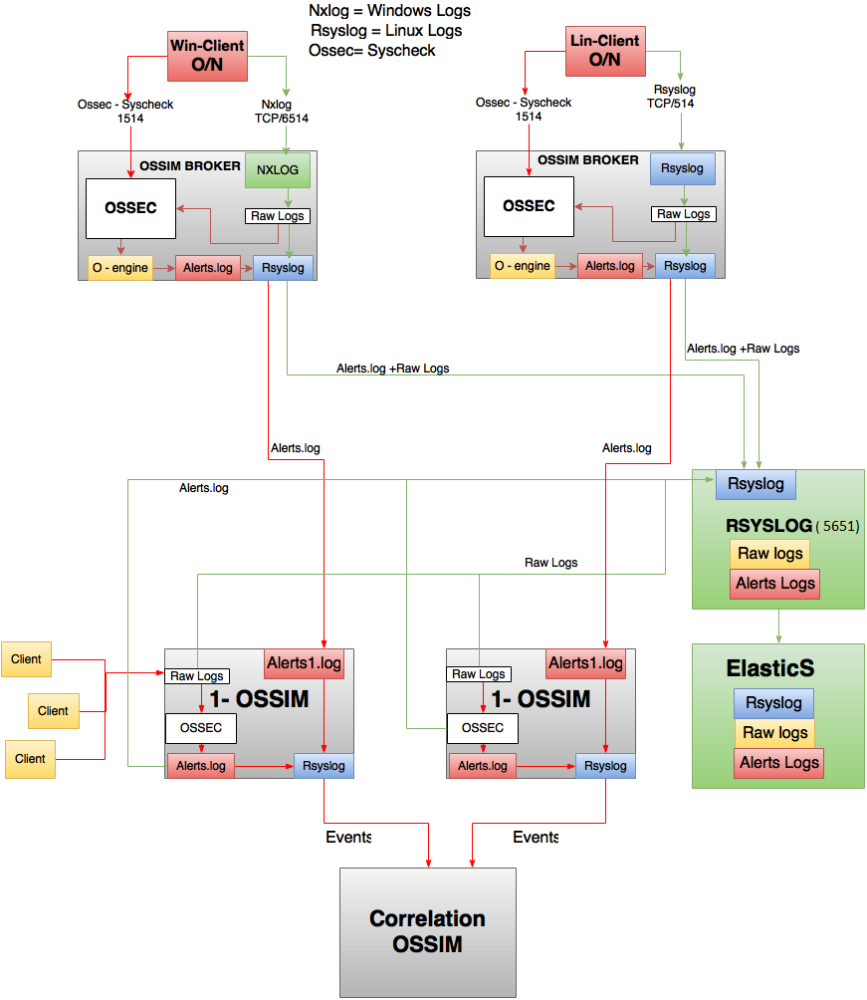

#Siber Olay, Açıklık, Risk İzleme ve Yönetim Sistemi Tasarımı
------

Bu dokümanda, Ahtapot Siber Olay, Açıklık, Risk İzleme ve Yönetim Sistemi tasarım ve çalışma prensibi anlatılmaktadır.

------

SIEM kapsamında istemciler üzerinde bulunan loglar SSL ile Nxlog’ un tcp 514. portu, syscheck bilgileri ise Ossec Agent’ ın 1514. portu ile Bölge-Ossimler üzerine gönderilir. Bölge-Ossimler içerisine gelen loglar 2 farklı dosya içerisine yazılarak merkezde bulunan 2 farklı Ossim makinesi içerisine Rsyslog ile şifreli ve sıkıştırılmış olarak gönderilirler. 

1. Events.log (Merkez Ossim)
2. Raw.log (ElasticSearch)

**1. Events.log:**
Ossec Agent port 1514'ten gelen syscheck bilgileri Ossim-Ossec kurallarından geçirilerek alerts.log içerisine yazılır. Nxlog üzerinden gelen loglar ise events.log içerisine yazılır. Ossim-Ossec events.log dosyasını okuyarak ossec kurallarından geçirir ve oluşan alarmları alerts.log içerisine yazmaktadır. Alerts.log dosyası Bölge-Ossim-Rsyslog tarafından okunarak MerkezOssim'e gönderilir. Merkez Ossim içerisinde Rsyslog BölgeOssimden gelen logları alerts1.log dosyası içerisine yazar ve kolerasyon yapma görevini üstlenen Merkez Ossim alers1.log dosyasını okuyarak Ossim web arayüzü içerisinde gelen loglar için event oluşturur ve korelasyon kurallarından geçirir.

**2. Raw.log:**
Clientlardan gelen Nxlog ve Ossec raw logları Bölge-Ossim içerisinde raw.log dosyasına yazdırılır. Raw.log dosyası Rsyslog ile Elasticsearch makinesinde elasticsearch içerisine gönderilerek logların raw olarak Kibana arayüzünde incelenmesi sağlanılır.

**Sayfanın PDF versiyonuna erişmek için [buraya](SIEM.pdf) tıklayınız.**
