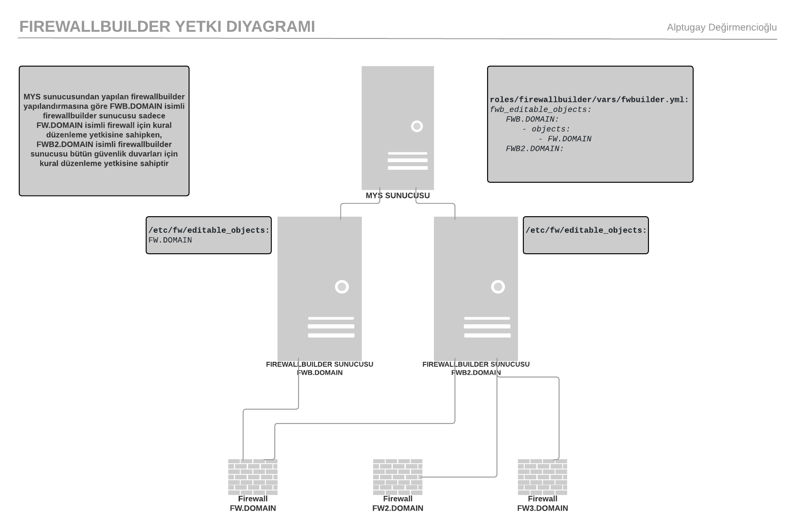
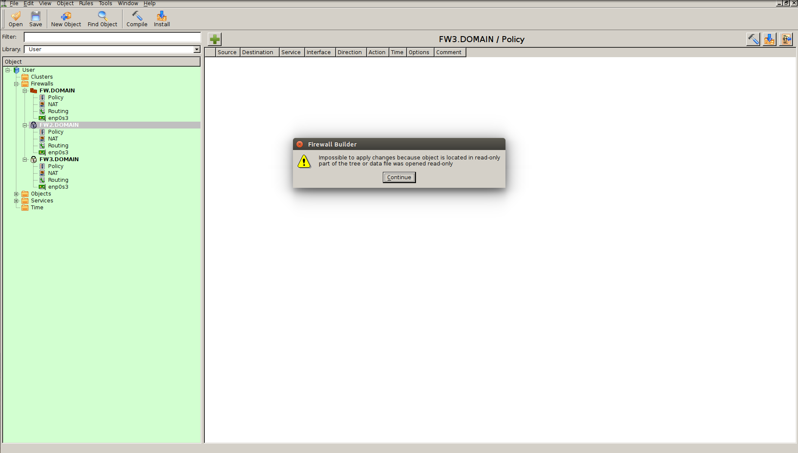

### FIREWALLBUILDER YETKİ MEKANİZMASI TASARIMI

Aşağıdaki görsel **FWB.DOMAIN** isimli firewallbuilder sunucusu için örnektir. Bu görselde görüldüğü üzere **FW2.DOMAIN** ve **FW3.DOMAIN** güvenlik duvarları üzerinde kilit işaret olduğu görülmektedir. Bu güvenlik duvarları üzerinde bir düzenleme yapılmak istendiğinde de resimde görülen uyarı mesajı gösterilmektedir. Sadece, mys üzerinden yetkilendirildiği şekilde **FW.DOMAIN** güvenlik duvarı için kural düzenleme yetkisi bulunmaktadır.

