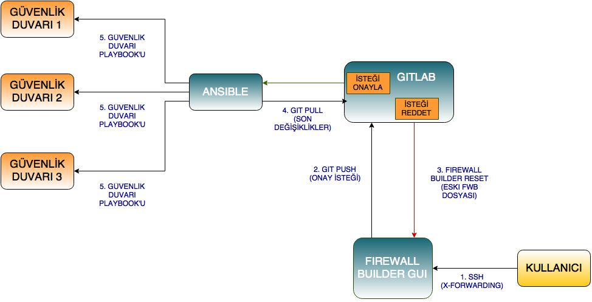

#Güvenlik Duvarı Yönetim Sistemi
------

Bu dokümanda, Güvenlik Duvarı Yönetim Sistemi tasarım ve çalışma prensibi anlatılmaktadır.

------

  * Güvenlik duvarı kurallarının güncellenmesi ve düzenlenmesi için gelecek talepler Redmine iş takibi ortamında yaratılacak görevler (task) üzerinden ilgili kişiye atanır.
  * Görevi üstlenen kişi ana terminal üzerinde koşan grafik arabirimde (FirewallBuilder GUI) ilgili kuralları yorum (comment) olarak görev numarası da girmek koşulu ile oluşturur.
  * Kuralların gereksinimleri karşıladığı denetlendikten sonra kurallar derlenir (compile), hata çıktısı alınmaz ise kurallar (install) kurulur. Kurulum işlemi yapılandırma sürüm takip sistemine girdi oluşturup, kurallara yazılan yorumu girdi mesajı (commit message) olarak kaydeder ve yapılandırma sürüm takip sistemine (Gitlab) gönderir.
  * Girdi, yapılandırma sürüm takip sistemi (Gitlab) üzerinden ana sürüme tümleştirme (merge) isteği olarak gönderilir ve yetkili kişi tarafından onay beklenir.
  * Tümleştirme isteği onay almazsa, yapılandırma yönetim sistemi kuralların gönderildiği sunucuya bağlanarak arabirimde bir uyarı yaratır. Uyarı içeriği yapılacak değişikliğin onaylanmadığını ve güvenlik duvarı yapılandırma grafik arabiriminin yeniden başlatılarak son çalışan sürüme döneceğini belirtir ve ilgili işlemi gerçekleştirir.
  * Görevi üstlenen kişi onay almayan değişikliği gözden geçirerek 2. basamaktaki işlemleri gerçekleştirir ve takiben işlemler gerçekleşir.
  * Girdi, yapılan düzenlemeler sonucunda onay aldıktan sonra yapılandırma yönetim sistemi (Ansible) yapılandırma sürüm takip sisteminden (Gitlab) kuralları çekerek, işleneceği güvenlik duvarı uçbirimlerine bağlanarak ilgili değişikliklerin bulunduğu playbookları oynatarak sistemi güncel hale getirir. 

**Sayfanın PDF versiyonuna erişmek için [buraya](guvenlik-duvari-yonetim-sistemi.pdf) tıklayınız.**
