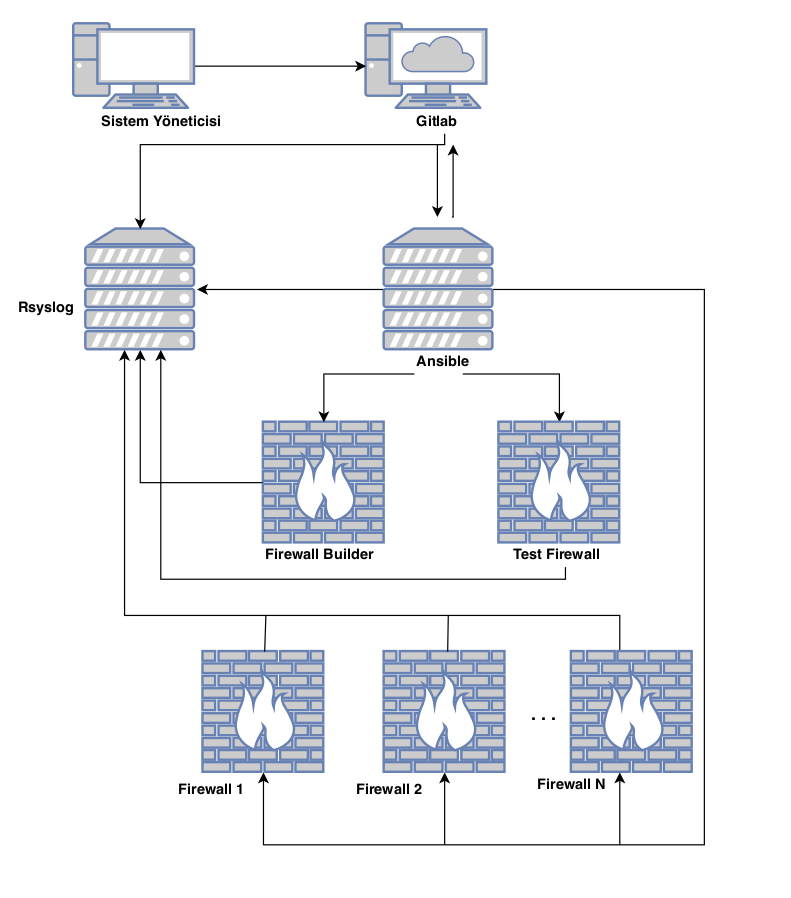

#Merkezi Yönetim Sistemi
------

Bu dokümanda, Merkezi Yönetim Sistemi tasarım ve çalışma prensibi anlatılmaktadır.

------

* Ahtapot projesinin temelini oluşturan Merkezi Yönetim Sisteminde, Sunucu yönetimleri Ansible sunucusu tarafından yapılmaktadır.
* Sistem Yöneticisi tarafından GitLab arayüzü kullanılarak Ansible Playbooklar üzerinde gerekli değişiklikler yapılarak, onaya gönderilir.
* Değişiklikler onaylandıktan sonra, Git'in sunduğu hook mekanizması kullanılarak Ansible makinasının güncel playbookları Git'ten çekilerek ilgili makina üzerinde çalıştırması sağlanır.
* FirewallBuilder makinası ile, Ahtapot Güvenlik Duvarı cihazları üzerinde koşacak olan güvenlik duvarı kurallarının yönetimi yapılmaktadır. FirewallBuilder arayüzü kullanılarak yapılan güvenlik duvarı kural oluşturma, düzenleme vb. işlemler Test Güvenlik Duvarı üzerinde test (yazım yönünden kontrol) edildikten sonra Ansible sunucusu tarafından Ahtapot Güvenlik Duvarlarında oynatılmak üzere otomatik olarak Playbook çalışır.
* Geçici Kural Tanımlama Sistemi ile, Ahtapot Güvenlik Duvarları üzerinde, belirlenmiş zaman aralığı için güvenlik duvarı kuralları belirlenebilmektedir. Çalışması istenen geçici güvenlik duvarı kuralı güvenlik duvarı yöneticisi tarfından önceden tanımlanmakta, yine yetkilendirilmiş (muhtemelen farklı) kişiler tarafından Ahtapot Güvenlik Duvarları üzerinde otomatik oynamaktadır. Bu yapı önemli sistemlerde normalde açık olması istenmeyen kuralların acil durumlarda sorunlara müdahale vb. maksatlarla açılabilmesine yapılan işlemlerin kayıt altına da alınması süretiyle güvenli şekilde imkan sağlamaktadır. Bu yetenek (elde edilen sonuç itibariyle) merkezi olarak yönetilebilen bir çeşit "port knocking" mekanizması gibi düşünülebilir.
* Yapıda kullanılan her sunucunun logları Rsyslog suncularında toplanmaktadır.

**Sayfanın PDF versiyonuna erişmek için [buraya](merkezi-yonetim-sistemi.pdf) tıklayınız.**
