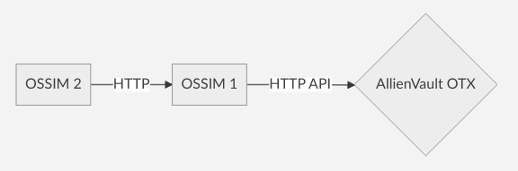

# AlienVault OTX Verilerinin Çevrimdışı OSSIM Cihazlarında Kullanımı
Bu dökümanda **OTX**(Open Threat Exchange) verilerinin internete bağlı olmayan cihazlara senkronizasyonu için yapılması gerekenler anlatılmaktadır.

## Tasarım

Sistemin çalışması için öncelikle internete bağlı **çevrimiçi** bir OSSIM kurulur.



**OSSIM 1**  Çevrimiçi

**OSSIM 2** Çevrimdışı

## Çalışma Mantığı

**1- OSSIM1** AlienVault OTX API'sini kullanarak verileri indirir.

**2-** Ayarlar bölümünde analatılacak olan **script, cron** yardımı ile indirilen bu verileri paketler ve **OSSIM1 üzerindeki HTTP** sunucusu aracılığı ile yayınlar.

**3- OSSIM2** verileri çevrimiçi olan OSSIM1 üzerinden indirir ve değişiklikleri uygular.

## Ayarlar

Ayarlar bölümü 4 aşamadan oluşur.
- OTX API KEY(anahtar) Alınması
- API Ayarları
- OSSIM1 Ayarları
- OSSIM2 Ayarları

> Birden fazla çevrımdığı OSSIM var ise OSSIM2 için yapılan herşey diğerleri için de yapılır.

**Aşağıdaki linklerden scriptler indirilir.**

[alienvault_otx_dump](../dosyalar/alienvault_otx_dump.sh)

[alienvault_otx_restore](../dosyalar/alienvault_otx_restore.sh)

### OTX API KEY(anahtar) Alınması

Aşağıdaki adres'e girilir ve üye olunur. Onay maili gönderecek. Gönderilen onay mailindeki link açılarak hesap onaylanır.

[https://otx.alienvault.com/](https://otx.alienvault.com/)  

Hesap onaylandıktan sonra yukarıdaki adrese giriş yapılır ve API menusüne basılır. Sağ taraftaki **Your OTX key** yazan kısımdaki anahtar butona basılarak kopyalanır.

Örnek API anahtar: sa3450e118f634584881a9835760546cce8b76b15877ef8577415fa073b5020a

### API Ayarları

Yeni kurulan **OSSIM1**'e giriş yapılır ve aşağıdaki menü açılır.  

**Configuration > OPEN THREAT EXCHANGE**

**OTX KEY** yazan alana kopyalanan anahtar yapıştırılır.

**Connect OTX ACCOUNT** denir.

İşlem başalılı olduktan sonra alt taraftaki tabloda OTX subscriptions(abonelikler) görülür.

Tercihe bağlı olarak **Contribute to OTX**: off yapılır

>Çevrimdışı cihazlarda otomatik olarak **off** olacak şekilde ayarlanmaktadır.

### OSSIM1 Ayarları

1. **alienvault_otx_dump.sh** script'i OSSIM1 cihazına gönderilir.

```
scp alienvault_otx_dump.sh root@ossim1:/usr/sbin/alienvault_otx_dump.sh
```

2. OSSIM1 cihazının komut satırına bağlanılır.
```
ssh root@ossim1
```

Açılan menüde **Jailbreak System** yazan kısıma gelinir ve **OK** denir. Çıkan soruya **Yes** denir.

3. Script çalıştırma izni ayarlanır.

```
chmod 744 /usr/sbin/alienvault_otx_dump.sh
```

4. Cron dosyası oluşturulur.

```
touch /etc/crond.d/alienvault_otx_dump.cron
```

Aşağıdaki alan bu dosyanın içerisine kopyalanır.
```
30 * * * * root /usr/sbin/alienvault_otx_dump.sh
```

5. Cron servisi yeniden başlatılır.

```
/etc/init.d/cron restart
```

### OSSIM2 Ayarları

1. **alienvault_otx_restore.sh** script'i OSSIM2 cihazına gönderilir.

```
scp alienvault_otx_restore.sh root@ossim2:/usr/sbin/alienvault_otx_restore.sh
```

2. OSSIM2 cihazının komut satırına bağlanılır.
```
ssh root@ossim2
```

Açılan menüde **Jailbreak System** yazan kısıma gelinir ve **OK** denir. Çıkan soruya **Yes** denir.

3. Script çalıştırma izni ayarlanır.

```
chmod 744 /usr/sbin/alienvault_otx_restore.sh
```

4. Cron dosyası oluşturulur.

```
touch /etc/crond.d/alienvault_otx_restore.cron
```

Aşağıdaki alan bu dosyanın içerisine kopyalanır.
```
30 * * * * root /usr/sbin/alienvault_otx_restore.sh OSSIM1_IP_ADRES
```

**OSSIM1_IP_ADRES** yazan bölüme OSSIM1'in IP adresi yazılır.

5. Cron servisi yeniden başlatılır.

```
/etc/init.d/cron restart
```

## Kontrol
**OSSIM2** cihazına web üzerinden giriş yapılır. Aşağıdaki menü açılır ve internete çıkan **OSSIM1** ile aynı olduğu görülür.  

**Configuration > OPEN THREAT EXCHANGE**


**Ahtapot Projesi**

Fatih USTA

fatihusta@labrisnetworks.com
