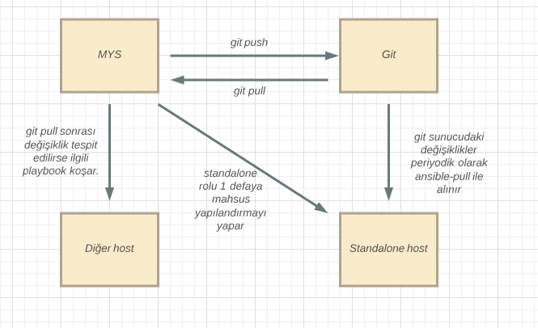

#Smartstate Rolü ve Dizaynı
------

Smartstate rolü uç sistemlerin yapılandırma değişiklerini git sunucu üzerinden çekmesi ve kendi üzerinde çalıştırması ya da MYS cihazının değişiklileri otomatik bir şekilde uç birimlere aktarabilmesi için kullanılmaktadır.

Bu dökümanda bu rolün dizaynı anlatılmıştır. 

------

* Kurulum dökümanında anlatıldığı gibi bir host smartstate host olarak eklendiginde
 ve playbook calistirildiginda, uç makinaya ansible kurulur. Cron yapılandırması 
yapılarak makinanın belirli zamanlarda yapılandırma değişiklikleri kontrol edilir. 
Cron zamanı vars dosyasından ayarlanabilir. 

* Bu yapılandırmanın MYS tarafında her push tarafından tetiklenmesi isteniyorsa aşağıdaki gibi alias tanımlanmalıdır. 

$ **git config alias.xpush '!git push $1 $2 && /opt/ahtapot/smartstate.py --smart-trigger'**


* Son olarak herhangi bir yapılandırmanın her bir commit sonrası uygulanması için post-commit hookuna aşağıdaki komut eklenir.
**/opt/ahtapot/smartstate.py --smart-push** 

* Bu komut playbook tarafından cron a eklenmektedir. İstenildiği taktirde manual olarak da çalıştırılabilir. Aşağıdaki gibi yardım çıktısı alınabilir.  
```
~$ /opt/ahtapot/smartstate.py --help
usage: smartstate.py [-h] [--host HOST] [--smart-pull] [--pull] [--smart-push]
                     [--push] [--smart-trigger] [--trigger]
                     [--check-inventory] [--delay]

optional arguments:
  -h, --help         show this help message and exit
  --host HOST        fqdn of host that playbook will run on. Needed when pull
                     is used
  --smart-pull       Pull playbooks and run if needed. It should be run on
                     remote device
  --pull             Pull playbooks and run regardless it changes or not
  --smart-push       Push changed playbooks. It should be used on post-commit
                     hook
  --push             Push all playbooks
  --smart-trigger    Trigger host to run smart pull
  --trigger          Trigger host to run pull
  --check-inventory  Check inventory file too on smart pull and push
  --delay            Delay random time before run

```
* Bu betik loglarını ön tanımlı olarak **/var/log/ahtapot/smartstate.log** dosyasına yazar.

* Smartstate playbooku çalıştırıldıtan sonra makinalar aşağıdaki şemaya uygun çalışır. 





**Sayfanın PDF versiyonuna erişmek için [buraya](smartstate-dizayn.pdf) tıklayınız.**
