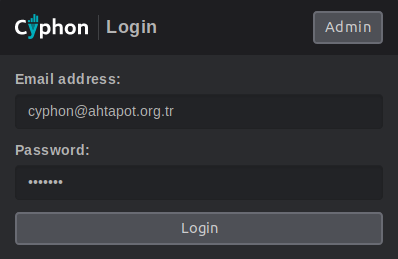
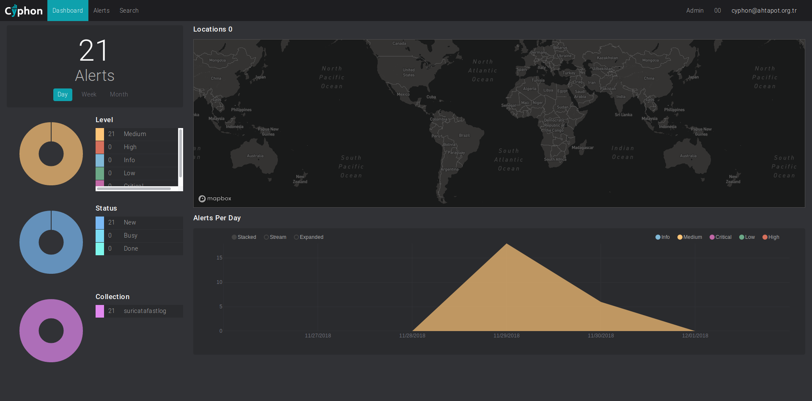
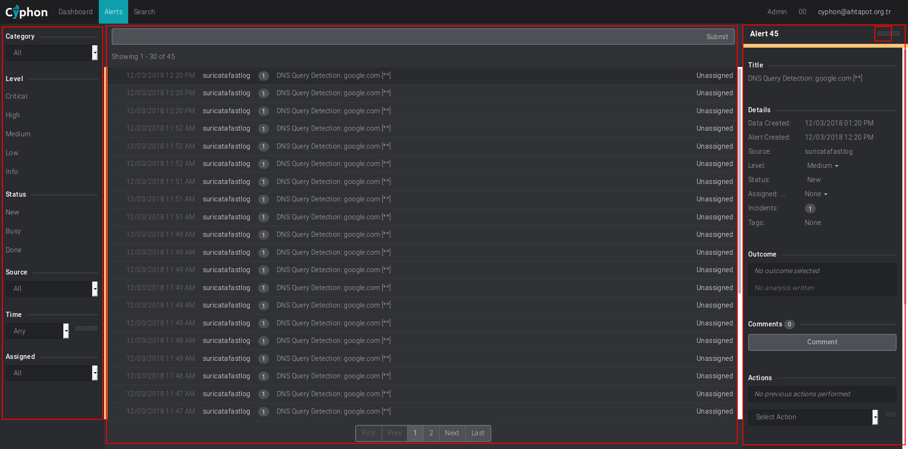
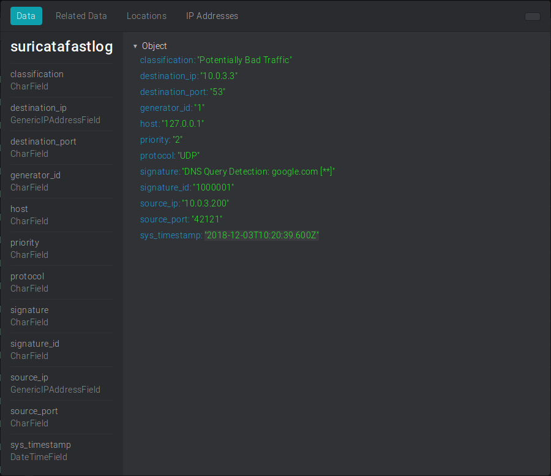
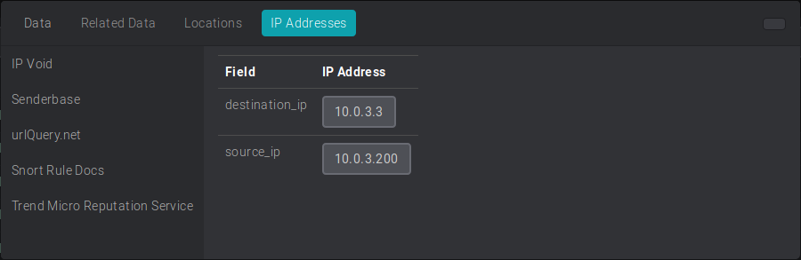
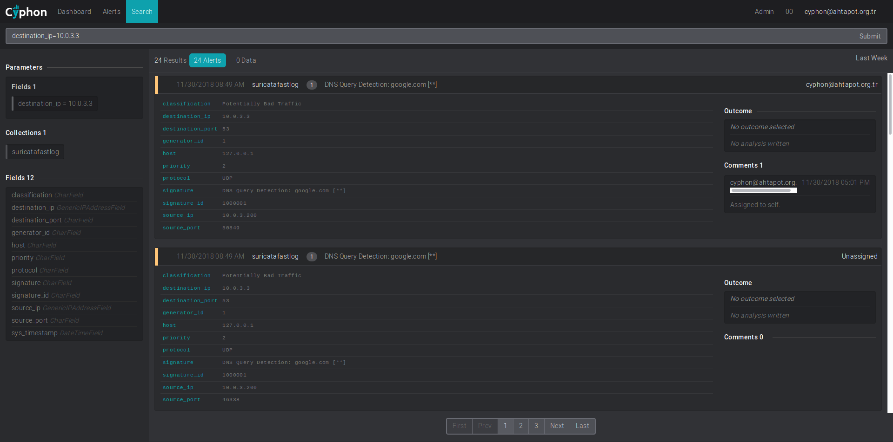
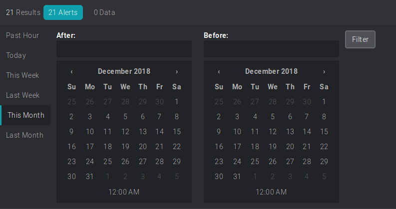
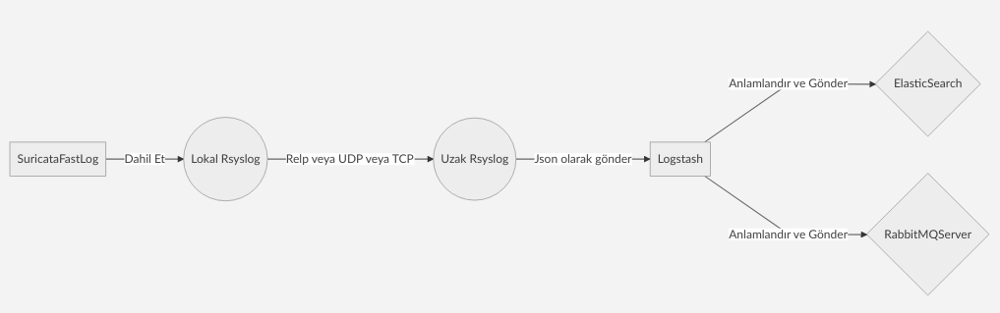
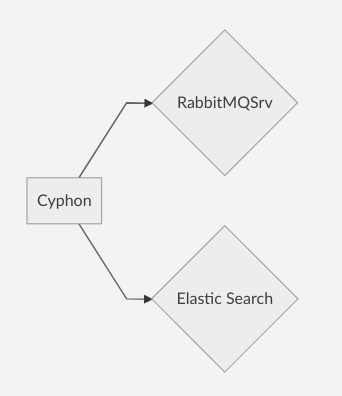

# Cyphon Kullanımı

Bu dökümanda olay yönetimi yazılımı Cyphon'un kullanımı anlatılmıştır.
Kullandığınız herhangi bir internet tarayıcısı üzerinden cyphon'a erişim yapılır.
http://cyphon_ip_address



## Dashboard(Pano)
Sisteme giriş yapıldıktan sonra aşağıdaki gibi **pano** ekranı görüntülenir.


Bu ekranda gelen uyarılara ait istatistiksel veriler yer alır. Bu ekranda **gün**, **hafta** ve **ay**  filtreleri kullanılarak ekrandaki verileri geçmişteki durumları görüntülenebilir.
>**Not:** Harita kullanımı için aşağıdaki siteye üye olunması gerekmektedir. Site'nin vermiş olduğu APIKEY'i kurulum sırasında tanımlanmış olmalıdır. Harita uygulaması online olarak çalışmaktadır. Site belli sayıdaki sorguları ücretsiz olarak servis etmektedir. 
>Daha fazla bilgi için: [https://www.mapbox.com/pricing/](https://www.mapbox.com/pricing/)

## Alerts(Uyarılar)
Bu ekranında oluşan bütün uyarılar görüntülenir.


Bu ekran **Filtre bölümü, Uyar bölümü, Uyarı düzenleme bölümü** olmak üzere 3 bölümden oluşur.

### Filtre Bölümü
Bu alanda olay kayıtları **kategori, seviye, olay kaynağı, zaman ve ilgili kullanıcı** filtreleri kullanarak filtre yapılabilir.

### Uyarı Bölümü
Bu alanda uygulanan filtre'ye göre uyarılar görüntülenenir. İstenirse üst bar üzerindeki arama alanı kullanılarak uyarılar içinde arama yapılabilir.

### Uyarı düzenleme bölümü
Uyarı üzerine tıklanarak uyarı düzenleme alanı açılır. Bu ekranda uyarının **seviyesi, hangi kullanıcıya atanacağı** gibi alanlar yer alır. Ayrıca uyarıya ilişkin not yazılabilir ve uyarının detayları görüntülenebilir.

Bu ekranın sağ üst köşesindeki butona basılarak uyarı detaylarına ulaşılabilir.


**IP addressses** sekmesinde IP ile ilgili bilgi edinmek için araçlar bulunur.


## Search (Arama)
Geçmiş uyarıları aramak için bu menü kullanılır. 
Arama alanına sol tarafta yer alan ve olay kaydına ilişkin **Fields**'lar görüntülenir. Bu anahtar kelimeler kullanılarak arama yapılabilir. 


Sağ tarafta bulunan **last weak, past hour** gibi ismi olan butona basılır. Tarih filtresi açılır.


# Cyphon Uyari Olusturulmasi (Rsyslog)

Bu bölümde Cyphon'a örnek bir log kaynağının rsyslog ile nasıl entegre edileceği anlatışmıştır.
Örnek olarak **suricata** uygulamasının **fastlog** tipindeki log kaynağı kullanılacaktır.

>**Not:** Cyphon'ın ansible ile kurulumunun başarılı bir şekilde yapıldığı varsayılmaktadır. Ansible ile cyphon kurulumu için [bakınız.](../kurulum-yonergeleri)

## Temel tasarım
**Log Gönderme**



Yukarıdaki şemada görüldüğü üzere ;
1- Log dosyası Suricata üzerindeki Lokal rsyslog'a dahil edilir ve istenilen yöntemle Logstash'in kurulu olduğu cihazdaki Uzak Rsyslog'a gönderilir. (Eğer relp kullanılmıyor ise loglar buradan json olarak doğrudan Logstash'e gönderilebilir.)
2- Logstash üzerindeki Rsyslog gelen logu Json formatında Logstash'e iletir.
3- Logstash gelen json formatındaki veriyi parse edip anlamlandırır.
4- Logstash anlamlandırdığı veriyi ElasticSearch ve RabbitMQ Sunucusuna gönderir.

**Cyphon Log okuma**




Cyphon gelen olay kayıtlarını RabbitMQ Sunucusu ve ElasticSearch ile bağlantı kurarak okur.

## 1- Suricata fast log'un Rsyslog'a dahil edilmesi
**Örnek rsyslog yapılandırma dosyası**

/etc/rsyslog.d/suricata.conf

```
#Only needs to be loaded once, like most rsyslog modules  
$ModLoad imfile
  
#path to the file which you want to monitor  
$InputFileName /var/log/suricata/fast.log
  
#The tag apache can be changed to whatever you'd like  
$InputFileTag suricatafastlog:
  
#the name of file within rsyslogs working directory  
$InputFileStateFile suricatafastlog-stat
  
#By default this is set to 'notice'  
$InputFileSeverity notice
  
#This is necessary for file monitoring (no parameters)  
$InputRunFileMonitor
  
#Set to how often the file should be polled. (default = 10s)  
$InputFilePollInterval 1

if $programname == 'suricatafastlog' then @10.0.3.16:514
```

Bu ayar dosyasında dikkat edilmesi gereken alanlar;
1- **$InputFileName** : Log dosyasının tanımlandığı alan.
2- **InputFileTag** : Program adı olarak belirlenir.
3- **InputFileStateFile** Durum dosyası. Program adı ile aynı yapılması önerilir.
4- **if $programname == 'suricatafastlog' then @10.0.3.16:514** Logun gönderildiği satır. Program adı **InputFileTag kısmında belirtildiği gibi yazılmalıdır.

Protokol seçimi aşağıdaki şekilde yapılmaktadır.
@10.0.3.16 = UDP
@@10.0.3.16 = TCP

**Servis yeniden başlatılır.**

```
systemctl restart rsyslog
```

## 2- Logstash üzerinde Rsyslog yapılandırması
Rsyslog ile gelen suricata loglarını Json olarak Logstash'e iletilmesi için log gönderme formatı hazırlanır. Bunun için aşağıdaki örnek template dosyası oluşturulur.
**Örnek Rsyslog Json Log Formatı**

/etc/rsyslog.d/logstash-json-template.conf
```
template(name="logstash-json-template" type="list") {
	constant(value="{")
	constant(value="\"@timestamp\":\"") property(name="timereported" dateFormat="rfc3339")
	constant(value="\",\"@version\":\"1")
	constant(value="\",\"message\":\"") property(name="msg" format="json")
	constant(value="\",\"sysloghost\":\"") property(name="hostname")
	constant(value="\",\"severity\":\"") property(name="syslogseverity-text")
	constant(value="\",\"facility\":\"") property(name="syslogfacility-text")
	constant(value="\",\"programname\":\"") property(name="programname")
	constant(value="\",\"procid\":\"") property(name="procid")
	constant(value="\"}\n")
}
```

Template tanımlaması yapıldıktan sonra loglar Logstash'e gönderilir.

**Örnek Rsyslog Yapılandırması**

/etc/rsyslog.d/suricata-output-logstash.conf

```
# This line sends all lines to defined IP address at port 10514,  
# using the "logstash-json-template" format template  
if $fromhost-ip != '127.0.0.1' and $programname == "suricatafastlog" then @127.0.0.1:10514;logstash-json-template
```

Bizim örneğimizde logstash aynı cihazda olduğu için 127.0.0.1 ip adresine gönderildi. Logstash'in çalıştığı cihazın IP adresi ve Logstash port tanımı yapılır.

Yukarıdaki json yapılandırması ile Logstash'e aşağıdaki gibi bir log gönderildi.

```
{
  "@timestamp": "2018-11-30T08:49:22+03:00",
  "@version": "1",
  "message": " 11/30/2018-08:49:22.417100  [**] [1:1000001:1] DNS Query Detection: google.com [**] [Classification: Potentially Bad Traffic] [Priority: 2] {UDP} 10.0.3.200:46338 -> 10.0.3.3:53",
  "sysloghost": "suricata",
  "severity": "notice",
  "facility": "local0",
  "programname": "suricatafastlog",
  "procid": "-"
}
```

## 3- Logstash yapılandırması
Rsyslog ile logstash'e gönerilen logların anlamlandırılıp ElastcihSearch ve RabbitMQ sunucusununa gönderilmesi için örnekteki gibi bir yapılandırma dosyası hazırlanır.

/etc/logstash/conf.d/rsyslog.conf

```
# This input block will listen on port 10514 for logs to come in.  
# host should be an IP on the Logstash server.  
# codec => "json" indicates that we expect the lines we're receiving to be in JSON format  
# type => "rsyslog" is an optional identifier to help identify messaging streams in the pipeline.  
  
input {
	udp {
		host => "127.0.0.1"  
		port => 10514  
		codec => "json"  
		type => "rsyslog"  
	}
}
  
# This is an empty filter block. You can later add other filters here to further process  
# your log lines  
  
filter {
	if [programname] == "suricatafastlog" {
  
		# parse the message into individual fields  
		grok {  
			match => { "message" => "(?<ts>[\w].*?\.\d+).*?\[(?<action>.*?)\]\s+\[(?<generator_id>.*?):.*?(?<signature_id>.*?):.*?\]\s(?<signature>.*?)\s\[Classification:\s(?<classification>.*?)\]\s\[Priority:\s(?<priority>.*?)\].*?{(?<protocol>.*?)\}\s(?<source_ip>.*?):(?<source_port>.*?)\s-\>\s(?<destination_ip>.*?):(?<destination_port>.*)"}  
		}  
  
		# remove the original message if parsing was successful  
		if !("_grokparsefailure" in [tags]) {  
			mutate {  
				remove_field => [ "message" ]  
			}  
		}  
  
		# parse the timestamp and save in a new datetime field  
		if [ts] {  
			date {  
				locale => "en"  
				match => [ "ts", "MM/dd/YYYY-HH:mm:ss.SSSSSS" ]  
				target => "sys_timestamp"  
			}  
		  
			# remove the original timestamp if date parsing was successful  
			if !("_dateparsefailure" in [tags]) {  
				mutate {  
					remove_field => [ "ts" ]  
				}  
			}  
		}  
	}
}
  
filter {
	  
	uuid {
		target => "@uuid"  
	}
	  
	mutate {
		add_field => {  
			"collection" => "elasticsearch.cyphon.%{programname}"  
		}  
	}
}
  
# This output block will send all events of type "rsyslog" to Elasticsearch at the configured  
# host and port into daily indices of the pattern, "rsyslog-YYYY.MM.DD"  
  
output {
  
	elasticsearch {
		hosts => [ "127.0.0.1:9200" ]  
		index => "cyphon-%{+YYYY-MM-dd}"  
		document_id => "%{@uuid}"  
	}
	  
	rabbitmq {
		host => "127.0.0.1"  
		port => 5672  
		exchange => "cyphon"  
		exchange_type => "direct"  
		key => "watchdogs"  
		user => "guest"  
		password => "guest"  
		vhost => "cyphon"  
		durable => true  
		persistent => true  
	}
}
```

>**Not:** Bizim test ortamımızda bütün bileşenlar aynı cihaz üzerinde kurulduğu için IP adresi olarak 127.0.0.1 kullanılmıştır. Sizin yapılandırmanıza göre ilgili bileşenlerin kurulu olduğu sunucuların IP adresleri yazılmalıdır.


Yukarıdaki örnek yapılandırmayı detaylandıralım.

Logstash ayar dosyası temel olarak 3 bölümden oluşur.

- **input:** Verinin logstash'e hangi yöntem ile alınacağının belirlendiği bölüm.
- **filter:** Veri üzerinde işlem yapılan bölüm.
- **output:** işlem yapıldıktan sonra verinin gönderileceği yerler.

**INPUT Bölümü**

```
input {
	udp {
		host => "127.0.0.1"  
		port => 10514  
		codec => "json"  
		type => "rsyslog"  
	}
} 
```

Örnekte kullanılan modül **UDP**. Belirlenen port UDP protokolü ile çalışacaktır.
**host:** Logstash'in istekleri kabul edeceği sunucu üzerindeki IP adressi. Burada belirlenen ip adresi üzerinde servis dinelemeye başlar.
**port:** Logstash'in dinleyeceği port.
**codec:** Logstash'in gelen logu anlamlandırması için kullanılacak codec türü. Bizim örneğimizde rsyslog ile logları json olarak gönderdiğimiz için codec **json** olarak belirlenmiştir.
**type:** Logun hangi kaynaktan geldiğine ilişkin tanımlayıcı ifade.

**FILTER Bölümü**

```
filter {
	if [programname] == "suricatafastlog" {
  
		# parse the message into individual fields  
		grok {  
			match => { "message" => "(?<ts>[\w].*?\.\d+).*?\[(?<action>.*?)\]\s+\[(?<generator_id>.*?):.*?(?<signature_id>.*?):.*?\]\s(?<signature>.*?)\s\[Classification:\s(?<classification>.*?)\]\s\[Priority:\s(?<priority>.*?)\].*?{(?<protocol>.*?)\}\s(?<source_ip>.*?):(?<source_port>.*?)\s-\>\s(?<destination_ip>.*?):(?<destination_port>.*)"}  
		}  
  
		# remove the original message if parsing was successful  
		if !("_grokparsefailure" in [tags]) {  
			mutate {  
				remove_field => [ "message" ]  
			}  
		}  
  
		# parse the timestamp and save in a new datetime field  
		if [ts] {  
			date {  
				locale => "en"  
				match => [ "ts", "MM/dd/YYYY-HH:mm:ss.SSSSSS" ]  
				target => "sys_timestamp"  
			}  
		  
			# remove the original timestamp if date parsing was successful  
			if !("_dateparsefailure" in [tags]) {  
				mutate {  
					remove_field => [ "ts" ]  
				}  
			}  
		}  
	}
}
```

Yukarıdaki örnek filter bölümündeki **if** cümlesinde rsyslog ile gönderilen logun program adı **suricatafastlog** ise aşağıdaki işlemleri yap demiş olduk. Her farklı kaynak için bu şekilde **if** cümlesi ile program adı eşleştirilerek gelen loglar anlamlandırılır. 

Rsyslog ile gelen json logu içinde  **message** anahtarı kısmında suracata log kaydı yer almaktadır. 
Gelen **message** logstash ayar dosyasında **grok** bölümünde regex ile parse edilip anlamlandırılır.

**_grokparsefailure** kontrolünde **message** düzgün parse edilir ise artık message alanın ihtiyaç olmadığı için **massage** anahtarı json içinden çıkartılır.
**if [ts]** ile başlayan kısımda tarih formatını belirleyip **sys_timestamp** anahtarına **date** tipinde aktarılması sağlandıktan sonra **ts** anahtarına ihtiyaç kalmadığı için json'dan kaldırılır. Bu sayede logun gerçekte üretildiği zaman kullanılarak log kaydı oluşturulmuş oldu.

Bunun için regex yazılması gerekmektedir.
Regex içindeki **grup** isimleri **json anahtar-değer** ikilisine otomatik olarak çevrilir.
Regex yazmak için **regex101.com** adresi kullanılabilir.
Regex programlama dili **javascript**'dir.
Aşağıdaki Örnek Log ve Regex'i test edebilirsiniz.

**Suricata fast log**

```
 11/30/2018-08:49:22.417100  [**] [1:1000001:1] DNS Query Detection: google.com [**] [Classification: Potentially Bad Traffic] [Priority: 2] {UDP} 10.0.3.200:46338 -> 10.0.3.3:53
```

**Suricata FastLog Regex**

```
(?<ts>[\w].*?\.\d+).*?\[(?<action>.*?)\]\s+\[(?<generator_id>.*?):.*?(?<signature_id>.*?):.*?\]\s(?<signature>.*?)\s\[Classification:\s(?<classification>.*?)\]\s\[Priority:\s(?<priority>.*?)\].*?{(?<protocol>.*?)\}\s(?<source_ip>.*?):(?<source_port>.*?)\s-\>\s(?<destination_ip>.*?):(?<destination_port>.*)
```

Filter bölümünden diğer bir kısım olan **remove_field** kısmında ise message alanı düzgün parse edilmiş ise message alanını log'dan çıkart anlamına gelmektedir.

**Filter bölümü devamı**

```
filter {
  
	uuid {
		target => "@uuid"  
	}
	  
	mutate {
		add_field => {  
			"collection" => "elasticsearch.cyphon.%{programname}"  
		}  
	}
}
```

Yukarıdaki filter ile her bir log için logstash tarafından üretilen **uuid**(tekil log numarası) ve elasticsearch için **collection**(Cyphon için gerekli koleksiyon adı) adı belirledik. Burada belirlenen  **@uuid** ve **collection** otomatik olarak **json** loguna eklenmiş oldu. 
Collection alanını program adına göre otomatik oluşturarak aynı tip uygulamalardan gelen logları aynı koleksiyon altında topllandık.

**OUTPUT Bölümü**

```
output {
  
	elasticsearch {
		hosts => [ "127.0.0.1:9200" ]  
		index => "cyphon-%{+YYYY-MM-dd}"  
		document_id => "%{@uuid}"  
	}
 
	rabbitmq {
		host => "127.0.0.1"  
		port => 5672  
		exchange => "cyphon"  
		exchange_type => "direct"  
		key => "watchdogs"  
		user => "guest"  
		password => "guest"  
		vhost => "cyphon"  
		durable => true  
		persistent => true  
	}
}
```

**Elasticsearch** alanında **hosts** ile elasticsearch sunucusu tanımlanıp **index** ile kayıtların günlük olarak saklanmasını sağlayacak sınıflandırma ismi belirlenir. Daha önce oluşturduğumuz @uuid'de eklenerek elasticsearch'e gönderilir.

**RabbitMQ** Sunucusunda aşağıdaki ayarlar yapılmalıdır. Eğer ansbile ile kurulum yapılmışsa bu ayarlara gerek yoktur.

/etc/rabbitmq/rabbitmq-env.conf

```
NODE_IP_ADDRESS=127.0.0.1
NODE_PORT=5672
NODENAME=rabbit1
```

RabbitMQ servisi yeniden başlatılır.

```
systemctl restart rabbitmq-server
```

RabbitMQ sunucusunda **kullanıcı, vhost, exchange** kayıtları oluşturulur.
Öntanımlı kullanıcı adı **guest** şifresi **guest**'dir. Ancak aşağıdaki şekilde yeni bir kullanıcı tanımlama yapılmadan aktif olmamaktadır.

```
rabbitmqctl add_vhost cyphon
rabbitmqctl add_user cyphon_user ahtapot
rabbitmqctl set_user_tags cyphon_user administrator
rabbitmqctl set_permissions -p cyphon cyphon_user ".*" ".*" ".*"
rabbitmqctl set_permissions -p cyphon guest ".*" ".*" ".*"

rabbitmqadmin declare exchange name=cyphon type=direct durable=true
```

**Logstash** yeniden başlatılır.

```
systemctl restart logstash
```

Output bölümünde logları elasticsearch ve rabbitmq sunucusuna gönderdik.
Elasticsearch sunucusuna aşağıkida gibi bir log göndermiş olduk.

```
{
  "@timestamp": "2018-12-03T08:52:04.000Z",
  "@version": "1",
  "sysloghost": "suricata",
  "severity": "notice",
  "facility": "local0",
  "programname": "suricatafastlog",
  "procid": "-",
  "type": "rsyslog",
  "host": "127.0.0.1",
  "action": "**",
  "generator_id": "1",
  "signature_id": "1000001",
  "signature": "DNS Query Detection: google.com [**]",
  "classification": "Potentially Bad Traffic",
  "priority": "2",
  "protocol": "UDP",
  "source_ip": "10.0.3.200",
  "source_port": "53574",
  "destination_ip": "10.0.3.3",
  "destination_port": "53",
  "sys_timestamp": "2018-12-03T09:52:03.964Z",
  "@uuid": "b7d50f32-8c95-4d38-8326-14ea7652fbdf",
  "collection": "elasticsearch.cyphon.suricatafastlog"
}
```

## 4- Cyphon Ayarları

Cyhon tarafından logların okunup alert olarak algılanması için Cyphon **admin** paneline bağlanılarak gerekli ayarlar yapılır.
Bunun için **https://cyphon_ip_address** girilir ve sağ üst taraftaki **admin** butonuna basılır.
Admin panelindeki yapılandırmada temel mantık elasticsearch'e gönderilen json log içindeki alanları cyphon'a tanımlamak olarak özetlenebilir.
Sırası ile aşağıdaki adımlar uygulanır.

### Bottle Field Tanımları
Bu kısımda json içindeki gerekli anahtar-değer ikilisinin tanımları yapılır.
Bunun için **Shaping Data > Bottle fields** alanına tıklanır.
Açılan ekranda **Add bottle Field** denir ve aşağıdaki tabloda yer alanlar tek tek tanımlanır.

|Field Name		   |Field Type					   |Target Type
|------------------|-------------------------------|-----------------------------|
|sys_timestamp	   	   |DateTimeField	                 |DateTime
|host			   |CharField
|generator_id	   |CharField
|signature_id	   |CharField
|signature	       |CharField
|classification	   |CharField	                     |Keyword
|priority	       |CharField
|protocol	       |CharField
|source_ip	       |GenericIPAddressField	         |IPAddress
|source_port	   |CharField
|destination_ip	   |GenericIPAddressField	         |IPAddress
|destination_port  |CharField

### Bottle Log Seçimi
Bu kısımda log içinden istenilen alanlar seçilir ve bir paket oluşturulur.
Bunun için **Shaping Data > Bottles** alanına tıklanır.
Açılan ekranda **Add bottle** denir ve istenilen loglar seçilir. Hepsini seçmek için choose all butonuna basılır.
**name:** "b_suricatafastlog" olarak ayarlanabilir.

### Container oluşturma
Bu kısımda üretilecek uyarının ekranda nasıl gözükeceği belirlenir.
Bunun için **Shaping Data > Containers** alanına tıklanır.
Açılan ekranda **Add Container** denir. Açılan ekranda aşağıdaki tanımlar yapılır.
**name:** c_suricatafastlog Herhangi bir isim verilir.
**bottle:** b_suricatafastlog Bir önceki menüde oluşturulan bottle seçilir.

Alert Görünüm yapılandırması
**Taste** kısmında uyarı oluştuğunda hangi log alanlarının gözükeceği seçilir. Buradaki seçimler daha önce tanımlanan bottle fields kısmından gelmektedir.
**Authhor:** host
**Title:** signature
**Content:** classification
**Datetime:** sys_timestamp

### Storing Data
Bu bölümde elasticsearch tanımı yapılır. 
Bunun için **Storing Data > Warehouses** bölümüne geçilir.
**Add warehouse** butonuna basılır ve aşağıdaki tanımlar yapılır.
**Backend:** elasticsearch
**Name:** cyphon
**Time series** işaretlenir.

İkinci olarak
Bunun için **Storing Data > # Collections** bölümüne geçilir.
**Add Collection** denir ve aşağıdaki tanımlar yapılır.
**Warehouse:** elasticsearch.cyphon 
**Collaction name:**  suricatafastlog 

>Logstash içinde collection olarak **elasticsearch.cyphon.%{programname}** bu şekilde bir tanım yapmıştık.
>Logstash içinde Index formatı olarak günlük olacak şekilde bu **cyphon-%{+YYYY-MM-dd}** bu tanımı yapmıştık.

### Distillery
Bu bölümde datanın elasticsearch üzerindeki eşleştirilmesi yapılır. 
Bunun için **Distilling Data > Distilleries** bölümüne geçilir.
**Add distillery** butonuna basılır ve aşağıdaki tanım yapılır.
**Name:** suricatafastlog
**Collection:** elasticsearch.cyphon.suricatafastlog
**Container:** c_suricatafastlog
**is shell** işaretlenir.


### Watchdog
Bu kısımda uyarı önceliklendirme kuralları tanımlanır.
**1-** Data Rules tanımlanır. 
Bunun için **Sifting Data > JSON Data > Data Rules** bölümünden **Add data rule** denilerek aşağıdaki tanımlar ayrı ayrı yapılır.

|DataRule Name	        		|Field Name		|Operator		|Value
|-------------------------------|---------------|---------------|------|
|programname_equals_suricata	|programname	|equals			|suricatafastlog
|priority_equals_1				|priority		|equals			|1
|priority_equals_2				|priority		|equals			|2
|priority_equals_3				|priority		|equals			|3

**2-** Data Data Sieves tanımlanır.
Bunun için **Sifting Data > JSON Data > Data Sieves** bölümünden **Add data Sieve** denilerek aşağıdaki tanımlar ayrı ayrı yapılır.

|Name	 |Logic |Node1 Object (Type:data rule)|Node2 Object (Type:data rule)
|---------------------------------|-------------------------------------|---------------|------|
|Suricata alert - high priority	  |AND	 |programname_equals_suricatafastlog |priority_equals_1
|Suricata alert - medium priority |AND	 |programname_equals_suricatafastlog |priority_equals_2
|Suricata alert - low priority	  |AND	 |programname_equals_suricatafastlog |priority_equals_3
|Suricata alert - unknown priority|AND	 |programname_equals_suricatafastlog	

**3-** Configuring Alert
Bu bölümde alert oluşturulması sağlanır.
Bunun için **Configuring Alert > Watchdogs** bölümüne geçilir.
**Add wathdog** denir ve aşağıdaki ayarlar yapılır.
**Name:** suricatafastlog
**Enabled** işaretlenir.

**Triggers** Bölümünde aşağıdaki tanımlar yapılır.

|DataSieve	        	|Alert Level	|Rank
|-------------------------------|---------------|---------------|------|
|Suricata alert - high priority	|High			|0
|Suricata alert - medium priority	|Medium			|10
|Suricata alert - low priority	|Low			|20
|Suricata alert - unknown priority	|Medium			|30

Bu tanımlamalardan sonra örnek log üretilir. Cyphon arayüzünde uyarılar görüntülenmelidir.

Daha fazla bilgi için;
https://cyphon.readthedocs.io
https://www.elastic.co/guide/en/logstash/current/index.html
https://www.elastic.co/guide/en/elasticsearch/reference/current/index.html
https://www.rabbitmq.com/documentation.html

**Ahtapot Projesi**

Fatih USTA
fatihusta@labrisnetworks.com


