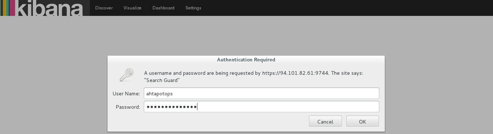
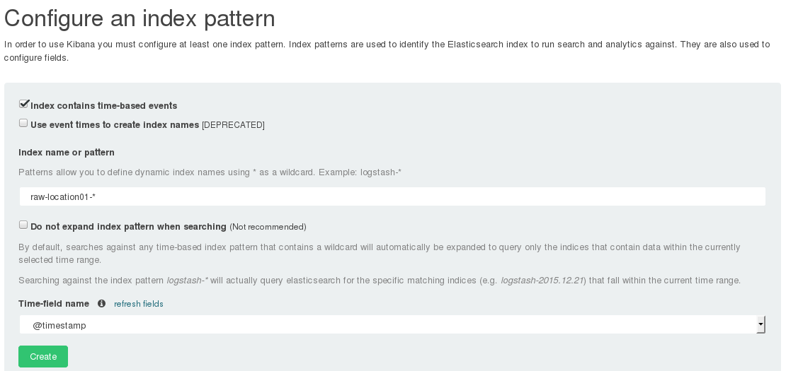
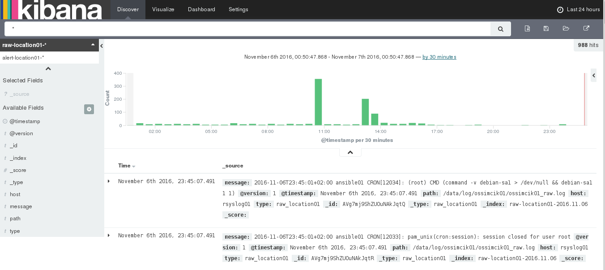

#ELK Kullanımı
------

Bu dokümanda, AHTAPOT projesi kapsamında, kullanılan ELK yapısının kulanımı anlatılmaktadır.


[TOC]

#Kibana Kullanımı

* Elasticsearch ve Kibana kurulumlarının tamamlanması ardından web browser kullanılarak kibana arayüzüne ulaşılır.

* Kibana arayüzünde ilk olarak yönetici yetkisi olan ahtapotops kullanıcı ile giriş yapılmalıdır. Kullanıcıadi "ahtapotops" Password "ahtapotopspass".



* Ahtapotops kullanıcı ile kibana içerisine elasticsearch ile oluşan indexler eklenilir. Elasticsearch içerisinde default ismi raw-location01 indexi kibanaya eklenir.




* İndexlerin oluşturulması tamamlanmasıyla kibana arayüzündeki "Discover" sekmesi seçilir. Ahtapotops kullanıcısı ile kibana ekranın sol tarafında istenilen index seçilerek loglarda arama yapılabilmektedir.



* Ahtapotops kullanıcısı dışında belirli bir indexin kullanıcı ile giriş yapıldığı zaman ekranın sol tarafında bulunan indexlerden sadece kullanıcının izinliği olduğu indexler içerisindeki logları görüntüleyebilmektedir. Kullanıcı izni olmadığı bir index'i açmak isterse hata ile karşılaşacaktır.

# Kibana Kullanıcı Ekleme

* Elasticsearch üzerinde oluşturulan indexlerde searchguard kullanılarak kullanıcı kısıtlaması oluşturulur.
* Default olarak kibana üzerinde tüm indexlere ulaşabilen ahtapotops kullanıcısı şifresi ahtapotopspass olarak bulunmaktadır.
* Default olarak logstash ile oluşturulan userlocation01 index'i için kullanıcı:userlocation01 password:userlocation01pass bulunmaktadır.
* Logstash ile elasticsearch üzerinden oluşturulan yeni indexler için yeni kullanıcılar oluşturulabilir. Yeni user elasticsearch rolu altında "**/etc/ansible/roles/elasticsearch/vars**" dizini içerisinde "**searchguard.yml**" dosyası içerisine "**searchguard_users**" başlığı altına eklenilir. 
"username" içerisine yeni kullanıcıadı "passwordhash" içerisine elasticsearch içerisindeki script ile kullanıcı passwordu ile oluşturulan hash, "roles" içerisine kullanıcın rolu eklenilir. Kullanıcı için yeni role oluşturma bir alt başlıkta açıklanılacaktır.

```
searchguard_users:
    user01:
        username: "ahtapotops"
        passwordhash: "$2a$12$jdVxqIceQSRaeBXKnTKFGuT8rykC49SjxZKLGHB6m/Rhr6xboj6aC"
        roles: 
            role01: 
                rolename: "sg_admin" 
    user02:
        username: "userlocation01"
        passwordhash: "$2a$12$A41IxPXV1/Dx46C6i1ufGubv.p3qYX7xVcY46q33sylYbIqQVwTMu"
        roles: 
            role01: 
                rolename: "sg_user_read_location01" 
    user03:
        username: "userlocation02"
        passwordhash: "$2a$12$A41IxPXV1/Dx46C6i1ufGubv.p3qYX7xVcY46q33sylYbIqQVwTMu"
        roles: 
            role01: 
                rolename: "sg_user_read_location02" 
```
* **NOT:** Password hash oluşturma:
* Elasticsearch makinesi ssh ile bağlanılarak root olunur. Hash.sh betiği "-p" parametresi ile çalıştırılarak cleartext olarak verilen password'ün hash'i alınır.
```
sudo su
cd /usr/share/elasticsearch/plugins/search-guard-2/tools/
bash hash.sh -p password
$2a$12$DU.xQ25i5RFbRHLhXGsJjOHC.Ha9NcLL8nhZiFneeO6WBcrGUgw7q
```

* "**searchguard_roles_mapping**" başlığı altında kullanıcı oluşturulan role atanır. Yeni bir index için yeni bir role oluşturulacağından yeni "rolemapping" oluşturulur. "**rolemappingname**" içerisine oluşturulcak yeni rolün ismi  "**backendrole**" içeirine yeni rolün ismi verilirmelidir. "**user**" içerisine rolü üstlenecek kullanıcı eklenilir.

```
searchguard_roles_mapping:
    rolemapping01:
        rolemappingname: "sg_admin"
        backendroles: 
            backendrole01: 
                rolename: "sg_admin" 
        users: 
            user01: 
                username: "ahtapotops" 
    rolemapping02:
        rolemappingname: "sg_user_read_location01"
        backendroles: 
            backendrole01: 
                rolename: "sg_user_read_location01" 
        users: 
            user01: 
                username: "userlocation01" 
    rolemapping03:
        rolemappingname: "sg_user_read_location02"
        backendroles: 
            backendrole01: 
                rolename: "sg_user_read_location02" 
        users: 
            user01: 
                username: "userlocation02" 
```
Oluşturulan yeni kullanıcı ve rol için index ataması yapılmalıdır. "**/etc/ansible/roles/elasticsearch/templates/searchguard**" dizini içerisinde "**sg_roles.yml.j2**" dosyası düzenlenmelidir.
``` 
vi /etc/ansible/roles/elasticsearch/templates/searchguard/sg_roles.yml.j2 
## Bu dosya ansible tarafindan yonetilmektedir!
## Burada yapilan degisikliklerin uzerine yazilir!!
{{ ansible_managed }}

sg_admin:
  cluster:
    - CLUSTER_ALL
  indices:
    '*':
      '*':
        - ALL

sg_power_user:
  cluster:
    - CLUSTER_MONITOR
  indices:
    '*':
      '*':
        - ALL

sg_user:
  indices:
    '*':
      '*':
        - READ

sg_user_read_location01:
  indices:
    '*-location01-*':
      '*':
        - READ
    '?kibana':
      '*':
        - indices:admin/exists
        - indices:admin/mappings/fields/get
        - indices:admin/refresh
        - indices:admin/validate/query
        - indices:data/read/get
        - indices:data/read/mget
        - indices:data/read/search

sg_user_read_location02:
  indices:
    '*-location02-*':
      '*':
        - READ
    '?kibana':
      '*':
        - indices:admin/exists
        - indices:admin/mappings/fields/get
        - indices:admin/refresh
        - indices:admin/validate/query
        - indices:data/read/get
        - indices:data/read/mget
        - indices:data/read/search

```

"**sg_roles.yml.j2**" Dosyası içerisinde aşağıdaki örnekteki gibi yeni satırlar eklenmelidir.
"sg_user_read_location01" yerine yeni belirlenen rolün ismi yazılmalıdır.  "indices" bağlığı altına "-location01-" yerine yeni oluşturulacak olan index adı yazılmalıdır. Geri kalan tanımlamalar aynı şekilde bulunmalıdır.
```
sg_user_read_location01:
  indices:
    '*-location01-*':
      '*':
        - READ
    '?kibana':
      '*':
        - indices:admin/exists
        - indices:admin/mappings/fields/get
        - indices:admin/refresh
        - indices:admin/validate/query
        - indices:data/read/get
        - indices:data/read/mget
        - indices:data/read/search
```

