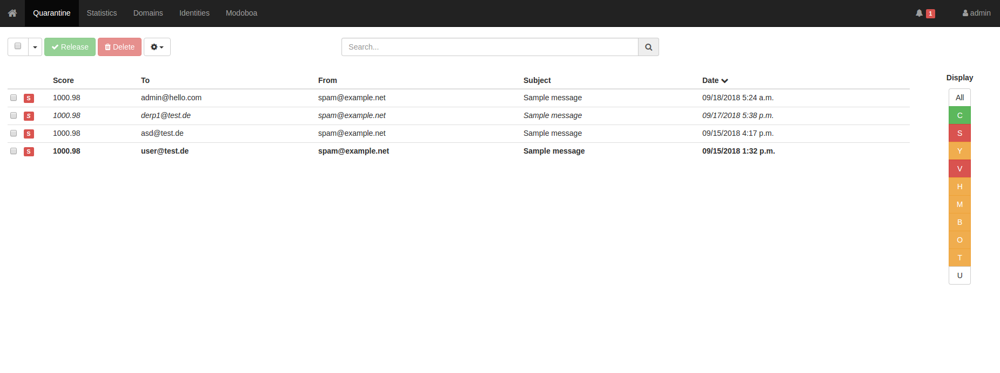

### E-posta Karantina
Ahtapot projesi kapsamında e-posta karantina işlevinin kurulumunu ve yönetimini sağlayan playbook’dur. “**/etc/ansible/playbooks/**” dizini altında bulunan “**mail-quarantine.yml**” dosyasına bakıldığında, “**hosts**” satırında Ansible’a ait “**/etc/ansible/**” altında bulunan “**hosts**” dosyasında “**[mail-quarantine]**” satırı altına yazılmış tüm sunucularda bu playbookun oynatılacağı belirtilir. “**sudo**” satırı ile çalışacak komutların sudo yetkisi ile çalışması belirlenir. “**vars_files**” satırı e-posta karantine playbookunun değişken dosyalarını belirtmektedir. “**roles**” satırı altında bulunan satırlarda ise bu playbook çalıştığında “**base**” ve “**mail-quarantine**”rollerinin çalışacağı belirtilmektedir.


```
- hosts: mail-quarantine
  sudo: yes
  vars_files:
  - /etc/ansible/roles/base/vars/group.yml
  - /etc/ansible/roles/base/vars/user.yml
  - /etc/ansible/roles/base/vars/repo.yml
  - /etc/ansible/roles/base/vars/rsyslog.yml
  - /etc/ansible/roles/base/vars/ntp.yml
  - /etc/ansible/roles/base/vars/package.yml
  - /etc/ansible/roles/base/vars/kernelmodules_remove.yml
  - /etc/ansible/roles/base/vars/kernelmodules_blacklist.yml
  - /etc/ansible/roles/base/vars/host.yml
  - /etc/ansible/roles/base/vars/audit.yml
  - /etc/ansible/roles/base/vars/sudo.yml
  - /etc/ansible/roles/base/vars/ssh.yml
  - /etc/ansible/roles/base/vars/grub.yml
  - /etc/ansible/roles/base/vars/logger.yml
  - /etc/ansible/roles/base/vars/logrotate.yml
  - /etc/ansible/roles/base/vars/directory.yml
  - /etc/ansible/roles/base/vars/profile.yml
  - /etc/ansible/roles/base/vars/fusioninventory.yml
  - /etc/ansible/roles/mail-quarantine/vars/main.yml

  roles:
    - role: base
    - role: mail-quarantine
```

#### E-Posta Karantina Rolü Değişkenleri
Bu roldeki değişkenler “**/etc/ansible/roles/mail-quarantine/vars/**” dizini altında bulunan yml dosyalarında belirtilmiştir. yml dosyalarının içerikleri ve değişken bilgileri aşağıdaki gibidir;

-   “**main.yml**” dosyasında bulunan değişkenlerin görevi şu şekildedir. "**quarantine_mail_domain**" karantina sisteminin alan adının belirtildiği değişkendir. "**quarantine_subdomain_name**" karantina sisteminin alt alan adının belirtildiği değişkendir. .  "**quarantine_db_host**" karantina sunucusunun veritabanının IP adresinin belirtildiği değişkendir.  "**quarantine_db_user**" karantina sunucusunun veritabanının kullanıcı adının belirtildiği değişkendir.  "**quarantine_db_pass**" karantina sunucusunun veritabanının şifresinin belirtildiği değişkendir.  "**quarantine_db_root_user**" karantina sunucusunun veritabanının root kullanıcı adının belirtildiği değişkendir.  "**quarantine_db_root_pass**" karantina sunucusunun veritabanının root şifresinin belirtildiği değişkendir. 

```
quarantine_mail_domain: "mail.test.org"
quarantine_subdomain_name: "karantina"
quarantine_db_host: "127.0.0.1"
quarantine_db_user: "ahtapot"
quarantine_db_pass: "ahtapot"
quarantine_db_root_user: "root"
quarantine_db_root_pass: "root"
```

### E-posta Karantina Kullanımı
```
URL: karantina.mail.test.org (yukarıdaki örneğe istinaden)
Varsayılan Kullanıcı Adı: admin
Varsayılan Şifre: password
```
- **NOT:** Arayüze FQDN adresi üzerinden erişim sağlamak zorunludur. Ip adresi üzerinden gelen isteklere cevap verilmez.



Burada karantinaya düşen e-postalar listelenmektedir.
Üstte bulunan arama kutucuğu ile to/from/subject alanlarında arama yapılabilir.
İstenen e-postaların yanındaki kutucuk işaretlenip Release yuşuna basılarak e-postaların alıcısına iletilmesi sağlanabilir.
