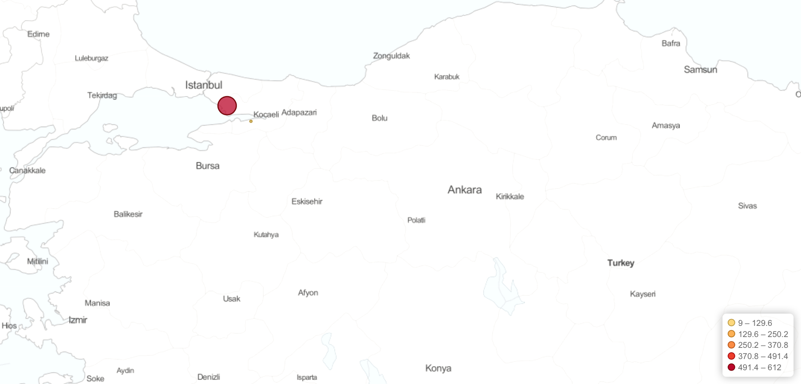
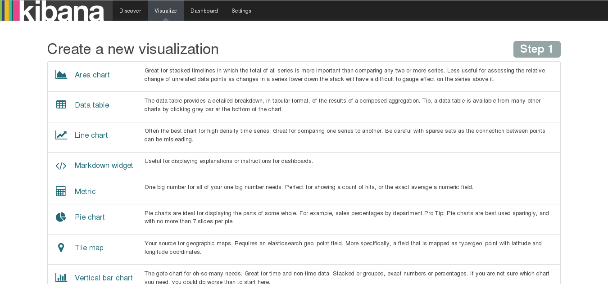
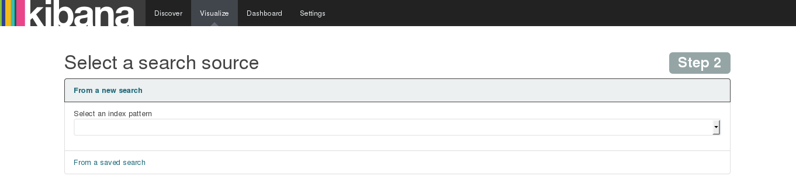
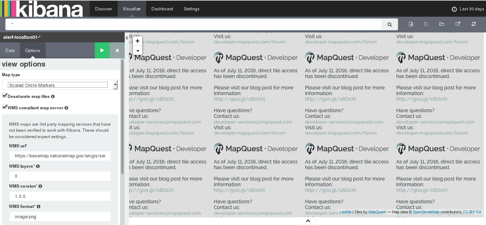
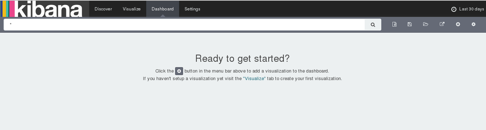
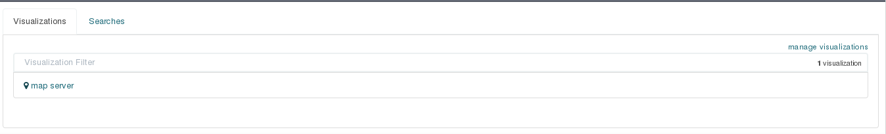
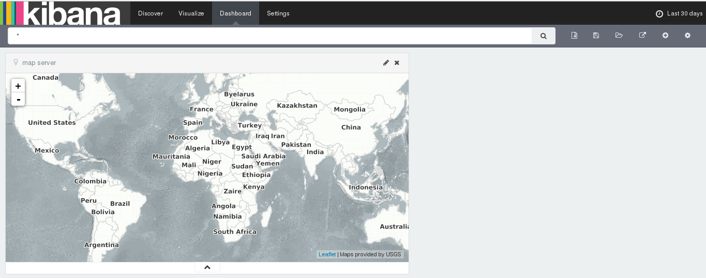

#ELK ile Oluşan Alarmlar İçin Local Harita ve Coğrafi IP Veritabanı Oluşturulması
------

[TOC]

####Genel Bilgilendirme

Local harita oluşturabilmek için ELK Server(Elasticsearch,Logstash,Kibana) kurulumu yapılması gerekmektedir.Elasticsearch tüm logların kayıt altına alındığı,daha hızlı ve düzenli bir şekilde veri analizinin yapıldığı bir arama motorudur.Java ile geliştirilmiştir ve açık kaynak kodludur.Logstash ise elasticsearch üzerinde depolanacak logların client’lar üzerinden yazılan filtrelere göre alınması sağlayan bir araçdır.Bu logların web arayüzünde görselleştirilmesini kibana yapmaktadır ve oluşturacağımız local harita kibana üzerinden oluşturulacaktır.Bu haritada coğrafi ip veritabanı olarak maxmind tarafından geliştirilen geoip uyumlu kendi oluşturacağımız veritabanı kullanılcaktır.

####Local Harita ve Coğrafi IP Veritabanı Oluşturulması

* Kibana geoip veritabanını binary sistemde "**.dat**" formatında kullanmaktadır ve bu veritabanı logstash içerisinde tutulmalıdır.

* Aşağıdaki komutlar ile binary veritabanı indirilir ve "**/etc/logstash**" dizini içerisine atılır.

```
sudo curl -O "http://geolite.maxmind.com/download/geoip/database/GeoLiteCity.dat.gz"
sudo cp GeoLiteCity.dat.gz /etc/logstash
cd /etc/logstash
sudo gunzip GeoLiteCity.dat.gz
```

* Logstash ile geoip veritabanı içerisindeki koordinat bilgilerini çekebilmek için filtre yazılmalıdır.Bunun için logstash’in konfigurasyon dosyalarının bulunduğu dizinde geoip için yeni bir filtre oluşturulur.

```
cd /etc/logstash/conf.d/
sudo nano 11-nginx.conf
```

* Dosya içine aşağıdaki kodlar eklenerek maxmind tarafından oluşturulan geoip veritabanını kibana üzerinde kullanılabilmektedir. Fakat kendi ip veritabanımızı oluşturabilmemiz için .csv formatında veriler yazılarak binary formata dönüştürülür.

```
geoip {
      source => "clientip"
      target => "geoip"
      database => "/etc/logstash/mmcity.dat"
      add_field => [ "[geoip][coordinates]", "%{[geoip][longitude]}" ]
      add_field => [ "[geoip][coordinates]", "%{[geoip][latitude]}"  ]
    }
    mutate {
      convert => [ "[geoip][coordinates]", "float"]
    }
```

* Maxmind’in geoip veritabanı ile uyumlu olması açısından 2 adet csv dosyası oluşturulur. Bu dosyaların bir tanesinde ip blokları bir tanesinde ise lokasyon bilgileri tutulur.İki dosya arasındaki ip adresine göre lokasyon bilgisi eşleşmesi ise 2 dosyanında her satırında tutulan id bilgisi tarafından yapılır.

* IP blokları için geoip_Blocks.csv adında bir dosya oluşturulur ve içerisine aşağıdaki satırlar eklenir. İlk kısım başlangıç ip adresi,ikinci kısım bitiş ip adresi ve son kısım id bilgisini içermektedir.

```
Copyright (c) 2011 MaxMind Inc.  All Rights Reserved.
startIpNum,endIpNum,locId
"167774720","167774975","1"
```

* Buradaki ip adresleri long int olarak tutulduğu için ip adresi karşılığını görebilmek için aşağıdaki C++ kodu kullanılabilir. Bu kod ile yukarda oluşturduğumuz dosya içerisindeki ip bilgilerinin 10.0.10.0-10.0.10.255 olduğu görülmektedir.

```
#include <iostream>

using namespace std;

int main(){
    long int ip;
    int ip1,ip2,ip3,ip4;
    cin>>ip;
    ip1=(ip/16777216)%256;
    ip2=(ip/65536)%256;
    ip3=(ip/256)%256;
    ip4=ip%256;
    cout<<ip1<<"."<<ip2<<"."<<ip3<<"."<<ip4<<endl;
    return 0;
}
```

* Lokasyon bilgileri için geoip_Location.csv adında bir dosya oluşturulur ve içerisine aşağıdaki satırlar eklenir.Blocks dosyası içerisinde id bilgisi 1 olan ve 10.0.10.0-10.0.10.255 ip aralığının lokasyon dosyasında yazılan id bilgisi 1 olan satır ile eşleşdiğini ve Kocaeli bölgesinde olduğu görülebilir.Böylece  geoip veritabanı oluşturabilmektedir.

```
Copyright (c) 2012 MaxMind LLC.  All Rights Reserved.
locId,country,region,city,postalCode,latitude,longitude,metroCode,areaCode
1,"TR","41","Kocaeli","cd",40.6333,29.7500,,
```

* Oluşturulan 2 adet csv uzantılı dosyayı kibananın kullanacağı binary formata dönüştürmek için python ile geliştirilen csv2dat.py scripti kullanılabilir. "**https://github.com/mteodoro/mmutils**" linkten scripti indirdikten sonra aşağıdaki komut ile binary veritabanı oluşturabilir.

```
sudo ./csv2dat.py -w mmcity.dat -l geoip_Location.csv mmcity geoip_Blocks.csv
```

* Oluşturulan veritabanını kullanarak harita üzerinde gelen paketlerin ip adres ve konum bilgisi görülmektedir.



####Local Harita Sunucusu Kullanımı

* Internet bağlantısının olmadığı durumlarda; kibanada "Tile map" ile görselleştirme yapmak için yerel ağda kullanılan bir "Web Map Service" kullanılabilir.
* Map server bilgilerinin kibana içerisine eklenmesi için kibana ana ekranında bulunan menulerden "**Virsualize**" seçilir.
* Virsualize ile yeni görselleştirme oluşturulup "Tile map" seçilir.



* "**Select a search source**" seçeneği içerisine Map Server çalışması sırasında hangi index bilgilerini baz alarak location belirlemesi yapacağı seçilir. 



* Ekranın sağ tarafında bulunan menu içerisinde "**Options**" bloğundan; "WMS compliant map server" sekmesindeki kutucuk işaretlenir.



* Aşağıdaki bölümler yerel ağda kullanılan "Web Map Service" yapılandırmasına göre doldurulur.
```
WMS url             : WMS harita servisine ait URL adresi yazılır.
WMS layers    : Her bir harita sunucusunun sunduğu katman listesi yazılır. Birden fazla seçenek mevcutsa virgül (,) ile ayrılır. [Katmanlar harita sunucusu tarafından sağlanır.]
WMS version   : Harita sunucusudaki WMS sürüm bilgisi yazılır.
WMS format    : Harita servisinde kullanılan imaj formatı yazılır. En çok kullanılan iki format: image/png ve image/jpeg
WMS attribution : Kullanıcı tarafından belirlenen ve haritanın kaynağını belirlemek için kullanılan değer yazılır. Bu değer haritanın sağ alt köşesinde yer alır 
WMS styles    : Her bir harita sunucusunun sunduğu stil listesi yazılır. Birden fazla seçenek mevcutsa virgül (,) ile ayrılır. [Stiller harita sunucusu tarafından sağlanır.]
```
**Örnek WMS Ayarı:**
```
WMS url       : http://ows-tile.terrestris.de/osm-basemap/service?
WMS layers    : OSM-WMS
WMS version     : 1.1.0
WMS format    : image/jpeg
WMS attribution : Maps provided by USGS
```
* Ardından görselleştirme kaydedilir ve gösterge tablosunda (dashboard) kullanılır.
* Dashboard eklemek için kibana menusundan "**Dashboard**" seçilmelidir. "Dashboard" sayfası içerisinde "**+**" butonuna tıklanılarak oluşturulan görsellerin dashboard içerisine eklenmesi sağlanılır.



* Dashboard içerisinde oluşturulan "Map Server" görseli eklenilir.



* Eklenilen görselin boyutu istenildiği gibi ayarlanılır ve dasdboard içerisinde istenilen yere taşınılabilir.



* "Save Dashboard* tıklanılarak yeni oluşturulan dashboard kaydedilir.
 
**Sayfanın PDF versiyonuna erişmek için [buraya](es-cografi-harita.pdf) tıklayınız.**
