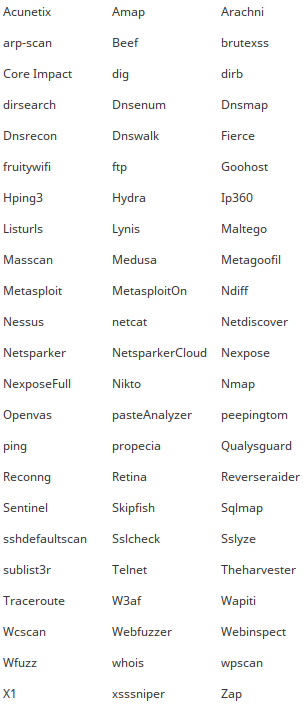
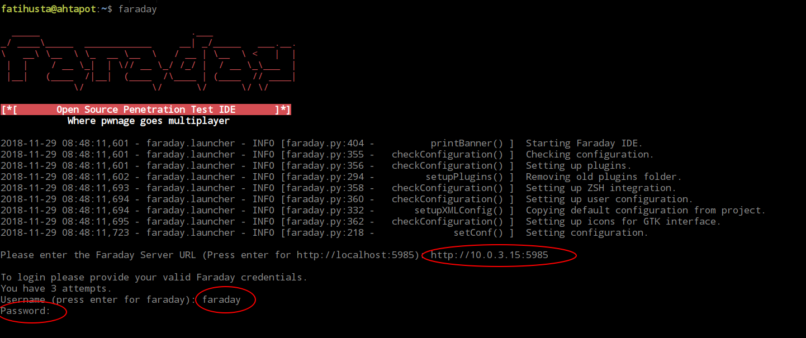
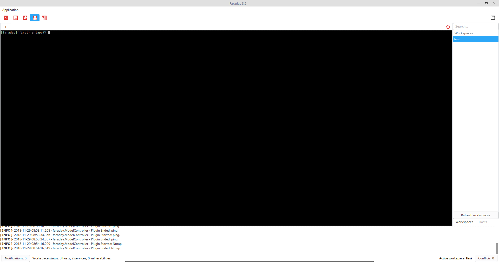
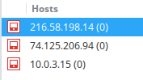
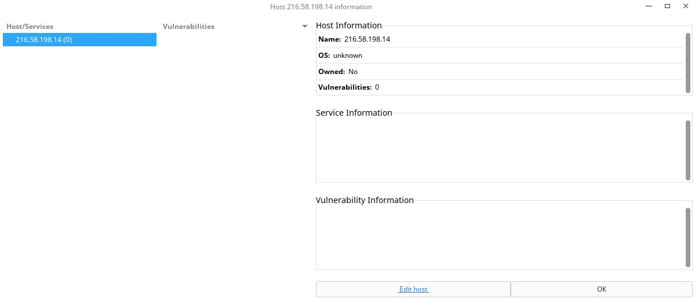
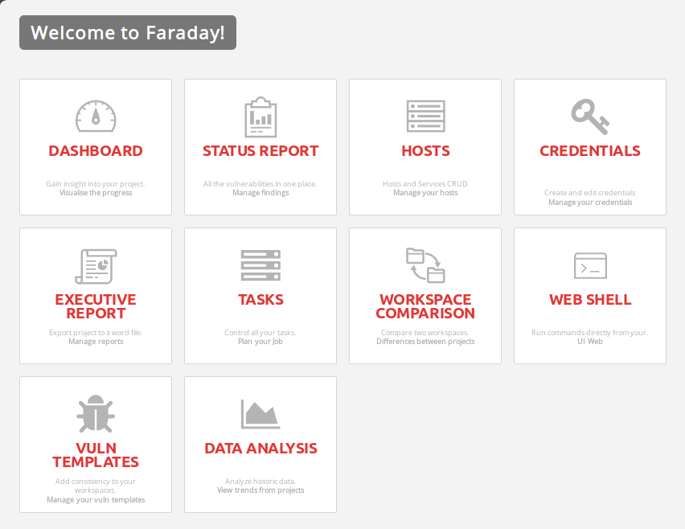
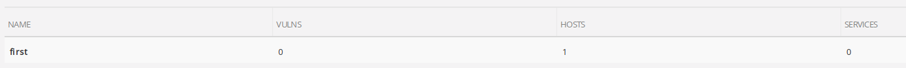

# Faraday Kullanımı

Faraday, çeşitli ağ keşif/test araçlarının çıktılarını analiz etmek üzere tasarlanmış sunucu-istemci
olarak çalışan bir uygulamadır. Istemci yazılımının kendi terminal’i üzerinden testler yapılabileceği
gibi daha önce yapılan testlere ait dosyalar da istemci yazılımı kullanılarak çalışma alanına dahil
edilebilir. Faraday istemci yazılımı test sonucunda oluşan çıktıları Faraday sucunusuna gönderir ve
burada görüntülenmesini sağlar. Birçok kişi aynı çalışma alanında çalışıp bulgularını Faraday
sunucusuna iletir ve ortak bir çalışma yapılması mümkün olur.

Desteklediği araçlar;



## Faraday yazılımının kurulumu
Faraday sunucu ve istemci olarak çalışır. Bu nedenle aşağıdaki özelliklerde bir sunucu hazırlanır ve
Pardus kurulur. Istemci yazılımı ise kişisel bilgisayarlara veya test için kullanılan bilgisayarlara
kurulur.

Faraday sunucu için asgari sistem gereksinimleri:

**CPU:** 2 core
**Ram:** 4GB
**Disk:** 50GB

### A- Faraday Sunucu Kurulumu
Faraday sunucunu kurulumu ansible üzerinden kurulabileceği gibi aşağıdaki şekilde kurulabilir.
Ansible kurulumu için ilgili dökümana bakınız.

**1-** İlgili paket aşağıdaki komut kullanılarak kurulur.

```
apt install faraday-server
```
> **Bilgi:** Faraday sunucu ve istemci aynı sisteme kurulacak ise apt install faraday komutu
verilmesi yeterlidir.

**2-** Paket kurulduktan sonra aşağıdaki betik çalıştırılarak ilgili veri tabanı oluşturulur ve öntanımlı kullanıcı olan faraday için şifre belirlenir.

```
/usr/share/faraday/server/initial_db.sh --passwd ahtapot
```

**3-** Faraday sunucu ayarları yapılır. Aşağıdaki ayar dosyasında port ve dinleyeceği IP adresi ayarları
yapılır.

/root/.faraday/config/server.ini

```
[faraday_server]
port = 5985
bind_address = 0.0.0.0
Eğer faraday sunucusunun SSL olarak çalıştırılması isteniyor ise SSL
sertifikalası oluşturulur ve ilgili dizine atılır. server.ini ayar dosyasında
aşağıdaki alan düzenlenir.
[ssl]
port = 6985
certificate = /root/.faraday/config/ssl.public.crt
keyfile = /root/.faraday/config/ssl.private.key
```

Servis ayar dosyasında aşağıdaki şekilde --ssl parametresi eklenir.

/usr/share/faraday/server/server-service-options.conf

```
OPT="--nodeps --ssl"
```

Not: Eğer Faraday sunucu SSL yapılandırılır ise Faraday istemci de SSL yapılandırılmalıdır.

**4-** Yukarıdaki işlemler bittikten sonra servis başlatılır.

```
systemctl enable faraday-server
systemctl start faraday-server
```

**5-** Faraday web erişimi
Faraday web servisine sunucu IP adresi kullanılarak erişilir.

**URL:** http://192.0.2.10:5985

**Kullanıcı adı:** faraday

**Parola:** 2’inci aşamada belirlenen

### B- Faraday İstemci Kurulumu
Faraday istemci aşağıdaki komut ile kurulur.

```
apt install faraday-client
```

Eğer Faraday sunucu SSL yapılandırılır ise istemci de ssl yapılandırılmalı. Bu nedenle gerekli
sertifikalar ilgili dizine kopyalanır ve aşağıdaki ayar dosyası düzenlenir.

/usr/share/faraday/client/client-service-options.conf

```
OPT="--nodeps --cert /path/to/cert"
```

## Faraday Kullanımı
Faraday sunucu-istemci olarak çalışır. Bu nedenle Faraday istemci çalıştırılır ve Faraday Sunucusuna bağlantısı yapılır.

Faraday istemci kurulu olan bilgisayarda aşağıdaki komut çalıştırılır.

```
faraday
```



Faraday sunucu adresi girilir. Kullanıcı adı ve parola girişi yapılır.

Eğer ilk defa giriş yapıyorsanız sizden bir çalışma alanı oluşturmanızı isteyecektir. Bir çalışma alanı
adı belirlenir ve ok denir.

> **Not:** Daha sonraki girişleriniz de hangi çalışma alanında çalışmak istedinizi sorar.

Faraday istemci açıldığında aşağıdaki gibi bir terminal ekranı gelir. Terminal üzerinde çalıştırdığınız
ve desteklediği komutlar için otomatik olarak analiz yapar.



Test için Faraday terminal üzerinde herhangi bir adrese ping atılabilir.

```
ping www.google.com
```

Test sonucunda tespit edilen IP adresi sağ alt bölümden ulaşılan Hosts menüsünden
görüntülenebilir.



IP adresi ile ilgili detaylı bilgi için IP adresi üzerine Çift klik yapılır.




Sağ üst bölümde yer alan bu buton ile daha önce kaydettiğiniz ve desteklediği uygulamaların
çıktılarını çalışma alanına dahil edebilirsiniz.

**Faraday Sunucu** üzerinde istemciden gönderilen veriler görüntülenebilir.

Bunun içn Faraday sunucusuna web üzerinden bağlanılır.



Faraday sunucuya erişim sağladıktan sonra **Dashboard** Menüsüne basılır ve gelen listede Faraday istemci tarafında oluşturulan **çalışma alanı** adına basılır.



Açılan ekranda ilgili çalışma alanına ait istatistiksel veriler görüntülenir.


Her alanın üzerine tıklanabilir ve detaylarına ulaşılabilir.

>**Not:** Faraday’ın bir çok modülü ticari sürümlerinde çalışmaktadır.

**Ahtapot Projesi**

Fatih USTA

fatihusta@labrisnetworks.com

