#Güvenlik Duvarı Yönetim Sistemi Kullanımı
------

[TOC]


Bu dokümanda, Ahtapot Güvenlik Duvarı Yönetim Sisteminde güvenlik duvarı kurulum 
ve yönetimi anlatılıyor.

Gereken : 
GYDS Entegrasyonu yapılmış Ansible, Gitlab, Firewall Builder sunucuları
Pardus Temel ISO’ dan kurulumu tamamlanmış bir sunucu / sunucular


####FirewallBuilder üzerinden Güvenlik Duvarı Yönetim Sistemi kullanımı

* AHTAPOT GDYS Entegrasyon dokümanında belirtildiği üzere, Güvenlik Duvarı Yönetim Sistemi Kontrol Paneli uygulaması açılır. 

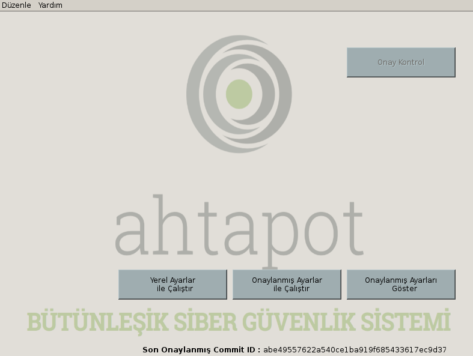

* Açılan Güvenlik Duvarı Yönetim Sistemi Kontrol Paneli ekranında “**Onaylanmış Ayarlar ile Çalıştır**” seçeneği seçilerek, Firewall Builder uygulaması açılır.
* Yönetim arayüzünün sol tarafında bulunan ağaç listeden “**Firewalls**” klasörüne sağ tıklayıp, çıkan listede “**New Firewall**” seçeneği tıklanır.

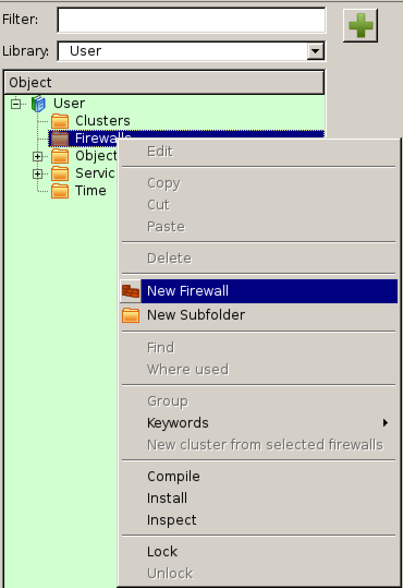

* Pardus Temel ISO’ dan kurulumu tamamlanmış ve güvenlik duvarı rolünü üstlenecek sunucunun ismi FQDN ile “**Name of the new firewall object**” alanına girelerek, “**Next**” tuşuna tıklanır.


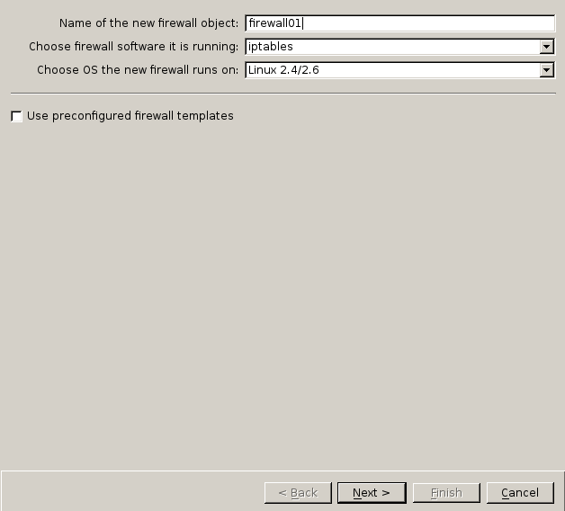

* “**Configure interfaces manually**” seçili olacak şekilde “**Next**” tuşuna basarak devam edelir.

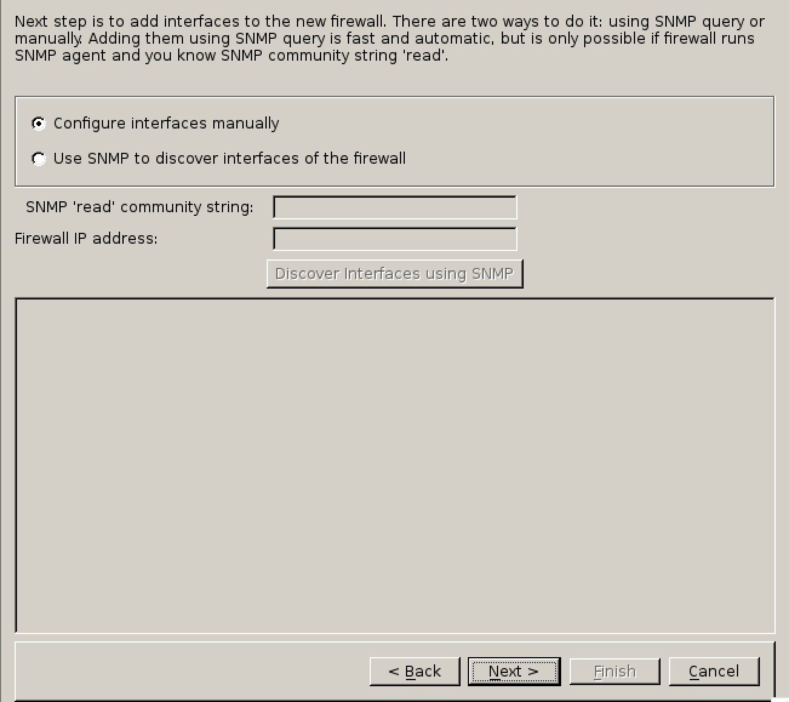

* Ekrana gelen arayüzde güvenlik duvarında bulunan ağ arabirimlerinin yapılandırması gerçekleştirilir. Yapılandırma adımları aşağıdaki gibidir;
  - 1)  Pencerenin sol üst köşesinde bulunan yeşil “**+**” işaretine tıklayarak güvenlik duvarına ait ilk arabirim eklenir.

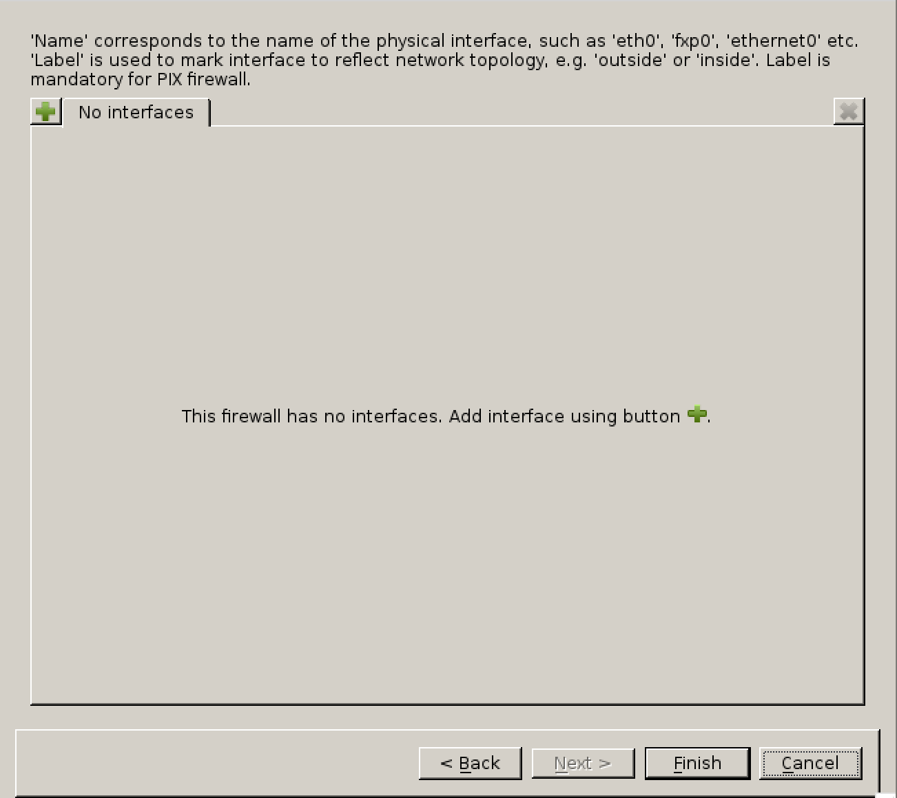

  - 2) Arabirim eklemek için gelen ekranda aşağıdaki işlemler yapılır.
  - 3) “**Name**” kısmına arabirimin işletim sistemi üzerindeki ismini girilir. “**Label**” kısmına arabirimin görevi girilir.Örnek olarak iç ağ için “**LAN**”, dış ağ için “**WAN**” yazılabilir. Güvenlik duvarının DHCP servisinden değişken IP adresi almıyor ise “**Type**” girdisi “**Static IP address**” olarak bırakılır. “**Add address**” tuşuna basılır. Aşağıdaki tabloda girdiler için açılan yeni bir alanın oluşur. “**IP Address**” hücresine güvenlik duvarının yönetim arabirimi IP adres bilgisi girilir. “**Netmask**” hücresine IP adresin ağ maskesi girilir.

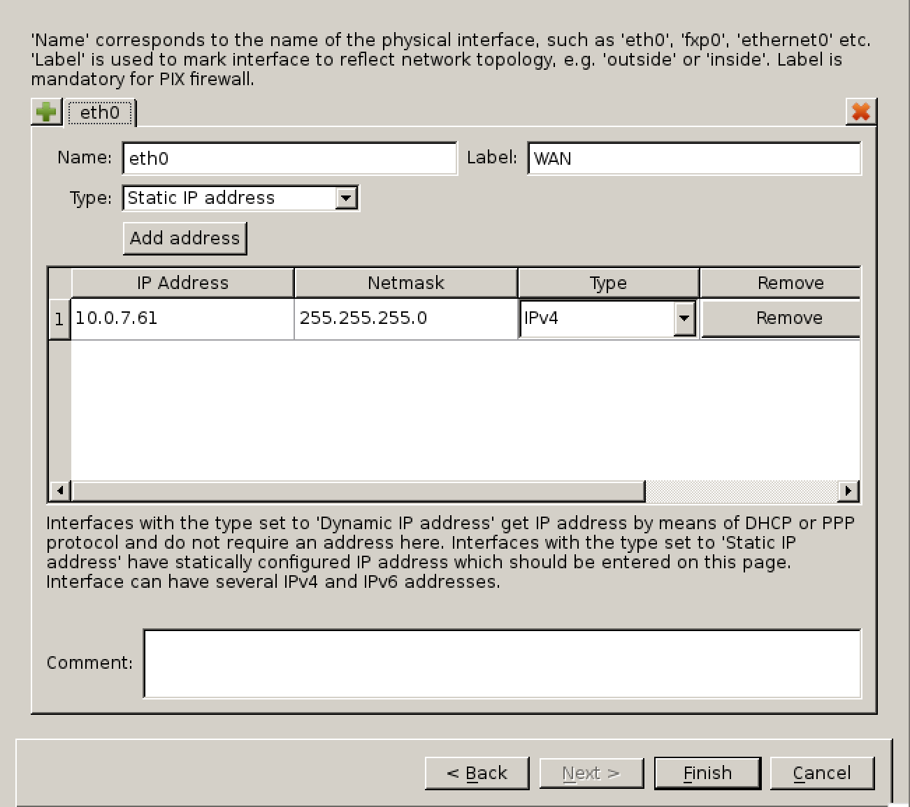

**NOT** : Sisteme öncelikle eth0 tanıtılmalıdır. eth0 için “**IP Address**” bölümüne Pardus Temel ISO kurulumunda belirtilen IP adres bilgisi girilmesi zaruridir.

NOT: Her eklenmek istenen arabirim için bu madde tekrarlanır. Tüm arabirimler eklendikte sonra “**Finish**” tuşuna tıklanarak işlem sonlandırılır.

* Hatalı eklenen arabirimleri sağ üst köşede bulunan “**kırmızı çarpı**” işaretine basılarak kaldırılır.
* Sisteme eklenen güvenlik duvarı sol tarafta bulunan ağaç yapısında “**Firewalls**” dizini altına gelmektedir. İlgili güvenlik duvarının isminin yanında bulunan “**+**” işaretine basılarak seçenekler açılır ve “**eth0**” üzerine çift tıklanarak, ekranın alt kısmında eth0’ a ait bilgilerin çıkması sağlanır. Açılan ekranda “**Management interface**” kutucuğu işaretlenmesi zaruridir.

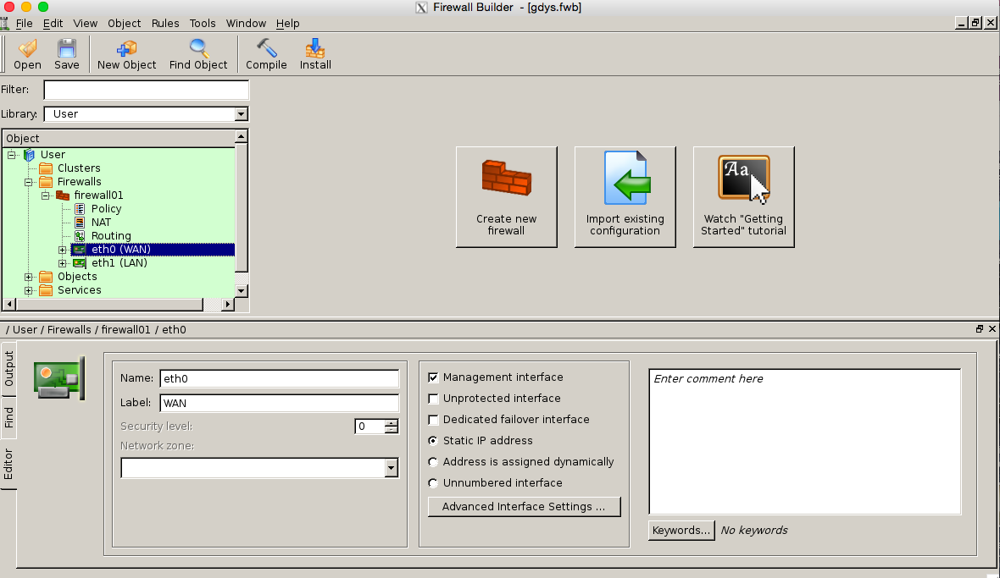

* Oluşturulan güvenlik duvarının adına tıklanarak alt bölümde açılan ekranda, “**Version**” satırından “**1.4.4 or later**” seçeneği seçilir.

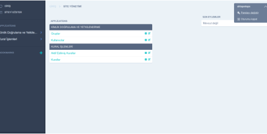

* “**Firewalls**” dizini altına eklenen güvenlik duvarı için kural tanımları yapılır.

* Gerekli kural tanımlamaları yapıldıktan sonra öncelikli “**Save**” butonuna basılarak yapılandırma yerel yapılandırma dosyasına kaydedilir.

* Sırası ile “**Compile**” ve “**Install**” butonlarına basılması ile bu adımlarda herhangi bir hata alınmaz ise güvenlik duvarının kurulum ve yapılandırması için yerel Merkezi Sürüm Kontrol Sistemine (GitLab) “**merge-request**” oluşturulur. 


**NOT**: Yapılan anlatım Onay Mekanizmasının aktif olduğu durumlar için geçerlidir. Onay mekanizmasının kapalı olduğu durumlarda GitLab tarafında oluşan “**merge-request**” otomatik olarak “**commit**” edilir ve güvenlik duvarı üzerinde gerekli kurulum ve yapılandırma gerçekleşir.


####GitLab Üzerinden Yapılan İsteklerin Onaylanması

* Onay’ a gönderilmiş her değişiklik GitLab üzerindeki GDYS deposunda “**Merge-request**” olarak gözükmektedir. Proje sayfasına giriş yaptıktan sonra “**Merge Request**” sayfasına gidilir.

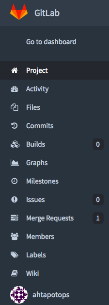

* Oluşan “**Merge Request**” aşağıdaki gibi görünmekte olup, tarih bilgisine basılarak isteğe ait detay görülebilir.


* “**Changes**” başlığı tıklanarak, sistemde yapılan değişiklikler gözlemlenebilir. Yapılacak değişikliklerin onaylanması için “**ACCEPT MERGE REQUEST**” butonuna tıklanır.

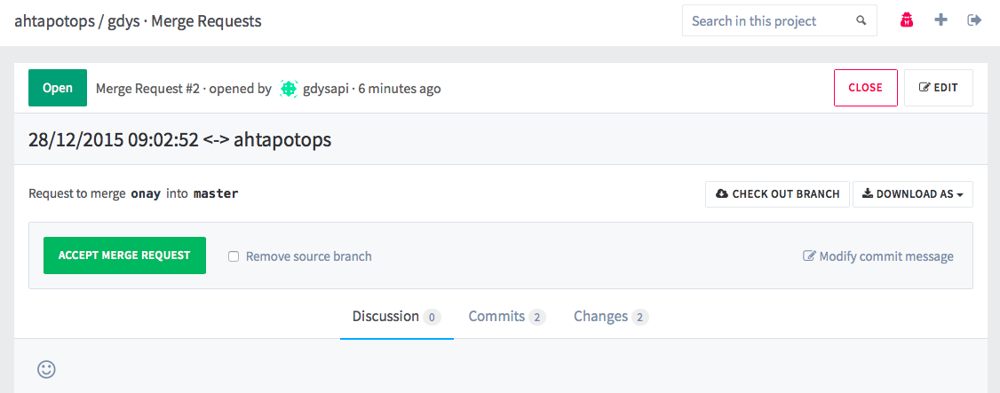

* İlgili değişiklik onaylandığında en geç beş dakika içerisinde uç birimde oynatılarak kural aktif hale gelir. Değişikliği içeren playbookun durumu Ansible makinesi üzerinde, “**/var/log/ahtapot/ansible.log**” dosyasına yazılmakta olup, tamamlandığına dair örnek ekran görüntüsü aşağıdaki gibidir.


#Firewall Builder Kullanım Senaryoları
------

Bu dokümanda, Ahtapot projesi kapsamında kullanılmakta olan Firewall Builder uygulamasının kullanım senaryoları anlatılmaktadır.


####Yeni Güvenlik Duvarı Tanımlama

* Tanımlanacak tüm güvenlik duvarı sistemleri Firewall Builder uygulamasının açılış sayfasında “**Object**” tabında bulunan “**Firewalls**” klasörü altına eklenmelidir. Farklı güvenlik duvarlarını klasör yapısı altında toplamak için “**New Subfolder**” seçeneği ile farklı klasörler oluşturulabilir. Sisteme yeni bir güvenlik duvarı eklemek için, eklenmek istenen klasöre sağ tıklanarak “**New Firewall**” seçeneği seçilir.


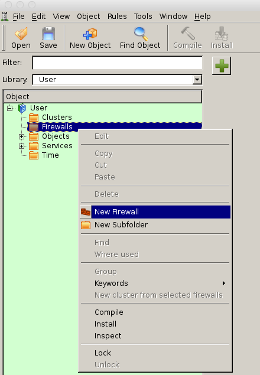

* Açılan “**Creating new firewall object**” penceresinde güvenlik duvarını sisteme tanıtmayı sağlayacak temel bilgilerin girişi yapılmaktadır. “**Name of the new firewall object**” satırına sisteme eklenecek güvenlik duvarının adı girilmektedir. “**Choose firewall software it is running**” satırına GDYS sisteminde güvenlik duvarlarında kullanılan güvenlik duvarı yazılımı olarak “**iptables**” seçilir. “**Choose OS the new firewall runs on**” satırında, güvenlik duvarlarının işletim sistemi bilgisi girilir. GDYS projesi kapsamında Pardus sürümü kullanıldığı için “**Linux 2.4/2.6**” seçilerek “**Next**” butonuna basılır.


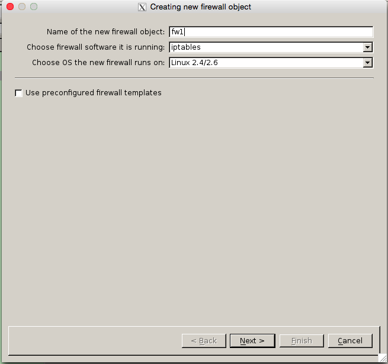

* Güvenlik duvarlarında Firewall Builder arayüzündeki yapılandırma işlemine, yönetim arabirimini tanıtarak başlanmalıdır.  Bu aşamada belirtilecek olan ip adresi, Firewall Builder uygulaması ile güvenlik duvarı üzerinde yapılacak her değişikliğin uygulanması için GDYS sistemleri tarafından erişimde kullanılacak adrestir.  “**Configure interfaces manually**” seçeneği seçilerek, “**Next**” butonuna basılır.

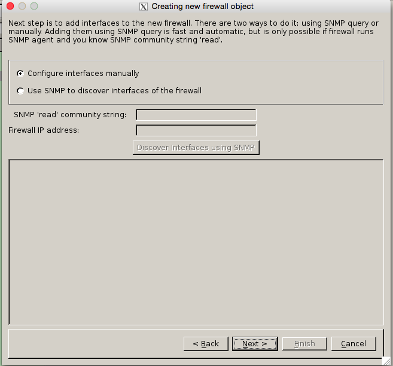

* Yönetim arabirimi olarak kullanılacak, arabirim yapılandırmasını yapmak üzere, sol tarafta bulunan “**yeşil artı**” simgesine basılır.

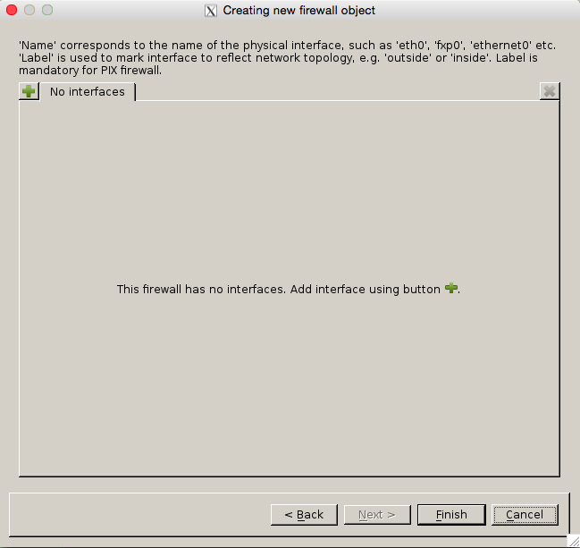

* “**Yeşil artı**” butonuna basılarak oluşturulan yeni sekmeye, yönetim için kullanılacak arabirim bilgileri girilmelidir. “**Name**” satırına, güvenlik duvarı işletim sisteminde bulunan ve yönetim için kullanılacağı kararlaştırılmış olan arabirimin adı girilir. “**Label**” satırında, belirlenen arabirimin iç ya da dış ağ yapısında kullanılacağı bildirilir. “**Type**” bölümünde IP adresi elle tanıtılacağından “**Static IP address**” seçeneği seçilerek “**Add address**” butonuna basılır. Bu butona basılması ile, alt satırdaki “**IP Address**” satırı aktif hale gelmediktedir. Bu satırda “**IP Address**” ve “**Netmask**” bilgileri doldurularak, “**Finish**” butonuna basılır.

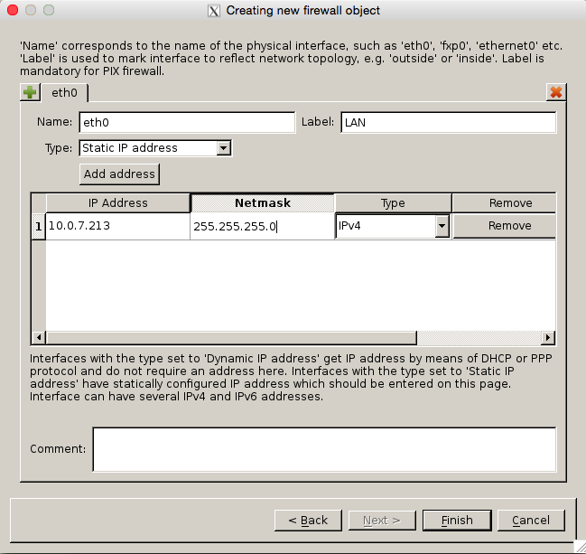

* Güvenlik duvarı ekleme işlemi tamamlandıktan sonra, Firewall Builder ekranında eklenen “**Firewalls**” klasörü altında güvenlik duvarı görünmektedir. Güvenlik duvarı üzerinde gerekli ağ yapılandırmasını tamamlanmadan önce, güvenlik duvarını Firewall Builder üzerinden yönetmek için gerekli ayarlamalar yapılır.


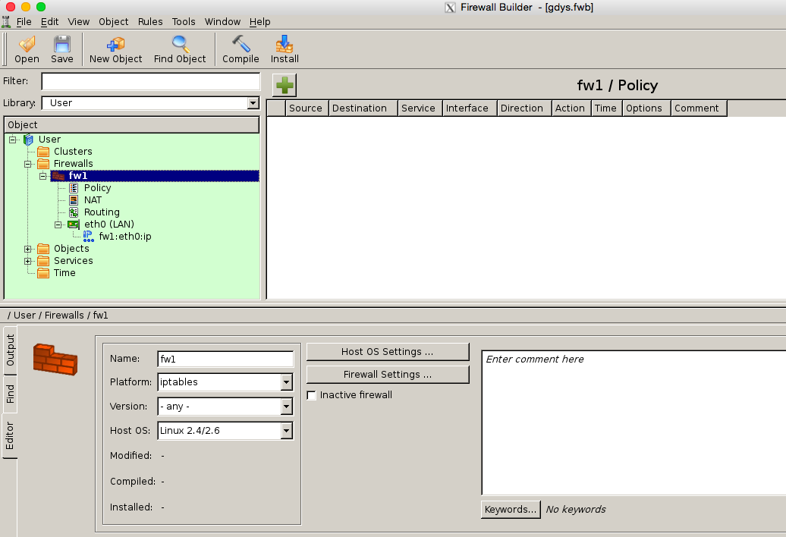

* Firewall Builder üzerinden yönetimi yapılacak güvenlik duvarlarının ağ yapılandırma işleminin sunucuya erişimi **kaybetmemesi** için, arabirim yapılandırmalarını **yapmaması** sağlanır. Güvenlik duvarı tanıtıldıktan sonra dönülen ana ekranda, yeni eklenmiş güvenlik duvarı seçili konumda iken, “**Firewall Settings**” seçeneği seçilir. Açılan “**iptables advanced settings**” ekranında gelişmiş güvenlik duvarı ayarları bulunmaktadır. “**Script**” sekmesine giderek, “**Managing interfaces and addresses**” başlığı altında ön tanımlı seçilmiş olan “**Verify interfaces before loading firewall policy**” ve “**Configure interfaces of the firewall machine**” ayarların seçimleri kaldırılırak “**OK**” butonuna basılır.

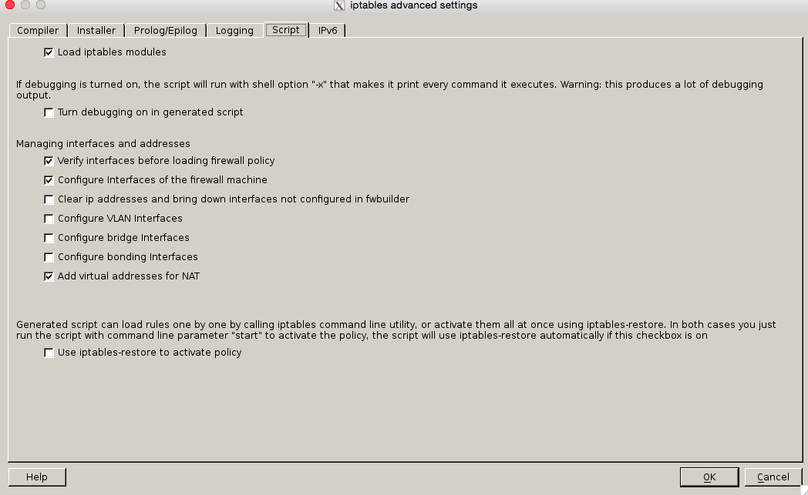

* Yönetim arabirimi olarak eklediğimiz ip adres bilgisini, Firewall Builder uygulamasında yönetim için kullanıcağı bildirilir. Bu işlemi yapmak için, “**Firewalls**” klasörü altında ilgili güvenlik duvarı bulunarak ağaç yapısı açılır. Yönetim arabirimi olarak belirlenmiş arabirime çift tıklayarak, uygulama penceresinin alt kısmında bu arabirime ait ayarların görüntülenmesi sağlanır. İlgili ayarlarda ön tanımlı olarak seçili olmayan “**Management interface**” seçeneği seçilerek gerekli yapılandırma tamamlanır.


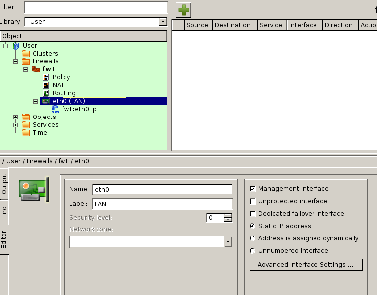

* Oluşturulan güvenlik duvarının adına tıklanarak alt bölümde açılan ekranda, “**Version**” satırından “**1.4.4 or later**” seçeneği seçilir.


* Firewall Builder uygulamasına eklenen güvenlik duvarında bond yapısında kullanılmayarak tek olarak görev yapacak arabirimlerin eklenmesi için, ilgili güvenlik duvarına sağ tıklayarak “**New Interface**” seçeneği seçilir. Eğer sistemde bulunan diğer arabirimler bond yapısında kullanılacak ise bu adım atlarak, “**Bonding Tanımlama**” başlığı altındaki adımlar gerçekleştirilir. Sisteme birden fazla eklecek arabirim mevcut ise bu adımlar tekrarlanacaktır. 

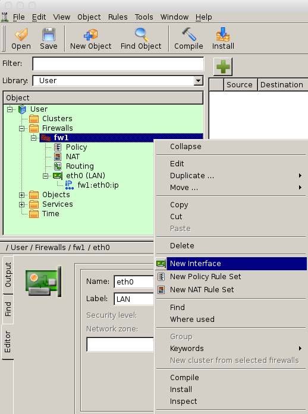

*  Yeni arabirim sisteme eklendikten sonra, eklenen arabirime gerekli ip adres atamalarını yapmak üzere sağ tıklanarak “**New Address**” seçeneği seçilir. 

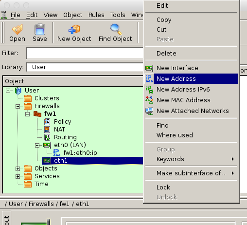


* “**New Address**” seçeneği seçildiğinde, ilgili arabirim altında oluşan “**...:eth1:ip**” satırına tıklanır. Firewall Builder uygulamasının alt bölümünde ilgili arabirime ait ip adres ayarları görüntülenmektedir. Bu bölümde “**Address**” kısmına arabirime ait ip adresi; “**Netmask**” satırına ise ilgili ağa ait ağ maskesi bilgisi girilir. Tüm arabirimler tanımlandığında “**Save**” butonuna basılır.

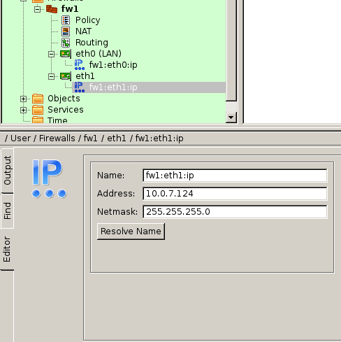

####Güvenlik Duvarı Bonding Tanımlama

* Güvenlik duvarı sistemleri üzerinde bulunan arabirimlerde yedekliliği sağlamak amacı ile yapılacak bonding işlemi,konsol üzerinden yapılmaktadır. 
* Otomatik geçişin sağlanması için, sisteme “**ifenslave**” paketi kurulur.

```
# sudo apt-get install ifenslave
```

* Paket kurulumu tamamlandıktan sonra sistem bonding yapısına geçirilmeye hazır duruma gelmiştir. doküman içerisinde örneklendirerek anlatılan yapıda üç adet ethernet arabirimi bulunmaktadır. (eth0,eth1 ve eth2) eth0 tek başına kullanılacak olup eth1 ve eth2 için bonding tanımlaması yapılacaktır.
* Gerekli ayarlamaların yapılması için, tüm arabirimler kapatılır ve ağ servisi durdurulur.

```
# sudo ifdown eth0
# sudo ifdown eth1
# sudo ifdown eth2
# sudo /etc/init.d/networking stop
```

* Yapılandırma işlemleri “**/etc/network/interfaces**” dosyasından yapılmaktadır. Yapılandırma dosyası ilk açıldığında aşağıda bulunan örnekteki gibi, “**Pardus Temel ISO**” kurulumu sonucunda eth0 yapılandırılmış durumda bulunmaktadır.


```

# sudo vi /etc/network/interfaces
# This file describes the network interfaces available on your system
# and how to activate them. For more information, see interfaces(5).

source /etc/network/interfaces.d/*

# The loopback network interface
auto lo
iface lo inet loopback

# The primary network interface
allow-hotplug eth0
iface eth0 inet static
        address 10.0.0.214
        netmask 255.255.255.0
        network 10.0.0.0
        broadcast 10.0.0.255
        gateway 10.0.0.1
        # dns-* options are implemented by the resolvconf package, if installed
        dns-nameservers 10.0.0.1

```


* “**/etc/network/interfaces**” dosyasının içeriğine bond arabirimi için yapılandırma satırları eklenir. bond arabirimine verilecek ip adresi, ağ maskesi ve ağ bilgileri girilir. Akabinde bond yapılandırması yapılır. “**slaves**” satırında bond yapısına eklenmek istenen arabirim bilgileri yazılır. “**bond_mode**” satırında yapının nasıl kullanılacağı bildirilir. Mevcut yapılandırmada aktif/pasif olacak şekilde yapılmıştır. Yerel arabirim durum kontrolünü sağlayan MII monitor’ ün kontrol sıklığını belirtmek için milisaniye bazında değer “**bond_miimon**” satırına girilir. “**bond_downdelay**” satırı ile, aktif olarak çalışan arabiriminden milisaniye bazında ne kadar süre cevap alınmadığında, pasifde bekleyen arabirime geçiş yapılacağı belirlenir. “**bond_updelay**” parametresi ile, bağlantısı kesilen arabirimin, bağlantısı geri geldiğinde kaç milisaniye içerisinde bond grubuna tekrar alınacağını bildirir.


```

#The bond0 network interface
auto bond0
iface bond0 inet static
        address 10.0.0.216
        netmask 255.255.255.0
        network 10.0.0.0
        broadcast 10.0.0.255
                slaves eth1 eth2
                bond_mode active-backup
                bond_miimon 100
                bond_downdelay 200
                bond_updelay 200 

```

* Gerekli yapılandırma yapıldıktan sonra dosya kaydedilerek kapatılır. Kapatılan arabirimler ve ağ servisi aşağıdaki komutlar ile tekrar çalışır konuma getirilir.


```

# sudo ifup eth0
# sudo ifup bond0
# sudo /etc/init.d/networking start

```


* Sunucu üzerinde yapılan ayarlamalardan sonra yapılandırmayı Firewall Builder ekranına yansıtmak için Firewall Builder uygulamasına giriş yapılır. bond yapılandırması yapılan güvenlik duvarının adına sağ tıklanarak “**New Interface**” seçeneği seçilir.


* Oluşan yeni arabirimde “**Name**” satırına sunucu üzerinde yapılan yapılandırma doğrultusunda bond yapısına verilmiş isim girilir. “**Label**” satırına, ilgili arabirimin iç ya da dış ağda kullanılacağına dair bilgi girilirek, “**Advanced Interface Settings**” seçeneği seçilir.
* Açılan “**Linux: interface settings**” ekranında ilgili arabirimi bond yapısında kullanıldığını belirtlen ayarlamalar yapılır. “**Device Type**” olarak “**Bonding**” , “**Bonding policy**” olarak “**802.3ad**” ve “**Xmit hash policy**” olarak “**layer2**” seçilerek “**OK**” butonuna basılır.


* Bond yapısına dahil olduğunun bilgisini oluşturduğumuz arabirim grubunda kullanılan alt arabirimler “**bond0**” satırına sağ tıklayarak “**New Interface**” seçeneği seçilerek oluşturulur.

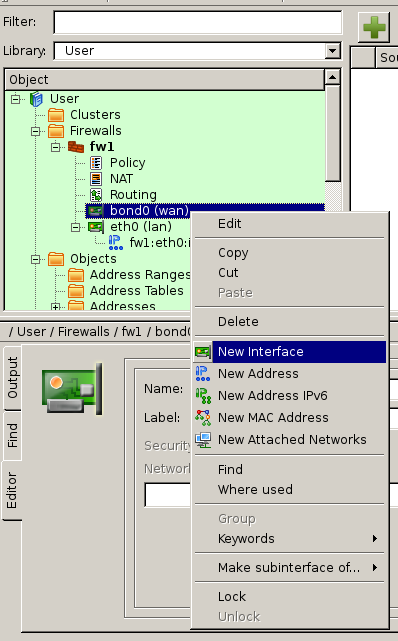

* “**New Interface**” seçeneğinin seçilmesi ile oluşan yeni arabirimde sadece “**Name**” satırına sunucu üzerinde “**slave**” olarak ayarlanılan arabirim yazılır. Aynı işlem tekrarlanarak ikinci arabirimde bu şekilde oluşturulur.


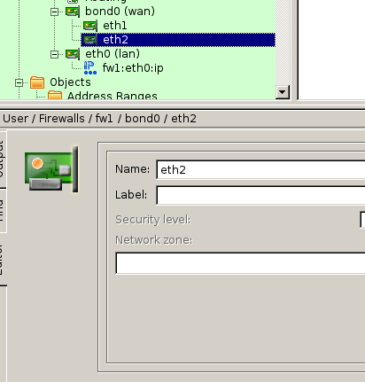


* Arabirimler oluşturulduktan sonra, “**bond0**” satırına sağ tıklanarak bond yapısında belirtilen ip adresini girmek üzere “**New Address**” seçeneği seçilir.


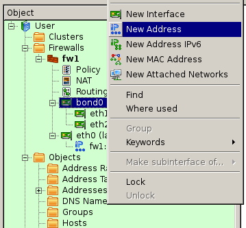

* Oluşan “**bond0:ip**” satırına tıklanarak Firewall Builder ekranında ip adres ayarlarının açılması sağlanır. “**Address**” ve “**Netmask**” satırlarına sunucu üzerindeki yapılandırmada belirtilen ip adres ve ağ maskesi bilgileri girilir. Akabinde “**Save**” butonuna basılarak kaydedilir.


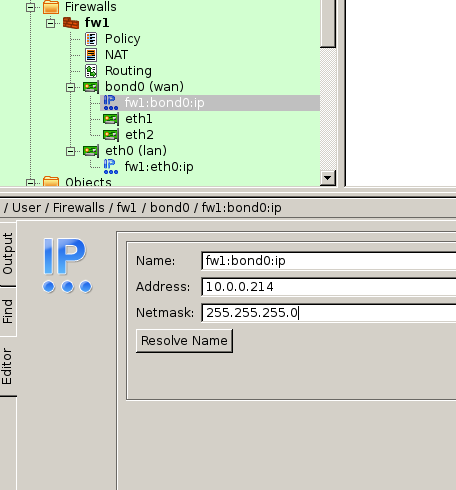

####Zaman Tabanlı Güvenlik Duvarı Kural Tanımlama

* Firewall Builder arayüzünden zaman tabanlı güvenlik duvarı kuralı tanımlamak için, öncelikli olarak zaman aralığı belirlenir. Firewall Builder uygulamasının sol tarafında bulunan ağaç yapısından “**Time**” seçeneğine tıklanaran “**New Time Interval**” seçeneği seçilir.


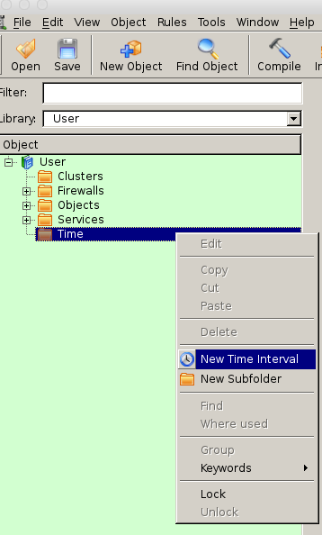

* Firewall Builder uygulamasının alt tarafında açılan ekran ile, zaman tabanlı kural için zaman tanımlamaları yapılır. “**Name**” satırında kurala verilecek isim girilir. Zaman tabanlı kural yapısı iki şekilde çalışmaktadır.
  - 1) Belirli bir gün/saat aralığı için tanım oluşturulabilir. Bu tanım için, “**Start date**” ve “**End date**” başlıklarındaki seçenecek seçilerek, kullanılabilir hale getirilir. Akabinde kural aktif olması istenilen gün ve saat aralığı girilir.

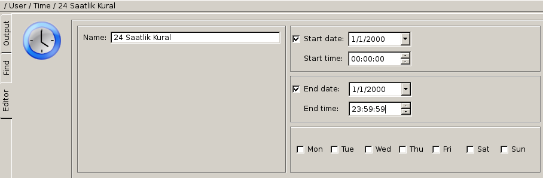

  - 2)Haftanın belirli günlerini kapsayacak şekilde ilgili günün yanındaki kutucuk seçilerek akif hale getirilir ve kuralın o günlerde aktif olması sağlanır. “**Start date**” ve “**End date**” seçenekleri seçilmediği takdirde de “**Start time**” ve “**End time**" seçenekleri aktif durumdadır. Bu sebep ile, haftanın belirli günleri belirli bir saat aralığında da kuralların aktif olması sağlanabilir.


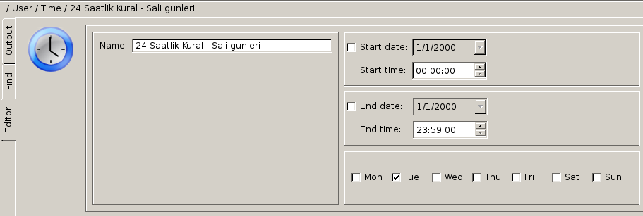


* Zaman ayarlaması yapılacak kuralın girişi ilgili güvenlik duvarının “**Policy**” sekmesinde gerçekleştirildikten sonra, sürükle bırak yöntemi ile istenilen zaman tanımı kural satırınında “**Time**” değerine karşılık gelen kutuya bırakılır. Akabinde “**Install**” butonuna basılarak kuralın sistemlere gönderilmesi sağlanır.


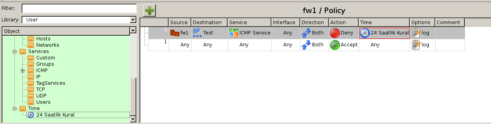


####Yedekli Güvenlik Duvarı Tanımlama

* Yedeklilik için yapılandırılacak güvenlik duvarı sunucularının paylaşımlı ve yedekli kullanılacak IP adresleri belirlenir. Fiziksel sunucular, Firewall Builder sistemine eklenir.

* Firewall Builder arayüzünün sol tarafında bulunan ağaç listesinde “**Clusters**” seçeneğine sağ tıklanarak, çıkan listeden “**New Cluster**” seçeneği tıklanır.


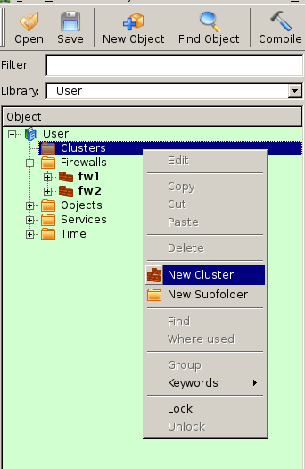


* Açılan ekranda “**Enter the name of the new object**” yazısının yanında bulunan boş alana cluster ismi girilir. Yedeklilik sistemine dahil edilecek güvenlik duvarları bu adımda “**Use in cluster**” sütunundan seçilerek, “**Master**” sütununda hangi güvenlik duvarının ana role sahip olacağı belirlenir. Böylelikle, yedeklilik sistemi çalışmaya başladığında erişilememe durumu söz konusu olmadıkça, sistem “**Master**” olarak seçilen güvenlik duvarı üzerinde çalışır. Seçimler tamamlandıktan sonra “**Next**” butonuna basılarak bir sonraki ekrana geçilir.


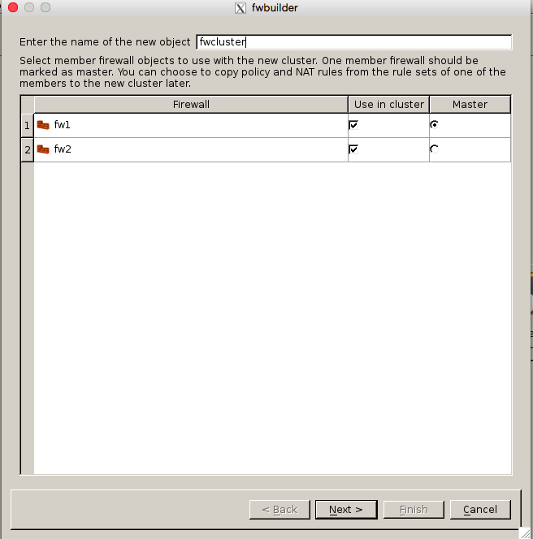

* Açılan yeni pencerede paylaşılacak arabirimler seçilir. Firewall Builder bu seçimi ön tanımlı seçerek sunmaktadır. Güvenlik duvarları özdeş çalışacakları için her bir güvenlik duvarı için aynı isimli arabirimlerin seçili olduğu kontrol edilir. Seçimlerin doğruluğu teyit edildikten sonra “**Next**” tuşuna basılarak bir sonraki adıma geçilir.


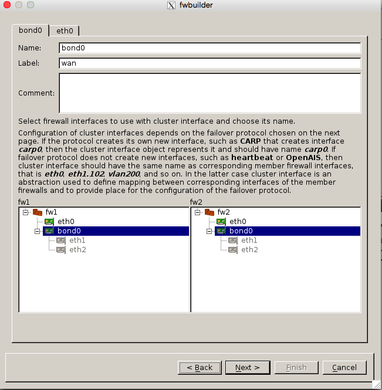


* Açılan pencerede yedeklilik sistemine verilecek IP adres bilgileri belirlenir. Burada önemli nokta IP adresini tanımlarken ağ maskesini 255.255.255.255 olarak girilmesidir.
Diğer arabirimi için de aynı noktalara dikkat edip, girişi yaptıktan sonra “**Next**” tuşuna basılarak devam edilir.


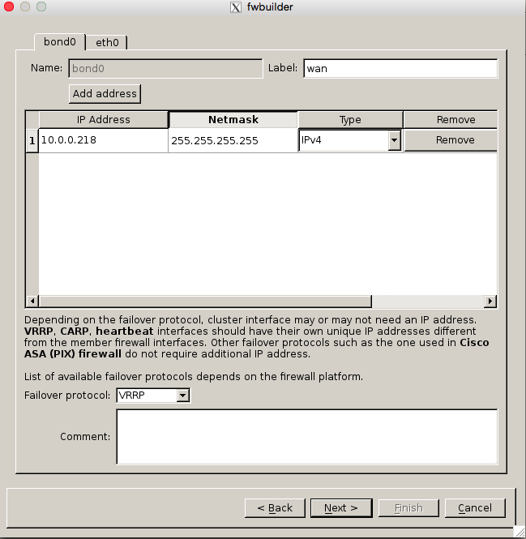


* Açılan ekranda yedeklilik yaratılırken güvenlik duvarlarında bulunan kuralları aktarmak için kaynak güvenlik duvarı sorulmaktadır. Eğer daha önce Firewall Builder ile yönettilen bir güvenlik duvarı cluster yapıya çeviriliyor ve üzerinde kurallar mevcut ise burada kaynak güvenliklik duvarı olarak bu sunucu seçilir. Yeni kurulmuş güvenlik duvarı sunucularından cluster yaratıyorsanız ön tanımlı olarak işaretlenmiş seçenek kullanılarak “**Next**” tuşuna basılır.


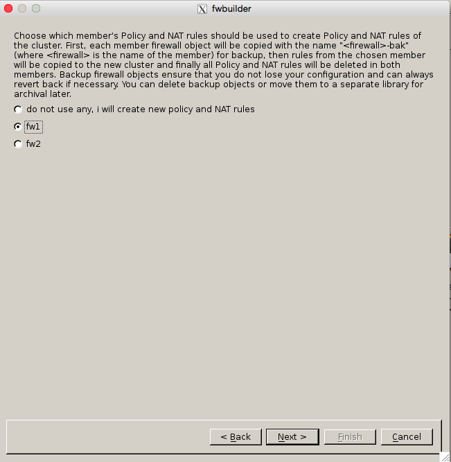

* Son adım olarak oluşturulan cluster için girilmiş verilerin son bir kez denetlenmesi için bir özeti bulunur. Denetleme tamamlandıktan sonra “**Finish**” tuşuna basarak yedeklilik tanımlama işlemi sonlandırılır.


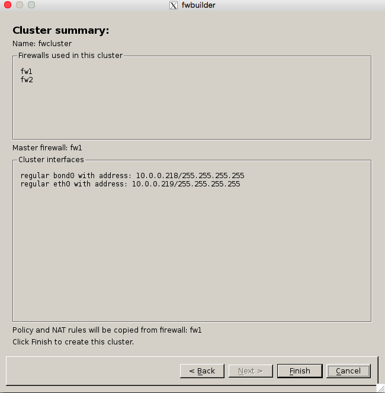

* Yedeklilik yapısına dahil edilmiş ve yapılandırma ayarı yapılacak güvenlik duvarı sunucuları solda bulunan ağaç listeden seçildiğinde, aşağıda açılan bilgilendirme panelinden “**Firewall Settings**” tuşuna tıklanır.


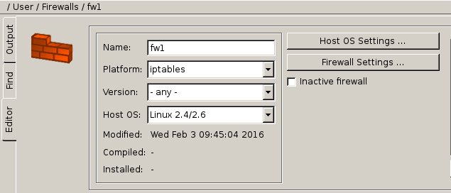


* Açılan “**iptables advanced settings**” ekranının “**Compiler**” sekmesinde “**Assume firewall is part of ‘any’**” seçeneğindeki etkin işareti kaldırılır.


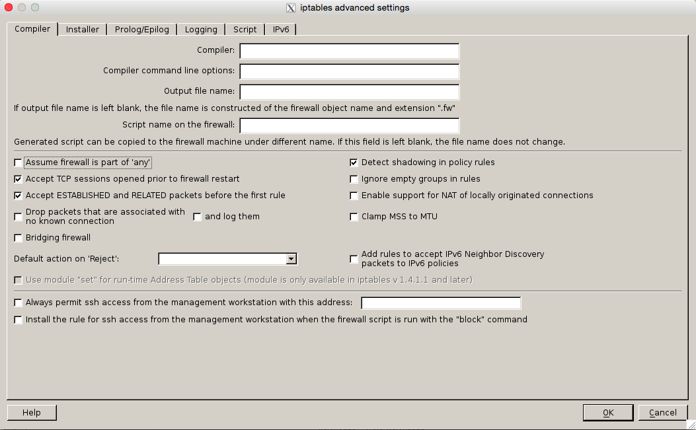


*  “**iptables advanced settings**” penceresinde bulunan “**Prolog/Epilog**” sekmesine tıklanır. Gelen ekranda aşağıdaki değişiklikler yapılır.

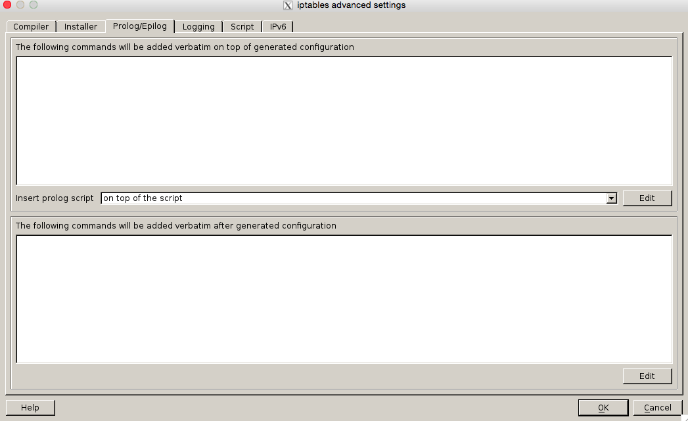

* “**The following commands will be added verbatim on top of generated configuration**” yazısının altında bulunan boş alana KeepAliveD yapılandırmasını yapmak adına aşağıda bulunan içerik kopyalanır. İçerik kopyalama sırasında aşağıdaki satırlar değiştirilmelidir.

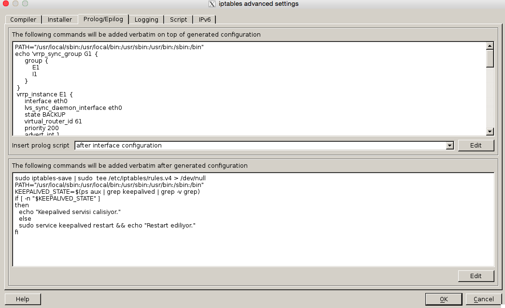

* “**virtual_ipaddress**” değerinin olduğu satırlara cluster yapısına atanmış olan ip adresi girilir. “**auth_pass**” değerinin olduğu satırlara yapılandırılması yapılan cluster için, tüm bileşenlerinde aynı olacak şekilde hexadecimal bir değer girilir. 

```
PATH="/usr/local/sbin:/usr/local/bin:/usr/sbin:/usr/bin:/sbin:/bin"
echo 'vrrp_sync_group G1 {
     group {
         E1
         I1
     }
 }
 vrrp_instance E1 {
     interface eth0
     lvs_sync_daemon_interface eth0
     state BACKUP
     virtual_router_id 61
     priority 200
     advert_int 1
     authentication {
         auth_type PASS
         auth_pass 1q2w3e
     }
     virtual_ipaddress {
        10.0.0.217/32 dev eth0
     }
    nopreempt
 }
 vrrp_instance I1 {
     interface bond0
      lvs_sync_daemon_interface bond0
     state BACKUP
     virtual_router_id 62
     priority 200
     advert_int 1
     authentication {
         auth_type PASS
         auth_pass 1q2w3e
     }
     virtual_ipaddress {
         10.0.0.218/32 dev bond0
     }
    nopreempt
 }' |  sudo tee /tmp/.keepalived.conf > /dev/null
if [ -f /etc/keepalived/keepalived.conf ]
 then
 echo 'Yapilandirma dosyasi mevcut. Degisiklikler karsilastirilacak.'
else
 sudo cp /tmp/.keepalived.conf /etc/keepalived/keepalived.conf
 echo 'Yapilandirma sistemde bulunmadigi icin olusturuldu. Keepalived yeniden baslatiliyor.'
 sudo service keepalived restart
 sudo rm -f /tmp/.keepalived.conf
fi
KEEPALIVED_CONFIG_MD5_EXIST=$(md5sum /etc/keepalived/keepalived.conf | cut -d " " -f 1)
KEEPALIVED_CONFIG_MD5_NEW=$(md5sum /tmp/.keepalived.conf | cut -d " " -f 1)
if [ "$KEEPALIVED_CONFIG_MD5_NEW" != "$KEEPALIVED_CONFIG_MD5_EXIST" ]
 then
 echo 'Degisiklik algilandi.'
 sudo cp /tmp/.keepalived.conf /etc/keepalived/keepalived.conf
 sudo service keepalived restart
 echo 'Degisiklikler devreye alindi.'
 sudo rm -f /tmp/.keepalived.conf
else
 echo "Yapilandirma degismedi."
fi
```

* Etkin sekmede “**Insert prolog script**” yazısının yanında aşağı açılır listeden “**after interface configuration**” seçeneğini seçilir.


* “**The following commands will be added verbatim on after generated configuration**” yazısının altında bulunan boş alana Keepalived servislerini başlatmak için aşağıda bulunan içerik girilir ve “**OK**” tuşuna basılır.

```
sudo iptables-save | sudo  tee /etc/iptables/rules.v4 > /dev/null
PATH="/usr/local/sbin:/usr/local/bin:/usr/sbin:/usr/bin:/sbin:/bin"
KEEPALIVED_STATE=$(ps aux | grep keepalived | grep -v grep)
if [ -n "$KEEPALIVED_STATE" ]
then
  echo "Keepalived servisi calisiyor."
  else
  sudo service keepalived restart && echo "Restart ediliyor."
fi
```

* KeepAliveD tanımına ait tüm adımlar, yedeklilik yapısına dahil diğer güvenlik duvarları içinde uygulanır.
*  Yapılandırma işlemi tamamlandıktan sonra “**Save**” butonuna basılarak yapılandırma kaydedilir ve kural girişlerinin akabinde “**Compile**” ve “**Install**” butonlarına basarak sistemlerde oynatılır.


####Güvenlik Duvarı Yedeklilik Testi Uygulanması

* Firewall Builder arayüzü ile yedeklilik yapısına geçirilmiş, güvenlik duvarlarının çalışırlığını test etme işlemi güvenlik duvarları üzerinden gerçekleştirilir.
* Her iki güvenlik duvarında aşağıdaki komut çalıştırılarak, üzerlerinde bulunan bağlantılar listelenir. Kontrol edildiğinde de her iki güvenlik duvarında da çalışan bağlantıların aynı olduğu burada görülecektir.

```
# sudo netstat -an

```

* Her iki güvenlik duvarında aşağıdaki komut çalıştırıldığında, aktif olarak çalışan güvenlik duvarı üzerinde ekranda sürekli veri akışı olacaktır. 

```
# sudo su -
$ tcpdump -i bond0 -annXX host host_ip
```

* Aktif olarak çalışan güvenlik duvarına yeniden başlatma komutu girilerek, yedeklilik yapısında aktif çalışmayı diğer güvenlik duvarına geçişi sağlanır.

```
$ restart
```

* Aktif çalışan güvenlik duvarının yeniden başlatılması ile, önceden pasif olan güvenlik duvarına aşağıdaki komut girilerek logları takip edildiğinde, “**MASTER STATE**” in bu güvenlik duvarı üzerine geçtiği görülür.

```

$ tail -f /var/log/messages
Feb  1 08:27:42 fw2 Keepalived_vrrp[7333]: VRRP_Instance(E1) Transition to MASTER STATE
Feb  1 08:27:42 fw2 Keepalived_vrrp[7333]: VRRP_Group(G1) Syncing instances to MASTER state
Feb  1 08:27:42 fw2 Keepalived_vrrp[7333]: VRRP_Instance(I1) Transition to MASTER STATE
Feb  1 08:27:42 fw2 kernel: [322107.601850] RULE 4 -- ACCEPT IN= OUT=bond0 SRC=172.16.16.231 DST=224.0.0.18 LEN=64 TOS=0x00 PREC=0xC0 TTL=255 ID=1 PROTO=AH SPI=0xac1010e7
Feb  1 08:27:42 fw2 kernel: [322107.602071] RULE 4 -- ACCEPT IN= OUT=bond1 SRC=94.101.82.62 DST=224.0.0.18 LEN=64 TOS=0x00 PREC=0xC0 TTL=255 ID=1 PROTO=AH SPI=0x5e65523e
Feb  1 08:27:43 fw2 Keepalived_vrrp[7333]: VRRP_Instance(I1) Entering MASTER STATE
Feb  1 08:27:43 fw2 Keepalived_vrrp[7333]: VRRP_Instance(E1) Entering MASTER STATE
Feb  1 08:27:43 fw2 kernel: [322108.603251] RULE 4 -- ACCEPT IN= OUT=bond1 SRC=94.101.82.62 DST=224.0.0.18 LEN=64 TOS=0x00 PREC=0xC0 TTL=255 ID=2 PROTO=AH SPI=0x5e65523e
Feb  1 08:27:43 fw2 kernel: [322108.603506] RULE 4 -- ACCEPT IN= OUT=bond0 SRC=172.16.16.231 DST=224.0.0.18 LEN=64 TOS=0x00 PREC=0xC0 TTL=255 ID=2 PROTO=AH SPI=0xac1010e7

```


####Güvenlik Duvarı Kural Tanımlama

* Firewall Builder arayüzünden kural girişi yapmadan önce sol tarafta bulunan ağaç yapısındaki “**Objects**” ya da “**Services**” başlıkları altından kurallarda kullanılacak nesneler tanımlanır. 


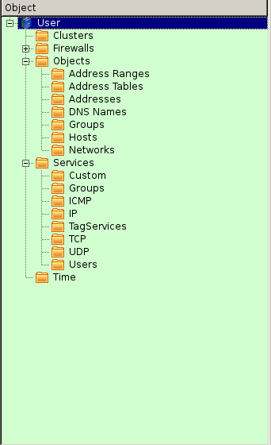
   
* Objects - “**Address Ranges**” belirlenen iki ip adresi arasındaki (IPv4 ve ya IPv6) tüm ip adreslerinin tanımlayan nesneleri barındıran klasördür. Objects - “**Address Tables**” önceden hazırlanmış bir “**txt**” dosyasının sisteme verilerek, dosyada tanımlı ip adreslerini barındıran nesneleri barındıran klasördür. Objects - “**Addresses**” tek bir ip adresi için (IPv4 ve ya IPv6) yaratılan nesneleri barındıran klasördür. Objects - “**DNS Names**” DNS A kayıtlarında bulunan bir ip adresi için oluşturulan nesneleri barındıran klasördür.	Objects - “**Groups**” kullanıcı tarafından belirlenen ip adresi, host, DNS host gibi birden fazla nesneyi tek bir grup altında yeni bir nesne olarak barındırdan klasördür. Objects - “**Hosts**” bir ya da daha fazla arabirime sahip sunucuları nesne olarak barındıran klasördür. Objects - “**Networks**” IPv4 ve ya IPv6 olan bir ağ için oluşturulan nesneleri barındıran klasördür. Services - “**Custom**” kullanıcı tarafından belirlenen platform tabanlı servislere ait nesneleri barındıran klasördür. Services - “**Groups**” IP, TCP,UDP ve ICMP protokollerini barındırarak kullanıcı tarafından oluşturulan grup nesnelerini barındıran klasördür. Services - “**ICMP**” ICMP protokolünü ile ilgili kullanıcı tarafından oluşturulan nesneleri barındıran klasördür. Services - “**IP**” IP protokolünü ile ilgili kullanıcı tarafından oluşturulan nesneleri barındıran klasördür. Services - “**TagServices**” tag nesnelerini barındıran klasördür. Services - “**TCP**” TCP protokolünü ile ilgili kullanıcı tarafından oluşturulan nesneleri barındıran klasördür. Services - “**UDP**” UDP protokolünü ile ilgili kullanıcı tarafından oluşturulan nesneleri barındıran klasördür. Services - “**Users**” Kullanıcı bazlı kurallarda kullanılmak üzere oluşturulan kullanıcı nesnelerini barındıran klasördür.
* İhtiyaç doğrultusunda gerekli nesneyi oluşturmak için, ilgili gruba sağ tıklanarak yeni seçeneği seçilir. Örnekte yeni bir adres bilgisi girilceceğinden “**New Address**” seçeneği seçilir.


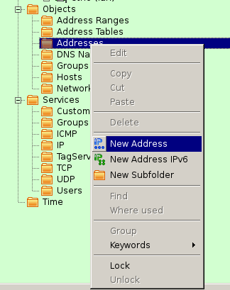

* Firewall Builder uygulamasının alt sekmesinde açılan yeni ip adres girişinde “**Name**” satırına ilgili ip adresi için verilecek isim, “**Address**” kısmında ip adres bilgisi girilir.


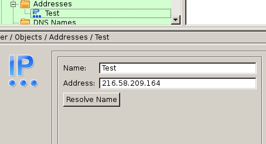

* “**Objects**” bölümünde yapılan işlem aynı şekilde “**Services**” bölümünde yapılarak engellenmek istenen servis türünün bilgisi girilir. Örnekte “**ICMP**” için nesne oluşturulmuştur.


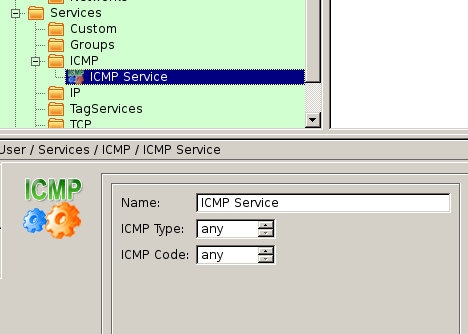

* Gerekli nesneleri oluşturduktan sonra, kural girişlerini yapmak üzere, Firewall Builder ağaç yapısından ilgili güvenlik duvarına ait “**Policy**” seçeneceği seçilir. Sağ tarafta açılan ekranda bulunan “**Yeşil Artı**” seçeneğine basılarak yeni bir kural eklenmesi sağlanır. Kural eklendikten sonra, gerekli ayarlamalar sürükle, bırak yöntemi ile “**Objects**” ve “**Services**” altından alınarak ilgili sütunlara taşınır. “**Policy**” ekranındaki sutünların görevleri aşağıda belirtilmektedir. İlgili kural girişleri yapıldıktan sonra “**Compile**” ve “**Install**” butonlarına basılarak, kuralların güvenlik duvarına gönderilmesi sağlanır.


* “**Source**” kuralın uygulanacağı kaynak adres bilgisidir.
“**Destination**” kuralın uygulanacağı hedef adres bilgisidir.
“**Service**” kuralın üzerinde işlem yapacağı servis bilgisidir.
“**Interface**” kuralın kaynak uygulanacağı arabirim bilgisidir.
“**Direction**” kuralın tek yada çift yönlü olacağının bilgisidir.
“**Action**” girilen kuralın hangi doğrultusa çalışacağının bilgidir.
“**Time**” zaman bazlı kural girişlerinin bilgisidir.
“**Options**” kural ile ilgili girilmek istenen opsiyonlar bu sütundan girilmektedir.
“**Comment**” kural ile ilgili yorum bu alana yazılmaktadır. 


####Güvenlik Duvarı Kural Kapatma ve Kaldırma

* Firewall Builder arayüzünde, kuralı kaldırmak ya da kapatmak istenilen güvenlik duvarının “**Policy**” sekmesine, sol tarafta bulunan ağaç yapısından gidilir.

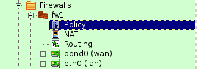

* “**Policy**” seçeneğinin seçilmesi ile, sağ ekranda seçilen güvenlik duvarına ait kurallar görüntülenmektedir. Kural kaldırırken ve / ve ya kapatırken güvenlik duvarı kurallarındaki bütünlüğün **bozulmaması** gerekmektedir.


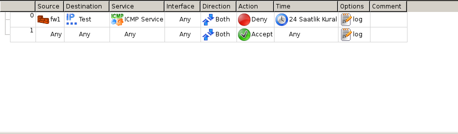

* Kaldırmak ya da kapatmak istediğimiz kuralın sıra numarasına sağ tıklarak menünün açılması sağlanır. Kuralı tamamen kaldırmak için “**Remove Rule**” kapatmak için ise “**Disable Rule**” seçeneği seçilmelidir. Kaldırılan kural için tekrar işlem yapmak mümkün olmaz iken, kapatılan kural ihtiyaç durumunda aynı adımlar ile çıkan menüden “**Enable Rule**” seçeneği ile tekrar çalışır duruma getirilebilir.

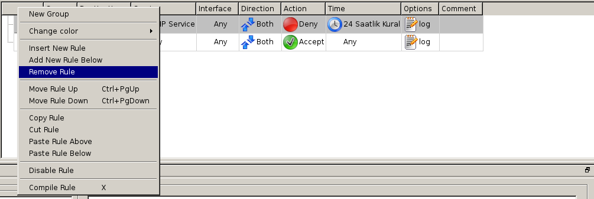

####Güvenlik Duvarı Toplu IP Adres Girişi

* Firewall Builder arayüzünden, bir kural içerisinde kullanılacak tüm ip adresleri “**txt**” dosyasına yazılarak tek seferde sisteme dahil edilebilir. Bu dosyayı oluşturmak için Firewall Builder makinesine ssh ile bağlanılarak, istenilen bir dizin altında aşağıdaki komut ile dosya oluşturulur ve içerisinde ip adresleri yazılır.

```

# vi black_list.txt
8.8.8.8
8.8.4.4
4.4.2.2
4.4.4.4
```

* Bunun için Firewall Builder uygulamasının ağaç yapısında bulunan “**Objects**” başlığı altından “**Adress Tables**” seçeneğine sağ tıklanarak, “**New Address Table**” seçeneği seçilir.


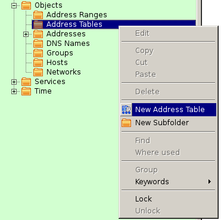

* Açılan alt ekranda “**Name**” satırına tabloya verilmek istenen isim girilir. “**File name**” satırına “**black_list.txt**” dosyasının bulunduğu yer girilir. “**Choose File**” seçeneği seçilerek açılan “**Choose a file or type the name to create new**” ekranında ilgili dosya seçilir.

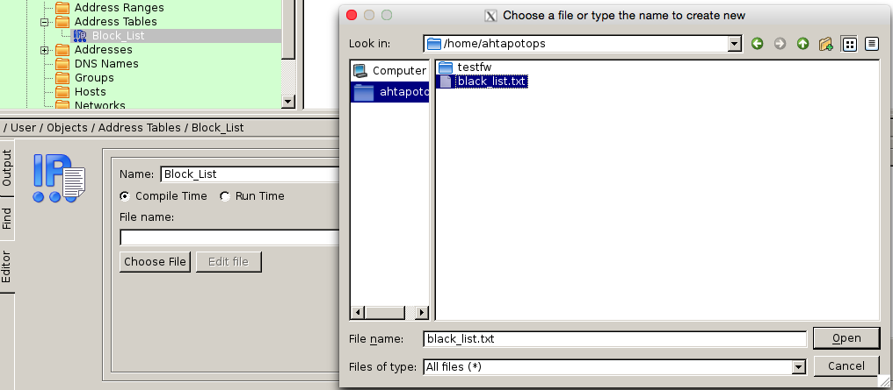

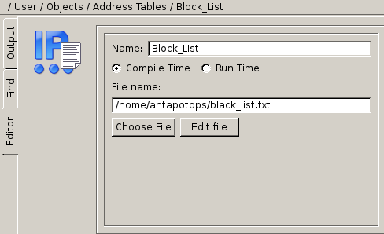

* Kural eklenmek istenen güvenlik duvarının “**Policy**” ekranına giriş yapılır. Akabinde “**Yeşil Artı**” tuşuna basılarak yeni kural eklenir. Sürükle bırak yöntemi ile “**Source**”, “**Destination**”, “**Service**”, “**Interface**”, “**Direction**”, “**Action**”, “**Time**”, “**Options**” seçenekleri girilirek “**Install**” butonuna basılır.

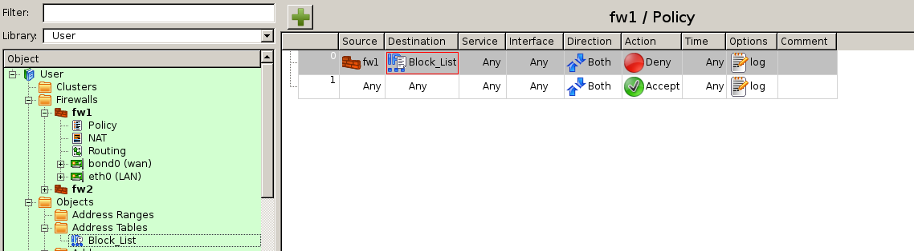

* Ansible playbook’un oynaması ile birlikte ilgili güvenlik duvarı üzerinde değişiklikler yapılır. Değişiklikler yapılmadan önce ve sonrasındaki “**iptables**” durumu aşağıdaki gibi olacaktır.

```
root@fw1:~# iptables -L -v -n
Chain INPUT (policy DROP 0 packets, 0 bytes)
 pkts bytes target     prot opt in     out     source               destination         
   39 21424 ACCEPT     all  --  *      *       0.0.0.0/0            0.0.0.0/0            state RELATED,ESTABLISHED
   52  3182 RULE_0     all  --  *      *       0.0.0.0/0            0.0.0.0/0            state NEW

Chain FORWARD (policy DROP 0 packets, 0 bytes)
 pkts bytes target     prot opt in     out     source               destination         
    0     0 ACCEPT     all  --  *      *       0.0.0.0/0            0.0.0.0/0            state RELATED,ESTABLISHED
    0     0 RULE_0     all  --  *      *       0.0.0.0/0            0.0.0.0/0            state NEW

Chain OUTPUT (policy DROP 0 packets, 0 bytes)
 pkts bytes target     prot opt in     out     source               destination         
   40  3220 ACCEPT     all  --  *      *       0.0.0.0/0            0.0.0.0/0            state RELATED,ESTABLISHED
    0     0 RULE_0     all  --  *      *       0.0.0.0/0            0.0.0.0/0            state NEW

Chain RULE_0 (3 references)
 pkts bytes target     prot opt in     out     source               destination         
   52  3182 LOG        all  --  *      *       0.0.0.0/0            0.0.0.0/0            LOG flags 0 level 6 prefix "RULE 0 -- ACCEPT "
   52  3182 ACCEPT     all  --  *      *       0.0.0.0/0            0.0.0.0/0        

```

####Güvenlik Duvarı QoS ve Rate Limiting Tanımlama

* Firewall Builder uygulması üzerinde QoS ve Rate Limiting yapılmak istenilen güvenlik duvarına çift tıklanarak, uygulamanın alt tarafında açılan panelden “**Firewall Settings**” seçeneği seçilir.

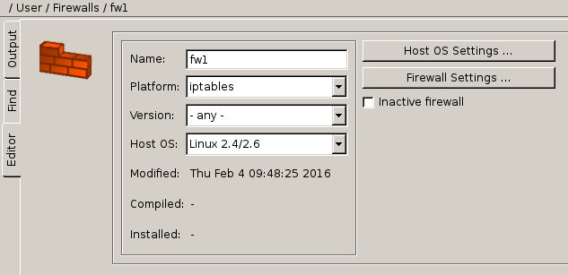


* Açılan “**iptables advanced settings**” sayfasında, “**Prolog/Epilog**” tabına gidilir. “**The following commands will be added verbatim after generated configuration**” penceresine QoS ve Rate Limiting işlemlerini yapan komutlar girilirek “**OK**” tuşuna basılır. Ardından “**Install**” seçeneği seçilerek, sistemlerde bu kuralların oynaması sağlanır.


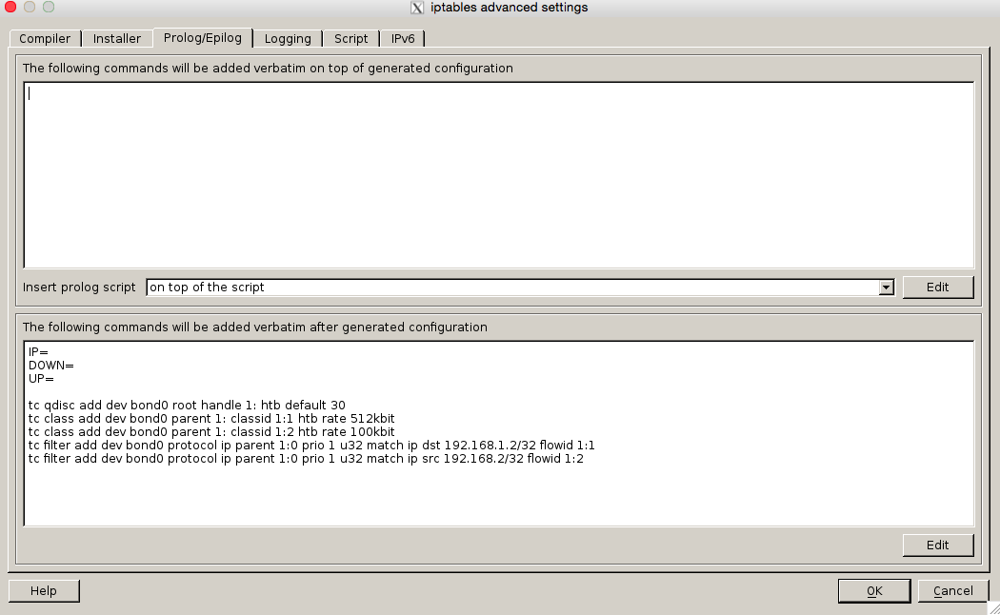

* Buradaki yapılandırmada Linux çekirdeği ile birlikte gelen “**TC (traffic control)**” kullanılmıştır. TC içerinde çeşitli kuyruk disiplinleri bulundurmaktadır. Sınıflı kuyruk disiplinleri arasından karmaşıklığı daha az olması, trafik önceliklendirme, trafik şekillendirme ve  trafik sınıflandırma özelliklerine sahip olduğu için “**HTB (Hierarchical Token Bucket)**” kuyruk disiplini tercih edilmiştir. HTB kuyruk disiplini ile kullanılabilecek parametreler;
    * “**rate**” sınıfın kullanması garanti edilen hız değeridir.
    * “**ceil**” eğer hat boş ise sınıfın kullanabileceği maksimum hızdır.
    * “**burst**” boş durumda biriktirilebilecek en fazla bayt toplama miktarıdır.
    * “**cburst**” ceil için bayt toplama miktarıdır.
    * “**mtu**” paket içerisindeki veri bölümünde taşınabilecek en fazla veri miktarıdır.
    * “**prio**” sınıfın önem derecesidir. Düşük sayıların önem derecesi daha fazladır.
* Fiziksel ağ arayüzüne ulaşılan paketler “**tc**” filtreleri kullanılarak etiketlenir. Kök sınıftan başlanarak ana-yavru ilişkisi içerisinde hiyerarşik olarak sınıflar oluşturulur. Sınıfların kimlikleri, filtrelerle etiketlenen akış kimliği ile aynı seçilmelidir. Sınıflar oluşturulurken o sınıfa ait olan trafiğe ayrılıp kullanması garanti edilen trafik miktarı, ulaşabileceği en fazla trafik miktarı, trafiğinin önceliği belirlenir. Önceliklendirme numarası küçük olan trafiklerin önem derecesi daha yüksektir. Örnek olarak;
* Belirli bir IP adresi için “**bond0**” fiziksel ağ arayüzündeki indirme ve yükleme hızlarının sınırlandırılıp önceliklerinin belirlenmesi;

```
tc qdisc add dev bond0 root handle 1: htb default 30
tc class add dev bond0 parent 1: classid 1:1 htb rate 512kbit
tc class add dev bond0 parent 1: classid 1:2 htb rate 100kbit
tc filter add dev bond0 protocol ip parent 1:0 prio 1 u32 match ip dst 192.168.1.2/32 flowid 1:1
tc filter add dev bond0 protocol ip parent 1:0 prio 1 u32 match ip src 192.168.2/32 flowid 1:2

```

* IP adresine ait indirme trafiği 1:1 sınıfı olarak, yükleme trafiği ise 1:2 sınıfı olarak belirlenmiştir. Her iki sınıfında önem derecesi “**prio 1**” ifadesiyle 1 olarak belirlenmiştir.
* Protokol bilgisine göre filtreleme; “**match ip protocol 1 0xff**” “**protocol 1**” kısmı icmp paketlerini ifade etmektedir. Diğer protokollerin bilgisine “**/etc/protocols**” dosyasından ulaşılabilir.
* Kaynak IP bilgisine göre filtreleme; “**match ip src 1.2.3.0/24**”
Hedef IP bilgisine göre filtreleme; “**match ip dst 4.3.2.0/24**”
Kaynak kapı bilgisine göre filtreleme; “**match ip sport 80 0xffff**”
Hedef kapı bilgisine göre filtreleme; “**match ip dport 80 0xffff**”
* Hem IP adresi hemde kapı bilgisine göre filtreleme; “**match ip dst 4.3.2.0/24 match ip dport 80 0xffff**” 
* “**prio x**” kısmından paketlerin önceliği belirlenir.
* “**flowid x:x**” kısmından paketlerin etiketi belirlenir. “**:**” işaretinden önceki sayı sınıfın bağlı olduğu ana sınıfı, ikinci sayı ise kendi sınıf numarasını belirtir.

####Güvenlik Duvarı Değiştirme

* Firewall Builder uygulaması tarafından yönetilen bir güvenlik duvarının donanımsal ve / ve ya yazılımsal problemlerden dolayı değiştirilmesi gerektiği durumda yapılacaklar bu başlık altında listelenmiştir.
* Yerine konumlandırılacak yeni güvenlik duvarı asgari olarak, eskisi ile aynı özelliklere sahip olmalıdır.
* “**AHTAPOT Pardus Temel ISO Kurulum**” dokümanında bahsedildiği şekilde, yeni güvenlik duvarının işletim sistemi kurulumu yapılır.
* İşletim sistemi kurulumu sırasında “**eth0**” arabirimine ip adresi verilmiş olup, değişen sistem üzerindeki tüm arabirim yapılandırması yeni sistem üzerinde de yapılır.
* Eski güvenlik duvarı fiziksel olarak çıkarılarak, yeni güvenlik duvarı konumlandırılır.
* Ansible üzerinde belirlenmiş “**crontab**” sıklığı doğrultusunda, yeni güvenlik duvarı üzerinde Ansible Playbook oynarak, tüm kuralları sisteme dahil edecektir.
* Hali hazırda Firewall Builder uygulaması üzerinde ilgili güvenlik duvarına ait yapılandırma bulunduğundan herhangi bir değişiklik yapılmayacaktır.

####Geçiçi Kural Tanımlama Sistemi

Ahtapot GKTS uygulaması önceden IP adresi belirlenmiş bir bilgisayarın, güvenlik duvarları arkasında bulunan ve IP adresi bilinen servislere zaman kısıtlı erişim sağlamak işlemini gerçekleştirir. Bu işlemler onay gerektirmeden gerçekleşir.

* Pardus Temel ISO dosyasından Pardus kurulumu tamamlandıktan sonra sisteme “**ahtapotops**” kullanıcısı ile giriş yapılır. ahtapotops kullanıcısının parolası “**LA123!!**” olarak öntanımlıdır.

**NOT :** Pardus Temel ISO dosyasından Pardus kurulumu adımları için “AHTAPOT Pardus Temel ISO Kurulumu” dokümanına bakınız.

* Sisteme giriş sağlandıktan sonra, aşağıdaki komut ile root kullanıcısına geçiş yapılır. root kullanıcısı için parola Pardus Temel ISO kurulumu sırasında belirlenmiş paroladır.

```
$ sudo su -
```

* Sisteme root kullanıcısı ile bağlantı sağlandıktan sonra aşağıdaki komut ile ansible ve git kurulumları yapılır:

```
# apt-get install -y ansible
# apt-get install -y git
```

* Bu adımda kurulum, sıkılaştırma vb. gibi işleri otomatize etmeyi sağlayan ansible playbook’ları Pardus Ahtapot deposundan indirilir. 

```
# apt-get install -y ahtapot-mys
# cp -rf /ahtapotmys/* /etc/ansible/
```

* Ahtapot projesi kapsamında oluşacak tüm loglar “**/var/log/ahtapot/**” dizinine yazılmaktadır. Bu dizinin sahipliğini “**ahtapotops**” kullanıcısına vermek için aşağıdaki komut çalıştırılır.

```
# chown ahtapotops:ahtapotops -R /var/log/ahtapot
```

* Tercih ettiğimiz metin düzenleyicisini kullanarak hosts dosyasını düzenliyoruz. Aşağıdaki örnekte vi kullanılır. Açılan dosyada [gkts] kısmı altına gitlab makinesinin tam ismi (FQDN) girilir.

```
# su - ahtapotops 
$ cd /etc/ansible/
$ sudo vi hosts
[gkts]
gkts.alan.adi
```

* “**roles/base/vars**” klasörü altında değişkenleri barındıran “**main.yml**” dosyası üzerinde “**ntp server bilgileri girilmektedir.**” başlığı altındaki “**FirstNtpServerHost**” ve “**SecondNtpServerHost**” satırları karşısına NTP sunucu bilgileri girilmelidir. “**# rsyslog yapilandirmasini belirtmektedir.**” başlığı altındaki “**Server1**” ve “**Server2**” satırları Rsyslog sunucusunun FQDN bilgisi ile doldurulmalıdır. Sistemde bir Rsyslog sunucu olduğu durumlarda “**Server2**”, bir NTP sunucu olduğu durumda ise “**SecondNtpServerHost**” satırının başına “**#**” işareti konularak o satırın işlem dışı kalması sağlanmalıdır. Sunucularda ssh portunun varsayılan değer dışında bir değere atanması istendiği durumda, “**ssh**” fonksiyonu altında bulunan “**Port**” değişkenine istenen yeni değer yazılmalıdır.

```
$ cd roles/base/vars/
$ sudo vi main.yml
# ntp server bilgileri girilmektedir.
        FirstNtpServerHost: "0.tr.pool.ntp.org"
        SecondNtpServerHost: "1.tr.pool.ntp.org"

# rsyslog yapilandirmasini belirtmektedir.
        conf:
            source: rsyslog.conf.j2
            destination: /etc/rsyslog.conf
            owner: root
            group: root
            mode: 0644
        service:
            name: rsyslog 
            state: started
            enabled: yes
        ConnectionType: tcp 
        Server1: rsyslog01.domain_adı
        #Server2: rsyslog02.domain_adı
        Port: 514
        ActionQueueMaxDiskSpace: 1g 
        ActionQueueSaveOnShutdown: on 
        ActionQueueType: LinkedList 
        ActionResumeRetryCount: -1 
        WorkDirectory: "/var/spool/rsyslog" 
        IncludeConfig: "/etc/rsyslog.d/*" 
    ssh:
# ssh yapilandirmasini belirtmektedir.
        conf:
            source: sshd_config.j2
            destination: /etc/ssh/sshd_config
            owner: root
            group: root
            mode: 0644
        service:
            name: ssh
            state: started
            enabled: yes
        TrustedUserCAKeys:
            source: ahtapot_ca.pub.j2
            destination: /etc/ssh/ahtapot_ca.pub
            owner: root
            group: root
            mode: 0644
        LocalBanner:
            source: issue.j2
            destination: /etc/issue
            owner: root
            group: root
            mode: 0644
        RemoteBanner:
            source: issue.net.j2
            destination: /etc/issue.net
            owner: root
            group: root
            mode: 0644
        Port: 22
```

* “**roles/gkts/vars/**” klasörü altında değişkenleri barındıran “**main.yml**” dosyası üzerinde “**hook**” fonksiyonu altında bulunan “**server**” değişkenine Merkezi Yönetim Sisteminde bulunan ansible makinesinin FQDN bilgisi, “**port**” değişkenine ansible makinesine ssh bağlantısı için kullanılcak ssh port bilgisi yazılır. “**nginx**” fonksiyonunun alt fonksinyonu olan “**admin**” altında bulunan “**server_name**” değişkenine admin arayüzü için ayarlanması istenen url adres bilgisi yazılır (Örn: admin.gkts.local).  Yönetici arayüzüne erişim için internet tarayıcısında bu adres kullanılacaktır. “**nginx**” fonksiyonunun alt fonksinyonu olan “**developer**” altında bulunan “**server_name**” değişkenine admin arayüzü için ayarlanması istenen domain adres bilgisi yazılır(Örn: kullanici.gkts.local). Kullanıcı arayüzüne erişim için internet tarayıcısında bu adres kullanılacaktır. 

```
   hook:
        conf:
            source: gktshook.sh.j2 
            destination: /var/opt/ahtapot-gkts/gktshook.sh 
            owner: ahtapotops 
            group: ahtapotops 
            mode: 755 
        server: ansible.domainadi
        port: ssh_port
    nginx:
        conf:
            source: gkts.conf.j2 
            destination: /etc/nginx/conf.d/gkts.conf 
            owner: root
            group: root 
            mode: 644 
        admin:
            listen: 443 
            server_name: admin_url_adresi 
            access_log: /var/log/nginx/gkts-admin-access.log
            error_log: /var/log/nginx/gkts-admin-error.log
        developer:
            listen: 443 
            server_name: kullanici_url_adresi 
            access_log: /var/log/nginx/gkts-developer-access.log
            error_log: /var/log/nginx/gkts-developer-error.log
```

* “**Ansible Playbookları**” dokümanında detaylı anlatımı bulunan, sunucu üzerinde gerekli sıkılaştırma işlemleri ve GKTS kurulumu yapacak olan “**gkts.yml**” playbook’u çalıştırılır.

```
$ ansible-playbook playbooks/gkts.yml --connection=local --skip_tags=hook
```

* GKTS kurulumu tamamlandıktan sonra sunucu MYS ile yönetileceğinden, sunucu üzerindeki ansible paketi kaldırılır.

```        
# dpkg -r ansible
```

* GKTS kurulumu tamamlanmış olacak ve kullanıcı tanımlama, depo oluşturma gibi yapılandırma işlemleri için hazır hale gelmiş olacaktır.

###Yönetici Arayüz Kullanımı

* GKTS playbookunda belirlenen domain adresi internet tarayıcısında “**https://admin_url_adresi**” şeklinde yazılarak, yönetici arayüzüne erişilir.
* Açılan ekranda, “**Yönetici Paneli**” butonuna basılarak giriş ekranına ulaşılır.


* Giriş ekranında, kurulum sırasında ön tanımlı olarak gelen “**Kullanıcı adı**” bölümüne “**ahtapotops**”, “**Parola**” bölümüne ise “**gkts2016**” bilgileri girildikten sonra “**OTURUM AÇ**” butonuna basılır.

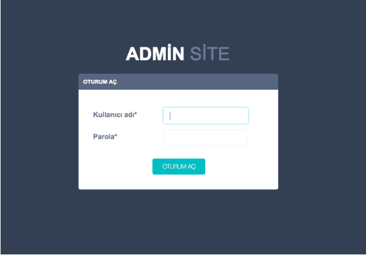

* Öntanımlı olarak gelen parolayı değiştirmek için, ekranda sağ üst köşede bulunan kullanıcı adı bilgisine tıklanarak açılan menüden “**Parola değiştir**” seçeneği seçilir.


* Açılan parola değiştirme ekranında, “**Eski parola**” satırına öntanımlı gelen parola, “**Yeni parola**” satırına belirlenmem istenen yeni parola, “**Yeni parola onayı**” satırına ise yeni parola tekrar yazılarak “**PAROLAMI DEĞİŞTİR**” butonuna basılır.

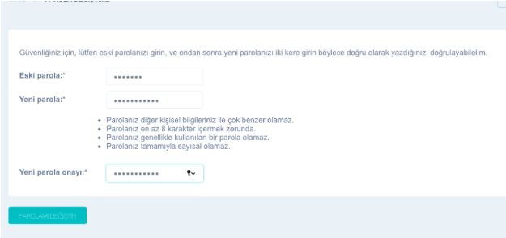

* Sisteme kullanıcı eklemek için anasayfada bulunan “**KİMLİK DOĞRULAMA VE YETKİLENDİRME**” bölümünde bulunan “**Kullanıcılar**” satırında bulunan “**+**” butonuna basılır.

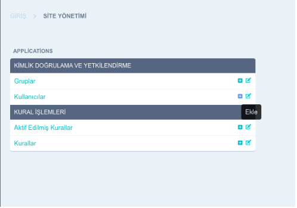

* Açılan sayfada, “**Kullanıcı adı**” bölümüne oluşturulacak kullanıcının adı, “**Parola**” bölümüne o kullanıcı için oluşturulacak parola, “**Parola onayı**” bölümüne ise oluşturulan parola yazılarak “**KAYDET**” butonuna basılır. Başka bir kullanıcı daha ekleme işlemi yapılacak ise “**KAYDET**” butonu yerine “**Kaydet ve başka birini ekle**” butonuna basılır. Eklenecek kullanıcının “**Yönetici**” haklarına sahip olması isteniyor ise, “**Kaydet ve düzenlemeye devam et**” butonuna basılır.

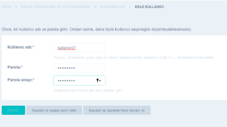

* “**Yönetici**” rolü verilecek kullanıcı oluşturulurken “**Kaydet ve düzenlemeye devam et**” butonuna basıldığında gelen ayar ekranında yetki vermek için “**İZİNLER**” tabına basılır.

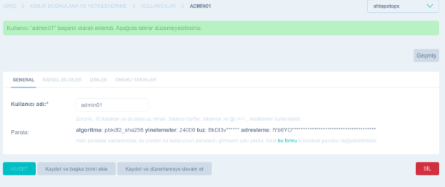

* Açılan “**İZİNLER**” ekranında “**Süper kullanıcı durumu**” seçeneği seçilerek “**KAYDET**” butonuna basılır.

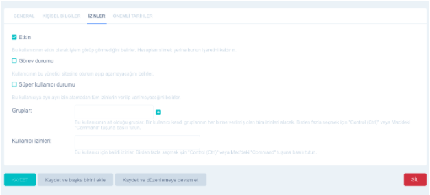

* Sol tarafta bulunan menüden “**Kimlik Doğrulama ve Yetkilendirme**” seçeneğinin üzerine gelerek “**Kullancılar**” seçilerek, kullanıcı arayüzü açılır.

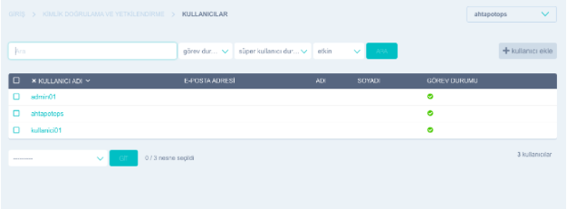

* Oluşturulan her kullanıcı aksi belirtilmedikce pasif halde bulunmaktadır. Kullanıcıya giriş ve işlem izni vermek için ilgili kullanıcının adına tıklanarak açılan ekranda “**İZİNLER**” tabına gidilere “**Görev durumu**” seçeneği seçilerek “**KAYDET**” butonuna basılır.

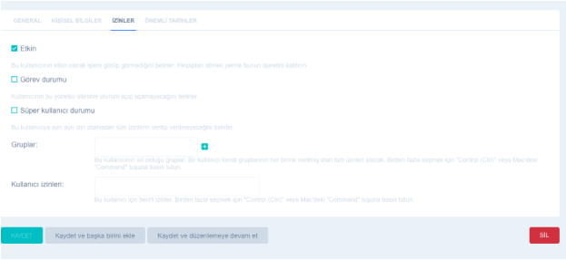

* Yönetici tarafından sisteme kural tanımlamak için sol tarafta bulunan menüden “**Kural İşlemleri**” seçeneğine tıklanarak açılan yeni menüden “**Kurallar**” seçeneği seçilir.

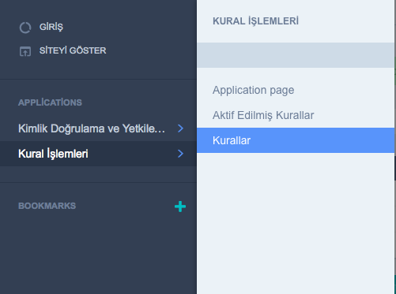

* Açılan ekranda sağ tarafta bulunan “**+ Kural Ekle**” butonuna basılır.

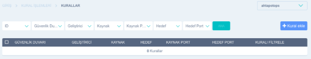

* Yeni kural ekleme sayfasında “**Kaynak**” bölümüne bağlantının başlatılacağı kaynak adresi, “**Hedef**” bölümüne bağlantı sağlanacak hedef adresi, “**Kaynak Port**” bölümüne bağlantının başlatılacağı kaynak port bilgisi, “**Hedef Port**” bölümüne bağlantının başlatılacağı hedef port bilgisi, “**Protokol**” bölümüne belirlenen protokol, “**Süre**” bölümüne “**dakika**” türünden kuralın aktif kalma süresi, “**Geliştirici**” bölümüne ilgili kuralı aktif etmeye hakkı olacak kullanıcı bilgisi ve “**Güvenlik Duvarı**” bölümüne kuralın oynatılacağı güvenlik duvarının FQDN bilgisi girilerek “**KAYDET**” butonuna basılır.

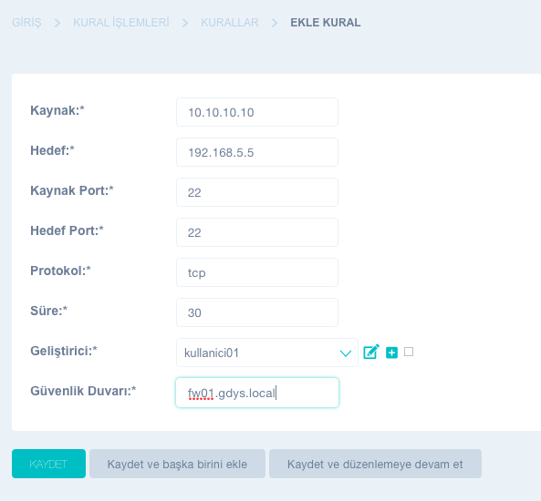

* Kural girişi sağlandıktan sonra kuralların bulunduğu ekrana açılmaktadır. Bu ekranda, üst bölümde bulunan filtreleme seçenekleri kullanılarak kurallar arasında istenilen filtreme işlemleri yapılabilmektedir.

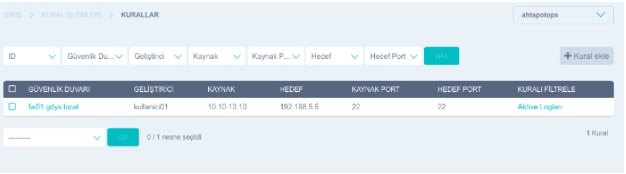

* Kurallar ekranında ilgili kural satırında bulunan “**Aktivite Logları**” seçilerek o kuralın kullanım geçmişi görüntülene bilmektedir.

###Kullanıcı Arayüz Kullanımı

* GKTS playbookunda belirlenen domain adresi internet tarayıcısında “**https://kullanici_url_adresi**” şeklinde yazılarak, kullanıcı arayüzüne erişilir. Açılan ekranda sağ üstte bulunan “**GİRİŞ**” butonuna basılır.

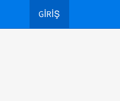

* Giriş ekranında kural aktif etmek isteyen kişinin kullanıcı adı “**Kullanıcı Adı**” satırına parolası ise “**Parola**” satırına girilerek “**GİRİŞ YAP**” butonuna basılır.

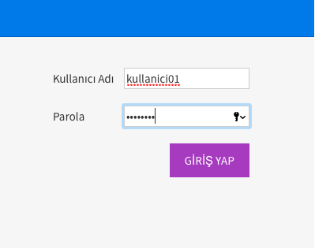

* Giriş yapıldıktan sonra üst kısımdaki menüden “**Kurallar**” seçeneği seçilir.

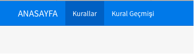

* Açılan kurallar ekranında, sadece ilgili kullanıcının aktif etme yetkisi olduğu kurallar görülmektedir. Kullanıcı aktif etmek istediği kuralın bulunduğu satırda, “**İşlemler**” sütununda bulunan “**AKTİF ET**” butonuna basarak kuralı belirlenen süre boyunca çalışır hale getirmiş olacaktır.

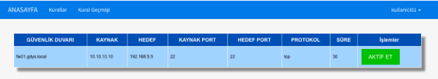

* “**AKTİF ET**” butonuna basıldıktan sonra, sayfa otomatik olarak “**Kural Geçmişi**” sayfasına yönlenecektir. Bu sayfada kullanıcıya ait aktif edilmiş kurallar geçmişi görüntülenmektedir.

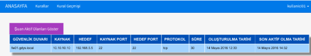

* “**Şuan Aktif Olanları Göster**” seçeneği seçildiğinde, kullanıcının aktif ettiği ve hala erişime açık olan kurallar listelenmektedir.

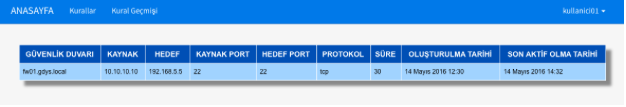

* Kullanıcı gerekli kuralı aktif ettikten sonra sistemden çıkış yapmak üzere sağ üst köşede bulunan kullanıcı adına tıklarak “**ÇIKIŞ**” butonuna basılır.

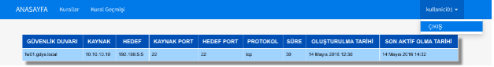


**Sayfanın PDF versiyonuna erişmek için [buraya](gdys-kullanim.pdf) tıklayınız.**
