# Güvenlik Duvarı Yönetim Sistemi Kullanımı
------

Bu dokümanda, Ahtapot Güvenlik Duvarı Yönetim Sisteminde güvenlik duvarı yönetimi anlatılıyor.

Gereken : GYDS Entegrasyonu yapılmış Ansible, Gitlab, GDYS2 sunucuları Pardus Temel ISO’ dan kurulumu tamamlanmış bir sunucu / sunucular

#### GDYS Web Yöneticisi üzerinden Güvenlik Duvarı Yönetim Sistemi kullanımı

- Konfigürasyonu yapılmış olan GDYS2 uygulamasında belirtilen host ve port bilgileri kullanılarak tarayıcı üzerinden GDYS2 Web Portalına erişim sağlanır.
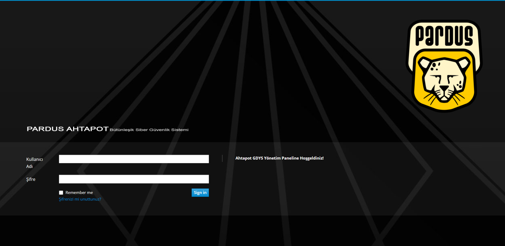

- Gelen ekranda konfigürasyon sırasında belirlenene kullanıcı adı şifre değerleri girilerek (Varsayılan: kullanıcı adı: admin, şifre: LA123) ana ekrana erişim sağlanır.
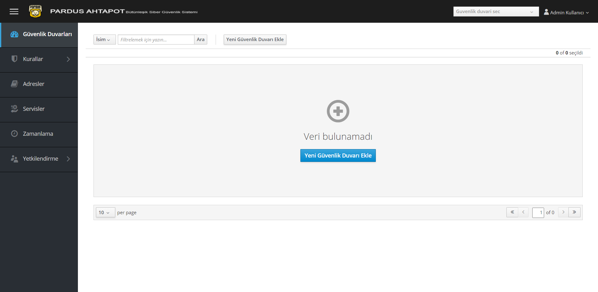

- Ardından ekranda bulunan **Yeni güvenlik duvarı ekle** butonuna basılarak yeni bir güvenlik duvarı eklenilir. Burada Sırasıyla gelen;
  - **Firewall Adı** kısmına firewall'a ait fqdn bilgisi (örn: fw1.ahtapot.org)
  - **Haberleşme arabirimi adı** firewall ile haberleşmede kullanılacak interface bilgisi (örn: eth0)
  - **Haberleşme arabirimi adresi** kısmına haberleşme interfaceine ait ip adresi subnet'i **/32** olacak şekilde yazılır. (örn: 192.168.1.1/32)
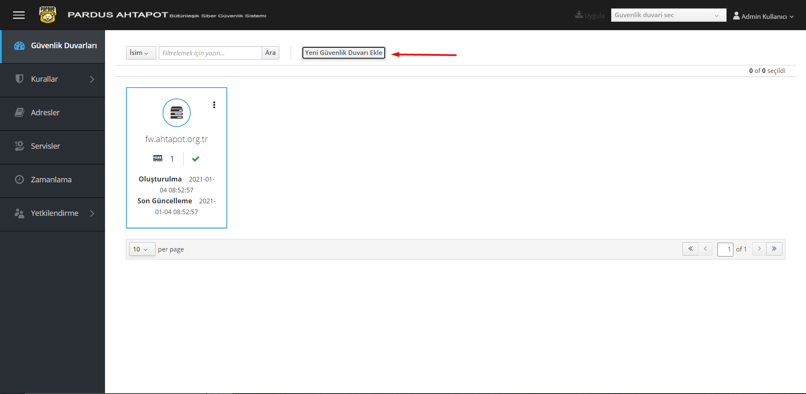

- Yeni güvenlik duvarı oluşturulduktan sonra eğer güvenlik duvarı üzerine farklı interface ve ip tanımlamaları yapılmak isteniyorsa, güvenlik duvarı kartının sol üst tarafında bulunan üç noktaya tıklanır ardından **Ayarlar** sekmesine gidilir.
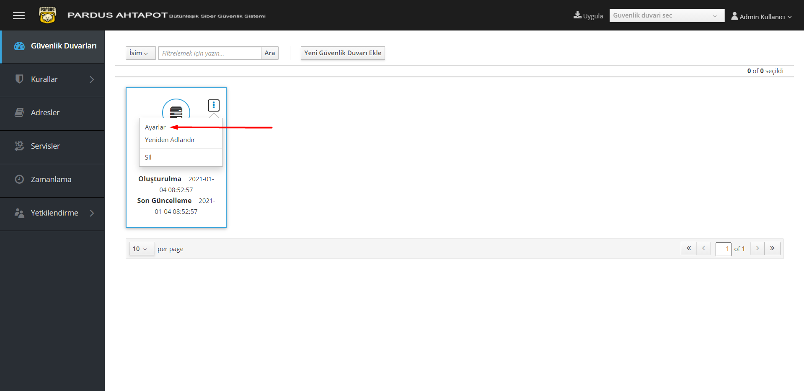

- Bu ekranda daha önce eklemiş olduğunuz arabirim bilgileri ve bu arabirimlere ait adres tanımlamaları yer almaktadır. Arabirim kartı üzerindeki **> (Adres Adeti) Adres** butonuna basılarak arabirim üzerinde bulunan adreslere ait bilgilere görüntülenebilir. Bu adresler dilenirse yanlarında bulunan "**Güncelle**" butonu ile güncellenebilir. Dilenirse yanında bulunan **Sil** butonu ile silinebilir.
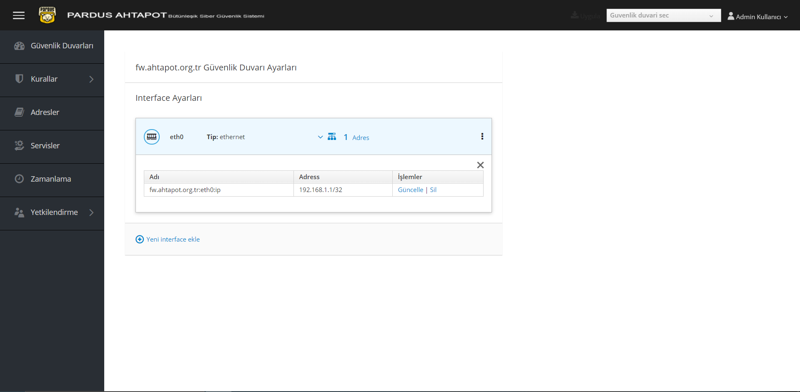

- Eğer Güvenlik Duvarı üzerine yeni arabirim eklenmek isteniyorsa en altta bulunan **Yeni interface ekle** butonuna basılır.
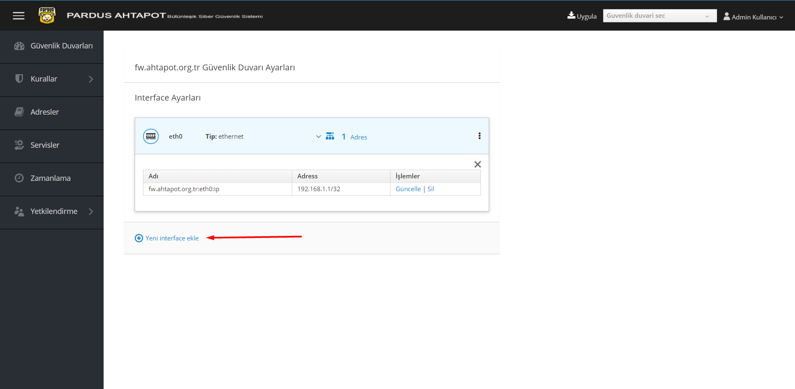

- Açılan pencerede arabirime ait bilgiler girilerek kaydet tuşuna basılır. Bu ekrandaki;
  - **Interface ismi** yerine arabirimi ait isim bilgisi girilir. (örn: enp0s1)
  - **Interface Tipi** kısmından eklenen interface'in tipi seçilir.
  - **Yapılandırma arayüzü** bu kısım eğer bu arabirim yapılandırma arabirimi olarak seçilmek isteniyorsa **evet** konumuna getirilmelidir. Bu durum da daha önce **Yapılandırma arayüzü** olarak seçilen arabirimden bu rol kaldırılarak yeni eklenen arabirim üzerine atanacaktır. Eğer yapılandırma arabirimi değiştirilmek istenmiyorsa burası **hayır** konumunda bırakılmalıdır.
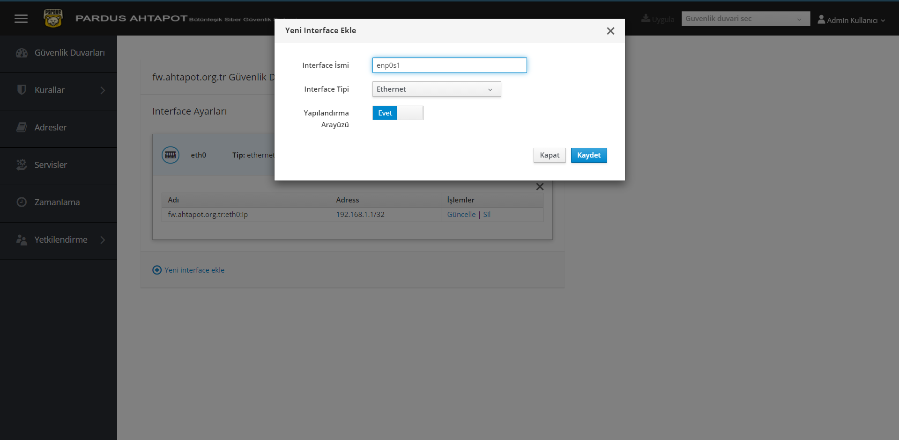  

- Yeni eklenen arabirim üzerine yeni bir adres eklenmek isteniyorsa; aşağıdaki adımlar takip edilerek **yeni adres ekle** butonuna tıklanır.
 

- Daha sonra açılan pencerede eklenecek olan adres için;
  - **Adres İsmi** girilir. (örn: WAN)
  - **Adres** değeri subnet'i **/32** olacak şekilde girilir. Ardından kaydet tuşuna basılır.
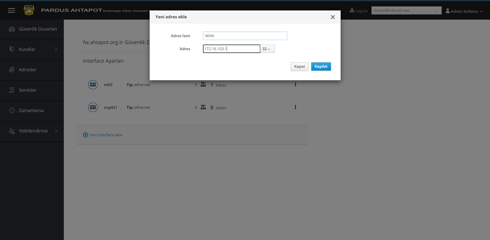 

- Bu işlemler ardından güvenlik duvarı GDYS sistemi üzerine eklenmiş olacaktır. Yapılan değişikliklerin güvenlik duvarı üzerine gönderilebilmesi için uygulanması gerekmektedir.

### Değişikliklerin Uygulanması
- Yapılan değişikliklerin uygulanabilmesi için yukarıda bulunan **Uygula** butonuna basılır.
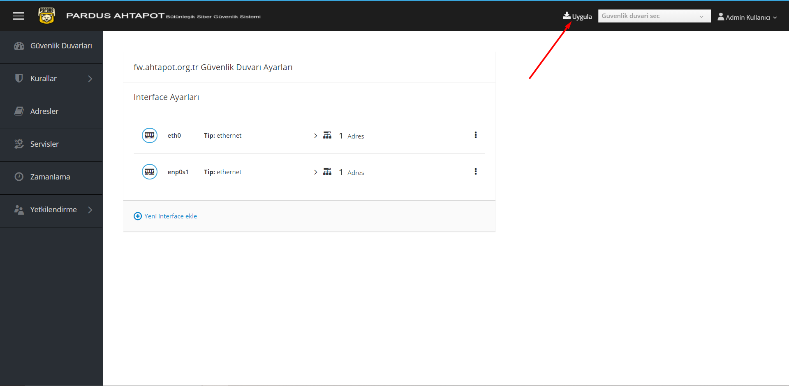 

- Açılan pencerede yapılan değişiklikler incelenir. Eğer değişiklikler uygulanmak isteniyorsa aşağıda bulunan **Uygula** eğer geri alınmak yani discard edilmek isteniyorsa **Eski haline çevir** butonuna basılır.
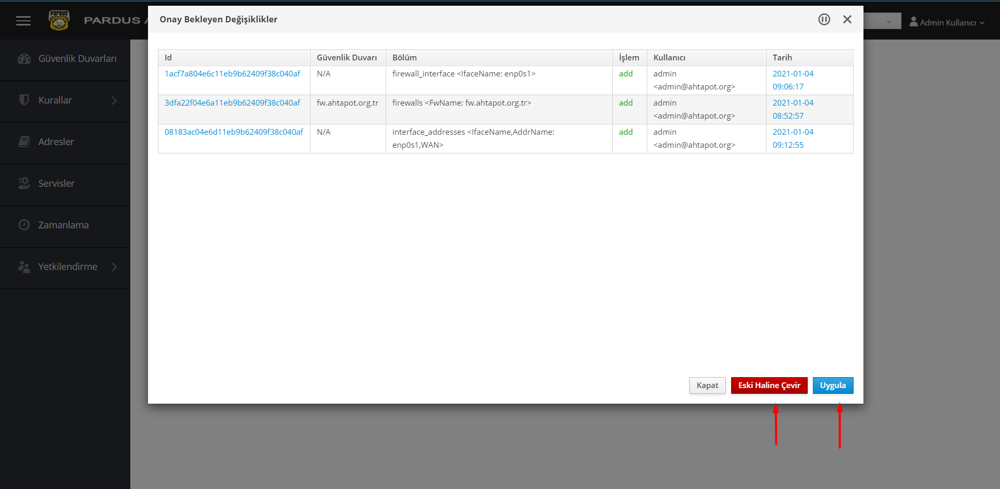

- Ardından değişiklikler bütün firewall scriptlerini yeniden oluşturacak şekilde onaylanmak isteniyorsa;
  - **Uygulanacak Firewallar** kısmı hepsi olarak seçilmelidir. Eğer belirli firewallar üzerinde uygulanmak isteniyorsa liste açılarak istenilen firewallar seçilmelidir.
  - **Onaylama Mesajı** kısmına ise yapılan değişikliklerin açıklaması özet haline yazılarak **Uygula** butonuna basılır.
  - Böylelikle yapılan değişiklikler seçili firewallar üzerinde uygulanır ve git sunucusuna kaydedilir.
  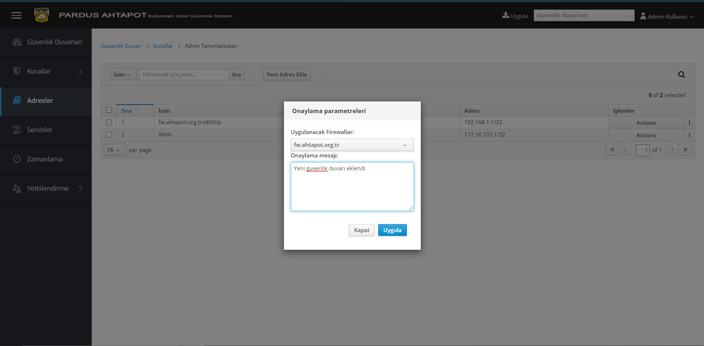
  
### Adres Tanımlamaları
 - Sol taraftaki menü üzerinden **Adresler** sekmesine tıklanır.
 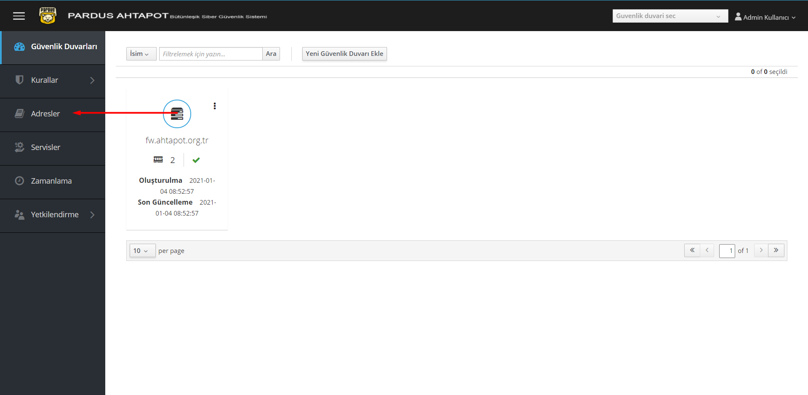
 
 - Açılan ekranda daha önce eklenmiş olan adresler listelenmektedir.
 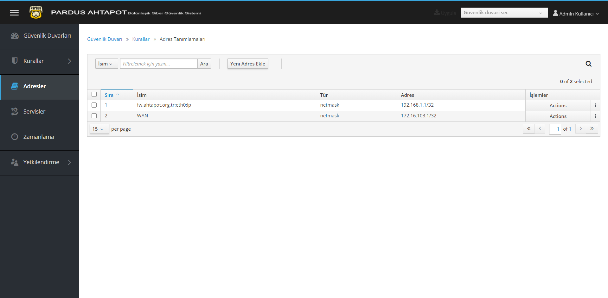
 
 - Yeni bir adres eklenmek isteniyorsa yukarıda bulunan **Yeni adres ekle** butonuna basılır.
 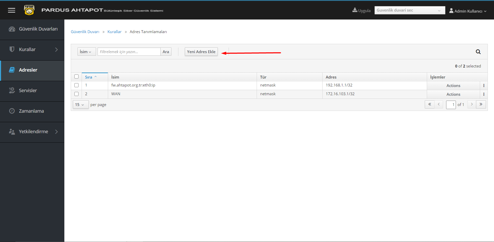
 
 - Ardından açılan ekranda;
   - Adres tanımlamasına ait isim girilir.
   - Eklenen adresin Tür'ü girilir. 
   - Ardından istenilen değerler doldurulur ve **Kaydet** butonuna tıklanır.
 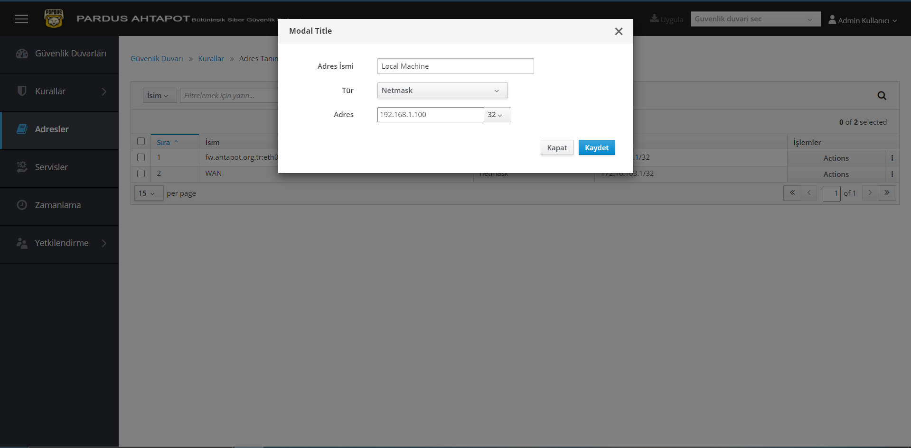
 
 - Eğer bir adres bilgisi güncellenmek veya silinmek istenirse adres kaydına ait satırın sonunda bulunan üç noktaya basılarak istenilen işlem gerçekleştirilir.
 * Not: Eğer Tekil bir makineye ait adres eklenmek isteniyorsa **Tür: Netmask** seçilerek **Subnet** değeri **32** olarak seçilir.
 
### Servis Tanımlamaları
 - Sol taraftaki menü üzerinden **Servisler** sekmesine tıklanır.
 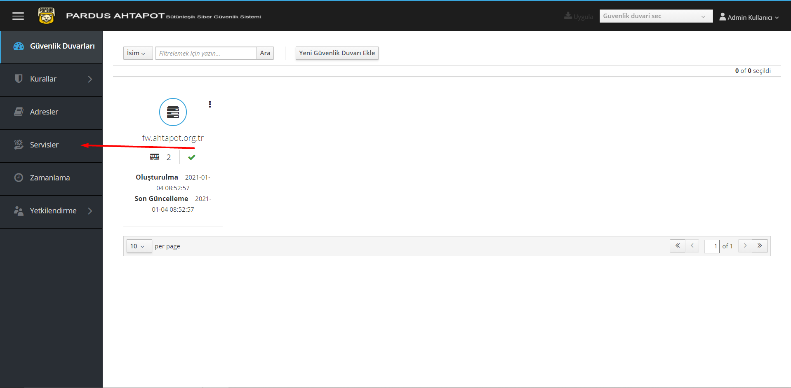
 
 - Açılan ekranda daha önce eklenmiş olan servisler listelenmektedir. Burada genel olarak kullanılan 100+ servis varsayılan olarak ekli gelmektedir.
 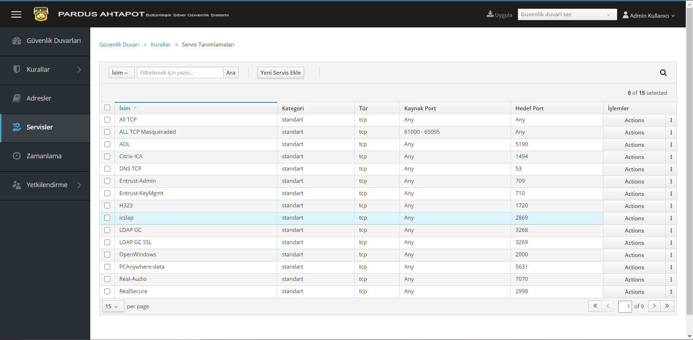
 
 - Yeni bir servis eklenmek isteniyorsa yukarıda bulunan **Yeni servis ekle** butonuna basılır.
 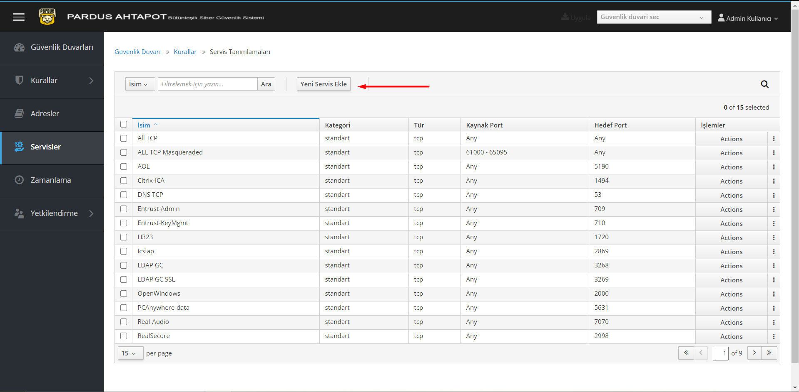
 
 - Ardından açılan ekranda;
   - Servis tanımlamasına ait isim girilir.
   - Yeni eklenen servise ait Kategori ve Protokol seçilir.
   - Eğer Protokol ICMP olarak seçilirse **port** bölümlerinin doldurulmasına gerek yoktur.
   - Eklenen TCP ve UDP servislerine ait port tanımlamaları girilir. Eğer Herhangi bir bölüm **Any** olarak bırakılmak istenirse orası boş bırakılarak **Kaydet** butonuna basılır.
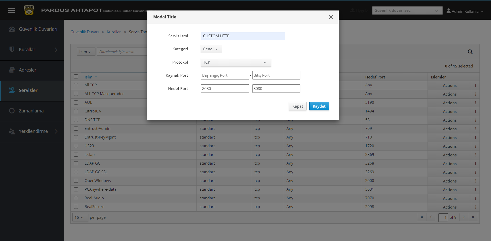

- Eğer bir servis bilgisi güncellenmek veya silinmek istenirse servis kaydına ait satırın sonunda bulunan üç noktaya basılarak istenilen işlem gerçekleştirilir.

### Zaman Profili Tanımlamaları
 - Sol taraftaki menü üzerinden **Zamanlama** sekmesine tıklanır.
 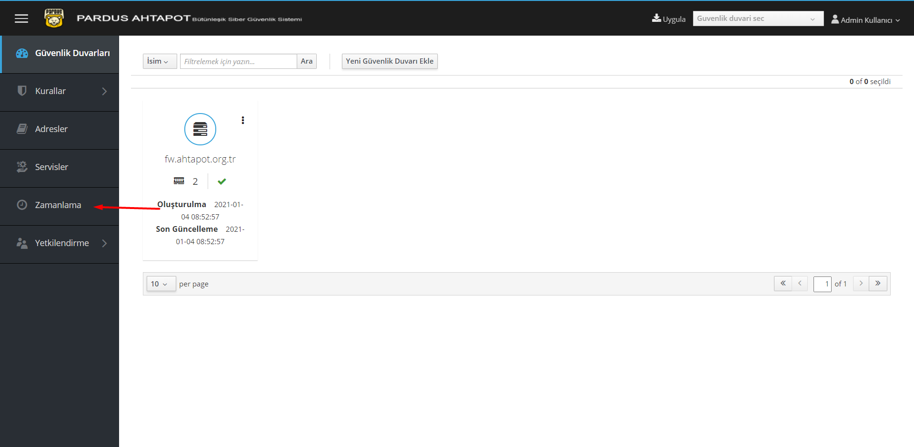
 
 - Açılan ekranda daha önce eklenmiş olan zaman profilleri listelenmektedir.
 
 
 - Yeni bir zamanlama profili eklenmek isteniyorsa yukarıda bulunan **Yeni Zaman Profili** butonuna basılır.
 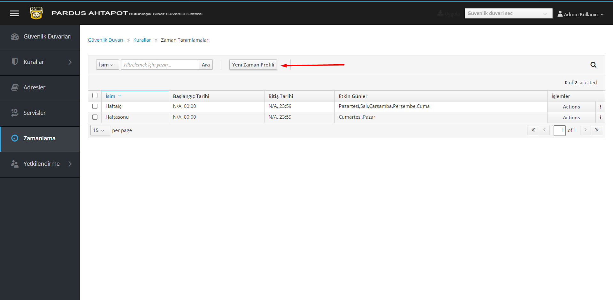
 
 - Ardından açılan ekranda;
   - Zaman profiline ait isim girilir.
   - Zaman profilinin uygulanacağı başlangıç ve bitiş tarih&saat bilgileri girilir. Eğer belirli bir tarih aralığı belirlenmek istenmiyorsa(kural devamlı olacaksa) tarih bölümleri boş bırakılır. Saat bölümlerinin girilmesi ise zorunludur.
   - Zaman profilinin uygulanacağı günler seçilir. Ardından kaydet butonuna basılır.
 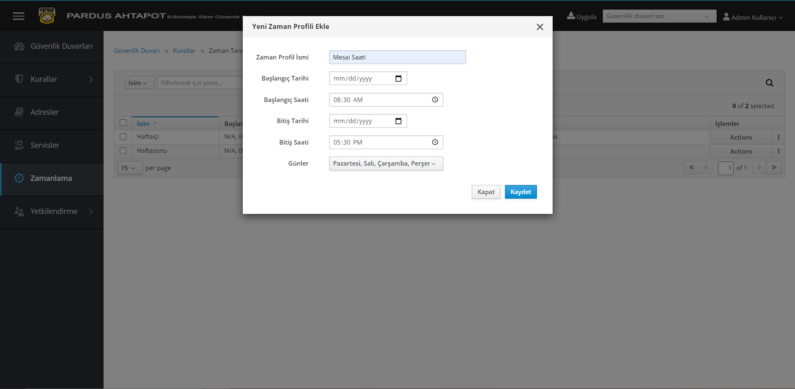
 
 - Eğer bir zaman profili bilgisi güncellenmek veya silinmek istenirse zaman profili kaydına ait satırın sonunda bulunan üç noktaya basılarak istenilen işlem gerçekleştirilir.
 
## Yetkilendirme işlemleri
 
 - Yetkilendirme işlemleri Rol ve Kullanıcı işlemleri olarak iki bölümden oluşmaktadır. Burada Rol işlemleri bir grup olarak tanımlanarak o role sahip olan kullanıcıların yapabileceği işlemleri belirler. Kullanıcılar ise sahip oldukları roller neticesinde sistem içerisine login olarak işlemler gerçekleştirebilirler.
 
### Rol Tanımlamaları
 - Sol taraftaki menü üzerinden **Yetkilendirme > Roller** bölümüne gidilir.
 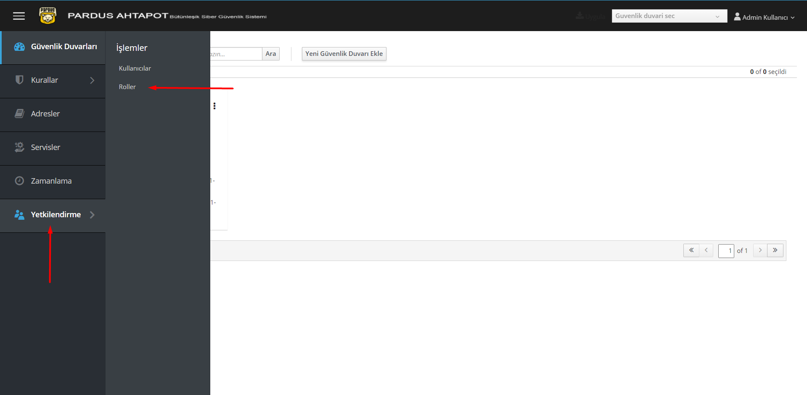
 
 - Açılan ekranda daha önce eklenmiş olan roller listelenmektedir. Admin rolü varsayılan olarak oluşturulmaktadır.
 
 
 - Yeni bir rol eklenmek isteniyorsa yukarıda bulunan **Yeni Grup Ekle** butonuna basılır.
 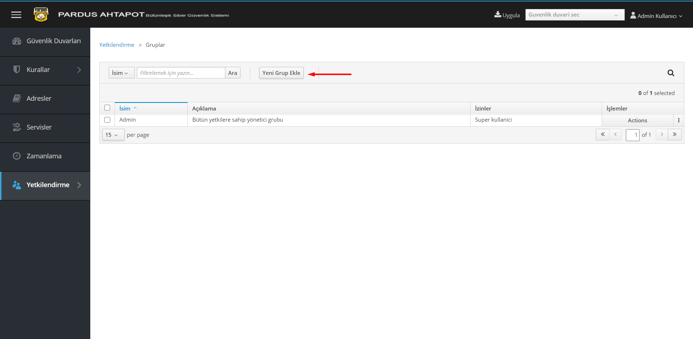
 
 - Ardından açılan pencerede;
   - Rol grubuna ait isim ve açıklama bilgileri girilir.
   - Ardından bu grubun sahip olacağı izinler tablo içerisinden fare ile seçilerek seçili izinlerin bulunduğu tabloya aktarılması sağlanır. Eğer bütün izinler seçilmek isteniyorsa tablo üzerinde bulunan **->->** butonuna basılır.
   - Rolün atandığı kullanıcıların bu izinlerinin hangi güvenlik duvarları üzerinde geçerli olacağı son tablodan seçilerek ayarlanır. Eğer bütün güvenlil duvarları seçilmek isteniyorsa tablo üzerinde bulunan **->->** butonuna basılır.
   - Eğer bu grubun bütün izinleri içeren bir grup olması isteniyorsa kısaca yukarıdaki **Süper Kullanıcı Grubu** seçeneği **Evet** olarak işaretlenir.
   - Ardından sayfa aşağı kaydırılarak **Kaydet** butonuna basılır.
 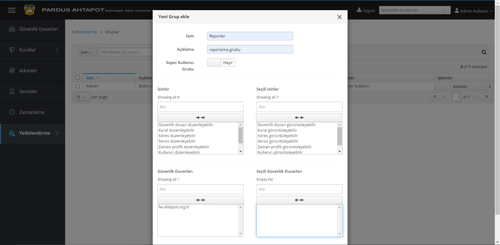
 - Eğer bir rol grubu bilgisi güncellenmek veya silinmek istenirse rol grubu kaydına ait satırın sonunda bulunan üç noktaya basılarak istenilen işlem gerçekleştirilir.
 
### Kullanıcı Tanımlamaları
 - Sol taraftaki menü üzerinden **Yetkilendirme > Kullanıcılar** bölümüne gidilir.
 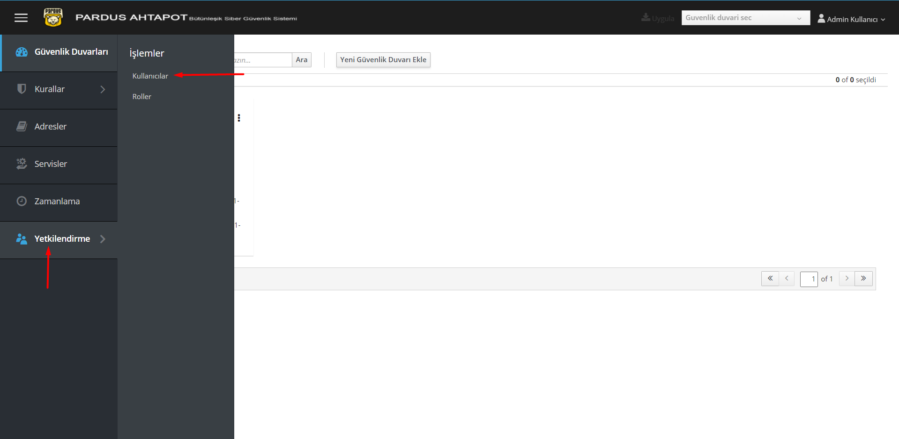
 
 - Açılan ekranda daha önce eklenmiş olan kullanıcılar listelenmektedir. Admin kullanıcıs varsayılan olarak oluşturulmaktadır.
 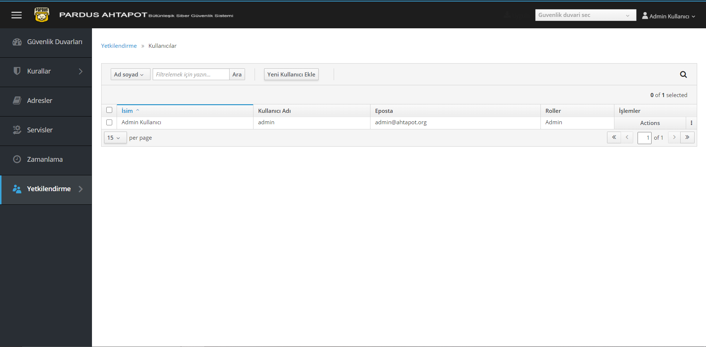
 
 - Yeni bir kullanıcı eklenmek isteniyorsa yukarıda bulunan **Yeni Kullanıcı Ekle** butonuna basılır.
 
 
 - Ardından açılan pencerede;
   - Kullanıcıya ait **Ad Soyad, Kullanıcı Adı, E-Posta ve Parola** bilgileri girilir.
   - Eğer ilk giriş yaptığında kullanıcının parolasını değiştirmesi isteniyorsa **Parola Değiştirilmeli** seçeneği **Evet** olarak ayarlanmalıdır.
   - Ardından kullanıcının dahil olunması istenilen **Rol Grubu** seçilir.
   - Kullanıcı, **Durum** seçeneği **Aktif** konuma alınırsa giriş yapabilir. Eğer **Pasif** durumunda bırakılırsa kullanıcı eklenir fakat giriş yapamaz. Bu seçenek daha sonra kullanıcı düzenlenerek tekrar **Aktif** ya da **Pasif** durumuna getirilebilir.
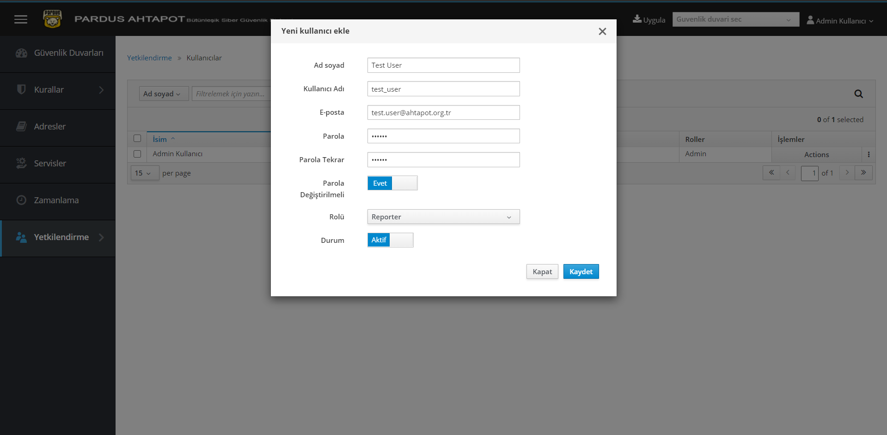
   
 - Eğer bir kullanıcı bilgisi güncellenmek veya silinmek istenirse kullanıcı kaydına ait satırın sonunda bulunan üç noktaya basılarak istenilen işlem gerçekleştirilir.
 
 
 ## Kural Tanımlamaları
 
 - Bir güvenlik duvarı için kural tanımlaması yapabilmek için öncelikle sol üst tarafta bulunan **Güvenlik duvarı Seç** butonuna tıklanarak işlem yapılmak istenilen güvenlik duvarı seçilmelidir.
 
 
 - Seçim işlemi yapıldıktan sonra kural tanımlama işlemlerine devam edilebilir.
 
 ### IPv4 Kurallarının Tanımlanması
 
 - Sol taraftaki menüden **Kurallar > Ipv4 Kuralları** bölümüne gidilir.
 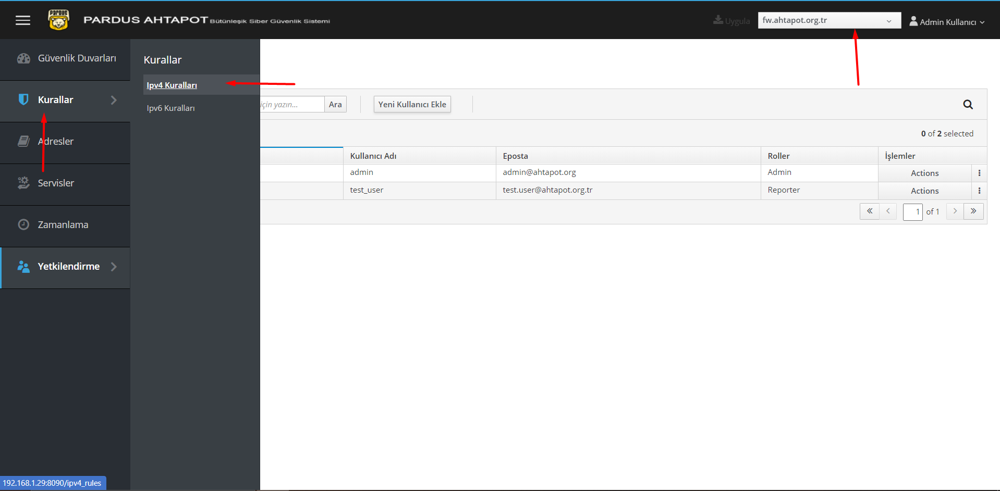
 
 - Açılan pencerede 3 adet sekme bulunmaktadır. Bunlar sırasıyla **Policy Kuralları, Nat Kuralları, Routing Kuralları**dır. Varsayılan olarak **Policy Kuralları** sekmesi aktif olarak gelmektedir.
 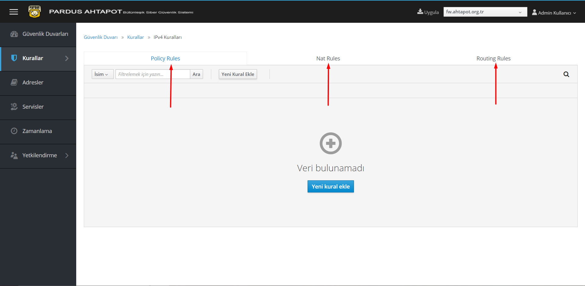
 
 - Girilmek istenilen kural türüne ait sekmeye tıklanır.
 
 - Her sekme altında o kural türüne ait daha önceden girilmiş kurallar bulunmaktadır. Kurallara ait bilgiler tabloda yer almaktadır. Sonda bulunan **Aktif/Pasif** ifadesi kuralın şuanki durumunu belirtmektedir. Örn:
 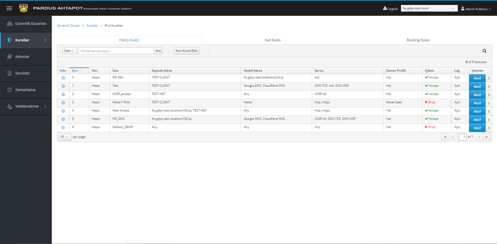
 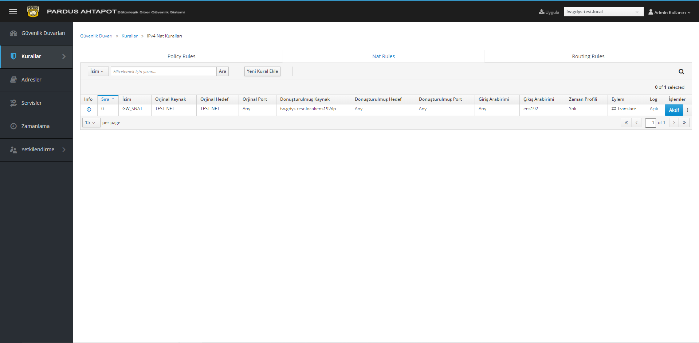
 
 - Yeni bir kural eklenmek isterse ilgili sekmede sol üstte bulunan **Yeni Kural Ekle** butonuna basılarak daha önceden eklenmiş **adres, servis, zaman profili** kayıtları kullanılarak istenilen kural eklenebilir.
 
 - Eklenilen kuralları ait açıklamalar tablo üzerinde görüntülenmek istenirse kural kaydına ait satırın başında bulunan **Info** kolonundaki butona basılarak kural açıklaması görüntülenir.
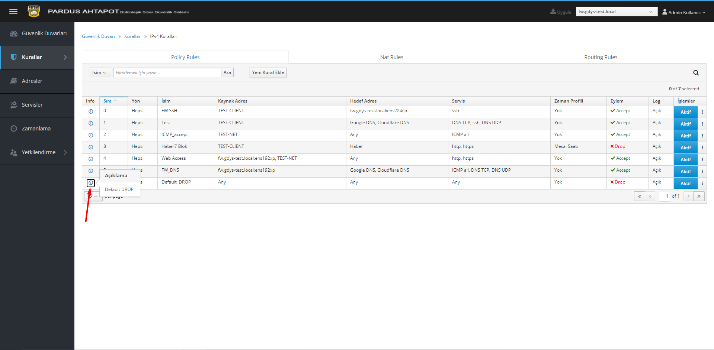

* **NOT:** Bütün ekleme,güncelleme ve silme işlemlerinden sonra yapılanların güvenlik duvarı üzerinde etkin olabilmesi için ayarların onaylanması gerekmektedir!
 
