#Geçici Kural Tanımlama Sistemi Kullanımı
------

[TOC]

####Yönetici Arayüz Kullanımı

* GKTS playbookunda belirlenen domain adresi internet tarayıcısında “**https://admin_url_adresi**” şeklinde yazılarak, yönetici arayüzüne erişilir.

* Açılan ekranda, “**Yönetici Paneli**” butonuna basılarak giriş ekranına ulaşılır.

* Giriş ekranında, kurulum sırasında ön tanımlı olarak gelen “**Kullanıcı adı**” bölümüne “**ahtapotops**”, “**Parola**” bölümüne ise “**gkts2016**” bilgileri girildikten sonra “**OTURUM AÇ**” butonuna basılır.

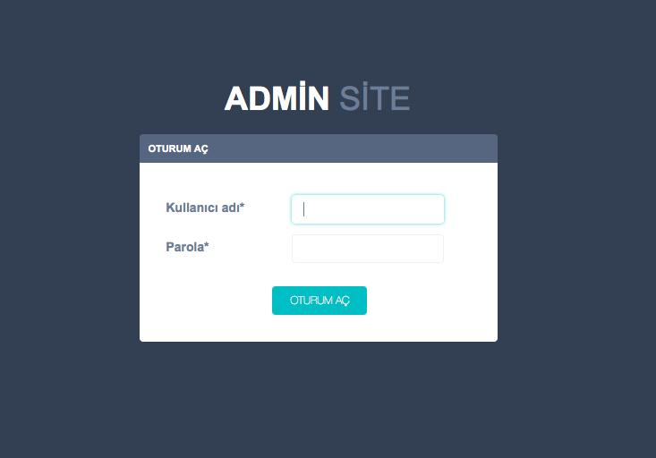

* Öntanımlı olarak gelen parolayı değiştirmek için, ekranda sağ üst köşede bulunan kullanıcı adı bilgisine tıklanarak açılan menüden “**Parola değiştir**” seçeneği seçilir.

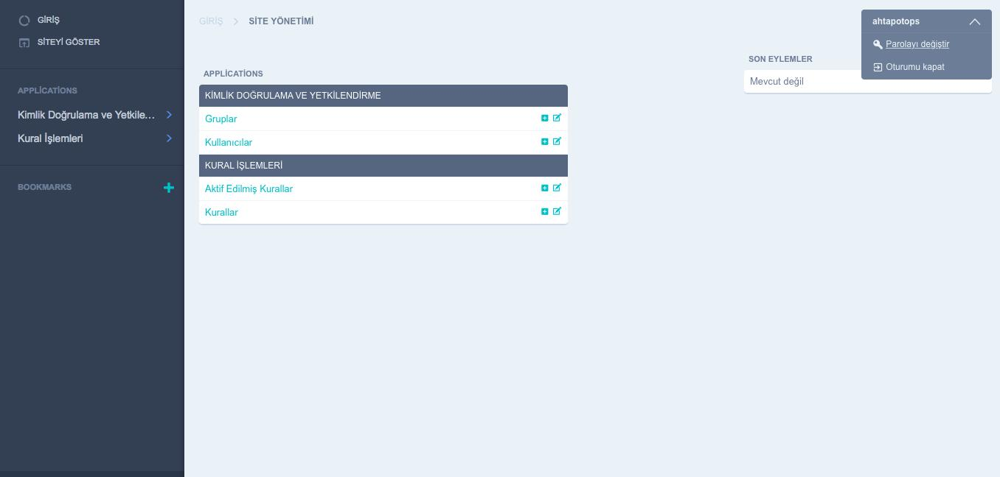

* Açılan parola değiştirme ekranında, “**Eski parola**” satırına öntanımlı gelen parola, “**Yeni parola**” satırına belirlenmem istenen yeni parola, “**Yeni parola onayı**” satırına ise yeni parola tekrar yazılarak “**PAROLAMI DEĞİŞTİR**” butonuna basılır.

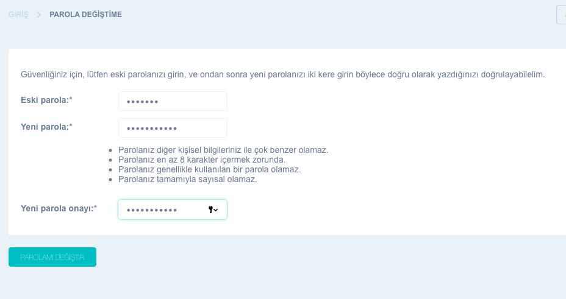

* Sisteme kullanıcı eklemek için anasayfada bulunan “**KİMLİK DOĞRULAMA VE YETKİLENDİRME**” bölümünde bulunan “**Kullanıcılar**” satırında bulunan “**+**” butonuna basılır.

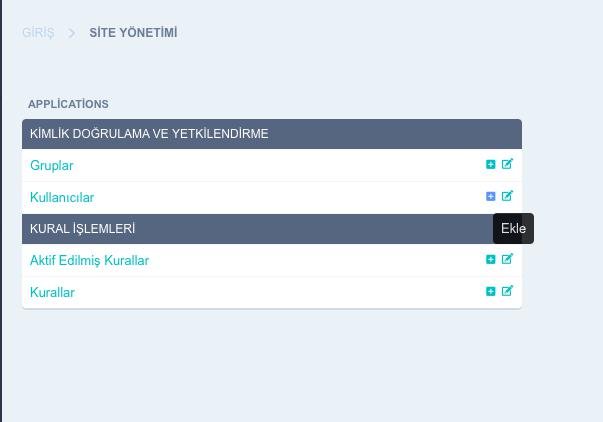

* Açılan sayfada, “**Kullanıcı adı**” bölümüne oluşturulacak kullanıcının adı, “**Parola**” bölümüne o kullanıcı için oluşturulacak parola, “**Parola onayı**” bölümüne ise oluşturulan parola yazılarak “**KAYDET**” butonuna basılır. Başka bir kullanıcı daha ekleme işlemi yapılacak ise “**KAYDET**” butonu yerine “**Kaydet ve başka birini ekle**” butonuna basılır. Eklenecek kullanıcının “**Yönetici**” haklarına sahip olması isteniyor ise, “**Kaydet ve düzenlemeye devam et**” butonuna basılır.

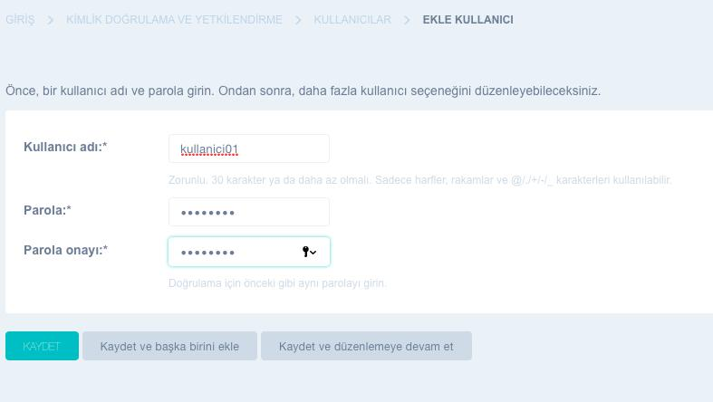

* “**Yönetici**” rolü verilecek kullanıcı oluşturulurken “**Kaydet ve düzenlemeye devam et**” butonuna basıldığında gelen ayar ekranında yetki vermek için “**İZİNLER**” tabına basılır.

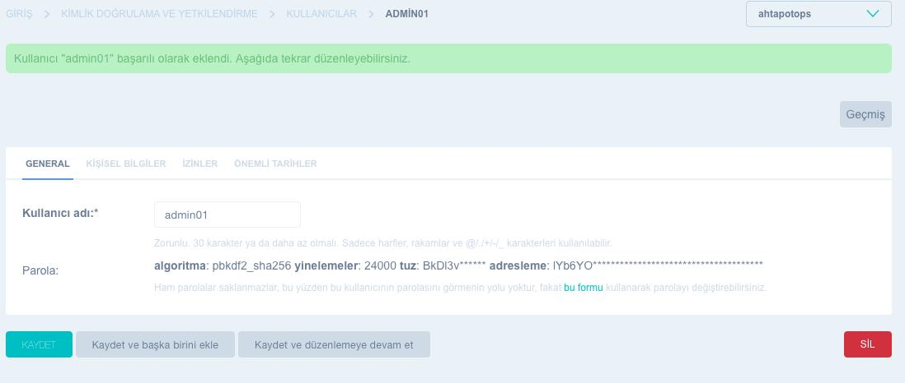

* Açılan “**İZİNLER**” ekranında “**Süper kullanıcı durumu**” seçeneği seçilerek “**KAYDET**” butonuna basılır.

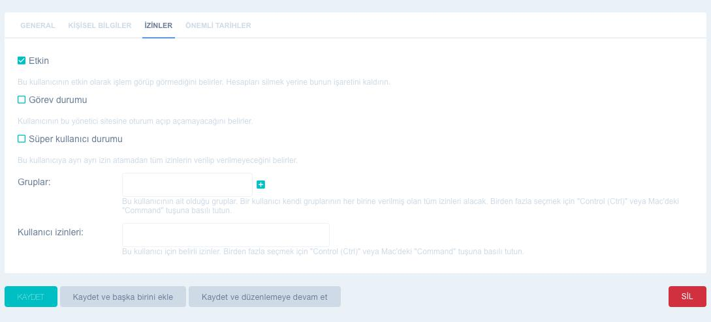

* Sol tarafta bulunan menüden “**Kimlik Doğrulama ve Yetkilendirme**” seçeneğinin üzerine gelerek “**Kullancılar**” seçilerek, kullanıcı arayüzü açılır.

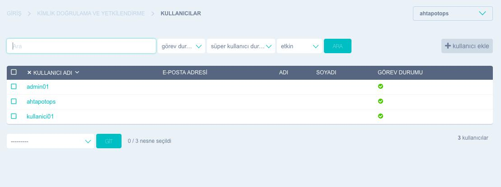

* Oluşturulan her kullanıcı aksi belirtilmedikce pasif halde bulunmaktadır. Kullanıcıya giriş ve işlem izni vermek için ilgili kullanıcının adına tıklanarak açılan ekranda “**İZİNLER**” tabına gidilere “**Görev durumu**” seçeneği seçilerek “**KAYDET**” butonuna basılır.

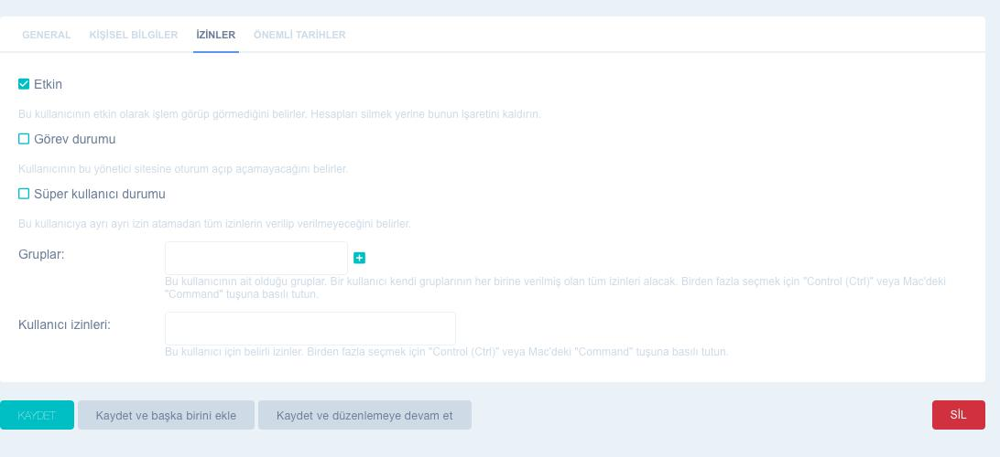

* Yönetici tarafından sisteme kural tanımlamak için sol tarafta bulunan menüden “**Kural İşlemleri**” seçeneğine tıklanarak açılan yeni menüden “**Kurallar**” seçeneği seçilir.

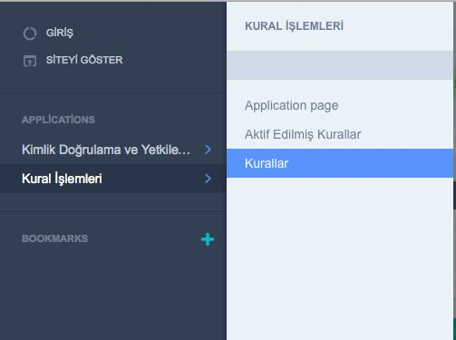

* Açılan ekranda sağ tarafta bulunan “**+ Kural Ekle**” butonuna basılır.

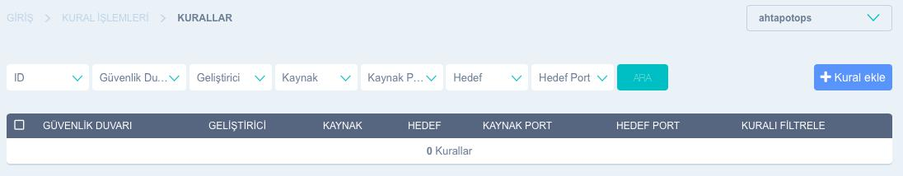

* Yeni kural ekleme sayfasında “**Kaynak**” bölümüne bağlantının başlatılacağı kaynak adresi, “**Hedef**” bölümüne bağlantı sağlanacak hedef adresi, “**Kaynak Port**” bölümüne bağlantının başlatılacağı kaynak port bilgisi, “**Hedef Port**” bölümüne bağlantının başlatılacağı hedef port bilgisi, “**Protokol**” bölümüne belirlenen protokol, “**Süre**” bölümüne “**dakika**” türünden kuralın aktif kalma süresi, “**Geliştirici**” bölümüne ilgili kuralı aktif etmeye hakkı olacak kullanıcı bilgisi ve “**Güvenlik Duvarı**” bölümüne kuralın oynatılacağı güvenlik duvarının FQDN bilgisi girilerek “**KAYDET**” butonuna basılır.

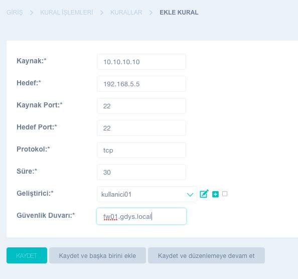

* Kural girişi sağlandıktan sonra kuralların bulunduğu ekrana açılmaktadır. Bu ekranda, üst bölümde bulunan filtreleme seçenekleri kullanılarak kurallar arasında istenilen filtreme işlemleri yapılabilmektedir.

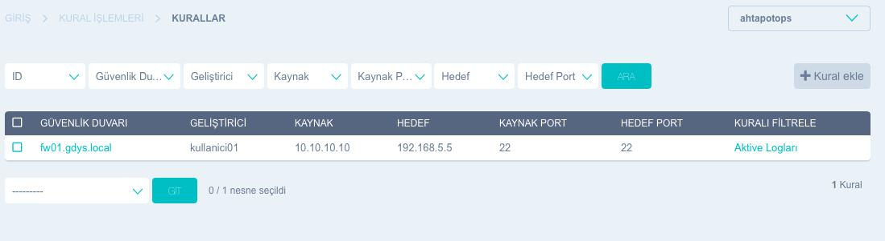

* Kurallar ekranında ilgili kural satırında bulunan “**Aktivite Logları**” seçilerek o kuralın kullanım geçmişi görüntülene bilmektedir.

####Kullanıcı Arayüz Kullanımı

* GKTS playbookunda belirlenen domain adresi internet tarayıcısında “**https://kullanici_url_adresi**” şeklinde yazılarak, yönetici arayüzüne erişilir. Açılan ekranda sağ üstte bulunan “**GİRİŞ**” butonuna basılır.

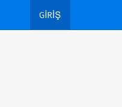

* Giriş ekranında kural aktif etmek isteyen kişinin kullanıcı adı “**Kullanıcı Adı**” satırına parolası ise “**Parola**” satırına girilerek “**GİRİŞ YAP**” butonuna basılır.

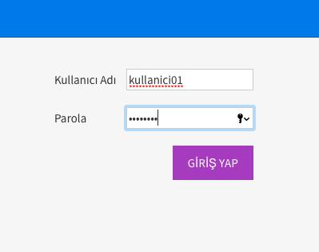

* Giriş yapıldıktan sonra üst kısımdaki menüden “**Kurallar**” seçeneği seçilir.

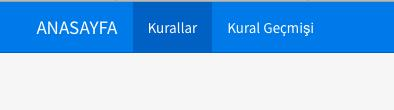

* Açılan kurallar ekranında, sadece ilgili kullanıcının aktif etme yetkisi olduğu kurallar görülmektedir. Kullanıcı aktif etmek istediği kuralın bulunduğu satırda, “**İşlemler**” sütununda bulunan “**AKTİF ET**” butonuna basarak kuralı belirlenen süre boyunca çalışır hale getirmiş olacaktır.

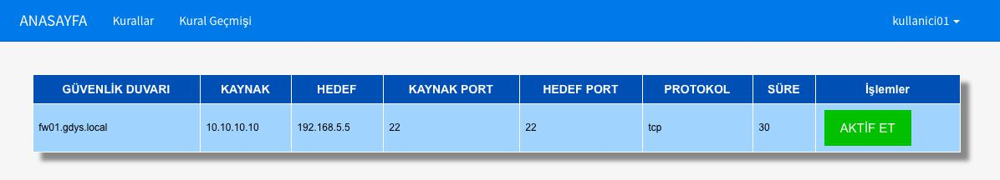

* “**AKTİF ET**” butonuna basıldıktan sonra, sayfa otomatik olarak “**Kural Geçmişi**” sayfasına yönlenecektir. Bu sayfada kullanıcıya ait aktif edilmiş kurallar geçmişi görüntülenmektedir.

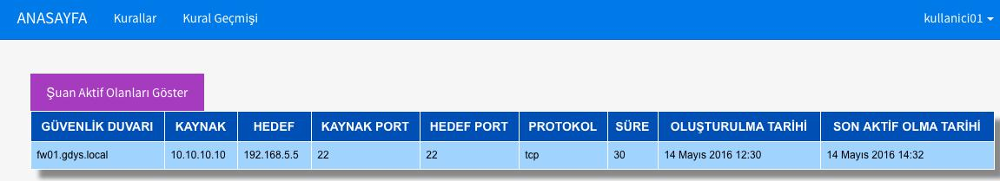

* “**Şuan Aktif Olanları Göster**” seçeneği seçildiğinde, kullanıcının aktif ettiği ve hala erişime açık olan kurallar listelenmektedir.

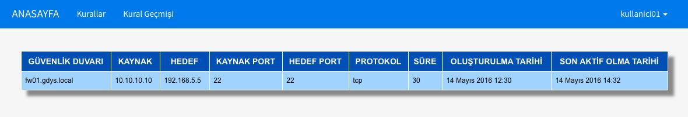

* Kullanıcı gerekli kuralı aktif ettikten sonra sistemden çıkış yapmak üzere sağ üst köşede bulunan kullanıcı adına tıklarak “**ÇIKIŞ**” butonuna basılır.

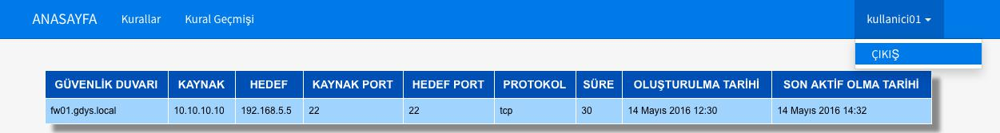

**Sayfanın PDF versiyonuna erişmek için [buraya](gkts-kullanim.pdf) tıklayınız.**
