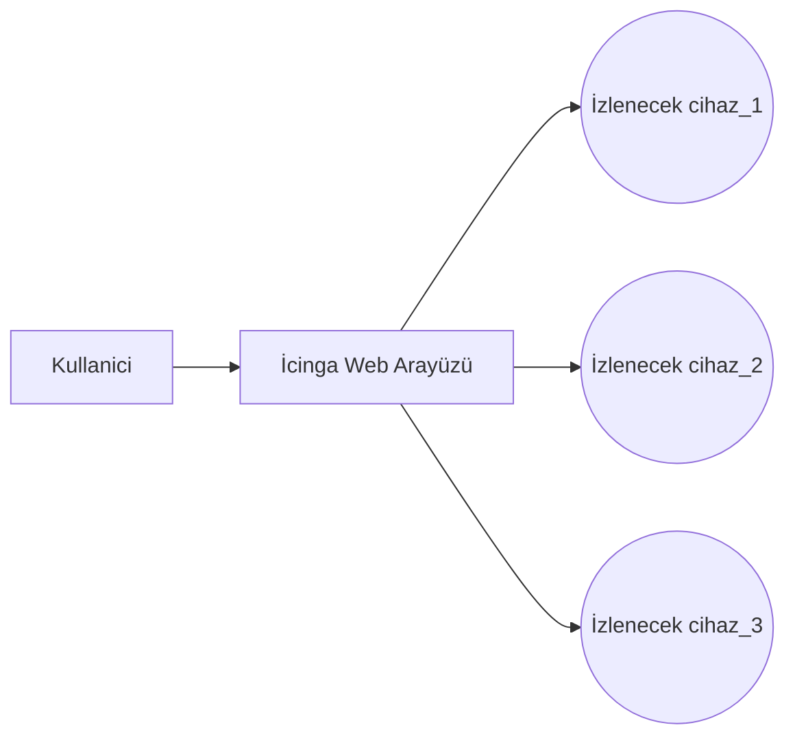

# İcinga Kullanım

Bu dokümanda, AHTAPOT projesi kapsamında, İcinga olarak bilinen sistem izleme uygulamasının kullanımı anlatılacaktır.

Tarayıcı ile https://IP/icinga2-classicui/ sitesine gidildiğinde login bilgileri için gerekli alan açılır. Alana ilgili bilgiler girildikten sonra resimdekine benzer bir ekran açılır.

Bu sayfada bazı menüler sistemin izlenmesi için önemli bilgiler içerir.
- **Network Health** --> Ekranında sağ üst köşesinde bulunmaktadır. Burada **Host Health** ve **Service Health** adında 2 alan bulunmaktadır. **Host Health** sistemde ki tanımlı cihazların ulaşılabilirlik durumu hakkında bilgi verir. Ulaşılamaz cihaz sayısı arttıkça, bar küçülmeye başlar ve barın rengi kırmızıya dönmeye başlar. **Service Health** sistemde ki tanımlı cihazların servisleri ile ilgili bilgi verir. Sorunlu servis sayısı arttıkça, bar küçülmeye başlar ve barın rengi kırmızıya dönmeye başlar.
- **Hosts** --> Ekranın üst tarafında bulunur. Cihazların ulaşılabilirlik durumu hakkında bilgi verir. 
- **Services** --> Hosts menüsünün altında bulunur. Servislerin durumu hakkında bilgi verir.
- **Service Checks** --> Servisleri kontrol eden yazılımın kontrol arayüzüdür. Disable yapılarak kontrol durdurulabilir.
- **Host Checks** --> Cihazları kontrol eden yazılımın kontrol arayüzüdür. Disable yapılarak kontrol durdurulabilir.
- **Monitoring Features** --> Flap detection, notifications, event handlers gibi servislerin kontrol arayüzüdür. Disable yapılarak durdurulabilir.

Ekranın sol tarafında bulunan menüde ayrıntılı olarak cihazlar hakkında bilgi elde edilebilir.

- **Host Detail** --> Bu menüye girildiğinde sisteme kayıtlı cihazların genel görünümü görülür. 
- **Service Detail** --> Bu menüye girildiğinde sisteme kayıtlı cihazların servislerinin genel görünümü görülür. Resimdekine benzer bir ekran gelmektedir.

- **Hostgroup Overview** --> Hostlar için gruplandırma yapıldı ise bu sayfada görülmektedir. Her bir host bir grup altında gösterilmektedir. Linux-Windows gibi ayrımlar buradan takip edilebilir.
- **Hostgroup Summary** -->  Bu sayfada sadece gruplar gözükmektedir. Grupların durumların ile alakalı genel bir bilgi verilir. Resimdekine benzer bir ekran gelmektedir.

- **Servicegroup overview** --> Servisler için gruplandırma yapıldı ise bu sayfada görülmektedir. Her bir servis grubu altında, o servislerin çalıştığı hostlar bir arada gösterilmektedir. 
- **Servicegroup summary** --> Bu sayfada sadece gruplar gözükmektedir. Grupların durumların ile alakalı genel bir bilgi verilir. 
