# MHN
Ahtapot projesi kapsamında MHn işlevinin kurulumunu ve yönetimini sağlayan playbook’dur. “**/etc/ansible/playbooks/**” dizini altında bulunan “**mhn.yml**” dosyasına bakıldığında, “**hosts**” satırında Ansible’a ait “**/etc/ansible/**” altında bulunan “**hosts**” dosyasında “**[mhn]**” satırı altına yazılmış tüm sunucularda bu playbookun oynatılacağı belirtilir. “**sudo**” satırı ile çalışacak komutların sudo yetkisi ile çalışması belirlenir. “**vars_files**” satırı mhn playbookunun değişken dosyalarını belirtmektedir. “**roles**” satırı altında bulunan satırlarda ise bu playbook çalıştığında “**base**” ve “**mhn**”rollerinin çalışacağı belirtilmektedir.


```
- hosts: mhn
  sudo: yes
  vars_files:
  - /etc/ansible/roles/base/vars/group.yml
  - /etc/ansible/roles/base/vars/user.yml
  - /etc/ansible/roles/base/vars/repo.yml
  - /etc/ansible/roles/base/vars/rsyslog.yml
  - /etc/ansible/roles/base/vars/ntp.yml
  - /etc/ansible/roles/base/vars/package.yml
  - /etc/ansible/roles/base/vars/kernelmodules_remove.yml
  - /etc/ansible/roles/base/vars/kernelmodules_blacklist.yml
  - /etc/ansible/roles/base/vars/host.yml
  - /etc/ansible/roles/base/vars/audit.yml
  - /etc/ansible/roles/base/vars/sudo.yml
  - /etc/ansible/roles/base/vars/ssh.yml
  - /etc/ansible/roles/base/vars/grub.yml
  - /etc/ansible/roles/base/vars/logger.yml
  - /etc/ansible/roles/base/vars/logrotate.yml
  - /etc/ansible/roles/base/vars/directory.yml
  - /etc/ansible/roles/base/vars/profile.yml
  - /etc/ansible/roles/base/vars/fusioninventory.yml
  - /etc/ansible/roles/mhn/vars/main.yml

  roles:
    - role: base
    - role: mhn
```

#### MHN Rolü Değişkenleri
Bu roldeki değişkenler “**/etc/ansible/roles/mhn/vars/**” dizini altında bulunan yml dosyalarında belirtilmiştir. yml dosyalarının içerikleri ve değişken bilgileri aşağıdaki gibidir;


-   “**main.yml**” dosyasında bulunan değişkenlerin görevi şu şekildedir. "**mhn_email**" değişkeni, mhn arayüzüne giriş için kullanılacak e-posta adresidir. Aynı zamanda mhn tarafından yollanan e-postalar bu adrese gönderilmektedir. "**mhn_password**" değişkeni, mhn arayüzüne giriş için gerekli şifrenin belirlendiği değişkendir. "**mhn_base_url**" değişkeni, mhn arayüzünün hizmet vereceği adresin belirtildiği değişkendir. "**mhn_honeymap_url**" değişkeni mhn haritasının hizmet vereceği adresin belirtildiği değişkendir. "**mhn_mail_server**" değişkeni, mhn tarafından yollanacak e-postalar için kullanılacak posta sunucusunun adresinin belirtildiği değişkendir.  "**mhn_mail_port**" değişkeni, mhn tarafından yollanacak e-postalar için kullanılacak posta sunucusunun port bilgisinin belirtildiği değişkendir. "**mhn_mail_user**" değişkeni, mhn tarafından bağlanılan e-posta sunucusunda doğrulama yapılacak kullanıcı adının belirtildiği değişkendir. "**mhn_mail_pass**"  değişkeni, mhn tarafından bağlanılan e-posta sunucusunda doğrulama yapılacak kullanıcı adının şifresinin belirtildiği değişkendir. "**mhn_mail_sender**" değişkeni, mhn tarafından yollanacak e-postalar için gönderici e-posta adresinin belirtildiği değişkendir."**mhn_log_file_path**" değişkeni, mhn tarafından oluşturulan kayıtların hangi dosyaya kayıt edileceğinin belirtildiği değişkendir. 

```
---
mhn_email: mhn@ahtapot.org
mhn_password: ahtapot
mhn_base_url: http://169.254.1.9
mhn_honeymap_url: http://169.254.1.9:3000
mhn_mail_server: localhost
mhn_mail_port: 25
mhn_mail_user: user1@ahtapot.org
mhn_mail_pass: labris
mhn_mail_sender:  noreply@ahtapot.org
mhn_log_file_path: /var/log/mhn/mhn.log
```

İlgili değişkenler ayarlandıktan sonra aşağıdaki komut ile mhn sunucusu kurulur.

```
ansible-playbook /etc/ansible/playbooks/mhn.yml
```

**Siber saldırı erken uyarı sistemi:** Honeypot(balküpü) veya diğer adı ile tuzak sistemler kurularak saldırganın tuzak sistemlerdeki hareketleri izlenir. Analiz sonucunda gerçek sistemlerde önlemlerin alınması sağlanır.


**Modern Honey Network(MHN):** Tuzak sistemlerden gelen verilerin izlenebildiği web tabanlı arayüz uygulamasıdır. Tuzak sistemler **hpfeeds** protokolünü kulanarak olay kayıtlarını MHN sunucusuna gönderir. Hpfeeds ön tanımlı 10000 portunu kullanır. Aşağıdaki resimden MHN’nin tasarım ve çalışma yapısı incelenebilir.
  

**Modern Honey Network Tasarımı**

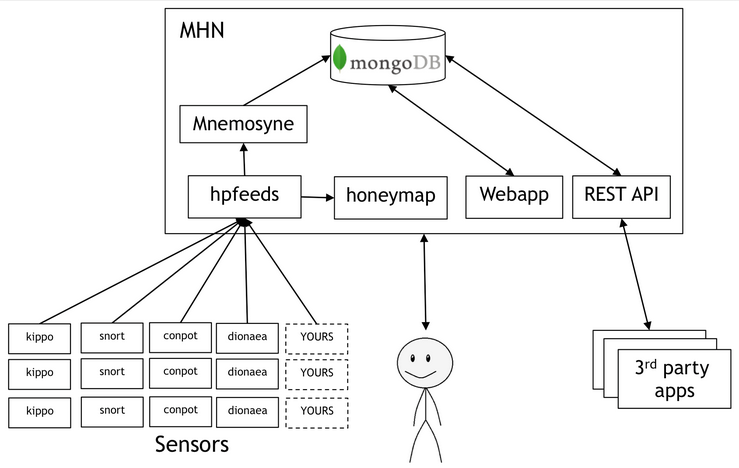

Desteklenen tuzak sistemi uygulamaları:

**- dionaea:** http/s, memcache, mssql, mysql vb.  protokoller için tuzak sistem

**- p0f:** Pasif Parmak izi(işletim sistemi/uygulama) tanımlayıcı

**- glastopf:** Web uygulama tuzak sistem

**- shockpot:** Shellsock Zaafiyeti Tuzak Sistem

**- conpot:** Endüstriyel Cihazlar(SCADA) Tuzak sistem

**- wordpot:** Wordpress Tuzak Sistem

**- suricata:** Saldırı Tespit Tuzak Sistem

**- amun:** Zaafiyet içeren tuzak sistem

**- elastichoney:** Elastic Search uygulamasının tuzak sistem

**- cowrie:** SSH, Telnet Tuzak sistem

**- honeypot-smtp:** SMTP ve SMTPS Protokolü Tuzak Sistem

**- honeypot-pop3:**  Pop3 ve POP3s Protokolü Tuzak Sistem

**- honeypot-ftp:**  FTP ve FTPS Protokolü Tuzak Sistem

# Modern Honey Network Arayüzü

Web tarayıcınızda [https://mhn_sunucu_ip_adres](https://mhn_sunucu_ip_address/)i yazarak MHN sunucusuna erişilir.

Kullanıcı adı(eposta) ve şifresi kurulum sırasında belirlenir. Bu bilgiler ile giriş yapılır.

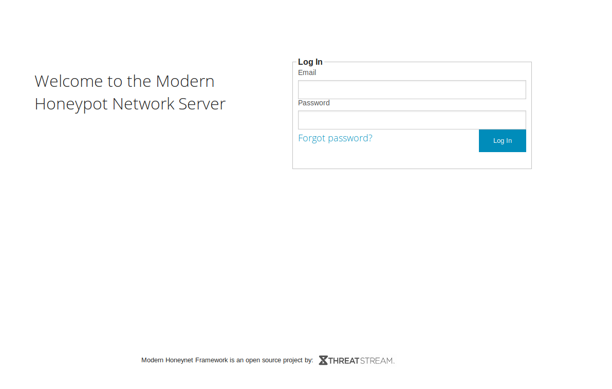
  
**Pano Ekranı**
Bu ekranda genel saldırı istatistikleri görüntülenir. 
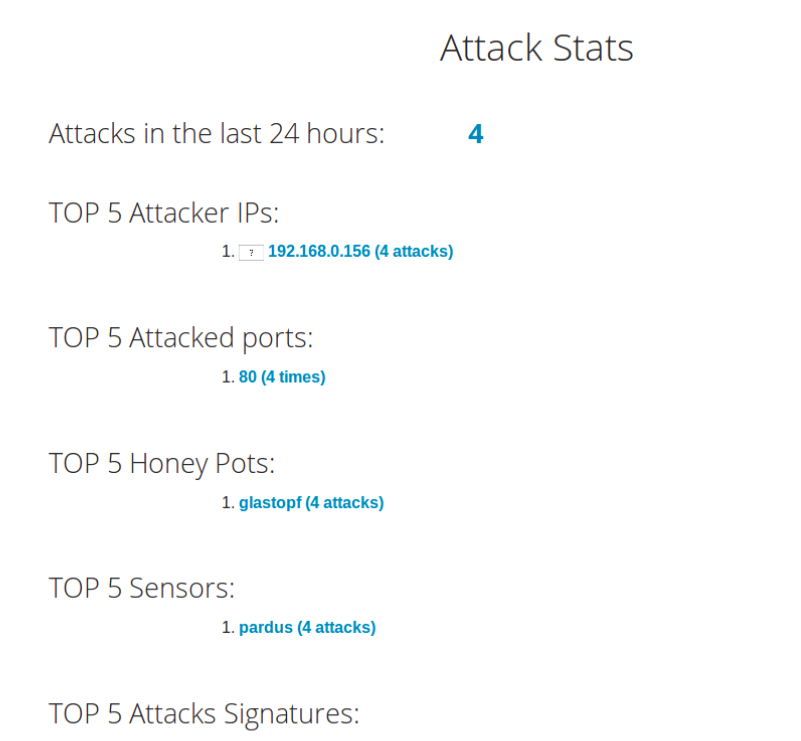

**MAP(Harita)**
Saldırıların geldiği IP adresleri ülke bazında harita üzerinde görünür.
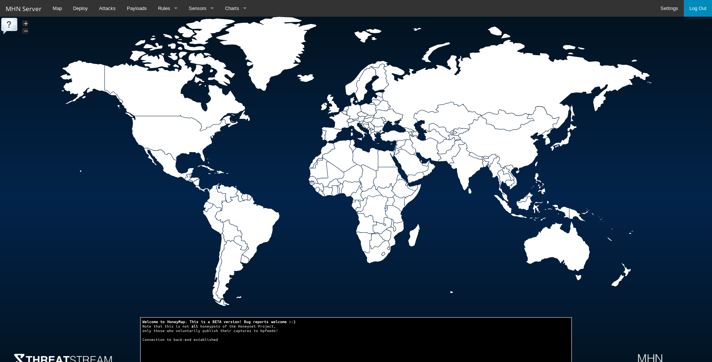

  **Deploy(Tuzak sistem kurulumu ve entegrasyonu)**

Desteklenen tuzak sistemleri bu ekran üzerinden kurulur. **Ancak Ahtapot projesi kapsamında bu ekrandaki yönergeleri kulanarak tuzak sistem kurulumu yapılmaz.** Tuzak sistem kurulumları **Ansbile** kullanılarak **yapılmaıdır**. Bu ekrandan sadece URL ve Deploy Key bilgileri ansible’a tanımlanmak için alınabilir. Örn: **url:** [http://10.0.0.3](http://10.0.0.3/) **deploy key:** yeqRzyq9
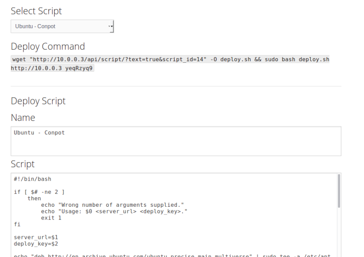

**Attacks(Saldırılar)**

Tuzak sistemlerden gelen uyarıların yer aldığı ekrandır. Bu ekranda arama filtrelerini kullanarak geçmiş uyarılar aranır.
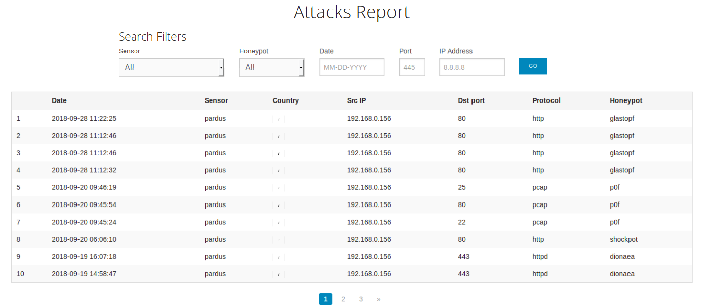

**Payloads(Saldırı içeriği)**

Destekleyen tuzak sistemlerinin kaydettikler detaylı veriyi içeren kayıtların yer aldığı ekrandır.
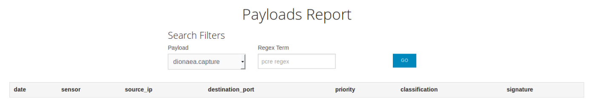

**Rules(Suricata imzaları)**

Suricata tuzak sisteminin imzalarının yönetildiği alandır. Bu alanda istenilen imzalar aktif/pasif edilebilir. İmzalar ön tanımlı olarak 1 saat aralıklarla suricata tuzak sistemi tarafından 80 portunu kularanak MHN sunucusu üzerinden çekilir.
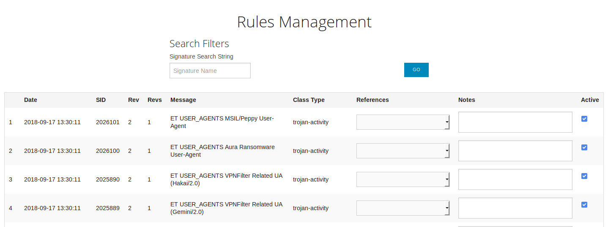

**Rule Sources (Suricata imza adresi)**

Suricata imzalarının alınacağı URL tanımlanır. MHN bu url üzerinden 1 saat aralıklarla imzaları çeker. Ön tanımlı olarak sistem içerisindeki bir imza dosyasını kullanır. Güncel saldırıların alınabilmesi için bu ayarın değiştirilmesi gereklidir.

Örn: Aşağıdaki adres kullanılabilir.

[http://rules.emergingthreats.net/open/suricata-4.0/emerging.rules.tar.gz](http://rules.emergingthreats.net/open/suricata-4.0/emerging.rules.tar.gz)
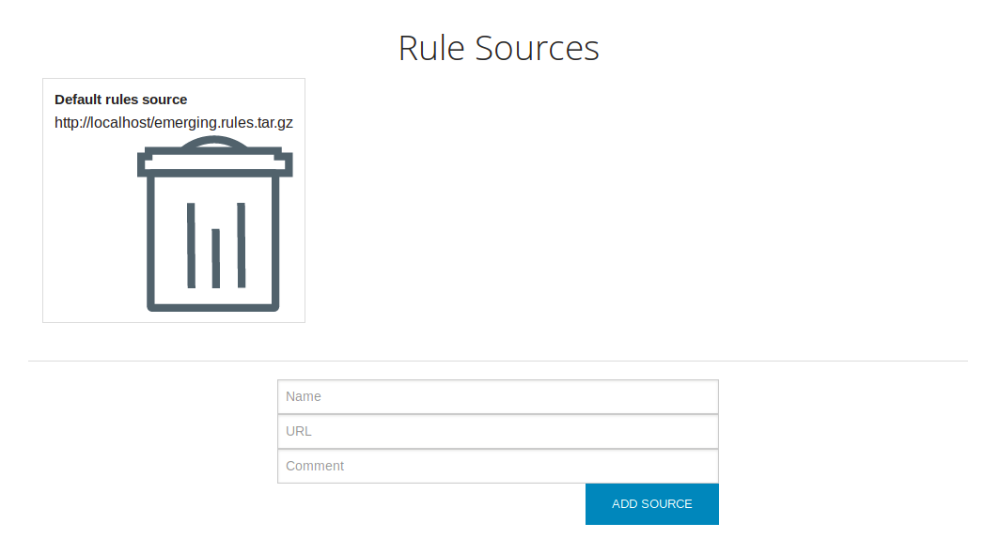

**Sensors(Tuzak sistemler)**

Tuzak sistemlerin listelendiği ekrandır. Buradan istenmeyen tuzak sistemler silinebilir.
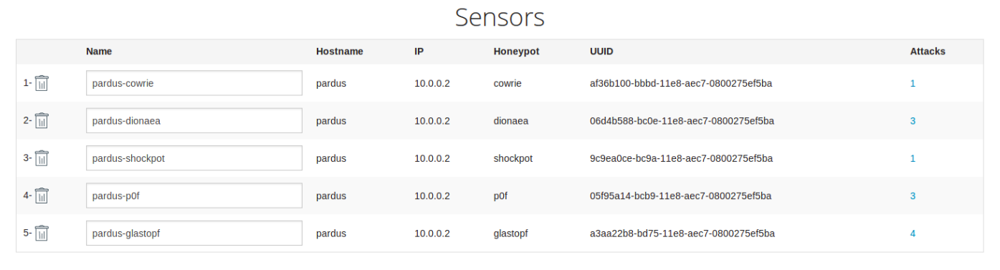

**Charts(Grafikler)**

Kippo/Cowrie tuzak sistemlerine ait grafik raporları alanıdır.
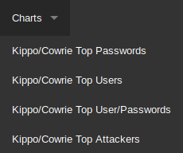

**En çok giriş denemesi yapılmış kullanıcı ve şifre**
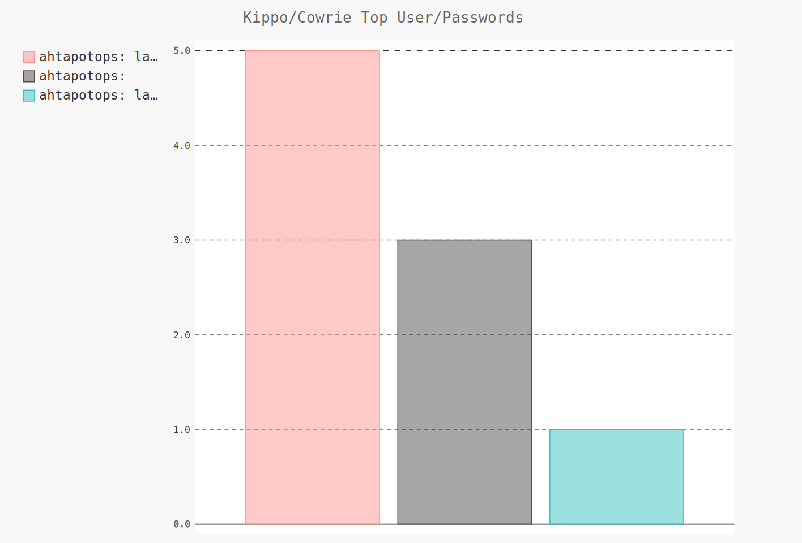

**En çok saldırı yapan IP adresleri**
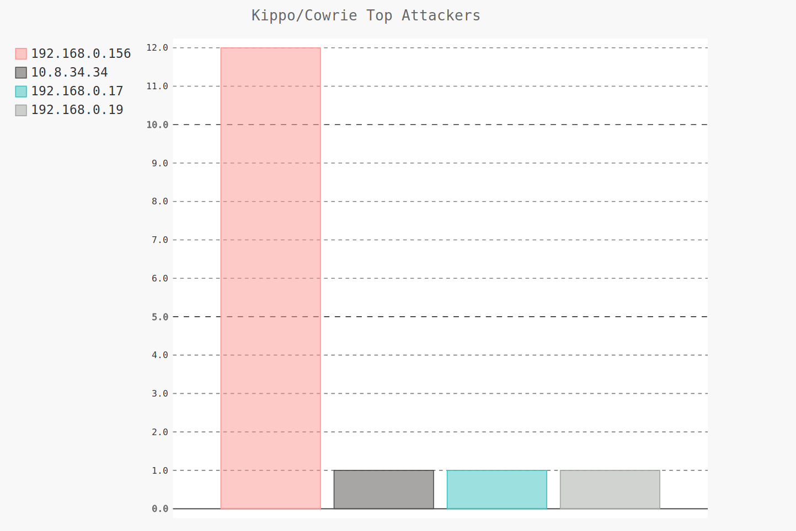

**Settings**

MHN sunucusuna WEB erişimi için kullanıcı işlemlerinin yapıldığı ve API key’in görüntülenebildiği alandır.

**API Key:** REST API ile fakrlı sistemlerle entegrasyon yapılırken kullanılacak özel anahtar. Bu anahtar sayesinde kullanıcı adı ve şifre kullanılmadan MHN API’si üzerinden istenilen veriler elde edilebilir veya değişiklik yapılabilir.

**API Doc:** [https://github.com/threatstream/mhn/wiki/MHN-REST-APIs](https://github.com/threatstream/mhn/wiki/MHN-REST-APIs)
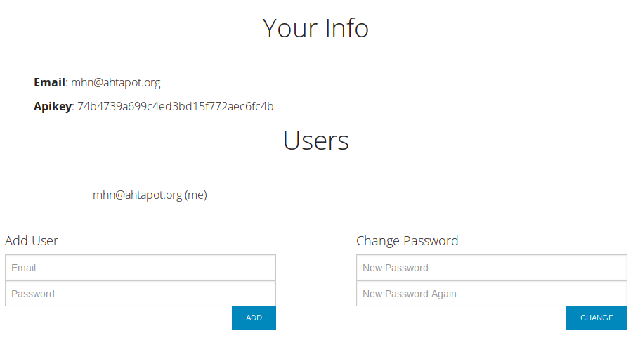
