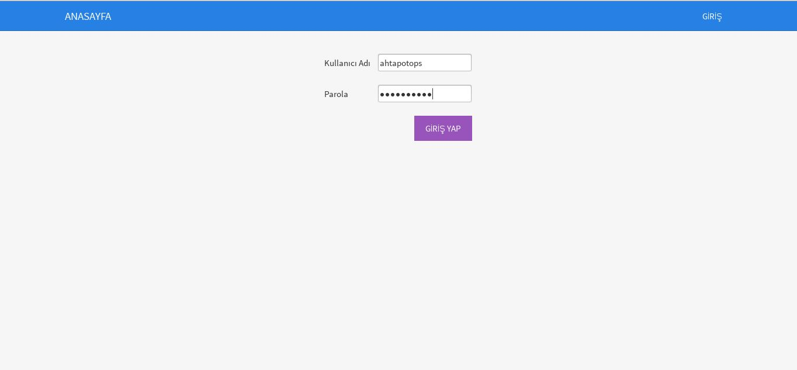
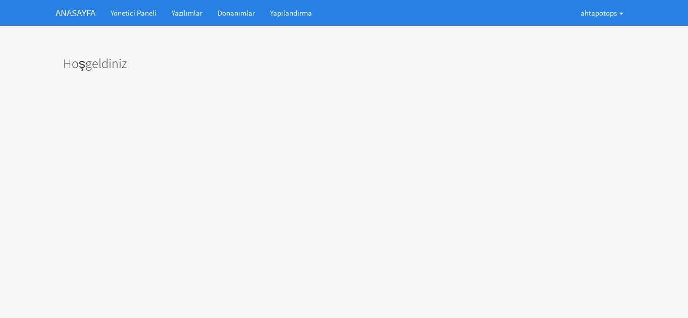
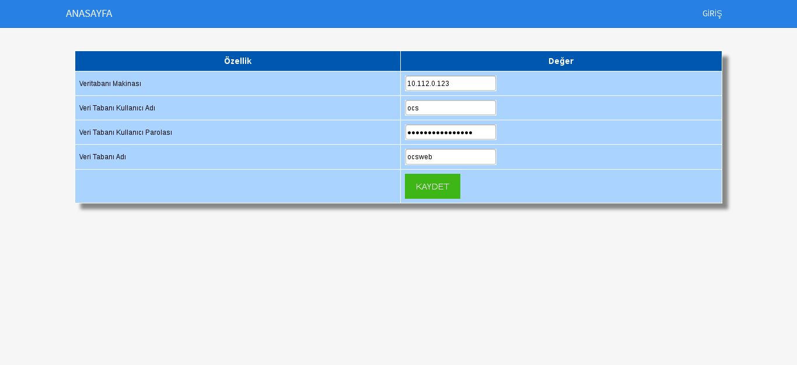
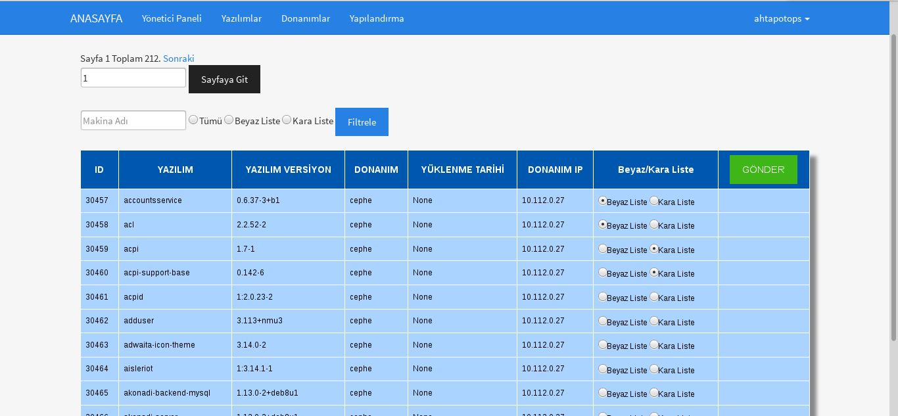
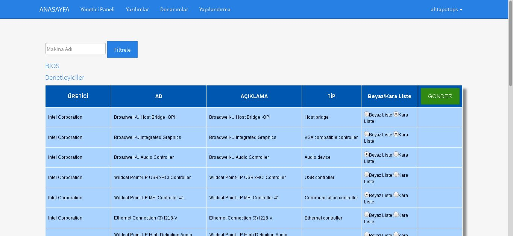
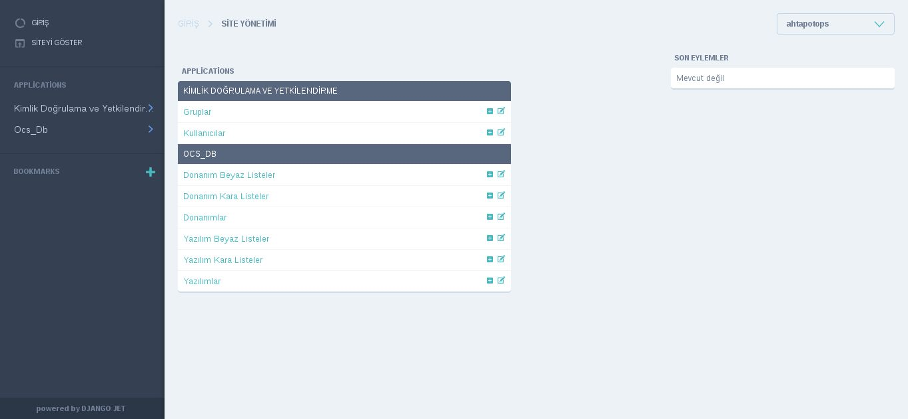
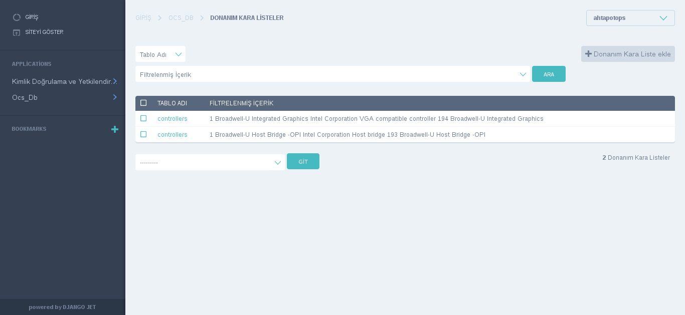

# Ocswb Kullanım

* Ocsweb playbookunda belirlenen server name adresi internet tarayıcısında "**https://ocswb_server_name**" şeklinde yazılarak, arayüzüne erişilir.

* GİRİŞ menüsünden “**ahtapotops**” kullanıcı adı ve “**ocsweb2016**” parolasıyla giriş yapılır.



* Arayüze giriş yapıldıktan sonra "**Yapılandırma**" menüsüne tıklanır.



* Yapılandırma menüsünde "**Veritabanı Makinesi**" bölümüne ossim makinesinin ip bilgisi, "**Veri Tabanı Kullanıcı Adı**" bölümüne ossim makinesinin veritabanı kullanıcı adı, "**Veri Tabanı Kullanıcı Parolası**" bölümüne veritabanının kullanıcı parolası, "**Veri Tabanı Adı**" bölümüne de veritabanı adı girilir ve "**KAYDET**" butonuna basılır.



* Yapılandırma işlemi yapıldıktan sonra "**ANASAYFA**" butonuna basılarak Anasayfaya gelinir. Burada "**Yazılımlar**" menüsüne tıklanır. Yazılımlar menüsü açıldığında "**Makina Adı**" göre istenilen filtreleme işlemi "**Filtrele**" butonuna basılarak gerçekleştirilebilir. İstanilen sayfa numarası girilerek "**Sayfaya Git**" butonuna basılarak sayfalar arası gezinme işlemi gerçekleştirilebilir. Bu sayfada istenilen yazılım "**Beyaz/Kara Liste**" sütünunda bulunan seçim ile beyaz listeye yada kara listeye eklenir.



* Daha sonra tekrar "**ANASAYFA**" butonuna basılarak Anasayfaya dönülür. Burada "**Donanımlar**" menüsüne tıklanılır. Öncelikle "**Makina Adı**" bölümüne makine adı girilerek filtreleme işlemi gerçekleştirilir. Daha sonra istenilen donanım çeşidine tıklanarak içerisinde bulunan donanımlar "**Beyaz/Kara Liste**" sütünunda bulunan seçim ile beyaz listeye yada kara listeye eklenir.



* "**ANASAYFA**" geri dönüldüğünde "**Yönetici Paneli**" menüsü seçilerek eklenmiş olan listeler ve donanım, yazılım listeleri buradan görüntülenebilir.





* Beyaz ve Kara liste oluşturma işlemleri bittikten sonra “**ocswb**” makinesine gidilerek “**/var/opt/ahtapot-ocs-wb-alarm**” dizini içerisine girilir. Alarm loglarının oluşmasında beyaz veya kara liste için seçilen uygulamalar ile oluşması için "**config.ini**"  dosyası içerisinde scan_mode whitelist veya blacklist olarak değiştirilmelidir. Daha sonra “**ahtapot-ocs_wb_alarm.py**” scripti python komutu ile aşağıdaki gibi çalıştırılır.


```
cd /var/opt/ahtapot-ocs-wb-alarm/
vi config.ini
python ahtapot-ocs_wb_alarm.py
```

* ahtapot-ocs_wb_alarm.py scripti çalıştırılırdıktan sonra "**/var/log/ahtapot/**" dizini içerisindeki "**ahtapot-ocs_wb_alarms.log**" dosyasında kara listeye eklenen yazılım ve donanımlarla ilgili loglar görüntülenebilir.

```
$ cat /var/log/ahtapot/ahtapot-ocs_wb_alarms.log
```
**Sayfanın PDF versiyonuna erişmek için [buraya](ocswb-kullanim.pdf) tıklayınız.**
