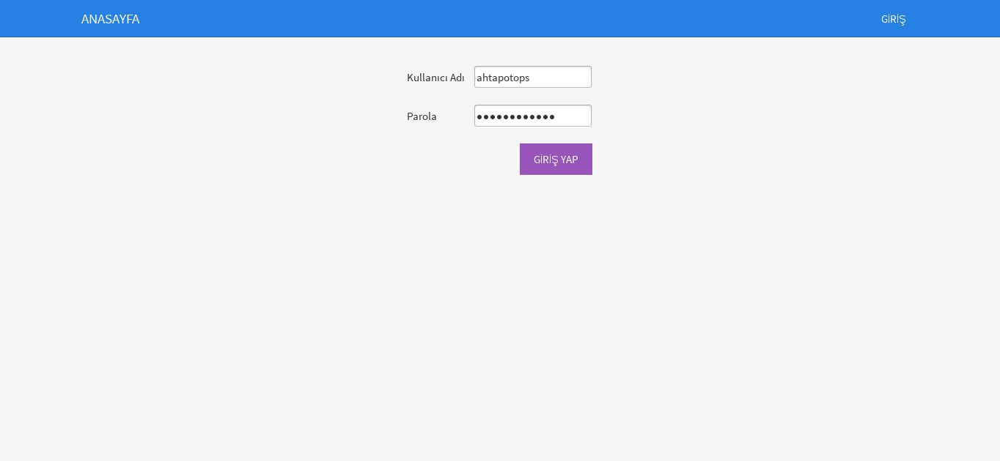
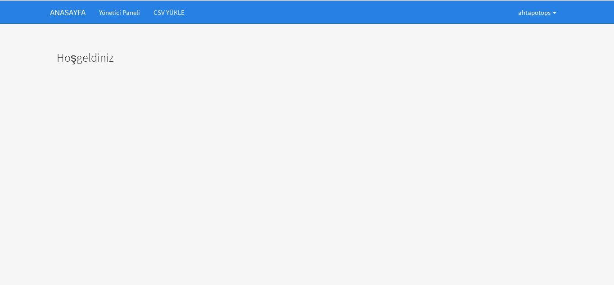
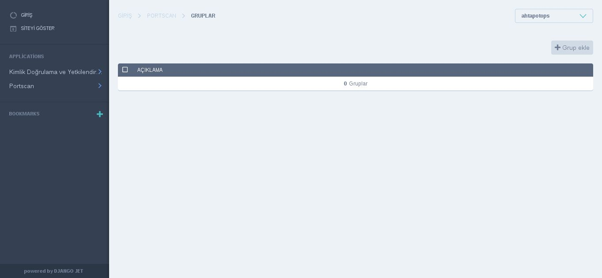
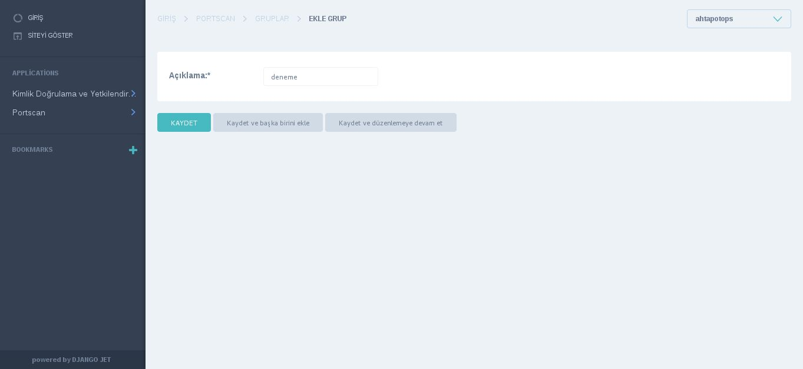
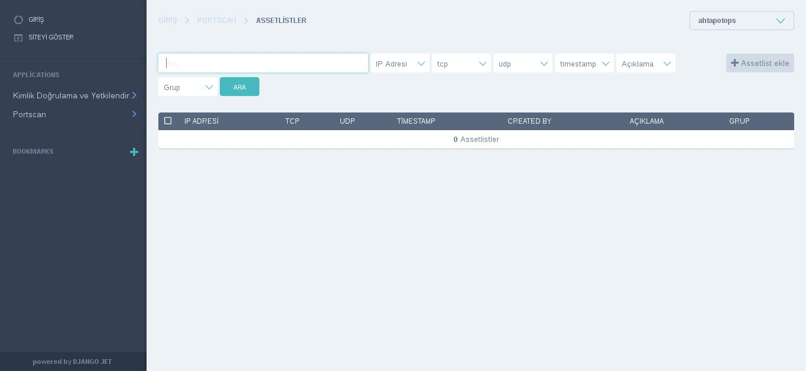
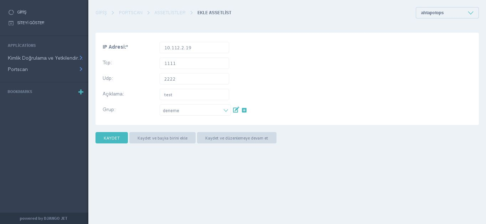
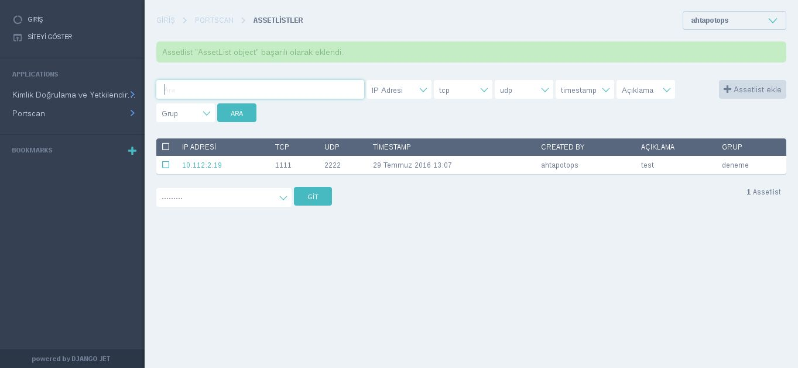
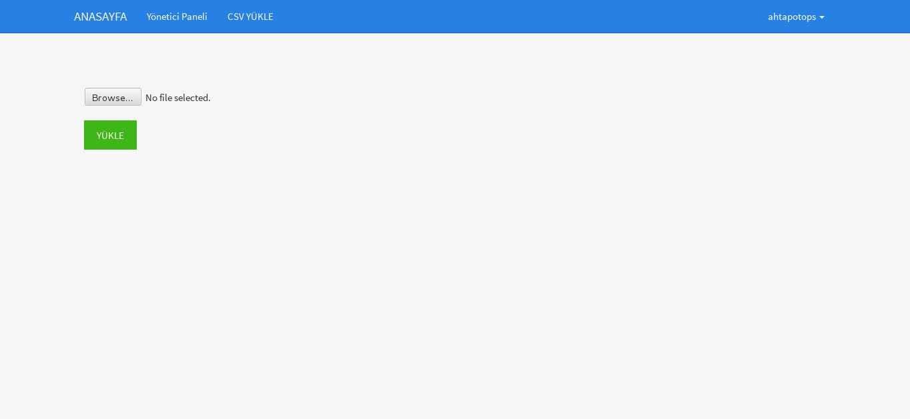
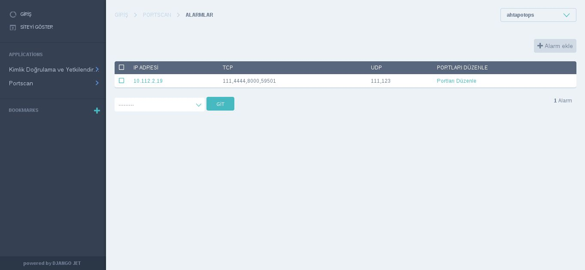

# Portscanner Kullanım


* Portscanner playbookunda belirlenen server name adresi internet tarayıcısında “https://portscanner_server_name” şeklinde yazılarak, arayüzüne erişilir.

* GİRİŞ menüsünden “ahtapotops” kullanıcı adı ve “portscan2016” parolasıyla giriş yapılır.



### Assetlist için Grup Oluşturma
* Arayüze giriş yapıldıktan sonra yönetici paneli menüsüne tıklanır.



* Yönetici paneli menüsünden "**Portscan**" menüsünde bulunan "**Gruplar**" seçeneğine tıklanır. Açılan sayfada sağ üst köşede bulunan "**Grup Ekle**" butonuna basılır.



* Grup ekleme arayüzü açıldıktan sonra grubun niteliğini belirten bir açıklama girilir ve "**Kaydet**" butonuna basılır.




### AssertList ekleme

* Tek tek AssetList girmek için, “**Yönetici Paneli**” menüsünden "**Portscan**" menüsünde bulunan "**Assetlistler**" sayfasına gidilir. AssetList syfasında sağ üstte yer alan "**Assetlist Ekle**" butonuna tıklanır.



* AssetList Ekle sayfasında "**Ip Adresi**", "**Tcp**", "**Udp**", "**Açıklama**", "**Grup**" bilgileri girilerek "**Kaydet**" butonuna basılır. Bu sayfada girilen bilgiler bu ip bilgisi için açık olabilecek yani alarm üretilmemesi istenen tcp ve udp portlarını ifade etmektedir. 



* AssetList'in kaydedildiği aşağıdaki gibi görünmektedir.



* AssetList'leri tek tek eklemektense bir csv dosyası oluşturularak yüklenebilir. Bunun için "**Anasayfa**" da bulunan "**CSV YÜKLE**" butonuna basılır. Yüklenmek istenen dosya "**Browse...**" butonuna basılarak yüklenir.



* "**/var/opt/portscan**" dizini içerisinde bulunan hedef gösterilen network'ü tarayan scanner.sh scripti aşağıdaki gibi çalıştırılır. 

```
$ sudo ./scanner.sh
```

* scanner.sh dosyasının çalışması bittikten sonra AssetList te tanımlanan bilgiler ile tarama sonuçlarını karşlaştırarak alarm üretecek olan "parser.sh" scripti aşağıdaki çalıştırılır.

```
$ ./parser.sh
```

* parser.sh scriptinin çalışması bittikten sonra Portscan Arayüzünden "**Portscan**" menüsünde bulunan "**Alarmlar**" seçeneğinde oluşan alarmlar bulunmaktadır.



**Sayfanın PDF versiyonuna erişmek için [buraya](portscan-kullanim.pdf) tıklayınız.**


