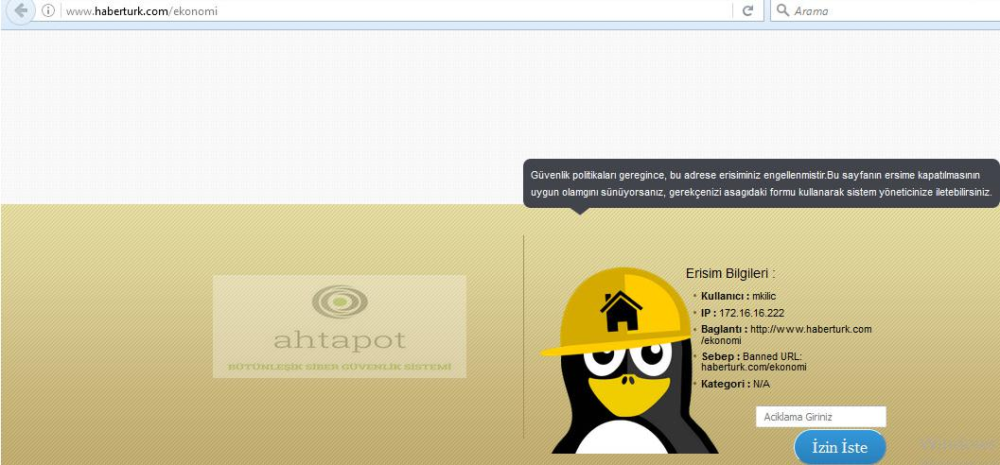
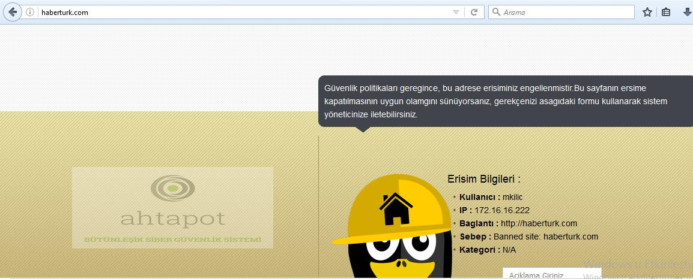
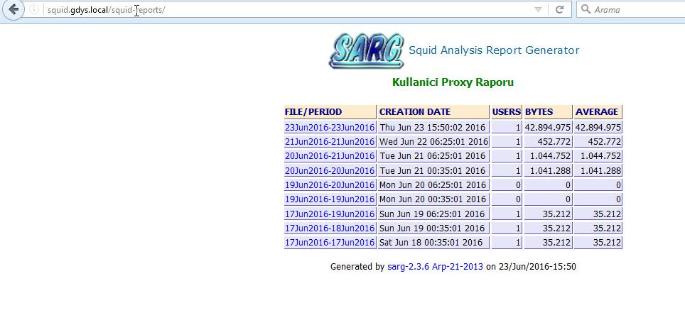
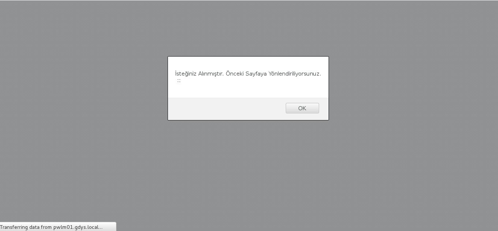
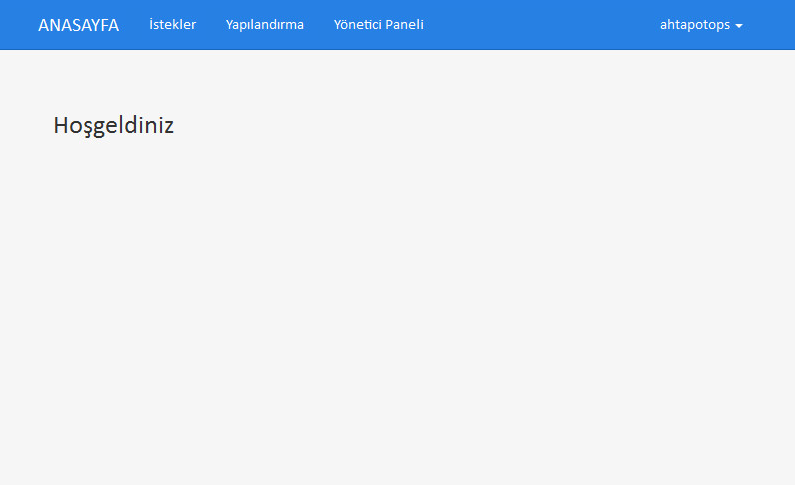
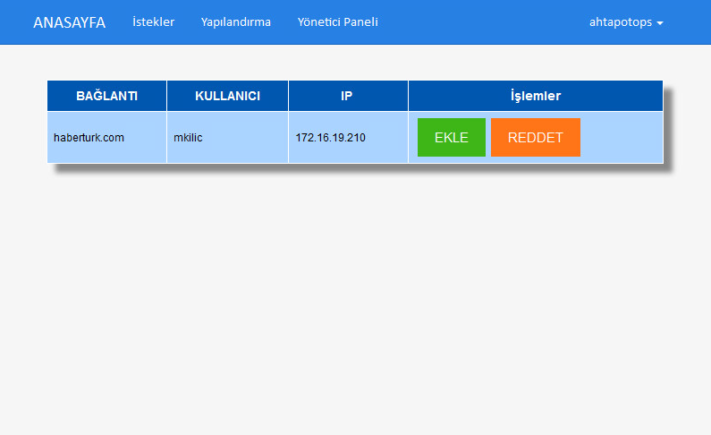
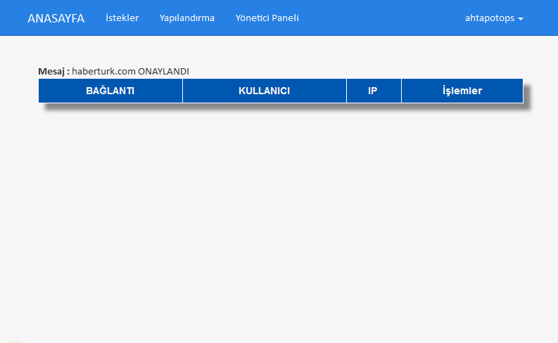
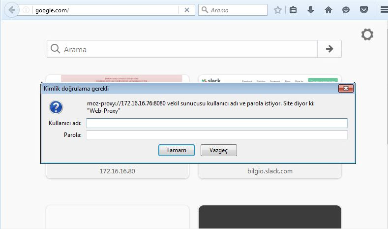

#Güvenli İnternet Erişim Sistemi Kullanımı
------

[TOC]

####Vekil Sunucu ve MYS üzerinde Engelleme İşlemleri
#####Vekil Sunucu Üzerinde URL Engelleme

* Bir URL adresi engellenmek istendiği zaman vekil sunucu üzerinde, “**/etc/dansguardian/lists**” dizini altına gidilir. Engellenmek istenilen URL adresi başında “**http://**” bulundurmadan; “**/etc/dansguardian/lists/bannedurllist_local**” dosyası içerisine yazılır. 
```
squid:~ahtapotops$ vi /etc/dansguardian/lists/bannedurllist_local

haberturk.com/ekonomi
```
* Haberturk.com adresi herhangi bir engelleme içerisinde bulunmadığı halde, haberturk.com/ekonomi adresine gidildiğinde şu sayfa karşılamaktadır.



#####MYS ile Vekil Sunucu Üzerinde URL Engelleme

* Bir URL adresi engellenmek istendiği zaman mys üzerinde, “**roles/squid/templates/dansguardian/bannedurllist**” dizini altına gidilir. Bu dizin içerisinde bulunan "**bannedurllist.j2**" dosyası düzenlenir. Engellenmek istenilen URL adresi başında “**http://**” bulundurmadan; “**bannedurllist.j2**” dosyası içerisine yazılır.
 
#####Vekil Sunucu Üzerinde Regex ile URL Engelleme

* Bir URL adresi regex paternı ile engellenmek istendiği zaman, “**/etc/dansguardian/lists**” dizini altına gidilir.  URL içerisinde engellenmek istenilen kelimeler, engellenmek istenilen URL regex patternı “**/etc/dansguardian/lists/bannedregexpurllist**” dosyası içerisine yazılır. Aşağıdaki örnekte “**testkelimesi**”  ve “**cyber**” kelimesi içeren bütün url adreslerini engelleyecektir.  İkinci satırda kullanılan regex paternı ile “**im.haberturk.com**”  adresi üzerinde belirtilen dosya türlerinin hepsi engellenecektir. Bu şekilde siteye gidildiğinde web sitesinde bulunan ve engellenmesi istenen uzantıya ait resimlerin engellediği gözlemlenebilir.

```
squid:~ahtapotops$ vi /etc/dansguardian/lists/bannedregexpurllist

(testkelimesi|cyber)
(im.haberturk.com)+.*(\.jpg|\.wmv|\.mpg|\.mpeg|\.gif|\.mov)
```
#####Vekil Sunucu Üzerinde Domain Engelleme

* Bir domain adresi engellenmek istendiği zaman, “**/etc/dansguardian/lists**” dizini altına gidilir. Engellenmek istenilen domain adresi; “**/etc/dansguardian/lists/bannedsitelist_local**” dosyası içerisine yazılır. Daha sonra engellenmiş olan domain test edilir.
```
squid:~ahtapotops$ vi /etc/dansguardian/lists/bannedsitelist_local

haberturk.com
```


#####Mys ile Vekil Sunucu Üzerinde Domain Engelleme

* Bir domain adresi engellenmek istendiği zaman mys üzerinde, “**roles/squid/templates/dansguardian/bannedsitelist**” dizini altına gidilir. Bu dizin içerisindeki "**bannedsitelist.j2**" dosyası düzenlenir. Engellenmek istenilen domain adresi yazılarak "**bannedsitelist.j2**" dosyası kaydedilir. Daha sonra engellenmiş olan domain test edilir.

####Vekil Sunucu Üzerinde İstisna İşlemleri
#####Vekil Sunucu Üzerinde Domain(Whitelisting) İstinası Tanımlama

* Bir domain adresi whitelisting(istisna) edilmek istendiği zaman, “**/etc/dansguardian/lists**” dizini altına gidilir. İstisna olarak tanımlanmak istenilen domain adresi başında “**http://**” bulundurmadan; “**/etc/dansguardian/lists/exceptionsitelist_local**” dosyası içerisine yazılır. Daha sonra whitelist'e eklenmiş olan domain test edilir, erişimin sağlandığı görülecektir.
```
squid:~ahtapotops$ vi /etc/dansguardian/lists/exceptionsitelist_local

haberturk.com
```

#####Mys ile Vekil Sunucu Üzerinde Domain(Whitelisting) İstinası Tanımlama

* Bir domain adresi whitelisting(istisna) edilmek istendiği zaman mys üzerinde, “**roles/squid/templates/dansguardian/exceptionsitelist**” dizini altına gidilir. Bu dizin içerisinde bulunan "**exceptionsitelist.j2**" dosyası düzenlenir. İstisna olarak tanımlanmak istenilen domain adresi başında “**http://**” bulundurmadan; “**exceptionsitelist.j2**” dosyası içerisine yazılır. Daha sonra whitelist'e eklenmiş olan domain test edilir, erişimin sağlandığı görülecektir.

#####Vekil Sunucu Üzerinde URL(Whitelisting) İstinası Tanımlama

* Bir URL adresi whitelisting(istisna) edilmek istendiği zaman, “**/etc/dansguardian/lists**” dizini altına gidilir. Engellenmek istenilen domain adresi başında “**http://**” bulundurmadan; “**/etc/dansguardian/lists/exceptionurllist_local**” dosyası içerisine yazılır ve kaydedilir. Daha sonra whiteliste eklenmiş olan adres test edilir, erişimin sağlandığı görülecektir.
```
squid:~ahtapotops$ vi /etc/dansguardian/lists/exceptionurllist_local

haberturk.com/ekonomi
```
#####Mys ile Vekil Sunucu Üzerinde URL(Whitelisting) İstinası Tanımlama

* Bir URL adresi whitelisting(istisna) edilmek istendiği zaman mys üzerinde, “**roles/squid/templates/dansguardian/exceptionurllist**” dizini altına gidilir. Bu dizin içerisindeki "**exceptionurllist.j2**" dosyası düzenlenir. İstisna olarak tanımlanmak istenilen domain adresi başında “**http://**” bulundurmadan; “**exceptionurllist.j2**” dosyası içerisine yazılır ve kaydedilir. Daha sonra whiteliste eklenmiş olan adres test edilir, erişimin sağlandığı görülecektir.

#####Vekil Sunucu Üzerinde URL Regex (Whitelisting) İstinası Tanımlama

* Bir URL adresi regex paternı ile whitelisting(istisna) edilmek istendiği zaman, “**/etc/dansguardian/lists**” dizini altına gidilir. Whitelist'e eklenilmek istenilen regex paterni; “**/etc/dansguardian/lists/exceptionregexpurllist**” dosyası içerisine yazılır. Daha sonra whiteliste eklenmiş olan url paterni test edilir, bu kelimeleri içeren adreslerin erişim sağlandığı görülecektir.
```
squid:~ahtapotops$ vi /etc/dansguardian/lists/exceptionregexpurllist

ekonomi
testkelimesi
```
####Vekil Sunucu Üzerine Otomatik Engelleme Listesinin Çekilmesi

* “**Shalla Secure Services**”  üzerinden indirilen blacklist bir script tarafından otomatik/yarı otomatik olarak internet üzerinden güncelleme yapabilmektedir. “**Updshalla**” isminde üretilen script “**shallalist.de**” adresi üzerinden en son listeyi indirip, dansguardian üzerinde güncelleme yapmaktadır. Updshalla scripti : “/etc/dansguardian/updshalla” dizininde bulunmaktadır.
```
squid:~ahtapotops$ ls -l /etc/dansguardian
drwxr-xr-x  2 root root  4096 Jun 17 12:09 authplugins
drwxr-xr-x  2 root root  4096 Jun 17 12:09 contentscanners
-rw-r--r--  1 root root  7516 Jun 23 12:09 dansguardian.conf
-rw-r--r--  1 root root 11635 Feb  7 23:59 dansguardianf1.conf
drwxr-xr-x  2 root root  4096 Jun 17 12:09 downloadmanagers
drwxr-xr-x 29 root root  4096 Jun 17 12:09 languages
drwxr-xr-x  7 root root  4096 Jun 23 14:57 lists
drwxr-xr-x  3 root root  4096 Jun 23 15:10 tmp
-rwxr-xr-x  1 root root  5801 Jun 17 12:09 updshalla
-rw-r--r--  1 root root   708 Jun 17 12:09 updshalla.conf
```
* Updshalla scripti çalıştırıldığında, gerekli güncellemeleri yaparak; “**/etc/dansguardian/lists/blacklists/shalla**” dizini altına tüm listeleri indirmektedir. Bu liste Ansible playbook üzerinden ile kurulurken yapılan konfigurasyon ile güncellemenin yapılacağı zaman  “**roles/squid/vars**” dizini altında değişkenleri barındıran “**updshalla.yml**” dosyası üzerinde “**min:**”, “**hour:**”, “**week:**”, “**day:**”, “**month:**” satırlarına sırası ile updshalla scriptinin dakika, saat, gün, hafta, ay olarak ne sıklıkta çalışacağı bilgisi girilir (Örneğin: min: 59, hour: 23, day: “”, week: “”, month: “*” bu bilgi updshallanın her gün 23:59’da çalışacağını ifade etmektedir).
```
    cron:
        source: "updshalla/updshalla-cron.j2"
        destination: "/etc/cron.d/updshalla"
        owner: "root"
        group: "root"
        mode: "0755"
    min: "59"
    hour: "23"
    week: "*"
    day: "*"
    month: "*"
    user: "root"
```
* Updshalla scriptini test etmek için aşağıdaki komut kullanılır.
```
squid:~ahtapotops$ bash /etc/dansguardian/updshalla
```

####Vekil Sunucu Kullanım İstatisklerinin Raporlanması

* SARG (squid analysis report generator) Web(Örün) arayüzü ile son kullanıcı için hazırlanmış proxy raporu görülebilir. Web arayüzüne;  “**http://squid.fqdn.adresi/squid-reports**” adresine gidilerek ulaşılabilir.




* Açılan ekranda kullanıcılara ait çalışma raporu görüntülenebilmektedir. İhtiyaç doğrultusunda ana ekranda çıkan rapor çeşitlerinden bir tanesi seçilerek, gerekli rapor görüntülenebilir.

####Vekil Sunucu Dosya Yükleme Engelleme / Sınırlandırma
* Dansguardian konfigurasyon dosyası içerisinde bulunan; “**maxuploadsize**” özelliği ile engelleme ya da sınırlandırma yapılabilrmektedir. “**Maxuploadsize = -1**” Bu özelliği devre dışı bırakır. “**Maxuploadsize = 0**” Tüm upload işlemlerini bloklar.
```
squid:~ahtapotops$ vi /etc/dansguardian/dansguardian.conf
…
…
…


# POST protection (web upload and forms)
maxuploadsize = 0 
```

* Yükleme işlemine hız sınırlandırması yapılmak istendiğinde **Kilobayt0** cinsinden sınırlandırılma getirilecek olan hız  “**maxuploadsize**” parametresine yazılır. Örneğin
“**Maxuploadsize = 512**” 512kb üzeri dosyaların upload edilmesini bloklar.

####Mys ile Vekil Sunucu Üzerinde Dosya Yükleme Engelleme / Sınırlandırma

* Gitlab arayüzünden mys reposuna erişilerek burada bulunan “**roles/squid/vars**” dizini altında değişkenleri barındıran “**dansguardian.yml**” dosyası üzerinde “Dansguardian yapilandirmasini belirtmektedir.” başlığı altında belirtilen “**maxuploadsize**” özelliği ile engelleme ya da sınırlandırma yapılabilmektedir. “**maxuploadsize = -1**” Bu özelliği devre dışı bırakır. “**maxuploadsize = 0**” Tüm upload işlemlerini bloklar. Burada belirtilen "**maxuploadsize**" özelliği playbook oynatıldığında dansguardianın konfigürasyon dosyasına yazılır.
* Yükleme işlemine hız sınırlandırması yapılmak istendiğinde **Kilobayt0** cinsinden sınırlandırılma getirilecek olan hız  “**maxuploadsize**” parametresine yazılır.
####Vekil Sunucu Erişim Talebi Yapılması

* Yanlış engellendiği değerlendirilen web sayfası için izin isteme talebini oluşturacak **ahtapot-pwlm** uygulaması, Ansible playbook ile yapılandırılması yapılan proxy paketi içerisinde kurulmaktadır.

* Bu yapılandırma ansible üzerinden gerçekleştirilmelidir. Engellenmiş bir adrese gidildiği zaman aşağıdaki görüntü oluşmaktadır.


* Squid doğrudan PWLM sunucusuna yönlendirmektedir, son kullanıcı tarafından bu adrese gitmek için izin istediği açıklama girilerek, sistem yöneticisine iletir. 



* Bu istek pwlm sunucusu üzerinde,  veritabanına kaydedip, sistem yöneticisine bilgilendirme yapmaktadır. 

* İzin isteklerini görebilmek için "**https://pwlm.fqdn**" ile pwlm arayüzüne erişildikten sonra "**Giriş**" butonuna tıklanır, kullanıcı adına "**ahtapotops**" parolaya ise "**squid2016**" girilerek sisteme giriş yapılır.


* Sisteme giriş yapıldıktan sonra aşağıdaki arayüz gelmektedir.



* Bu arayüzde üstte bulunan menüden "**İstekler**" seçeneğine tıklandığında istenen istek aşağıdaki gibi görünmektedir. 



* İstek doğrultusunda erişim istenen url veya domainin reddedilmesi durumunda "**REDDET**" butonuna tıklanmalıdır. Erişim izni verilecek ise "**EKLE**" butonuna tıklanarak erişim istenen domain veya urlin "**Yapılandırma**" bölümünde "**Beyaz Liste Dosya Yolu**" seçeneğinde belirtilen dosyaya ekleme işlemi otomatik olarak gerçekleşmektedir.



####Mys ile Vekil Sunucu Kullanıcı Doğrulama Yapılandırması

* Gitlab arayüzünden mys reposuna erişilerek burada bulunan “**roles/squid/vars**” dizini altında değişkenleri barındıran “**squid.yml**” dosyası üzerinde “**squid yapilandirmasini belirtmektedir.**” başlığı altında belirtilen “**ldaphost:**” satırına ldap sunucusunun **FQDN** bilgisi, “**ldapdomain:**” satırına ise ldap makinesine ldap uygulmasını kurarken belirlenmiş domain bilgisi girilir. 

```
squid:
# Squid yapilandirmasini belirtmektedir.
    conf:
        source: "squid"
        destination: "/etc/squid3/squid.conf"
        owner: "root"
        group: "root"
        mode: "0644" 
    service:
        name: "squid3"
        state: "started"
        enabled: "yes"
    ldap:  
        enabled: "yes" 
        host: "ldap01.gdys.local"
        domain: "dc=ulakbim,dc=com"
    http_port: "3128"
```
* İlgili ayarın aktif olması için Ansible makinası üzerinde “Squid” rolüne ait ansible playbook çalıştırılır.
```
ansible:~ahtapotops$ cd /etc/ansible
ansible:~ahtapotops$ ansible-playbook playbooks/suqid.yml
```
* LDAP yetkilendirmesi tanımlandıktan sonra, proxy ile giriş yapılmak istendiği aşağıdaki ekran gelerek kullanıcıya ait kullanıcı adı/sifre girilmesi sağlanır.



####Mys ile Vekil Sunucu İnternet Erişim Kayıtlarının İmzalanması

* 5651 kapsamında İnternet Erişim Kayıtlarının İmzalanması **Rsyslog** sunucusu üzerinde yapılmaktadır.

* İmzalama işlemi için gerekli yapılandırmanın yapılması için GitLab arayüzünden “**roles/rsyslog/vars**” altında bulunan “**signer.yml**” dosyasında bulunan “**username**” satırına KamuSM kullanıcı adı, “**password**” satırına ise KamuSM kullanıcısının parolası yazılmaktadır.
```
# Signer yapilandirmasini belirtmektedir.
signer:
    conf:
        source: "signer.bash.j2"
        destination: "/opt/signer.bash"
        owner: "root"
        group: "root"
        mode: "0750" 
    directory:
        path: "/data/log/5651"
        owner: "root"
        group: "root"
        mode: "750" 
        state: "directory"
    username: "tubitak"
    password: "'tubitak'"
    signingdirectory: "/data/log/5651/tmp" 
    signedlogs: "/data/log/5651/signedlogs" 
    invalidlogs: "/data/log/5651/invaledlogs"
    serverfiles: "squid0*"
    command: "/opt/ZamaneConsole-2.0.5/ZamaneConsole-2.0.5.jar"
    logs: "/data/log"
```
* Rsyslog sunucusu üzerinden “**rsyslog.yml**” playbooku oynatılarak gerekli yapılandırma yapılır. Playbook’ un çalışması için Ansible makinasından aşağıdaki komut çalıştırılır.
```
ansible:~ahtapotops$ cd /etc/ansible
ansible:~ahtapotops$ ansible-playbook playbooks/rsyslog.yml
```
* Aşağıdaki komut ile Rsyslog makinası üzerinde, imzalama işlemini yapmak üzere aşağıdaki komut çalıştırılır. İmzalama işlemi belirli periyotlar ile tekrarlanmak isteniyor ise, aşağıdaki komut crontab a eklenerek, belirli aralıkla çalışması sağlanabilir.

```
java -jar ZamaneConsole-2.0.5.jar -z imzalanacakdosya  http://zd.kamusm.gov.tr 80 kamusmUser kamusmPassword sha-256
```

#### Vekil Sunucu Üzerinde Bant Genişliği Yönetimi

Bu başlık altında bilinmesi gereken terimlerin açıklamaları bulunmaktadır.

* **delay_pools** : delay pools'un (gecikme havuzlarının) sayısı belirtir. Örneğin : 1 tane class 1 delay pool ve bir tanede class 2 delay pool'umuz var ise toplamda 2 tane delay pool' umuz vardır.
* **delay_class** : Her delay pool için delay class olmalıdır.
```
delay_pools 4         # 4 tane gecikme havuzumuz var
delay_class 1 2        # havuz 1, sınıf 2 havuzudur
delay_class 2 3        # havuz 2, sınıf 3 havuzudur
delay_class 3 4        # havuz 3, sınıf 4 havuzudur
delay_class 4 5        # havuz 4, sınıf 5 havuzudur
``` 
* **class 1** : Belirtilen acl tek bir toplam limit ile sınırlıdır.
* **class 2** : Belirtilen acl toplam limit üzerinden belirtilen bireysel bir limit ile sınırlıdır. Bant genişliğini belirli değerler arasında dengelemek için class 1 ve class 2 bize yeterli olacaktır. 
* **delay_access** : Gecikmenin hangi havuza uygulanacağını belirtmemize yarar. delay_access delay_pool'lara göre sıralanmalıdır. aşağıdaki örnekte delay_pool 1 ve delay_pool 2 için sınırlama yapılacak kullanıcılar belirlenir. Bu kullanıcılar acl ile ip aralıklarıyla belirtilmelidir. (acl yüksek_limitli_kullanıcılar src 192.168.64.0/18)
```
delay_access 1 allow yüksek_limitli_kullanıcılar
delay_access 1 deny all
delay_access 2 allow düşük_limitli_kullanıcılar
delay_acces 2 deny all
```
* **delay_parameters** : Her gecikme havuzu için bir tane tanımlanır. Yapılacak olan sınırlama belirtilir. class 1 delay pool için delay_parameters syntax;
```
class 1 delay pool için delay_parameters syntax:
delay_pools pool 1
delay_parameters pool aggregate 
class 2 delay pool için delay_parameters syntax:
delay_pools pool 2
delay_parameters pool aggregate individual
```
* **delay_parameters** syntax'inda kullanılan terimlerin açıklamaları;
    * **pool**: pool numarası belirtilir.
    * **aggregate**: toplam bant genişliğinin sınırları belirtilir.
    * **individual**: kişisel bant genişliğin sınırları belirtilir.
* delay parameters da parametre yazılırken düşük_limit/yüksek_limit olarak yazılır. parametreler byte olarak girilir. Bant genişliği bit/sec olduğu için sınırlar byte/sec olarak hesaplanarak parametre yazılmalıdır. Kişi yüksek bant genişliğine çıktığında düşük limitli bant genişliğine düşürülür. Aşağıdaki örnekte delay pool numarası 1 , class numarasıda 2 delay pool ve bant genişliğini her kişi için 64Kbit/sec olarak kısıtlanmıştır.
```
delay_parameters 1 -1/-1 8000/8000
```
**Not**: 8x8000 Byte/sec -> 64 Kbit/sec 

**Not**: -1/-1 limit yok anlamına gelmektedir. class 2 de hem toplam bant genişliği sınırı hemde bireysel bant genişliği belirtmemiz gerekir. Burada ki -1/-1 toplam bant genişliğinde sınırlama yapılmayacağı anlamına gelmektedir.

##### Vekil Sunucu Üzerinde Total Bant Genişliği Sınırlama

* Aşağıda "**/etc/squid3/squid.conf**" dizininde bulunan squid'in konfigürasyon dosyasına eklenecek satırlar bulunmaktadır. Total limiti 64Kbit/sec ile 128Kbit/sec arasında kısıtlama: 

```
delay_pools 1                    # 1 tane delay pool var
delay_class 1 1                  # pool 1 class 1 i kullanıyor
delay_access 1 allow all         # pool 1 için şartlar herkes için geçerli
delay_parameters 1 8000/16000    # toplam bant genişliği 64Kbit/sec 128Kbit/sec arasında
```
**Not**: 8000/16000 byte ile temsil edilmektedir.
(8x8Kbyte/sec=64Kbit/sec 8x16Kbyte/sec=128Kbit/sec)

##### Mys ile Vekil Sunucu Üzerinde Total Bant Genişliği Sınırlama

* Mys gitlab arayüzüne girilir. "**roles/squid/templates/squid**" dizini içerisinde bulunan "**squid.fqdn.j2**" dosyası düzenlenir. Aşağıdaki konfiürasyon uyarlanarak bu dosya içerisine "# Cache Section" satırından önce yazılarak kaydedilir.

```
delay_pools 1                    # 1 tane delay pool var
delay_class 1 1                  # pool 1 class 1 i kullanıyor
delay_access 1 allow all         # pool 1 için şartlar herkes için geçerli
delay_parameters 1 8000/16000    # toplam bant genişliği 64Kbit/sec 128Kbit/sec arasında
```

#####Vekil Sunucu Üzerinde Kişisel Bant Genişliği Sınırlıma

* Aşağıda "**/etc/squid3/squid.conf**" dizininde bulunan squid'in konfigürasyon dosyasına eklenecek satırlar bulunmaktadır. "**acl acl_name req_header X-Forwarded-For -i ip_address**" satırında **acl_name** kısmında acl'e bir isim verilir ve **ip_address** kısmında ise acl için bir ip adresi belirlenir. "**delay_access 1 allow acl_name**" satırında bulunan **acl_name** ifadesine acl'in tanımlanmasında verilen isim yazılmalıdır. Tüm satırlar squid'in konfigürasyon dosyasına eklendikten sonra acl de bilirtilen ip için bant genişliği 64Kbit/sec ile 128Kbit/sec arasında kısıtlanmış olur.

```
acl acl_name req_header X-Forwarded-For -i ip_address

delay_pools 1                   # 1 tane delay pool var
delay_class 1 1                 # pool 1 class 1 i kullanıyor
delay_access 1 allow acl_name   # pool 1 için şartlar herkes için geçerli
delay_parameters 1 8000/16000   # bant genişliği 64Kbit/sec 128Kbit/sec arasında
delay_access 1 deny all         # diğer kullanıcılar bu işlemden etkilenmedi

```
Not: 8000/16000 byte ile temsil edilmektedir.
(8x8Kbyte/sec=64Kbit/sec 8x16Kbyte/sec=128Kbit/sec)

#####Mys ile Vekil Sunucu Üzerinde Kişisel Bant Genişliği Sınırlıma
* Mys gitlab arayüzüne girilir. "**roles/squid/templates/squid**" dizini içerisinde bulunan "**squid.fqdn.j2**" dosyası düzenlenir. Aşağıdaki konfiürasyon uyarlanarak bu dosya içerisine "# Cache Section" satırından önce yazılarak kaydedilir.
```
acl acl_name req_header X-Forwarded-For -i ip_address

delay_pools 1                   # 1 tane delay pool var
delay_class 1 1                 # pool 1 class 1 i kullanıyor
delay_access 1 allow acl_name   # pool 1 için şartlar herkes için geçerli
delay_parameters 1 8000/16000   # bant genişliği 64Kbit/sec 128Kbit/sec arasında
delay_access 1 deny all         # diğer kullanıcılar bu işlemden etkilenmedi

```
Not: 8000/16000 byte ile temsil edilmektedir.
(8x8Kbyte/sec=64Kbit/sec 8x16Kbyte/sec=128Kbit/sec)
#####Vekil Sunucu Üzerinde Gruplar için Bant Genişliği Sınırlıma

* Aşağıdaki satırlar "**/etc/squid3/squid.conf**" squid'in konfigurasyon dosyasına eklendiği zaman 192.168.1.0/24 ip bloğu için bant genişliğini belirtilen parametrede sınırlamaktadır.
```
ifollow_x_forwarded_for allow localhost
delay_pool_uses_indirect_client on

acl acl_name src 192.168.1.0/24

delay_pools 1                                # 1 tane delay pool var
delay_class 1 1                              # delay pool 1, class 2 yi kulllanıyor
delay_parameters 1 8000/16000                # total bant genişliği 5Mbit/sec #kullanıcıların bant genişliği 500Kbit/sec
delay_acces 1 allow acl_name                 # kullanıcılar için gerekli şartlara izin veriliyor
delay_access 1 deny all                      # diğer kullanıcılar bu işlemden etkilenmedi
```

#####Mys ile Vekil Sunucu Üzerinde Gruplar için Bant Genişliği Sınırlıma
* Mys gitlab arayüzüne girilir. "**roles/squid/templates/squid**" dizini içerisinde bulunan "**squid.fqdn.j2**" dosyası düzenlenir. Aşağıdaki konfigürasyon uyarlanarak bu dosya içerisine "# Cache Section" satırından önce yazılarak kaydedilir.
```
ifollow_x_forwarded_for allow localhost
delay_pool_uses_indirect_client on

acl acl_name src 192.168.1.0/24

delay_pools 1                                # 1 tane delay pool var
delay_class 1 1                              # delay pool 1, class 2 yi kulllanıyor
delay_parameters 1 8000/16000                # total bant genişliği 5Mbit/sec #kullanıcıların bant genişliği 500Kbit/sec
delay_acces 1 allow acl_name                 # kullanıcılar için gerekli şartlara izin veriliyor
delay_access 1 deny all                      # diğer kullanıcılar bu işlemden etkilenmedi
```
#####Vekil Sunucu Üzerinde LDAP Kullanıcıları için Bant Genişliği Sınırlama

* Ldap kullanıcılarına göre bant genişliği yönetimi  yapmak için aşağıdaki örnekte yer aldığı gibi prox_auth özelliği olan bir acl tanımlanır ve bu acl de ldap kullanıcı adı belirtilmelidir. Gerekli konfigürasyon uyarlanarak "**/etc/squid3/squid.conf**" dosyasına eklenir. Aşağıdaki örnekte ldap user’ları arasında yer alan user1 authentication olduktan sonra bant genişliği 8Kbit/sec-16Kbit/sec (1KByte/sec-2KByte/sec) arasında olacaktır.

```
follow_x_forwarded_for allow localhost
delay_pool_uses_indirect_client on

acl ldapuser1 proxy_auth user1          # user1 kullanıcısı belirtildi

delay_pools 1                           # 1 tane delay pool bulunmakta
delay_class 1 1                         # delay pool 1 , class 1 i kullanıyor
delay_parameters 1 1000/2000            # bant genişliği 8Kbit/sec-16Kbit/sec (1KByte/sec-2KByte/sec) belirtildi
delay_access 1 allow ldapuser1          # ldapuser1 kuralına izin verildi
delay_access 1 deny all                 # diğer kullanıcılar bu işlemden etkilenmedi
```

#####Mys ile Vekil Sunucu Üzerinde LDAP Kullanıcıları için Bant Genişliği Sınırlama
* Mys gitlab arayüzüne girilir. "**roles/squid/templates/squid**" dizini içerisinde bulunan "**squid.fqdn.j2**" dosyası düzenlenir. Aşağıdaki konfigürasyon uyarlanarak bu dosya içerisine "# Cache Section" satırından önce yazılarak kaydedilir.
```
follow_x_forwarded_for allow localhost
delay_pool_uses_indirect_client on

acl ldapuser1 proxy_auth user1          # user1 kullanıcısı belirtildi

delay_pools 1                           # 1 tane delay pool bulunmakta
delay_class 1 1                         # delay pool 1 , class 1 i kullanıyor
delay_parameters 1 1000/2000            # bant genişliği 8Kbit/sec-16Kbit/sec (1KByte/sec-2KByte/sec) belirtildi
delay_access 1 allow ldapuser1          # ldapuser1 kuralına izin verildi
delay_access 1 deny all                 # diğer kullanıcılar bu işlemden etkilenmedi
```

#####Vekil Sunucu Üzerinde Belirli Gün ve Saat Aralıklarında Bant Genişliği Kısıtlama

* Belirli gün ve saatlerde bant genişliği yönetimi yapmak için time özelliği olan bir acl tanımlarnır ve bu acl de haftanın hangi günlerinde bant genişliği yönetimi yapılacak ise günlerin ingilizce baş harfi büyük olarak yazılır belirlenen günün yanında ise saat aralığı belirlemesi yapılır.

```
follow_x_forwarded_for allow localhost
delay_pool_uses_indirect_client on

acl work_time time MTWHF 09:00-18:00            # istenilen gün ve saatlerin tanımlanması
acl kullanicilar src 192.168.1.0/24
delay_pools 1                                   # 1 tane delay pool
delay_class 1 2                                 # delay pool 1 class 2 yi kulllanıyor
delay_parameters 1 625000/625000 62500/62500    # total bant genişliği 5Mbit/sec #kullanıcıların bant genişliği 500Kbit/sec
delay_access 1 allow work_time                  # belirtilen gün ve saatler arasında kısıtlama geçerli olacak
delay_acces 1 allow kullanicilar                # kullanıcılar için gerekli şartlara izin veriliyor.
```

#####Mys ile Vekil Sunucu Üzerinde Belirli Gün ve Saat Aralıklarında Bant Genişliği Kısıtlama

* Mys gitlab arayüzüne girilir. "**roles/squid/templates/squid**" dizini içerisinde bulunan "**squid.fqdn.j2**" dosyası düzenlenir. Aşağıdaki konfigürasyon uyarlanarak bu dosya içerisine "# Cache Section" satırından önce yazılarak kaydedilir.
```
follow_x_forwarded_for allow localhost
delay_pool_uses_indirect_client on

acl work_time time MTWHF 09:00-18:00            # istenilen gün ve saatlerin tanımlanması
acl kullanicilar src 192.168.1.0/24
delay_pools 1                                   # 1 tane delay pool
delay_class 1 2                                 # delay pool 1 class 2 yi kulllanıyor
delay_parameters 1 625000/625000 62500/62500    # total bant genişliği 5Mbit/sec #kullanıcıların bant genişliği 500Kbit/sec
delay_access 1 allow work_time                  # belirtilen gün ve saatler arasında kısıtlama geçerli olacak
delay_acces 1 allow kullanicilar                # kullanıcılar için gerekli şartlara izin veriliyor.
```

#####Vekil Sunucu Üzerinde Dosya Türleri için Bant Genişliği Kısıtlama

* Dosya türlerinin yüklenmesi işleminde bant genişliği yönetimi gerçekleştirmek için url_regex özelliği olan bir acl tanımlanır ve istenilen dosya uzantı bilgileri **.uzantı$** şeklinde belirtilebilir. "**/etc/squid3/squid.conf**" dosyasına aşağıdaki konfigürasyon uyarlanarak eklenir.
```
follow_x_forwarded_for allow localhost
delay_pool_uses_indirect_client on

acl users src 192.168.1.0/24
#url’in sonunda geçebilecek dosya uzantıları
acl big-file url_regex -i .exe$ .mp3$ .mp4$ .avi$ .iso$ .mov$ .zip$ .rar$ 
delay_pools 2                   # 2 tane delay pool 
delay_class 1 2                 # delay pool 1 class 2 yi kullanıyor
delay_parameters 1 -1/-1 -1/-1  #delay pool 1 için  sınırlama yok
delay_access 1 allow users 
delay_class 2 2                 # delay pool 2 class 2 yi kullanıyor
delay_parameters 2 50000/50000 8000/16000 
delay_access 2 allow big-file
delay_access 2 allow users
```

#####Mys ile Vekil Sunucu Üzerinde Dosya Türleri için Bant Genişliği Kısıtlama
* Mys gitlab arayüzüne girilir. "**roles/squid/templates/squid**" dizini içerisinde bulunan "**squid.fqdn.j2**" dosyası düzenlenir. Aşağıdaki konfigürasyon uyarlanarak bu dosya içerisine "# Cache Section" satırından önce yazılarak kaydedilir.

```
follow_x_forwarded_for allow localhost
delay_pool_uses_indirect_client on

acl users src 192.168.1.0/24
#url’in sonunda geçebilecek dosya uzantıları
acl big-file url_regex -i .exe$ .mp3$ .mp4$ .avi$ .iso$ .mov$ .zip$ .rar$
delay_pools 2                   # 2 tane delay pool
delay_class 1 2                 # delay pool 1 class 2 yi kullanıyor
delay_parameters 1 -1/-1 -1/-1  #delay pool 1 için  sınırlama yok
delay_access 1 allow users
delay_class 2 2                 # delay pool 2 class 2 yi kullanıyor
delay_parameters 2 50000/50000 8000/16000
delay_access 2 allow big-file
delay_access 2 allow users
```

**Sayfanın PDF versiyonuna erişmek için [buraya](proxy-kullanim.pdf) tıklayınız.**
