#Siber Olay, Açıklık, Risk İzleme ve Yönetim Sistemi Kullanımı
------

[TOC]

####OSSIM Üzerinde İstemci Tanımlama
####Linux İşletim Sistemli İstemci Tanımlama

* Tasarımı yapılan yapı itibari ile, Linux istemcilerde loglar “**Rsyslog**” kullanılarak **OSSIM** sunucularına gönderilir.
* İlgili yapılandırma yapılmadan önce CA Sunucusu üzerinde oluşturulmuş, “**rootCA.pem**”, “**ansible01.crt**” ve “**ansible01.key**” dosyaları “**/etc/ssl/rsyslog**” klasörü altına kopyalanır.
* Linux istemcilerde Rsyslog yapılandırması için Pardus Git reposunda bulunan Rsyslog yapılandırmasını içeren “**linuxclient-nxlog.conf**” (https://git.pardus.org.tr/ahtapot/SOLARIS/blob/development/AhtapotSIEM/Rsyslog-nxlog_config/linuxclient-nxlog.conf) dosyası “**/etc/rsyslog.d**” dizini içerisine koplayanır.
* “**/etc/rsyslog.d**” dizinine yerleştirilen “**linuxclient-nxlog.conf**” dosyasında son satırda bulunan “**@@ossimcik01.gdys.local:514**” satırına logların ulaştırılacağı OSSIM sunucusunun FQDN bilgisi yazılır.
```
$ModLoad imtcp
$DefaultNetstreamDriver gtls
$ActionQueueType LinkedList
$ActionQueueFileName srvrfwd
$ActionResumeRetryCount -1
$ActionQueueSaveOnShutdown on

$DefaultNetstreamDriverCAFile  /etc/ssl/rsyslog/rootCA.pem
$DefaultNetstreamDriverCertFile /etc/ssl/rsyslog/ansible01.crt
$DefaultNetstreamDriverKeyFile /etc/ssl/rsyslog/ansible01.key

$ActionSendStreamDriverMode 1
$ActionSendStreamDriverAuthMode anon

*.* @@ossimcik01.gdys.local:514
```
* DNS kullanılmayan yapılar için, iletişimin makina adı ile sağlanabilrmesi için, Linux istemcinin “**/etc/hosts**” dosyasına logun gönderileceği “**OSSIM**” makinasının **IP** ve **FQDN** bilgileri yazılır.
* Aşağıdaki komut kullanılarak Rsyslog servisi yeniden başlatılır.
```
linuxclient:~root$ /etc/init.d/rsyslog restart
```
####Windows İşletim Sistemli İstemci Tanımlama
* Tasarımı yapılan yapı itibari ile, Windows istemcilerde olay kayıtları “**Nxlog**” kullanılarak **OSSIM** sunucularına gönderilir. Windows istemcilerden logların alınması için öncelikle nxlog uygulaması makine üzerine kurulur ve konfigurasyonu ayarlanır.
* Windows işletim sistemli istemciler için kullanılacak **nxlog-ce.msi** dosyası https://nxlog.org/products/nxlog-community-edition/download adresinden indirilir.
* Indirilen nxlog-ce.msi dosyası ilgili istemciye kopylanarak kurulum başlatılarak aşağıdaki adımlar izlenir.
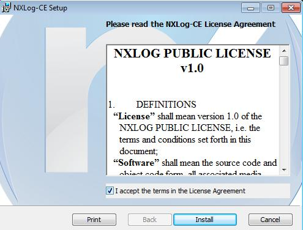
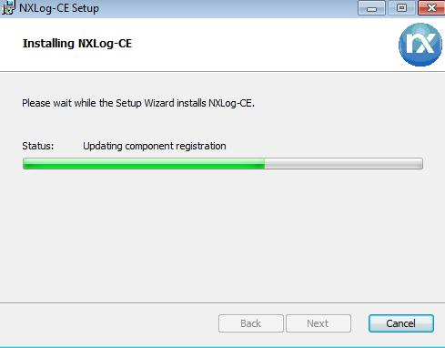
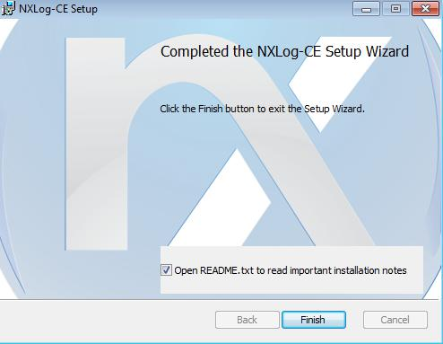
* İlgili yapılandırma yapılmadan önce CA Sunucusu üzerinde oluşturulmuş, “**rootCA.pem**”, “**WIN-IUUCNN7B5MG.crt**” ve “**WIN-IUUCNN7B5MG.key**” dosyaları “**%ROOT%\keys\**” klasörü altına kopyalanır.
* Windows istemcilerde nxlog yapılandırması için Pardus Git reposunda bulunan Rsyslog yapılandırmasını içeren “**windowsclient-nxlog.conf**” (https://git.pardus.org.tr/ahtapot/SOLARIS/blob/development/AhtapotSIEM/Rsyslog-nxlog_config/windowsclient-nxlog.conf) dosyası “**C:\Program Files\nxlog\conf**” dizini içerisinde bulunan “**nxlog.conf**” dosyasına koplayanır. 

```
 ## This is a sample configuration file. See the nxlog reference manual about the
 ## configuration options. It should be installed locally and is also available
 ## online at http://nxlog.org/docs/

 ## Please set the ROOT to the folder your nxlog was installed into,
 ## otherwise it will not start.

 #define ROOT C:\Program Files\nxlog
 define ROOT C:\Program Files (x86)\nxlog

Moduledir %ROOT%\modules
CacheDir %ROOT%\data
Pidfile %ROOT%\data\nxlog.pid
SpoolDir %ROOT%\data
LogFile %ROOT%\data\nxlog.log

<Extension _syslog>
    Module      xm_syslog
</Extension>
	   

<Input in>
    Module im_msvistalog
    Query   <QueryList>\
        <Query Id="0">\
            <Select Path="Security">*</Select>\
            <Select Path="System">*[System/Level=4]</Select>\
            <Select Path="Application">*[Application/Level=2]</Select>\
            <Select Path="Setup">*[System/Level=3]</Select>\
	    <Select Path="Microsoft-Windows-DriverFrameworks-UserMode/Operational">*</Select>\
            <Select Path='Windows PowerShell'>*</Select>\
        </Query>\
    </QueryList>
    ReadFromLast True
</Input>

<Output out>
    Module      om_ssl
    Host        192.168.1.1
    Port        6514
    CAFile      %ROOT%\keys\rootCA.pem
    CertFile    %ROOT%\keys\WIN-IUUCNN7B5MG.crt
    CertKeyFile %ROOT%\keys\WIN-IUUCNN7B5MG.key
    AllowUntrusted   TRUE
#    Exec	to_syslog_bsd(); 
    Exec        to_syslog_snare();
</Output>

<Route 1>
    Path        in => out
</Route>
```

* Windows istemci üzerinde Nxlog konfigurasyonunun tamamlanması ile “**Windows** **Services**” ekranından “**nxlog**” servisi çalıştırılır.
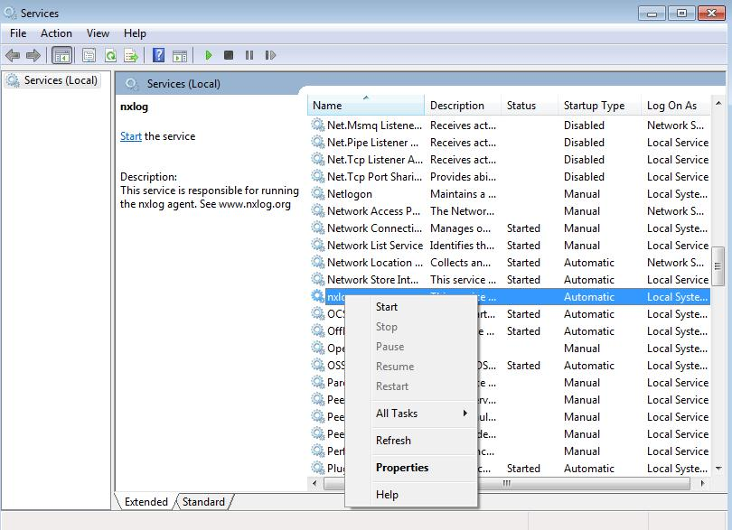
* OSSIM Server ile bağlantı sağlanmaması ve ya bir hata olması durumunda “**C:\Program Files\nxlog\data**” dizini içerisinde “**nxlog.log**” dosyası incelenek tespit edilebilir.

####Tanımlanan İstemcilerden Gelen Logların Gözlemlenmesi
* Windows istemcilerde oluşan hatalı giriş loglarının ossim üzerinde incelenmesi için bir kaç defa kullanıcı şifresi yanlış girilerek olay kayıtları oluşturulur. 
* Ossim web arayüzüne “**https://ossim_sunucu_fqdn**” adresinden bağlanılır.
* “**Analysis**” altında bulunan “**Security** **Events**” sekmesi açılır ve “**search**” kısmına Windows sunucunun ip adresi girilerek sunucudan gelen hatalı giriş kayıtları gözlemlenir. Ossim içerisinde hatalı giriş kayıtları aşağıdaki gibidir.
```
AlienVault HIDS: Logon Failure - Unknown user or bad password.
```
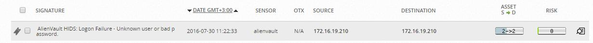
```
AlienVault HIDS: Logon Failure - Unknown user or bad password. Eventinin Datasource IDsi 7085 Event IDsi 18130
```
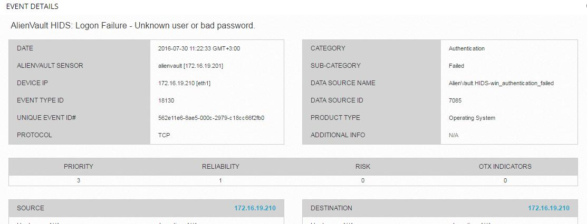

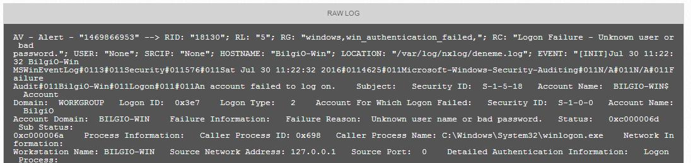

####OSSIM Kolerasyon Kuralı Oluşturulması
* OSSIM içerisinde korelasyon kuralı oluşturulması için menü üzerinde “**Configuration** => **Threat** **Intelligence** => **Directives**” sekmesi açılr.
* Korelasyon kuralları OSSIM içerisinde oluşan olayları birbiri ile ilişkilendirerek ve kural oluşturulurken kurala verilen **priority**, **realibility** ve kuralın tetiklendiği **asset** **değeri** (default olarak 2) birbiri ile çarpılarak ve çarpım sonucunun 25’e bölümünden sonuç **1** değerinin üzerinde ise alarm oluşturulur.
* OSSIM içerisinde oluşan eventler olayı oluşturulan **datasource** **id** ve **event** **id** gibi değerlere sahiptirler. Kurallar oluşturulurken eventleri seçmekte yardımcı bilgilerdir.
* Oluşturulacak kural için senaryo olarak log gönderen client makine üzerine var olmayan bir kullanıcı ile 4 kere “**ssh**” bağlantısı denemesi yapılmalıdır ve daha sonra başarılı bir login gerçekleştirilmelidir.  
* 1. SSH giriş denemesinde 1. kural tetiklenmesinden sonra 60 saniye içerisinde 3 kere daha ssh denemesi yapılırsa 2. Kural tetiklenir. 2. Kural tetiklenmesinden 120 saniye sonra başarılı bir login gerçekleştirilirse 3. Kural oluşur. Her tetiklenen kural için risk değerlendirilmesi yapılarak alarm seviyesi belirlenir.  
* Var olmayan bir kullanıcı ile giriş denemesi ile oluşan eventin bilgileri aşağıdaki gibidir.
```
Datasource ID : 7010
Event ID : 5710
```
* SSH giriş başarılı ise oluşan eventin bilgileri aşağıdaki gibidir.
```
Datasource ID : 7009
Event ID : 5715
```
* “**Directives**” sekmesi içerisinde “**New** **Directive**” seçilerek yeni kural yazılmaya başlanılır.
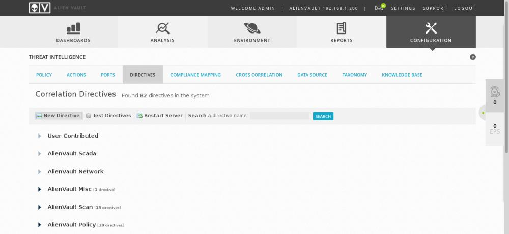
* Oluşturulan yeni directive için isim verilir. **Intent**, **Strategy** ve **Method** belirlenir. Oluşturulan directive için bir **priority** **değeri** verilir. Test amacı ile priority değeri olarak 4 verildi.
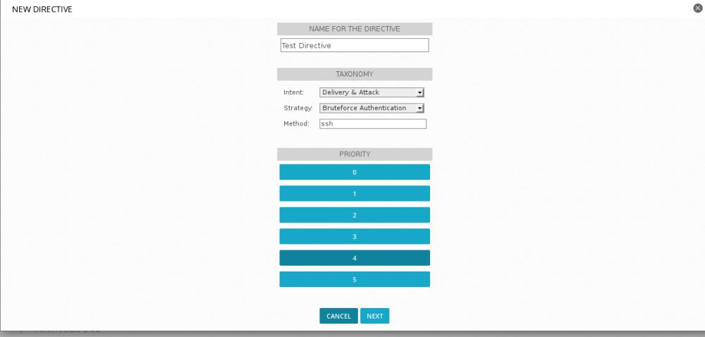
* Oluşturulan directive altında bulunacak 1. Kural için isim verilir. 
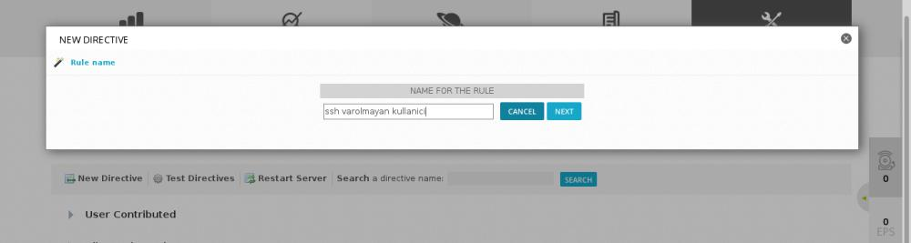
* 1. Kuralın tetiklenmesi için gerekli olan “**datasource** ve “**event**” seçilecektir. Datasource ID si bilindiğinden dolayı search kısmına 7010 yazılarak istenilen datasource seçilir.
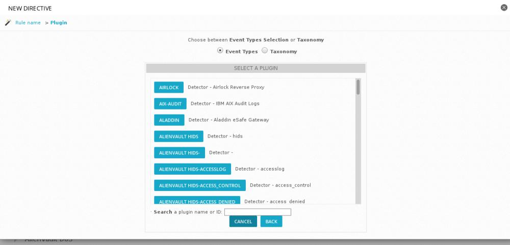


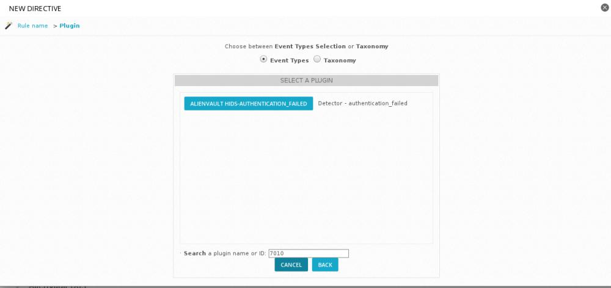

* Datasource seçilmesi ile bu data source içerisindeki hangi event ile kuralın tetiklendiğinin seçilmesi gerekmektedir. **Event** **ID** bilgisi **5710** “**search**” kısmına yazılarak event seçilir.
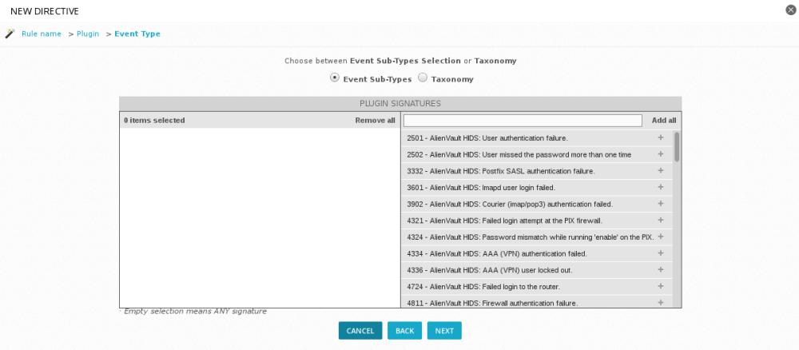
* **Event** **ID** si ile belirlenmesi ile eventin sağ kösesindeki artıya tıklanılarak “**event** **selectedler**” içerisinde girilir.
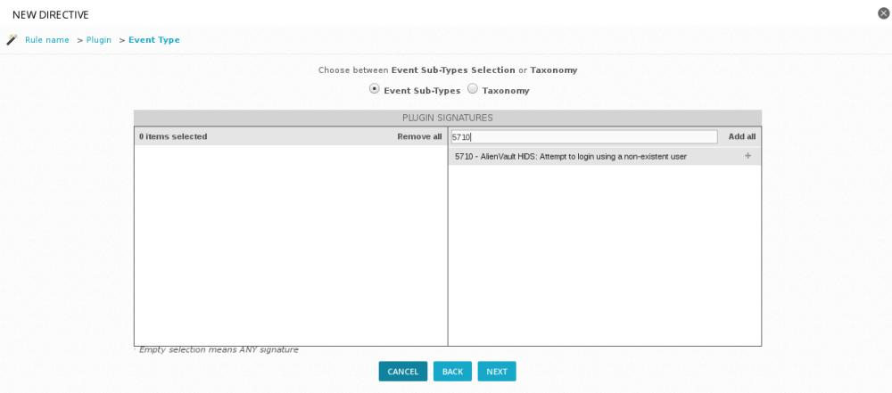
* “**Next**” butonuna basılarak “**source** ve **destination** **IP** **adres**” verilebilir. Bu alanların boş bırakılması ile “**any**” olarak kullannılır. Ve hedef ya da kaynak ne olursa olsun 1.kural tetiklenir.
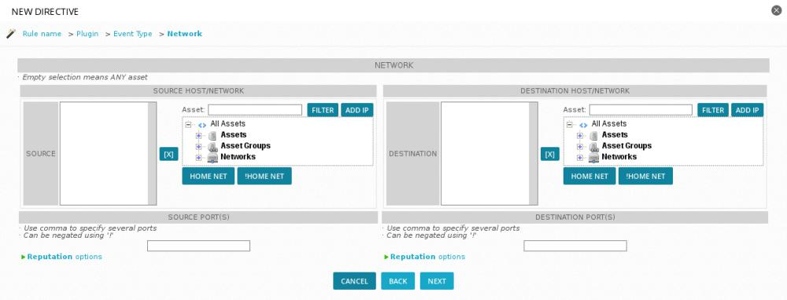
* “**Next**” butonu ile devam edilerek oluşturulan 1. Kuralın **reliability** değeri test olarak 5 verilir. Böylelikle 1. Kural tetiklendiği zaman alarm oluşturabilmesi için risk değerlendirilmesinde bulunulur. Bunun için “**directive** **priority**” değeri **(4)** 1.kural reliability değeri **(5)** Asset değeri **(default** **olarak** **2)** **/** **25** **>1** ise alarm oluşur.
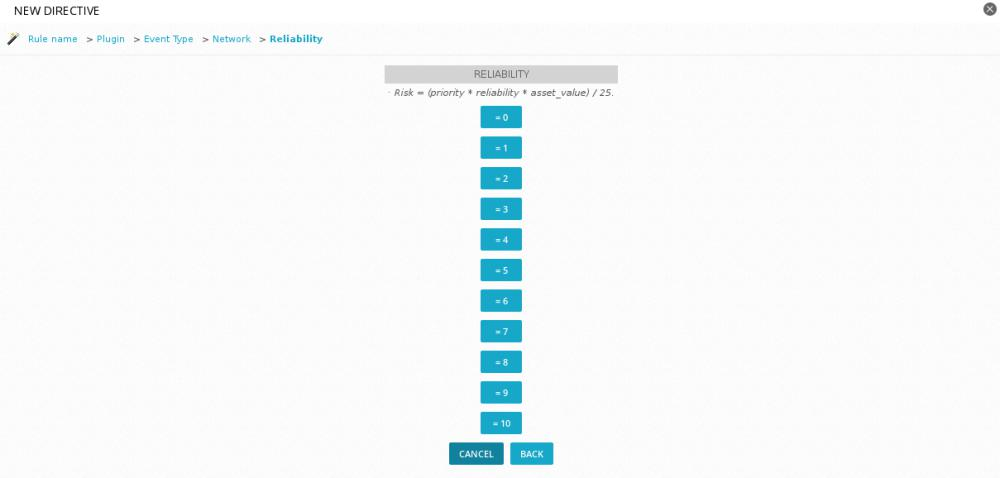
* Reliabilty değeri verilmesiyle açılan yeni sayfada “**finish**” denilerek directive 1. Kuralı oluşturulmuş olur.
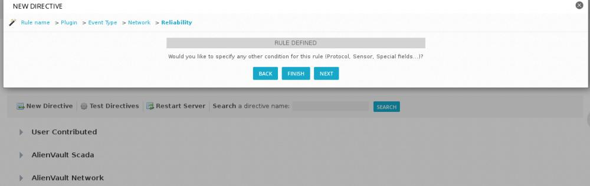
* 1. Kuralın altında 2. Kuralın oluşması için 1. Kuralda “**action**” kısmında “**artı**” işaretine tıklanılarak 2. Kural oluşturulmaya başlanılır.
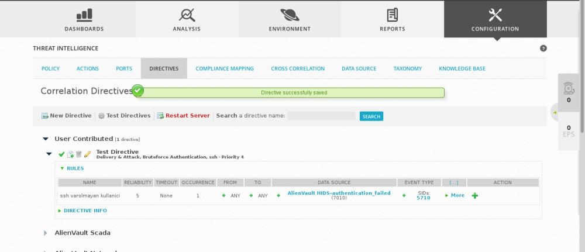
* 2. Kural oluşturulması için kurala isim verilir.
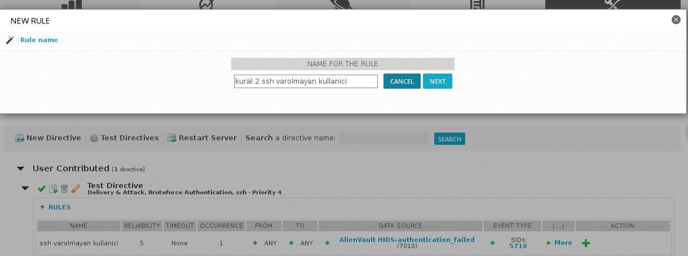
* 2. Kuralın tetiklenmesi için kullanılacak eventin “**datasource** **ID** si ile Datasource seçilir.
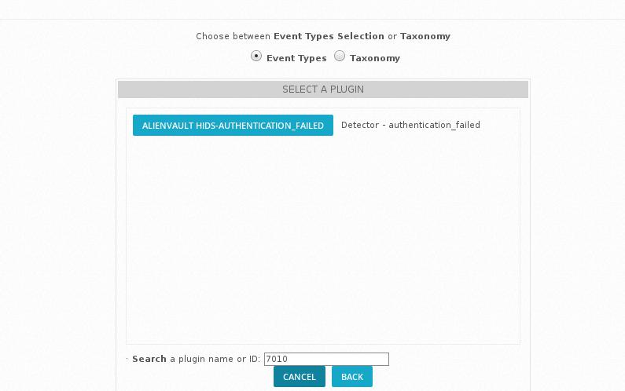
* Datasource içerisinde istenilen **event** **ID** girilerek “**selected** **from** **list**” seçilerek ilerlenilir. Kullanılan event bir önceki kural ile aynı ise event seçilmeden direk “**plugin** **SID** **from** **rule** **of** **level** **1**” tıklanılarak ilerlenilir. 
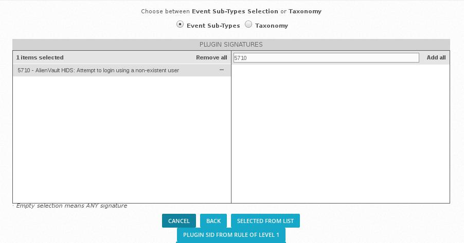
* Destination veya source IP adresi istenilirse verilebilir. Test için burası yine boş bırakılarak any yapılır.
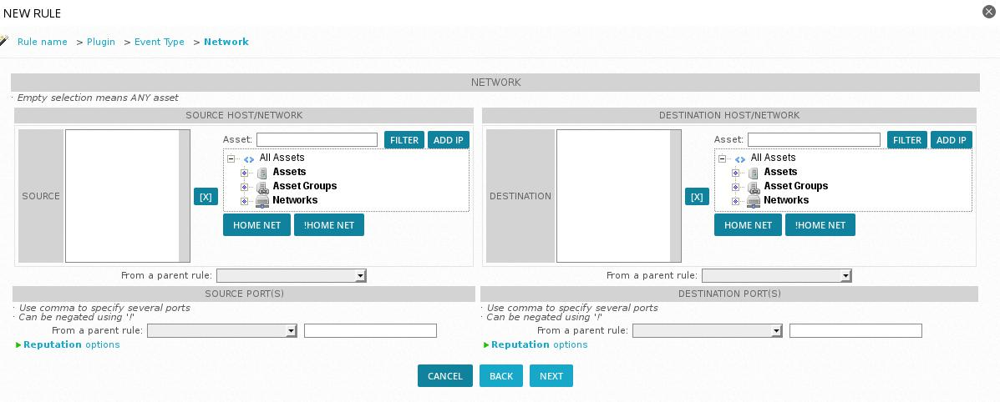
* “**Next**” butonu ile ilerlenerek 2. Kuralın **reliability** değeri belirlenir. Aynı (**=**) sayı seçilirse direk bu kuralın reliability değeri direk verilir yada yüksek  (**+**) sayı seçilerek bir önceki kuralın reliabilty değeri üstüne eklenilerek 2. Kuralın reliability değeri belirlenir.
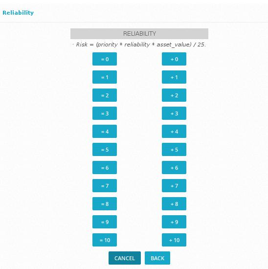
* “**Next**” butonuna tıklanması ile “**finish**” denilerek 2. Kural oluşturulur.
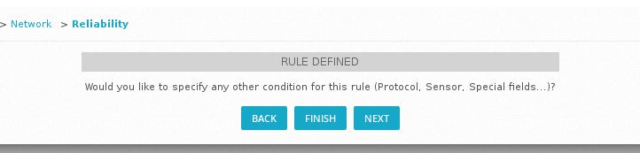

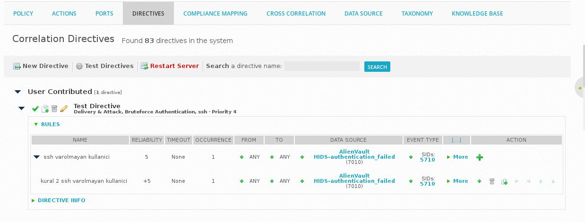

* Oluşturulan 2. Kuralın tetiklenmesinin başlaması için “**Timeout**” değeri verilerek 1. Kural tetiklenemsinden sonra verilen **saniye** içerisinde directive kuralı açık kalarak kuralın tamamlanması beklenilir. Test için değer 60 saniye olarak verilir. “**Occurrence**” değerinde ise bu kuralın tamamlanması için belirlenen eventin kaç kere oluşması istenildiği değeri verilir. Test için değer 4 verilir.   
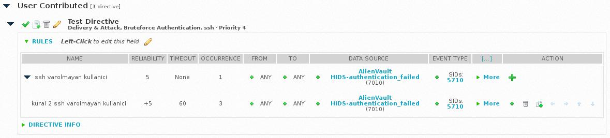
* 3. Kuralın oluşturulması için oluşturulan 2. Kuralın “**action**” bölümü içerisinde **artı** butonuna basılır. Oluşturulmak istenilen 3. Kural için isim verilir.
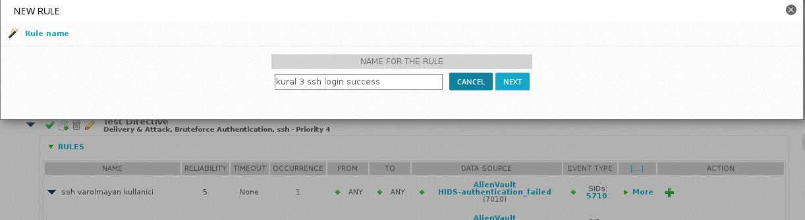
* 3. Kuralın tetiklenmesi için kullanılacak eventin “**datasource** **ID**” si girilerek seçilir. Test için ssh login success eventi kullanılacağından dolayı **Datasource** **ID** si **7009** **event** **ID** si **5715** olacak şekilde kullanılacaktır.
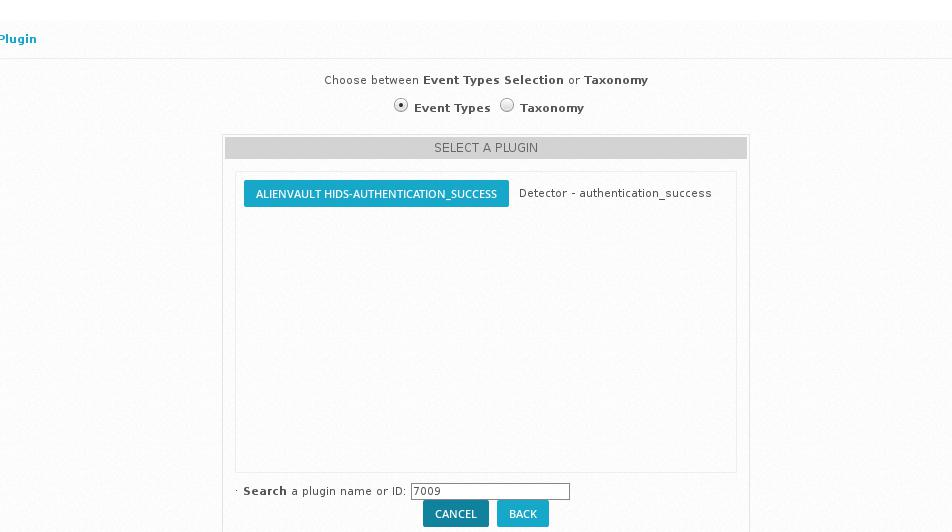
* Datasource seçilmesiyle kullanılacak eventin ID si seçilerek (5715) “**selected** **from** **list**” butonu ile devam edilir.
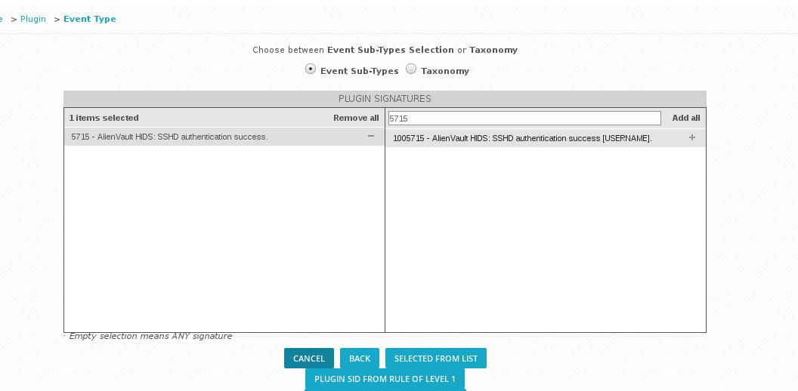
* Destination veya source IP adresi istenilirse verilebilir. Test için burası yine boş bırakılarak any yapılır.
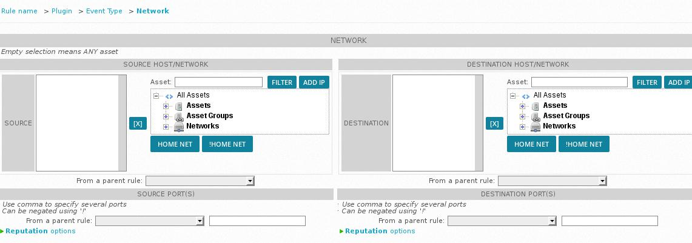
* 3. Kural için istenilen **reliability** değeri verilerek oluşan alarmın risk seviyesi hesaplanması sağlanılır. Test olarak +5 seçilerek bir önceki kuralın realibility değeri üzerine eklenilir.  
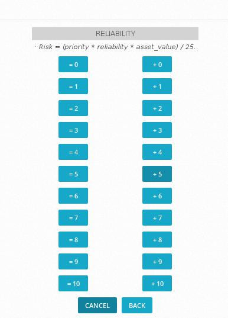
* Reliability değeri seçilmesiyle açılan sayfada “**finish**” denilerek 3. Kuralın oluşturulması sağlanılır.
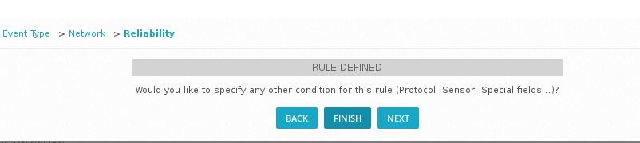
* 2. Kural oluştuktan sonra 3. Kuralın tetiklenmesi için gerekli zamanın sayırması için “**time** **out**” değeri  120 saniye olarak verilir. “**Occurance**” değeri ise 1 olarak verilir.
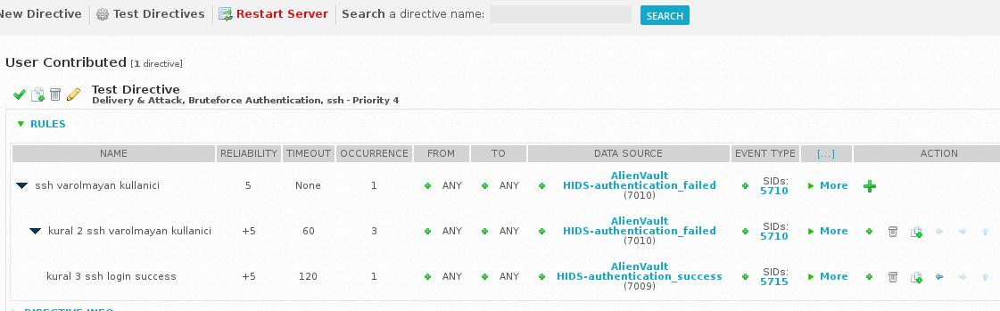
* Oluşturulan directive in aktif edilmesi için “**restart** **server**” üzerine gelinerek tıklanılır.  “**Yes**” seçeneği seçilerek server yeniden başlatılır.
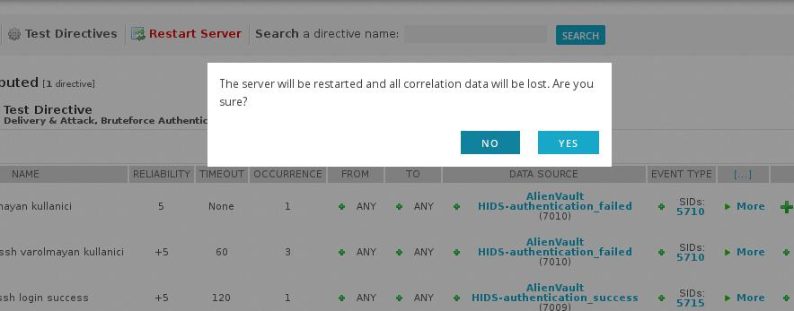
* Oluşturulan korelasyonun test edilmesi için loglarını ossim makinesine gönderen bir linux client kullanılabilir. Test olarak IP adresi 172.16.19.20 olan ve loglarını ossime gönderen clienta ansible makinesi üzerinde olmayan test kullanıcısı ile login denemesinde bulunulur.
Seçilen linux clienta ssh ile olmayan bir kullanıcı ismi ile 1 lere login denemesi yapılır.
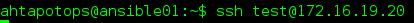
* 1 kere olamayan kullanıcı ile login denemesi yapıldığında oluşturulan directive 1. Kuralı tetiklenir. Ve directive priority(4)*1.kural realibility(5)* asset value(2)/25 =40/25=1.6  1den yüksek olduğundan dolayı alarm oluşturur. Oluşan alarmı görebilmek için ossim menu içerisinde **Analysis** altında bulunan **Alarms** sekmesi açılarak 1. Kuralın tetiklenmesi ile oluşan alarm ver risk değeri gözlemlenir.  Risk değeri hesaplamaya göre 1 olarak gözlemlenir. Ve alarmın sol tarafında saniyeleri saymaya başlayarak 2. Kural tetikleyen eventleri beklemeye başlar.
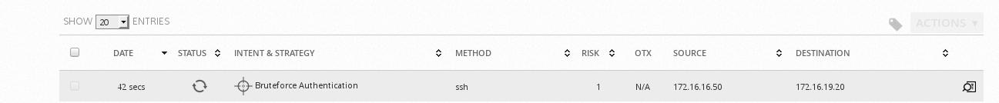
* 2. Kural için 3 kere daha varolamayan user ile ssh login denemesinde bulunulur. Risk değeri olarak directive priority(4)*2.kural realibility(5+5)* asset value(2)/25=3.2 Oluşan alarm ossim menusu içerisinde alarms içerisinde risk değeri 3 olarak gözlemlenir. Ve 3. Kuralın tetiklenmesi sağlayan event için 120 saniye yine beklemeye başlar. Oluşan alarmın üstüne gelinip tıklanılınca total event olarak 1. Kural ve 2. Kuralın tetiklenmesini sağlayan event sayısı verilir.
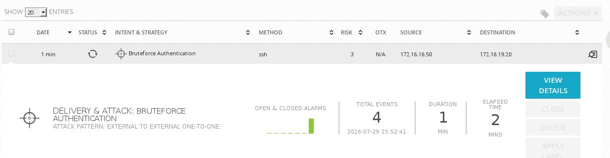
* 3. Kural için ssh ile login olunur. 
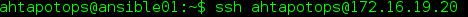
* Risk değeri directive priority(4)*3.kural realibility(10)* asset value(2)/25=3.2 (reliability değeri en fazla 10 olmaktadır)Oluşan alarm ossim alarms menu içerisine risk değeri 3 olarak gözlemlenir. Ve başka bir kural olmadığından dolayı alarm closed olur dinlemeyi bırakır. Oluşan alarmın üstüne gelinip tıklanılınca total event olarak 1. 2. Ve 3. Kuralın tetiklenmesini sağlayan event sayısı verilir.
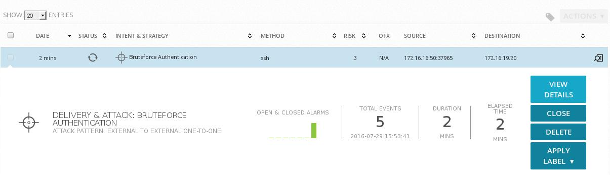
* Alarm tıklandığında “**view** **details**” tıklanılarak directive i tetikleyen event bilgilere ve korelasyon kurallarının level bilgilerine ulaşılabilinmektedir.


####Bütünlük Kontrolünün Yapılması
* Bütünlük kontorünün yapılması için OSSEC agentı kurularak “**integrity** **check**” özelliği kullanılır. 
* Ossec agent tar.gz dosyası wget ile istenilen client içerisine indirilir. Aşağıdaki komutlar çalıştırılarak agent kurulumu başlatılır ve kurulum sırasında sorulan sorular aşağıdaki gibi yanıtlanır.
```
ahtapotops@testclient:~$ wget https://bintray.com/artifact/download/ossec/ossec-hids/ossec-hids-2.8.3.tar.gz
ahtapotops@testclient:~$ sudo su
root@testclient:/home/ahtapotops# tar xvf ossec-hids-2.8.3.tar.gz
root@testclient:/home/ahtapotops# cd ossec-hids-2.8.3
root@testclient:/home/ahtapotops/ossec-hids-2.8.3# ./install.sh

  ** Para instalação em português, escolha [br].
  ** 要使用中文进行安装, 请选择 [cn].
  ** Fur eine deutsche Installation wohlen Sie [de].
  ** Για εγκατάσταση στα Ελληνικά, επιλέξτε [el].
  ** For installation in English, choose [en].
  ** Para instalar en Español , eliga [es].
  ** Pour une installation en français, choisissez [fr]
  ** A Magyar nyelvű telepítéshez válassza [hu].
  ** Per l'installazione in Italiano, scegli [it].
  ** 日本語でインストールします．選択して下さい．[jp].
  ** Voor installatie in het Nederlands, kies [nl].
  ** Aby instalować w języku Polskim, wybierz [pl].
  ** Для инструкций по установке на русском ,введите [ru].
  ** Za instalaciju na srpskom, izaberi [sr].
  ** Türkçe kurulum için seçin [tr].
  (en/br/cn/de/el/es/fr/hu/it/jp/nl/pl/ru/sr/tr) [en]: en

1- What kind of installation do you want (server, agent, local, hybrid or help)? agent
  - Agent(client) installation chosen.
2- Setting up the installation environment.
 - Choose where to install the OSSEC HIDS [/var/ossec]:
    - Installation will be made at  /var/ossec .
3- Configuring the OSSEC HIDS.
  3.1- What's the IP Address or hostname of the OSSEC HIDS server?: 172.16.19.207
  3.2- Do you want to run the integrity check daemon? (y/n) [y]: y
   - Running syscheck (integrity check daemon).
  3.3- Do you want to run the rootkit detection engine? (y/n) [y]:
   - Running rootcheck (rootkit detection).
  3.4 - Do you want to enable active response? (y/n) [y]: n
   - Active response disabled.
```
* Ossec agent kurulmasıyla beraber agent ile server birbiri ile bağlanılır.
* Ossec Server olarak clientlar ossim makinesine bağlanacağından dolayı ossim makinesine bağlanılarak anahtar alışverişinde bulunulur. Ossim içerisinde “**manage_agents**” çalıştırılarak “**Add** **agent**” ile yeni agent bilgileri server içerisine yazılır. 
```
root@ossimcik02:~# /var/ossec/bin/manage_agents
****************************************
* OSSEC HIDS v2.8 Agent manager.    *
* The following options are available: *
****************************************
   (A)dd an agent (A).
   (E)xtract key for an agent (E).
   (L)ist already added agents (L).
   (R)emove an agent (R).
   (Q)uit.
Choose your action: A,E,L,R or Q: A

   * A name for the new agent: testclient
   * The IP Address of the new agent: 172.16.19.20
   * An ID for the new agent[002]: 002
Agent information:
   ID:002
   Name:testclient
   IP Address:172.16.19.20

Confirm adding it?(y/n): y
Daha sonra E)xtract key for an agent  seçilerek ossec server agent için key oluşturur.
Choose your action: A,E,L,R or Q: E

   ID: 002, Name: testclient, IP: 172.16.19.20
Provide the ID of the agent to extract the key (or '\q' to quit): 002

Agent key information for '002' is:
MDAyIHRlc3RjbGllbnQgMTcyLjE2LjE5LjIwIDU4ZDUwYTg5MmYwM2FjYzg5MmM4MDk3YzlmNmU1NjZhMmI0NWIyYzQxMTFiZjAyMDA5YzIyNzFkZTBkODUzNDA=
```
* Oluşturulan anahtar ossec agent kurulan testclient içerisine yapıştırılır.
```
root@testclient:~# /var/ossec/bin/manage_agents

****************************************
* OSSEC HIDS v2.8.3 Agent manager.  *
* The following options are available: *
****************************************
   (I)mport key from the server (I).
   (Q)uit.
Choose your action: I or Q: I
Paste it here (or '\q' to quit): MDAyIHRlc3RjbGllbnQgMTcyLjE2LjE5LjIwIDU4ZDUwYTg5MmYwM2FjYzg5MmM4MDk3YzlmNmU1NjZhMmI0NWIyYzQxMTFiZjAyMDA5YzIyNzFkZTBkODUzNDA=

Agent information:
   ID:002
   Name:testclient
   IP Address:172.16.19.20
Confirm adding it?(y/n): y
Added.
** Press ENTER to return to the main menu.
```
* Aşağıdaki komut ile test makinası üzerindeki Ossec servisi yeniden başlatılarak
 agentin servera bağlanması sağlanılır.
```
root@testclient:~# /var/ossec/bin/ossec-control restart
```
* Ossec agentlarda integrity check yapılması istenilen dosyalar “**/var/ossec/etc/ossec.conf**” dosyası içerisine yazılmaktadır. Ön tanımlı olarak ossec aşağıdaki dosyalarda, 22 saatte bir syscheck yapmaktadır. Test için gerekli değişiklikleri görebilinmesi için “**syscheck** **frequency**” **600** yapılarak 10 dakikada bir syscheck yapılması sağlanılır.
```
root@testclient:~# vi /var/ossec/etc/ossec.conf
    <frequency>600</frequency>
<alert_new_files>yes</alert_new_files>
    <!-- Directories to check  (perform all possible verifications) -->
    <directories check_all="yes">/etc,/usr/bin,/usr/sbin</directories>
    <directories check_all="yes">/bin,/sbin</directories>
<directories check_all="yes">/home/ahtapotops</directories>
```
* Ossec ile sadece rootkit ve syscheck logları alınacağından dolayı "**/var/ossec/etc/ossec.conf**" dosyası içerisinde "**localfile**" yazılı aşağıdaki satırla silinmelidir.
```
  <localfile>
    <log_format>syslog</log_format>
    <location>/var/log/messages</location>
  </localfile>
  <localfile>
    <log_format>syslog</log_format>
    <location>/var/log/auth.log</location>
  </localfile>
  <localfile>
    <log_format>syslog</log_format>
    <location>/var/log/syslog</location>
  </localfile>
  <localfile>
    <log_format>syslog</log_format>
    <location>/var/log/dpkg.log</location>
  </localfile>
  <localfile>
    <log_format>syslog</log_format>
    <location>/var/log/vmware/hostd.log</location>
  </localfile>
  <localfile>
    <log_format>apache</log_format>
    <location>/var/log/apache2/error.log</location>
  </localfile>
  <localfile>
    <log_format>apache</log_format>
    <location>/var/log/apache2/access.log</location>
  </localfile>
  <localfile>
    <log_format>command</log_format>
    <command>df -h</command>
  </localfile>
  <localfile>
    <log_format>full_command</log_format>
    <command>netstat -tan |grep LISTEN |grep -v 127.0.0.1 | sort</command>
  </localfile>
  <localfile>
    <log_format>full_command</log_format>
    <command>last -n 5</command>
  </localfile>
``` 
* Ossec agentın “**ossec.conf**” içerisinde değişiklik yapıldığından dolayı istemci üzerinde ossec servisi yeniden başlatılır. 
```
root@testclient:~# /var/ossec/bin/ossec-control restart
```
* Test için öntanımlı olarak verilen dizinlerin içinde bir değişiklik yapılarak oluşan olayın ossim içerisinde gözlenmesi sağlanılır. Ossec yeniden başlatıldıktan sonra 10 dakika kadar beklenilerek, kontrol edilmesi istenilen dosyaların hashlerini alması beklenilir. Hashlerin alınmasıyla beraber  Testclient “**/etc/hosts**” dosyası içerisine girilerek dosyada değişiklik yapılır.
* Ossec syscheck 10 dakika içerisinde yeniden başlayarak dosyaların hashlerini alır ve daha önceki hash ile karşılaştırarak değişikliği tespit ederek ossec içerisinde alarm oluşturur. Ossec ile oluşan alarm ossim içerisine ulaşarak event olarak karşımıza çıkar.
* Ossim içerisinde oluşan eventi görebilmek için ossim web arayüzü açılır. Ossim menü içerisinde “**Analysis**” seçeneği altından “**Security** **Events** **(SIEM)**” sekmesi açılır. Açılan sayfa içerisnde “**search**” içerisine testclient hostunun ip adresi yazılır. 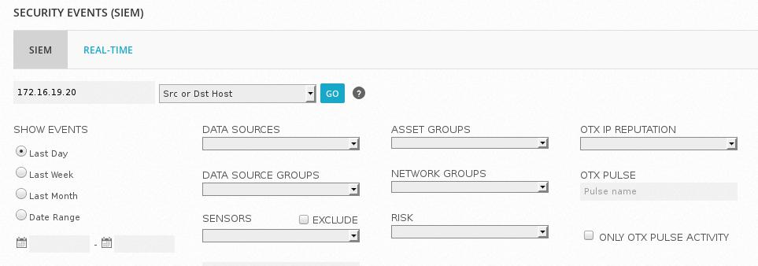
* Arama sonucunda sayfanın alt kısmında Testclient hostu ile ilişkili eventlerin listesi görüntülenir.
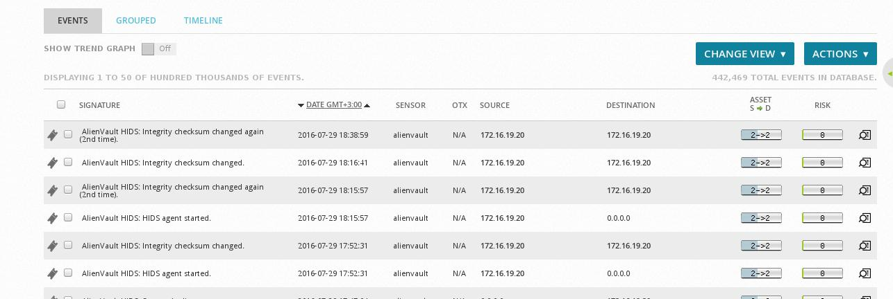
* Eventler arasında “**AlienVault HIDS: Integrity checksum changed.**” Eventi syscheck ile etc/host dosyasındaki değişikliklerin tespit edilmesiyle oluşan eventtir. Event tıklanması ile eventin ayrıntı bilgilerini gösteren sayfa açılmaktadır. Açılan sayfasını alt kısımlarına gelinmesi ile hangi dosyada değişiklik olduğu, alınan eski ve yeni hash değerlerinin bilgilerine ulaşılabilinmektedir.
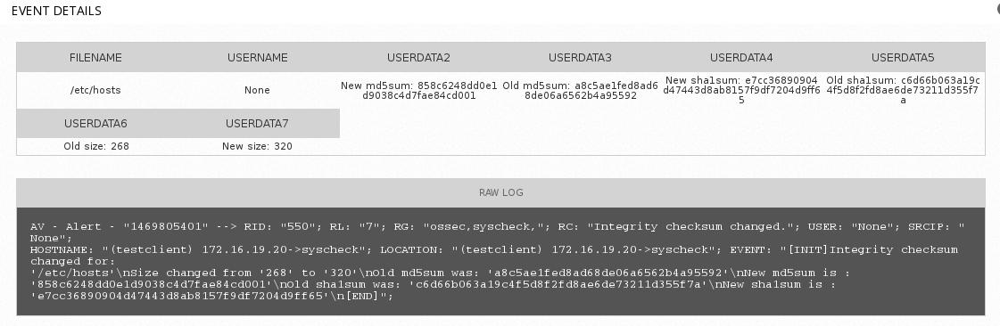

####Dosya Değişikliklerinde Alarm Üretilmesi

* Ossec agent tar.gz dosyası wget ile istenilen client içerisine indirilir. Aşağıdaki komutlar çalıştırılarak agent kurulumu başlatılır ve kurulum sırasında sorulan sorular aşağıdaki gibi yanıtlanır.
```
ahtapotops@testclient:~$ wget https://bintray.com/artifact/download/ossec/ossec-hids/ossec-hids-2.8.3.tar.gz
ahtapotops@testclient:~$ sudo su
root@testclient:/home/ahtapotops# tar xvf ossec-hids-2.8.3.tar.gz
root@testclient:/home/ahtapotops# cd ossec-hids-2.8.3
root@testclient:/home/ahtapotops/ossec-hids-2.8.3# ./install.sh

  ** Para instalação em português, escolha [br].
  ** 要使用中文进行安装, 请选择 [cn].
  ** Fur eine deutsche Installation wohlen Sie [de].
  ** Για εγκατάσταση στα Ελληνικά, επιλέξτε [el].
  ** For installation in English, choose [en].
  ** Para instalar en Español , eliga [es].
  ** Pour une installation en français, choisissez [fr]
  ** A Magyar nyelvű telepítéshez válassza [hu].
  ** Per l'installazione in Italiano, scegli [it].
  ** 日本語でインストールします．選択して下さい．[jp].
  ** Voor installatie in het Nederlands, kies [nl].
  ** Aby instalować w języku Polskim, wybierz [pl].
  ** Для инструкций по установке на русском ,введите [ru].
  ** Za instalaciju na srpskom, izaberi [sr].
  ** Türkçe kurulum için seçin [tr].
  (en/br/cn/de/el/es/fr/hu/it/jp/nl/pl/ru/sr/tr) [en]: en

1- What kind of installation do you want (server, agent, local, hybrid or help)? agent
  - Agent(client) installation chosen.
2- Setting up the installation environment.
 - Choose where to install the OSSEC HIDS [/var/ossec]:
    - Installation will be made at  /var/ossec .
3- Configuring the OSSEC HIDS.
  3.1- What's the IP Address or hostname of the OSSEC HIDS server?: 172.16.19.207
  3.2- Do you want to run the integrity check daemon? (y/n) [y]: y
   - Running syscheck (integrity check daemon).
  3.3- Do you want to run the rootkit detection engine? (y/n) [y]:
   - Running rootcheck (rootkit detection).
  3.4 - Do you want to enable active response? (y/n) [y]: n
   - Active response disabled.
```
* Ossec agent kurulmasıyla beraber agent ile server birbiri ile bağlanılır.
* Ossec Server olarak clientlar ossim makinesine bağlanacağından dolayı ossim makinesine bağlanılarak anahtar alışverişinde bulunulur. Ossim içerisinde “**manage_agents**” çalıştırılarak “**Add** **agent**” ile yeni agent bilgileri server içerisine yazılır. 
```
root@ossimcik02:~# /var/ossec/bin/manage_agents
****************************************
* OSSEC HIDS v2.8 Agent manager.    *
* The following options are available: *
****************************************
   (A)dd an agent (A).
   (E)xtract key for an agent (E).
   (L)ist already added agents (L).
   (R)emove an agent (R).
   (Q)uit.
Choose your action: A,E,L,R or Q: A

   * A name for the new agent: testclient
   * The IP Address of the new agent: 172.16.19.20
   * An ID for the new agent[002]: 002
Agent information:
   ID:002
   Name:testclient
   IP Address:172.16.19.20

Confirm adding it?(y/n): y
Daha sonra E)xtract key for an agent  seçilerek ossec server agent için key oluşturur.
Choose your action: A,E,L,R or Q: E

   ID: 002, Name: testclient, IP: 172.16.19.20
Provide the ID of the agent to extract the key (or '\q' to quit): 002

Agent key information for '002' is:
MDAyIHRlc3RjbGllbnQgMTcyLjE2LjE5LjIwIDU4ZDUwYTg5MmYwM2FjYzg5MmM4MDk3YzlmNmU1NjZhMmI0NWIyYzQxMTFiZjAyMDA5YzIyNzFkZTBkODUzNDA=
```
* Oluşturulan anahtar ossec agent kurulan testclient içerisine yapıştırılır.
```
root@testclient:~# /var/ossec/bin/manage_agents

****************************************
* OSSEC HIDS v2.8.3 Agent manager.  *
* The following options are available: *
****************************************
   (I)mport key from the server (I).
   (Q)uit.
Choose your action: I or Q: I
Paste it here (or '\q' to quit): MDAyIHRlc3RjbGllbnQgMTcyLjE2LjE5LjIwIDU4ZDUwYTg5MmYwM2FjYzg5MmM4MDk3YzlmNmU1NjZhMmI0NWIyYzQxMTFiZjAyMDA5YzIyNzFkZTBkODUzNDA=

Agent information:
   ID:002
   Name:testclient
   IP Address:172.16.19.20
Confirm adding it?(y/n): y
Added.
** Press ENTER to return to the main menu.
```
* Aşağıdaki komut ile test makinası üzerindeki Ossec servisi yeniden başlatılarak
 agentin servera bağlanması sağlanılır.
```
root@testclient:~# /var/ossec/bin/ossec-control restart
```
* Ossec agentlarda integrity check yapılması istenilen dosyalar “**/var/ossec/etc/ossec.conf**” dosyası içerisine yazılmaktadır. Ön tanımlı olarak ossec aşağıdaki dosyalarda, 22 saatte bir syscheck yapmaktadır. Test için gerekli değişiklikleri görebilinmesi için “**syscheck** **frequency**” **600** yapılarak 10 dakikada bir syscheck yapılması sağlanılır. “**directories check_all="yes"**” parametresine  syscheck takibi yapılması amacyla /home/ahtapotops dizini eklenir.
```
root@testclient:~# vi /var/ossec/etc/ossec.conf
    <frequency>600</frequency>
<alert_new_files>yes</alert_new_files>
    <!-- Directories to check  (perform all possible verifications) -->
<directories check_all="yes">/home/ahtapotops</directories>
```
* Ossec agentın “**ossec.conf**” içerisinde değişiklik yapıldığından dolayı istemci üzerinde ossec servisi yeniden başlatılır. 
```
root@testclient:~# /var/ossec/bin/ossec-control restart
```
* Test olarak kritik dosya olarak belirlenen /home/ahtapotops dosyası içerisine bir text dosyası eklenir. Ve syscheck işleminin yapılması için 10 dakika kadar beklenerek eventin oluşması gözlemlenir.
* “**Analysis**” seçeneği altındaki “**Security Events (SIEM)**” sekmesi açılır. Açılan sayfa içerisinde “**search**” bölümüne testclient hostunun ip adresi yazılır. Sayfanın alt kısmında  syscheck yapılan dizin içerisine yeni bir dosya eklenildiğinden dolayı “**AlienVault HIDS: File added to the system**” eventi oluştuğu gözlemlenir.

* Event üzerine tıklanılarak ayrıntılı olarak event bilgilerinin gözlemdiği sayfa açılır ve sayfanın alt kısımlarına gelerek oluşturulan dosyanın adına ulaşılır.
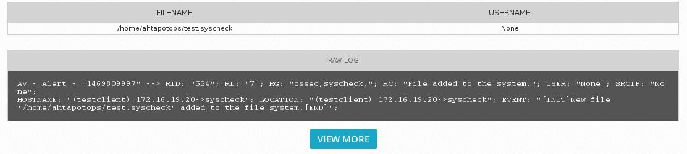

####OpenVAS ile Açıklık Tarama/Analiz Yapılması
* OSSIM içerisinde mevcut bulunan OpenVAS ile tanımlanan sistemler üzerinde açıklık tarama/analiz işlemleri yapılabilmektedir.
* Assetler seçilerek tarama işlemi yapılması için, OSSIM yeni kurulumundan sonra OSSIM içerisine Asset eklenmelidir.
* OSSIM Asset eklemek için OSSIM içerisinde Asset oluşturmak için menü içerisinde
“**ENVIROMENT**” altından “**Assets** **&** **Groups**” sekmesi açılır.
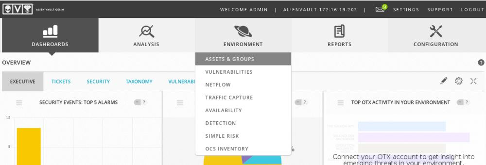
* Açılan sayfada “**ADD ASSET**” butonuna basılırak “**add host**” seçeneği seçilir.
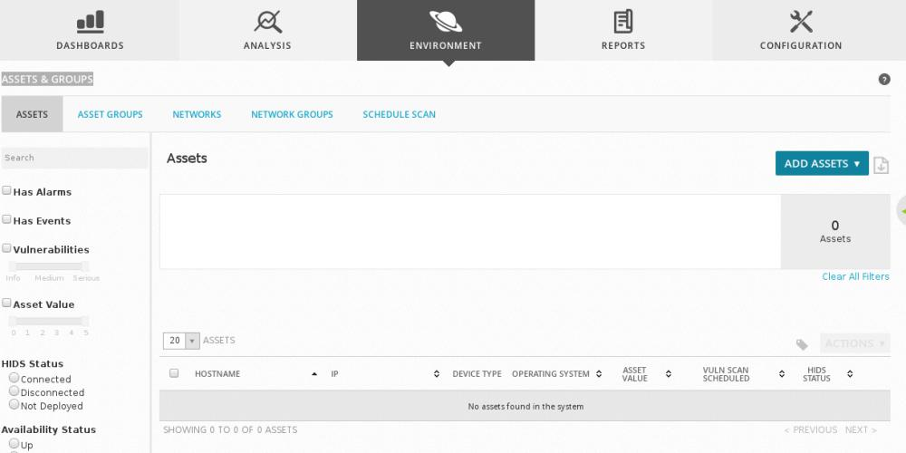
* İlgili ekranda tarama yapılacak sunucunun adı ve IP adresi girilerek “**save**” butonuna basılır.
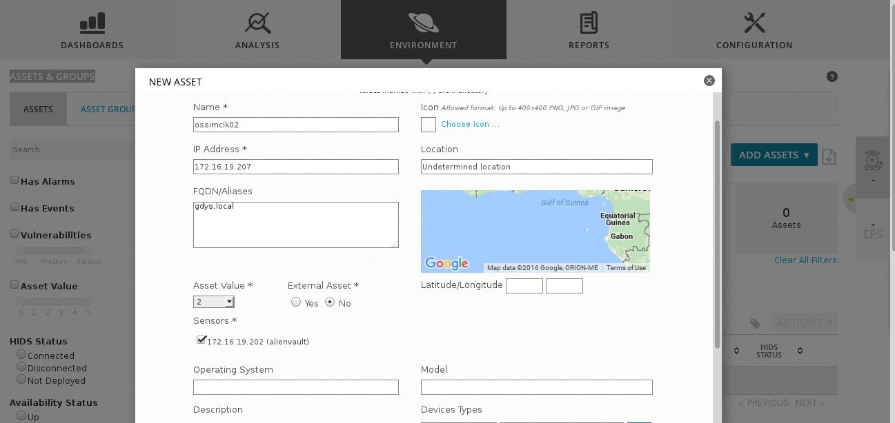
* Asset ekleme işlemi tamamlandıktan sonra açıklık taraması yapmak için, OSSIM web arayüzünde bulunan menü sekmelerinden “**ENVIRONMENT**” altından “**Vulnerabilities**” sayfasına ulaşılır.
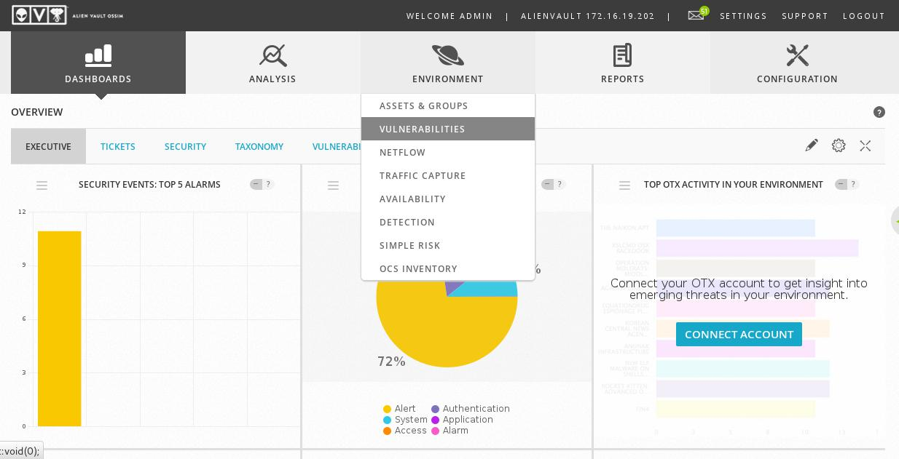
* “**Vulnerabilities**” sayfasında sağ köşede bulunan “**setting**” butonuna basılarak tarama sırasında bağlantı için kullanılacak bilgileri oluşturmak amacı ile “**credentials**” formu çıkmaktadır.
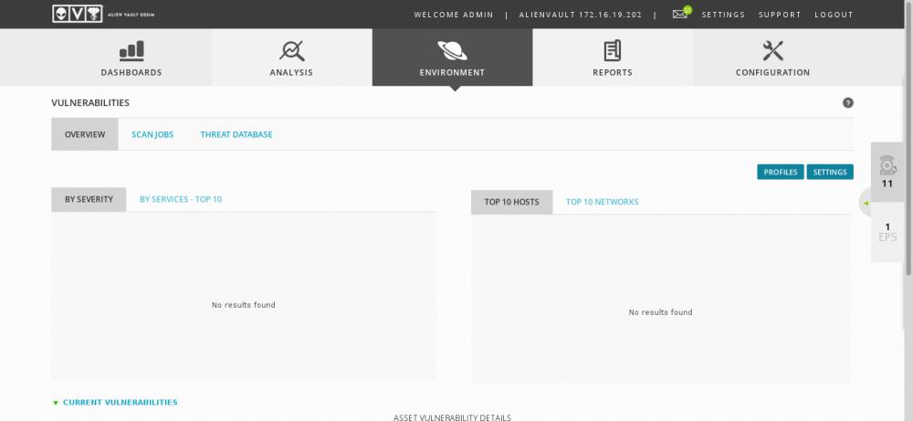
*  Form içerisinde kullanıcı adı ve şifresi verilerek kaydedilir. 
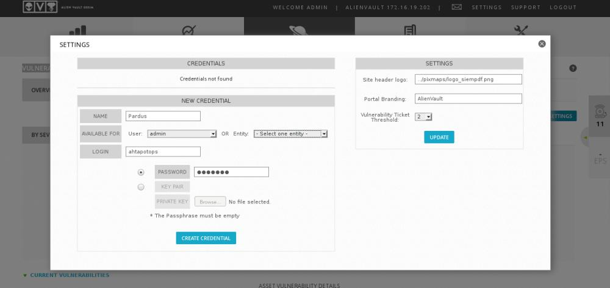

* Kaydetme başarılı olduktan sonra sayfanın sol tarafında “**credentials**” içerisinde oluşturulan yeni bir kayıt belirmektedir. 
* “**Action**” altında **kırmızı kalemin** bulunduğu butona basılarak oluşturulan giriş bilgilerinin doğruluğu kontrol edilir.
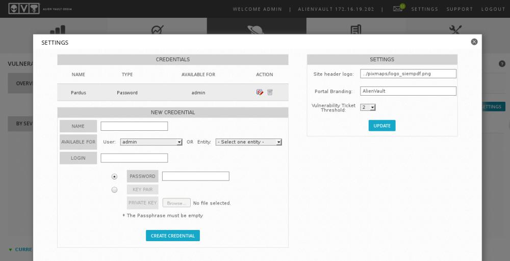
* Açılan sayfada host IP adresi yazılarak bağlantı kontrol edilir. 
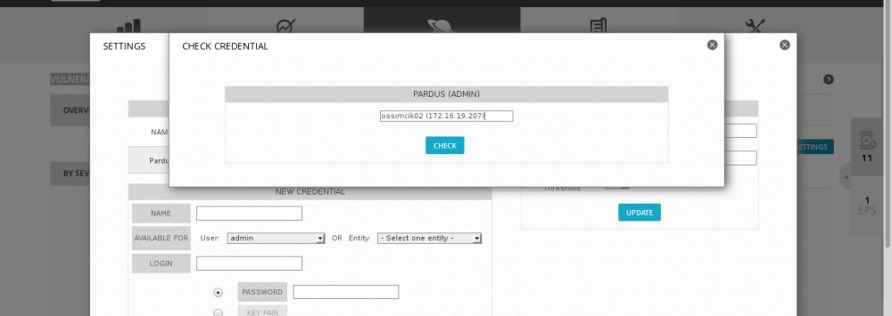
* Başarılı giriş gözlenmesi ile isteğe bağlı olarak tarama sırasında giriş bilgileri verilerek belirli bir kullanıcı hakları ile tarama yapılması sağlanabilir.
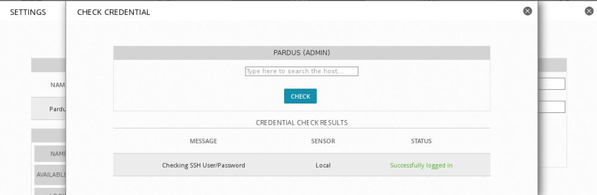
* “**Credentials**” tanımlanması yapılması ile sol köşede bulunan çarpı tıklanılaran vulnerabilities sekmesine geri dönülür. 
* Açıklık tarama işlemine başlanılması için “**Vulnerabilities**” sayfası üzerinde “**SCAN** **JOBS**” seçeneği seçilir.
* Sol köşede bulunan “**NEW** **SCAN** **JOB**” seçilir. Açılan sayfa ile yeni bir tarama gerçekleştirilmesi için gerekli “**Create** **Scan** **Job**” formu doldurulur.
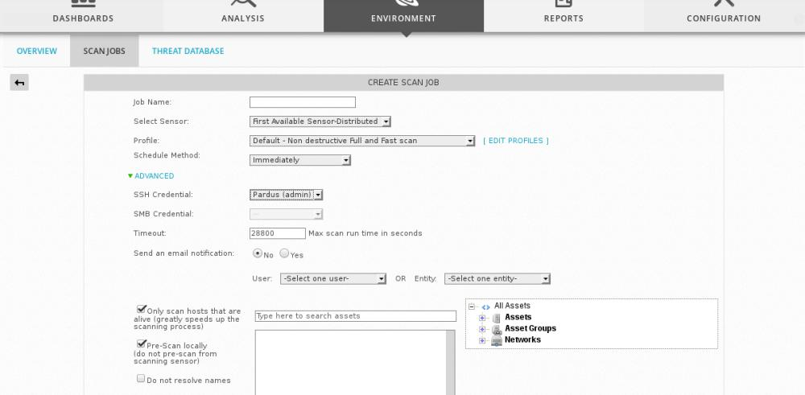
  * **Job name**	- Taramanın adı girilir.
  * **Profile**	- Taramanın çeşidi seçilir. 3 çeşit tarama tanımlanabilmektedir.
    * **Deep**	 - Non destructive Full and Slow scan	
    * **Default**	 - Non destructive Full and Fast scan	
    * **Ultimate**	 - Full and Fast scan including Destructive tests
  * **Schedule Method**: Taramanın periyodik olarak ne sıklıkla yapılacağı veya ne zaman yapılması istenildiği girilir.
    * **Immediately**: Taramanın Anında yapılması için seçilir.
    * **Run Once**: Bir kere tarama yapılması için seçilir. Tarama yapılması istenilen gün ve zaman girilir.
    * **Daily**: Günlük olarak tarma yapılması için seçilir. Başlangıç günü, frequency olarak kaç günde bir tarama yapılması ve tarama saati seçilir.
    * **Day** **of** **the** **Week**: Haftada bir kere belirlenen günde ve saatte tarama yapılması için seçilir. Başlangıç günü, haftanın hangi günü olması istenildiği, frequency olarak kaç haftada bir yapılması istenildiği ve tarama saati seçilir.
    * **Day** **of** **the** **Month**: Ayın belirlenen gününde tarama yapılması için seçilir. Başlangıç günü, ayın hangi günü tarama yapılması istenildiği ve tarama saati girilir.
    * **Nth** **week** **of** **the** **Month**: Ayın belirlenen haftasında tarama yapılması için seçilir. Başlangıç günü, haftanın günü, belirlenen aydaki taramanın yapılması istenilen hafta ve zaman girilir.
* Belirli/yetkili bir kullanıcı bilgileri ile tarama yapılmak isteniyor ise, “**ADVANCED**” sekmesinden giriş bilgileri verilerek açıklık taraması yapılabilmektedir. Yetkili kullanıcı bilgisi oluşturulan credentials seçilerek **ssh** veya **smb** ile yapılabilmektedir.
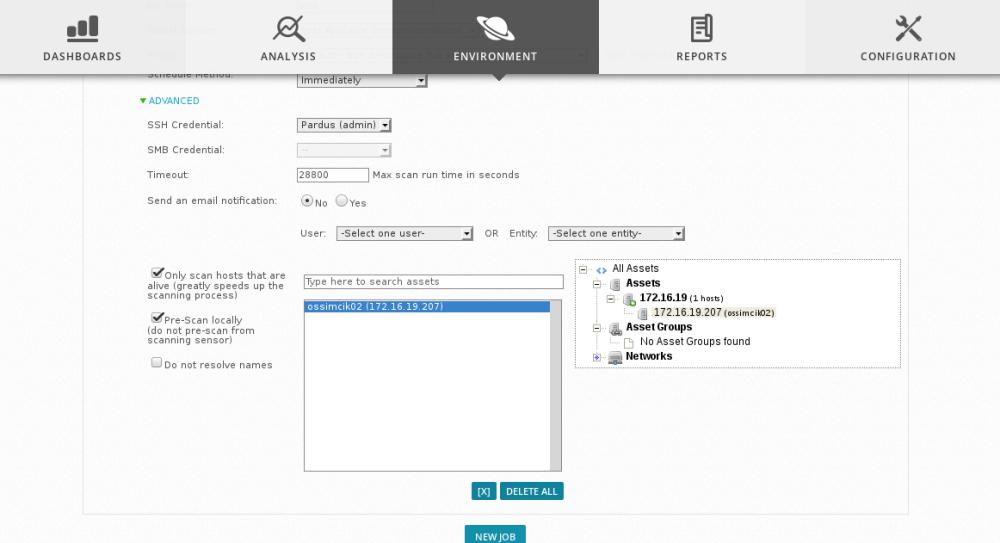
* Taramayı başlatmadan önce son işlem olarak taramaya dahil edilmek istenen asset veya asset grubu seçilir. 
* “**NEW** **JOB**” butonuna basılarak tarama başlatılır.
* Açılan yeni sayfa üzerinde tarama tarama işlemleri gözlemlenebilmektedir.
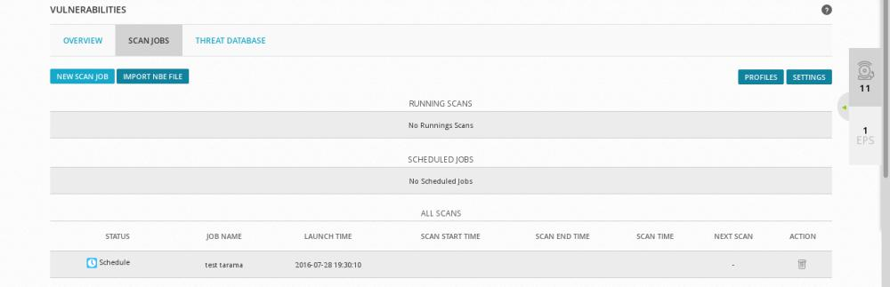

####Yazılım Envanter Bilgilerinin Çıkartılması
* Ossim içerisinde bulunan “**OCS-NG**” kullanılarak yazılım envanter bilgileri kayıt altında tutulmaktadır.
* Linux sunucularda Ocs-ng **ssl** ile çalıştığından dolayı ssl sertifika agent makineler içerisine güvenilir sertifikalar içerine yerleştirilir. Server olarak kullanılacak ocs-ng serverın bulunduğu ossim ssl sertifikası alınarak linux makine içerisine kopyalanır.
```
alienvault:~# cat /etc/ssl/Ahtapot-ossim-keys/certificate.crt
```
* Ossim içerisinden alınan crt dosyası linux testclient güvenilir sertifikalar içerisine eklenilir. Ca-certificates içerisinde yeni bir crt dosyası oluşturarak ossim ssl crt dosyası yapıştırılır. Sertifikalar update edilir.
```
root@testclient:~# vi /usr/local/share/ca-certificates/ossim_ssl.crl
root@testclient:~# update-ca-certificates
1 added, 0 removed; done.
Running hooks in /etc/ca-certificates/update.d....done.
```
* Testclient /etc/hosts dosyası içerisine ossim makinesinin hostname ve ip adresi girilir.
```
root@testclient:~# cat /etc/hosts
172.16.19.201 ossim01.gdys.local ossim01
```
* Envanter bilgilerini alabilmek için “**linux**” sistemlerde “**ahtapot-fusioninventory-agent**” kurulumu yapılır.
```
root@testclient:~# apt-get install ahtapot-fusioninventory-agent 
```
* Kurulumun tamamlanması ile agent yapılandırma dosyası açılarak server ve ssl sertifika bilgileri girilir.
```
root@testclient:~# vi /etc/fusioninventory/agent.cfg
server = https://ossim01/ocsinventory
ca-cert-file =/etc/ssl/certs/ossim_ssl.pem
logfile = /var/log/fusioninventory.log
debug = 2
```

* Aşağıdaki komut girilerek envanter bilgileri ocs-ng içerisine gönderilmesi sağlanılır. 
```
root@testclient:~#fusioninventory-agent debug 
```
* Fusioninventory-agent cron ile saatlik olarak envanter bilgilerini server içerisine göndermektedir.
* Windows sistemlerinde fusioninventory-agent kurulumu için  forge.fusioninventory.org/projects/fusioninventory-agent-windows-inastaller/files
sitesinden indirilerek kurulur.
* Ocs-ng **ssl** ile çalıştığından dolayı ssl sertifika agent makineler içerisine güvenilir sertifikalar içerine yerleştirilir.Server olarak kullanılacak ocs-ng serverın bulunduğu ossim ssl sertifikası ve pem dosyası windows makine içerisine kopyalanır.
```
alienvault:~# cat /etc/ssl/Ahtapot-ossim-keys/certificate.crt
alienvault:~# cat /etc/ssl/certs/ossimweb.pem
```
* Windows başlat sekmesine “**mmc**” yazılarak “**Microsoft Management Console**” başlatılır. MMC içerisinde file sekmesinden “**Add/Remove Snap-ins**” seçilir.
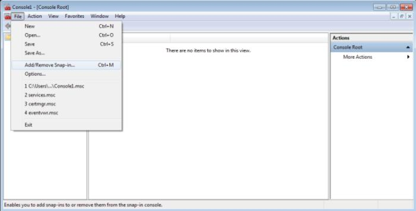
* “**Snap-ins**” içerisinden sertifika eklemek için “**certificates**” seçilir ve “**add**” butonunu basılır.
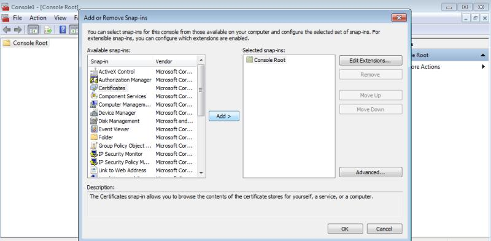
* Sertifikayı bilgisayar hesabına ekleyeceğimizden dolayı “**Computer Account**” seçilir ve “**Next**” butonuna basılır.
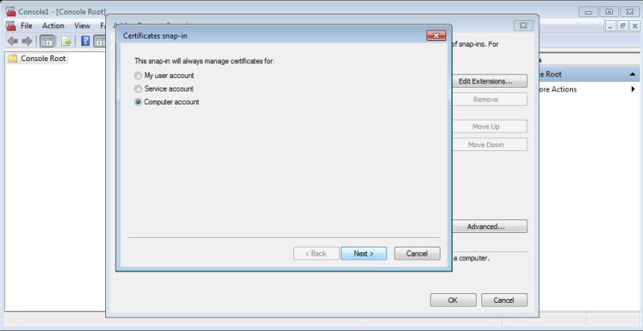
* Eklenilen snap-ins yerel bilgisayardan yönetileceğinden dolayı “**local computer**” seçilir ve “**Finish**” butonuna basılır.
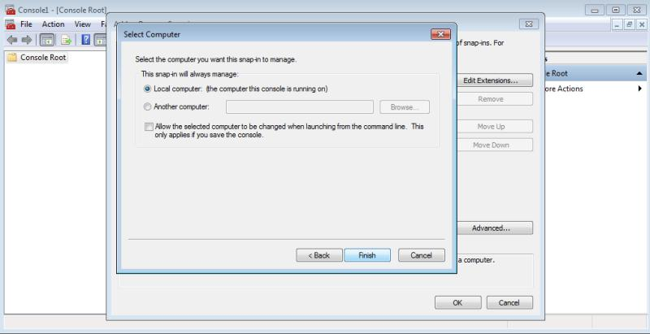
* Seçilen snap-ins içerisinde certifiicates gözlenmesi üzerine “**ok**” denilerek işlem tamamlanır.
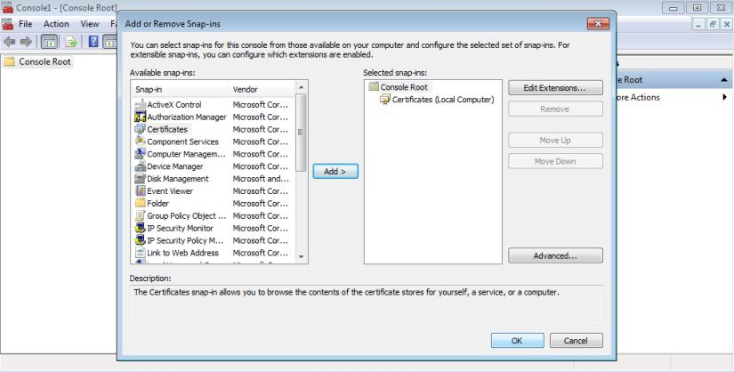
* “**Console Root**” altında seçilen snap-ins certificates gözlemlenir. Burada ossim sertifikasını güvenilir root sertifikalar içerisine ekleyeceğimizden dolayı “**Trusted Root Certifications Authorities**” seçeneği altından “**certificates**” sağ tıklanarak “**All Tasks => Import**” seçilir.
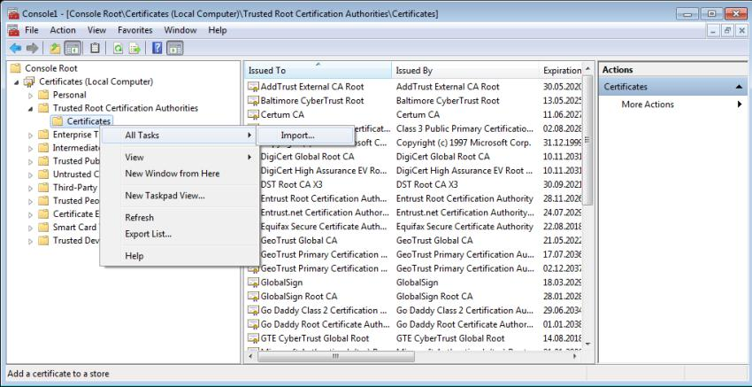
* Ossim sertificasını sisteme eklemek için “**import**” sihirbazı çalıştırılır.
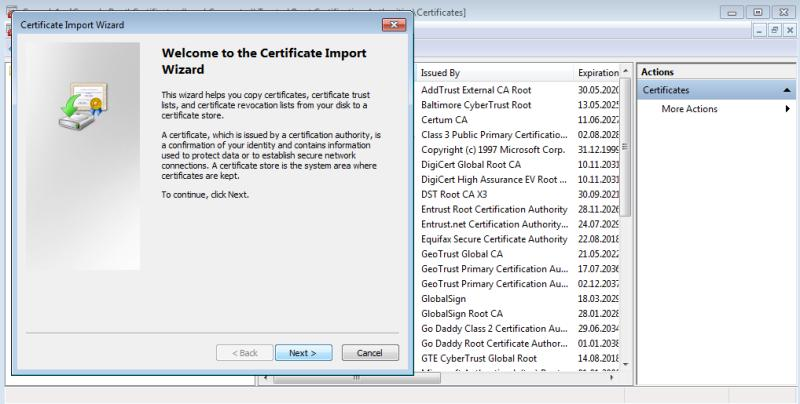
* “**Browse**” seçeneği seçilerek ossim içerisinden kopyalanan ssl sertifikası “**certificate.crt**” verilir.
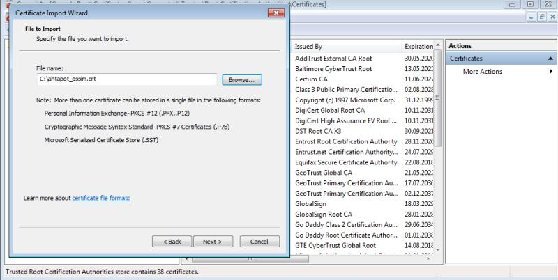
* Sertifikanın ekleneceği dizin seçilir. “**Trusted root certification Authorities**” içerisine eklenmelidir.
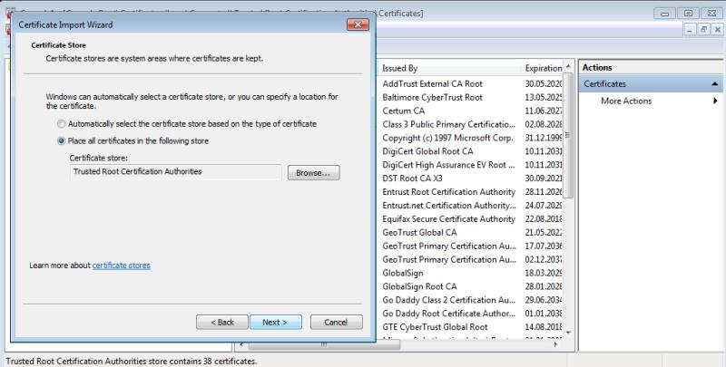
* Sertifika ekleme sihirbazı kapatılır.
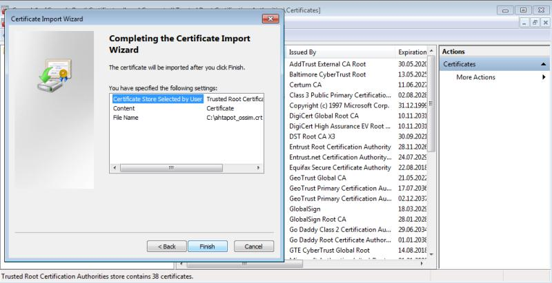
* “**Certificates**” içerisinde “**Ossim Hostname**” sertifikası açıldığı zaman içerisinde başarılı bir şekilde eklendiği gözlemlenir.
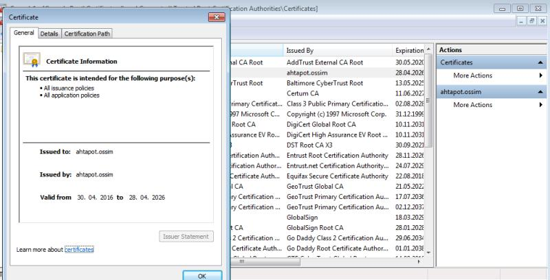

* Sertifika eklendikten sonra Windows hosts dosyası içerisine ossim hostname ile ip adresi eklenmelidir. 
* Başlat menusunden program ara içerisine notepad yazılır. Notepas.exe sağ tıklanılarak yönetici olarak çalıştır seçilir. Notepad yönetici olarak açılır. Notepad içerisinde "Dosya-> open" ile windows host dosyası "**C:\Windows\System32\drivers\etc\host**" içerisinden seçilir. 
* Windows Host dosyası içerisine envanter bilgilerinin gönderileceği ossim makinesinin ip adresi ve hostname yazılmalıdır.
**NOT:** DNS bulunması durumunda "DNS" içerisine ossim bilgileri girilmesiyle "host dosyası içerisinde değişiklik yapılmasına gerek duyulmamaktadır. 
**NOT**:Ossim hostname ssl sertifika oluşturulan CN ile aynı olmalıdır.

* Host dosyasının da eklenmesi sonucunda windows browserdan ossim hostname kullanılarak web arayüzüne ulaşılabilinmektedir.
* Fusioninventory agent ssl ile çalıştırılacağından dolayı “**ossimweb.pem**” dosyası windows içerisine kaydedilir.
* Fusioninventory agent eklenme işlemi için öncelikle web sitesinden güncel windows agent indirilerek çalıştırılır.
```
http://forge.fusioninventory.org/projects/fusioninventory-agent-windows-installer/files
```
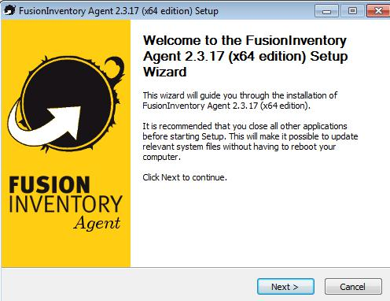

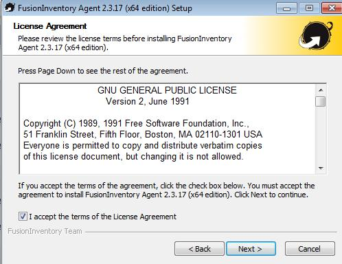

* “**Inventory**” özelliğini kullanıcağımızdan dolayı inventory “**default**” olarak devam edilir.
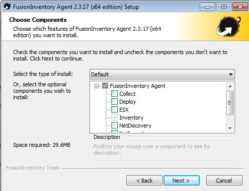
* Fusioninventory-agent’ın yükleneceği klasör belirlenir.
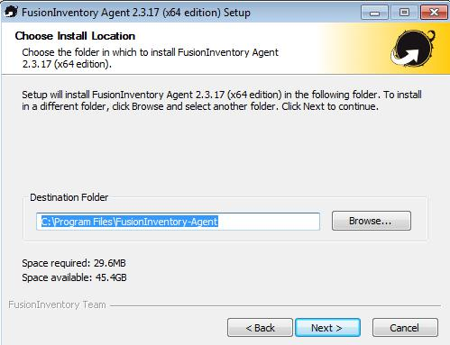
* Server olarak kullandığımız makinenin adresi verilmelidir. “**Ocs Inventory Server **”kullanıcağımızdan dolayı https://ossim_hostname/ocsinventory şeklinde ossim makinesinin hostname'i verilerek yazılmalıdır. 
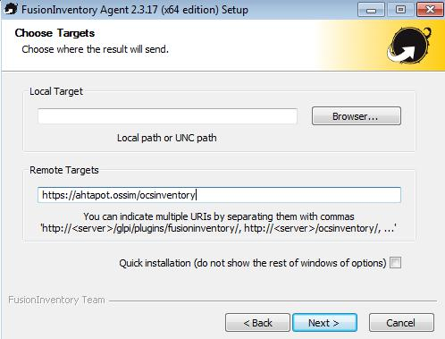
* Agent ssl kullanarak envanter bilgisini göndermesi için Ossim ssl sertifikası “**ossimweb.pem**” dosyası verilir. 
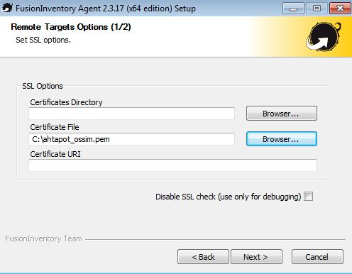
* Proxy kullanımı durumunda “**proxy**” bilgileri girilir.
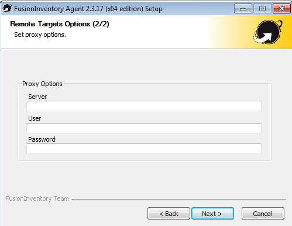
* Fusion Inventory agent windows içerisinde çalışma modu seçilir. Windows servisi olarak seçilir.
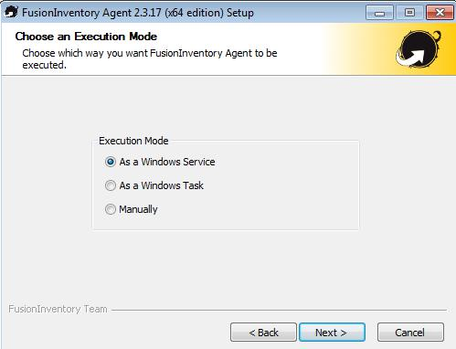
* Fusion Inventory agent’ın http server özelliği bulunmaktadır. Kullanılmak istenilir ise enable yapılabilir.

* Fusion Inventory Agent seçenekleri olarak tüm kullanıcılar için oluşturulması ve yüklemenin ardından direk çalıştırılması için aşağıdaki gibi seçilir.
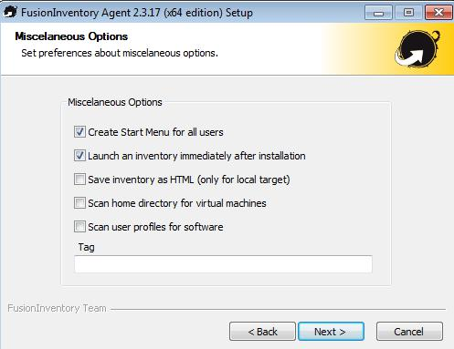

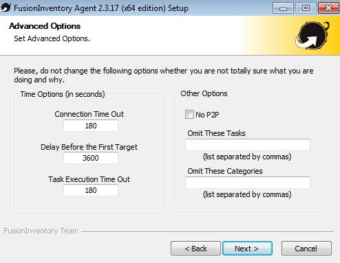

* Agent loglarını ayrıntılı olarak incelemek istenilir ise “**debug**” seçenekleri **2** olarak seçilir. “**Install**” seçilerek yükleme başlatılır.
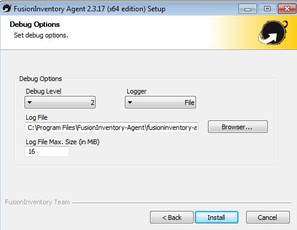

* Yükleme işlemi tamamlanır.
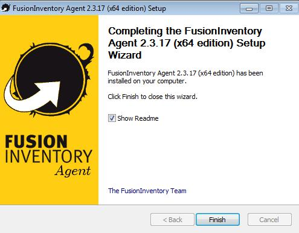
* Agentin envanter bilgisini gönderdiğini test etmek için “**C:\Program Files\FusionInventory-Agent içerisinde fusioninventory-agent.bat**” dosyası çalıştırılarak server içerisinde envanter bilgileri gözlemlenir.
* Ossim menü içerisinde “**Enviroment**” altından “**OCS Inventory**” sekmesi açılır.
Ocs-Inventory öntanımlı kullanıcı “**admin**” parola ise “**admin**” dir.
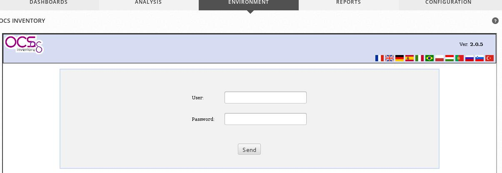
* Envanter bilgileri “**Linux**” makinelerde cron ile **1** saate bir göderilmektedir. “**Windows**” makinelerde ise ön tanımlı olarak **24** saat olarak ayarlanmıştır. Ocs arayüzünde **ingiliz anahtarı** simgesinin üzerine gelinerek “**config**” seçilir.
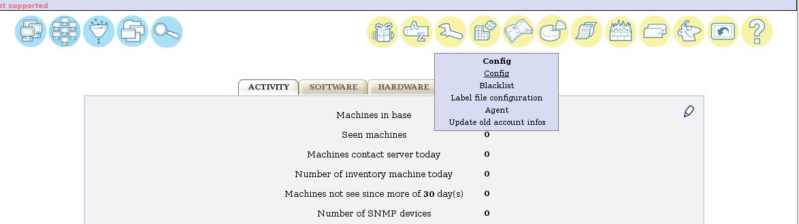
 * Açılan config sayfası içerisinde “**server**” sekmesine tıklanılır ve burada “**prolog frequency**” içerisindeki 24 yerine 1 yazılarak envanter bilgisinin 1 saatte bir alınması sağlanılır. 
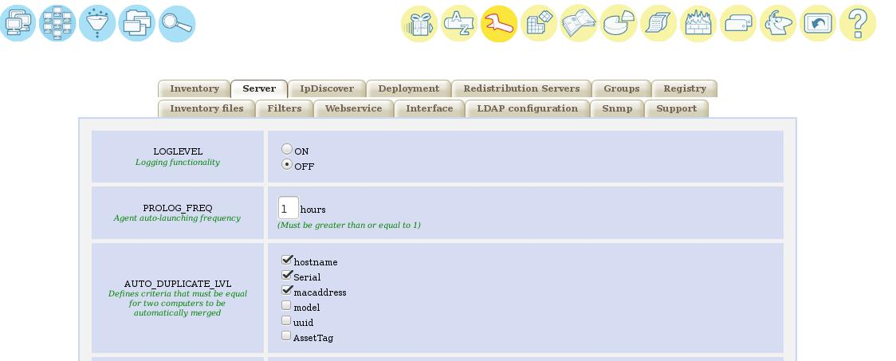
* Envanter bilgisini gönderen makinelerin bilgilerine ulaşılması için ocs sayfası içerisinde sol tarafta bulunan “**all computer**” ikonuna tıklanılarak bağlı makine bilgilerine ulaşılır.
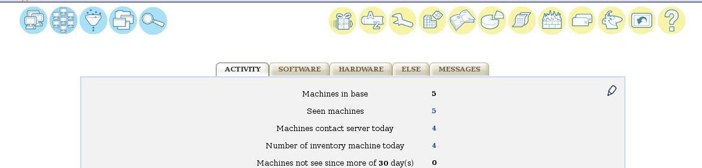
* Açılan ekranda makinelerin hostnameleri ve en son ne zaman bağlandıkları bilgilerine ulaşılır. Makinelerin isimlerine tıklanması ile makinede bulunan envanter bilgilerine ulaşılabilmektedir.
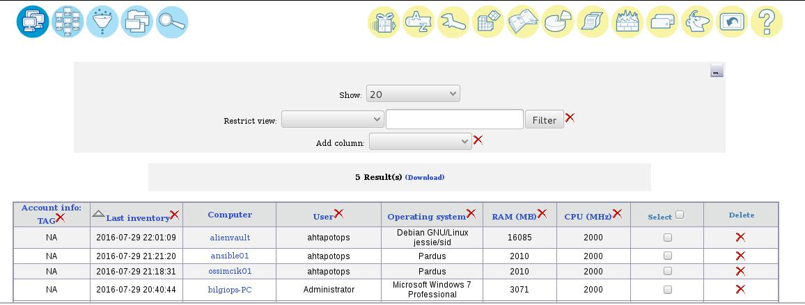

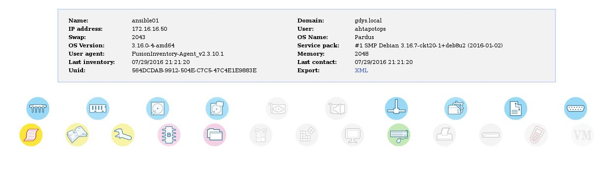

####Risk Analizi ve Yönetiminin Kullanılması

* Sürekli olarak giderilemeyen açıklıklar için risk analizi ve yönetimi yapılmasına simple risk kullanılarak  sağlanmıştır. 
* OSSIM menü içerisinde “**Environtment**” altında “**Simple** **Risk**” sekmesi tıklanılarak simple risk arayüzüne ulaşılmaktadır. 
* Simple Risk ön tanımlı kullanıcı adı “**admin**”, şifresi “**admin**” olarak giriş yapılmaktadır.
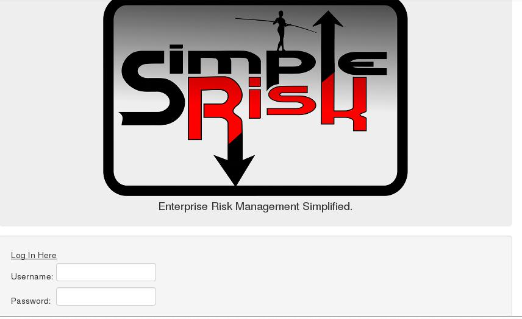
* Simple Risk sayfasında sol üst sekmelerden “**risk** **management**” tıklanılarak giderilemeyen açıklıklar için gerekli bilgilerin girişi yapılır. Test olarak OSSIM içerisinde yapılan açıklık taraması ile tespit edilen “**apache/server** **status** **accesible**” açıklığının bilgileri girilir.
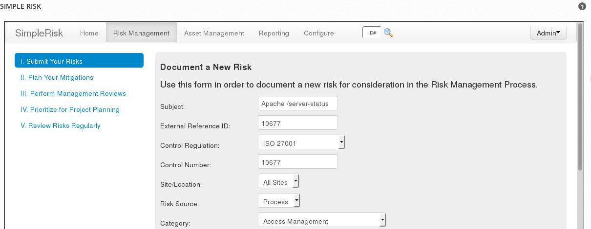

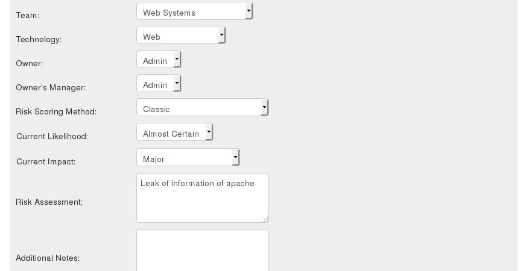

* Açıklık bilgilerinin girişi tamamlanması ardından “**submit**” butonuna basılır. Simple Risk içerisinde “**reporting**” tıklanılarak oluşturulan açıklık bilgileri ile ilgili raporlara ulaşılabilinmektedir. Test olarak bir adet girdi yapılan aıklıktan dolayı “**open** **risk** **status**” **1** olarak gözlenmektedir.
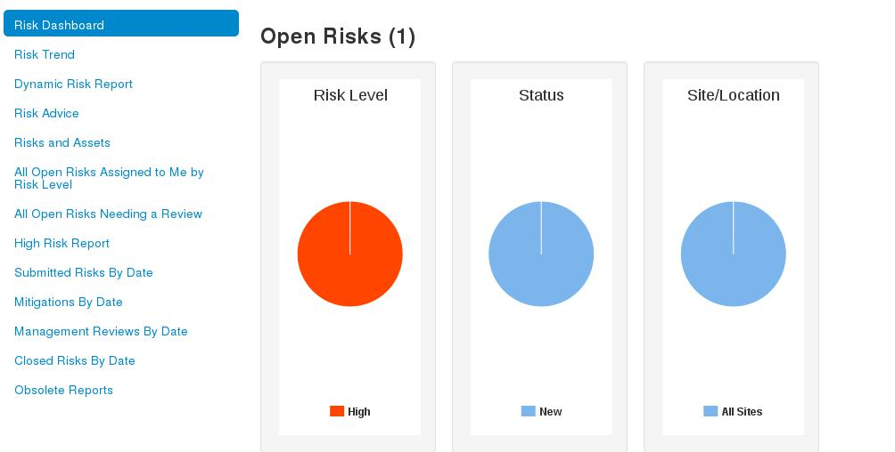
* “**Reporting**” sekmesinin sol menüsünde “**All** **open** **Risks** **Needing** **a** **Review**” seçilerek açılmış risk bilgilerine ulaşılabilmektedir.
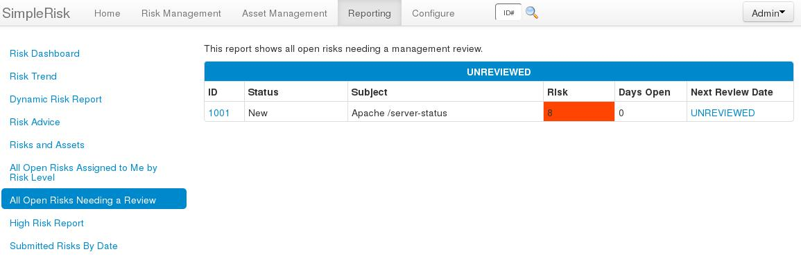

####OSSIM Üzerinde Bulunan Konu Takip Sisteminin Kullanımı

* Ossim içerisinde bulunan konu takip sistemi ile oluşan **anormalliklere**, **eventlere**, **alarmlara** ve **zafiyetlere** özel ticket açılabilir. Açılan ticket durumu ilerleme süresinde değiştirilebilir içerisine **notlar**, **açıklamalar** ve **eklentiler** eklenebilir.
* OSSIM menüsü içerisinde “**Analysis**” seçeneği altında bulunan “**Tickets**” sekmesi içerisinde konu takip sistemine ait menü bulunmaktadır.
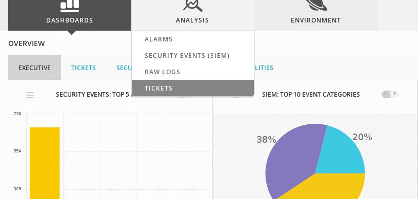
* OSSIM konu takip sayfası içerisinde el ile kayıt açılabilmektedir. Sayfanın altında bulunan “**Open** **a** **new** **ticket** **manually**” seçilerek **alarm**, **event**,**vulnerability** ve **anormally** olmak üzere 4 çeşit kayıt açılabilmektedir. Test olarak alarm seçilerek “**create**” butonuna basılır.

* Açılan sayfada alarm kayıt formu doldurularak yeni bir kayıt oluşturulur.
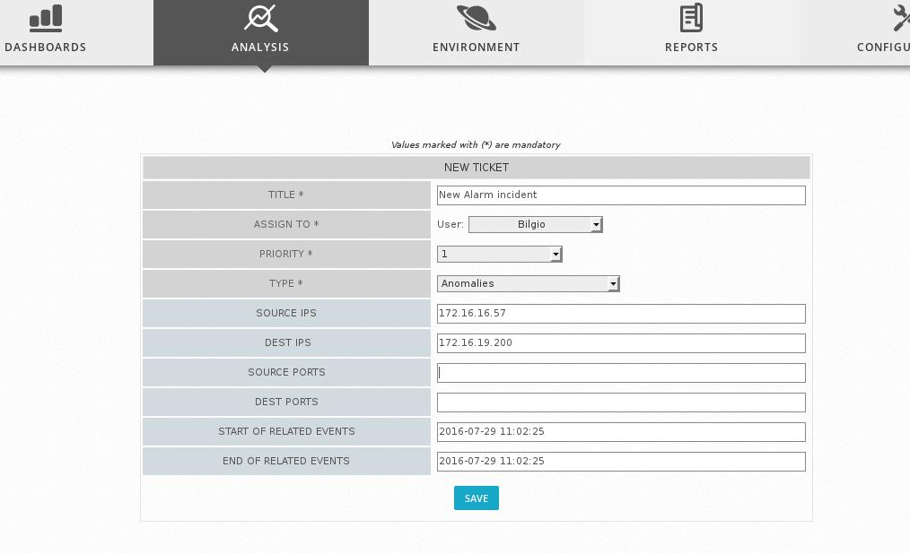
* Oluşturulan kayıt seçilerek kayıt bilgilerine ulaşılabilinmektedir.
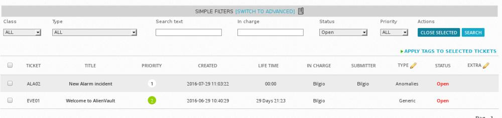

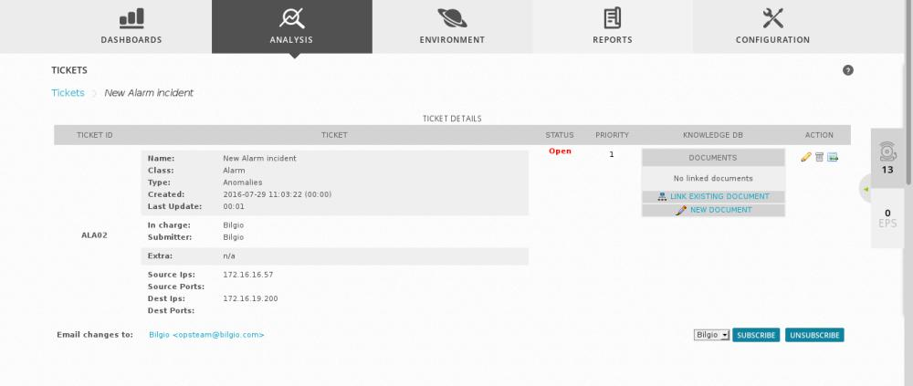

* Kayıt bilgilerinin alt kısmında oluşturulan kayıdın “**status**, **priority**, **atanan** **kişi**” alanları değiştirilebilir; “**açıklama** ve **attachment**” eklenebilir.
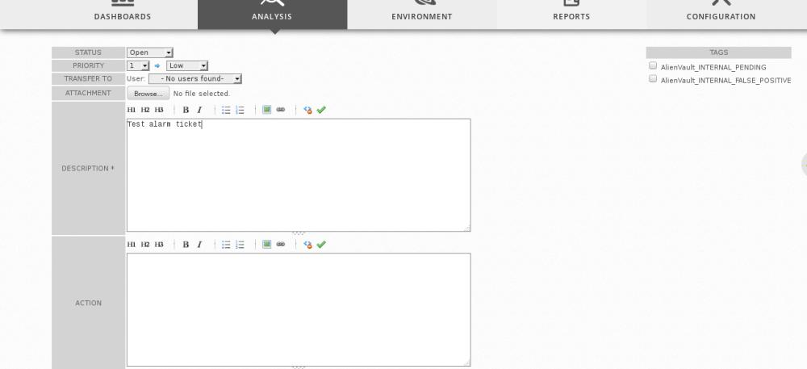
* Zafiyet taraması ile bulunan açıklıkların seviyesine göre kayıt otomatik veya el ile açılır. Otomatik kayıt açılması için açıklık taraması sonucunda belirlenen açıklık seviyesi ve üstü için “**threshold** seviyesi ayarlanması gerekir. Bunun için OSSIM menü içerisinden “**Configuration** => **Administration** => **Main** => **Vulnerability** **Scanner**” sekme içerisine gelinir
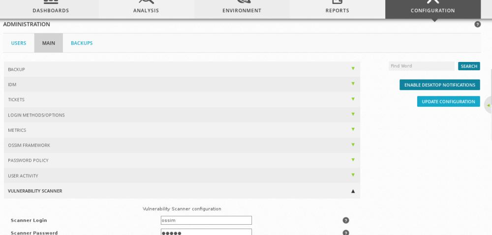
* “**Vulnerability** **Scanner**” içerisinde “**Vulnerability** **Ticket** **Threshold**” değiştirilerek otomatik olarak kayıt açılması için zafiyet seviyesi seçilir. Seçilen seviye ve üstündeki tüm seviyeler zafiyet taraması sonucunda otomatik olarak ticket açılır. Vulnerability Ticket Threshold seviyelari olarak **Info**, **Low**,** Medium**, **High** seçilebilir ve **Disable** seçildiği zaman otomatik olarak ticket açma özelliği kapatılmış olur. 
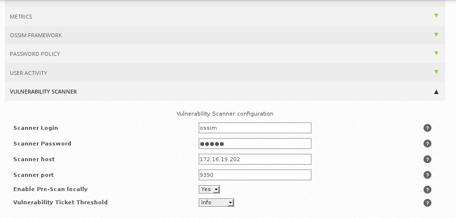
* Açıklık taraması ile otomatik olarak açılan kayıtlar OSSIM menüsü içerisinde “**Analysis**” sekmesi altındaki “**Tickets**” sayfası içerisinde gözlemlenir. 

* Kayıtlar içerisinde “**submitter**” olarak OpenVAS yazanlar açıklık taraması sonucunda oluşturulmuş otomatik kayıtlardır.
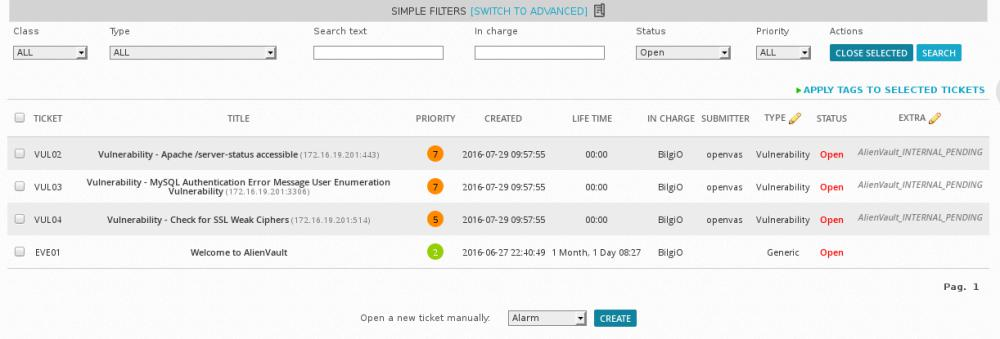
* OSSIM tarafından tespit edilen alarmların kayıt sistemi ile entegre olarak test edilmesi için OSSIM içerisinde “**action**” ve “**policy**” oluşturulması gerekmektedir.
* OSSIM içerisinde otomatik kayıt açılmasını sağlayan yapının oluşturulması için menü içerisinde “**Configuration** => **Threat** **Intelligence** => **Actions** seçilr.
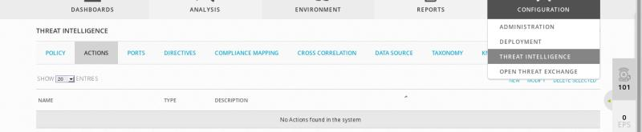
* “**Action**” içerisnde “**tpye**” olarak “**Open** **a** **Ticket**” seçilerek kayıt açılması sağlayan yapı oluşturulur. “**Condition**” içerisinde “**Any**” olması durumunda oluşan olay ve alarmların hepsi için kayıt oluşturulur. “**Only** **if** **it** **is** **an** **alarm** olması durumunda  alarm oluştuğunda kayıt açılır. “**Define** **logical** **condition**” olması durumunda belirlenen duruma göre kayıt oluşturulur.
* “**IN** **CHARGE**” seçeneğinde otomatik olarak açılan kayıtların kimin atanacağı belirlenir.
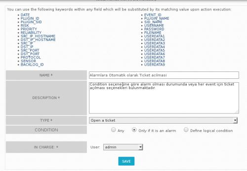
* Olurşturulan yapının çalıştırılması için “**policy**” oluşturulmalıdır. Aynı menü içerisinde “**policy**” seçilerek veya aynı “**Configuration** => **Threat** **Intelligence** => **Policy**” adımları seçilerek policy oluşturulması sağlanılır. 2 çeşit policy vardır. “**Default** **policy** **group**” OSSIM içerisinde bulunan “**data** **source**” aracılığı ile oluşan olaylar için, 
“**Policies** **for** **events** **generated** **in** **server**” OSSIM içerisinde oluşturulan “**korelasyon** **directiveleri** ile oluşan olaylar için bulunmaktadır.
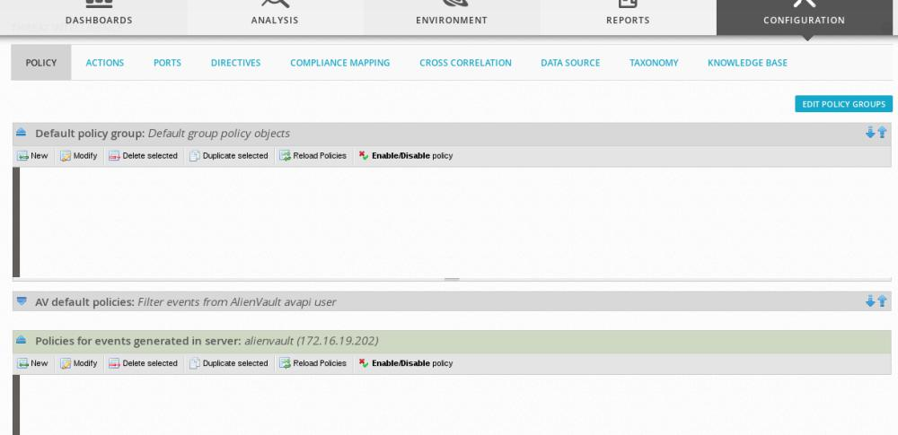
* OSSIM içerisinde oluşturulan “**directive**” ile oluşan alarmlar için otomatik kayıt açılmasının sağlanması için “**Policies** **for** **events** **generated** **in** **server**” içerisinde “**new**” butonuna tıklanılır. Açılan yeni sayfada “**policy**” ismi verilir.
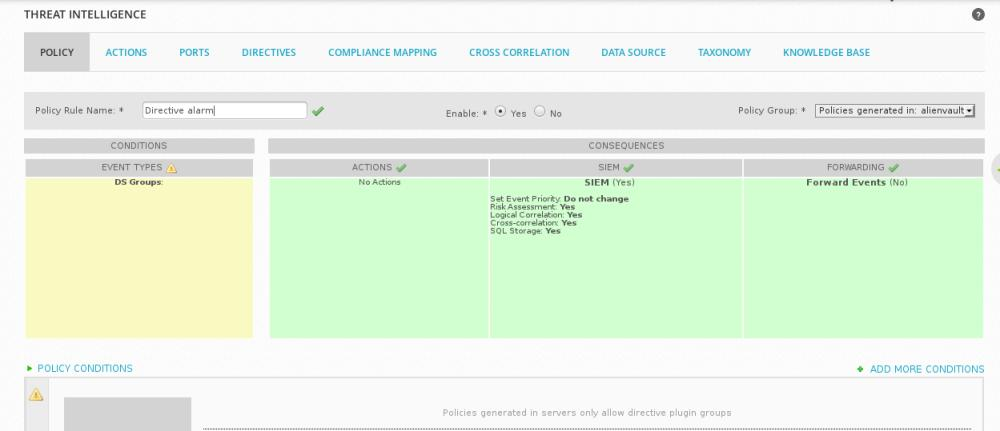
* Sayfanın alt kısımında “**policy** **condition**” içerisinde policynin aktif olması için gerekli olay çeşidi seçilir. Korelasyon sonucu oluşan directive olayları için çalışması istenildiğinden “**directive** **event**” seçilir.
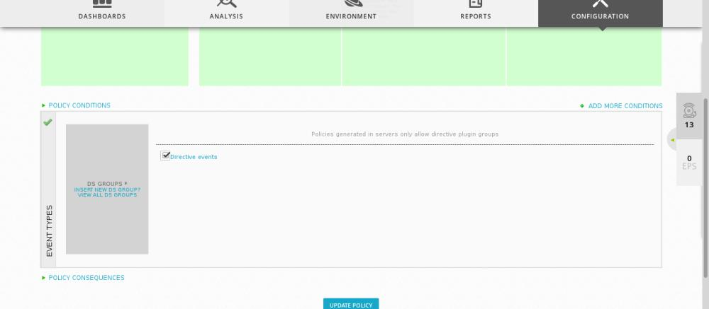
* Directive olayları oluşması sonucunda aktif olacak alarmlara otomatik kayıt açması için oluşturduğumuz aksiyonu seçmek için sayfanın alt kısmındaki “**policy** **consequences**” seçilir. Burada action içerisinde “**Available** **Actions**” altında kalan oluşturulan alarmın sağ tarafındaki artı kısmına tıklanılarak “**Active** **Actions**” altına alınır.
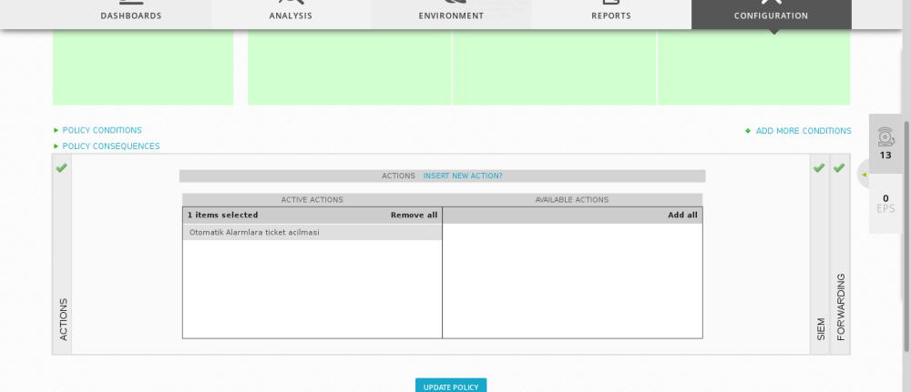
* “**Action**” seçilmesiyle birlikte “**SIEM**” sekmesi açılarak oluşan directive olayların özellikleri değiştirilebilir. Oluşacak alarmların değerleri değiştirilmeden kayıt açılması için bu sekme içerisinde bir değişiklik yapılmadan “**update** **policy**” butonu tıklanılarak kaydedilir.
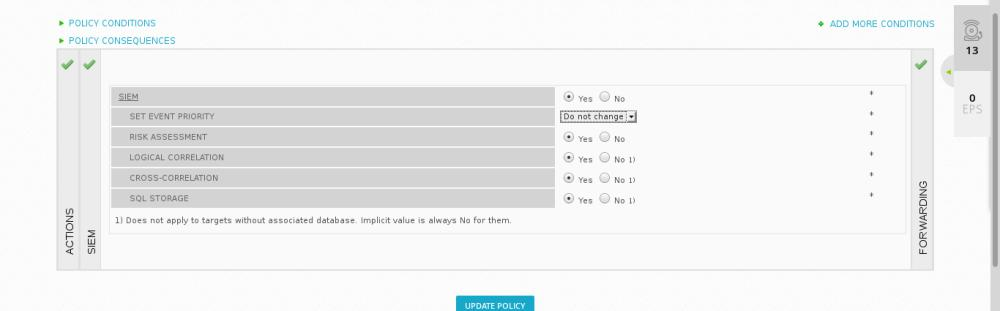
* Oluşturulan yeni policynin aktif hale getirilmesi için “**Reload** **Policies**” tıklanarak policynin aktif hale getirilmesi sağlanılır.
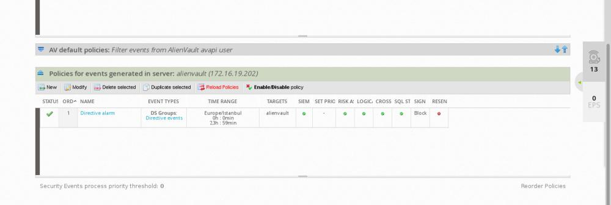
* Oluşan policy ile alarmlar için otomatik ticket açılmasının sağlanmasının test edilmesi için oluşturulan directive tetiklenir ve Directive ile alarm oluşması gözlemlenilmesiyle “**ticket**” sekmesi açılarak otomatik alarmın oluştuğu gözlemlenir.

* Directive kuralların tetiklenmesi ile alarm oluşturulup “**Analysis**” altında bulunan “**tickets**” sekmesi içerisine directive alarmları ile oluşan kayıtlar gözlemenebilir.
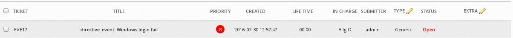

###Group Policy ile Nxlog ve Ossec-agent Kurulumu

1) Windows Server açıldığında Sever Manager otomatik olarak açılmaktadır. Server Manager sayfasında sağ tarafta bulunan Tools sekmesinden "**Active Directory User and Computers**"’a tıklanır.

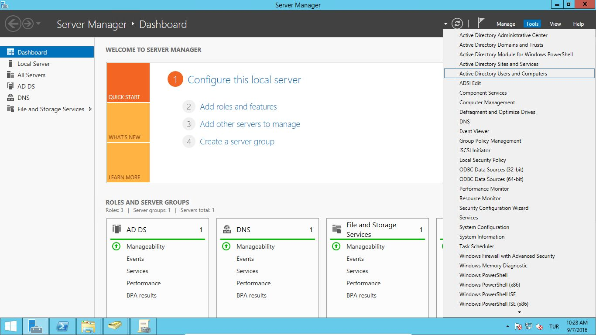

2) Active Directory User and Computers sayfası açıldığında sol tarafta bulunan domain name üzerine sağ tıklanır ve **New -> Organizational Unit** seçeneği seçilir.


3) New Object sayfasında oluşuturulacak Organizational Unit object’ine bir isim verilir.

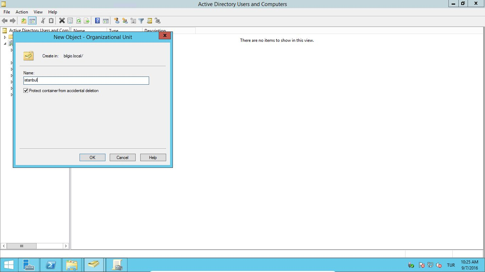

4) İstanbul object’i oluşturulduktan sonra içerisine group policy ile kurulum ve değişiklik yapacağımız makineler sürükle bırak yöntemi ile taşınmalıdır. Bu bilgisayarla Active Directory domainine eklenmiş bilgisayarlardır.

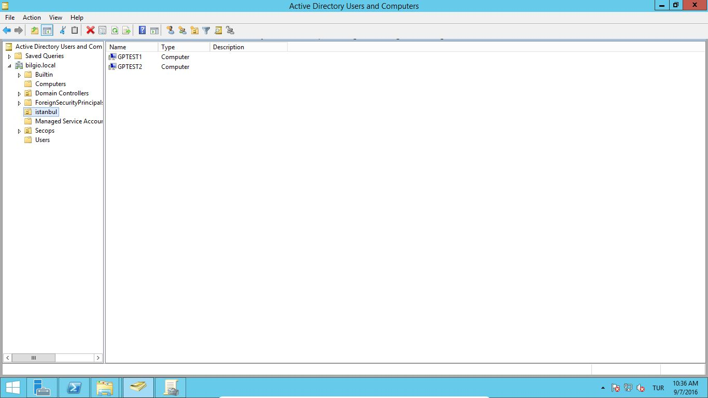

5) Masaüstü veya istediğiniz bir dizinde bir dosya oluşturulur. Bu dosya içerisinde kurulum yapacağınız msi dosyalarını, değiştireceğiniz dosyaların son halini veya uygulamak istediğiniz scriptleri koymalısınız. Daha sonra dosya üzerine sağ tıklanır ve "**Properties**" seçeneği seçilir.

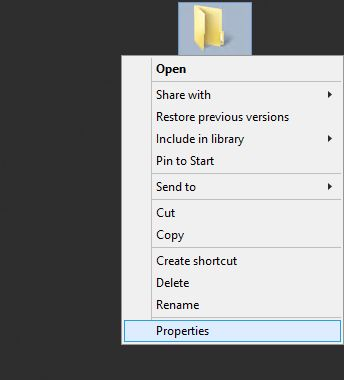

6) Açılan sayfada "**Advanced Sharing**" butonuna tıklanır.


7) Açılan Advanced Sharing sayfasında "**Permissions**" butonuna tıklanır.

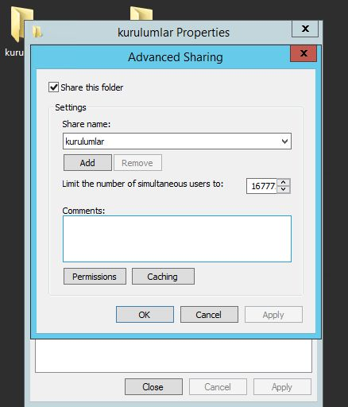

8) Açılan Permissions sayfası dosya için izinlerin yönetildiği sayfadır. Bu sayfa içerisinde hangi kullanıcıların bu dosyayı görmesi isteniyorsa "**Add**" butonuna  tıklanarak izin verilebilir. Daha sonra "**OK**" butonuna basılır. Aşağıda kullanıcı ayırt edilmeksizin everyone ve Authenticated users’a full control verilmiştir.

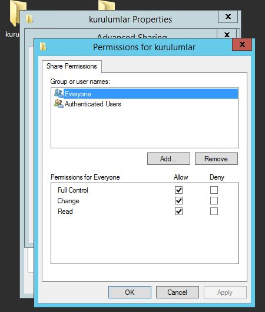

9) Properties sayfasında "**Securty**" bölümüne gelinir. Burada paylaşılan dosya üzerinde kontrol sağlayabilecek kullanıcılar belirlenir sonrasında Apply ve Ok butonlarına basılmalıdır. Aşağıda Authenticated users ve Administrator’e full kontrol verilmiştir.

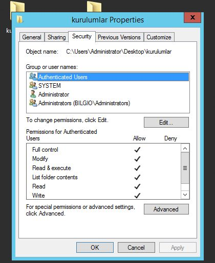

10) Server Manager sayfasıda Tools bölümünde bulunan "**Group Policy Management**" seçeneğine tıklanır.

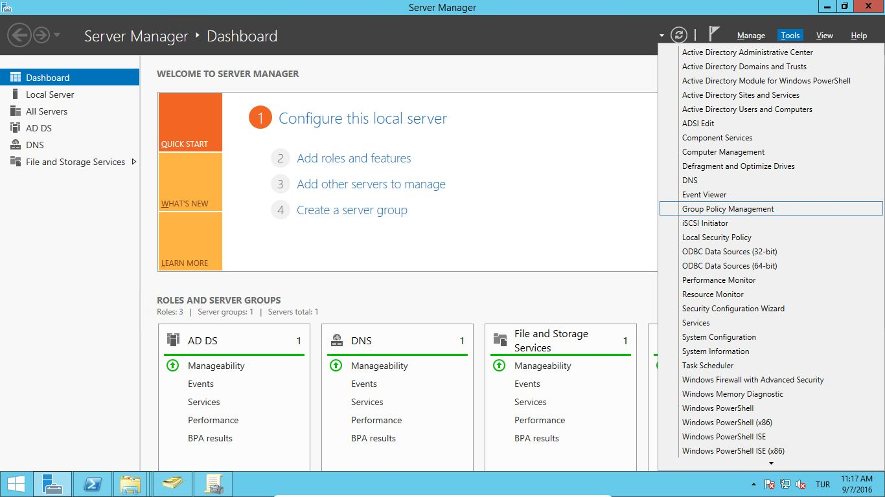

11) Açılan Gorup Policy Management sayfasında 3. Adımda oluşturulan Organizational Unit ile aynı isimde olan object’e sağ tıklanır ve “**Create a GPO in this domain, and Link it here**” seçeği seçilir. 

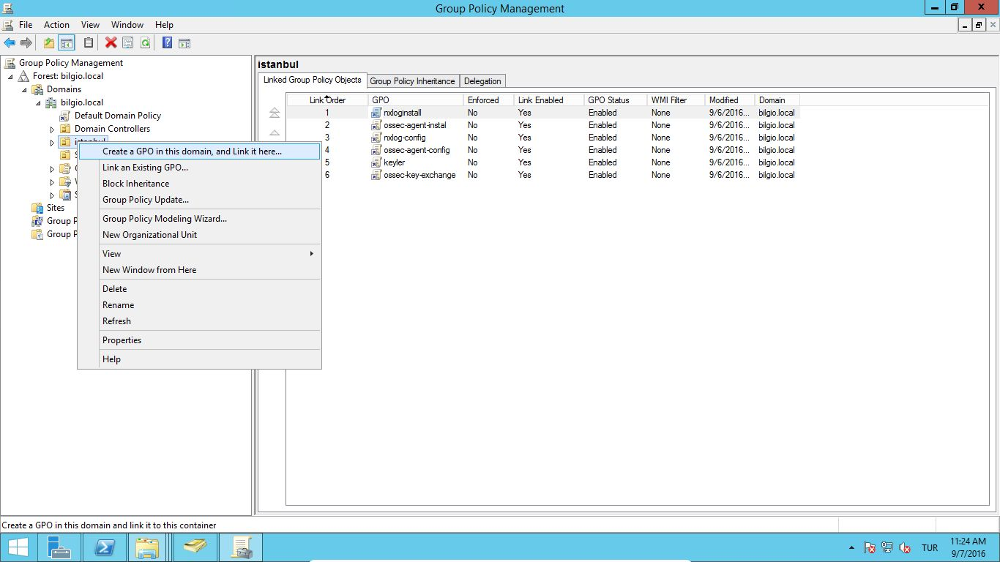

12) Açılan pencerede oluşturulacak new GPO’ a bir isim yazılır ve OK butonuna tıklanır. Nxlog kurulumu yapacağımız için ismini nxloginstall olarak verilmiştir.

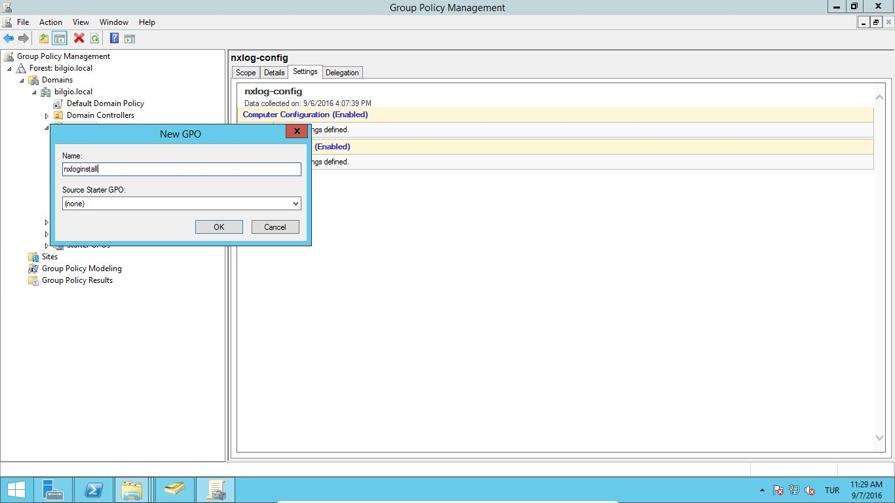

13) Oluşturulan GPO object’ine sağ tıklanır ve **Edit** seçeneği seçilir. Açılan Group Policy Management Editor sayfasında Computer **Configuration -> Policies -> Software Settings -> Software installatiton** alt sekmesine gidilir. Sağ tarafta bulunan boş alanda sağ tıklanır ve **New -> Packages** seçeneği seçilir.

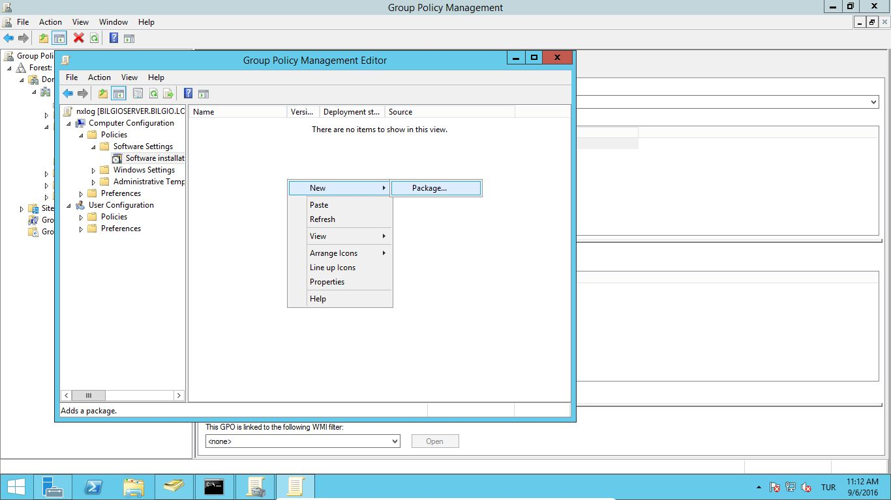

14) Açılan sayfada paylaşım yapılan klasörün **Network Path’i** yukarıda bulunan dosya gösterme alanına kopyalanır ve Enter butonuna basılır. Bu sayade paylaşılan dosyanın içerisine girmiş oluruz. Burada nxlog kurulumu yapacağımız için kurulacak nxlog’un msi dosyası seçilir ve Open butonuna tıklanılır ve kurulum adımı Assigned olarak seçilir. (Network Path’i klasör üzerine sağ tıklayıp Share kısmından edinebilirsiniz.)

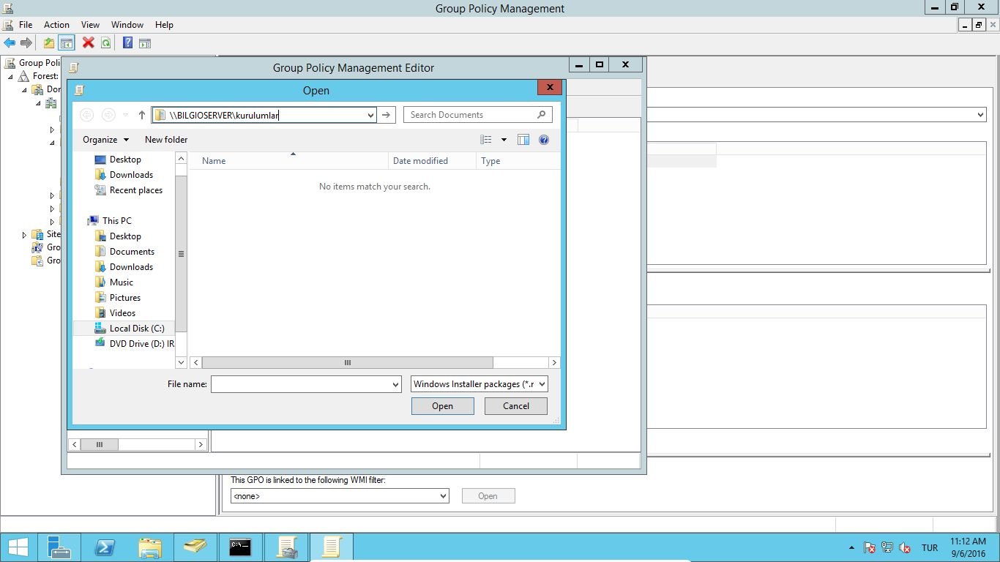

15) Software installation işlemleri yapıldıktan sonra ekran görüntüsü aşağıdaki gibidir.

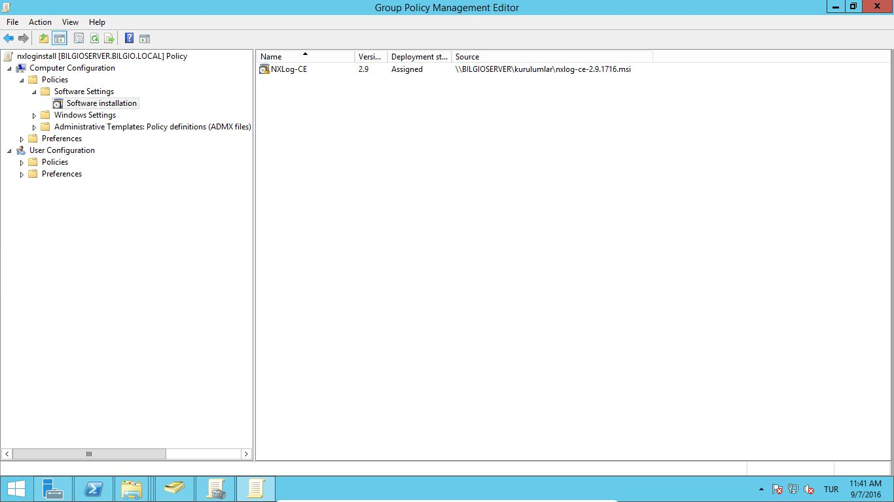

16) Ossec-agent’ı kurulumu yapmak için **11.** adımdaki gibi yeni bir GPO oluşturulur ve GPO’ ya bir isim verilir.

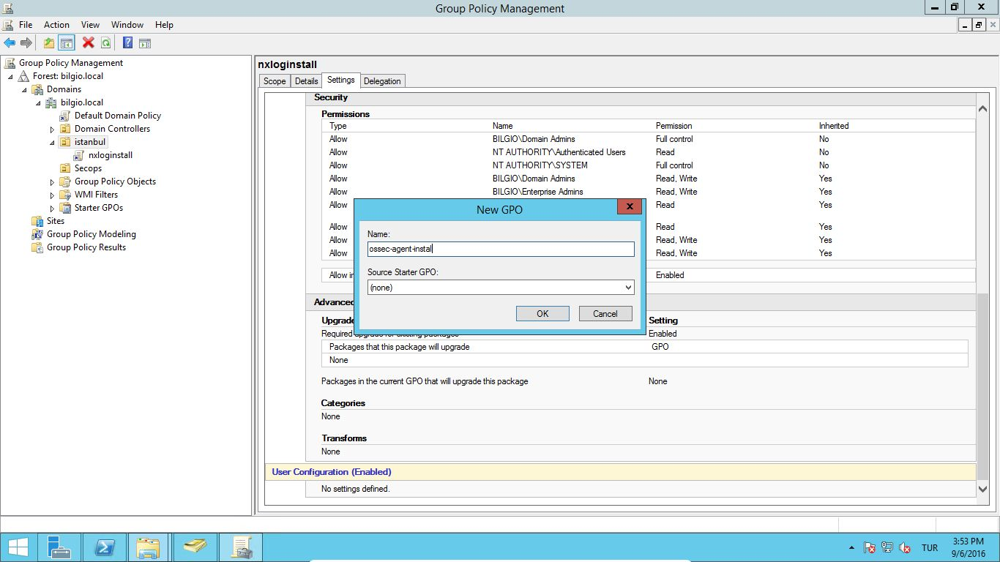

17) Ossec agent kurulumu için oluşturulan GPO da **13, 14, 15** maddelerdeki adımlar aynen izlenir ve paylaşım yapılan klasör içinde ossec-agent kurulumu yapılcak msi dosyası seçilir. İşlemler sırasıyla yapıldığında ekran görüntüsü aşağıdaki gibidir.

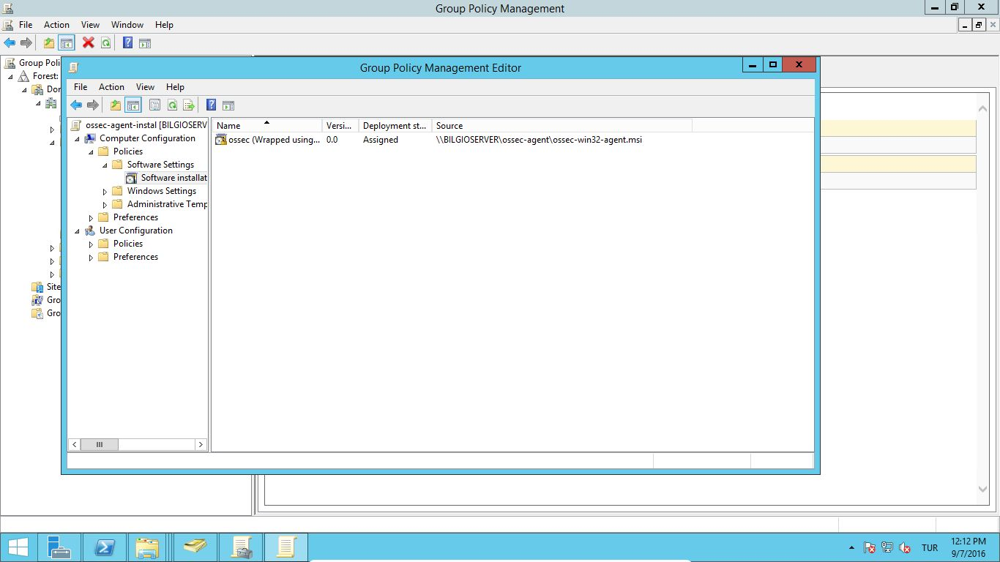

18) Bu işlemlerin ardından herhangi bir hata olup olmadığını gözlemlemek için PowerShell de “**gpupdate.exe /force**” komutu aşağıdaki gibi çalıştırılır.

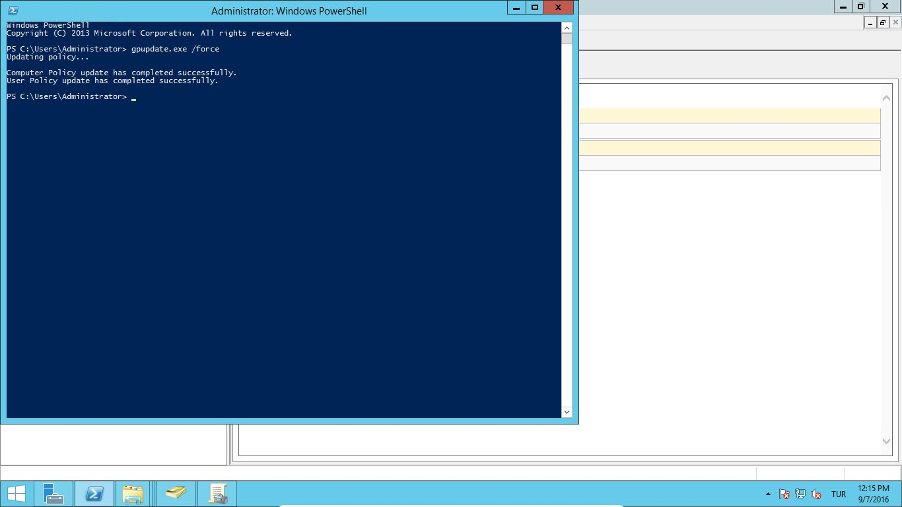

19) Kurulum yapılmasını istediğimiz makinelerin cmd ekranında da “**gpupdate /force**” komutu çalıştırılır ve gorup policy’i update etmesi için “**Y**” seçeneği seçilir. 

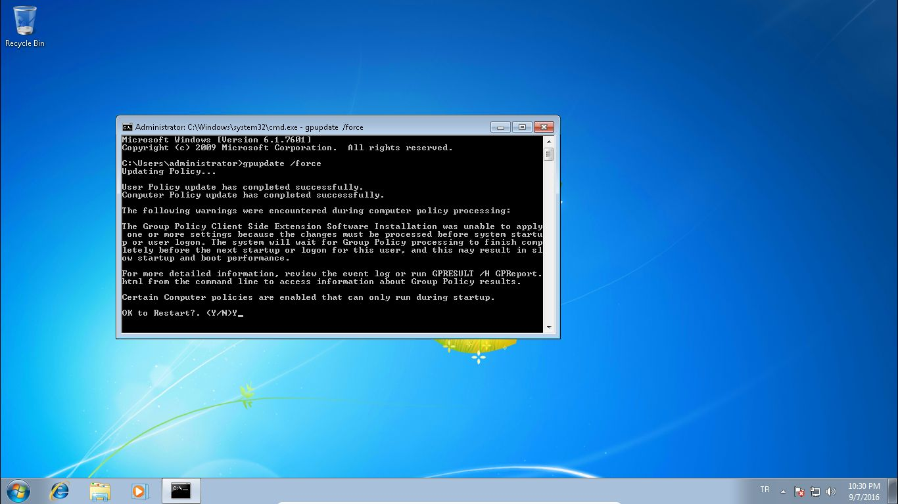

20) Makine yeniden başlatıldıktan sonra nxlog ve ossec-agent’ın kurulmuş olması gerekmektedir.

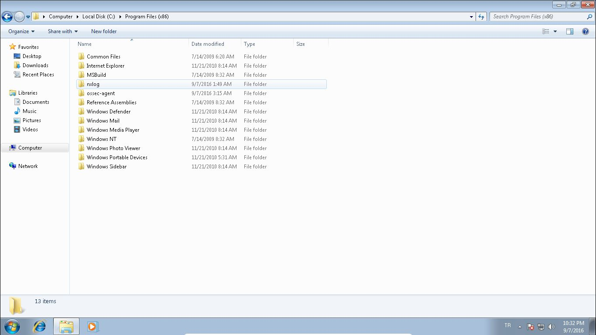

21) Kurulumlar sorunsuz gerçekleştirildikten sonra nxlog uygulamasının istenilen makinelerde konfigurasyon dosyasının değişmesi için için **11.** adımdaki gibi yeni bir GPO oluşturulur ve GPO’ ya bir isim verilir.

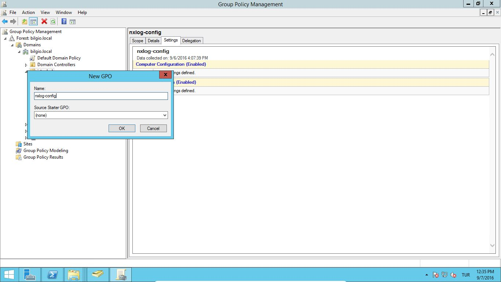

22) Oluşturulun GPO üzerine sağ tıklanır ve edit seçeneği seçilir. Açılan pencere de "**Computer Configurations -> Preferences -> Windows Settings -> Files**" üzerine sağ tıklanır ve "**New -> File**" seçeneğine tıklanır.


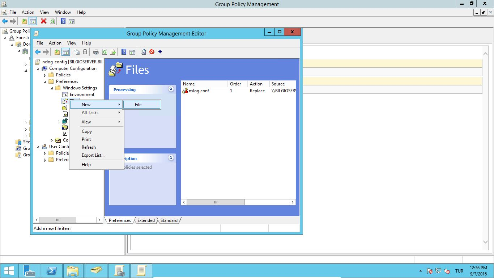

23) Açılan pencerede “**Action**” seçeneği “**Replace**” olarak seçilir. “**Source file**” seçeneğine nxlog.conf dosyasının güncel içeriğini barındıran dosya yolu seçilmelidir. (Bu dosya paylaşım yapılan klasör içerisinde olmalıdır). Destination file seçeneğine makinelerde değiştirilmesi istenen dosya yolu seçilir ve "**OK**" butonuna basılır.

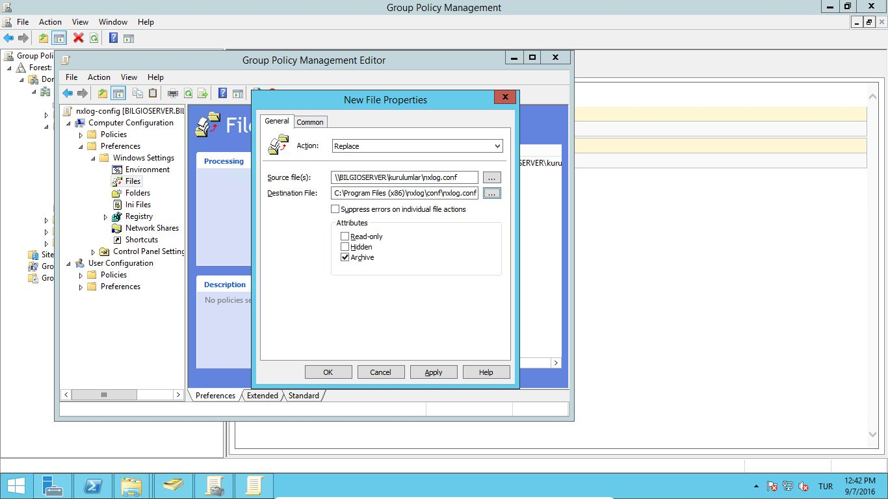

24) File replace adımlarını uyguladıktan sonra ekran görüntüsü aşağıdaki gibidir.

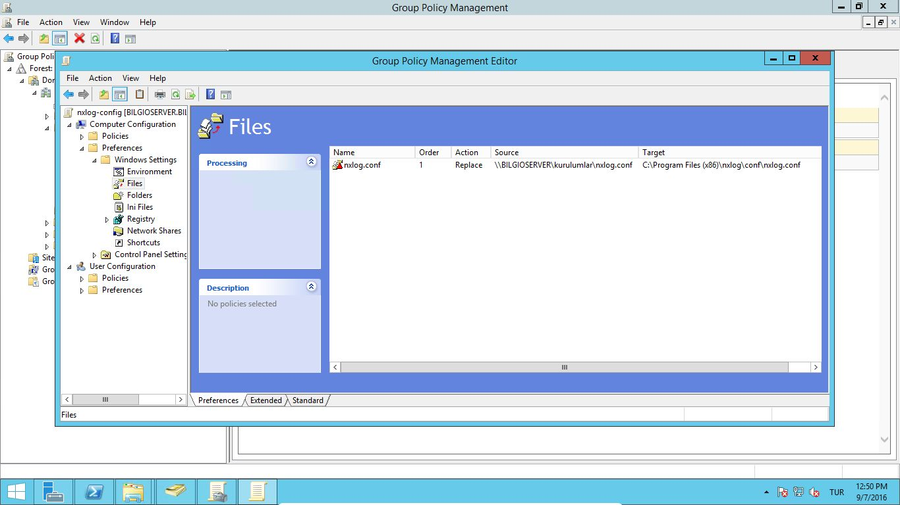

25) Ossec-agent programının config dosyasını değiştirmek için ise nxlog’ta olduğu gibi **22, 23, 24.** adımlar aynı şekilde izlenir tek fark “**Source file**” bölümünde ossec.conf dosyasının güncel halinin paylaşım dosyası içerisinde seçilmesi ve “**Destination file**” bölümünde ossec.conf’un makinelerde hangi yolda bulunduğunu belirtmektir. Ossec.conf dosyası için işlemler tamamlandığında ekran görüntüsü aşağıdaki gibidir.

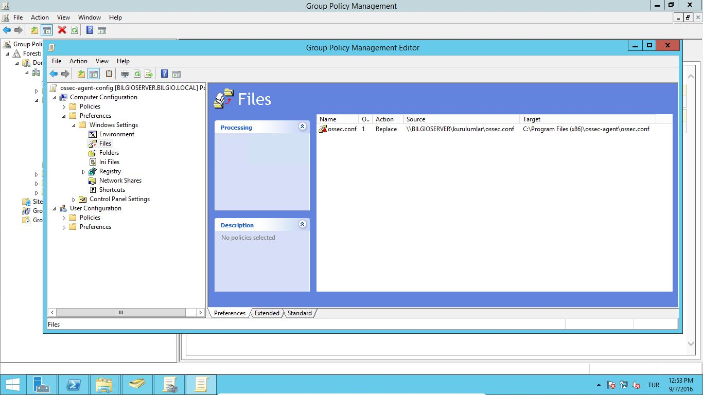

26) Nxlog konfigurasyonunda yer alan keyleri belirtilen dizinde oluşturulmasıiçin **11** maddede olduğu gibi yeni bir GPO oluşturulur. Oluşturulan GPO üzerine sağ tıklanıp edit seçeneği seçilir. Açılan sayfada **Computer Configurations -> Preferences -> Windows Settings -> Files** üzerine sağ tıklanır ve **New -> File**  tıklanır. Açılan sayfa içerisinde “**Action**” seçeneği “**Create**” olarak seçilir. **Sources file** bölümüne yerleştirilmesi istenen dosya(rooCA.pem) paylaşım klasörü içinden seçilir. **Destination file** bölümüne ise dosyanın hangi dizine hangi isimle konulacağı dosya yolu olarak belirtilir ve "**OK**" butonuna tıklanır.

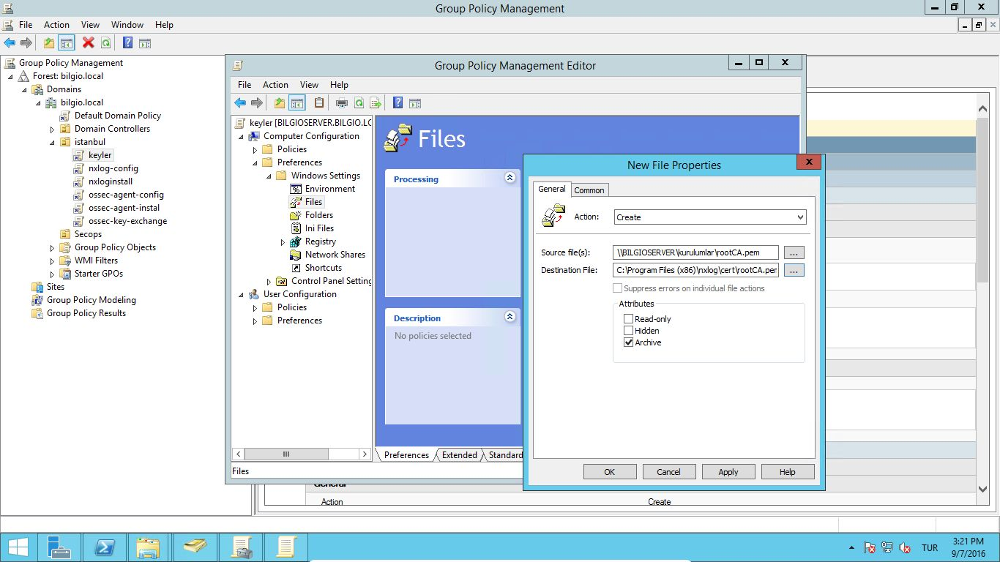

27) Aynı GPO içerisinde **26** adımı diğer keyler içinde tekrarlanır. Toplamda 3 tane key konulması gerekmektedir.(rootCA.pem, clientHost.crt, clientHost.key) Keylerin tamamı eklendikten sonra ekran görüntüsü aşağıdaki gibidir. Bu keyler makinelerde Gorup policy update edildiğinde istenilen dizine koyulmuş olacaktır.

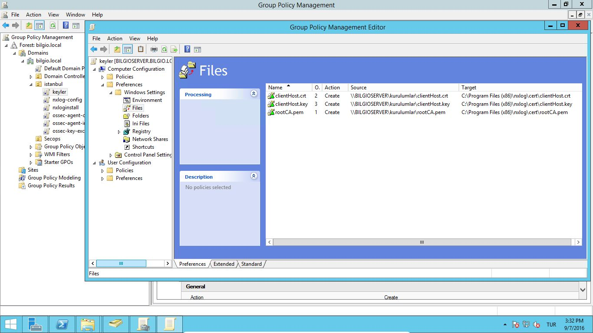

28) Ossec-agent’ ın otomatik client key alması için paylaşım dosyası içerisinde ossecKeyexchange.bat script dosyası oluşturulur ve içeriği aşağıdaki gibi olmalıdır.

```
@ECHO OFF

IF EXIST "C:\Program Files (x86)\ossec-agent\ossec-agent.exe" (
    IF NOT EXIST "C:\Program Files (x86)\ossec-agent\client.keys" (
        cd "C:\Program Files (x86)\ossec-agent\"
        "C:\Program Files (x86)\ossec-agent\auto_ossec.exe" 172.16.16.88
    )
)
```

29) Keyexchange scriptini makinelerde çalışmasını sağlamak için 11 maddedeki gibi yeni bir GPO oluşturulur ve GPO üzerine sağ tıklanıp edit seçeneği seçilir. Açılan pencerede **Computer Configuration -> Policies -> Windows Settings -> Scripts** seçeneğine gelinir. Sağ tarafta açılan Scripts menüsünden “**Startup**” seçeneğine tıklanılır.

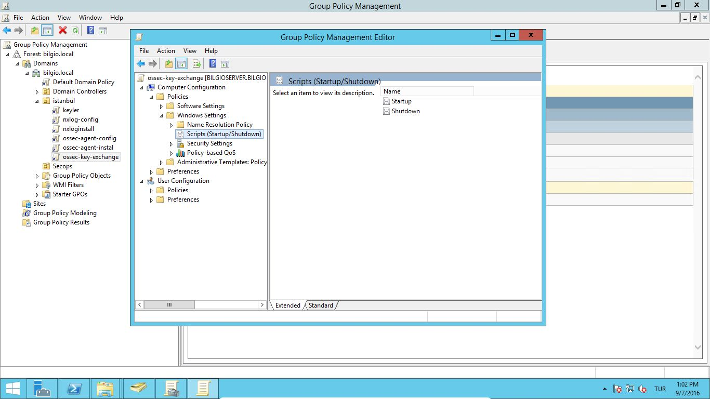

30) Açılan startup penceresin “**Add**” butonuna tıklanır ve Browse butonuna tıklanılarak paylaşım klasörü içerisine oluşturulan script seçilir. Script herhangi bir Parametre almayacağı için “**Scripts Parameters**” seçeneği boş bırakılır ve **OK** butonuna basılır. Böylelikle makineler ilk açıldığında ossecKeyexchange.bat scriptinin otomatik olarak çalışması sağlanmış olacaktır.

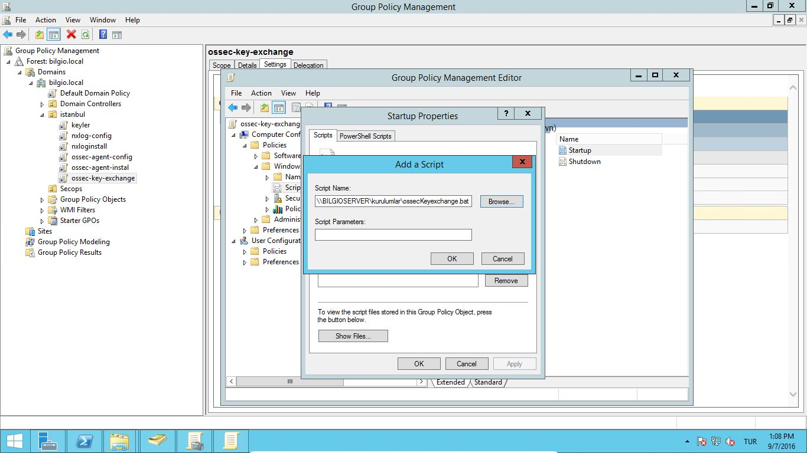

31) Tüm adımlar tamamlandıktan sonra Active Directory'de PowerShell'de **18.** adımda belirtildiği gibi "**gpupdate.exe /force**" komutu çalıştırılır. Ardından **19.** adımda olduğu gibi kurulum yapılacak makinelerin cmd ekranında "**gpupdate /force**" komutu çalıştırılıp **Y** parametresi verildiğinde bilgisayar tekrar açıldığında nxlog ve ossec-agent'ın kurulmuş olduğu konfigurasyon dosyalarının değiştirildiği, nxlog için keylerin istenilen dizine koyulduğu, ossimde auto-server.py dosyası çalışır durumda ise client keylerin otamatik alındığı gözlemlenmiş olacaktır.

**NOT:** Tüm kurulum ve yapıladırmalar tamamlandıktan sonra nxlog ve ossec-agent için konfigurasyon dosyalarının değişiminin yapıldığı GPO unlink yapılması gerekmektedir. Unlink işlemi yapılmassa konfigurasyon dosyalarında daha sonra bir değşiklik yapıldığında GPO konfigurasyon dosyasında yapılan değişiklikleri ezer.

###Ossim Yeni Kullanıcı Oluşturma

* Ossim Web Arayüzü içerisinde yeni kullanıcı oluşturma admin yetkisine sahip kullanıcılar tarafından yapılabilmektedir.
* Ossim arayüzünden admin olarak giriş yapılır. 

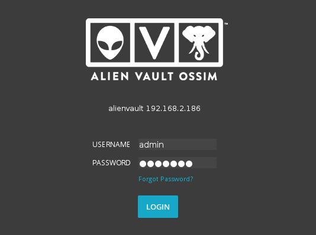

* Ossim sekmelerinde **Configuration->Administration** seçilir.
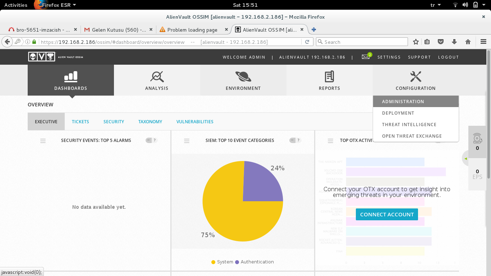

* Bu sekme içerisinde kullanıcı eklenilir, silinir veya değişiklik yapılabilmektedir. Yeni kullanıcı eklemek için new seçilir.

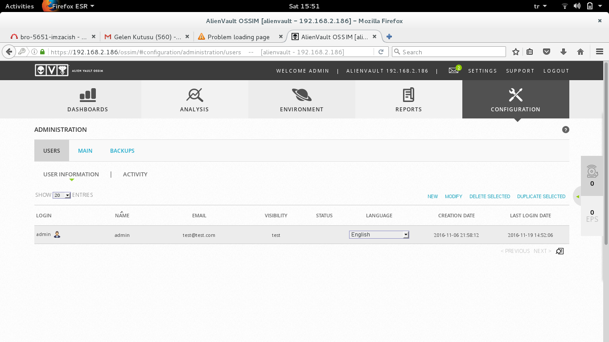

* Açılan yeni sekme içerisinde oluşturulacak yeni kullanıcının bilgileri girilmelidir. Burada "**ENTER YOUR CURRENT PASSWORD" içerisinde admin'in password'ü girilmelidir.  "**ASK TO CHANGE PASSWORD AT NEXT LOGIN**" seçeneğinin "yes" seçilmesi ile yeni kullanıcı ilk login olduğu zaman kullanıcıdan yeni bir password oluşturması istenilir. "**MAKE THIS USER A GLOBAL ADMIN**" seçeneği oluşturulan yeni kullanıcının "**admin**" yetkilerine sahip olmasını sağlar.


*  Admin yetkilerine sahip olmayan bir kullanıcının "**ALLOED MENUS**" seçeneği ile Ossim Arayüzü içerisinde bulunan menulerde erişim kısıtlaması yapılabilmektedir. Oluşturulan yeni kullanıcının hangi menuleri görüntülenmesi istenildiği belirlenir.

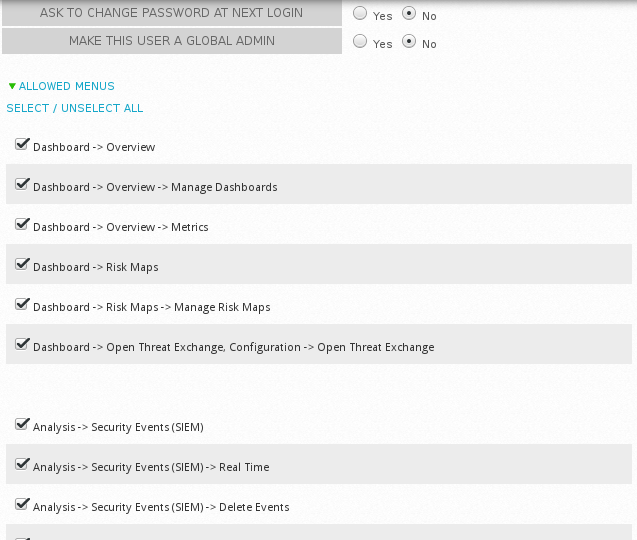

* "**ASSET FILTERS**" seçeneği ile yeni kullanıcının Ossim içerisine bulunan assetler ile ilgili bilgileri görüntülemede kısıtlama yapılabilmektedir. Kullanıcı burada seçilen belirli assetler ile ilgili bilgileri görüntüleyebilmektedir. 

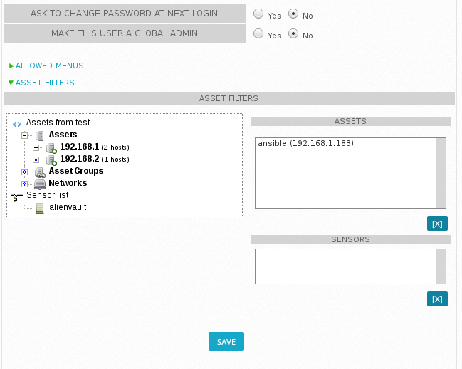

* Kullanıcı oluşturmak için gerekli yerlerin doldurulması tamamlanması ile **SAVE** butonuna basılarak bilgiler kaydedilir ve yeni kullanıcı oluşturulur.

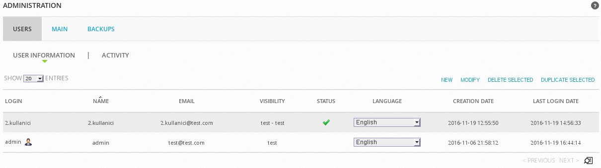

###Risk Analizi ve Yönetimi Yeni Kullanıcı Oluşturma

* Ossim Web Arayüzünden **Environment->SimpleRisk** sekmesi seçilerek simplerisk açılır. Simplerisk'e **admin** kullanıcısı ile giriş yapılır.

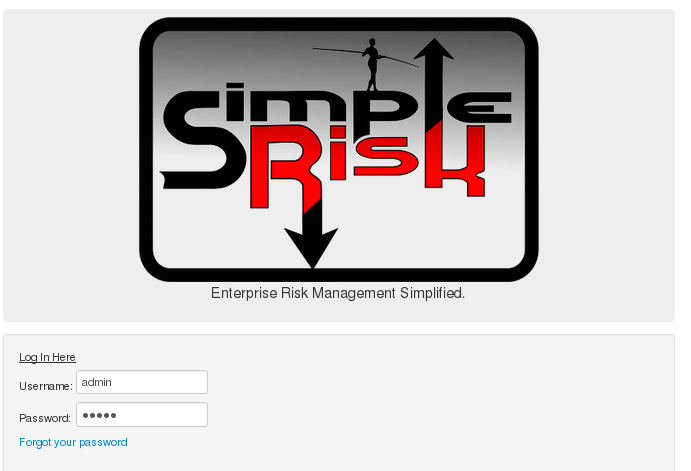

* Simplerisk menusunden "**Configure**" seçilerek ayarlara girilir. Configure sayfasının açılması ile ekranın sol tarafındaki menuden "**User Management**" seçilerek kullanıcı ekleme sayfası açılır.

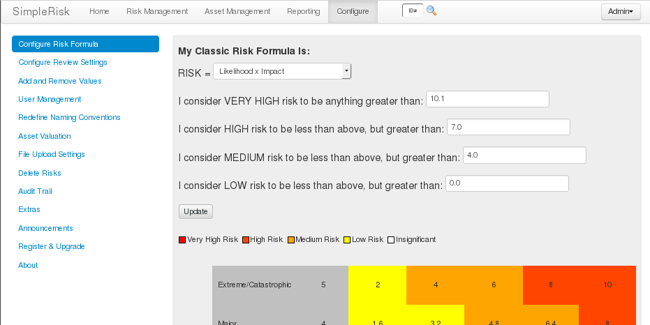

* Kullanıcı ekleme sayfasında öncelikle sayfanın en altına gidilerek **Password Policy** oluşturulmalıdır. Seçenekler içerisinden islenilenler seçilerek update butonu tıklanılarak kaydedilir.

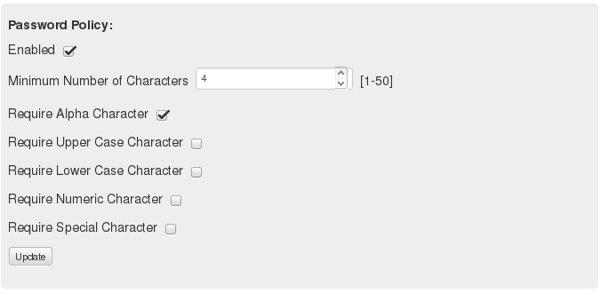

* Kullanıcı ekleme sayfasında "**add a New User:**" içerisinde gerekli yerler doldurulur.

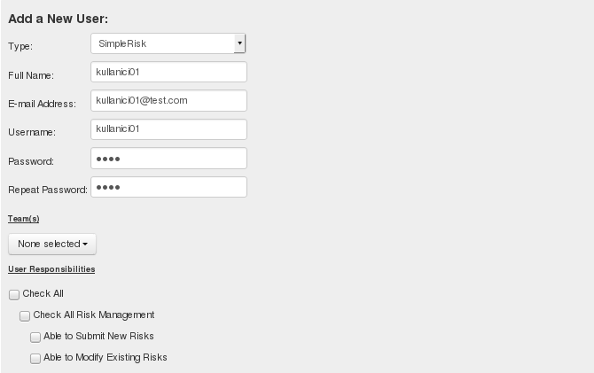

* **Teams** içerisinde oluşturulan yeni kullanıcının hangi takıma ait olduğu seçilir.

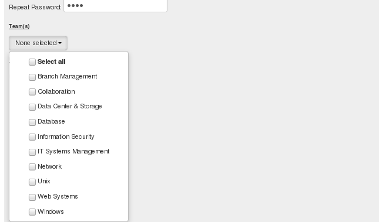

* **User Responsibilities** içerisinde oluşturulan yeni kullanıcının simplerisk menuleri içerinde erişim yetkileri belirlenir.


* Yeni kullanıcı için gerekli bilgilerin girilmesinin tamamlanması ile "**Add**" butonuna basılarak bilgiler kaydedilir.

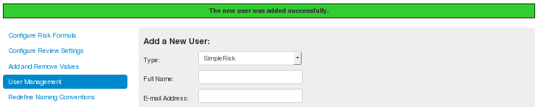

###Gitlab Yeni Kullanıcı Oluşturma

* Gitlab arayüzüne root kullanıcısı ile giriş yapıldıktan sonra sağ üst köşede bulunan "**Admin Area**" simgesine basılarak sisteme tanımlanması gereken kullanıcıları oluşturmak için "**Yönetici Bölümüne**" geçiş yapılır.

![Gitlab](../img/gitlab40.png

* Yönetici bölümünde "**Users**" bölümünde yer alan **NEW USER** butonuna basılır.

![Gitlab](../img/gitlab41.png

* Oluşturulacak yeni kullanıcı için gerekli olan "**Name**", "**Username**" ve "**Email**" alanları doldurularak "**CREATE USER**" butonuna basılır. 

![Gitlab](../img/gitlab42.png

* Kullanıcı oluşturulduktan sonra, ilgili kullanıcıya ait bilgilendirme sayfası açılmaktadır. Bu sayfada kullanıcıya şifre oluşturmak için "**EDIT**" butonuna basılır.

![Gitlab](../img/gitlab43.png

* Açılan ekranda "**Password**" bölümünden yeni kullanıcı için parola belirlenir ve sayfanın en altında bulunan "**SAVE CHANGES**" butonuna basılır.

![Gitlab](../img/gitlab44.png

* Oluşturulan yeni kullanıcının istenilen duruma göre gitlab üzerindeki projelere erişim yetkileri düzenlenmelidir.
* **Ahtapotops** kullanıcısına geçiş yapılarak yeni kullanıcının erişmesi istenilen proje seçilir.
* Projenin sayfası açılması ile sol tarafta bununan menu içerisinden "**Members**" seçilmelidir.
* **Add new user to project** sayfası içerisinde "**People**" alanına eklenilmesi istenilen yeni kullanıcı seçilir. "**Project Access**" alanı içerisine yeni kullanıcı için bu proje içerisinde nasıl bir yetki verileceği seçilir. **Add users to project** butonuna basılarak kaydedilir.

![Gitlab](../img/gitlab45.png

* Bulunan sayfanın alt kısmında eklenilen yeni kullanıcı member olarak görüntülenebilecektir.

 cs(Cookie) cs(Referer) cs-host sc-status sc-substatus sc-win32-status sc-bytes cs-bytes time-taken
```
* Nxlog ile alınan log örneği:
```
2016-08-24 14:38:25 172.16.19.210 - FTPSVC3 ULKABIM-WIN - 172.16.19.210 21 USER test 331 0 0 33 11 0 8862988c-3fd2-420d-809e-b4161099a0ab -
```
* Ossec FTP decoderı log içerisinde MSFTPSVC kelimesini yakalayarak kurallarden geçiriyor ama test ortamında oluşturulan loglar ossecin istediğinden farklı olarak FTPSVC olarak gelmektedir bu sebeple ossec'in nxlog ile alınan logları decoder ve kurallardan geçirilebilmesi için bazı değişiklikler yapılmalıdır.

* Locol decoder oluşturularak logları MSFTPSVC yerine FTPSVC ile yakalanması sağlanmalıdır
```
local_decoder.xml 
<decoder name="msftp-ulakbim">
  <parent>windows-date-format</parent>
  <use_own_name>true</use_own_name>
  <prematch offset="after_parent">^\d+.\d+.\d+.\d+ \S+ FTPSVC</prematch>
  <regex offset="after_parent">^(\d+.\d+.\d+.\d+) (\S+) \S+ \S+ \S+ </regex>
  <regex>\d+ [\d+](\S+) \S+ \S+ (\d+) </regex>
  <order>srcip,user,action,id</order>
</decoder>
```
* Decoder oluşturulmasıyla tetiklenen 1. kural overwrite yapılarak yeni decoder ile decode edilmesi sağlanmalıdır.
```
local_rules.xml
<group name="syslog,msftp,">
  <rule id="11500" level="0" overwrite="yes">
    <decoded_as>msftp-ulakbim</decoded_as>
    <description>Grouping for the Microsoft ftp rules.</description>
  </rule>
</group>
```
**Windows IIS server log**

* Microsoft IIS logların alınması için nxlog.conf içerisinde logun yazıldığı dosya okutularak ossimcik içerisine gönderilmelidir.
```
<Input in2>
    Module im_file
    File "C:\inetpub\logs\LogFiles\W3SVC2\u_*" 
     ReadFromLast TRUE
        Exec $Message = $raw_event;

</Input>

<Output out2>
    Module      om_ssl
    Host        172.16.16.89
    Port        6514
    CAFile      %ROOT%\keys\rootCA.pem
    CertFile    %ROOT%\keys\win.crt
    CertKeyFile %ROOT%\keys\win.key
    AllowUntrusted   TRUE
    Exec $Message = $raw_event;
</Output>
<Route 1>
    Path        in2 => out2
</Route>
```

* Microsoft IIS içerisinde log oluşturucak format ayarlanabilinmektedir. Ossecin kurallardan geçirebilmesi için w3c formatindo loglar olmalıdır ve logların içerisinde aşağıdaki bilgiler bulunmalıdır.
```
date time s-sitename s-computername s-ip cs-method cs-uri-stem cs-uri-query s-port cs-username c-ip cs-version cs(User-Agent) cs(Cookie) cs(Referer) cs-host sc-status sc-substatus sc-win32-status sc-bytes cs-bytes time-taken
```
* Nxlog ile alınan log örneği:
```
2016-08-24 10:05:07 W3SVC2 ULAKBIM-WIN 172.16.19.210 GET /images/7/Email.png - 876 - 172.16.19.210 HTTP/1.1 Mozilla/5.0+(Windows+NT+6.1;+WOW64)+AppleWebKit/537.36+(KHTML,+like+Gecko)+Chrome/52.0.2743.82+Safari/537.36+OPR/39.0.2256.48 - http://172.16.19.210:876/ 172.16.19.210:876 404 0 2 5375 401 1
```
* Ossec içerisinde iis logları kurallardan geçirebilinmesi için localfile da nxlogtan okunan log dosyası için logformat olarak iis yapılır.
```
  <localfile>
    <log_format>iis</log_format>
    <location>/var/log/nxlog/client.log*</location>
  </localfile>
```
* Windows dosya sunucusunda paylaşılan dosyalar ile erişim bilgilerinin eventlerinin oluşması için windpws içerisinde local group policy içerisinde Local Computer Policy > Computer Configuration > Windows Settings > Security Settings > Local Policies Audit Policy içerisinde Audit Object Access üzerine gelinerek success ve failure seçilir.
Windows içerisinde event viewerda Audit logları Security başlığı altında gelmektedir.
```
5140     A network share object was accessed
5142     A network share object was added.
5143     A network share object was modified
5144     A network share object was deleted. 
```
* Nxlog ile alınan örnek log:
```
Aug 24 19:33:03 ULAKBIMServer.ahtapot.local MSWinEventLog    1    Security    3865    Wed Aug 24 19:33:03 2016    5140    Microsoft-Windows-Security-Auditing    N/A    N/A    Success Audit    ULAKBIMServer.ahtapot.local    File Share        A network share object was accessed.     Subject:   Security ID:  S-1-5-21-594319302-455822562-4206425716-1105   Account Name:  DESKTOP-9OCKMBU$   Account Domain:  ULAKBIM   Logon ID:  0x675DDC    Network Information:    Object Type:  File   Source Address:  172.16.19.102   Source Port:  50764     Share Information:   Share Name:  \\*\IPC$   Share Path:      Access Request Information:   Access Mask:  0x1   Accesses:  ReadData (or ListDirectory)            158275
```


**Sayfanın PDF versiyonuna erişmek için [buraya](siem-kullanim.pdf) tıklayınız.**
