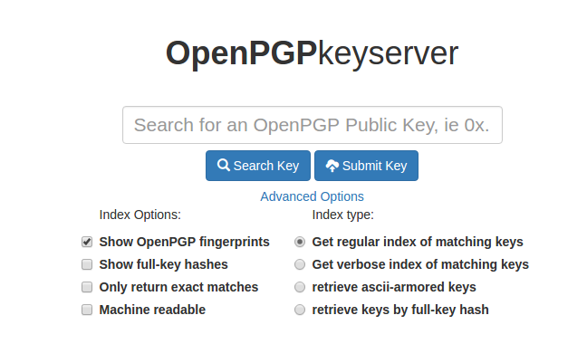
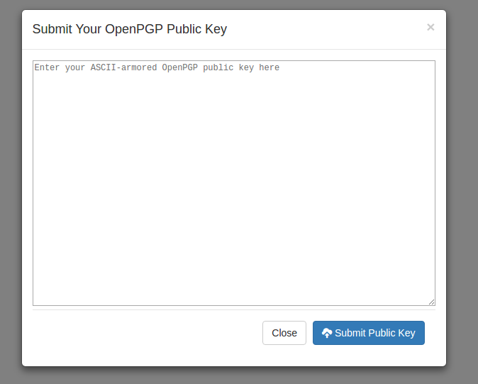

### Sks ve pgpkeyserver-lite
Ahtapot projesi kapsamında sks ve pgpkeyserver-lite işlevinin kurulumunu ve yönetimini sağlayan playbook’dur. “**/etc/ansible/playbooks/**” dizini altında bulunan “**sks.yml**” dosyasına bakıldığında, “**hosts**” satırında Ansible’a ait “**/etc/ansible/**” altında bulunan “**hosts**” dosyasında “**[sks]**” satırı altına yazılmış tüm sunucularda bu playbookun oynatılacağı belirtilir. “**sudo**” satırı ile çalışacak komutların sudo yetkisi ile çalışması belirlenir. “**vars_files**” satırı sks playbookunun değişken dosyalarını belirtmektedir. “**roles**” satırı altında bulunan satırlarda ise bu playbook çalıştığında “**base**” ve “**sks**”rollerinin çalışacağı belirtilmektedir.


```
- hosts: sks
  sudo: yes
  vars_files:
  - /etc/ansible/roles/base/vars/group.yml
  - /etc/ansible/roles/base/vars/user.yml
  - /etc/ansible/roles/base/vars/repo.yml
  - /etc/ansible/roles/base/vars/rsyslog.yml
  - /etc/ansible/roles/base/vars/ntp.yml
  - /etc/ansible/roles/base/vars/package.yml
  - /etc/ansible/roles/base/vars/kernelmodules_remove.yml
  - /etc/ansible/roles/base/vars/kernelmodules_blacklist.yml
  - /etc/ansible/roles/base/vars/host.yml
  - /etc/ansible/roles/base/vars/audit.yml
  - /etc/ansible/roles/base/vars/sudo.yml
  - /etc/ansible/roles/base/vars/ssh.yml
  - /etc/ansible/roles/base/vars/grub.yml
  - /etc/ansible/roles/base/vars/logger.yml
  - /etc/ansible/roles/base/vars/logrotate.yml
  - /etc/ansible/roles/base/vars/directory.yml
  - /etc/ansible/roles/base/vars/profile.yml
  - /etc/ansible/roles/base/vars/fusioninventory.yml
  - /etc/ansible/roles/sks/vars/main.yml
  roles:
    - role: base
    - role: sks


```

### Sks Rolü Değişkenleri
Bu roldeki değişkenler “**/etc/ansible/roles/sks/vars/**” dizini altında bulunan yml dosyalarında belirtilmiştir. yml dosyalarının içerikleri ve değişken bilgileri aşağıdaki gibidir;

-   “**main.yml**” dosyasında bulunan değişkenlerin görevi şu şekildedir. "**sks_listen_ip**" değişkeni, pgpkeyserver-lite web uygulamasının nginx ile hangi IP üzerinden sunulacağının belirtildiği parametredir.  "**sks_server_name**" ise nginx uygulamasının sunuşacağı sunucunun adıdır.
```
---
sks_listen_ip: 169.254.1.9
sks_server_name: example.org

```

### Pgpkeyserver-lite Kullanımı
#### Anahtarların Çekilmesi
1.  **Arama**  kutusu içine aramak istediğiniz metni yazın. Eğer bir anahtarı hexadecimal anahtar kimliği (KeyID) ile aramak istiyorsanız arama anahtarını 0x ile başlatmanız gerekir. 
2.  **Index**  veya  **Verbose Index** kutucuklarından birini seçin.  **Verbose**  seçeneği anahtarların imzalarını da gösterecektir.
3.  **Submit**  tuşuna basın.



#### Anahtarların Gönderilmesi
1.  Açık anahtarınızın ASCII-armored versiyonunu metin kutusu içine kopyalayıp yapıştırın.
2.  **Submit Public Key** tuuşuna basın.


