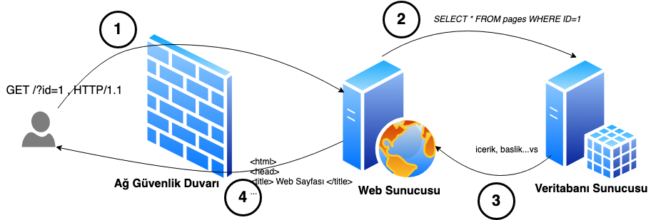
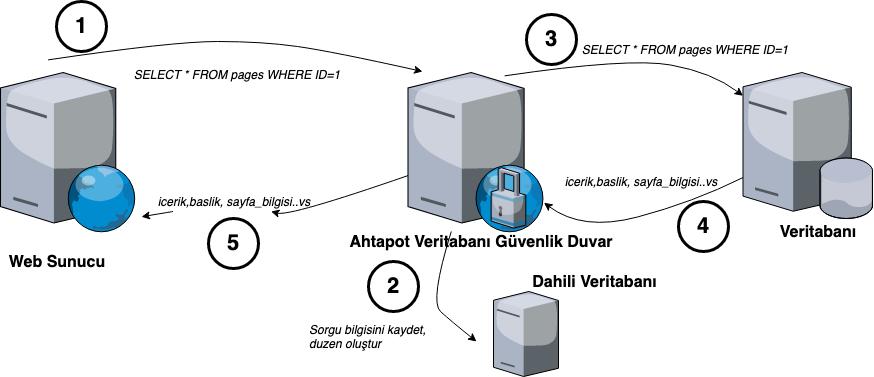

### Veritabanı Güvenlik Duvarı Kullanımı
Ahtapot projesi kapsamında entegre edilen Veritabanı Güvenlik Duvarı, go dilinde yazılmıştır. Ahtapot Veritabanı Güvenlik Duvarının kurulum ve Konfigürasyonu “**/etc/ansible/playbooks/**” dizini altında bulunan “**dbfirewall.yml**” dosyasına bakıldığında, “**hosts**” satırında Ansible’a ait “**/etc/ansible/**” altında bulunan “**hosts**” dosyasında “**[dbfirewall]**” satırı altına yazılmış tüm sunucularda bu playbookun oynatılacağı belirtilir.
 “**sudo**” satırı ile çalışacak komutların sudo yetkisi ile çalışması belirlenir. “**vars_files**” satırı dbfirewall playbookunun değişken dosyalarını belirtmektedir. “**roles**” satırı altında bulunan satırlarda ise bu playbook çalıştığında “**base**” ve “**database-firewall**”rollerinin çalışacağı belirtilmektedir.

### Dikkat!
Ahtapot Veritabanı Güvenlik Duvarı, bir veritabanı sunucusuna ya da web sunucusuna kurulacak ise, “**/etc/ansible/playbooks/dbfirewall.yml**” dosyasından, base ve post rollerinin # ile kapatılarak çalıştırılması tavsiye edilir. Bu roller **Ahtapot BSGS** bileşeneleri için güvenlik sıkılaştırmaları uyguladığından, bileşenler haricindeki uygulamaların bu sıkılaştırmalardan sonra çalışmaması ya da doğru çalışmamasına sebep olabilir.

## Ahtapot Veritabanı Güvenlik Duvarı Nasıl Çalışır?
Klasik anlamda, bir web sunucusu veritabanı sunucusu ile, doğrudan iletişim kurar. 


Ahtapot Veritabanı Güvenlik Duvarını sisteme eklediğimizde, veritabanı önünde bir güvenlik katmanı oluşturarak, anormal SQL isteklerini tespit ederiz. Anormal istekleri tespit etmek için Ahtapot Veritabanı Güvenlik Duvarı, öncelikle öğrenme modunda (learning) çalışır ve dahili veritabanına, bir düzen oluşturur(düzen bilgisi, sorgular, kullanıcılar, kaynak adresler, zaman gibi bilgilerden oluşmaktadır). 



Yeterli düzen bilgisini topladıktan sonra Ahtapot Veritabanı Güvenlik Duvarını, koruma modunda (protect) çalıştırır. Artık Ahtapot Veritabanı Güvenlik Duvarı, toplamış olduğu düzen bilgisine uymayan, anormal istekleri tespit ederek, konfigürasyonda belirtilen aksiyonları alacaktır.

Örnek Log formatı; 

```
2019/06/15 16:25:31 [INFO]  Config file: /etc/dbshield.yml
2019/06/15 16:25:31 [INFO]  Internal DB: /tmp/model/10.0.0.21_postgres.db
2019/06/15 16:25:31 [INFO]  Listening: 0.0.0.0:5000
2019/06/15 16:25:31 [INFO]  Backend: postgres (10.0.0.21:5432)
2019/06/15 16:25:31 [INFO]  Protect: true
2019/06/15 16:25:31 [INFO]  Web interface on https://127.0.0.1:8070/
2019/06/15 16:25:33 [INFO]  Connected from: 10.0.0.20:35910
2019/06/15 16:25:33 [INFO]  Connected to: 10.0.0.21:5432
2019/06/15 16:25:33 [INFO]  SSL connection
2019/06/15 16:25:34 [DEBUG] Client handshake done
2019/06/15 16:25:34 [DEBUG] Server handshake done
2019/06/15 16:25:34 [INFO]  User: postgres
2019/06/15 16:25:34 [INFO]  Database: test
2019/06/15 16:25:34 [INFO]  Query: SELECT * FROM kullanicilar where id=-1 or 1=1
2019/06/15 16:25:34 [WARN]  Pattern not found: [53 55 51 52 55 52 50 53 55 51 53 49 115 116 111 99 107 115 53 55 51 53 50 105 100 54 49 52 53 53 55 51 55 57 53 55 52 48 52 53 55 51 55 57 54 49 53 55 51 55 57] (SELECT * FROM kullanicilar where id=-1 or 1=1)
2019/06/15 16:25:34 [WARN]  Dropping connection

```


---
## Desteklenen Veritabanları:

| Veritabanı     | Koruma | SSL |
|:------------:|:-------:|:---:|
| **DB2**   | **✓** | **✗**  |
| **MariaDB**  | **✓** | **✓** |
| **MySQL**    | **✓** | **✓** |
| **Oracle**   | **✓** | **✗**  |
| **Postgres** | **✓** | **✓** |

---

