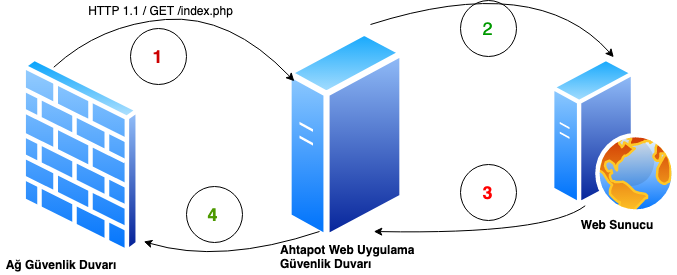
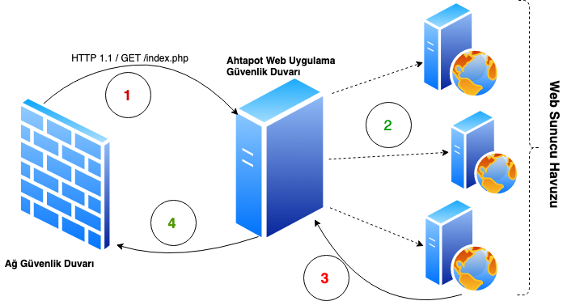

## Ahtapot Web Uygulama Güvenlik Duvarı Kullanımı
Ahtapot projesi kapsamında entegre edilen Web Uygulama Güvenlik Duvarı, Apache web server ve ModSecurity ile entegre kullanılmaktadır. 
Ahtapot Web Uygulama Güvenlik Duvarının kurulum ve Konfigürasyonu “**/etc/ansible/playbooks/**” dizini altında bulunan “**waf.yml**” dosyasına bakıldığında, “**hosts**” satırında Ansible’a ait “**/etc/ansible/**” altında bulunan “**hosts**” dosyasında “**[waf]**” satırı altına yazılmış tüm sunucularda bu playbookun oynatılacağı belirtilir.
 “**sudo**” satırı ile çalışacak komutların sudo yetkisi ile çalışması belirlenir. “**vars_files**” satırı dbfirewall playbookunun değişken dosyalarını belirtmektedir. “**roles**” satırı altında bulunan satırlarda ise bu playbook çalıştığında “**base**” ve “**waf**”rollerinin çalışacağı belirtilmektedir.

### Ahtapot Web Uygulama Güvenlik Duvarı Nasıl Çalışır?
Klasik anlamda, bir web sunucusunun önüne geçerek, tüm istekleri kendi üzerinden geçirmek kaydıyla, bu istekleri kural tabanlı kontrol ederek, uygun olan isteklere izin verip, kurallara takılanları bloke etme şeklinde çalışır.

Ahtapot Web Uygulama Güvenlik Duvarını sisteme eklediğimizde, Web Sunucuları önünde bir güvenlik katmanı oluşturarak, kurallara takılan anormal SQL isteklerini tespit ederiz. Anormal istekleri tespit etmek için Ahtapot Veritabanı Güvenlik Duvarı, öncelikle öğrenme modunda (learning) çalışır ve dahili veritabanına, bir düzen oluşturur(düzen bilgisi, sorgular, kullanıcılar, kaynak adresler, zaman gibi bilgilerden oluşmaktadır). 

### Ahtapot Web Uygulama Güvenlik Duvarı Yük Dengeleme

Ahtapot Web Uygulama Güvenlik Duvarı, WAF görevlerini yerine getirirken, yüksek trafik ya da yüksek erişilebilirlik amacıyla kurulan web sunucuları arasında sağlık kontrolü ve yük dağılımını yapabilmektedir. Yük Dengelemeyi devreye almak için kurulum konfigürasyonundaki ilgili parametreleri ayarlamanız yeterli olacaktır. Dikkat edilmesi gereken husus, Ahtapot Web Uygulama Güvenlik duvarının, hen ağ güvenlik duvarı tarafındaki ağ ile, hemde sunucu havuzu ile iletişim kurabiliyor olması gerekmektedir. İlgili ayarları , güvenlik duvarından ya da ağ yönlendiricinizden yapabilirsiniz.

