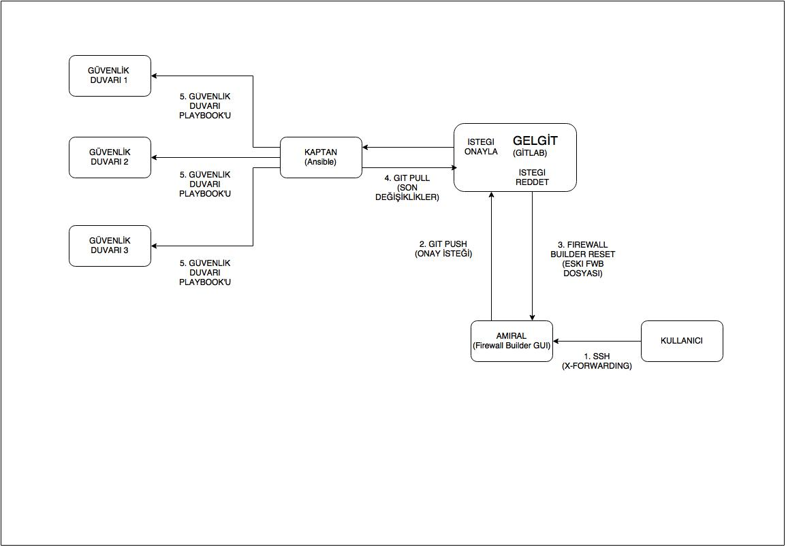
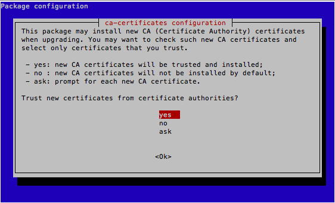
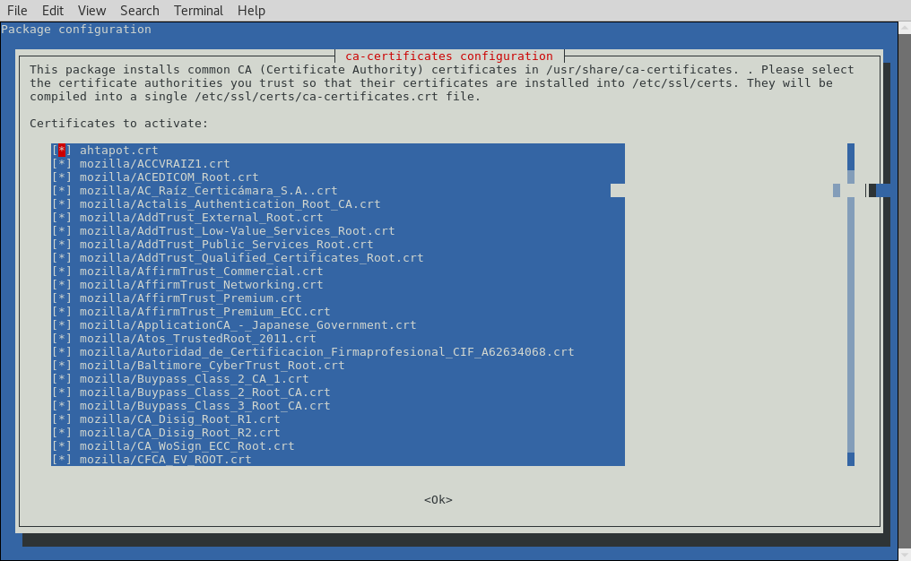
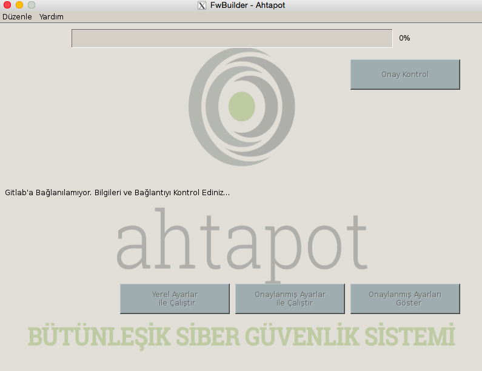
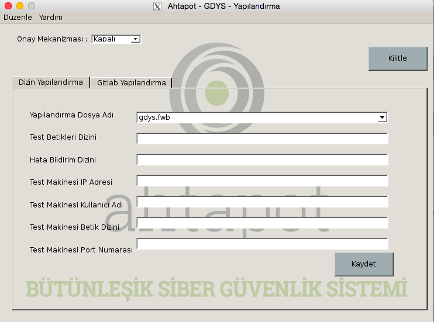
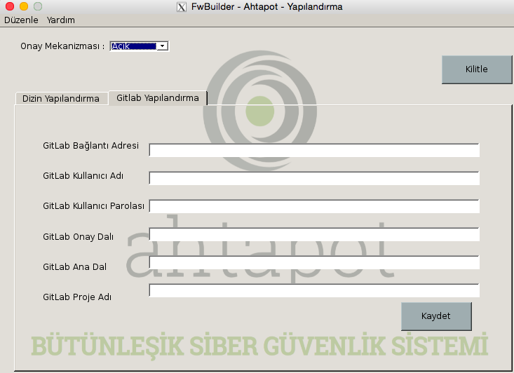
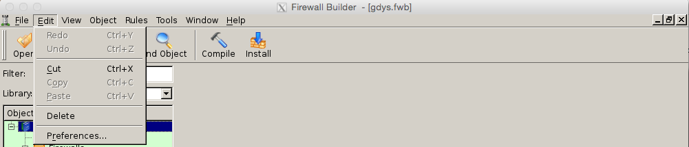
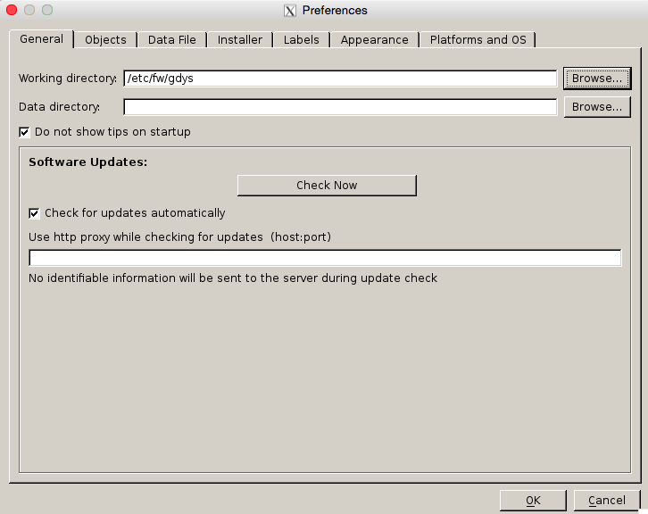
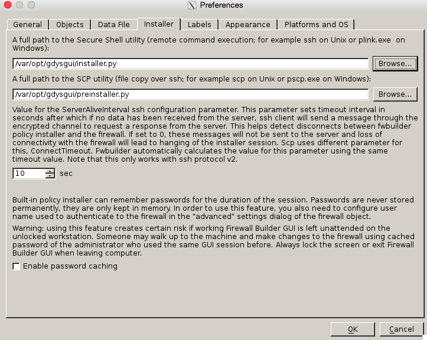

# GDYS Kurulum Yönergesi
------

[TOC]

Bu dokümanda, Ahtapot projesi kapsamında geliştirilmiş Güvenlik Duvarı Yönetim Sistemi’nin (GDYS) kurulum adımları belirtilmektedir.


####GDYS Önemli Uyarılar

 1. Bütünleşik yapıya ait GDYS kurulumunun dokümanda belirtilen sıralamaya göre yapılması mecburidir. Bu sıralamanın dışana çıkılması entegrasyonun düzgün **gerçekleşmemesine** neden olacaktır.
 2. Test ortamı amaçlı yapılacak kurulumlarda, TÜBİTAK ULAKBİM tarafından sağlanan anahtarlar kullanılacak ise, oluşturulacak makinalardın domain adreslerinin “gdys.local” olması zaruridir. Aksi durumlarda sistemlerin çalışmasında sorun yaşanabilmektedir.

GDYS sistemi temel olarak, Merkezi Yönetim Sistemi (MYS) ve Merkezi Sürüm Takibi (GitLab) kullanılarak sunucu kurulum ve ilk yapılandırmalarının gerçekleştirilmesi işlemlerini sağlamakta ve merkez ile bağlantısı bulunan uç güvenlik duvarı birimlerinde, kural girişi gibi güvenlik duvarı yönetim işlerinin bir onay mekanizmasına tabii tutularak merkezi ve kontrollü olarak gerçekleştirilmesi işlemlerini yerine getirmektedir.


####GDYS Çalışma Prensip Şeması
GDYS sisteminin ve bağlı merkezi sistem yönetiminin nasıl işlediğini gösterir akış şeması aşağıdaki gibidir.




####GDYS Çalışma Prensibi Açıklamaları
Yukarıdaki şemada gösterildiği üzere GDYS sisteminin çalışma prensibini tanımlayan işleyiş listesi şöyledir:

1. Firewall kuralı ekleme kaldırma gibi yönetimsel işleri yapacak olan personelin istemci bilgisayarından, üzerinde firewall builder kurulu olan ve GDYS’nin ana bileşenlerinden birisi olan Firewall Builder uygulamasının kurulu olduğu sunucuya kısıtlandırılmış SSH anahtar mekanizmasıyla ve SSH x-forwarding ile açılan tünel içerisinden “Güvenlik Duvarı Yönetim Sistemi Kontrol Paneli” uygulamasına kontrollü olarak ulaşılır.

2. “Güvenlik Duvarı Yönetim Sistemi Kontrol Paneli” detaylı olarak “AHTAPOT Merkezi Güvenlik Duvarı Yönetim Sistemi” dokümanında anlatıldığı üzere Firewall Builder isimli GUI uygulamasının hangi koşullarda çalıştırılacağını belirleyen ana uygulamadır. Bu uygulama üzerinde Firewall Builder GUI uygulaması çalıştırılır.

3. Firewall Builder arayüzünden, kural ekleme çıkarma gibi ihtiyaç duyulan işlemler yapılır ve standart Firewall Builder işleyişinde olduğu gibi “install” butonu kullanılarak değişiklikler sisteme yansıtılır.

4. Yukarıdaki adım vasıtası ile Firewall Builder tarafından uç güvenlik duvarlarında yapılması istenen değişiklikler öncelikli olarak güvenlik duvarı rolüne sahip bir test makinası üzerinde söz dizimi bakımından test edilir, herhangi bir hata alınmaması durumunda da yetkili onayına sunulmak üzere, onay mekanizmasının merkezinde bulunan GitLab sunucusu üzerindeki bir git deposuna eklenme talebi (merge request) olarak gönderilir. “merge-request” şeklinde iletilen değişiklik talepleri yetkili tarafından onaylandıklarında ilgili uç birim güvenlik duvarlarına uygulanmak üzere ansible makinasının erişeceği ana git deposuna aktarılır.

5. Ansible makinası tarafından belirlenen aralıklar ile GitLab’ a bağlantı kurarak değişiklik olup olmadığını kontrol edilir. Değişiklik olması durumda değişiklikleri ve hangi uç birim güvenlik duvarlarına uygulanacağı bilgisini alarak, otomatize edilmiş bir şekilde uç sistemlerde uygulanması sağlanır. Bu şekilde Firewall Builder arayüzünden yapılan değişiklikler ilgili uç birim güvenlik duvarlarında öncesinde onaydan geçerek devreye alınır. Değişiklik talepleri onaydan geçememeleri durumunda, reddedilir ve uç birim güvenlik duvarlarında devreye alınmaksızın yok sayılır.


###GDYS Kurulum Adımları
 1. GDYS yapısına ait ana bileşenleri oluşturmak amacı ile “AHTAPOT Pardus Temel ISO Kurulumu” dokümanı kullanılarak GDYS sistemi olarak kullanılacak, Güvenlik Duvarlarının ISO kurulumları yapılır.

 2. “AHTAPOT Güvenlik Duvarı Kurulumu” dokümanı takip edilerek, proje kapsamında kullanılacak Güvenlik Duvarı sunucuları kurulur.

 3. "AHTAPOT Güvenlik Duvarı Yönetim Sistemi Entegrasyonu" dokümanı takip edilerek, sistem kullanıma hazır hale getirilir.


#Güvenlik Duvarı Kurulumu 


Bu dokümanda, Ahtapot bütünleşik güvenlik yönetim sisteminde kullanılan güvenlik duvarlarının kurulum prosedürü anlatılıyor.

Gereken : 
Pardus Temel ISO’ dan kurulumu tamamlanmış bir sunucu.


##Kurulum İşlemleri

* **NOT:** Dökümanda yapılması istenilen değişiklikler gitlab arayüzü yerine terminal üzerinden yapılması durumunda playbook oynatılmadan önce yapılan değişiklikler git'e push edilmelidir.

```
$ cd /etc/ansible
git status komutu ile yapılan değişiklikler gözlemlenir.
$ git status  
$ git add --all
$ git commit -m "yapılan değişiklik commiti yazılır"
$ git push origin master
```
**NOT:** Kurulacak sistem, SIEM yapısına dahil edilmek isteniyorsa, kurulum sonrasında Siber Olay, Açıklık, Risk İzleme ve Yönetim Sistemi Kurulumu sayfasında bulunan [LMYS Clientlarında Ossec Agent Dağıtımı](siem-kurulum.md) başlığı incelenmelidir.

 * Pardus Temel ISO dosyasından Pardus kurulumu tamamlandıktan sonra sisteme “**ahtapotops**” kullanıcı ile giriş yapılır. ahtapotops kullanıcısının parolası “**LA123!!**” olarak öntanımlıdır.

**NOT :** Pardus Temel ISO dosyasından Pardus kurulumu adımları için “AHTAPOT Pardus Temel ISO Kurulumu” dokümanına bakınız.


  * Sisteme giriş sağlandıktan sonra, aşağıdaki komut ile root kullanıcısına geçiş yapılır. root kullanıcısı için parola Pardus Temel ISO kurulumda belirlenen paroladır.

```
$ sudo su -
```
* Sisteme root kullanıcısı ile bağlantı sağlandıktan sonra tercih ettiğiniz bir metin düzenleyicisini kullanarak "**/etc/apt/source.list**" dosyasına aşağıdaki satır eklenmelidir.

```
deb http://depo.pardus.org.tr/ahtapot yenikusak main
```

* Aşağıdaki komut ile ansible ve git kurulumları yapılır.

```
# apt-get install -y ansible
# apt-get install -y git
```

  * Bu adımda kurulum, sıkılaştırma vb. gibi işleri otomatize etmeyi sağlayan ansible playbook’ları Pardus Ahtapot reposundan indirilir. 

```
# apt-get install -y ahtapot-mys
# cp -rf /ahtapotmys/* /etc/ansible/
```

  * Ahtapot projesi kapsamında oluşacak tüm loglar “**/var/log/ahtapot/**” dizinine yazılmaktadır. Bu dizinin sahipliğini “**ahtapotops**” kullanıcısına vermek için aşağıdaki komut çalıştırılır.

```
# chown ahtapotops:ahtapotops -R /var/log/ahtapot
```

  * vi metin düzenleyicisini kullanarak "**/etc/ansible**" altında bulunan "**hosts**" dosyasını düzenlenir.Açılan dosyada [firewall] kısmı altına  Güvenlik Duvarı makinasının tam ismi (FQDN) girilir.

```
$ sudo vi hosts
[firewall]
fw01.alan.adi
```
* “**roles/base/vars**” klasörü altında ntp değişkenlerinin barındıran “**ntp.yml**” dosyası içerisine "**base_ntp_servers**" fonksiyonu altında bulunan "**server1**" ve "**server2**" satırları altına NTP sunucularının FQDN bilgileri girilmelidir. Sistemde bir NTP sunucusu olduğu durumda "**server2**" satırları silinebilir yada istenildiği kadar NTP sunucusu eklenebilir. 

```
$ cd roles/base/vars/
$ sudo vi ntp.yml
# Zaman sunucusu ayarlarini iceren dosyadir.
# Yorum satiri ile gosterilen sablon doldurularak istenilen kadar zaman sunucusu eklenebilir.
ntp:
    conf:
        source: "ntp.conf.j2"
        destination: "/etc/ntp.conf"
        owner: "root"
        group: "root"
        mode: "0644"
    service:
        name: "ntp"
        state: "started"
        enabled: "yes"

base_ntp_servers:
    server1:
        fqdn: "rsyslog01.gdys.local"
    server2:
        fqdn: "rsyslog02.gdys.local"
#    serverX:
#        fqdn: ""
```

* "**roles/base/vars**” klasörü altında rsyslog değişkenlerinin barındıran “**rsyslog.yml**” dosyası içerisine "**base_rsyslog_servers**" fonksiyonu altında bulunan “**server1**” ve “**server2**” satırları altına rsyslog sunucularına ait bilgiler girilmelidir. Sistemde bir rsyslog sunucusu olduğu durumda “**server2**” satırları silinebilir yada istenildiği kadar rsyslog sunucusu eklenebilir. 

```
$ cd roles/base/vars/
$ sudo vi rsyslog.yml
# Log sunucu ayarlarini iceren dosyadir.
# Yorum satiri ile gosterilen sablon doldurularak istenilen kadar log sunucusu eklenebilir.
rsyslog:
    conf:
        source: "rsyslog.conf.j2" 
        destination: "/etc/rsyslog.conf" 
        owner: "root" 
        group: "root" 
        mode: "0644" 
    service:
        name: "rsyslog" 
        state: "started" 
        enabled: "yes"
    ActionQueueMaxDiskSpace: "2g"
    ActionQueueSaveOnShutdown: "on" 
    ActionQueueType: "LinkedList" 
    ActionResumeRetryCount: "-1" 
    WorkDirectory: "/var/spool/rsyslog" 
    IncludeConfig: "/etc/rsyslog.d/*" 

base_rsyslog_servers:
    server1:
        fqdn: "rsyslog01.gdys.local" 
        port: "514" 
        connectiontype: "udp"
        severity: "local5" 
        facility: "*"
    server2:
        fqdn: "rsyslog02.gdys.local" 
        port: "514" 
        connectiontype: "tcp" 
        severity: "*" 
        facility: "info"
#    serverX:
#        fqdn: "" 
#        port: "" 
#        connectiontype: "" 
#        severity: "" 
#        facility: ""
```

* "**roles/base/vars**” klasörü altında ssh değişkenlerinin barındıran “**ssh.yml**” dosyası içerisinde bulunan "**Port**" değişkenine istenen yeni değer yazılmalıdır.

```
$ cd roles/base/vars/
$ sudo vi ssh.yml
# Ssh degiskenlerini iceren dosyadir.
ssh:
    conf:
        source: "sshd_config.j2"
        destination: "/etc/ssh/sshd_config"
        owner: "root"
        group: "root"
        mode: "0644"
    service:
        name: "ssh"
        state: "started"
        enabled: "yes"
    TrustedUserCAKeys:
        source: "ahtapot_ca.pub.j2"
        destination: "/etc/ssh/ahtapot_ca.pub"
        owner: "root"
        group: "root"
        mode: "0644"
    RevokedKeys:
        source: "revoked_keys.j2"
        destination: "/etc/ssh/revoked_keys"
        owner: "root"
        group: "root"
        mode: "0644"
    LocalBanner:
        source: "issue.j2"
        destination: "/etc/issue"
        owner: "root"
        group: "root"
        mode: "0644"
    RemoteBanner:
        source: "issue.net.j2"
        destination: "/etc/issue.net"
        owner: "root"
        group: "root"
        mode: "0644"
    Port: "4444" 
    Protocol: "2"
    ListenAddressv4: "0.0.0.0"
    ListenAddressv6: "::"
    UsePrivilegeSeparation: "yes"
    KeyRegenerationInterval: "3600"
    ServerKeyBits: "1024"
    SyslogFacility: "AUTH"
    LogLevel: "DEBUG"
    LoginGraceTime: "90"
    PermitRootLogin: "no"
    StrictModes: "yes"
    RSAAuthentication: "yes"
    PubkeyAuthentication: "yes"
    IgnoreRhosts: "yes"
    RhostsRSAAuthentication: "no"
    HostbasedAuthentication: "no"
    IgnoreUserKnownHosts: "yes"
    PermitEmptyPasswords: "no"
    ChallengeResponseAuthentication: "no"
    PasswordAuthentication: "no"
    KerberosAuthentication: "no"
    KerberosOrLocalPasswd: "yes"
    KerberosTicketCleanup: "yes"
    GSSAPIAuthentication: "no"
    GSSAPICleanupCredentials: "yes"
    X11Forwarding: "no"
    X11DisplayOffset: "10"
    PrintMotd: "yes"
    PrintLastLog: "yes"
    TCPKeepAlive: "yes"
    UsePAM: "no"
    UseLogin: "no"
```
* Güvenlik Duvarı makinası kurulumu için komut aşağıdaki şekilde yazılır.

```
$ ansible-playbook playbooks/firewall.yml --skip-tag=deploy
```

* Güvenlik Duvarı kurulumu tamamlandıktan sonra sunucu MYS ile yönetileceğinden, sunucu üzerindeki ansible paketi kaldırılır.

```
# dpkg -r ansible
```
#Güvenlik Duvarı Yönetim Sistemi Entegrasyonu
------

Bu dokümanda, Ahtapot bütünleşik güvenlik yönetim sistemi entegrasyonu anlatılıyor.

Gereken : 
CA  kurulumu tamamlanmış sunucu
Ansible kurulumu tamamlanmış sunucu
GitLab kurulumu tamamlanmış sunucu
Firewall Builder kurulumu tamamlanmış sunucu.


####Entegrasyon Adımları

*  Firewall Builder makinasından Güvenlik Duvarı Yönetim Sistemi Kontrol Paneli ile GitLab sunucusuna erişmek için, FirewallBuilder makinasına ssh ile bağlanarak, GitLab sunucusunun SSL sertifikası yüklenir. Bu amaç için, Firewall builder makinasına ahtapotops kullanıcısı ile bağlanılarak root kullanıcısına geçilir.


```
$ ssh ahtapotops@firewallbuilder -p ssh_port -i ahtapotops_kullanici_anahtari
$ sudo su -
```

* Gitlab üzerinde https bağlantısını kullanıldığından, Gitlab tarafında oluşturulmuş sertifika firewallbuilder makinasına tanıtılır. Bu işlem için Firewall Builder makinasında “**/usr/local/share/ca-certificates**” klasörü altına oluşturulan sertifika dosyası kopyalanır.

* Sertifika yüklemek için kullanılacak ncurs menünün açılması için environment ayarlarından “**DEBIAN_FRONTEND**” seçeneği kaldırılır.

```
# unset DEBIAN_FRONTEND
```

* Sertifika yüklemek için aşağıdaki komut çalıştırılır.

```
# dpkg-reconfigure ca-certificates
```

* Açılan ncurs menüden “**Trust new certificates from certificate authorities ?**” seçeneğine “**yes**” cevabı verilir.



* Bir sonraki ekranda “**bilgio.crt**” dosyası seçilerek “**Ok**” butonuna basılır. Ve böylelikle sertifika yükleme işlemi tamamlanmış olur.



* Firewall Builder makinesinin gitlab arayüzüne erişimini sağlamak için makine içerisinde "**ssh-keygen**" komutu ile key oluşturulmalıdır. Aşağıdaki komut çalıştırıldıkdan sonra "**/home/ahtapotops/.ssh**" dizini içerisine public ve private keylerin oluşuturulduğu görülmektedir.

```
ssh-keygen -Lf id_rsa-cert.pub
```
* Gitlab arayüzüne Firewall Builder makinesinin bağlanabilmesi için yukarıda oluşuturulan ve  "**/home/ahtapotops/.ssh**" dizini içerisinde buşunan "**id_rsa.pub**" public keyi Gitlab Kurulum dosyasında antıldığı gibi ssh key olarak eklenmelidir.
* AHTAPOT CA Kurulumu ve Anahtar Yönetimi dokümanında tarif edildiği üzere, her kullanıcı için X11 kullanabilecek ve sadece FirewallBuilder uygulamasına erişebilecek  kısıtlı erişime sahip olacak CA anahtarı oluşturulur. Kullanıcılar için anahtar oluşturulması tamamlandıktan sonra SSH x-forwarding ile açılan tünel içerisinden “**Güvenlik Duvarı Yönetim Sistemi Kontrol Paneli**” uygulamasına kontrollü olarak aşağıdaki komut ile ulaşılır.

```
$ sudo ssh -X ahtapotops@FirewallBuilder_IP -i /anahtarin/dizini/kullanici01
```
* Erişim başarılı bir şekilde sağlandığında, Güvenlik Duvarı Yönetim Sistemi Kontrol Paneli uygulaması otomatik olarak açılacaktır.




* “**Düzenle**” butonu altından “**Yapılandırma Ayarları**” seçilerek ilk kullanım öncesinde yapılması gereken yapılandırma ayarları yapılır. Yapılandırma ayarları ekranında bulunan “**Onay Mekanizması**” seçeneği ile Güvenlik Duvarı Yönetimin Sisteminde yapılacak değişikliklerin onay mekanizmasına dahil olup olmayacağı belirlenir. İlk açılışta “**Kapalı**” olarak gelen seçim onay mekanizmasını devreye almak için “**Açık**” konumuna getirilmelidir. 



* Açıldığında kilitli olarak gelen “**Yapılandırma Ayarları**” üzerinde değişiklik yapmak için “**Kilidi Aç**” butonuna basılır ve açılan ekrana FirewallBuilder Makinesinın “**root**” kullanıcısına ait şifre girilir.
* Değiştirebilir duruma gelen “**Dizin Yapılandırma**” tabında, gerekli bilgi girişleri sağlanır ve “**Kaydet**” butonuna basılır.
    * “**Yapılandırma Dosya Adı**” satırında seçim otomatik olarak gelmektedir. Bu dizin, FirewallBuilder uygulamasına ait yapılandırmayı sakladığı XML dosyası olup, ilk çalıştırıldığında, Yerel GitLab’a konumlandırılmış olan ve içerisinde herhangi bir yapılandırma bulunmayan “**/etc/fw/gdys**” dizininde bulunan “**gdys.fwb**” dosyasından açılmaktadır. Onay mekanizmasının çalışabilmesi için belirtilen dizin altından bu dosyanın seçilmesi zaruridir.
    * “**Test Betik Dizini**” satırında, söz dizimi bakımından kontrol edilmek üzere test Makinesina gönderilmeden önce betiklerin konumlandırılacağı dizindir. Bu satıra “**/home/ahtapotops/testfw/**” yazılması zaruridir.
    * “**Hata Bildirim Dizini**” alanına, test betiklerinde hata alınması durumda ilgili hata ve logunun yazılması için oluşturulmuş ve tüm Ahtapot projesi kapsamında log yapısı için kullanılan “**/var/log/ahtapot/**” dizini girilir. Yapının bütünlüğünü korumak adına belirtilen dizinin girilmesi zaruridir.
    * “**Test Makinesi IP Adresi**” satırına AHTAPOT Test Güvenlik Duvarı Kurulum dokümanı takip edilerek kurulan test güvenlik duvarı makinesinın ip adresi yazılır.
    * “**Test Makinesi Kullanıcı Adı**” bilgisi olarak “**kontrol**” kullanıcısı girilmesi zaruridir.
    * “**Test Makinesi Betik Dizini**” alanı test makinesine gönderilen betiklerin konumlandırılacağı dizini belirtmekte olup, ahtapotops kullanıcısının ana dizini olan “**/home/kontrol/**” olması zaruridir.
    * “**Test Makinesi Port Numarası**” alanı test makinesine bağlantı sağlanırken kullanılacak ssh portunun belirtildiği alandır.
 
 * “**Gitlab Yapılandırma**” tabına geçiş yapılarak, onay mekanizması için AHTAPOT GitLab Kurulum dokümanı takip edilerek yerele kurulmuş olan GitLab sunucusunun bilgileri girilirek “**Kaydet**” butonuna basılır.
    * “**GitLab Bağlantı Adresi**” satırına yerele kurulmuş olan GitLab sunucunun FQDN bilgisi “**https://Gitlabsunucu FQDN**” şeklinde yazılır.
    * “**GitLab Kullanıcı Adı**” satırına “**gdysapi**” kullanıcısının girilmesi zaruridir

    * “**GitLab Kullanıcı Parolası**” satırına “**gdysapi**” kullanıcısı için belirlenmiş olan parolanın girilmesi zaruridir.

    * “**GitLab Onay Dalı**” satırında “**onay**” dalının belirtilmesi zaruridir.

    * “**GitLab Ana Dal**” bilgisi  olarak “**master**” dalının belirtilmesi zaruridir.

    * “**GitLab Proje Adı**” bilgisi olarak “**gdys**” proje adının belirtilmesi zaruridir.

**NOT :** GitLab yapılandırma ekranında girilen bilgilerin  AHTAPOT GitLab Kurulum dokümanı Yapılandırma İşlemleri bölümünde onay mekanizması için oluşturulan proje bilgilerini içermesi zaruridir. Maddelerde belirtilmiş zaruri bilgiler GitLab Kurulum dokümanı takip edilerek yapılan kurulum sonrasında oluşan bilgilerdir. Kurulum aşamasında bu bilgilerden bir ve ya birden fazlasında değişiklik yapılır ise bu adımda değişikliği içeren bilgiler girilmelidir.




* Yapılandırma işlemlerinin tamamlanmasının ardında “**Kilitle**” butonuna basılarak bu alanlarda değişiklik yapılması engellenir. “**x**” işaretine basılarak “**Yapılandırma Ayarları**” ekranından çıkılır.
* Yapılandırma işlemleri tamamlandıktan sonra, “**Çalıştır**” butonları aktif hale gelir. Firewall Builder uygulamasında ilk kullanım ayarlarını yapmak üzere “**Onaylanmış Ayalar ile Çalıştır**” seçeneği seçilirek Firewall Builder arayüzü açılır.


* Açılan Firewall Builder uygulamasına onay mekanizması entegrasyonunda kullanılan betikleri dahil etmek için “**Edit**” seçeneğine basılarak “**Preferences...**” ekranı açılır. 



*  Ayarlar ekranında “**Working directory:**” bölüme GitLab üzerinde bulunan “**gdys**” deposunda çalışmak için “**/etc/fw/gdys**” dizini girilmesi zaruridir. İlgili bilgi girildikten sonra “**Installer**” tabına geçilir.



* “**Installer**” sekmesinde “**A full path to the Secure Shell utility**” bölüme Güvenlik Duvarı Yönetim Sistemi Kontrol Paneli uygulaması kapsamında geliştirilen installer.py betiğinin adresi olan “**/var/opt/gdysgui/installer.py**” satırının; “**A full path to the SCP utility**” bölümüne ise preinstaller.py betiğinin adresi olan “**/var/opt/gdysgui/preinstaller.py**” satırının girilmesi zaruridir. Seçimlerin yapılmasının ardından “**OK**” butonuna basılarak; ana ekrana dönüş yapılır.



* Bu adımlar tamalandıktan sonra GDYS entegrasyon işlemi tamamlanmış, olup kullanıma hazır hale gelmiş olacaktır.

**Sayfanın PDF versiyonuna erişmek için [buraya](gdys-kurulum.pdf) tıklayınız.**
