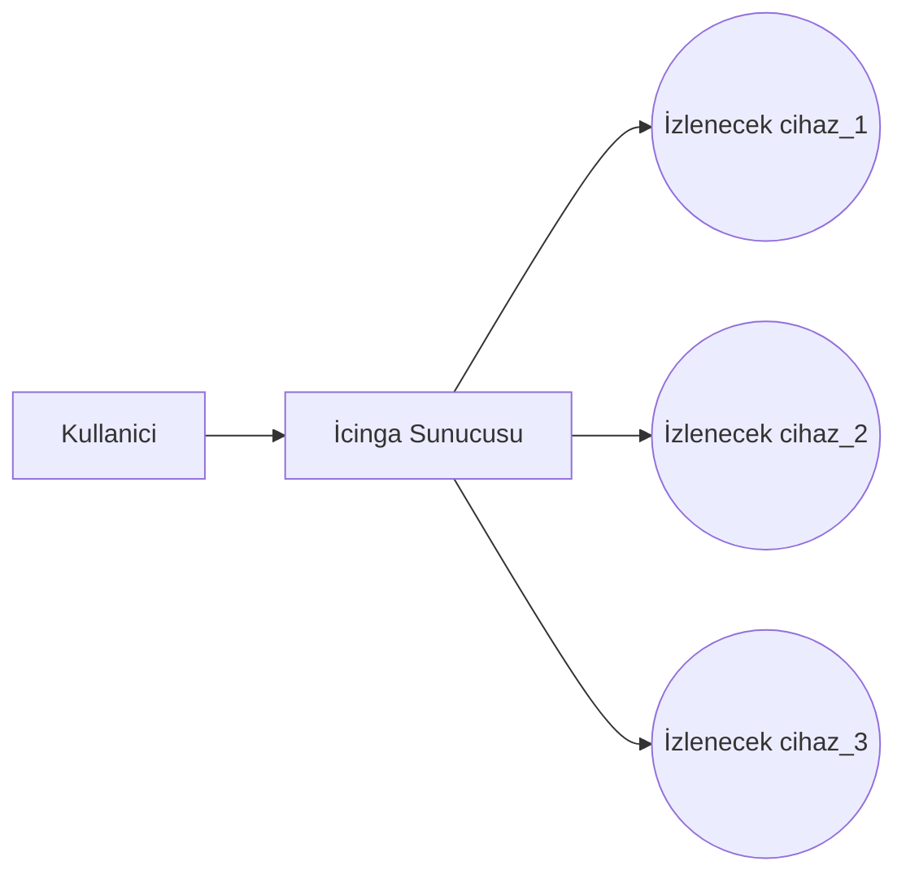
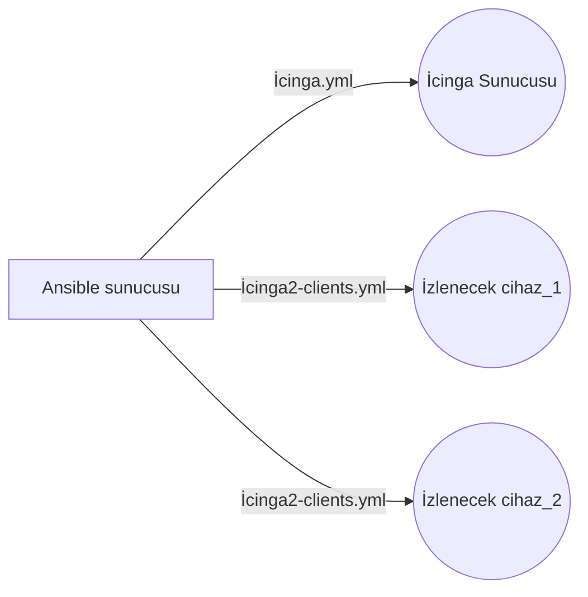

# İcinga Kurulum Yönergesi

Bu dokümanda, Ahtapot projesi kapsamında **İcinga** sunucusunun merkezi yönetim sisteminin ihtiyaçlarına cevap verecek şekilde ansible ile nasıl kurulacağı anlatılmaktadır.



## İcinga - Ansible Bağlantısı

### Playbook ile kurulum
Merkezi yönetim sisteminde cihazları gözlemlemeyi sağlayan İcinga yazılımının, Ansible ile çalışması için hazırlanan hazırlıklar bu kısımda anlatılacaktır.

Ahtapot projesi kapsamında icinga sisteminin çalışması için kullanılan iki adet playbook dosyası vardır. Bunlar "*etc/ansible/playbooks*" dizini altında bulunan **icinga.yml** ve **icinga2-clients.yml** dosyalardır. 



 Bu playbook dosyasının çalışması için öncelikle ansible hosts dosyasında, icinga dizinine sunucu eklenmiş olması gerekmektedir. Bu dosya "*etc/ansible*" dizini altında bulunur. Bu dosya içerisine ilgili cihazın IP bilgisi veya fqdn yazılmalıdır.

```
$ more /etc/ansible/hosts
[icinga]
$HOST_IP<->FQDN
```

İcinga yazılımının çalışacağı sunucu ansible tarafından erişebilir olacak şekilde ayarlanmalıdır. Hazırlık yapıldıktan sonra ansible hosts dosyasına gerekli IP/FQDN bilgisi girildikten sonra playbook çalıştırılmalıdır.

```
$ ansible-playbook /etc/ansible/playbooks/icinga.yml
```
Bu işlem bittikten sonra sunucu üzerinde icinga yazılımı çalışır hale gelecektir. 

Ahtapot sisteminde cihazlar izlenebilmesi için icinga2-clients playbook'u çalıştırılmalıdır. İzlenecek cihazların IP/FQDN bilgisi, ansible hosts dosyasında **icinga2-clients** grubuna eklenmelidir. Ekleme işlemi bittikten sonra playbook çalıştırılmalıdır.

```
$ ansible-playbook /etc/ansible/playbooks/icinga2-clients.yml
```

Bu işlemler tamamlandıktan sonra web üzerinden cihazlar izlenebilir duruma gelecektir.


## İcinga Rolü Değişkenleri


Bu klasör altında yedi adet dosya bulunmaktadır. Bunlar **check_commands.yml**, **commands.yml**, **group.yml**, **hosts.yml**, **main.yml**, **notifications.yml**, **users.yml** dosyalarıdır.


- Main.yml
```
icinga2_pkg:
 - icinga2=2.1.1-1
 - icinga2-bin=2.1.1-1
 - icinga2-common=2.1.1-1
 - nagios-plugins
 - bsd-mailx
 - nagios-nrpe-plugin
 - postfix
 - nagios-snmp-plugins
 - snmp

icinga2:
  install:
    update_cache: "yes"
    state: "latest"
    install_recommends: "no"
  start_service:
    name: "icinga2"
    state: "started"
    enabled: "yes"
  main_conf:
    src: "icinga2.conf.j2"
    dest: "/etc/icinga2/icinga2.conf"
    backup: "yes"
    owner: "root"
    group: "root"
    mode: "0644"
  check_commands_conf:
    src: "icinga2_check_commands.j2"
    dest: "/etc/icinga2/conf.d/check_commands.conf"
    backup: "yes"
    owner: "root"
    group: "root"
    mode: "0644"
  groups_conf:
    src: "groups.conf.j2"
    dest: "/etc/icinga2/conf.d/groups.conf"
    backup: "yes"
    owner: "root"
    group: "root"
    mode: "0644"
  create_hosts:
    src: "hosts.j2"
    dest: "/etc/icinga2/conf.d/hosts/"
    owner: "root"
    group: "root"
    mode: "0644"
  create_notifications:
    src: "notifications.j2"
    dest: "/etc/icinga2/conf.d/notifications.conf"
    owner: "root"
    group: "root"
    mode: "0644"
  create_users:
    src: "users.j2"
    dest: "/etc/icinga2/conf.d/users.conf"
    owner: "root"
    group: "root"
    mode: "0644"
  mail_host_notification:
    src: "mail-host-notification.sh.j2"
    dest: "/etc/icinga2/scripts/mail-host-notification.sh"
    owner: "root"
    group: "root"
    mode: "0755"
  mail_service_notification:
    src: "mail-service-notification.sh.j2"
    dest: "/etc/icinga2/scripts/mail-service-notification.sh"
    owner: "root"
    group: "root"
    mode: "0755"
  create_commands:
    src: "commands.j2"
    dest: "/etc/icinga2/conf.d/commands.conf"
    owner: "root"
    group: "root"
    mode: "0644"
  sms:
    src: "sms.py.j2"
    dest: "/etc/icinga2/scripts/sms.py"
    owner: "root"
    group: "root"
    mode: "0755"

```
- **icinga2_pkg** :  İcinga sunucusu icin gerekli paketler burada belirtilir.
- **install** : Sunucu üzerinde update çekme işlemi yapar.
- **start_service** : İcinga servisini başlatır.
- **main.conf** : İcinga2.conf dosyasını /etc/icinga2 klasörü altına kopyalar. Dosya yetkileri verilir.
- **check_commands_conf** : Check_commands.conf dosyasını /etc/icinga2/conf.d klasörü altına kopyalar. Dosya yetkileri verilir.
- **groups_conf**: Groups.conf dosyasını /etc/icinga2/conf.d klasörü altına kopyalar. Dosya yetkileri verilir.
- **create_hosts** : Hosts dosyasını /etc/icinga2/conf.d klasörü altına kopyalar. Dosya yetkileri verilir.
- **create_notification** : Notifications dosyasını /etc/icinga2/conf.d klasörü altına kopyalar. Dosya yetkileri verilir.
- **create_users** :Users dosyasını /etc/icinga2/conf.d klasörü altına kopyalar. Dosya yetkileri verilir.
- **mail_host_notification** : Mail-host-notification dosyasını /etc/icinga2/scripts klasörü altına kopyalar. Dosya yetkileri verilir.
- **mail_service_notification** : Mail-service-notification dosyasını /etc/icinga2/scripts klasörü altına kopyalar. Dosya yetkileri verilir.
- **create_commands** : Commands dosyasını /etc/icinga2/conf.d klasörü altına kopyalar. Dosya yetkileri verilir.
- **sms** : Sms dosyasını /etc/icinga2/scripts klasörü altına atar. Dosya yetkileri verilir.
#
- Check_commands.yml

```
check_all: {
  check_disk: { -H: "\"$address$\"", -c: "\"check_disk\", \"-a\", \"30%\", \"10%\", \"/\"" },
  check_ntp_time: { -H: "\"$address$\"", -c: "\"check_ntp_time\", \"-a\", \"120\", \"180\"" },
  check_load: { -H: "\"$address$\"", -c: "\"check_load\", \"-a\", \"5,5,5\", \"10,10,10\"" },
  check_mem: { -H: "\"$address$\"", -c: "\"check_mem\", \"-a\", \"10\", \"5\"" },
}
check_net: {
 eth0: { -H: "\"$address$\"", -c: "\"check_eth\", \"-a\", \"eth0\", \"5120K Bps\", \"10240K Bps\"" }
}
check_service: {
 ntp: { -H: "\"$address$\"", -c: "\"check_service\", \"-a\", \"linux\", \"ntp\"" }
}
check_website: {
  website1: { -H: "\"$address$\"", -c: "\"check_website\", \"-a\", \"www.google.com\"" },
}
```

Bu dosya içerisinde linux işletim sistemi makinelerin izlenmesi için gerekli ayarlar bulunmaktadır. 

- **check_all**: Bu grup disk, ntp, cpu ve memory kontrolünü sağlamak için oluşturulmuştur. '*check_disk*' kısmında %30 ve %10 yazan değerler sırasıyla warning ve critical değerleridir. **/** yazan kısım ise kontrol edilmesi istenen dizindir. Bu ayarlarda / dizini kontrol edilmektedir. '*check_ntp_time*' kısmında 120 ve 180 yazan değerler warning ve critical değerleridir. '*check_load*' kısmında 5,5,5 ve 10,10,10 yazan değerler sırasıyla warning ve critical değerleridir. '*check_mem*' kısmında 10 ve 5 yazan değerler sırasıyla warning ve critical değerleridir. Bu kısımda warning ve critical değerler değiştirilerek gelecek olan uyarı mailleri ayarlanabilir.
- **check_net** :Bu grup ethernet portlarını izlemek için oluşturulmuştur. Bu gruba ekleme yapılarak farklı isimdeki ethernet portları izlenebilir. Bu işlem için yeni bir isimle izleme komutu eklenmelidir. '*eth0*' yazan kısımlar izlenecek olan ethernet portunun ismidir. Bu isim değiştirilerek farkli portlar izlenebilir. 5120K ve 10240K değerleri warning ve critical değerleridir. Bu kısımda warning ve critical değerler değiştirilerek gelecek olan uyarı mailleri ayarlanabilir.
- **check_service** grubuna servis eklenerek istenilen servisler izlenebilir. Bu gruba ekleme yapılarak farklı isimdeki servisler izlenebilir. Bu işlem için yeni bir isimle izleme komutu eklenmelidir. '*ntp*' yazan kısımlar izlecek olan servis ismidir. Bu isim değiştirilerek farklı servisler izlenebilir.
-  **check_website** grubuna websitesi eklenerek istenilen website izlenebilir. '*google*' yazan kısım değiştirilerek farklı siteler izlenebilir.

#

* Group.yml 
```
host_groups: [
{
name: "switch",
display_name: "Switch",
os: "switch"
}
]
```
Bu dosya içerisinde izlenecek cihazlar için oluşturulan grupların isim bilgileri bulunmaktadır. Burada oluşturulan gruplar web sayfasında cihazları gruplandırılmasını sağlar. Bu şekilde grup bir izleme yapılabilir.

#
- notifications.yml
```
notifications:
  - { name: "mail-icingaadmin",
      type: "Host",
      user_groups: "[\"icingaadmins\"]",
      #users: [],
      condition : ['true'],
      interval: 0
    }

  - { name: "mail-icingaadmin",
      type: "Service",
      user_groups: "[\"icingaadmins\"]",
      #users: [],
      condition : ['true'],
      interval: 0
    }

  - { name: "sms-icingaadmin",
      type: "Host",
      user_groups: "[\"icingasmsadmins\"]",
      #users: [],
      condition : [ 'host.name == "pardus-client"', 'host.name == "gkts"' ],
      command: "host-notify-by-sms",
      interval: 1800
    }

  - { name: "sms-icingaadmin",
      type: "Service",
      user_groups: "[\"icingasmsadmins\"]",
      #users: [],
      condition : [ 'host.name == "pardus-client"', 'host.name == "gkts"' ],
      command: "notify-by-sms",
      interval: 1800
    }
```
Bu dosya içerisinde mail ve sms için göndermeleri için süreleri ayarları, türü, koşulları bulunmaktadır. '*interval*' kısmında değişiklik yapılarak bu süreye müdahale edilebilir.

#
- users.yml
```
icingausers:
  - { name: "windows-host",
      display_name: "IcingaAdmin@noreply.com",
      enable_notifications: "true",
      email: "user@users.com",
      groups: "[\"icingaadmins\"]"
    }
  - { name: "icingaSMSadmin",
      display_name: "Icinga 2 SMS Admin",
      enable_notifications: "true",
      email: "root@localhost",
      groups: "[\"icingasmsadmins\"]",
      pager: "05551234567"
    }
icingagroups:
  - { name: "icingaadmins",
      display_name: "Icinga 2 Admin Group",
    }

  - { name: "icingasmsadmins",
      display_name: "Icinga 2 SMS Admin Group",
    }
```
Bu dosya içerisinde mail ve sms için gerekli bilgiler bulunmaktadır. **Email** kısmına mailin kime gönderileceği yazılır. **Display_name** kısmında gelen mailde from kısmındaki bilgi yazılır. **Pager** kısmında sms gönderilecek telefon numarası yazılır.
#
- Hosts.yml

```
LİNUX MAKİNE
icinga_clients:
  - { hostname: "TEST",
    ip: "HOST_IP",
    os: "Linux",
    snmp_check: "false",
    nsclient_check: "false",
    check_all: {
         service: ["check_disk","check_load","check_mem"]
    },
    check_net: {
         service: ["eth0"]
    },
    check_service: {
         service: ["ntp"]
    },
}

```
- **Hostname** : Makinenin ismi yazılır.
-  **IP** : Makinenin IP bilgisi yazılır.
-  **Os** : Makinenin işletim sistemi yazılır.
-  **Snmp_check** : Linux makinelerde false durumda yazılır.
-  **nsclient_check** : Linux makinelerde false durumda yazılır.

Check_all, check_net, check_service komutları izlenmek istenen değerlerdir.
**Check_disk** --> Disk kontrolü yapar. İzlenecek cihazın diski kontrol edilecek ise '*check_disk*'  eklenir. 
**Check_load** --> CPU load kontrolü yapar. İzlenecek cihazın CPU load kontrolü yapılacak ise '*check_load*' eklenir.
**Check_mem** --> Memory kontrolü yapar. İzlenecek cihazın memory kontrolü yapılacak ise '*check_mem*' eklenir.
**Check_net** --> Ethernet kontrolü yapar. İzlenecek cihazın ethernet portları izlenecek ise, o port isimleri buraya eklenir.
**Check_service** --> Servis kontrolü yapar. İzlenecek cihazın servisleri izlenecek ise, o servisin isimleri buraya eklenir.

```
WINDOWS MAKİNE
- { hostname: "windows-host",
      ip: "HOST_IP",
      snmp_check: "false",
      os: "Windows",
      nsclient_check: "true",
      nsclient_password: "PASSWORD",
      nsclient_disk: {
        check: "true",
        drive: "c",
        warning: 60,
        critical: 90
      },
      nsclient_cpu: {
        check: "true",
        minutes: 10,
        warning: 60,
        critical: 90,
      },
      nsclient_memory: {
        check: "true",
        warning: 60,
        critical: 90
      },
      nsclient_uptime:{
        check: "true",
      },
      nsclient_services: {
        check: "true",
        check_services: ["ALG","WebClient","SystemEventsBroker","Themes"]
      },
      nsclient_interfaces: {
       check: "true",
       warning: 10485760,
       critical: 104857600,
       check_interfaces: ["\\\\Network Interface(Red Hat VirtIO Ethernet Adapter)\\\\Bytes Total/sec"]
     }
}
```
- **Hostname** : Makinenin ismi yazılır.
-  **IP** : Makinenin IP bilgisi yazılır.
-  **Os** : Makinenin işletim sistemi yazılır.
-  **Snmp_check** : Linux makinelerde false durumda yazılır.
-  **nsclient_check** : Windows makinelerde true durumda yazılır.
- **nsclient_password** : Nsclient icin sifre bilgisi yazılır.

Nsclient_disk, nsclient_cpu, nsclient_memory, nsclient_uptime, nsclient_services, nsclient_interfaces izlenmek istenen değerlerdir.

**nsclient_disk** --> Disk kontrolü yapar. '*check*' değeri true olursa kontrol eder. '*drive*' değeri izlenecek disk ismidir. Warning ve critical değerleri değiştirilerek uyarı mesajları ayarlanabilir.
**nsclient_cpu** --> Cpu kontrolü yapar. '*check*' değeri true olursa kontrol eder. Warning ve critical değerleri değiştirilerek uyarı mesajları ayarlanabilir.
**nsclient_memory** --> Memory kontrolü yapar. '*check*' değeri true olursa kontrol eder. Warning ve critical değerleri değiştirilerek uyarı mesajları ayarlanabilir.
**nsclient_uptime** --> Cihazın ne kadar ayakta kaldığı kontrolü yapar. '*check*' değeri true olursa kontrol eder.
**nsclient_services** --> Servis kontrolü yapar. '*check*' değeri true olursa kontrol eder. Buraya yazılacak olan servis isimleri Windows cihazda yazan isim ile aynı olmalıdır.
**nsclient_interfaces** --> Ethernet kontrolü yapar. '*check*' değeri true olursa kontrol eder. Buraya yazılacak olan ethernet isimleri Windows cihazda yazan isim ile aynı olmalıdır.

