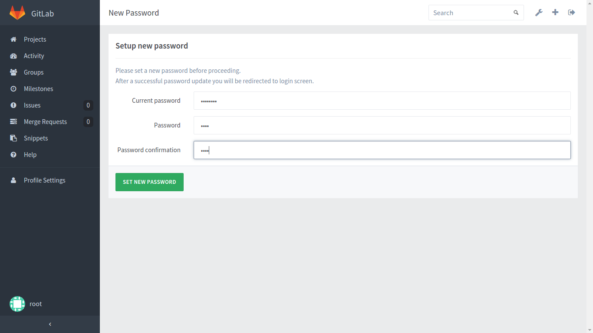
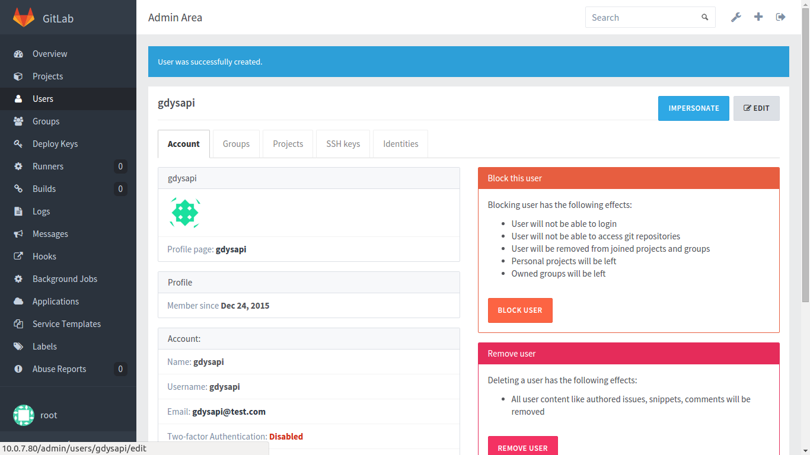
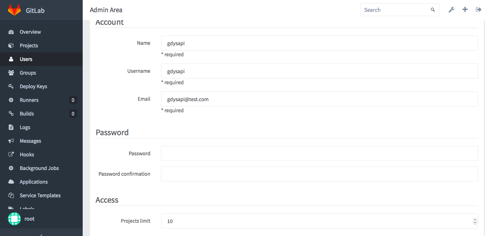
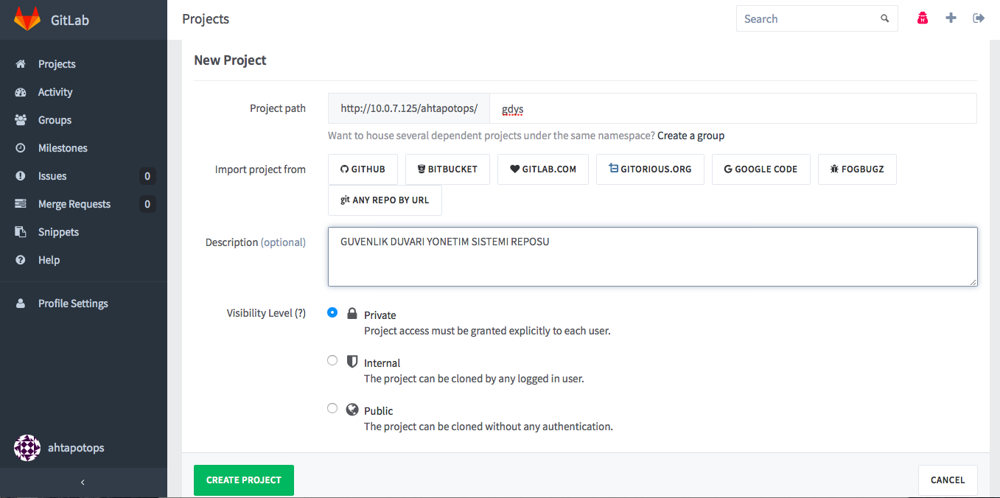
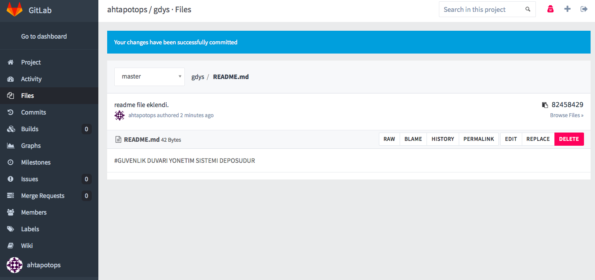
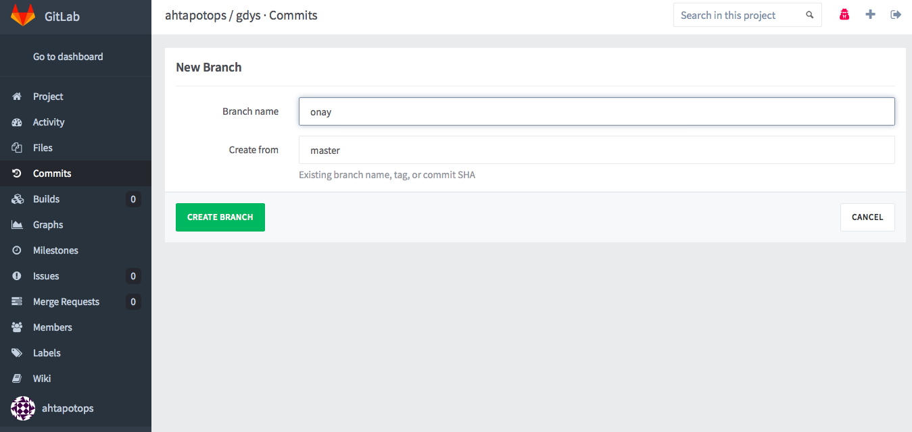

# Merkezi Yönetim Sistemi Kurulum Yönergesi
------

[TOC]

Bu yönerge dokümanından hareketle yapılan kurulum sonrasında, birbirleri ile entegre şekilde çalışan ve Ansible, GitLab, Rsyslog, FWbuilder ve CA ana bileşenlerinden oluşan bir sistem inşa edilmiş olacaktır. 

####MYS Sunucu Gereksinimleri
| Sunucu Rolü         | RAM | CPU        | Disk |       Network |
|-|-----|--|----:|
| Ahtapot - Ansible   | 8GB | 4 x 2.0GHz | 200G | 1 x 1Gbit/sec |
| Ahtapot - GitLab    | 8GB | 4 x 2.0GHz | 100G | 1 x 1Gbit/sec |
| Ahtapot - CA        | 2GB | 1 x 2.0GHz | 100G | 1 x 1Gbit/sec |
| Ahtapot - FWBuilder | 8GB | 4 x 2.0GHz | 100G | 1 x 1Gbit/sec |
| Ahtapot - FWtest    | 1GB | 1 x 2.0GHz | 70G  | 1 x 1Gbit/sec |


####MYS Yalın Kurulum Adımları 
 1. GDYS yapısına ait ana bileşenleri oluşturmak amacı ile “AHTAPOT Pardus Temel ISO Kurulumu” dokümanı kullanılarak GDYS Sunucu Gereksinimleri’ nde belirtilmiş olan CA, Ansible, GitLab, FirewallBuilder ve Uç Birim Test Sunucusu ihtiyaçlarını karşılayan toplamda sekiz adet olmak üzere, Ansible,GitLab ve FirewallBuilder sunucularından yedeklilik için ikişer adet kurulur.
 2. “AHTAPOT CA Kurulumu” dokümanı takip edilerek, proje dahilindeki kullanıcıların açık anahtarlarını oluşturmak için kullanılacak CA sunucusu oluşturulur.
 3. “AHTAPOT Ansible Kurulumu” dokümanı takip edilerek, proje kapsamında kullanılacak Merkezi Yönetim Sistemi sunucusu oluşturulur.
 4. “AHTAPOT GitLab Kurulumu” dokümanı takip edilerek, proje kapsamında kullanılacak Onay Mekanizması ve Merkezi Sürüm Takip Sistemini barındıracak sunucu oluşturulur.
 5. “AHTAPOT FirewallBuilder Kurulumu” dokümanı takip edilerek, Firewall Builder  arayüzü ve bu arayüzün onay mekanizması ile bağlantısını sağlayan Güvenlik Duvarı Yönetim Sistemi Kontrol Paneli’nin kurulduğu sunucu oluşturulur.
 6. “AHTAPOT Rsyslog Kurulumu” dokümanı takip edilerek, tüm sunucuların loglarını göndereceği rsyslog mimarisi kurulur.
 7. FirewallBuilder arayüzü ile oluşturulan kuralları söz dizimi bakımdan test etmek için kullanılacak Uç Birim Test Sunucusu “AHTAPOT Güvenlik Duvarı Kurulumu” dokümanı takip edilerek kurulur.

Yukarıdaki adımların tamamlanması ile, uç birim olarak kullanılacak sunucuların kurulum ve yönetimi yapılabilir sistem ayağa kalkmış olacaktır. Bu aşamadan sonra kurulmak istenen her uç birim için, GDYS Sunucu Gereksinimleri başlığı altında bulunun uç birim gerekliliklerini karşılayan sunucu üzerine AHTAPOT Pardus Temel ISO Kurulumu dokümanı takip edilerek, Yalın Pardus işletim sistemi kurulur. Ardından AHTAPOT Güvenlik Duvarı Kurulumu dokümanı takip edilerek sunucuya güvenlik duvarı rolü yüklenir.

#Ansible Kurulumu Yönergesi
------

Bu dokümanda, Ahtapot bütünleşik güvenlik yönetim sisteminde kullanılan merkezi yönetim sunucusunun kurulması prosedürü anlatılıyor.

Gereken : 
Pardus Temel ISO’ dan kurulumu tamamlanmış bir sunucu.

####Kurulum İşlemleri

**NOT:** Kurulacak sistem, SIEM yapısına dahil edilmek isteniyorsa, kurulum sonrasında Siber Olay, Açıklık, Risk İzleme ve Yönetim Sistemi Kurulumu sayfasında bulunan [LMYS Clientlarında Ossec Agent Dağıtımı](siem-kurulum.md) başlığı incelenmelidir.


* Pardus Temel ISO dosyasından Pardus kurulumu tamamlandıktan sonra sisteme “**ahtapotops**” kullanıcı ile giriş yapılır. ahtapotops kullanıcısının parolası “**LA123!!**” olarak öntanımlıdır. 

**NOT :** Pardus Temel ISO dosyasından Pardus kurulumu adımları için “**AHTAPOT Pardus Temel ISO Kurulumu**” dokümanına bakınız.

* Sisteme giriş sağlandıktan sonra, aşağıdaki komut ile root kullanıcısına geçiş yapılır. root kullanıcısı için parola Pardus Temel ISO kurulumda belirlenen paroladır.

```
$ sudo su -
```
* Sisteme root kullanıcısı ile bağlantı sağlandıktan sonra tercih ettiğiniz bir metin düzenleyicisini kullanarak "**/etc/apt/source.list**" dosyasına aşağıdaki satır eklenmelidir.
```
deb http://depo.pardus.org.tr/ahtapot yenikusak main
```
* Aşağıdaki komut ile ansible ve git kurulumları yapılır.

```
# apt-get install -y ansible
# apt-get install -y git
```

* Bu adımda kurulum, sıkılaştırma vb. gibi işleri otomatize etmeyi sağlayan ansible playbook’ları Pardus Ahtapot reposundan indirilir. 

```
# apt-get install -y ahtapot-mys
# cp -rf /ahtapotmys/* /etc/ansible/
```

* Ahtapot projesi kapsamında oluşacak tüm loglar “**/var/log/ahtapot/**” dizinine yazılmaktadır. Bu dizinin sahipliğini “**ahtapotops**” kullanıcısına vermek için aşağıdaki komut çalıştırılır.

```
# chown ahtapotops:ahtapotops -R /var/log/ahtapot
```
* Bir sonraki adımda yer alan sıkılaştırma ve kurulum işlemlerinin akabinde sistemde bulunan diğer sunucular ile iletişimin kurulmasını sağlamak adına ahtapotops kullanıcısına ait AHTAPOT CA KURULUM dokümanına uygun bir şekilde oluşturulmuş anahtalar, sunucu üzerinde ilgili yerlere kopyalama işlemi yapılmalıdır. Bu işlem için gerekli adımlar aşağıdaki gibidir;
"**ahtapotops**" kullanıcısı için oluşturulmuş anahtarları, sunucu üzerinde "**/home/ahtapotops**" dizinine belirlenen yöntem ile kopyalanır.
  * Anahtarların kopyalanması gereken ilgili dizine gidilir.

```
# su - ahtapotops
$ mkdir ~/.ssh && chmod 700 ~/.ssh
```

  * Kopyalanan anahtarların ahtapotops kullanıcısına atanması için aşağıdaki komutlar çalıştırılır.

```
$ cp /home/ahtapotops/ahtapotops /home/ahtapotops/.ssh/id_rsa  && chmod 600 /home/ahtapotops/.ssh/id_rsa
$ cp /home/ahtapotops/ahtapotops-cert.pub /home/ahtapotops/.ssh/id_rsa-cert.pub
$ cp /home/ahtapotops/ahtapotops.pub /home/ahtapotops/.ssh/id_rsa.pub
```

* Tercih ettiğimiz metin düzenleyicisini kullanarak hosts dosyasını düzenliyoruz. Aşağıdaki örnekte vi kullanılır. Açılan dosyada [ansible] kısmı altına ansible makinesinin tam ismi (FQDN) girilir.


```
$ cd /etc/ansible/
$ sudo vi hosts
[ansible]
ansible.alan.adi
```
* Ansible makinesinin erişmesi gereken tüm makinelerin hosts dosyasını düzenlemek adına, "**roles/base/vars/host.yml**" dosyası içerisine tüm makine bilgileri yazılır.

```
$ sudo vi roles/base/vars/host.yml
# Sunucu degiskenlerini iceren dosyadir.
# Yorum satiri ile gosterilen sablon doldurularak istenilen kadar sunucu eklenebilir.

hosts:
# /etc/hosts yapilandirmasini belirtmektedir.
    conf:
        source: "hosts.j2"
        destination: "/etc/hosts"
        owner: "root"
        group: "root"
        mode: "0644"

base_host_servers:
    server01:
        ip: "X.X.X.X"
        fqdn: "ansible.gdys.local"
        hostname: "ansible01"
    server02:
        ip: "X.X.X.X"
        fqdn: "gitlab.gdys.local"
        hostname: "gitlab"
    server03:
        ip: "X.X.X.X"
        fqdn: "fwbuilder.gdys.local"
        hostname: "fwbuilder"
    server04:
        ip: "X.X.X.X"
        fqdn: "firewall.gdys.local"
        hostname: "firewall"
```

* “**roles/base/vars**” klasörü altında ntp değişkenlerinin barındıran “**ntp.yml**” dosyası içerisine "**base_ntp_servers**" fonksiyonu altında bulunan "**server1**" ve "**server2**" satırları altına NTP sunucularının FQDN bilgileri girilmelidir. Sistemde bir NTP sunucusu olduğu durumda "**server2**" satırları silinebilir yada istenildiği kadar NTP sunucusu eklenebilir. 

```
$ cd roles/base/vars/
$ sudo vi ntp.yml
# Zaman sunucusu ayarlarini iceren dosyadir.
# Yorum satiri ile gosterilen sablon doldurularak istenilen kadar zaman sunucusu eklenebilir.
ntp:
    conf:
        source: "ntp.conf.j2"
        destination: "/etc/ntp.conf"
        owner: "root"
        group: "root"
        mode: "0644"
    service:
        name: "ntp"
        state: "started"
        enabled: "yes"

base_ntp_servers:
    server1:
        fqdn: "rsyslog01.gdys.local"
    server2:
        fqdn: "rsyslog02.gdys.local"
#    serverX:
#        fqdn: ""
```

* "**roles/base/vars**” klasörü altında rsyslog değişkenlerinin barındıran “**rsyslog.yml**” dosyası içerisine "**base_ossimcik_servers**" fonksiyonu altında bulunan “**server1**” ve “**server2**” satırları altına ossimcik sunucularına ait bilgiler girilmelidir. Sistemde bir ossimcik sunucusu olduğu durumda “**server2**” satırları silinebilir yada istenildiği kadar ossimcik sunucusu eklenebilir.Ossimcik makinelerine log gonderilmesi istenilen clientların "**client**" içerisinde fqdn bilgileri girilir. 

```
$ cd roles/base/vars/
$ sudo vi rsyslog.yml
# Log sunucu ayarlarini iceren dosyadir.
# Yorum satiri ile gosterilen sablon doldurularak istenilen kadar log sunucusu eklenebilir.
rsyslog:
    conf:
        source: "rsyslog.conf.j2" 
        destination: "/etc/rsyslog.conf" 
        owner: "root" 
        group: "root" 
        mode: "0644" 
    service:
        name: "rsyslog" 
        state: "started" 
        enabled: "yes"
    ActionQueueMaxDiskSpace: "2g"
    ActionQueueSaveOnShutdown: "on" 
    ActionQueueType: "LinkedList" 
    ActionResumeRetryCount: "-1" 
    WorkDirectory: "/var/spool/rsyslog" 
    IncludeConfig: "/etc/rsyslog.d/*" 

base_ossimcik_servers:
    server1:
        fqdn: "ossimcik01.gdys.local"
        port: "514"
        severity: "*"
        facility: "*"
        clients:
            client01:
                fqdn: "ansible_fqdn"
            client02:
                fqdn: "gitlab_fqdn"
#    serverX:
#        fqdn: "" 
#        port: "" 
#        severity: "*"
#        facility: "*"
#        clients:
#            client01:
#                fqdn: "ansible_fqdn"
```
* **NOT:** Log gönderici client makinelerine rsyslog icin gerekli anahtarlar konulmalıdır. **NOT:** Anahtar oluşturulması için CA Kurulumu ve Anahtar Yönetimi dökümanındaki [Log Yönetimi Anahtar Oluşturma](ca-kurulum.md) başlığı incelenmelidir. Oluşturulan anahtarlar client makineler içerisinde aşağıdaki dizinlere konulmalıdır. "**client_fqdn**" yerine client makinenin fqdn bilgisi girilmelidir.

```
/etc/ssl/certs/rootCA.pem
/etc/ssl/certs/client_fqdn.crt
/etc/ssl/private/client_fqdn.key
```

* "**roles/base/vars**” klasörü altında ssh değişkenlerinin barındıran “**ssh.yml**” dosyası içerisinde bulunan "**Port**" değişkenine istenen yeni değer yazılmalıdır.

```
$ cd roles/base/vars/
$ sudo vi ssh.yml
# Ssh degiskenlerini iceren dosyadir.
ssh:
    conf:
        source: "sshd_config.j2"
        destination: "/etc/ssh/sshd_config"
        owner: "root"
        group: "root"
        mode: "0644"
    service:
        name: "ssh"
        state: "started"
        enabled: "yes"
    TrustedUserCAKeys:
        source: "ahtapot_ca.pub.j2"
        destination: "/etc/ssh/ahtapot_ca.pub"
        owner: "root"
        group: "root"
        mode: "0644"
    RevokedKeys:
        source: "revoked_keys.j2"
        destination: "/etc/ssh/revoked_keys"
        owner: "root"
        group: "root"
        mode: "0644"
    LocalBanner:
        source: "issue.j2"
        destination: "/etc/issue"
        owner: "root"
        group: "root"
        mode: "0644"
    RemoteBanner:
        source: "issue.net.j2"
        destination: "/etc/issue.net"
        owner: "root"
        group: "root"
        mode: "0644"
    Port: "4444" 
    Protocol: "2"
    ListenAddressv4: "0.0.0.0"
    ListenAddressv6: "::"
    UsePrivilegeSeparation: "yes"
    KeyRegenerationInterval: "3600"
    ServerKeyBits: "1024"
    SyslogFacility: "AUTH"
    LogLevel: "DEBUG"
    LoginGraceTime: "90"
    PermitRootLogin: "no"
    StrictModes: "yes"
    RSAAuthentication: "yes"
    PubkeyAuthentication: "yes"
    IgnoreRhosts: "yes"
    RhostsRSAAuthentication: "no"
    HostbasedAuthentication: "no"
    IgnoreUserKnownHosts: "yes"
    PermitEmptyPasswords: "no"
    ChallengeResponseAuthentication: "no"
    PasswordAuthentication: "no"
    KerberosAuthentication: "no"
    KerberosOrLocalPasswd: "yes"
    KerberosTicketCleanup: "yes"
    GSSAPIAuthentication: "no"
    GSSAPICleanupCredentials: "yes"
    X11Forwarding: "no"
    X11DisplayOffset: "10"
    PrintMotd: "yes"
    PrintLastLog: "yes"
    TCPKeepAlive: "yes"
    UsePAM: "no"
    UseLogin: "no"
```

* “**Ansible Playbookları**” dokümanında detaylı anlatımı bulunan, sunucu üzerinde gerekli sıkılaştırma işlemlerini ve ansible kurulumu yapacak olan “**ansible.yml**” playbook’u çalıştırılır.


```
$ ansible-playbook playbooks/ansible.yml --skip-tags=git
```

* ansible.yml playbookunun çalışması bittikten sonra, Ansible kurulumu tamamlanmış olacak ve sistem diğer sunucuları yönetebilir hale gelmiş olacaktır.


# Gitlab Kurulumu Yönergesi
------

Bu dokümanda, Ahtapot projesi, Güvenlik Duvarı ve Güvenik Duvarı Yönetim Sistemine ait bir bileşen olarak kullanılmak üzere bir gitlab sunucusu kurulumu ve ilgili gitlab sunucusu merkezi yönetim sisteminin ihtiyaçlarına cevap verecek şekilde yapılandırma anlatılıyor.


Gereken : 
Pardus Temel ISO’ dan kurulumu tamamlanmış bir sunucu.

####GitLab Kurulumu

Bu doküman izlenerek yapılan işlemlerin sonucunda, kurulum ve yapılandırma otomatizasyonu için ansible kurulacak ve bağlı olarak temel sunucu sıkılaştırma işlemleri ile gitlab kurulumu otomatik olarak yapılacaktır. Kurulumların ardından yapılandırma işlemleri olarak gitlab üzerinde gerekli kullanıcılara açılacak ve ilgili depolar proje olarak sisteme eklenecektir.

Yukarıda özeti verilen ve işlem adımları aşağıda maddelendirilmiş olan tüm işlemler için gerekli olan ek dokümantasyonlara erişim bilgileri ilgili başlıklarda NOT olarak ifade edilmişlerdir.


####Kurulum İşlemleri

**NOT:** Kurulacak sistem, SIEM yapısına dahil edilmek isteniyorsa, kurulum sonrasında Siber Olay, Açıklık, Risk İzleme ve Yönetim Sistemi Kurulumu sayfasında bulunan [LMYS Clientlarında Ossec Agent Dağıtımı](siem-kurulum.md) başlığı incelenmelidir.

  * Pardus Temel ISO dosyasından Pardus kurulumu tamamlandıktan sonra sisteme “**ahtapotops**” kullanıcısı ile giriş yapılır. ahtapotops kullanıcısının parolası “**LA123!!**” olarak öntanımlıdır.     
**NOT :** Pardus Temel ISO dosyasından Pardus kurulumu adımları için “AHTAPOT Pardus Temel ISO Kurulumu” dokümanına bakınız.
  * Sisteme giriş sağlandıktan sonra, aşağıdaki komut ile root kullanıcısına geçiş yapılır. root kullanıcısı için parola Pardus Temel ISO kurulumda belirlenen paroladır.


```
$ sudo su -
```
* Sisteme root kullanıcısı ile bağlantı sağlandıktan sonra tercih ettiğiniz bir metin düzenleyicisini kullanarak "**/etc/apt/source.list**" dosyasına aşağıdaki satır eklenmelidir.
```
deb http://depo.pardus.org.tr/ahtapot yenikusak main
```
* Aşağıdaki komut ile ansible ve git kurulumları yapılır.
```
# apt-get install -y ansible
# apt-get install -y git
```

  * Bu adımda kurulum, sıkılaştırma vb. gibi işleri otomatize etmeyi sağlayan ansible playbook’ları Pardus Ahtapot deposundan indirilir. 

```
# apt-get install -y ahtapot-mys
# cp -rf /ahtapotmys/* /etc/ansible/
```

  * Ahtapot projesi kapsamında oluşacak tüm loglar “**/var/log/ahtapot/**” dizinine yazılmaktadır. Bu dizinin sahipliğini “**ahtapotops**” kullanıcısına vermek için aşağıdaki komut çalıştırılır.

```
# chown ahtapotops:ahtapotops -R /var/log/ahtapot
```

  * Tercih ettiğimiz metin düzenleyicisini kullanarak hosts dosyasını düzenliyoruz. Aşağıdaki örnekte vi kullanılır. Açılan dosyada [gitlab] kısmı altına gitlab makinesinin tam ismi (FQDN) girilir.

```
# su - ahtapotops 
$ cd /etc/ansible/
$ sudo vi hosts
[gitlab]
gitlab.alan.adi
```

* “**roles/base/vars**” klasörü altında ntp değişkenlerinin barındıran “**ntp.yml**” dosyası içerisine "**base_ntp_servers**" fonksiyonu altında bulunan "**server1**" ve "**server2**" satırları altına NTP sunucularının FQDN bilgileri girilmelidir. Sistemde bir NTP sunucusu olduğu durumda "**server2**" satırları silinebilir yada istenildiği kadar NTP sunucusu eklenebilir. 

```
$ cd roles/base/vars/
$ sudo vi ntp.yml
# Zaman sunucusu ayarlarini iceren dosyadir.
# Yorum satiri ile gosterilen sablon doldurularak istenilen kadar zaman sunucusu eklenebilir.
ntp:
    conf:
        source: "ntp.conf.j2"
        destination: "/etc/ntp.conf"
        owner: "root"
        group: "root"
        mode: "0644"
    service:
        name: "ntp"
        state: "started"
        enabled: "yes"

base_ntp_servers:
    server1:
        fqdn: "rsyslog01.gdys.local"
    server2:
        fqdn: "rsyslog02.gdys.local"
#    serverX:
#        fqdn: ""
```

* "**roles/base/vars**” klasörü altında rsyslog değişkenlerinin barındıran “**rsyslog.yml**” dosyası içerisine "**base_ossimcik_servers**" fonksiyonu altında bulunan “**server1**” ve “**server2**” satırları altına ossimcik sunucularına ait bilgiler girilmelidir. Sistemde bir ossimcik sunucusu olduğu durumda “**server2**” satırları silinebilir yada istenildiği kadar ossimcik sunucusu eklenebilir. 

```
$ cd roles/base/vars/
$ sudo vi rsyslog.yml
# Log sunucu ayarlarini iceren dosyadir.
# Yorum satiri ile gosterilen sablon doldurularak istenilen kadar log sunucusu eklenebilir.
rsyslog:
    conf:
        source: "rsyslog.conf.j2" 
        destination: "/etc/rsyslog.conf" 
        owner: "root" 
        group: "root" 
        mode: "0644" 
    service:
        name: "rsyslog" 
        state: "started" 
        enabled: "yes"
    ActionQueueMaxDiskSpace: "2g"
    ActionQueueSaveOnShutdown: "on" 
    ActionQueueType: "LinkedList" 
    ActionResumeRetryCount: "-1" 
    WorkDirectory: "/var/spool/rsyslog" 
    IncludeConfig: "/etc/rsyslog.d/*" 

base_ossimcik_servers:
    server1:
        fqdn: "ossimcik01.gdys.local"
        port: "514"
        severity: "*"
        facility: "*"
        clients:
            client01:
                fqdn: "ansible_fqdn"
            client02:
                fqdn: "gitlab_fqdn"
#    serverX:
#        fqdn: ""
#        port: ""
#        severity: "*"
#        facility: "*"
#        clients:
#            client01:
#                fqdn: "ansible_fqdn"
```

* "**roles/base/vars**” klasörü altında ssh değişkenlerinin barındıran “**ssh.yml**” dosyası içerisinde bulunan "**Port**" değişkenine istenen yeni değer yazılmalıdır.

```
$ cd roles/base/vars/
$ sudo vi ssh.yml
# Ssh degiskenlerini iceren dosyadir.
ssh:
    conf:
        source: "sshd_config.j2"
        destination: "/etc/ssh/sshd_config"
        owner: "root"
        group: "root"
        mode: "0644"
    service:
        name: "ssh"
        state: "started"
        enabled: "yes"
    TrustedUserCAKeys:
        source: "ahtapot_ca.pub.j2"
        destination: "/etc/ssh/ahtapot_ca.pub"
        owner: "root"
        group: "root"
        mode: "0644"
    RevokedKeys:
        source: "revoked_keys.j2"
        destination: "/etc/ssh/revoked_keys"
        owner: "root"
        group: "root"
        mode: "0644"
    LocalBanner:
        source: "issue.j2"
        destination: "/etc/issue"
        owner: "root"
        group: "root"
        mode: "0644"
    RemoteBanner:
        source: "issue.net.j2"
        destination: "/etc/issue.net"
        owner: "root"
        group: "root"
        mode: "0644"
    Port: "4444" 
    Protocol: "2"
    ListenAddressv4: "0.0.0.0"
    ListenAddressv6: "::"
    UsePrivilegeSeparation: "yes"
    KeyRegenerationInterval: "3600"
    ServerKeyBits: "1024"
    SyslogFacility: "AUTH"
    LogLevel: "DEBUG"
    LoginGraceTime: "90"
    PermitRootLogin: "no"
    StrictModes: "yes"
    RSAAuthentication: "yes"
    PubkeyAuthentication: "yes"
    IgnoreRhosts: "yes"
    RhostsRSAAuthentication: "no"
    HostbasedAuthentication: "no"
    IgnoreUserKnownHosts: "yes"
    PermitEmptyPasswords: "no"
    ChallengeResponseAuthentication: "no"
    PasswordAuthentication: "no"
    KerberosAuthentication: "no"
    KerberosOrLocalPasswd: "yes"
    KerberosTicketCleanup: "yes"
    GSSAPIAuthentication: "no"
    GSSAPICleanupCredentials: "yes"
    X11Forwarding: "no"
    X11DisplayOffset: "10"
    PrintMotd: "yes"
    PrintLastLog: "yes"
    TCPKeepAlive: "yes"
    UsePAM: "no"
    UseLogin: "no"
```
  * “**roles/gitlab/vars**” klasörü altında değişkenleri barındıran “**main.yml**” dosyası içerisinde  “**external_url**” satırında bulunan “**yerel_gitlab_URL**” bölümüne GitLab sunucusunu browser üzerinden çağırırken kullanılması istenilen URL girilmelidir. GitLab SMTP ayarları için “**gitlab_email_from:**” satırına GitLab tarafından atılacak bilgilendirme postalarının hangi adres tarafından atılacağı belirtilmelidir. “**gitlab_email_display_name:**” satırında gönderilen postalarda görünmesi istenilen isim belirlenir. “**gitlab_email_reply_to:**” satırında GitLab tarafından gönderilen postalara cevap verilmesi durumunda cevabın hangi adrese yönlendirilmesi istendiği belirtilir. “**smtp_address:**” satırında smtp sunucusunun FQDN ve ya IP adres bilgileri girilir. “**smtp_port:**” satırında smtp sunucusunun kullandığı port yazılır. “**smtp_domain:**” satırında ise stmp alan adı bilgisi girilir. Yedekli kullanılacak Gitlab ortamında, git fonksiyonu altındaki “**Server**” satırına yedek gitlab sunucusunun FQDN bilgileri “**Port**” satırına ise ssh port bilgisi girilmelidir. Ansible fonksiyonu altındaki “**Server**” satırına ansible makinesinin FQDN bilgileri “**Port**” satırına ise ssh port bilgisi girilmelidir.


```
$ cd roles/gitlab/vars/
$ sudo vi main.yml
# GitLab'in degiskenlerinin tutuldugu dosyadir.
gitlab:
# git kullanicisini yapilandirmasi belirtilmektedir.
    user:
        name: git
        password: "jQCGY1Gp$rVz8u3qRyH3UCB.6MSnWToQv1qQYjYeatbBEA0pA4aqnjoTchjPDsm9CAeuk1xVKoV3MqM1C/UJZ6Fgap9XmB0"
        state: present
    service:
        name: gitlab-runsvdir
        state: started
        enabled: yes
    conf:
        source: gitlab.rb.j2
        destination: /etc/gitlab/gitlab.rb
        owner: root
        group: root
        mode: 0640
    ssl:
        directory:
            path: /etc/gitlab/ssl
            owner: root 
            group: root 
            mode: 700
            state: directory 
            recurse: no 
    ssl-crt:
        source: ssl-crt.j2
        destination: /etc/gitlab/ssl/gitlab.gdys.local.crt
        owner: root
        group: root
        mode: 600
    ssl-key:
        source: ssl-key.j2
        destination: /etc/gitlab/gitlab.gdys.local.key
        owner: root
        group: root
        mode: 600
    external_url: https://yerel_gitlab_URL
    firstrunpath: /var/opt/gitlab/bootstrapped
    gitlab_rails:
        gitlab_email_enabled: "true"
        gitlab_email_from: gitlab@Domain_Adi 
        gitlab_email_display_name: GdysGitlab 
        gitlab_email_reply_to: no-reply@Domain_Adi
        gitlab_default_theme: 2
        gitlab_shell_ssh_port: 4444
        smtp_enable: "true" 
        smtp_address: smtp_sunucu_adı
        smtp_port: 25 
        smtp_domain: domain_adi
        smtp_tls: "false" 
    nginx:
        enable: "true"
        redirect_http_to_https: "true"
    backup:
        Server: gitlab.domain_adi
        Port: 4444
    ansible:
        Server: ansible.domain_adi
        Port: 4444
```

  * “**Ansible Playbookları**” dokümanında detaylı anlatımı bulunan, sunucu üzerinde gerekli sıkılaştırma işlemleri ve GitLab kurulumu yapacak olan “**gitlab.yml**” playbook’u çalıştırılır.

```
$ ansible-playbook playbooks/gitlab.yml --connection=local
```

  * Git kurulumdan sonra parolasız git işemlerini yapabilmek için git kullanıcısına ait anahtar bilgileri AHTAPOT CA KURULUM dokümanına uygun bir şekilde oluşturulmuş anahtalar, sunucu üzerinde ilgili yerlere kopyalama işlemi yapılmalıdır. Bu işlem için gerekli adımlar aşağıdaki gibidir;
    * git kullanıcısı için oluşturulmuş anahtarları, sunucu üzerinde "**/home/ahtapotops**" dizinine belirlenen yöntem ile kopyalanır.
      * Kopyalanan anahtarlar aşağıdaki şekilde ilgili dizinlere taşınır.

``` 
$ cd /home/ahtapotops/
$ sudo cp /home/ahtapotops/git /var/opt/gitlab/.ssh/id_rsa  
$ sudo cp /home/ahtapotops/git-cert.pub /var/opt/gitlab/.ssh/id_rsa-cert.pub
$ sudo cp /home/ahtapotops/git.pub /var/opt/gitlab/.ssh/id_rsa.pub
$ sudo cp /home/ahtapotops/myshook /var/opt/gitlab/.ssh/myshook  
$ sudo cp /home/ahtapotops/myshook-cert.pub /var/opt/gitlab/.ssh/myshook-cert.pub
$ sudo cp /home/ahtapotops/myshook.pub /var/opt/gitlab/.ssh/myshook.pub
$ sudo cp /home/ahtapotops/gdyshook /var/opt/gitlab/.ssh/gdyshook   
$ sudo cp /home/ahtapotops/gdyshook-cert.pub /var/opt/gitlab/.ssh/gdyshook-cert.pub
$ sudo cp /home/ahtapotops/gdyshook.pub /var/opt/gitlab/.ssh/gdyshook.pub
```
  * Kopyalanan anahtarların git kullanıcısı yetkilerine sahip olması için aşağıdaki komutlar çalıştırılır.

```
# sudo su - 
# chown git:git /var/opt/gitlab/.ssh/*
# su - git
$ chmod 700 ~/.ssh
$ cd ~/.ssh/
$ chmod 600 id_rsa gdyshook myshook
$ exit
```


  * GitLab kurulumu tamamlandıktan sonra sunucu MYS ile yönetileceğinden, sunucu üzerindeki ansible paketi kaldırılır.


```
# dpkg -r ansible
```

  * GitLab kurulumu tamamlanmış olacak ve kullanıcı tanımlama, depo oluşturma gibi yapılandırma işlemleri için hazır hale gelmiş olacaktır.

####Yapılandırma İşlemleri

  * Yapılandırma işlemlerine geçmek üzere, adresine bir web tarayıcı vasıtası ile girilerek Gitlab web arayüzüne erişilir. 
  * Gitlab, öntanımlı kullanıcı adı “**root**” ve öntanımlı parola “**5iveL!fe**” olacak şekilde gelmektedir. Bu bilgiler kullanılarak sisteme giriş sağlanır.


  * GitLab web arayüzüne erişim sağlandıktan sonra, ilk adım olarak root kullanıcısının parolasının değiştirilmesi gerekmektedir. 

En az 8 karakterden oluşacak yeni şifre belirlenerek, “**SET NEW PASSWORD**” butonuna basılır. Şifre değiştirme işleminin ardından web arayüz açılış sayfasına otomatik geri döner. Yeni şifre ile giriş yapılır.




  * Root kullanıcısı ile giriş yapıldıktan sonra sağ üst köşede bulunan “**Admin Area**” simgesine basılarak sisteme tanımlanması gereken kullanıcıları oluşturmak için “**Yönetici Bölümüne**” geçiş yapılır.


  * Yönetici bölümünde “**Users**” bölümünde yer alan “**NEW USER**” butonuna basılır.


  * Öncelikli olarak FirewallBuilder kontrol paneli ile iletişimi sağlayarak onay mekanizması yapısı kapsamında Onay Kontrol, Son Onaylanmış Commit ID gibi özelliklerini çalıştıracak API kullanıcısı oluşturulur. Oluşturulacak kullanıcının isminin “**gdysapi**” olması zaruridir. Kullanıcıyı oluşturmak için “**Name**”, “**Username**” ve “**Email**” alanları doldurularak “**CREATE USER**” butonuna basılır. 


  * Kullanıcı oluşturulduktan sonra, ilgili kullanıcıya ait bilgilendirme sayfası açılmaktadır. Bu sayfada kullanıcıya şifre oluşturmak için “**EDIT**” butonuna basılır.



  * Açılan ekranda “**Password**” bölümünden “**gdysapi**” kullanıcı için parola belirlenir ve sayfanın en altında bulunan “**SAVE CHANGES**” butonuna basılır.



  * 3, 4 ve 5. adımlar tekrar uygulanarak bir adet kullanıcı daha oluşturulur. “**gydsapi**” kullanıcısından farklı olarak bu kullanıcı için şifre oluşturulmaz. (6 ve 7. adımlar uygulanmadan geçilecektir.) 

Oluşturulacak kullanıcının isminin “**ahtapotops**” olması zaruridir. Bu kullanıcı FirewallBuilder ile Ansible entegrasyonunu ve Ansible ile yöneteceği sunucular arasında iletişimi sağlamaktadır. Otomatizasyon yapısının çalışabilmesi için yapıyı oluşturacak sunucular arasında parolasız erişim kullanılmalıdır. Bu neden ile kullanıcı oluşturulduktan sonra aşağıdaki adımları takip ederek kullanıcıya ait açık anahtar GitLab sistemine eklenmelidir.

  * Oluşturulan “**ahtapotops**” kullanıcısına SSH-Key belirtme işlemini yapmak için sağ tarafta görünen “**IMPERSONATE**” butonuna basılarak, uygulamanın bu kullanıcı gibi davranması sağlanır.


  * Impersonate işleminin başarılı gerçekleştiği sağ üstte bulanan “**Impersonate**” simgesi ile teyit edildikten sonra gelen ekranda sol taraftan “**Profile Settings**” seçeneğine tıklanır.


  * Açılan kullanıcı ayarlarında solda bulunan menüden “**SSH Keys**” seçeneği seçilir ve gelen sayfada SSH Key işlemi gerçekleştirilebilir haldedir. 


  * Ekranda “**Key**” kısmına "**ahtapotops.pub**" dosyasının içeriği kopyalanır , “**Title**” kısmına kullanıcı oluştururken belirttiğimiz posta adresi girilir. “**ADD KEY**” butonuna basılarak sisteme eklenir. 


  * FirewallBuilder ve Ansible entegrasyonunu sağlıklı olarak gerçekleştirmek için iki adet proje oluşturulması gerekmektedir. FirewallBuilder tarafı için “**gdys**” Ansible tarafı için ise “**mys**” projeleri oluşturulacaktır. Proje oluşturmak için “**Go to dashboard**” butonuna basılır.


  * Ekranda bulunan “**NEW PROJECT**” butonuna basarak yeni proje oluşturma işlemi gerçekleştirilir.


  * “**NEW PROJECT**” butonuna basıldığında gelen ekranda “**Project path**” satırında “**/**” ibaresinden sonra proje ismi olan “gdys” yazılır. İsteğe bağlı olarak “**Description**” bölümüne tanımlama yazılarak “**Private**” olacak şekilde “**CREATE PROJECT**” butonuna basılır.

**NOT :** GDYS kapsamında açılan tüm GitLab projelerinin “**Private**” olması zaruridir.




  * Proje oluşturulduktan sonra, açılan ekran proje anasayfası olup; “**gdys**” deposuna erişim hakkı olacak kullanıcıları belirtlemek için sol ağaç yapısından “**Members**” seçeneği seçilir.


  * GitLab üzerinde oluşturulmuş “**gdys**” projesi için “**gdysapi**” ve “**ahtapotops**” kullanıcıları “**People**” bölümüne eklenerek yetkilendirilir. Yetki seviyesini belirlemek amacı ile “**Project Access**” bölümünden bu kullancılara “**Master**” yetkisi verilerek “**ADD USERS TO PROJECT**” butonuna basılır.


  * “**Go to dashboard**” butonuna basılarak, ana ekrana gidilerek 16. ve 17. adımlar “**mys**” deposun için tekrar uygulanır. “**mys**” deposuna ait anasayfa geldikten sonra “**Go to dashboard**” seçeneği seçilerek GitLab sayfasına gidilir.


  * Onay mekanizmasının yapısı oluşturmak adına GitLab sayfasından, “**ahtapotops / gdys**” projesine gidilir.Bu yapıyı oluşturmak için projede iki adet dal oluşturulmalıdır. “**master**” ve “**onay**” dalları bu yapıyı sağlamaktadır. Öncelikli olarak “**master**” dalını oluşturmak için “**adding README**” satırına basılırak, bir dosya oluşturulur. Böylelikle master dal oluşmuş olur.


  * Açılan dosya ekranında, ilk satıra yorum olmasını sağlacak şekilde “**#**” simgesi konularak açıklama yazılır. Akabinde “**Commit message**” bölümüne yapılan işlem yazılarak “**COMMIT CHANGES**” butonuna basılır.


  * Oluşturulan “**master**” dalı aşağıdaki ekranda olduğu gibi gözükmektedir. “**Files**” butonuna basılarak, projeye ait dosyaların bulunduğu “**gdys**” dizinine gidilir.


  * “**Files**” sayfasında “**+**” işaretine basılarak “**New file**” seçeneği seçilir.


  * "**https://ahtapot.bilg.io/dosyalar/gdys-fwb/**" adresinden indirilerek, içeriği kopyalanan “**gdys.fwb**” dosyasının içeriği buraya yapıştırılır. “**master/**” ibaresinden sonraki alana “**gdys.fwb**”  ve “**Commit message**” alanına yapılan işlem yazılarak “**COMMIT CHANGES**” butonuna basılır.


  * “**Files**” butonuna basılarak, projeye ait dosyaların bulunduğu “**gdys**” dizinine gidilir.



  * “**Files**” sayfasında “**+**” işaretine basılarak “**New directory**” seçeneği seçilir.


  * Açılan ekranda “**Directory name**” kısmında “**files**” yazılması zaruridir. “**Commit message**” bölümüne bilgi yazıldıktan sonra “**Target branch**”, “**master**” seçilir ve “**CREATE DIRECTORY**” butonuna basılır.


  * Dosyayı oluşturduktan sonra sol ağaç menüsünden “**Project**” seçilerek “**gdys**” deposu anasayfaya gidilir. Anasayfasında bulunan “**+**” işaretine basılarak “**New branch**” ile onay dalı oluşturulur.


  * Açılan yeni ekranda “**Branch name**” bölümüne “**onay**” yazılarak “**CREATE BRANCH**” seçeneği seçilir.



  * Ansible’a ait playbookları “**mys**” deposuna aktarmak için Ansible makinesine ssh ile bağlanılarak aşağıdaki adımlar takip edilir.
* mys projesini yerele indirme işlemi için bulunulan dizin geçici dizin ile değiştirilir.

```
$ cd /tmp
```

* GitLab üzerinde açılan proje aşağıdaki komut ile GitLab makinesinin yereline alınır. (“**mys_proje_URL**” bilgisi GitLab arayüzünde “**Projects**” altından “**mys**” projesi seçildiğinde, mys projesine ait anasayfada “**ssh://git@gitlab_sunucuadı:ssh_port/ahtapotops/mys.git**” şeklinde görüntülenmektedir.) Komutun girilmesi ile birlikte, kullanıcı adı ve parola sormaktadır. Kullanıcı adı olarak GitLab tarafında öntanımlı gelen yetkili kullanıcı “**root**”, parola olarak açılış sırasında belirlenen parola girilmelidir.


```
$ git clone ssh://git@gitlab_sunucuadı:ssh_port/ahtapotops/mys.git 
```

* Beşinci adımda GitLab üzerinden yerele indirilen playbooklar bulunduğu dizin içerisinden alınırak geçici dizin altında oluşmuş olan “**mys**” klasörüne kopyalanır.

```
$ sudo cp -rf /etc/ansible/* /tmp/mys/
```

* Dosyaların kopyalandığını teyit etmek amacı ile ilgili dizine gidilir.

```
$ cd /mys
$ ls -ltr
$ sudo chown ahtapotops:ahtapotops *
```

* “**mys**” klasörüne kopyalanmış playbookların kopyalandığı teyit edildikten sonra, GitLab arayüzüne gönderilir.

```
$ git add --all
$ git config --global user.email “ansible@test.com”
$ git config --global user.name “Ansible Makinesi”
$ git commit -m “MYS ana dosyalari eklendi.” 
$ git push origin master
```

  * GitLab kurulumunun tamamlanmasının ardından Ansible sunucusunun bu makineye erişimini kontrol etmek adına, Ansible sunucusuna SSH bağlantısı yapılarak; SSH bağlantı linki üzerinden deponun yerele alınması test edilir. “**Gitlab_sunucuadı**” bölüme kurulmuş gitlab sunucusunun adresi, “**ssh_port**” bölümüne ise sunucusunun ayarlanan sunucunun ssh port bilgisi yazılır.

```
$ cd /tmp 
$ git clone ssh://git@gitlab_sunucuadı:ssh_port/ahtapotops/gdys.git 
$ sudo rm -rf gdys
```

  *  Erişimin sağlandığından emin olduktan sonra, Ansible makinesi üzerine ilk kurulum için koyduğumuz playbookların, MYS reposudan çalışmasını sağlamak için yerel gitlab sunucusu üzerindeki MYS reposu ansible makinesine clonelanarak, “**.git**” dosyası “**/etc/ansible**” dosyasına taşınır. Bu dizin altındaki tüm dosyaların sahiplik hakları “**ahtapotops**” kullanıcısına verilir.


```
$ cd /tmp/mys
$ sudo cp -rf .git /etc/ansible/ && sudo chown ahtapotops:ahtapotops /etc/ansible/.git
$ sudo rm -rf ../mys
$ sudo chown ahtapotops:ahtapotops /etc/ansible/*
```

**NOT :** Bu aşamadan sonra playbooklar üzerinde yapılacak tüm değişiklikler GitLab MYS reposunda arayüzden yapılacaktır. “**Ansible Playbookları**” dokümanında yapılacak değişiklikler bu alana yansıtıldıktan sonra, MYS sistemi playbookları GitLab üzerinden okuyarak ilgili sistemlerde oynatacaktır.


# Firewall Builder Kurulum Yönergesi
------

Bu dokümanda, Ahtapot projesi, Güvenlik Duvarı ve Güvenik Duvarı Yönetim Sistemine ait bir bileşen olarak kullanılmak üzere bir Firewall Builder sunucu kurulumu anlatılıyor.


Gereken : 
Pardus Temel ISO’ dan kurulumu tamamlanmış bir sunucu.


####Kurulum İşlemleri

* **NOT:** Dökümanda yapılması istenilen değişiklikler gitlab arayüzü yerine terminal üzerinden yapılması durumunda playbook oynatılmadan önce yapılan değişiklikler git'e push edilmelidir.

```
$ cd /etc/ansible
git status komutu ile yapılan değişiklikler gözlemlenir.
$ git status  
$ git add --all
$ git commit -m "yapılan değişiklik commiti yazılır"
$ git push origin master
```
**NOT:** Kurulacak sistem, SIEM yapısına dahil edilmek isteniyorsa, kurulum sonrasında Siber Olay, Açıklık, Risk İzleme ve Yönetim Sistemi Kurulumu sayfasında bulunan [LMYS Clientlarında Ossec Agent Dağıtımı](siem-kurulum.md) başlığı incelenmelidir.

  * Pardus Temel ISO dosyasından Pardus kurulumu tamamlandıktan sonra sisteme “**ahtapotops**” kullanıcı ile giriş yapılır. ahtapotops kullanıcısının parolası “**LA123!!**” olarak öntanımlıdır.

**NOT :** Pardus Temel ISO dosyasından Pardus kurulumu adımları için “AHTAPOT Pardus Temel ISO Kurulumu” dokümanına bakınız.


  * Sisteme giriş sağlandıktan sonra, aşağıdaki komut ile root kullanıcısına geçiş yapılır. root kullanıcısı için parola Pardus Temel ISO kurulumda belirlenen paroladır.

```
$ sudo su -
```
* Sisteme root kullanıcısı ile bağlantı sağlandıktan sonra tercih ettiğiniz bir metin düzenleyicisini kullanarak "**/etc/apt/source.list**" dosyasına aşağıdaki satır eklenmelidir.
```
deb http://depo.pardus.org.tr/ahtapot yenikusak main
```
* Aşağıdaki komut ile ansible ve git kurulumları yapılır.
```
# apt-get install -y ansible
# apt-get install -y git
```
  * Bu adımda kurulum, sıkılaştırma vb. gibi işleri otomatize etmeyi sağlayan ansible playbook’ları Pardus Ahtapot reposundan indirilir. 

```
# apt-get install -y ahtapot-mys
# cp -rf /ahtapotmys/* /etc/ansible/
```


  * Ahtapot projesi kapsamında oluşacak tüm loglar “**/var/log/ahtapot/**” dizinine yazılmaktadır. Bu dizinin sahipliğini “**ahtapotops**” kullanıcısına vermek için aşağıdaki komut çalıştırılır.

```
# chown ahtapotops:ahtapotops -R /var/log/ahtapot
```
  * Bir sonraki adımda yer alan sıkılaştırma ve kurulum işlemlerinin akabinde sistemde bulunan diğer sunucular ile iletişimin kurulmasını sağlamak adına ahtapotops kullanıcısına ait AHTAPOT CA KURULUM dokümanına uygun bir şekilde oluşturulmuş anahtalar, sunucu üzerinde ilgili yerlere kopyalama işlemi yapılmalıdır. Bu işlem için gerekli adımlar aşağıdaki gibidir;
"**ahtapotops**" kullanıcısı için oluşturulmuş anahtarları, sunucu üzerinde "**/home/ahtapotops**" dizinine belirlenen yöntem ile kopyalanır.
  * Anahtarların kopyalanması gereken ilgili dizine gidilir.

```
# su - ahtapotops
$ mkdir ~/.ssh && chmod 700 ~/.ssh
```

  * Kopyalanan anahtarların ahtapotops kullanıcısına atanması için aşağıdaki komutlar çalıştırılır.

```
$ cp /home/ahtapotops/ahtapotops /home/ahtapotops/.ssh/id_rsa  && chmod 600 /home/ahtapotops/.ssh/id_rsa
$ cp /home/ahtapotops/ahtapotops-cert.pub /home/ahtapotops/.ssh/id_rsa-cert.pub
$ cp /home/ahtapotops/ahtapotops.pub /home/ahtapotops/.ssh/id_rsa.pub
```

  * “**Ansible Playbookları**” dokümanında detaylı anlatımı bulunan, sunucu üzerinde gerekli sıkılaştırma işlemleri ve FirewallBuilder kurulumu yapacak olan “**firewallbuilder.yml**” playbookunu çalıştırmadan önce, playbook değişkenlerinin bulunduğu "**roles/firewallbuilder/vars**" dizini içerisindeki "**git.yml**" dosyası içerisinde bulunan yerel GitLab IP adresi değiştirilmelidir. Bu değişlik için aşağıdaki komut kullanılar dosya düzenleyici açılır ve “**repo: ssh://git@yerel_gitlab_ipsi:ssh_port/ahtapotops/gdys.git**” satırında "**yerel_gitlab_ipsi:ssh_port**" bölümüne yerel gitlab IP adresi ve ssh port bilgisi yazılır.


```
# su - ahtapotops 
$ cd /etc/ansible/
$ sudo vi roles/firewallbuilder/vars/git.yml
```


  * Tercih ettiğimiz metin düzenleyicisini kullanarak hosts dosyasını düzenliyoruz. Aşağıdaki örnekte vi kullanılır. Açılan dosyada [firewallbuilder] kısmı altına firewallbuilder makinesinin tam ismi (FQDN) girilir.

```
$ sudo vi hosts
[firewallbuilder]
fwbuilder.alan.adi
```
* “**roles/base/vars**” klasörü altında ntp değişkenlerinin barındıran “**ntp.yml**” dosyası içerisine "**base_ntp_servers**" fonksiyonu altında bulunan "**server1**" ve "**server2**" satırları altına NTP sunucularının FQDN bilgileri girilmelidir. Sistemde bir NTP sunucusu olduğu durumda "**server2**" satırları silinebilir yada istenildiği kadar NTP sunucusu eklenebilir.

```
$ cd roles/base/vars/
$ sudo vi ntp.yml
# Zaman sunucusu ayarlarini iceren dosyadir.
# Yorum satiri ile gosterilen sablon doldurularak istenilen kadar zaman sunucusu eklenebilir.
ntp:
    conf:
        source: "ntp.conf.j2"
        destination: "/etc/ntp.conf"
        owner: "root"
        group: "root"
        mode: "0644"
    service:
        name: "ntp"
        state: "started"
        enabled: "yes"

base_ntp_servers:
    server1:
        fqdn: "rsyslog01.gdys.local"
    server2:
        fqdn: "rsyslog02.gdys.local"
#    serverX:
#        fqdn: ""
```

* "**roles/base/vars**” klasörü altında rsyslog değişkenlerinin barındıran “**rsyslog.yml**” dosyası içerisine "**base_ossimcik_servers**" fonksiyonu altında bulunan “**server1**” ve “**server2**” satırları altına ossimcik sunucularına ait bilgiler girilmelidir. Sistemde bir ossimcik sunucusu olduğu durumda “**server2**” satırları silinebilir yada istenildiği kadar ossimcik sunucusu eklenebilir.

```
$ cd roles/base/vars/
$ sudo vi rsyslog.yml
# Log sunucu ayarlarini iceren dosyadir.
# Yorum satiri ile gosterilen sablon doldurularak istenilen kadar log sunucusu eklenebilir.
rsyslog:
    conf:
        source: "rsyslog.conf.j2"
        destination: "/etc/rsyslog.conf"
        owner: "root"
        group: "root"
        mode: "0644"
    service:
        name: "rsyslog"
        state: "started"
        enabled: "yes"
    ActionQueueMaxDiskSpace: "2g"
    ActionQueueSaveOnShutdown: "on"
    ActionQueueType: "LinkedList"
    ActionResumeRetryCount: "-1"
    WorkDirectory: "/var/spool/rsyslog"
    IncludeConfig: "/etc/rsyslog.d/*"

base_ossimcik_servers:
    server1:
        fqdn: "ossimcik01.gdys.local"
        port: "514"
        severity: "*"
        facility: "*"
        clients:
            client01:
                fqdn: "ansible_fqdn"
            client02:
                fqdn: "gitlab_fqdn"
#    serverX:
#        fqdn: ""
#        port: ""
#        severity: "*"
#        facility: "*"
#        clients:
#            client01:
#                fqdn: "ansible_fqdn"
```

* "**roles/base/vars**” klasörü altında ssh değişkenlerinin barındıran “**ssh.yml**” dosyası içerisinde bulunan "**Port**" değişkenine istenen yeni değer yazılmalıdır.

```
$ cd roles/base/vars/
$ sudo vi ssh.yml
# Ssh degiskenlerini iceren dosyadir.
ssh:
    conf:
        source: "sshd_config.j2"
        destination: "/etc/ssh/sshd_config"
        owner: "root"
        group: "root"
        mode: "0644"
    service:
        name: "ssh"
        state: "started"
        enabled: "yes"
    TrustedUserCAKeys:
        source: "ahtapot_ca.pub.j2"
        destination: "/etc/ssh/ahtapot_ca.pub"
        owner: "root"
        group: "root"
        mode: "0644"
    RevokedKeys:
        source: "revoked_keys.j2"
        destination: "/etc/ssh/revoked_keys"
        owner: "root"
        group: "root"
        mode: "0644"
    LocalBanner:
        source: "issue.j2"
        destination: "/etc/issue"
        owner: "root"
        group: "root"
        mode: "0644"
    RemoteBanner:
        source: "issue.net.j2"
        destination: "/etc/issue.net"
        owner: "root"
        group: "root"
        mode: "0644"
    Port: "4444"
    Protocol: "2"
    ListenAddressv4: "0.0.0.0"
    ListenAddressv6: "::"
    UsePrivilegeSeparation: "yes"
    KeyRegenerationInterval: "3600"
    ServerKeyBits: "1024"
    SyslogFacility: "AUTH"
    LogLevel: "DEBUG"
    LoginGraceTime: "90"
    PermitRootLogin: "no"
    StrictModes: "yes"
    RSAAuthentication: "yes"
    PubkeyAuthentication: "yes"
    IgnoreRhosts: "yes"
    RhostsRSAAuthentication: "no"
    HostbasedAuthentication: "no"
    IgnoreUserKnownHosts: "yes"
    PermitEmptyPasswords: "no"
    ChallengeResponseAuthentication: "no"
    PasswordAuthentication: "no"
    KerberosAuthentication: "no"
    KerberosOrLocalPasswd: "yes"
    KerberosTicketCleanup: "yes"
    GSSAPIAuthentication: "no"
    GSSAPICleanupCredentials: "yes"
    X11Forwarding: "no"
    X11DisplayOffset: "10"
    PrintMotd: "yes"
    PrintLastLog: "yes"
    TCPKeepAlive: "yes"
    UsePAM: "no"
    UseLogin: "no"
```

  * Playbook oynatmadan önce, gitlab sunucusunun port bilgisi değiştiğinden, gitlab sunucusu ile firewall builder makinesi arasında ssh bağlantısı yapılarak, host_key kabul edilir.

```
$ ssh FQDN_SUNUCU_ADI
$ sudo su -
# ssh ahtapotops@FQDN_SUNUCU_ADI -i /home/ahtapotops/.ssh/id_rsa
# exit
```


  * İlgili değişilik yapıldıktan sonra “**firewallbuilder.yml**” playbooku oynatılır.

```
$ ansible-playbook playbooks/firewallbuilder.yml --connection=local 
```


  * FirewallBuilder kurulumu tamamlandıktan sonra sunucu MYS ile yönetileceğinden, sunucu üzerindeki ansible paketi kaldırılır.


```
# dpkg -r ansible
```


  * İşlem bittikten sonra, FirewallBuilder ve FirewallBuilder Kontrol Paneli kurulumları tamamlanmış olacaktır.

#Test Güvenlik Duvarı Kurulum Yönergesi
------

Bu dokümanda, Ahtapot bütünleşik güvenlik yönetim sisteminde kullanılan güvenlik duvarlarının kurulum prosedürü anlatılıyor.

Gereken : 
Pardus Temel ISO’ dan kurulumu tamamlanmış bir sunucu.


##Kurulum İşlemleri

* **NOT:** Dökümanda yapılması istenilen değişiklikler gitlab arayüzü yerine terminal üzerinden yapılması durumunda playbook oynatılmadan önce yapılan değişiklikler git'e push edilmelidir.

```
$ cd /etc/ansible
git status komutu ile yapılan değişiklikler gözlemlenir.
$ git status  
$ git add --all
$ git commit -m "yapılan değişiklik commiti yazılır"
$ git push origin master
```
**NOT:** Kurulacak sistem, SIEM yapısına dahil edilmek isteniyorsa, kurulum sonrasında Siber Olay, Açıklık, Risk İzleme ve Yönetim Sistemi Kurulumu sayfasında bulunan [LMYS Clientlarında Ossec Agent Dağıtımı](siem-kurulum.md) başlığı incelenmelidir.

 * Pardus Temel ISO dosyasından Pardus kurulumu tamamlandıktan sonra sisteme “**ahtapotops**” kullanıcı ile giriş yapılır. ahtapotops kullanıcısının parolası “**LA123!!**” olarak öntanımlıdır.

**NOT :** Pardus Temel ISO dosyasından Pardus kurulumu adımları için “AHTAPOT Pardus Temel ISO Kurulumu” dokümanına bakınız.

  * Sisteme giriş sağlandıktan sonra, aşağıdaki komut ile root kullanıcısına geçiş yapılır. root kullanıcısı için parola Pardus Temel ISO kurulumda belirlenen paroladır.

```
$ sudo su -
```
* Sisteme root kullanıcısı ile bağlantı sağlandıktan sonra tercih ettiğiniz bir metin düzenleyicisini kullanarak "**/etc/apt/source.list**" dosyasına aşağıdaki satır eklenmelidir.
```
deb http://depo.pardus.org.tr/ahtapot yenikusak main
```
* Aşağıdaki komut ile ansible ve git kurulumları yapılır.
```
# apt-get install -y ansible
# apt-get install -y git
```
  * Bu adımda kurulum, sıkılaştırma vb. gibi işleri otomatize etmeyi sağlayan ansible playbook’ları Pardus Ahtapot reposundan indirilir. 

```
# apt-get install -y ahtapot-mys
# cp -rf /ahtapotmys/* /etc/ansible/
```
  * Ahtapot projesi kapsamında oluşacak tüm loglar “**/var/log/ahtapot/**” dizinine yazılmaktadır. Bu dizinin sahipliğini “**ahtapotops**” kullanıcısına vermek için aşağıdaki komut çalıştırılır.

```
# chown ahtapotops:ahtapotops -R /var/log/ahtapot
```
  * vi metin düzenleyicisini kullanarak "**/etc/ansible**" altında bulunan "**hosts**" dosyasını düzenlenir.Açılan dosyada [testbuilder] kısmı altına Test Güvenlik Duvarı makinesinin tam ismi (FQDN) girilir.

```
$ sudo vi hosts
[testbuilder]
testfw.alan.adi
```
* “**roles/base/vars**” klasörü altında ntp değişkenlerinin barındıran “**ntp.yml**” dosyası içerisine "**base_ntp_servers**" fonksiyonu altında bulunan "**server1**" ve "**server2**" satırları altına NTP sunucularının FQDN bilgileri girilmelidir. Sistemde bir NTP sunucusu olduğu durumda "**server2**" satırları silinebilir yada istenildiği kadar NTP sunucusu eklenebilir.

```
$ cd roles/base/vars/
$ sudo vi ntp.yml
# Zaman sunucusu ayarlarini iceren dosyadir.
# Yorum satiri ile gosterilen sablon doldurularak istenilen kadar zaman sunucusu eklenebilir.
ntp:
    conf:
        source: "ntp.conf.j2"
        destination: "/etc/ntp.conf"
        owner: "root"
        group: "root"
        mode: "0644"
    service:
        name: "ntp"
        state: "started"
        enabled: "yes"

base_ntp_servers:
    server1:
        fqdn: "rsyslog01.gdys.local"
    server2:
        fqdn: "rsyslog02.gdys.local"
#    serverX:
#        fqdn: ""
```

* "**roles/base/vars**” klasörü altında rsyslog değişkenlerinin barındıran “**rsyslog.yml**” dosyası içerisine "**base_ossimcik_servers**" fonksiyonu altında bulunan “**server1**” ve “**server2**” satırları altına ossimcik sunucularına ait bilgiler girilmelidir. Sistemde bir rsyslog sunucusu olduğu durumda “**server2**” satırları silinebilir yada istenildiği kadar ossimcik sunucusu eklenebilir.

```
$ cd roles/base/vars/
$ sudo vi rsyslog.yml
# Log sunucu ayarlarini iceren dosyadir.
# Yorum satiri ile gosterilen sablon doldurularak istenilen kadar log sunucusu eklenebilir.
rsyslog:
    conf:
        source: "rsyslog.conf.j2"
        destination: "/etc/rsyslog.conf"
        owner: "root"
        group: "root"
        mode: "0644"
    service:
        name: "rsyslog"
        state: "started"
        enabled: "yes"
    ActionQueueMaxDiskSpace: "2g"
    ActionQueueSaveOnShutdown: "on"
    ActionQueueType: "LinkedList"
    ActionResumeRetryCount: "-1"
    WorkDirectory: "/var/spool/rsyslog"
    IncludeConfig: "/etc/rsyslog.d/*"

base_ossimcik_servers:
    server1:
        fqdn: "ossimcik.gdys.local" 
        port: "514" 
        severity: "*"
        facility: "*"
        clients:
            client01:
                fqdn: "ansible_fqdn"
            client02:
                fqdn: "gitlab_fqdn"
#    serverX:
#        fqdn: "" 
#        port: "" 
#        severity: "*"
#        facility: "*"
#        clients:
#            client01:
#                fqdn:
```

* "**roles/base/vars**” klasörü altında ssh değişkenlerinin barındıran “**ssh.yml**” dosyası içerisinde bulunan "**Port**" değişkenine istenen yeni değer yazılmalıdır.

```
$ cd roles/base/vars/
$ sudo vi ssh.yml
# Ssh degiskenlerini iceren dosyadir.
ssh:
    conf:
        source: "sshd_config.j2"
        destination: "/etc/ssh/sshd_config"
        owner: "root"
        group: "root"
        mode: "0644"
    service:
        name: "ssh"
        state: "started"
        enabled: "yes"
    TrustedUserCAKeys:
        source: "ahtapot_ca.pub.j2"
        destination: "/etc/ssh/ahtapot_ca.pub"
        owner: "root"
        group: "root"
        mode: "0644"
    RevokedKeys:
        source: "revoked_keys.j2"
        destination: "/etc/ssh/revoked_keys"
        owner: "root"
        group: "root"
        mode: "0644"
    LocalBanner:
        source: "issue.j2"
        destination: "/etc/issue"
        owner: "root"
        group: "root"
        mode: "0644"
    RemoteBanner:
        source: "issue.net.j2"
        destination: "/etc/issue.net"
        owner: "root"
        group: "root"
        mode: "0644"
    Port: "4444"
    Protocol: "2"
    ListenAddressv4: "0.0.0.0"
    ListenAddressv6: "::"
    UsePrivilegeSeparation: "yes"
    KeyRegenerationInterval: "3600"
    ServerKeyBits: "1024"
    SyslogFacility: "AUTH"
    LogLevel: "DEBUG"
    LoginGraceTime: "90"
    PermitRootLogin: "no"
    StrictModes: "yes"
    RSAAuthentication: "yes"
    PubkeyAuthentication: "yes"
    IgnoreRhosts: "yes"
    RhostsRSAAuthentication: "no"
    HostbasedAuthentication: "no"
    IgnoreUserKnownHosts: "yes"
    PermitEmptyPasswords: "no"
    ChallengeResponseAuthentication: "no"
    PasswordAuthentication: "no"
    KerberosAuthentication: "no"
    KerberosOrLocalPasswd: "yes"
    KerberosTicketCleanup: "yes"
    GSSAPIAuthentication: "no"
    GSSAPICleanupCredentials: "yes"
    X11Forwarding: "no"
    X11DisplayOffset: "10"
    PrintMotd: "yes"
    PrintLastLog: "yes"
    TCPKeepAlive: "yes"
    UsePAM: "no"
    UseLogin: "no"
```
* Test Güvenlik Duvarı makinesi kurulumu için komut aşağıdaki şekilde yazılır.

```
$ ansible-playbook playbooks/testbuilder.yml 
```
* Test Güvenlik Duvarı kurulumu tamamlandıktan sonra sunucu MYS ile yönetileceğinden, sunucu üzerindeki ansible paketi kaldırılır.

```
# dpkg -r ansible
```
#Rsyslog Kurulumu Yönergesi
------

Bu dokümanda, Ahtapot bütünleşik güvenlik yönetim sisteminde kullanılan merkezi yönetim sunucusunun kurulması prosedürü anlatılıyor.

Gereken : 
Pardus Temel ISO’ dan kurulumu tamamlanmış bir sunucu.

####Kurulum İşlemleri

* **NOT:** Dökümanda yapılması istenilen değişiklikler gitlab arayüzü yerine terminal üzerinden yapılması durumunda playbook oynatılmadan önce yapılan değişiklikler git'e push edilmelidir.

```
$ cd /etc/ansible
git status komutu ile yapılan değişiklikler gözlemlenir.
$ git status  
$ git add --all
$ git commit -m "yapılan değişiklik commiti yazılır"
$ git push origin master
```
**NOT:** Kurulacak sistem, SIEM yapısına dahil edilmek isteniyorsa, kurulum sonrasında Siber Olay, Açıklık, Risk İzleme ve Yönetim Sistemi Kurulumu sayfasında bulunan [LMYS Clientlarında Ossec Agent Dağıtımı](siem-kurulum.md) başlığı incelenmelidir.

* Pardus Temel ISO dosyasından Pardus kurulumu tamamlandıktan sonra sisteme “**ahtapotops**” kullanıcı ile giriş yapılır. ahtapotops kullanıcısının parolası “**LA123!!**” olarak öntanımlıdır.

**NOT :** Pardus Temel ISO dosyasından Pardus kurulumu adımları için “AHTAPOT Pardus Temel ISO Kurulumu” dokümanına bakınız.

* Sisteme giriş sağlandıktan sonra, aşağıdaki komut ile root kullanıcısına geçiş yapılır. root kullanıcısı için parola Pardus Temel ISO kurulumda belirlenen paroladır.

```
$ sudo su -
```
* Sisteme root kullanıcısı ile bağlantı sağlandıktan sonra tercih ettiğiniz bir metin düzenleyicisini kullanarak "**/etc/apt/source.list**" dosyasına aşağıdaki satır eklenmelidir.
```
deb http://depo.pardus.org.tr/ahtapot yenikusak main
```
* Aşağıdaki komut ile ansible ve git kurulumları yapılır.
```
# apt-get install -y ansible
# apt-get install -y git
```
* Bu adımda kurulum, sıkılaştırma vb. gibi işleri otomatize etmeyi sağlayan ansible playbook’ları Pardus Ahtapot reposundan indirilir. 

```
# apt-get install -y ahtapot-mys
# cp -rf /ahtapotmys/* /etc/ansible/
```
* Ahtapot projesi kapsamında oluşacak tüm loglar “**/var/log/ahtapot/**” dizinine yazılmaktadır. Bu dizinin sahipliğini “**ahtapotops**” kullanıcısına vermek için aşağıdaki komut çalıştırılır.

```
# chown ahtapotops:ahtapotops -R /var/log/ahtapot
```
* Tercih ettiğimiz metin düzenleyicisini kullanarak hosts dosyasını düzenliyoruz. Aşağıdaki örnekte vi kullanılır. Açılan dosyada [rsyslog] kısmı altına ansible makinesinin tam ismi (FQDN) girilir.

```
$ cd /etc/ansible/
$ sudo vi hosts
[rsyslog]
rsyslog.alan.adi
```

* “**roles/base/vars**” klasörü altında ntp değişkenlerinin barındıran “**ntp.yml**” dosyası içerisine "**base_ntp_servers**" fonksiyonu altında bulunan "**server1**" ve "**server2**" satırları altına NTP sunucularının FQDN bilgileri girilmelidir. Sistemde bir NTP sunucusu olduğu durumda "**server2**" satırları silinebilir yada istenildiği kadar NTP sunucusu eklenebilir.

```
$ cd roles/base/vars/
$ sudo vi ntp.yml
# Zaman sunucusu ayarlarini iceren dosyadir.
# Yorum satiri ile gosterilen sablon doldurularak istenilen kadar zaman sunucusu eklenebilir.
ntp:
    conf:
        source: "ntp.conf.j2"
        destination: "/etc/ntp.conf"
        owner: "root"
        group: "root"
        mode: "0644"
    service:
        name: "ntp"
        state: "started"
        enabled: "yes"

base_ntp_servers:
    server1:
        fqdn: "rsyslog01.gdys.local"
    server2:
        fqdn: "rsyslog02.gdys.local"
#    serverX:
#        fqdn: ""
```

* "**roles/base/vars**” klasörü altında rsyslog değişkenlerinin barındıran “**rsyslog.yml**” dosyası içerisine "**base_ossimcik_servers**" fonksiyonu altında bulunan “**server1**” ve “**server2**” satırları altına ossimcik sunucularına ait bilgiler girilmelidir. Sistemde bir ossimcik sunucusu olduğu durumda “**server2**” satırları silinebilir yada istenildiği kadar ossimcik sunucusu eklenebilir.

```
$ cd roles/base/vars/
$ sudo vi rsyslog.yml
# Log sunucu ayarlarini iceren dosyadir.
# Yorum satiri ile gosterilen sablon doldurularak istenilen kadar log sunucusu eklenebilir.
rsyslog:
    conf:
        source: "rsyslog.conf.j2"
        destination: "/etc/rsyslog.conf"
        owner: "root"
        group: "root"
        mode: "0644"
    service:
        name: "rsyslog"
        state: "started"
        enabled: "yes"
    ActionQueueMaxDiskSpace: "2g"
    ActionQueueSaveOnShutdown: "on"
    ActionQueueType: "LinkedList"
    ActionResumeRetryCount: "-1"
    WorkDirectory: "/var/spool/rsyslog"
    IncludeConfig: "/etc/rsyslog.d/*"

base_ossimcik_servers:
    server1:
        fqdn: "ossimcik.gdys.local" 
        port: "514" 
        severity: "*"
        facility: "*"
        clients:
            client01:
                fqdn: "ansible_fqdn"
            client02:
                fqdn: "gitlab_fqdn"
#    serverX:
#        fqdn: "" 
#        port: "" 
#        severity: "*"
#        facility: "*"
#        clients:
#            client01:
#                fqdn:
```

* "**roles/base/vars**” klasörü altında ssh değişkenlerinin barındıran “**ssh.yml**” dosyası içerisinde bulunan "**Port**" değişkenine istenen yeni değer yazılmalıdır.

```
$ cd roles/base/vars/
$ sudo vi ssh.yml
# Ssh degiskenlerini iceren dosyadir.
ssh:
    conf:
        source: "sshd_config.j2"
        destination: "/etc/ssh/sshd_config"
        owner: "root"
        group: "root"
        mode: "0644"
    service:
        name: "ssh"
        state: "started"
        enabled: "yes"
    TrustedUserCAKeys:
        source: "ahtapot_ca.pub.j2"
        destination: "/etc/ssh/ahtapot_ca.pub"
        owner: "root"
        group: "root"
        mode: "0644"
    RevokedKeys:
        source: "revoked_keys.j2"
        destination: "/etc/ssh/revoked_keys"
        owner: "root"
        group: "root"
        mode: "0644"
    LocalBanner:
        source: "issue.j2"
        destination: "/etc/issue"
        owner: "root"
        group: "root"
        mode: "0644"
    RemoteBanner:
        source: "issue.net.j2"
        destination: "/etc/issue.net"
        owner: "root"
        group: "root"
        mode: "0644"
    Port: "4444"
    Protocol: "2"
    ListenAddressv4: "0.0.0.0"
    ListenAddressv6: "::"
    UsePrivilegeSeparation: "yes"
    KeyRegenerationInterval: "3600"
    ServerKeyBits: "1024"
    SyslogFacility: "AUTH"
    LogLevel: "DEBUG"
    LoginGraceTime: "90"
    PermitRootLogin: "no"
    StrictModes: "yes"
    RSAAuthentication: "yes"
    PubkeyAuthentication: "yes"
    IgnoreRhosts: "yes"
    RhostsRSAAuthentication: "no"
    HostbasedAuthentication: "no"
    IgnoreUserKnownHosts: "yes"
    PermitEmptyPasswords: "no"
    ChallengeResponseAuthentication: "no"
    PasswordAuthentication: "no"
    KerberosAuthentication: "no"
    KerberosOrLocalPasswd: "yes"
    KerberosTicketCleanup: "yes"
    GSSAPIAuthentication: "no"
    GSSAPICleanupCredentials: "yes"
    X11Forwarding: "no"
    X11DisplayOffset: "10"
    PrintMotd: "yes"
    PrintLastLog: "yes"
    TCPKeepAlive: "yes"
    UsePAM: "no"
    UseLogin: "no"
```
* “**Ansible Playbookları**” dokümanında detaylı anlatımı bulunan, sunucu üzerinde gerekli sıkılaştırma işlemleri ve ansible kurulumu yapacak olan “**rsyslog.yml**” playbook’u çalıştırılır.
```
$ ansible-playbook playbooks/rsyslog.yml --connection=local 
```
* Rsyslog kurulumu tamamlandıktan sonra sunucu MYS ile yönetileceğinden, sunucu üzerindeki ansible paketi kaldırılır.
```
# dpkg -r ansible
```
* İşlem bittikten sonra, Rsyslog kurulumu tamamlanmış olacak ve sistemler üzerinde yapılan değişikliklerin logu bu makinelere aktarılıyor olacaktır.

####Entegrasyon Adımları

* GitLab arayüzünden mys reposundaki “**hosts**” dosyasında güncel playbookların hangi makinelerde çalışacağını belirlemek için değişiklikler yapılır.
```
# sudo vi /etc/ansible/hosts
[firewallbuilder]
fwbuilder.alan.adi

[ansible]
ansible.alan.adi

[gitlab]
gitlab.alan.adi

[firewall]
fw01.alan.adi

[testfirewall]
fwtest.alan.adi

[rsyslog]
rsyslog.alan.adi
```

* Gitlab arayüzünden mys reposundaki “**roles/base/vars**” klasörü altında ntp değişkenlerinin barındıran “**ntp.yml**” dosyası içerisine "**base_ntp_servers**" fonksiyonu altında bulunan "**server1**" ve "**server2**" satırları altına NTP sunucularının FQDN bilgileri girilmelidir. Sistemde bir NTP sunucusu olduğu durumda "**server2**" satırları silinebilir yada istenildiği kadar NTP sunucusu eklenebilir.

```
$ cd roles/base/vars/
$ sudo vi ntp.yml
# Zaman sunucusu ayarlarini iceren dosyadir.
# Yorum satiri ile gosterilen sablon doldurularak istenilen kadar zaman sunucusu eklenebilir.
ntp:
    conf:
        source: "ntp.conf.j2"
        destination: "/etc/ntp.conf"
        owner: "root"
        group: "root"
        mode: "0644"
    service:
        name: "ntp"
        state: "started"
        enabled: "yes"

base_ntp_servers:
    server1:
        fqdn: "rsyslog01.gdys.local"
    server2:
        fqdn: "rsyslog02.gdys.local"
#    serverX:
#        fqdn: ""
```

* Gitlab arayüzünden mys reposundaki "**roles/base/vars**” klasörü altında rsyslog değişkenlerinin barındıran “**rsyslog.yml**” dosyası içerisine "**base_ossimcik_servers**" fonksiyonu altında bulunan “**server1**” ve “**server2**” satırları altına ossimcik sunucularına ait bilgiler girilmelidir. Sistemde bir ossimcik sunucusu olduğu durumda “**server2**” satırları silinebilir yada istenildiği kadar ossimcik sunucusu eklenebilir.

```
$ cd roles/base/vars/
$ sudo vi rsyslog.yml
# Log sunucu ayarlarini iceren dosyadir.
# Yorum satiri ile gosterilen sablon doldurularak istenilen kadar log sunucusu eklenebilir.
rsyslog:
    conf:
        source: "rsyslog.conf.j2"
        destination: "/etc/rsyslog.conf"
        owner: "root"
        group: "root"
        mode: "0644"
    service:
        name: "rsyslog"
        state: "started"
        enabled: "yes"
    ActionQueueMaxDiskSpace: "2g"
    ActionQueueSaveOnShutdown: "on"
    ActionQueueType: "LinkedList"
    ActionResumeRetryCount: "-1"
    WorkDirectory: "/var/spool/rsyslog"
    IncludeConfig: "/etc/rsyslog.d/*"

base_ossimcik_servers:
    server1:
        fqdn: "ossimcik.gdys.local" 
        port: "514" 
        severity: "*"
        facility: "*"
        clients:
            client01:
                fqdn: "ansible_fqdn"
            client02:
                fqdn: "gitlab_fqdn"
#    serverX:
#        fqdn: "" 
#        port: "" 
#        severity: "*"
#        facility: "*"
#        clients:
#            client01:
#                fqdn:
```

* Gitlab arayüzünden mys reposundaki "**roles/base/vars**” klasörü altında ssh değişkenlerinin barındıran “**ssh.yml**” dosyası içerisinde bulunan "**Port**" değişkenine istenen yeni değer yazılmalıdır.

```
$ cd roles/base/vars/
$ sudo vi ssh.yml
# Ssh degiskenlerini iceren dosyadir.
ssh:
    conf:
        source: "sshd_config.j2"
        destination: "/etc/ssh/sshd_config"
        owner: "root"
        group: "root"
        mode: "0644"
    service:
        name: "ssh"
        state: "started"
        enabled: "yes"
    TrustedUserCAKeys:
        source: "ahtapot_ca.pub.j2"
        destination: "/etc/ssh/ahtapot_ca.pub"
        owner: "root"
        group: "root"
        mode: "0644"
    RevokedKeys:
        source: "revoked_keys.j2"
        destination: "/etc/ssh/revoked_keys"
        owner: "root"
        group: "root"
        mode: "0644"
    LocalBanner:
        source: "issue.j2"
        destination: "/etc/issue"
        owner: "root"
        group: "root"
        mode: "0644"
    RemoteBanner:
        source: "issue.net.j2"
        destination: "/etc/issue.net"
        owner: "root"
        group: "root"
        mode: "0644"
    Port: "4444"
    Protocol: "2"
    ListenAddressv4: "0.0.0.0"
    ListenAddressv6: "::"
    UsePrivilegeSeparation: "yes"
    KeyRegenerationInterval: "3600"
    ServerKeyBits: "1024"
    SyslogFacility: "AUTH"
    LogLevel: "DEBUG"
    LoginGraceTime: "90"
    PermitRootLogin: "no"
    StrictModes: "yes"
    RSAAuthentication: "yes"
    PubkeyAuthentication: "yes"
    IgnoreRhosts: "yes"
    RhostsRSAAuthentication: "no"
    HostbasedAuthentication: "no"
    IgnoreUserKnownHosts: "yes"
    PermitEmptyPasswords: "no"
    ChallengeResponseAuthentication: "no"
    PasswordAuthentication: "no"
    KerberosAuthentication: "no"
    KerberosOrLocalPasswd: "yes"
    KerberosTicketCleanup: "yes"
    GSSAPIAuthentication: "no"
    GSSAPICleanupCredentials: "yes"
    X11Forwarding: "no"
    X11DisplayOffset: "10"
    PrintMotd: "yes"
    PrintLastLog: "yes"
    TCPKeepAlive: "yes"
    UsePAM: "no"
    UseLogin: "no"
```

------

* GitLab arayüzünden mys reposundaki “**roles/ansible/vars**” klasörü altında değişkenleri barındıran “**git.yml**” dosyası üzerinde “**repo01**” ve “**repo02**” başlıkları altındaki “**repo**” satırında bulunan “**yerel_gitlab_adresi**” bölümünün yerine Merkezi Yönetim Sistemi kapsamında kurulacak Git sunucusunun ip adresi girilmelidir. Eğer sunucularda varsayılan ssh portu dışında port kullanılacak ise “**:ssh_port**” bilgisi girilmeli, kullanılmadığı durumlarda ise “**:ssh_port**” kısmı silinmelidir.


```
# Gitin degiskenlerini iceren dosyadir
gitrepos:
    repo01:
        repo: "ssh://git@yerel_gitlab_adresi:ssh_port/ahtapotops/gdys.git"
        accept_hostkey: "yes"
        destination: "/etc/fw/gdys"
        key_file: "/home/ahtapotops/.ssh/id_rsa"
    repo02:
        repo: "ssh://git@yerel_gitlab_adresi:ssh_port/ahtapotops/mys.git"
        accept_hostkey: "yes"
        destination: "/etc/ansible/"
        key_file: "/home/ahtapotops/.ssh/id_rsa"
#    repoXX:
#        repo: ""
#        accept_hostkey: ""
#        destination: ""
#        key_file: ""
```

------

* GitLab arayüzünden mys reposundaki “**roles/firewallbuilder/vars**” klasörü altında git değişkenlerini barındıran “**git.yml**” dosyası üzerinde "**repo01**" fonksiyonu altında “**repo**” satırında bulunan “**yerel_gitlab_adresi**” bölümünün yerine Merkezi Yönetim Sistemi kapsamında kurulacak Git sunucusunun ip adresi girilmelidir.


```
# Git repolarini iceren dosyadir.
gitrepos:
    repo01:
        repo: "ssh://git@yerel_gitlab_adresi/ahtapotops/gdys.git"
        accept_hostkey: "yes"
        destination: "/etc/fw/gdys"
        key_file: "/home/ahtapotops/.ssh/id_rsa"
#    repoXX:
#        repo: ""
#        accept_hostkey: ""
#        destination: ""
#        key_file: ""
```
* Gitlab arayüzünden “**roles/gitlab/vars**” klasörü altında değişkenleri barındıran “**main.yml**” dosyası içerisinde  “**external_url**” satırında bulunan “**yerel_gitlab_URL**” bölümüne GitLab sunucusunu browser üzerinden çağırırken kullanılması istenilen URL girilmelidir. GitLab SMTP ayarları için “**gitlab_email_from:**” satırına GitLab tarafından atılacak bilgilendirme postalarının hangi adres tarafından atılacağı belirtilmelidir. “**gitlab_email_display_name:**” satırında gönderilen postalarda görünmesi istenilen isim belirlenir. “**gitlab_email_reply_to:**” satırında GitLab tarafından gönderilen postalara cevap verilmesi durumunda cevabın hangi adrese yönlendirilmesi istendiği belirtilir. “**smtp_address:**” satırında smtp sunucusunun FQDN ve ya IP adres bilgileri girilir. “**smtp_port:**” satırında smtp sunucusunun kullandığı port yazılır. “**smtp_domain:**” satırında ise stmp alan adı bilgisi girilir. Yedekli kullanılacak Gitlab ortamında, git fonksiyonu altındaki “**Server**” satırına yedek gitlab sunucusunun FQDN bilgileri “**Port**” satırına ise ssh port bilgisi girilmelidir. Ansible fonksiyonu altındaki “**Server**” satırına ansible makinesinin FQDN bilgileri “**Port**” satırına ise ssh port bilgisi girilmelidir.


```
# GitLab'in degiskenlerinin tutuldugu dosyadir.
gitlab:
# git kullanicisini yapilandirmasi belirtilmektedir.
    user:
        name: git
        password: "jQCGY1Gp$rVz8u3qRyH3UCB.6MSnWToQv1qQYjYeatbBEA0pA4aqnjoTchjPDsm9CAeuk1xVKoV3MqM1C/UJZ6Fgap9XmB0"
        state: present
    service:
        name: gitlab-runsvdir
        state: started
        enabled: yes
    conf:
        source: gitlab.rb.j2
        destination: /etc/gitlab/gitlab.rb
        owner: root
        group: root
        mode: 0640
    ssl:
        directory:
            path: /etc/gitlab/ssl
            owner: root 
            group: root 
            mode: 700
            state: directory 
            recurse: no 
    ssl-crt:
        source: ssl-crt.j2
        destination: /etc/gitlab/ssl/gitlab.gdys.local.crt
        owner: root
        group: root
        mode: 600
    ssl-key:
        source: ssl-key.j2
        destination: /etc/gitlab/gitlab.gdys.local.key
        owner: root
        group: root
        mode: 600
    external_url: https://yerel_gitlab_URL
    firstrunpath: /var/opt/gitlab/bootstrapped
    gitlab_rails:
        gitlab_email_enabled: "true"
        gitlab_email_from: gitlab@Domain_Adi 
        gitlab_email_display_name: GdysGitlab 
        gitlab_email_reply_to: no-reply@Domain_Adi
        gitlab_default_theme: 2
        gitlab_shell_ssh_port: 4444
        smtp_enable: "true" 
        smtp_address: smtp_sunucu_adı
        smtp_port: 25 
        smtp_domain: domain_adi
        smtp_tls: "false" 
    nginx:
        enable: "true"
        redirect_http_to_https: "true"
    backup:
        Server: gitlab.domain_adi
        Port: 4444
    ansible:
        Server: ansible.domain_adi
        Port: 4444
```

* GitLab arayüzünden mys reposundaki “**roles/firewall/vars**” klasörü altında iptables değişkenlerini barındıran “**iptables.yml**” dosyası üzerinde “**deploy**” fonksiyonu altındaki “**dest_port**" bölümüne yerine Merkezi Yönetim Sistemi kapsamında kurulacak Git sunucusunun ssh portu girilmelidir.

```
# Iptables yapilandirmasini iceren dosyadir.
iptables:
    service:
        v4conf: "/etc/iptables/rules.v4"
        v6conf: "/etc/iptables/rules.v6"
    deploy:
        repopath: "/etc/fw/gdys"
        filepath: "/etc/fw/gdys/files"
        rsync_opts: "--force"
        dest_port: "ssh_port"
        recursive: "yes"

```


* ISO’dan kurulumu yapılmış her makinenin ilk planda ssh portları “**22**” olarak belirlendiğinden dolayı, ansible ilk kurulumu yapıldıktan sona her makineye belirtilen porttan bağlanacaktır. Bu sebep ile GitLab arayüzünden mys reposundaki “**ansible.cfg**” dosyasında bulunan “**remote_port**” parametresinin belirtilen port olduğu teyit edilmelidir.


```
# config file for ansible -- http://ansible.com/
# ==============================================

# nearly all parameters can be overridden in ansible-playbook 
# or with command line flags. ansible will read ANSIBLE_CONFIG,
# ansible.cfg in the current working directory, .ansible.cfg in
# the home directory or /etc/ansible/ansible.cfg, whichever it
# finds first

[defaults]
# some basic default values...

hostfile       = /etc/ansible/hosts
library        = /usr/share/ansible
remote_tmp     = /tmp
pattern        = *
forks          = 5
poll_interval  = 15
sudo_user      = root
#ask_sudo_pass = True
#ask_pass      = True
transport      = smart
remote_port    = ssh_port 

```
* Ansible makinesinin erişmesi gereken tüm makinelerin hosts dosyasını düzenlemek adına, "**roles/base/vars/host.yml**" dosyası içerisine tüm makine bilgileri yazılır.

```
$ sudo vi roles/base/vars/host.yml
# Sunucu degiskenlerini iceren dosyadir.
# Yorum satiri ile gosterilen sablon doldurularak istenilen kadar sunucu eklenebilir.

hosts:
# /etc/hosts yapilandirmasini belirtmektedir.
    conf:
        source: "hosts.j2"
        destination: "/etc/hosts"
        owner: "root"
        group: "root"
        mode: "0644"

base_host_servers:
    server01:
        ip: "X.X.X.X"
        fqdn: "ansible.gdys.local"
        hostname: "ansible01"
    server02:
        ip: "X.X.X.X"
        fqdn: "gitlab.gdys.local"
        hostname: "gitlab"
    server03:
        ip: "X.X.X.X"
        fqdn: "fwbuilder.gdys.local"
        hostname: "fwbuilder"
    server04:
        ip: "X.X.X.X"
```
* Playbooklar üzerinde ilgili değişiklik tamamlandıktan sonra, yapılan değişikliklerin git reposunda güncellenmesi için aşağıdaki komutlar çalıştırılır.

```
# cd /etc/ansible/
# git pull
```


* Tüm playbookları Ansible makinesinden ilgili sistemlerde oynatarak güncel hallerinin çalışması sağlanır.


```
# cd /etc/ansible
# ansible-playbook playbooks/ansible.yml
# ansible-playbook playbooks/gitlab.yml
# ansible-playbook playbooks/firewallbuilder.yml
# ansible-playbook playbooks/testbuilder.yml 
# ansible-playbook playbooks/firewall.yml --skip-tags=deploy
# ansible-playbook playbooks/rsyslog.yml 
```

* Kurulan tüm ana bileşen ve güvenlik duvarı durum kontrolü için, Ansible sunucusu üzerinde crontab’ a “**crontab -e**” komutu kullanılarak aşağıdaki komutlar eklenir. Böylelikle her beş dakikada bir yeni güvenlik duvarı kuralları sisteme otomatik gönderilerek, durum kontrölü sağlanır. Ayrıca girişi yapılmış ve onaylanmış her yeni kural en geç beş dakika içerisinde sistemlerde aktif hale gelir. Her otuz dakikada bir ana bileşenlerin hepsi kontrol edilerek, kontrol dışı yapılan değişiklikler kaldırılır. Her bir crontab işinin başına eklenen “**MAILTO=**” parametresi ile crontab işi her çalıştığında mail göndermesi engellenir. 

```
MAILTO=“”
*/30 * * * * /usr/bin/ansible-playbook /etc/ansible/playbooks/state.yml -vvvv
MAILTO=“”
59 00 * * * /usr/bin/ansible-playbook /etc/ansible/playbooks/maintenance.yml -vvvv
```

**Sayfanın PDF versiyonuna erişmek için [buraya](mys-kurulumu.pdf) tıklayınız.**
