# Pardus Temel ISO Kurulumu Yönergesi
------

[TOC]

------

Bu dokümanda, Ahtapot projesi kapsamında kullanılmak üzere üretilmiş minimal Pardus 17 Ahtapot ISO kurulumunu anlatılmaktadır. Pardus-Ahtapot ISO'sunda öntanımlı kullanıcı **ahtapotops** öntanımlı parola **LA123** Parola ilk giriş ekranında değiştirilmek zorundadır.

 * Kurulum dili seçim menüsünden dil seçiniz..

 * Önyükleme menüsünden kurulum için istediğiniz seçeneği seçiniz. (Klavuz **Kur** seçeneği ile ilerleyecektir.)

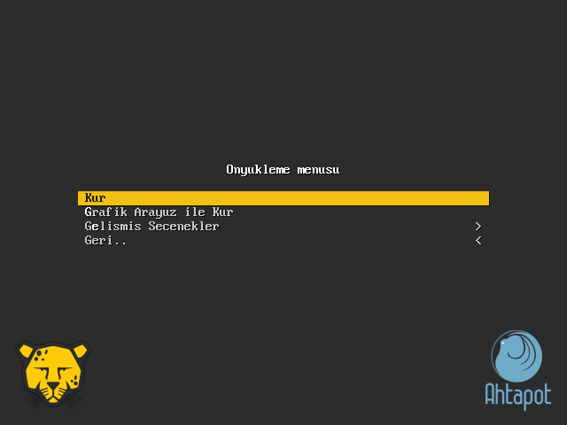

 * Pardus-Ahtapot ISO'sundan kurulacak **sistemin dilini** seçiniz.

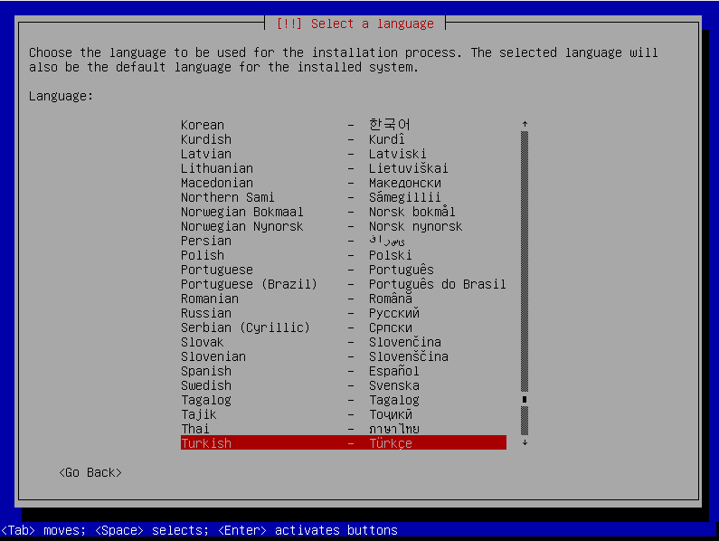 

 * **Konum** bilginizi seçiniz.

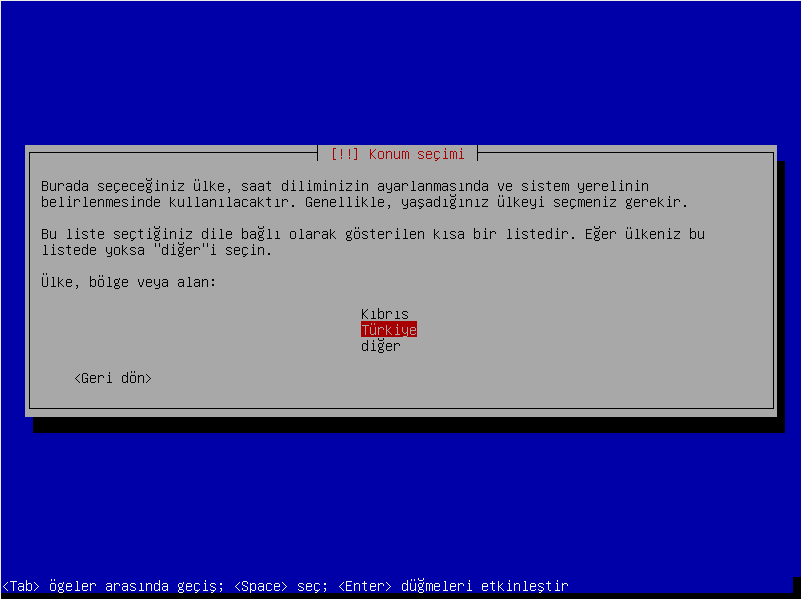

 * Kullanmak istediğiniz **Klavye** ayarını seçiniz.

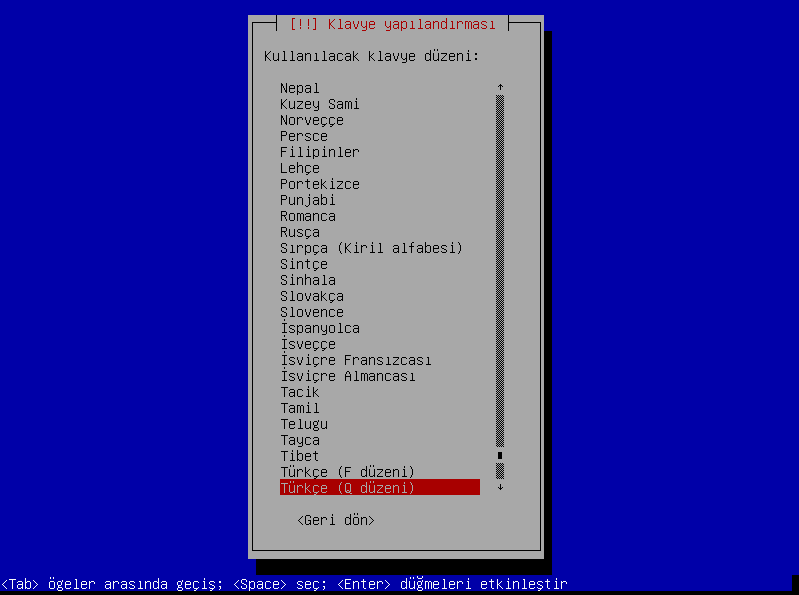
  
 * Sunucunun sahip olması istenen ağ ayarları için **IP adresi:** giriniz, **Devam** seçeneği ile ilerleyiniz.

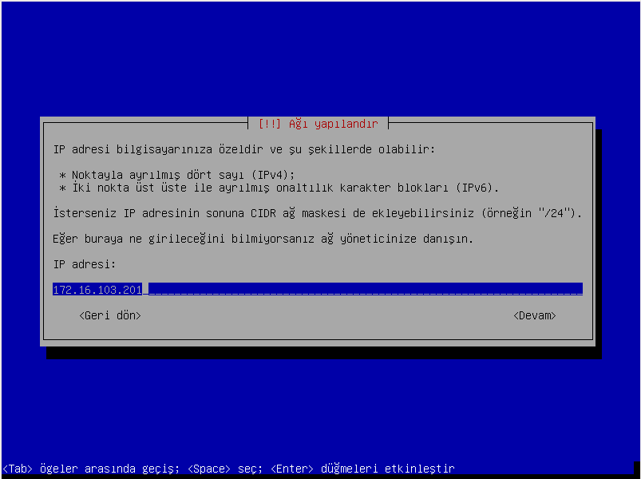

 * **Ağ maskesi:** bilgisi giriniz, **Devam** seçeneği ile ilerleyiniz.

 * **Ağ geçidi:** bilgisi giriniz, **Devam** seçeneği ile ilerleyiniz.

 * Ağ yapılandırma ayarları bakımdan erişim bilgisi olarak girilecek son bilgi olan **Alan adı sunucusu adresleri:**  ilgili IP adresini giriniz, **Devam** seçeneği ile ilerleyiniz.

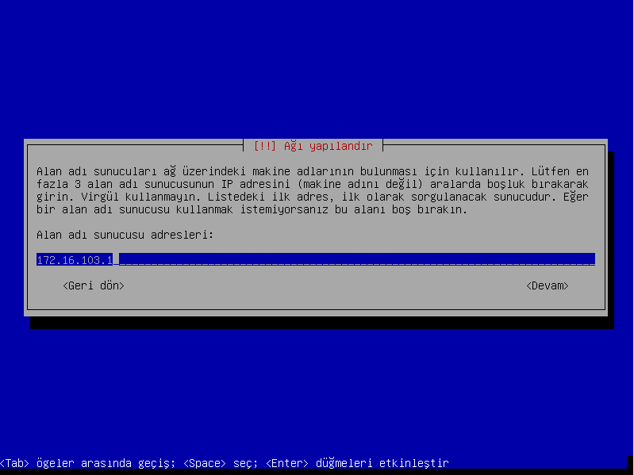

 * Ağ yapılandırma ayarları kapsamında makineye verilmesi planlanan isim **Makine adı:** girilerek **Devam** seçeneği ile ilerleyiniz.

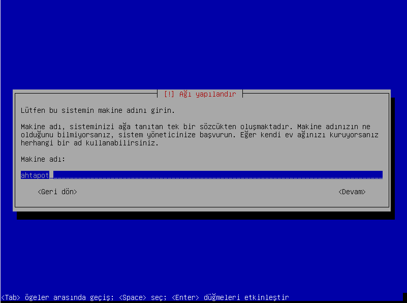

 * Makinenin dahil olacağı etki alanı bilgisini **Alan adı:** giriniz, **Devam** seçeneği ile ilerleyiniz.

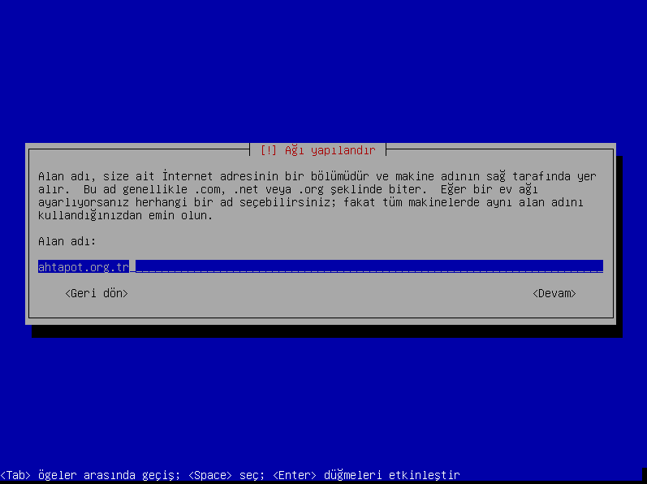

 * **Diskleri bölümle** ekranında **Bölümleme şeması:** altında bulunan **Tüm dosyalar tek bölümde (yeni kullanıcılara tavsiye edilir)** seçeneği seçiniz, ve ENTER tuşuna basarak ilerleyiniz.

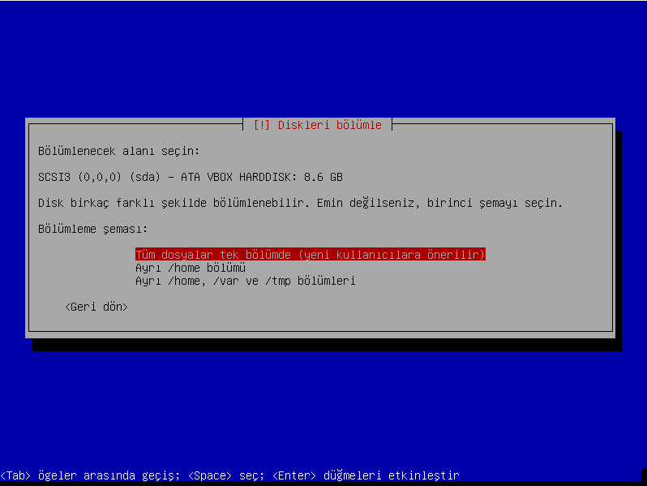

 * Girilen bilgiler doğrultusunda **Temel sistem kurulumu başlar**.

 
  * **GRUB önyükleyici bir sabit diske kur** ekranında, **Önyükleyicinin kurulacağı aygıt:** seçeneğinin altında bulunan **/dev/sda (ata-VBOX_HARDDISK_….)** seçeneğini seçiniz, ENTER tuşuna basarak devam ediniz.

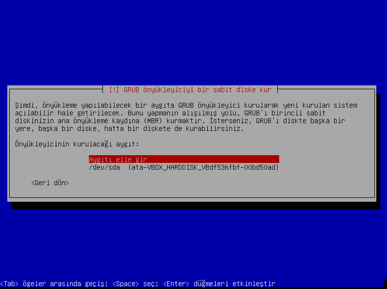

  * Kurulumun tamamlanmasının ardından, Pardus-Ahtapot giriş ekranını göreceksiniz.

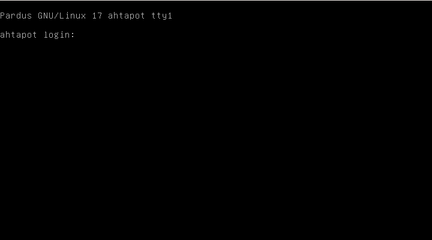

  * Pardus-Ahtapot ISO sunda öntanımlı kullanıcı **ahtapotops** , öntanımlı parola **LA123** ' tür. Kullanıcı adı ve parola ile giriş yapınız, varolan parolanızı tekrar girmenizi isteyen bir yazı ekrana gelecektir.

  * Pardus-Ahtapot ISO kurulumu tamamlanıp giriş yapıldığında en az 8 karakterli yeni parola belirleyiniz.

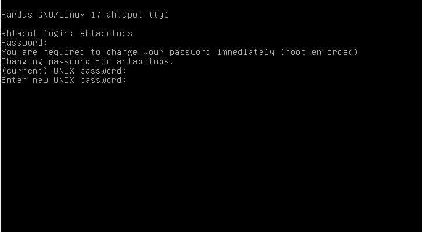

  * Kurulumun tamamlanmasından sonra preseed yapılandırması ile kuruluma eklenmiş ve sistemin hazır hale gelmesine yardımcı olacak aşağıdaki adımlar da gerçekleşmiştir.
	* python, sudo,openssh-server paketleri kurulmuştur.
	* ahtapotops isimli bir kullanıcı ve grup oluşturulmuştur.
	* ahtapotops kullanıcısına parolasız erişim için gerekli yapılandırmalar yapılmıştır.
	Bu işlemler: 
		* ISO içerisinde bulunan ahtapot_ca.pub dosyası, parolasız erişimlerde anahtarın yetkisini kontrol etmek için /etc/ssh/ahtapot_ca.pub dizinine kopyalanır. 
		* /etc/sudoers dosyasına ahtapotops kullanıcısı ile parolasız root yetkilerine sahip olabilmesi için **'ahtapotops  ALL=(ALL:ALL) NOPASSWD:ALL'**  satırı eklenir.
		* Sertifika otoritesi tarafından imzalanacak anahtarlar ile güvenli giriş yapılabilmesi için “**TrustedUserCAKeys /etc/ssh/ahtapot_ca.pub**" satırı /etc/ssh/sshd_config dosyasına eklenir.
  * Disk yapılandırma için LVM kullanılmakta olup, kurulum tamamlandığında aşağıdaki şekilde disk yapılandırması mevcut olacaktır.

| Dizin Adı | Dosya Sistemi | Boyut                   |
| --------- | ------------- | ----------------------- |
| BIOS boot | -             | 1 MB                    |
| /boot     | ext3          | 250 MB                  |
| /         | ext4          | 50 GB                   |
| /var/log  | ext4          | Disk üzerinde kalan yer |
------

 * Pardus Temel ISO kurulumu sonrasında istemci üzerinde bulunan tüm paketlerin listesi aşağıdaki gibidir;

| Paket Listesi          |                                |                            |                     |
| ---------------------- | ------------------------------ | -------------------------- | ------------------- |
| acl                    | laptop-detect                  | libmagic1:amd64            | xml-core            |
| acpi                   | less                           | libmodule-build-perl       | linux-image-amd64   |
| adduser                | libacl1:amd64                  | libmodule-pluggable-perl   | locales             |
| anacron                | libalgorithm-c3-perl           | libmodule-signature-perl   | login               |
| apt                    | libapt-inst1.5:amd64           | libmount1:amd64            | logrotate           |
| apt-utils              | libapt-pkg4.12:amd64           | libmro-compat-perl         | lsb-base            |
| avahi-autoipd          | libarchive-extract-perl        | libncurses5:amd64          | lvm2                |
| base-files             | libasprintf0c2:amd64           | libncursesw5:amd64         | man-db              |
| base-passwd            | libattr1:amd64                 | libnettle4:amd64           | manpages            |
| bash                   | libaudit-common                | libnewt0.52:amd64          | mawk                |
| bluetooth              | libaudit1:amd64                | libnfnetlink0:amd64        | mime-support        |
| bluez                  | libblkid1:amd64                | libnl-3-200:amd64          | mount               |
| bsdmainutils           | libboost-iostreams1.55.0:amd64 | libnl-genl-3-200:amd64     | multiarch-support   |
| bsdutils               | libbsd0:amd64                  | libp11-kit0:amd64          | nano                |
| busybox                | libbz2-1.0:amd64               | libpackage-constants-perl  | ncurses-base        |
| console-setup          | libc-bin                       | libpam-modules:amd64       | ncurses-bin         |
| console-setup-linux    | libc6:amd64                    | libpam-modules-bin         | ncurses-term        |
| coreutils              | libcap-ng0:amd64               | libpam-runtime             | net-tools           |
| cpio                   | libcap2:amd64                  | libpam0g:amd64             | netbase             |
| crda                   | libcap2-bin                    | libparams-util-perl        | netcat-traditional  |
| cron                   | libcgi-fast-perl               | libpci3:amd64              | openssh-client      |
| dash                   | libcgi-pm-perl                 | libpcre3:amd64             | openssh-server      |
| dbus                   | libclass-c3-perl               | libpcsclite1:amd64         | openssh-sftp-server |
| debconf                | libclass-c3-xs-perl            | libpipeline1:amd64         | os-prober           |
| debconf-i18n           | libcomerr2:amd64               | libpng12-0:amd64           | passwd              |
| debian-archive-keyring | libcpan-meta-perl              | libpod-latex-perl          | pciutils            |
| debianutils            | libcryptsetup4:amd64           | libpod-readme-perl         | perl                |
| dictionaries-common    | libdaemon0:amd64               | libpopt0:amd64             | perl-base           |
| diffutils              | libdata-optlist-perl           | libprocps3:amd64           | perl-modules        |
| discover               | libdata-section-perl           | libpsl0:amd64              | powertop            |
| discover-data          | libdb5.3:amd64                 | libpython-stdlib:amd64     | procps              |
| dmeventd               | libdbus-1-3:amd64              | libpython2.7-minimal:amd64 | python              |
| dmidecode              | libdebconfclient0:amd64        | libpython2.7-stdlib:amd64  | python-minimal      |
| dmsetup                | libdevmapper-event1.02.1:amd64 | libreadline5:amd64         | python2.7           |
| dpkg                   | libdevmapper1.02.1:amd64       | libreadline6:amd64         | python2.7-minimal   |
| e2fslibs:amd64         | libdiscover2                   | libregexp-common-perl      | readline-common     |
| e2fsprogs              | libdns-export100               | libselinux1:amd64          | rename              |
| emacsen-common         | libedit2:amd64                 | libsemanage-common         | rsyslog             |
| file                   | libexpat1:amd64                | libsemanage1:amd64         | sed                 |
| findutils              | libfcgi-perl                   | libsepol1:amd64            | sensible-utils      |
| gcc-4.8-base:amd64     | libffi6:amd64                  | libslang2:amd64            | sgml-base           |
| gcc-4.9-base:amd64     | libfreetype6:amd64             | libsmartcols1:amd64        | shared-mime-info    |
| gettext-base           | libfuse2:amd64                 | libsoftware-license-perl   | startpar            |
| gnupg                  | libgcc1:amd64                  | libsqlite3-0:amd64         | sudo                |
| gpgv                   | libgcrypt20:amd64              | libss2:amd64               | systemd             |
| grep                   | libgdbm3:amd64                 | libssl1.0.0:amd64          | systemd-sysv        |
| groff-base             | libglib2.0-0:amd64             | libstdc++6:amd64           | sysv-rc             |
| grub-common            | libglib2.0-data                | libsub-exporter-perl       | sysvinit-utils      |
| grub-pc                | libgmp10:amd64                 | libsub-install-perl        | tar                 |
| grub-pc-bin            | libgnutls-deb0-28:amd64        | libsystemd0:amd64          | task-english        |
| grub2-common           | libgnutls-openssl27:amd64      | libtasn1-6:amd64           | task-laptop         |
| gzip                   | libgpg-error0:amd64            | libterm-ui-perl            | tasksel             |
| hostname               | libgssapi-krb5-2:amd64         | libtext-charwidth-perl     | tasksel-data        |
| iamerican              | libhogweed2:amd64              | libtext-iconv-perl         | tcpd                |
| ibritish               | libicu52:amd64                 | libtext-soundex-perl       | traceroute          |
| ienglish-common        | libidn11:amd64                 | libtext-template-perl      | tzdata              |
| ifupdown               | libirs-export91                | libtext-wrapi18n-perl      | ucf                 |
| init                   | libisc-export95                | libtinfo5:amd64            | udev                |
| init-system-helpers    | libisccfg-export90             | libudev1:amd64             | util-linux          |
| initramfs-tools        | libiw30:amd64                  | libusb-0.1-4:amd64         | util-linux-locales  |
| initscripts            | libjson-c2:amd64               | libustr-1.0-1:amd64        | vim-common          |
| insserv                | libk5crypto3:amd64             | libuuid-perl               | vim-tiny            |
| installation-report    | libkeyutils1:amd64             | libuuid1:amd64             | wamerican           |
| iproute2               | libklibc                       | libwrap0:amd64             | wget                |
| iptables               | libkmod2:amd64                 | libx11-6:amd64             | whiptail            |
| iputils-ping           | libkrb5-3:amd64                | libx11-data                | wireless-regdb      |
| isc-dhcp-client        | libkrb5support0:amd64          | libxau6:amd64              | wireless-tools      |
| isc-dhcp-common        | liblocale-gettext-perl         | libxcb1:amd64              | wpasupplicant       |
| ispell                 | liblog-message-perl            | libxdmcp6:amd64            | xauth               |
| iw                     | liblog-message-simple-perl     | libxext6:amd64             | xdg-user-dirs       |
| kbd                    | liblogging-stdlog0:amd64       | libxml2:amd64              | xkb-data            |
| keyboard-configuration | liblognorm1:amd64              | libxmuu1:amd64             |                     |
| kmod                   | liblvm2cmd2.02:amd64           | libxtables10               |                     |
| krb5-locales           | liblzma5:amd64                 | linux-base                 |                     |
| libnl-genl-3-200:amd64 | linux-image-3.16.0-4-amd64     | zlib1g:amd64               |                     |

**Sayfanın PDF versiyonuna erişmek için [buraya](pardus-temel-iso-kurulumu.pdf) tıklayınız.**
