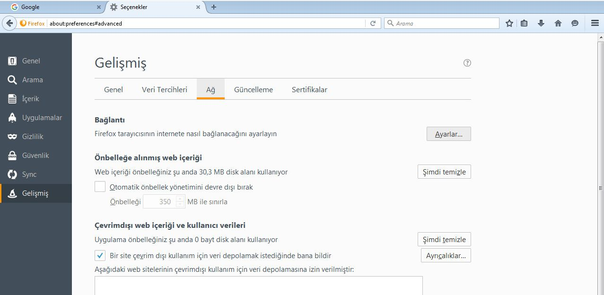
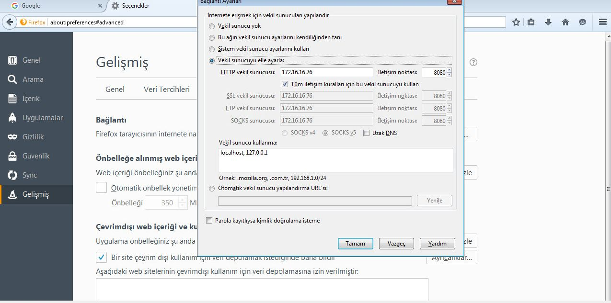
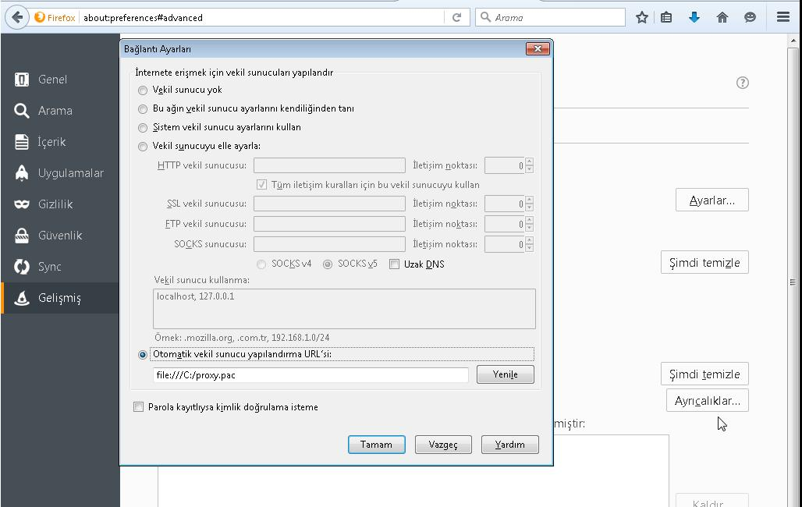
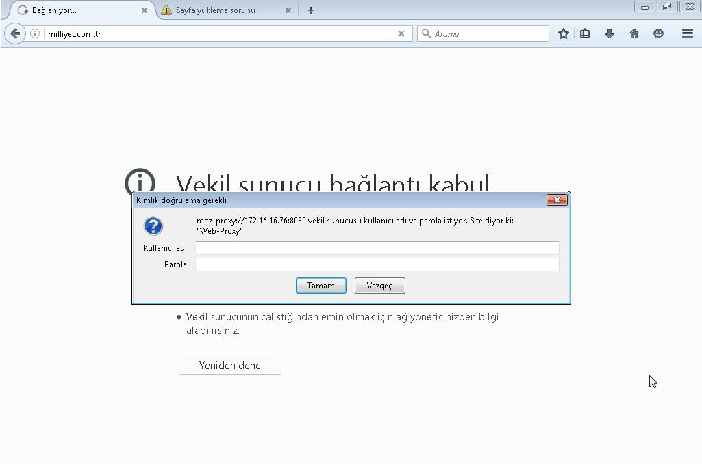
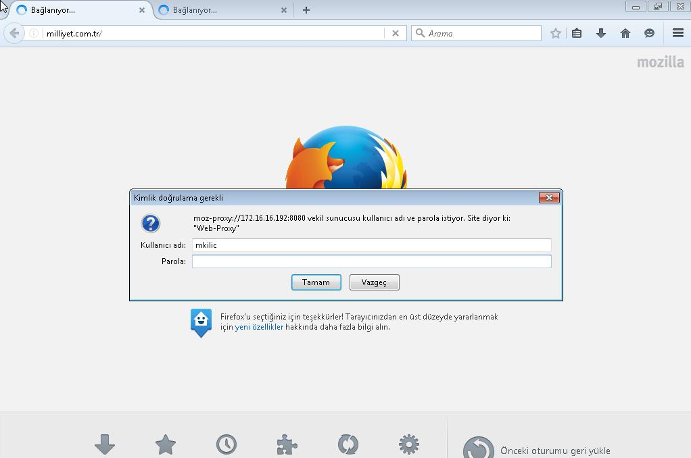

# Güvenli İnternet Erişim Sistemi (PROXY) Kurulum Yönergesi
------

[TOC]

------

Bu dokümanda, Ahtapot projesi, Güvenli İnternet ve Güvenli İnternet Erişimine ait bir bileşen olarak kullanılmak üzere bir Web Proxy sunucusu kurulumu ve ilgili proxy sunucusunun merkezi yönetim sisteminin ihtiyaçlarına cevap verecek şekilde yapılandırılması anlatılmaktadır.

###Web Proxy İzin İsteme Sistemi Kurulum İşlemleri

* **NOT:** Dökümanda yapılması istenilen değişiklikler gitlab arayüzü yerine terminal üzerinden yapılması durumunda playbook oynatılmadan önce yapılan değişiklikler git'e push edilmelidir.

```
$ cd /etc/ansible
git status komutu ile yapılan değişiklikler gözlemlenir.
$ git status  
$ git add --all
$ git commit -m "yapılan değişiklik commiti yazılır"
$ git push origin master
```
**NOT:** Kurulacak sistem, SIEM yapısına dahil edilmek isteniyorsa, kurulum sonrasında Siber Olay, Açıklık, Risk İzleme ve Yönetim Sistemi Kurulumu sayfasında bulunan [LMYS Clientlarında Ossec Agent Dağıtımı](siem-kurulum.md) başlığı incelenmelidir.

* Gitlab adresine  bir web tarayıcı vasıtası ile girilerek Gitlab web arayüzüne “**https://gitlabsunucuadresi**” ile erişilir. 

* Gitlab arayüzünden mys resposundaki “**hosts**” dosyasında “**[pwlm]**” fonksiyonu altına pwlm sunucusunun FQDN bilgisi girilir.

```
[pwlm]
pwlm01.gdys.local
``` 

* Gitlab arayüzünden mys reposundaki  “**roles/base/vars/host.yml**” dosyasına pwlm sunucusunun ip adresi, FQDN bilgisi ve hostname’i yeni bir server bloğu oluşturularak yazılır. 

```
serverN:
        ip: "X.X.X.X"
        fqdn: "pwlm.gdys.local"
        hostname: "pwlm"
```
* Gitlab arayüzünden mys reposundaki "**roles/pwlm/vars**" klasörü altında git değişkenlerini barındıran "**git.yml**" dosyası üzerinde "**repo01**" başlığı altındaki "**repo**" satırında bulunan "**yerel_gitlab_adresi**" bölümünün yerine Merkezi Yönetim Sistemi kapsamında kurulacak Git sunucusunun ip adresi girilmelidir. Eğer sunucularda varsayılan ssh portu dışında port kullanılacak ise "**:ssh_port**" bilgisi girilmeli, kullanılmadığı durumlarda ise "**:ssh_port**" kısmı silinmelidir.

```
# Gitin degiskenlerini iceren dosyadir
gitrepos:
    repo01:
        repo: "ssh://git@yerel_gitlab_adresi:ssh_port/ahtapotops/mys.git"
        accept_hostkey: "yes"
        destination: "/home/ahtapotops/mys"
        key_file: "/home/ahtapotops/.ssh/id_rsa"
#    repoXX:
#        repo: ""
#        accept_hostkey: ""
#        destination: ""
#        key_file: ""
```

* Gitlab arayüzünden mys reposundaki "**roles/pwlm/vars**" dizini içerisinde bulunan "**nginx.yml**" dosyası içerisine "**pwlm**" fonksiyonu altında bulunan "**server_name**" satırına izin isteme sistemi arayüz için ayarlanması istenen url bilgisi yazılır (Örn: pwlm.gdys.local).

```
# Nginx'in degiskenlerini iceren dosyadir
nginx:
    conf:
        source: "pwlm.conf.j2"
        destination: "/etc/nginx/conf.d/pwlm.conf"
        owner: "root"
        group: "root"
        mode: "0644"
    pwlm:
        listen: "443"
        server_name: "pwlm.gdys.local"
        access_log: "/var/log/nginx/pwlm-access.log"
        error_log: "/var/log/nginx/pwlm-error.log"
    service:
        name: "nginx"
        state: "started"
        enabled: "yes"
    default:
        path: "/etc/nginx/sites-available/default"
        state: "absent"
    certificate:
        source: "pwlm.crt.j2"
        destination: "/etc/nginx/ssl/pwlm.crt"
        owner: "root"
        group: "root"
        mode: "0644"
    key:
        source: "pwlm.key.j2"
        destination: "/etc/nginx/ssl/pwlm.key"
        owner: "root"
        group: "root"
        mode: "0644"
    ssldir:
        path: "/etc/nginx/ssl"
        owner: "root"
        group: "root"
        mode: "755"
        state: "directory"
```
* AHTAPOT CA Kurulumu ve Anahtar Yönetimi dokümanında tarif edildiği üzere, pwlm makinesinin gitlab arayüzüne erişebilmesi key oluşturulur. Daha sonra oluşan public key Gitlab Kurulum dosyasında anlatıldığı gibi ssh key olarak eklenmelidir.
* Eklenen keyler home dizinindeki “.ssh” dizini içine kopyalanması gerekir. Kopyalanacak dosya isimleri “id_rsa” olarak değiştirilmelidir. 
* Gitlab arayüzünde tüm değişikler gerçekleştirildikten sonra değişikliklerin master branch yetkisine sahip bir kullanıcı tarafından onaylanması için “**Merge Request**” oluşturulması gerekir. Sol tarafta bulunan “**Merge Request**” sekmesine tıklanır ve “**CREATE MERGE REQUEST**” butonuna basılarak yapılan commit’lerin onaylanması için istek oluşturulur.
* Master branch yetkisine sahip bir kullanıcı tarafından oluşturulan merge request onaylandığı takdirde playbook oynayacak ve pwlm sistemi istenilen sunucuya kurulmuş olacaktır.

###Web Proxy Kurulumu

Bu doküman izlenerek yapılan işlemlerin sonucunda, kurulum ve yapılandırma otomatizasyonu için ansible kurulacak ve bağlı olarak temel sunucu sıkılaştırma işlemleri ile web proxy kurulumu otomatik olarak yapılacaktır. Kurulumların ardından yapılandırma işlemleri olarak squid proxy’nin konfigürasyon dosyası üzerinde durulacaktır. Yukarıda özeti verilen ve adımları aşağıda maddelendirilmiş olan tüm işlemler için gerekli olan ek dokümantasyonlara erişim bilgileri ilgili başlıklarda NOT olarak ifade edilmiştir.

* **NOT:** Dökümanda yapılması istenilen değişiklikler gitlab arayüzü yerine terminal üzerinden yapılması durumunda playbook oynatılmadan önce yapılan değişiklikler git'e push edilmelidir.

```
$ cd /etc/ansible
git status komutu ile yapılan değişiklikler gözlemlenir.
$ git status  
$ git add --all
$ git commit -m "yapılan değişiklik commiti yazılır"
$ git push origin master
```
**NOT:** Kurulacak sistem, SIEM yapısına dahil edilmek isteniyorsa, kurulum sonrasında Siber Olay, Açıklık, Risk İzleme ve Yönetim Sistemi Kurulumu sayfasında bulunan [LMYS Clientlarında Ossec Agent Dağıtımı](siem-kurulum.md) başlığı incelenmelidir.

* Gitlab arayüzünden mys reposuna erişilerek burada bulunan “**hosts**" dosyasına proxy sunucusunun FQDN bilgisi aşağıdaki gibi girilir.

```
[proxy]
squid.gdys.local
```

* Gitlab arayüzünden mys reposuna erişilerek "**roles/base/vars/host.yml**" dosyasına proxy sunucusunun IP adresi, FQDN bilgisi ve hostname’i yeni bir server bloğu oluşturularak yazılır.


```
serverN:
        ip: "X.X.X.X"
        fqdn: "squid.gdys.local"
        hostname: "squid"
```
* Squid proxy'nin konfigürasyon dosyası için Gitlab arayüzünden mys reposuna erişilerek “**roles/squid/templates/squid**" dizini altına "**squid_fqdn_bilgisi.conf.j2**" formatında bir dosya oluşturulmalıdır. Oluşturulan bu dosyanın içeriği aşğıdaki gibi olmalıdır. 


```
## Bu dosya ansible tarafindan yonetilmektedir!
## Burada yapilan degisikliklerin uzerine yazilir!!
{{ ansible_managed }}

# Network definitions
#acl localnet src 192.168.0.0/16 # RFC1918 possible internal network

# Ldap Authentication
 
auth_param basic program /usr/lib/squid3/basic_ldap_auth -R -b "{{ squid['ldap']['domain'] }}" -D "{{ squid['ldap']['workgroup'] }}\\{{ squid['ldap']['user'] }}" -w "{{ squid['ldap']['password'] }}" -f "{{ squid['ldap']['option'] }}" -h {{ squid['ldap']['host'] }}
auth_param basic children 5
auth_param basic realm Web-Proxy
auth_param basic credentialsttl 8 hours
acl ldap-auth proxy_auth REQUIRED


# Port definitions
acl Safe_ports port 80      # http
acl Safe_ports port 443     # https

# Blocks file upload
acl blockfile req_mime_type -i ^.*multipart/form-data.*
http_access deny blockfile

 
http_access allow ldap-auth

http_access deny all
http_port {{ squid['http_port'] }}

# Cache Section
coredump_dir /var/spool/squid3
refresh_pattern ^ftp:           1440    20%     10080
refresh_pattern ^gopher:        1440    0%      1440
refresh_pattern -i (/cgi-bin/|\?) 0     0%      0
refresh_pattern .               0       20%     4320
cache_dir ufs /var/spool/squid3 100 16 256
```

* Squid proxy üzerinde çalışacak dansguardian’ının konfigürasyon dosyası için Gitlab arayüzünden mys reposuna erişilerek “**roles/squid/templates/dansguardian/configuration**" dizini altında “**squid.fqdn_bilgisi.conf.j2**" formatında squid makinesinin FQDN bilgisinin yer aldığı bir dosya oluşturulmalıdır. Bu dosyanın içeriği aşğıdaki gibi olmalıdır.

```
## Bu dosya ansible tarafindan yonetilmektedir!
## Burada yapilan degisikliklerin uzerine yazilir!!
{{ ansible_managed }}

# DansGuardian config file for version 2.10.1.1
# **NOTE** as of version 2.7.5 most of the list files are now in dansguardianf1.conf

reportinglevel = 3

languagedir = '/etc/dansguardian/languages'
language = 'ukenglish'

loglevel = 2
logexceptionhits = 2

# Log File Format
# 1 = DansGuardian format (space delimited)
# 2 = CSV-style format
# 3 = Squid Log File Format
# 4 = Tab delimited
logfileformat = 1

# truncate large items in log lines
#maxlogitemlength = 400

anonymizelogs = {{ dansguardian['anonymizelogs'] }}

# Syslog logging
#
# Use syslog for access logging instead of logging to the file
# at the defined or built-in "loglocation"
#syslog = on

loglocation = '{{ dansguardian['loglocation'] }}'
statlocation = '{{ dansguardian['loglocation'] }}'

# Network Settings

filterip =
filterport = {{ dansguardian['filterport'] }} 

proxyip = {{ dansguardian['proxyip'] }}
proxyport = {{ dansguardian['proxyport'] }}

accessdeniedaddress = '{{ dansguardian['accessdeniedaddress'] }}'
nonstandarddelimiter = on

usecustombannedimage = on
custombannedimagefile = '{{ dansguardian['custombannedimagefile'] }}'

# Filter groups options
# filtergroups sets the number of filter groups. A filter group is a set of content
# filtering options you can apply to a group of users.  The value must be 1 or more.
# DansGuardian will automatically look for dansguardianfN.conf where N is the filter
# group.  To assign users to groups use the filtergroupslist option.  All users default
# to filter group 1.  You must have some sort of authentication to be able to map users
# to a group.  The more filter groups the more copies of the lists will be in RAM so
# use as few as possible.
filtergroups = 1
filtergroupslist = '/etc/dansguardian/lists/filtergroupslist'

# Authentication files location
bannediplist = '{{ dansguardian['bannediplist'] }}'
exceptioniplist = '{{ dansguardian['exceptioniplist'] }}'

# Weighted phrases 
showweightedfound = on
weightedphrasemode = 2

# Caching for URLs
urlcachenumber = 1000
urlcacheage = 900
scancleancache = on

# Phrase filter section
phrasefiltermode = 2
preservecase = 0

# Hex decoding options
hexdecodecontent = off

# Force Quick Search rather than DFA search algorithm
forcequicksearch = off

# Reverse lookups
reverseaddresslookups = off
reverseclientiplookups = off
logclienthostnames = off

# Build bannedsitelist and bannedurllist cache files.
createlistcachefiles = on

# POST protection (web upload and forms)
maxuploadsize = {{ dansguardian['maxuploadsize'] }}

# Content section
maxcontentfiltersize = 256
maxcontentramcachescansize = 2000
maxcontentfilecachescansize = 20000

# File cache dir
filecachedir = '/tmp'
deletedownloadedtempfiles = on

# Trickle delay
initialtrickledelay = 20
trickledelay = 10

# Download Managers
downloadmanager = '/etc/dansguardian/downloadmanagers/fancy.conf'
#downloadmanager = '/etc/dansguardian/downloadmanagers/trickle.conf'
downloadmanager = '/etc/dansguardian/downloadmanagers/default.conf'

# Content Scanners (Also known as AV scanners)
#
# Some of the scanner(s) require 3rd party software and libraries eg clamav.
# See the individual plugin conf file for more options (if any).
#
#contentscanner = '/etc/dansguardian/contentscanners/clamav.conf'
#contentscanner = '/etc/dansguardian/contentscanners/clamdscan.conf'
#!! Unimplemented !! contentscanner = '/etc/dansguardian/contentscanners/kavav.conf'
#!! Not compiled !! contentscanner = '/etc/dansguardian/contentscanners/kavdscan.conf'
#contentscanner = '/etc/dansguardian/contentscanners/icapscan.conf'
#contentscanner = '/etc/dansguardian/contentscanners/commandlinescan.conf'

# Content scanner timeout
contentscannertimeout = 60
contentscanexceptions = off

# Auth plugins
# These replace the usernameidmethod* options in previous versions. They
# handle the extraction of client usernames from various sources, such as
# Proxy-Authorisation headers and ident servers, enabling requests to be
# handled according to the settings of the user's filter group.
# Multiple plugins can be specified, and will be queried in order until one
# of them either finds a username or throws an error. For example, if Squid
# is configured with both NTLM and Basic auth enabled, and both the 'proxy-basic'
# and 'proxy-ntlm' auth plugins are enabled here, then clients which do not support
# NTLM can fall back to Basic without sacrificing access rights.
#
# If you do not use multiple filter groups, you need not specify this option.
#
authplugin = '/etc/dansguardian/authplugins/proxy-basic.conf'
#authplugin = '/etc/dansguardian/authplugins/proxy-digest.conf'
#authplugin = '/etc/dansguardian/authplugins/proxy-ntlm.conf'
#authplugin = '/etc/dansguardian/authplugins/ident.conf'
#authplugin = '/etc/dansguardian/authplugins/ip.conf'

# Re-check replaced URLs
# As a matter of course, URLs undergo regular expression search/replace (urlregexplist)
# *after* checking the exception site/URL/regexpURL lists, but *before* checking against
# the banned site/URL lists, allowing certain requests that would be matched against the
# latter in their original state to effectively be converted into grey requests.
# With this option enabled, the exception site/URL/regexpURL lists are also re-checked
# after replacement, making it possible for URL replacement to trigger exceptions based
# on them.
# Defaults to off.
recheckreplacedurls = off

# Misc settings

forwardedfor = on
usexforwardedfor = off
logconnectionhandlingerrors = on
logchildprocesshandling = off

# Children Options
maxchildren = {{ dansguardian['maxchildren'] }}
minchildren = {{ dansguardian['minchildren'] }}
maxsparechildren = {{ dansguardian['maxsparechildren'] }}
minsparechildren = {{ dansguardian['minsparechildren'] }}
preforkchildren = {{ dansguardian['preforkchildren'] }}
maxagechildren = {{ dansguardian['maxagechildren'] }}

maxips = 0

# Process options
# (Change these only if you really know what you are doing).
# These options allow you to run multiple instances of DansGuardian on a single machine.
# Remember to edit the log file path above also if that is your intention.

# IPC filename
ipcfilename = '/tmp/.dguardianipc'

# URL list IPC filename
urlipcfilename = '/tmp/.dguardianurlipc'

# IP list IPC filename
ipipcfilename = '/tmp/.dguardianipipc'

# PID filename
#pidfilename = '/var/run/dansguardian.pid'

# Disable daemoning
nodaemon = off

# Disable logging process
nologger = off

# Enable logging of "ADs" category blocks
logadblocks = off

# Enable logging of client User-Agent
loguseragent = off

# Daemon runas user and group
#daemonuser = 'dansguardian'
#daemongroup = 'dansguardian'

# Soft restart
softrestart = off

# Mail program
mailer = '/usr/sbin/sendmail -t'
```

* Gitlab arayüzünden mys reposuna erişilerek burada bulunan “**roles/squid/vars**" dizini altında değişkenleri barındıran “**squid.yml**" dosyası üzerinde “**ldap**" başlığı altında belirtilen “**host:**" satırına ldap sunucusunun FQDN bilgisi, “**domain:**" satırına ise ldap makinesine ldap uygulmasını kurarken belirlenmiş domain bilgisi, "**workgroup**" satırına ldap ve ya active directory de admin user'ının bulunduğu domain yapısı , "**user**" satırına ldap ile bağlantı sağlayacak kullanıcı bilgisi, "**password**" ldap ile bağlanacak kullanacak kullanıcının şifresi ve "**option**" satırına ldap içerisinde user'lar için nereye bakacağı belirtilmelidir. uid=%s parametresi ile tüm userların kontrol edilmesi sağlanır.

**NOT :** Eğer ldap'sız kurulum yapılacak ise "**ldap**" fonskyionu altında bulunan "**enabled**" satırına "**no**" bilgisi girilir "**host**", "**domain**", "**workgroup**", "**user**", "**password**" ve "**option**" bilgileri boş bırakılabilir.

```
squid:
# Squid yapilandirmasini belirtmektedir.
    conf:
        source: "squid"
        destination: "/etc/squid3/squid.conf"
        owner: "root"
        group: "root"
        mode: "0644" 
    service:
        name: "squid3"
        state: "started"
        enabled: "yes"
    ldap:  
        enabled: "yes" 
        host: "ldap01.gdys.local"
        domain: "dc=ulakbim,dc=com"
        workgroup: "workgroup"
        user: "user"
        password: "pass"
        option: "option"
    http_port: "3128"
```

* Gitlab arayüzünden mys reposuna erişilerek burada bulunan “**roles/squid/vars**" dizini altında değişkenleri barındıran “**dansguardian.yml**" dosyası üzerinde “**Dansguardian yapilandirmasini belirtmektedir.**" başlığı altında belirtilen “**proxyip:**" satırına squid proxy ile dansguardian aynı makine üzerinde çalıştığı için “**localhost**" bilgisi girilmelidir. “**proxyport:**" satırına ise squid proxy’nin çalıştığı port bilgisi değiştirilmişse yeni port bilgisi, herhangi bir değişiklik gerçekleştirilmediyse olduğu gibi bırakılmalıdır. “**address:**" satırına web proxy izin isteme sisteminin bulunduğu sunucunun FQDN bilgisi girilmelidir. “**Accessdeniedaddress:**" blacklist’te yer alan url’lere erişelemediğinde clientlara gösterilecek arayüzün bulunduğu adres bilgisi girilmelidir.


```
---
dansguardian:
# Dansguardian yapilandirmasini belirtmektedir.
    conf:
        source: "dansguardian/configuration"
        destination: "/etc/dansguardian/dansguardian.conf"
        owner: "root"
        group: "root"
        mode: "0644" 
    f1conf:
        source: "dansguardian/configuration/dansguardianf1.conf.j2"
        destination: "/etc/dansguardian/dansguardianf1.conf"
        owner: "root"
        group: "root"
        mode: "0644" 
    service:
        name: "dansguardian"
        state: "started"
        enabled: "yes"
    anonymizelogs: "off"
    loglocation: "/var/log/dansguardian/access.log"
    statlocation: "/var/log/dansguardian/stats"
    filterport: "8080" 
    proxyip: "localhost" 
    proxyport: "3128" 
    accessdeniedaddress: "http://YOURSERVER.YOURDOMAIN/cgi-bin/dansguardian.pl" 
    custombannedimagefile: "/usr/share/dansguardian/transparent1x1.gif" 
    bannediplist: "/etc/dansguardian/lists/bannediplist" 
    exceptioniplist: "/etc/dansguardian/lists/exceptioniplist" 
    maxuploadsize: "0"
    maxchildren: "120"
    minchildren: "8"
    maxsparechildren: "32"
    minsparechildren: "4"
    preforkchildren: "6"
    maxagechildren: "500"
    updshalla:
        path: "/etc/dansguardian/lists/blacklists/shalla"
        owner: "root"
        group: "root"
        state: "directory"
        mode: "755" 
    request:
        html:
            source: "request/template.html.j2"
            #source: "request/template_phone.html.j2" # Aktif hale getirmek icin ust satiri yorumlayip bu satiri aciniz
            destination: "/etc/dansguardian/languages/ukenglish/template.html"
            owner: "root"
            group: "root"
            mode: "0644"
        address: "pwlm.gdys.local"
        port: "443"
        telephone: "542-911-0724"
    
dansguardian_locallists:
# Yerel listeler yerel proxy sunucularinda yapilacak olan engelleme islemlerinde kullanilir.
    list01:
        path: "/etc/dansguardian/lists/bannedurllist_local"
    list02:
        path: "/etc/dansguardian/lists/bannedsitelist_local"
    list03:
        path: "/etc/dansguardian/lists/exceptionurllist_local"
    list04:
        path: "/etc/dansguardian/lists/exceptionsitelist_local"
           

dansguardian_blacklists:
    list01:
        source: "dansguardian/bannedurllist/bannedurllist.j2" 
        destination: "/etc/dansguardian/lists/bannedurllist"
        owner: "root" 
        group: "root" 
        mode: "0644" 
    list02:
        source: "dansguardian/bannedurllist/bannedurllist_general.j2" 
        destination: "/etc/dansguardian/lists/bannedurllist_general"
        owner: "root" 
        group: "root" 
        mode: "0644" 
    list03:
        source: "dansguardian/bannedsitelist/bannedsitelist.j2" 
        destination: "/etc/dansguardian/lists/bannedsitelist"
        owner: "root" 
        group: "root" 
        mode: "0644" 
    list04:
        source: "dansguardian/bannedsitelist/bannedsitelist_general.j2" 
        destination: "/etc/dansguardian/lists/bannedsitelist_general"
        owner: "root" 
        group: "root" 
        mode: "0644" 


dansguardian_whitelists:
    list01:
        source: "dansguardian/exceptionurllist/exceptionurllist.j2" 
        destination: "/etc/dansguardian/lists/exceptionurllist"
        owner: "root" 
        group: "root" 
        mode: "0644" 
    list02:
        source: "dansguardian/exceptionurllist/exceptionurllist_general.j2" 
        destination: "/etc/dansguardian/lists/exceptionurllist_general"
        owner: "root" 
        group: "root" 
        mode: "0644" 
    list03:
        source: "dansguardian/exceptionsitelist/exceptionsitelist.j2" 
        destination: "/etc/dansguardian/lists/exceptionsitelist"
        owner: "root" 
        group: "root" 
        mode: "0644" 
    list04:
        source: "dansguardian/exceptionsitelist/exceptionsitelist_general.j2" 
        destination: "/etc/dansguardian/lists/exceptionsitelist_general"
        owner: "root" 
        group: "root" 
        mode: "0644"
```
 
* Gitlab arayüzünden mys reposuna erişilerek burada bulunan “**roles/squid/vars**" dizini altında değişkenleri barındıran “**updshalla.yml**" dosyası üzerinde “**updshalla yapilandirmasini belirtmektedir**" başlığı altında belirtilen “**stmphost**" satırına smtp sunucusunun FQDN bilgisi ve “**smtp_port:**" satırına da smtp sunucusunun kullandığı port numarası yazılır. “**domain:**" satırına updshalla scriptinin bulunduğu sunucunun domain bilgisi, “**sender:**" satırına mesajı gönderen mail adresi, “**destmail:**" satırına mesajın iletileceği mail adresi yazılır. “**min:**", “**hour:**", “**week:**", “**day:**", “**month:**" satırlarına sırası ile updshalla scriptinin dakika, saat, gün, hafta, ay olarak ne sıklıkta çalışacağı bilgisi girilir (Örneğin: min: 59, hour: 23, day: “*", week: “*", month: “*" bu bilgi updshallanın her gün 23:59'da çalışacağını ifade etmektedir).

```
updshalla:
# updshalla yapilandirmasini belirtmektedir.
    app:
        source: "updshalla/updshalla.j2"
        destination: "/etc/dansguardian/updshalla"
        owner: "root"
        group: "root"
        mode: "0755"
    conf:
        source: "updshalla/updshalla.conf.j2"
        destination: "/etc/dansguardian/updshalla.conf"
        owner: "root"
        group: "root"
        mode: "0644"
    blacklisturl:
        source: "dansguardian/bannedurllist/bannedurllist_shalla.j2"
        destination: "/etc/dansguardian/lists/bannedurllist_shalla"
        owner: "root"
        group: "root"
        mode: "0644"
    blacklistsite:
        source: "dansguardian/bannedsitelist/bannedsitelist_shalla.j2"
        destination: "/etc/dansguardian/lists/bannedsitelist_shalla"
        owner: "root"
        group: "root"
        mode: "0644"
    stmphost: "ldap01.gdys.local"
    stmpport: "25"
    domain: "gdys.local"
    sender: "updshalla@squid.gdys.local"
    destmail: "ahtapot@gdys.com"
    cron:
        source: "updshalla/updshalla-cron.j2"
        destination: "/etc/cron.d/updshalla"
        owner: "root"
        group: "root"
        mode: "0755"
    min: "59"
    hour: "23"
    week: "*"
    day: "*"
    month: "*"
    user: "root"
```

* Gitlab arayüzünden mys reposuna erişilerek burada bulunan “**roles/squid/vars**" dizini altında değişkenleri barındıran “**sarg.yml**" dosyası üzerinde “**Sarg yapilandirmasini belirtmektedir**" başlığı altında belirtilen “**min:**", “**hour:**", “**day:"*"**", “**week:"*"**", “**month:"*"**" satırlarına sırası ile sarg’ın dakika, saat, gün, hafta, ay olarak squid loglarını ne sıklıkta rapor edeceği bilgisi girilir (Örneğin; min: "*/5", hour: "*", week: "*", day: "*", month: "*" bilgisi beş dakikada bir rapor gönderilmesini ifade etmektedir).

```
# Sarg yapilandirmasini belirtmektedir.
sarg:
    conf:
        source: "sarg/sarg.conf.j2"
        destination: "/etc/sarg/sarg.conf"
        owner: "root"
        group: "root"
        mode: "0644"
    cron:
        source: "sarg/sarg-cron.j2"
        destination: "/etc/cron.d/sarg"
        owner: "root"
        group: "root"
        mode: "0755"
    min: "*/5"
    hour: "*"
    week: "*"
    day: "*"
    month: "*"
    title: "Kullanici Proxy Raporu"
    output_dir: "/var/www/html/squid-reports"
    exclude_users: "/etc/sarg/exclude_users"
    exclude_hosts: "/etc/sarg/exclude_hosts"
    exclude_codes: "/etc/sarg/exclude_codes"
    usertab: "/etc/sarg/usertab"
    log: "/var/log/sarg-report.log"
```
* Gitlab arayüzünden mys reposuna erişilerek burada bulunan “**roles/squid/vars**" dizini altında değişkenleri barındıran “**nginx.yml**" dosyası üzerinde “**nginx yapilandirmasini belirtmektedir.**” başlığı altında belirtilen “**server_name:**” satırına sarg arayüzü için ayarlanması istenen domain adresi girilmelidir(Örn: squid.gdys.local).

```
# nginx yapilandirmasini belirtmektedir.
nginx:
    conf:
        source: "nginx/nginx.conf.j2"
        destination: "/etc/nginx/conf.d/sarg.conf"
        owner: "root"
        group: "root"
        mode: "0644" 
    service:
        name: "nginx" 
        state: "started"
        enabled: "yes"
    key:
        source: "nginx/sarg.key.j2"
        destination: "/etc/nginx/ssl/sarg.key"
        owner: "root"
        group: "root"
        mode: "0644" 
    certificate:
        source: "nginx/sarg.crt.j2"
        destination: "/etc/nginx/ssl/sarg.crt"
        owner: "root"
        group: "root"
        mode: "0644" 
    htpasswd:
        source: "nginx/sarg.htpasswd.j2"
        destination: "/etc/nginx/ssl/sarg.htpasswd"
        owner: "root"
        group: "root"
        mode: "0644" 
    ssldir:
        path: "/etc/nginx/ssl" 
        owner: "root"
        group: "root"
        mode: "755" 
        state: "directory" 
    listen: "443" 
    server_name: "squid.gdys.local"
    root: "/var/www/html/squid-reports/"
    charset: "UTF-8" 
    index: "index.html" 
    ssl: "on" 
    access_log: "/var/log/nginx/sarg.access.log"
    error_log: "/var/www/html/sarg.error.log"
```
* Gitlab arayüzünde tüm değişikler gerçekleştirildikten sonra değişikliklerin master branch yetkisine sahip bir kullanıcı tarafından onaylanması için “**Merge Request**” oluşturulması gerekir. Gitlab arayüzünde sol tarafta bulunan “**Merge Request**” sekmesine geçilir ve “**CREATE MERGE REQUEST**” butonuna basılarak yapılan commit’lerin onaylanması için istek oluşturulur.
* Master branch yetkisine sahip bir kullanıcı tarafından merge request için accept işlemi gerçekleştirildiği takdirde playbook oynayacak ve squid proxy  istenilen sunucuya kurulmuş olacaktır.

* Proxy sunucusunu bir bilgisayara göstermek için herhangi bir tarayıcı açılır ve proxy ayarlarına squid sunucunun ip'si yazılır. Aşağıda bu işlem Mozilla ile anlatılmıştır. Tarayıcı ayarlarına aşağıdaki gibi tıklanır ve "**Seçenekler**" sekmesi seçilir.

* Açılan Seçenekler sayfasında sol tarafta bulunan menüde "**Gelişmiş**" seneklere tıklanır. Bu sayfada "**Ağ**" sekmesi seçilir ve "**Ayarlar**" butonuna tıklanır.

* Açılan Bağlantı ayarları sayfasında İnternete erişmek için vekil sunucuları yapılandır menüsü altında bulunan "**Vekil sunucuyu elle ayarla**" seçeneği seçilir ve "**HTTP vekil sunucusu**" kısmına proxy sunucunun ip'si yazılır. "**İletişim noktası**" kısmına ise proxy sunucunun portu olan "**8080**" bilgisi girilmelidir. Daha sonra ise "**Tüm iletişim kuralları için bu vekil sunucuyu kullan**" seçeneği seçilmelidir. Tüm ayarlamalar yapıldıktan sonra "**Tamam**" butonuna tıklanır. Daha sonrasında tarayıcıyı kapatıp açtığımızda tarayıcıda vekil sunucu kullanılabilir hale gelmiş olacaktır.

###Web Proxy ve DHCP kurulumu

* * Gitlab arayüzünden mys reposuna erişilerek burada bulunan “**hosts**" dosyasına DHCP sunucusunun FQDN bilgisi aşağıdaki gibi girilir. Sunucu sadece DHCP rolü yüklenecek ise, "**[dhcp]**" rolü altına, hem proxy hem dhcp görevi yüklenecek ise "**[proxy-dhcp]**" rolü altına yazılmalıdır.
**NOT**: proxy-dhcp rolü altına yazıldığı durumlarda, proxy yapılandırması üst başlıkta belirtildiği gibi yapıldıktan sonra, dhcp rolü yapılandırılmalıdır.
```
[dhcp]

[proxy-dhcp]
```

* DHCP sunucusu ayrı olacak ise gitlab arayüzünden mys reposuna erişilerek "**roles/base/vars/host.yml**" dosyasına proxy sunucusunun IP adresi, FQDN bilgisi ve hostname’i yeni bir server bloğu oluşturularak yazılır.
```
serverN:
        ip: "X.X.X.X"
        fqdn: "dhcp.gdys.local"
        hostname: "dhcp"
```

* Gitlab arayüzünden mys reposuna erişilerek burada bulunan “**roles/dhcpd/vars**" dizini altında değişkenleri barındıran “**dhcpd.yml**" dosyası üzerinde “**dhcpd_server**” başlığı altında belirtilen “**fqdn:**” satırına dhcp server için belirlenmiş sunucunun FQDN bilgisi, "**start:**" satırına dhcp'nin dağıtacağı IP'lerin başlangıç adresi, "**end:**" satırına dhcp'nin son kullanacağı IP adresi, "**interface:**" satırına dhcp'nin çalışacağı arabirim, "**dns:**" satırına dns sunucu bilgileri, "**subnet:**" satırına subnet bilgisi, "**router:**" satırına bağlanacak istemcilerin kullanacağı router ip bilgisi, "**domain:**"
satırına sunucunun dahil olduğu domain bilgisi girilir. "**static_leases:**" başlığı altında kullanılması belirlenen her bir arabirimin için mac ve ip adres eşleştirilmesi yapmak üzere, "**mac:**" satırına mac adres, "**ip:**" satırına ise ip adres yazılmalıdır.
```
# Dhcpd rolunun degiskenlerini iceren dosyadir.
dhcpd:
    conf:
        source: "udhcpd.conf.j2"
        destination: "/etc/udhcpd.conf"
        owner: "root"
        group: "root"
        mode: "0644" 
    default:
        source: "default-udhcpd.j2"
        destination: "/etc/default/udhcpd"
        owner: "root"
        group: "root"
        mode: "0644" 
    service:
        name: "udhcpd"
        state: "started"
        enabled: "yes" 
    common_conf:
        pidfile: "/var/run/udhcpd.pid"
        remaining: "yes" 
        auto_time: "7200" 
        decline_time: "3600" 
        conftlict_time: "3600" 
        offer_time: "60" 
        lease_file: "/var/lib/misc/udhcpd.leases"

dhcpd_servers:
    server01:
        fqdn: "dhcp_server_fqdn"
        start: "dhcp_start_ip"
        end: "dhcp_end_ip"
        interface: "dhcp_int(eth0)"
        max_leases: "201"
        min_lease: "60"
        siaddr: "0.0.0.0"
        sname: "ahtapot"
        dns: "dns_server"
        subnet: "subnet_mask"
        router: "router"
        domain: "domain(gdys.local)"
        lease: "86000"
        static_leases:
            lease01:
                mac: "lease1_mac_adres"
                ip: "lease1_ip_adres"
            lease02:
                mac: "lease2_mac_adres"
                ip: "lease2_ip_adres"
```

* Değişkenler tamamlandıktan sonra, sunucuya sadece DHCP rolü yüklenecek ise, "**dhcp.yml**" playbooku; Proxy ve DHCP rolü birlikte yüklenecek ise, "**proxydhcp.yml**" playbooku oynatılır.
```
ansible-playbook playbooks/dhcp.yml
ansible-playbook playbooks/proxydhcp.yml
```
###İki Web Proxy' nin Yüksek Erişebilirlik ile Çalışması

* İki Web Proxy'nin Yüksek Erişebilir olarak çalışması için istemci tarafında "**PAC**" dosyası veya “**Proxy Auto-Configuration**” dosyası ile yapılmaktadır. Tarayıcının bir adrese istek gönderdiğinde hangi proxy’i kullanacağını belirleyen konfigürasyondur. 
* "**.pac**" uzantılı bir dosya oluşturularak, aşağıda bulunan konfigurasyon dosyasına yazılır. (Örnek olarak ilgili dosyanın adı proxy.pac olarak verilmiştir.) Ortamda bulunan proxy sayısına uygun olarak içeriği geliştirilebilen bu dosyada her proxy bilgisi "**PROXY ProxyIPAdress:ProxyPort**" satırı yenilenerek girilir. "**ProxyIPAdress**" bölüme istemcinin ilk olarak bağlantığı sağlanması istenen proxy sunucusu bilgisi girilir. "**ProxyPort**" bölümüne ise, ilgili proxy sunucusunun port bilgisi girilir. PAC dosyası içerisinde belirtilen sıra ile proxy sunucusuna bağlantı denenir ve erişim sağlanabilen proxy üzerinden istemci bağlantı kurabilir.
```
function FindProxyForURL(url, host)
 { return "PROXY ProxyIPAdress:ProxyPort; PROXY İkinciProxyAdress:İkinciProxyPort"; }
```
* Hazırlanan PAC dosyasını ilgili istemcileri tanımlamak için tarayıcının Proxy Konfigurasyonu açılarak, “**Otomatik Vekil Sunucu Yapılandırma URL’i**” kısmına; **proxy.pac** dosyasının bulunduğu “**Web sunucusu dizinindeki adres**” ya da yerelde bulunacak ise “**Localfile**” adresi yazılır. (Örnek olarak file:///C:/proxy.pac adresi kullanılmıştır.)

* Test işlemini gerçekleştirmek için Proxy PAC dosyası eklenen istemci tarafında herhangi bir web sayfasına istekte bulunulur. Otomatik olarak proxylerden bir tanesini seçip yönlendirilecektir. Görüldüğü gibi “**http://milliyet.com.tr**”’ye erişim sağlamaya çalıştığımda PROXY1 makinesine yönlendirerek, Proxy’nin LDAP kullanıcı girişi karşılamaktadır.

* PROXY 1 makinesine erişimi kapatılarak Proxy PAC dosyası eklenen istemci tarafında aynı web sayfasına gitmek istendiğinde, tarayıcı pac dosyasını okuyarak PROXY2 makinesinde kurulu olan proxy’e yönlendirecektir.



**Sayfanın PDF versiyonuna erişmek için [buraya](proxy-kurulum.pdf) tıklayınız.**
