# Siber Olay, Açıklık, Risk İzleme ve Yönetim Sistemi Kurulumu
------

[TOC]

------

Bu dokümanda, Ahtapot bütünleşik güvenlik yönetim sisteminde kullanılan Siber Olay, Açıklık, Risk İzleme ve Yönetim Sistemini sunucusunun kurulum prosedürü anlatılıyor.

### OSSIM Kurulumu

**NOT:** Yapılacak tüm OSSIM kurulumları, internet bağlantısı olmaksınız, kurulum mediası üzerinden "**offline**" olarak yapılmalıdır.

 * Pardus Temel ISO dosyasından oluşturulmuş ve OSSIM kuruluması için özelleştirilmiş OSSIM ISO'su sunucu üzerinde açılır. Açılan ekranda “**Pardus’u Kur**” seçeneği seçilerek ilerlenir.

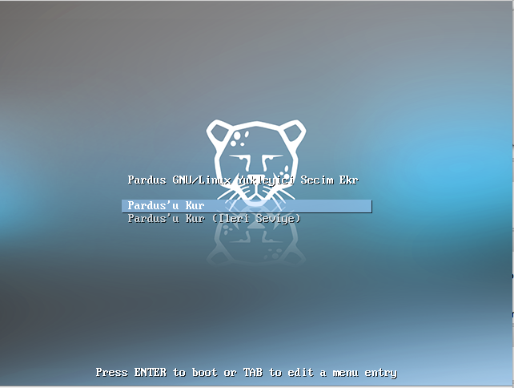

  * ISO üzerinden açılan makinede öncelikli olarak kurulum dili seçim menüsü gelmektedir. Buradan istenilen dil seçilir. 
 
 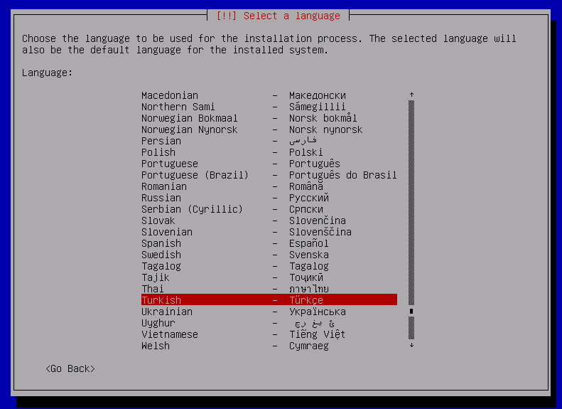
 
 * Açılan ekranda klavye seçimi yapılarak ilerlenilir.
 
 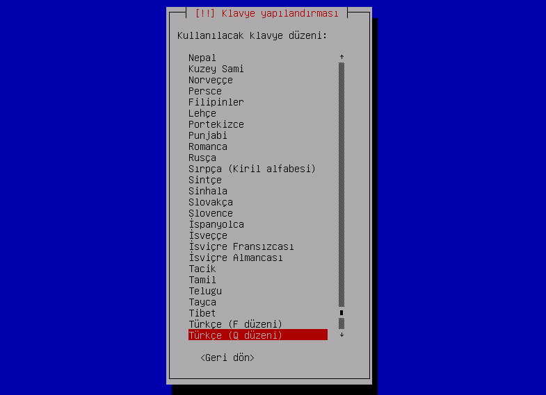
  
 * Dil ve klavye seçiminin ardından ağ yapılandırması yapılır. Açılan ilk ekranda “**IP adresi:**” satırının altında bulunan alana sunucunun sahip olması istenilen IP adresi girilerek “**Devam**” seçeneği seçilir.

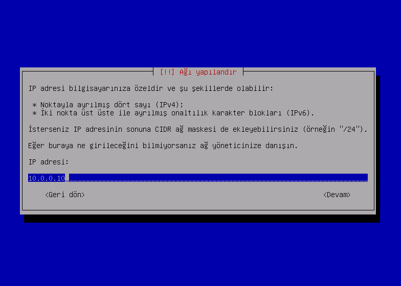

 * Ağ yapılandırmasının ikinci aşaması olarak ağ maskesi bilgisi “**Ağ maskesi:**” satırının altında bulunan alana girilerek “**Devam**” seçeneği seçilir.

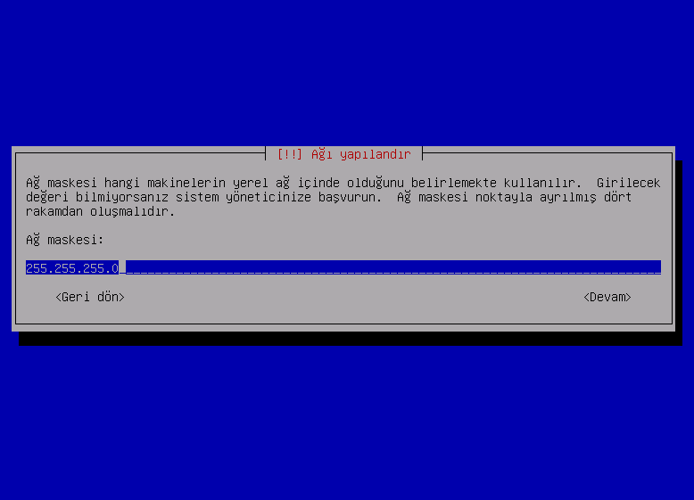

 * Açılan yeni ekranda, “**Ağ geçidi:**” satırının altında bulunan alana ağ geçidi bilgisi girilerek “**Devam**” seçeneği seçilir.

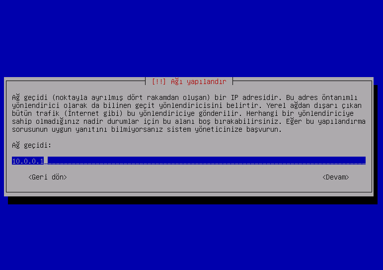

 * Ağ yapılandırma ayarları bakımdan erişim bilgisi olarak girilecek son bilgi olan "**Alan adı sunucusu adresleri:**”  satırının altına ilgili IP adresi girilerek “**Devam**” seçeneği seçilir.

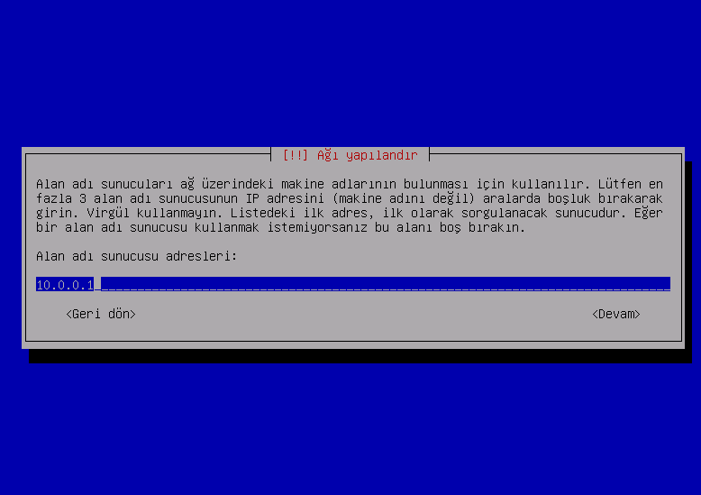

 * Ağ yapılandırma ayarları kapsamında makineye verilmesi planlanan isim “**Makine adı:**” satırının altında bulunan alana girilerek “**Devam**” seçeneği seçilir.

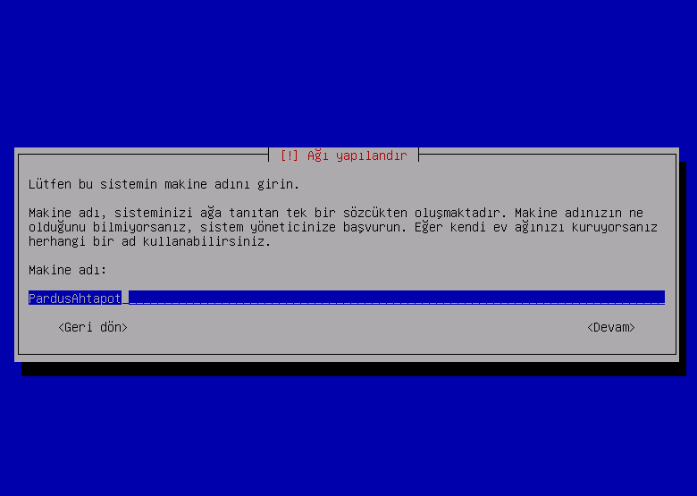

 * Makinenin dahil olacağı etki alanı bilgisi “**Alan adı:**” satırının altında bulunan alana girilerek “**Devam**” seçeneği seçilir.

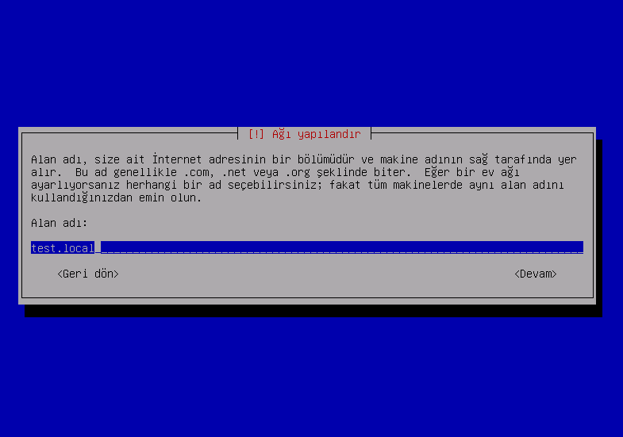

 * Makineye ihtiyaç halinde konsol girişinde kullanmak üzere “**Root**” kullanıcısına atanacak parola “**Root parolası:**” satırının altına girilir.

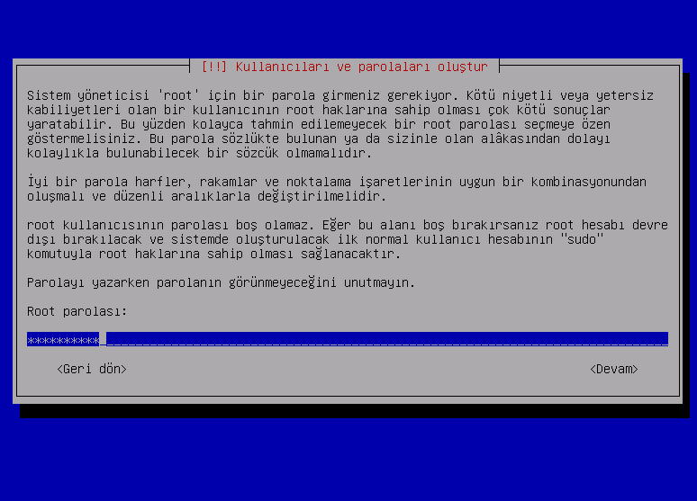

 * Bir önceki adımda belirlenen parolayı teyit etmek için “**Doğrulamak için parolayı tekrar girin:**” satırına parola tekrar girilir.


 * Root parolası belirlendikten sonra “**Diskleri bölümle**” ekranı gelir. Bu ekranda "**Bölümleme yöntemi:**" altında bulunan “**Tüm dosyalar tek bölümde (yeni kullanıcılara tavsiye edilir)**” seçeneği seçilir ve ENTER tuşuna basılır.

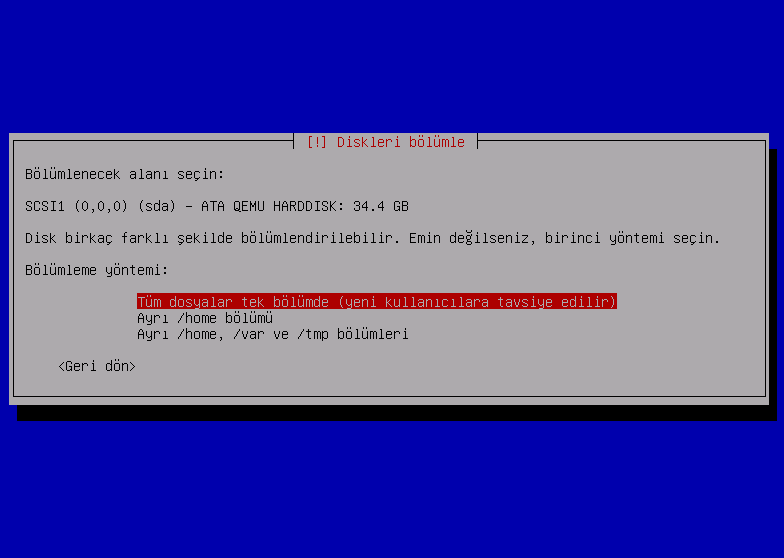

 * Girilen bilgiler doğrultusunda "**Sistem kurulumu başlar**". 


 
 * Sunucunun Pardus reposuna erişimi olmadığı durumda aşağıda verdiği hata sonrasında kurulum medyası repo olarak kullanılabilmektedir. Bunun için “**Geri dön**” seçeneği seçilir.
        

		
* Gelen “**Bir ağ yansısı kullanılmadan devam edilsin mi?**” ekranında “**Evet**” seçeneği seçilerek kuruluma devam edilir.

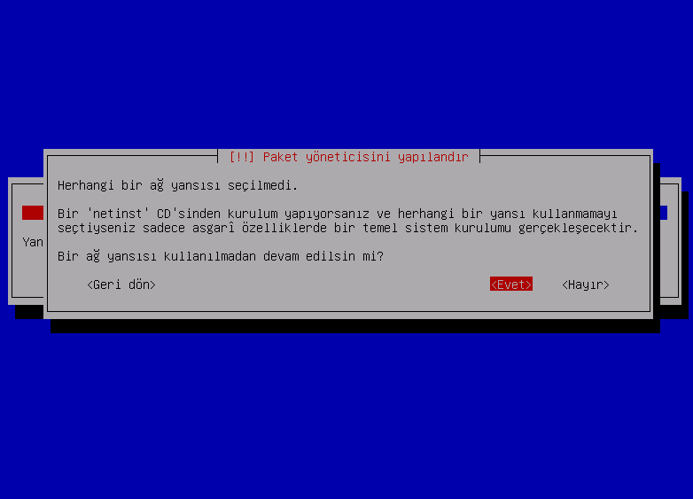

 * Gelen “**GRUB önyükleyici bir sabit diske kur**” ekranında, "**Önyükleyicinin kurulacağı aygıt:**" seçeneğinin altında bulunan “**/dev/sda (ata-VBOX_HARDDISK_….)**” seçeneği seçilerek ENTER tuşuna basılır.

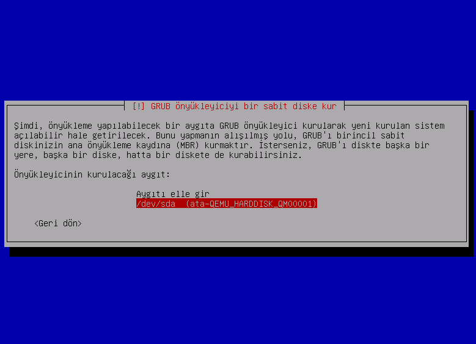

 * Kurulum şeklinin seçilmesinin ardından, Pardus Kurumsal 5 giriş ekranı gelerek kurulum tamamlanır.

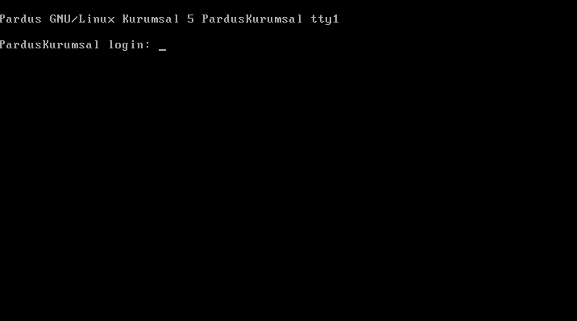

 * Kurulum tamamlandıktan sonra sunucu yeniden başlatılacaktır. Sunucu tekrar başladıktan sonra, "**root**" kullanıcı ile makinaya erişim sağlanır. Erişim sağlandığında aşağıda bulunan ekran gelmektedir. Tüm bileşenlerin aynı sunucuya kurulması için "**SIEM**" seçeneği, Ossim bileşenlerinin kurulması için "**OSSIM**" seçeneği, MYS' den bağımsız olarak ElasticSearch kurulumu için ise, "**ELK**" ve ya "**ES**" seçeneği seçilir. Merkezi yönetim sistemi ile ELK yönetimi yapılmak isteniyorsa, Ahtapot Temel ISO kurulumunu takiben "**ElasticSearch**" playbooku oynatılmalıdır. Kurulum adımlarında playbook ile kurulum gösterilmektedir.

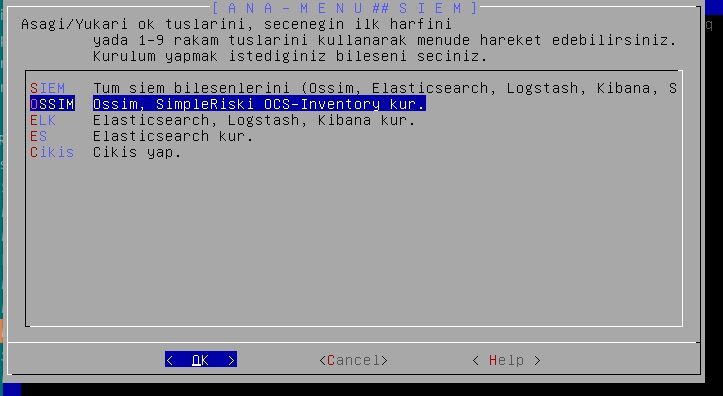

 * Kurulum tamamlandıktan sonra, Ossim makinasının adı "**alientvault**" olarak değişmiş olarak görülecektir. Hostname bilgisini güncel haline geri getirmek için "**/etc/hostname**" ve "**/etc/hosts**" dosyalarında düzenleme yapılmalıdır. Tercih edilen metin düzenleyici ile "**/etc/hostname**" dosyasında "**alientvault**" yazan satır güncel makina ismi ile değiştirilir. Kurulum sırasında "**/etc/hosts**" dosyasının en alt satırına eklenen "**IP adress alienvault.domain alienvault**" satırı silinir.
 
 * Ossim kurulumlarının tamamlanması ile internet browser'ına Ossim IP adresi yazılarak Web arayüzü yapılandırılması tamamlanmalıdır. Ossim web arayüzü ilk açılışta admin kullanıcısının şifresinin belirlenmesini istemektedir.

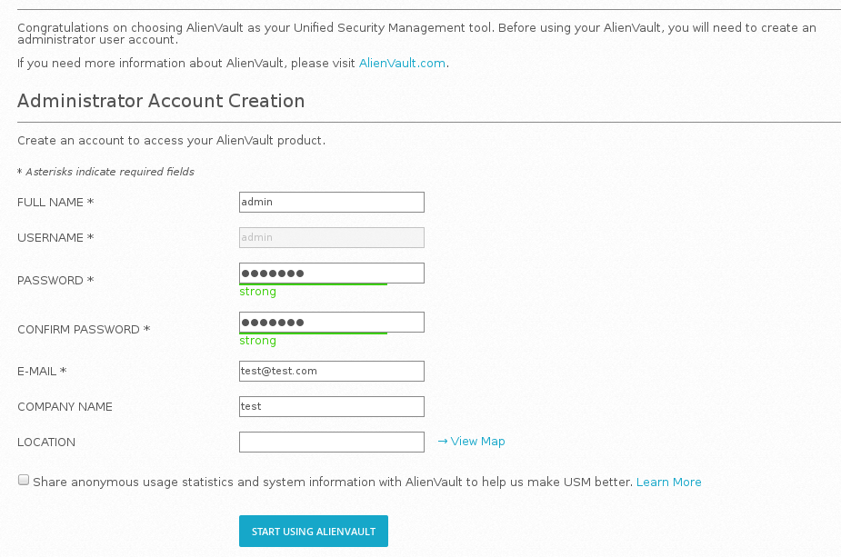

 * Ossim gerekli bilgiler girilmesi ile Ossim web arayüzüne ulaşılır.
 
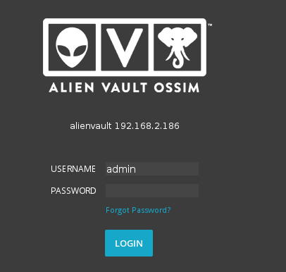

 * Kurulan yapıya göre hem Ossim hem de Ossim Kolerasyon makinası olabilecek durumdadır. Internet bağlantısı yeniden açılarak, her iki makina arasındaki ayrımı yapılacak rsyslog yapılandırması belirlemektedir. Öncelikli olarak sunucular anahtarlar ile iletişim kurabilmesi için "**rsyslog-gnutls**" paketi yüklenir.
```
apt-get install rsyslog-gnutls
```

 * Kurulan makinaya OSSIM görevini vermek için, aşağıda bulunan "**ossim01_rsyslog.conf**" dosyası ossim makinasının "**/etc/rsyslog.conf**" içerisine kopyalanır. İlgili dosya içerisinde bulunan mevcut yapilandirma tamamen değiştirilmemekte olup, "**/etc/rsyslog.conf**" dosyasında bulunan "**GLOBAL DIRECTIVES**" bölümü bitiminde "**RULES**" bölümünün üzerinde kopyalanmalıdır.
```
###########################
#### GLOBAL DIRECTIVES ####
###########################

#
# Use traditional timestamp format.
# To enable high precision timestamps, comment out the following line.
#
$ActionFileDefaultTemplate RSYSLOG_TraditionalFileFormat

#
# Set the default permissions for all log files.
#
$FileOwner root
$FileGroup adm
$FileCreateMode 0640
$DirCreateMode 0755
$Umask 0022

#
# Where to place spool and state files
#
$WorkDirectory /var/spool/rsyslog

#
# Include all config files in /etc/rsyslog.d/
#
$IncludeConfig /etc/rsyslog.d/*.conf

#OSSIM rsyslog yapilandirmasi buraya eklenmelidir.

###############
#### RULES ####
###############
```

 * Dosya içerisinde keyler ve logları gönderecek rsyslog ile ossim korelasyon makinelerinin fqdn blgileri düzenlenir.
**NOT:** Anahtar oluşturulması için CA Kurulumu ve Anahtar Yönetimi dökümanındaki [Log Yönetimi Anahtar Oluşturma](ca-kurulum.md) başlığı incelenmelidir.
**NOT:** OSSIM makinasına istemci makina bağlanmayacak ise, "**##nxlog ile client baglanmasi durumunda kullanılır**" ve "**##rsyslog ile client baglanmasi durumunda kullanılır**" satırları altında bulunan yapılandırma satırlarının başına "**#**" işareti konularak yorum satırı haline getirilir.
```
$ModLoad imtcp
$DefaultNetstreamDriver gtls

$InputTCPServerStreamDriverMode 1
$InputTCPServerStreamDriverAuthMode anon
$InputTCPServerRun 514

#ossim makinenin ssl keyleri verilir

$DefaultNetstreamDriverCAFile  /directory/of/keys/rootCA.pem
$DefaultNetstreamDriverCertFile /directory/of/keys/ossim01.crt
$DefaultNetstreamDriverKeyFile /directory/of/keys/ossim01.key

$ActionQueueType LinkedList
$ActionQueueFileName srvrfwd
$ActionResumeRetryCount -1
$ActionQueueSaveOnShutdown on

$ModLoad imfile
$InputFileName /var/ossec/logs/alerts/alerts.log
$InputFileTag ossimcorr
$InputFileStateFile ossec-alerts
$InputFileFacility local6
$InputFilePollInterval 1
$InputFilePersistStateInterval 1
$InputRunFileMonitor

##nxlog ile client baglanmasi durumunda kullanılır
$InputFileName /var/log/nxlog/client.log
$InputFileTag nxlogclient
$InputFileStateFile nxlogclientraw
$InputFileFacility local5
$InputFilePollInterval 1
$InputFilePersistStateInterval 1
$InputRunFileMonitor

##rsyslog ile client baglanmasi durumunda kullanılır
$InputFileName /var/log/client.log
$InputFileTag rsyslogclient
$InputFileStateFile rsyslogclientraw
$InputFileFacility local5
$InputFilePollInterval 1
$InputFilePersistStateInterval 1
$InputRunFileMonitor


$InputFileName /var/ossec/logs/alerts/alerts1.log
$InputFileTag ossimcik
$InputFileStateFile ossec-alert1
$InputFileFacility local7
$InputFilePollInterval 1
$InputFilePersistStateInterval 1
$InputRunFileMonitor

#ossim makinenin ssl keyleri ve ossim korelasyon rsyslog makinelerinin fqdn bilgileri verilir

if $syslogfacility-text == 'local6' then {
        action( type="omfwd"
                Target="ossimcorr.gdys.local"
                Port="514"
                Protocol="tcp"
                Action.ResumeRetryCount="-1"
                StreamDriver="gtls"
                StreamDriverMode="1"
                StreamDriverAuthMode="anon"
                StreamDriverCertFile="/directory/of/keys/ossim01.crt"
                StreamDriverKeyFile="/directory/of/keys/ossim01.key"
                queue.Type="LinkedList"
                queue.FileName="forwarding"
                queue.SaveOnShutdown="on"
                queue.MaxDiskSpace="5000m"
                                )
        action( type="omfwd"
                Target="rsyslog01.gdys.local"
                Port="514"
                Protocol="tcp"
                Action.ResumeRetryCount="-1"
                StreamDriver="gtls"
                StreamDriverMode="1"
                StreamDriverAuthMode="anon"
                StreamDriverCertFile="/directory/of/keys/ossim01.crt"
                StreamDriverKeyFile="/directory/of/keys/ossim01.key"
                queue.Type="LinkedList"
                queue.FileName="forwarding"
                queue.SaveOnShutdown="on"
                queue.MaxDiskSpace="5000m"
                                )
        stop
}

if $syslogfacility-text == 'local7' then {
        action( type="omfwd"
                Target="ossimcorr.gdys.local"
                Port="514"
                Protocol="tcp"
                Action.ResumeRetryCount="-1"
                StreamDriver="gtls"
                StreamDriverMode="1"
                StreamDriverAuthMode="anon"
                StreamDriverCertFile="/directory/of/keys/ossim01.crt"
                StreamDriverKeyFile="/directory/of/keys/ossim01.key"
                queue.Type="LinkedList"
                queue.FileName="forwarding"
                queue.SaveOnShutdown="on"
                queue.MaxDiskSpace="5000m"
                                )
       stop
}

##ossim'e client baglanması durumunda kullanılır

if $syslogfacility-text == 'local5' then {
        action( type="omfwd"
                Target="rsyslog01.gdys.local"
                Port="514"
                Protocol="tcp"
                Action.ResumeRetryCount="-1"
                StreamDriver="gtls"
                StreamDriverMode="1"
                StreamDriverAuthMode="anon"
                StreamDriverCertFile="/directory/of/keys/ossim01.crt"
                StreamDriverKeyFile="/directory/of/keys/ossim01.key"
                queue.Type="LinkedList"
                queue.FileName="forwarding"
                queue.SaveOnShutdown="on"
                queue.MaxDiskSpace="5000m"
                                )
#        stop
}

$template Alerts, "/var/ossec/logs/alerts/alerts1.log"
$template MsgFormat,"%msg:2:10000%\n"
$template USB, "/var/log/usb.log" #rsyslog ile client baglanmasi durumunda kullanılır
$template RemoteHost, "/var/log/client.log" #rsyslog ile client baglanmasi durumunda kullanılır
if($fromhost-ip != '127.0.0.1' and $msg contains 'AV - Alert -') then -?Alerts;MsgFormat
& ~
if($fromhost-ip != '127.0.0.1' and $msg contains 'New USB device found') then -?USB #rsyslog ile client baglanmasi durumunda kullanılır
if($fromhost-ip != '127.0.0.1' and $msg contains 'Product') then -?USB #rsyslog ile client baglanmasi durumunda kullanılır
if($fromhost-ip != '127.0.0.1' and $msg contains 'Manufacturer') then -?USB #rsyslog ile client baglanmasi durumunda kullanılır
if($fromhost-ip != '127.0.0.1' and $msg contains 'SerialNumber') then -?USB #rsyslog ile client baglanmasi durumunda kullanılır
if($fromhost-ip != '127.0.0.1' and $msg contains 'USB disconnect') then -?RemoteHost #rsyslog ile client baglanmasi durumunda kullanılır
if($fromhost-ip != '127.0.0.1' and $msg contains ' usb ') then ~ #rsyslog ile client baglanmasi durumunda kullanılır
& ~
if $fromhost-ip != '127.0.0.1' then -?RemoteHost #rsyslog ile client baglanmasi durumunda kullanılır
if $fromhost-ip != '127.0.0.1' then ~ #rsyslog ile client baglanmasi durumunda kullanılır

:msg, contains, "AV - Alert -" ~
```

 * Yapılan yapılandırmanın aktif olması için rsyslog servisi yeniden başlatılır.
```
# /etc/init.d/rsyslog restart
```

 * Kurulan makinaya OSSIM Kolerasyon görevini vermek için, aşağıda bulunan "**ossimcor_syslog.conf**" dosyası ossim kolerasyon makinasının "**/etc/rsyslog.conf**" içerisine kopyalanır. İlgili dosya içerisinde bulunan mevcut yapilandirma tamamen değiştirilmemekte olup, "**/etc/rsyslog.conf**" dosyasında bulunan "**GLOBAL DIRECTIVES**" bölümü bitiminde "**RULES**" bölümünün üzerinde kopyalanmalıdır.
```
###########################
#### GLOBAL DIRECTIVES ####
###########################

#
# Use traditional timestamp format.
# To enable high precision timestamps, comment out the following line.
#
$ActionFileDefaultTemplate RSYSLOG_TraditionalFileFormat

#
# Set the default permissions for all log files.
#
$FileOwner root
$FileGroup adm
$FileCreateMode 0640
$DirCreateMode 0755
$Umask 0022

#
# Where to place spool and state files
#
$WorkDirectory /var/spool/rsyslog

#
# Include all config files in /etc/rsyslog.d/
#
$IncludeConfig /etc/rsyslog.d/*.conf

#OSSIM rsyslog yapilandirmasi buraya eklenmelidir.

###############
#### RULES ####
###############
```

 * Dosya içerisinde keyler ve logları gönderecek rsyslog makinelerinin fqdn blgileri düzenlenir.
 **NOT:** OSSIM makinasına istemci makina bağlanmayacak ise, "**##nxlog ile client baglanmasi durumunda kullanılır**"  satırı altında bulunan yapılandırma satırlarının başına "**#**" işareti konularak yorum satırı haline getirilir.
```
$ModLoad imtcp
$DefaultNetstreamDriver gtls

$InputTCPServerStreamDriverMode 1
$InputTCPServerStreamDriverAuthMode anon
$InputTCPServerRun 514
#ossim korelasyon makinesinin anahtar bilgileri girilir.
$DefaultNetstreamDriverCAFile  /directory/of/keys/rootCA.pem
$DefaultNetstreamDriverCertFile /directory/of/keys/ossimcorr.crt
$DefaultNetstreamDriverKeyFile /directory/of/keys/ossimcorr.key

$ActionSendStreamDriverMode 1
$ActionSendStreamDriverAuthMode anon
$ActionQueueType LinkedList
$ActionQueueFileName srvrfwd
$ActionResumeRetryCount -1
$ActionQueueSaveOnShutdown on

$ModLoad imfile
$InputFileName /var/ossec/logs/alerts/alerts.log
$InputFileTag ossimcor
$InputFileStateFile ossec-alerts
$InputFileFacility local5
$InputFilePollInterval 1
$InputFilePersistStateInterval 1
$InputRunFileMonitor

##nxlog ile client baglanmasi durumunda kullanılır
$InputFileName /var/log/nxlog/client.log
$InputFileTag client
$InputFileStateFile clientraw
$InputFileFacility local5
$InputFilePollInterval 1
$InputFilePersistStateInterval 1
$InputRunFileMonitor


if $syslogfacility-text == 'local5' then {
        action( type="omfwd"
                Target="rsyslog01.gdys.local"
                Port="514"
                Protocol="tcp"
                Action.ResumeRetryCount="-1"
                StreamDriver="gtls"
                StreamDriverMode="1"
                StreamDriverAuthMode="anon"
                StreamDriverCertFile="/directory/of/keys/ossimcorr.crt"
                StreamDriverKeyFile="/directory/of/keys/ossimcorr.key"
                queue.Type="LinkedList"
                queue.FileName="forwarding"
                queue.SaveOnShutdown="on"
                queue.MaxDiskSpace="5000m"
                                )
    stop
}

$template Alerts, "/var/ossec/logs/alerts/alerts1.log"
$template MsgFormat,"%msg:2:10000%\n"
if($fromhost-ip != '127.0.0.1' and $msg contains 'AV - Alert -') then -?Alerts;MsgFormat

:msg, contains, "AV - Alert -" ~
```
 * Rsyslog'a ait yapılandırma işlemleri tamamlandıktan sonra, "**/etc/hosts**" dosyasına OSSIM, OSSIMCORE,RSYSLOG ve OSSIMCIK sunucularının girişi yapılır.

 * Yapılan yapılandırmanın aktif olması için rsyslog servisi yeniden başlatılır.
```
# /etc/init.d/rsyslog restart
```

### OSSIMCIK Kurulumu

* **NOT:** Dökümanda yapılması istenilen değişiklikler gitlab arayüzü yerine terminal üzerinden yapılması durumunda playbook oynatılmadan önce yapılan değişiklikler git'e push edilmelidir.

```
$ cd /etc/ansible
git status komutu ile yapılan değişiklikler gözlemlenir.
$ git status  
$ git add --all
$ git commit -m "yapılan değişiklik commiti yazılır"
$ git push origin master
```

* Ahtapot Temel ISO ile kurulumu sağlanmış olan sunucunun Merkezi Yönetim Sistemi ile bağlanıtısı sağlandıktan sonra OSSIMCIK rolünü yüklemesi için Ansible Playbook oynatılır.
* GitLab arayüzünde MYS reposunda bulunan **hosts** dosyasına "**ossimcik**" rolü altına ilgili makinanın fqdn bilgileri yazılır.
```
[ossimcik]
ossimcik01.fqdn_bilgisi
```

* GitLab arayüzünde MYS reposunda "**roles/base/vars/hosts.yml**" dosyasına ossimcik makinasının bilgileri eklenir.
```
    server22:
        ip: "x.x.x.x" 
        fqdn: "ossimcik01.gdys.local"
        hostname: "ossimcik01"
```
* **/etc/ansible/roles/ossimcik/vars/rsyslog.yml** dosyası içerisinde ossimcik makinesinin logları göndermesi istenilen rsyslog ve ossim makinelerinin fqdn bilgileri girilir. **permittedpeer** satırına ossimcik makinasının fqdn bilgisi girilir.
```
vi/etc/ansible/roles/ossimcik/vars/rsyslog.yml
    permittedpeer: ["ossimcik.ahtapot.org.tr"]
    rsyslog_server: "rsyslog.ahtapot.org"
    ossim_server: "ossim01.ahtapot.org"
```
* **/etc/ansible/roles/base/vars/rsyslog.yml** içerisinde mys sisteminde bulunan makinelerin loglarını göndereceği ossimcikler belirlenir ve **ossimciks** altında **server1** içerisine **ossimcik_fqdn** bilgisi **clients** altında **client01** içerisinde ossimcik'e log göndericek **client makinelerin fqdn** bilgisi girilir.
```
vi /etc/ansible/roles/base/vars/rsyslog.yml 
---
# Log sunucu ayarlarini iceren dosyadir.
# Yorum satiri ile gosterilen sablon doldurularak istenilen kadar log sunucusu eklenebilir.
rsyslog:
   conf:
      source: "rsyslog.conf.j2"
      destination: "/etc/rsyslog.conf"
      owner: "root"
      group: "root"
      mode: "0644"
   service:
      name: "rsyslog"
      state: "started"
      enabled: "yes"
   tls:
      state: "on"
      cacert: "/etc/ssl/certs/rootCA.pem"
      mycert: "/etc/ssl/certs/{{ ansible_fqdn }}.crt"
      mykey: "/etc/ssl/private/{{ ansible_fqdn }}.key"
      authmode: "name"
      permittedpeer: "ossimcik.ahtapot.org.tr"
   MainQueueSize: "100000"
   MainQueueWorkerThreads: "2"
   ActionResumeRetryCount: "-1"
   QueueType: "LinkedList"
   QueueFileNameANS: "srvfrwd_ans"
   QueueFileNameIPT: "srvfrwd_iptables"
   QueueFileNameSYS: "srvfrwd_syslog"
   QueueFileNameSURICATA: "srvfrwd_suricata"
   QueueSaveOnShutdown: "on"
   QueueMaxFileSize: "100m"
   QueueSize: "250000"
   asyncWriting: "on"
   ioBufferSize: "256k"
   Mode: "inotify"
   WorkDirectory: "/var/spool/rsyslog"
   IncludeConfig: "/etc/rsyslog.d/*"

ossimciks:
   server01:
      fqdn: "ossimcik.ahtapot.org.tr"
      port: "20514"
      clients:
        - "mys.ahtapot.org.tr"
        - "git.ahtapot.org.tr"
#       - "*.ahtapot.org.tr"
```
* "**/etc/ansible/roles/rsyslog/vars/rsyslog.yml**" dosyası içerinde ossim, ossim korelasyon ve ossec makinalarının ip adresleri girilir. **permittedpeer:** bilgisine genelden log toplayabilmesi için ** *.ahtapot.org.tr** yazılır.
```
nano /etc/ansible/roles/rsyslog/vars/rsyslog.yml
---
# Rsyslog'un degiskenlerini iceren dosyadir
rsyslog:
   conf:
      source: "rsyslog.conf.j2"
      destination: "/etc/rsyslog.conf"
      owner: "root"
      group: "root"
      mode: "0644"
   service:
      name: "rsyslog"
      state: "started"
      enabled: "yes"
   tls:
      state: "on"
      cacert: "/etc/ssl/certs/rootCA.pem"
      mycert: "/etc/ssl/certs/{{ ansible_fqdn }}.crt"
      myprivkey: "/etc/ssl/private/{{ ansible_fqdn }}.key"
      authmode: "name"
      permittedpeer: "*.ahtapot.org.tr"
   port: "20514"
   port_udp: "514"
   imthreads: "5"
   MainQueueSize: "100000000"
   MainQueueWorkerThreads: "5"
   asyncWriting: "on"
   ioBufferSize: "1024k"
   WorkDirectory: "/var/spool/rsyslog"
   IncludeConfig: "/etc/rsyslog.d/*"

sources:
   src01:
      addr: "OSSIM_AV_Alerts"
      alertname: "OSSIM_AV_Alerts"
      alertfile: "{{ logrotate['Directory'] }}/ossim/ossimalerts.log"
      rawname: "OSSIM_All"
      rawfile: "{{ logrotate['Directory'] }}/ossim/ossim_raw.log"
   src02:
      addr: "OSSIMCIK_IP"
      alertname: "OSSIMCIK_AV_Alerts"
      alertfile: "{{ logrotate['Directory'] }}/ossimcik/ossimcikalerts.log"
      rawname: "OSSIMCIK_All"
      rawfile: "{{ logrotate['Directory'] }}/ossimcik/ossimcik_raw.log"
   src03:
      addr: "OSSIMCORR_IP"
      alertname: "OSSIMCORR_AV_Alerts"
      alertfile: "{{ logrotate['Directory'] }}/ossimcorr/ossimcorr_alerts.log"
      rawname: "OSSIMCORR_All"
      rawfile: "{{ logrotate['Directory'] }}/ossimcorr/ossimcorr_raw.log"

```
* ISO kurulumu tamamlanmmış ve OSSIMCIK rolü yüklenecek makina üzerinde ansible playbooku çalıştırmak için, Ansible makinasına **ahtapotops** kullanıcısı ile SSH bağlantısı yapılarak, "**ossimcik.yml**" playbooku çalıştırılır.
```
$ cd /etc/ansible
$ ansible-playbook playbooks/ossimcik.yml
```
* Ossimcik playbookunun oynatılmasının ardından Rsyslog ve Nxlog **SSL** ile haberleşmeleri için sertifikalar yerleştirilmelidir.
**NOT:** Anahtar oluşturulması için CA Kurulumu ve Anahtar Yönetimi dökümanındaki [Log Yönetimi Anahtar Oluşturma](ca-kurulum.md) başlığı incelenmelidir.

* Rsyslog için rootCA sertifikası **/etc/ssl/private** dizini altına kopyalanır.
```
vi /etc/ssl/certs/rootCA.pem
```
* Ossimcik sertifikaları ossimcik **FQDN** ismi ile dosya oluşturularak aşağıdaki dizinlere kopyalanır.
```
vi /etc/ssl/certs/ossimcik01.gdys.local.crt
vi /etc/ssl/private/ossimcik01.gdys.local.key
```
* Sertifikaların yerleştirilmesiyle Rsyslog servisi yeniden başlatılır.
```
systemctl restart rsyslog.service
```
* Nxlog sertifikaları için rsyslog ile aynı sertifikalar kullanılır. Nxlog sertifikaları okuyabilmesi için yeni bir dizin oluşturulur.
```
mkdir /etc/ssl/nxlog
```
* Oluşturulan dizin içerisine aşağıdaki gibi **rootCA** isimli ve makinenin **FQDN** isimili dosyalar oluşturularak keyler kopyalanır. 
```
vi /etc/ssl/nxlog/rootCA.pem
vi /etc/ssl/nxlog/ossimcik01.gdys.local.crt
vi /etc/ssl/nxlog/ossimcik01.gdys.local.key
```
* Sertifikalar yerlestirilmesiyle Nxlog servisi yeniden başlatılır.
```
systemctl restart nxlog.service
```
### SIEM Rsyslog Yapılandırması
* Ossimcik ve Ossim makinelerinden gelen logların rsyslog içerisinde dosyalara yazılabilmesi için "**/etc/ansible/roles/rsyslog/templates/**" dizini içerisinde "**rsyslog.conf.j2**" dosyası düzenlenmelidir. 
* Rsyslog içerisine gerekli olan anahtarlar eklenmeli ve anahtarların dizinleri aşağıdaki config dosyasında verilen yerlere girilmelidir.

```
$ vi /etc/ansible/roles/rsyslog/templates/rsyslog.conf.j2
$DefaultNetstreamDriverCAFile  /etc/ssl/certs/rootCA.pem
$DefaultNetstreamDriverCertFile /etc/ssl/certs/rsyslog_fqdn.crt
$DefaultNetstreamDriverKeyFile /etc/ssl/private/rsyslog_fqdn.key
```
* Rsyslog makinesine gelen logların kimde geleceği ve nereye yazılacağı bilgileri "**rsyslog.conf.j2**" dosyası içerisinde belirtilmelidir. **template** değişkenlerine **Ossim**, **Ossimcik**, **OssimKorelasyon** makinelerinden gelen logların yazılması için dizin bilgilerine hostnameleri girilmelidir. **fromhost-ip** değişken içerisine ise **Ossim**, **Ossimcik**, **OssimKorelasyon** makinelerinin ip adresleri girilmelidir.  
```
###############
#### RULES ####
###############

$template MsgFormat,"%msg:2:10000%\n"
$template OssimcorAlerts, "/data/log/ossimkorelasyon_hostname/ossimkorelasyon_hostnamealerts.log"
$template Ossimcor, "/data/log/ossimkorelasyon_hostname/ossimkorelasyon_hostname_raw.log"
$template Ossim01Alerts, "/data/log/ossim_hostname/ossim_hostnamealerts.log"
$template Ossim01, "/data/log/ossim_hostname/ossim_hostname_raw.log"
$template Ossimcik01Alerts, "/data/log/ossimcik_hostname/ossimcik_hostnamealerts.log"
$template Ossimcik01, "/data/log/ossimcik_hostname/ossimcik_hostname_raw.log"

if($fromhost-ip == 'ossimkorelasyon_ip' and $msg contains 'AV - Alert -') then -?OssimcorAlerts;MsgFormat
if($fromhost-ip == 'ossimkorelasyon_ip' and $msg contains 'AV - Alert -') then ~
if $fromhost-ip == 'ossimkorelasyon_ip' then -?Ossimcor
& ~
if($fromhost-ip == 'ossim_ip' and $msg contains 'AV - Alert -') then -?Ossim01Alerts;MsgFormat
if($fromhost-ip == 'ossim_ip' and $msg contains 'AV - Alert -') then ~
if $fromhost-ip == 'ossim_ip' then -?Ossim01
& ~
if($fromhost-ip == 'ossimcik_ip' and $msg contains 'AV - Alert -') then -?Ossimcik01Alerts;MsgFormat
if($fromhost-ip == 'ossimcik_ip' and $msg contains 'AV - Alert -') then ~
if $fromhost-ip == 'ossimcik_ip' then -?Ossimcik01
& ~
```
* Örnekte verilenlerden daha fazla makine rsyslog makinesine log göndericek ise örnekteki gibi her bir makine için template ve fromhost-ip bilgileri oluşturulmalıdır. **template** ve **fromhost-ip** değişkenleri için **makineningörevi** yerine eklenilecek makinenin işlevi yazılır.
```
$template MakineningöreviAlerts, "/data/log/makine_hostname/makine_hostnamealerts.log"
$template Makineningörevi, "/data/log/makine_hostname/makine_hostname_raw.log"
if($fromhost-ip == 'ossimkorelasyon_ip' and $msg contains 'AV - Alert -') then -?MakineningöreviAlerts;MsgFormat
if($fromhost-ip == 'ossimkorelasyon_ip' and $msg contains 'AV - Alert -') then ~
if $fromhost-ip == 'ossimkorelasyon_ip' then -?Makineningörevi
& ~
```
**NOTE:** Makinelerden gelen logların verilen dizini "**/data/log/**"dan farklı olması isteniliyor ise "**/etc/ansible/roles/rsyslog/vars**" dizini içerisinde "**logrotate.yml**" dosyası içerisinde **Directory** değişkeni için verilen dizin logların yazılacağı dizin ile aynı olacak şelikde değiştirilmelidir.
```
---
# Logrotate degiskenlerini iceren dosyadir
logrotate:
    conf:
        source: "rsyslog.j2"
        destination: "/etc/logrotate.d/rsyslog"
        owner: "root"
        group: "root"
        mode: "0644"
    Directory: "/data/log/*"
```
* ISO kurulumu tamamlanmmış ve Rsyslog rolü yüklenecek makina üzerinde ansible playbooku çalıştırmak için, Ansible makinasına **ahtapotops** kullanıcısı ile SSH bağlantısı yapılarak, "**rsyslog.yml**" playbooku çalıştırılır.
```
$ cd /etc/ansible
$ ansible-playbook playbooks/rsyslog.yml
```

### MYS Clientlarında Ossec Agent Dağıtımı

* "**/etc/ansible/roles/base/vars/rsyslog.yml**"" içerisinde mys sisteminde bulunan makinelerin loglarını göndereceği ossimcikler belirlenir ve **base_ossimcik_servers** altında "**server1**"" içerisine **ossimcik_fqdn** bilgisi "**clients**"" altında **client01** içerisinde ossimcik'e log göndericek **client makinelerin fqdn** bilgisi girilir.
**NOT:** Halihazırda playbook içerisinde client yazılı ise bu adım geçilebilir.
```
vi /etc/ansible/roles/base/vars/rsyslog.yml 
---
# Log sunucu ayarlarini iceren dosyadir.
# Yorum satiri ile gosterilen sablon doldurularak istenilen kadar log sunucusu eklenebilir.
rsyslog:
    conf:
        source: "rsyslog.conf.j2" 
        destination: "/etc/rsyslog.conf" 
        owner: "root" 
        group: "root" 
        mode: "0644" 
    service:
        name: "rsyslog" 
        state: "started" 
        enabled: "yes"
    ActionQueueMaxDiskSpace: "2g"
    ActionQueueSaveOnShutdown: "on" 
    ActionQueueType: "LinkedList" 
    ActionQueueFileName: "srvfrwd" 
    ActionResumeRetryCount: "-1" 
    WorkDirectory: "/var/spool/rsyslog" 
    IncludeConfig: "/etc/rsyslog.d/*" 

base_ossimcik_servers:
    server1:
        fqdn: "ossimcik01.gdys.local" 
        port: "514" 
        severity: "*" 
        facility: "*"
        clients:
            client01:
                fqdn: "ansible01.gdys.local"
            client02:
                fqdn: "gitlab01.gdys.local"
#    serverX:
#        fqdn: "" 
#        port: "" 
#        severity: "" 
#        facility: ""
#        clients:
#            clientXX:
#                fqdn: ""
#            clientXX:
#                fqdn: ""
```

* Ossimcik makinesi ossec server olarak çalışmaktadır. Mys ortamında kurulan tüm makinelere default olarak "**ossec.yml**" playbook'u ile ossec agent kurulumu yapılmaktadır.

* Ossimcik makinesinin bilgileri "**ossec**" rolü içerisinde girilmelidir. "**/etc/ansible/roles/ossec/vars/**" dizini içerisinde "**ossec.yml**" dosyası içerisinde "**server**" değişkeni olarak ossec server olacak osssimcik fqdn bilgisi girilmelidir.

```
vi /etc/ansible/roles/ossec/vars/ossec.yml
---
# Ossec agent ayarlarini iceren dosyadir.
ossec:
    conf:
        source: "ossec.conf.j2"
        destination: "/var/ossec/etc/ossec.conf"
        owner: "root"
        group: "ossec"
        mode: "0660"
    service:
        name: "ossec"
        state: "started"
        enabled: "yes"
    server: "ossimcik01.gdys.local"
```
* **NOT:** Anahtar alışverişi için gerekli "**auto-server.py**" betiği "**ossec-auto-server**" paketi ile gelmektedir. Ossimcik içerisinde kurulu değil ise ossimcik playbook içerisine eklenmeli "vi /etc/ansible/roles/ossimcik/vars/package.yml" veya manuel olarak "apt-get install ossec-auto-server" kurulmalıdır.

* Ansible makinesi içerisinde "**ossec.yml**" çalıştırılarak playbook oynatılır.
```
$ ansible-playbook playbooks/ossec.yml
```

### SIEM OCS Inventory Client Yapılandırması

* MYS sisteminde bulunan makinelere envanter bilgilerini ossim içerisine gondermek için "**/etc/ansible/roles/base/templates**" dizini içerisinde "**fusioninventory.conf.j2**" ve "**ocs_ossim.pem.j2**" dosyaları düzenlenmelidir.
* "fusioninventory.conf.j2" içerisinde envanter bilgisinin toplanacağı **server=** değişkeni içerisinde **ossim hostname** bilgisi girilmelidir. 

```
vi etc/ansible/roles/base/templates/fusioninventory.conf.j2
server = https://ossim_hostname/ocsinventory
```

* "**ocs_ossim.pem.j2**" içerisine envanter bilgilerinin toplanması istenilen Ossim'in ssl sertifikası konulmalıdır. Ossim makinesi içerisinde ossim ssl sertifikasının içeriği  "**/etc/ssl/certs/ossimweb.pem**" dosyasında kopyalanarak "**etc/ansible/roles/base/templates/ocs_ossim.pem.j2**" dosyasına konulmalıdır.

* Yapılan değişikliklerin makineler içerisinde uygulanması için "**state.yml**" playbook'u çalıştırılmalıdır.
```
$ cd /etc/ansible
$ ansible-playbook playbook/state.yml
```
#ELK Kurulumu

### Elasticsearch Kurulum

* **NOT:** Dökümanda yapılması istenilen değişiklikler gitlab arayüzü yerine terminal üzerinden yapılması durumunda playbook oynatılmadan önce yapılan değişiklikler git'e push edilmelidir.

```
$ cd /etc/ansible
git status komutu ile yapılan değişiklikler gözlemlenir.
$ git status  
$ git add --all
$ git commit -m "yapılan değişiklik commiti yazılır"
$ git push origin master
```
**NOT:** Kurulacak sistem, SIEM yapısına dahil edilmek isteniyorsa, kurulum sonrasında Siber Olay, Açıklık, Risk İzleme ve Yönetim Sistemi Kurulumu sayfasında bulunan [LMYS Clientlarında Ossec Agent Dağıtımı](siem-kurulum.md) başlığı incelenmelidir.

* Tercih ettiğimiz metin düzenleyicisini kullanarak hosts dosyasını düzenliyoruz. Aşağıdaki örnekte vi kullanılır. Açılan dosyada [elasticsearch] kısmı altına elasticsearch makinesinin tam ismi (FQDN) girilir.

```
$ cd /etc/ansible/
$ sudo vi hosts
[elasticsearch]
es01.gdys.local
```

* Ansible makinesinin elasticsearch makinesine erişmesi için “roles/base/vars/host.yml” dosyası içerisine elasticsearch makinesinin bilgileri aşağıdaki gibi yazılır.

```
$ vi /etc/ansible/roles/base/vars/host.yml
    serverX:
        ip: "10.112.2.19"
        fqdn: "es01.gdys.local"
        hostname: "es01"
```


* "**/etc/ansible/roles/elasticsearch/vars**" dizininde Elasticsearch değişkenlerinin bulunduğu "**elasticsearch.yml**" dosyası içerisindeki "**elasticsearch_servers**" fonksyionu içerisindeki "**node01**" satırının altında bulunan "**fqdn**" bölümüne elasticsearch makinesinin fqdn bilgisi, "**network_host**" bölümüne elasticsearch makinesinin ip bilgisi, "**http_port**" bölümüne elasticsearch ün hangi port üzerinde çalışacağı bilgileri girilmelidir. Kaç tane elasticsearch makinesi kurulacak ise node olarak aşağıdaki gibi eklenebilir.

```
$ vi /etc/ansible/roles/elasticsearch/vars/elasticsearch.yml
elasticsearch_servers:
    node01:
        fqdn: "es01.gdys.local"
        network_host: "172.16.16.86"
        http_port: "9200"
        node_name: "es01"
        node_data: "true"
        node_master: "true"
        transport_keystore_pass: "KEYPASS"
        http_keystore_pass: "KEYPASS"
    node02:
        fqdn: "es02.gdys.local"
        network_host: "172.16.16.87"
        http_port: "9200"
        node_name: "es02"
        node_data: "true"
        node_master: "false"
        transport_keystore_pass: "KEYPASS"
        http_keystore_pass: "KEYPASS"
#    nodeXX:
#        fqdn: ""
#        network_host: ""
#        http_port: ""
#        node_name: ""
#        node_data: ""
#        node_master: ""
#        transport_keystore_pass: ""
#        http_keystore_pass: ""
```
* "**/etc/ansible/roles/elasticsearch/handlers/searchguard.yml**" dizininde Searchguard değişkenlerinin bulunduğu "**searchguard.yml**" dosyası içerisinde searchguard konfigurasyonunun yeniden yüklenmesi için "**-h**" değeri için "**fqdn**" değeri yerine elasticsearch makinesinin fqdn bilgisi girilir.

```
$ vi /etc/ansible/roles/elasticsearch/handlers/searchguard.yml
---
- name: searchguard konfigurasyonu yeniden yukleniyor
  shell: "/bin/bash plugins/search-guard-2/tools/sgadmin.sh -cd plugins/search-guard-2/sgconfig/ -ks /etc/elasticsearch/es01-keystore.jks -kspass KEYPASS -ts /etc/elasticsearch/truststore.jks -tspass TRUSTPASS -cn {{ elasticsearch['conf']['cluster_name'] }} -h fqdn -p 9300 -nhnv"
  args:
    chdir: "/usr/share/elasticsearch/"
  sudo: yes
```

* "**Ansible Playbookları**" dokümanında detaylı anlatımı bulunan, sunucu üzerinde gerekli sıkılaştırma işlemleri ve Elasticsearch kurulumu yapacak olan "**elasticsearch.yml**" playbook’u çalıştırılır.

```
ansible-playbook playbooks/elasticsearch.yml
```
* Elasticsearch  playbook'u çalıştırıldığında "**searchguard konfigurasyonu yeniden yukleniyor**" başlığı altında hatalar gelecektir. Bu hataların sebebi searchguard konfigurasyonu için gerekli anahtarlar oluşturulmadığından dolayıdır. Kibana kurulumundan sonra "**Anahtarların Hazırlanması**" başlığı altında gerekli anahtarlar oluşturulmaktadır. 

###Kibana Kurulumu

* **NOT:** Dökümanda yapılması istenilen değişiklikler gitlab arayüzü yerine terminal üzerinden yapılması durumunda playbook oynatılmadan önce yapılan değişiklikler git'e push edilmelidir.

```
$ cd /etc/ansible
git status komutu ile yapılan değişiklikler gözlemlenir.
$ git status  
$ git add --all
$ git commit -m "yapılan değişiklik commiti yazılır"
$ git push origin master
```
**NOT:** Kurulacak sistem, SIEM yapısına dahil edilmek isteniyorsa, kurulum sonrasında Siber Olay, Açıklık, Risk İzleme ve Yönetim Sistemi Kurulumu sayfasında bulunan [LMYS Clientlarında Ossec Agent Dağıtımı](siem-kurulum.md) başlığı incelenmelidir.

* Tercih ettiğimiz metin düzenleyicisini kullanarak hosts dosyasını düzenliyoruz. Aşağıdaki örnekte vi kullanılır. Açılan dosyada [kiibana] kısmı altına kibana makinesinin tam ismi (FQDN) girilir.

```
$ cd /etc/ansible/
$ sudo vi hosts
[kibana]
es01.gdys.local
```

* Ansible makinesinin kibana makinesine erişmesi için “roles/base/vars/host.yml” dosyası içerisine kibana makinesinin bilgileri aşağıdaki gibi yazılır.

```
$ vi /etc/ansible/roles/base/vars/host.yml
    serverX:
        ip: "10.112.2.19"
        fqdn: "es01.gdys.local"
        hostname: "es01"
```

* "**/etc/ansible/roles/kibana/vars**" dizininde Kibana değişkenlerinin bulunduğu "**kibana.yml**" dosyası içerisindeki "**server.port**" bölümüne kibananın çalışacağı port bilgisi, "**elasticsearch.url**" bölümüne ise elasticsearch'ün çalıştığı url bilgisi portu ile girilmelidir.

```
# Kibana'in degiskenlerini iceren dosyadir
kibana:
    default:
        source: "kibana.j2"
        destination: "/etc/default/kibana"
        owner: "root"
        group: "root"
        mode: "0644"
    user: "kibana"
    group: "root"
    chroot: "/"
    chdir: "/"
    nice: ""
    service:
        name: "kibana"
        state: "started"
        enabled: "yes"
    yml:
        source: "kibana.yml.j2"
        destination: "/opt/kibana/config/kibana.yml"
        owner: "root"
        group: "root"
        mode: "0644"
    server.port: "5601"
    server.host: "0.0.0.0"
    server.maxPayloadBytes: "1048576"
    elasticsearch.url: "http://172.16.16.86:9200"
    kibana.index: ".kibana"
    kibana.defaultAppId: "discover"
    pid.file: "/var/run/kibana.pid"
    logging.verbose: "false"
    logging.dest: "stdout"
```
*  "**/etc/ansible/roles/kibana/vars**" dizininde nginx değişkenlerinin bulunduğu "**nginx.yml**" dosyası içerisindeki "**server_name**" satırına kibana arayüzünün çalışacağı url bilgisi girilmelidir.

```
---
# Nginx'in degiskenlerini iceren dosyadir
nginx:
    conf: 
        source: "kibana_nginx.conf.j2" 
        destination: "/etc/nginx/conf.d/kibana.conf"
        owner: "root"
        group: "root"
        mode: "0644" 
    service: 
        name: "nginx"
        state: "started" 
        enabled: "yes"
    default: 
        path: "/etc/nginx/sites-available/default"
        state: "absent"
    certificate: 
        source: "kibana.crt.j2" 
        destination: "/etc/nginx/ssl/kibana.crt" 
        owner: "root"
        group: "root" 
        mode: "0644" 
    key: 
        source: "kibana.key.j2" 
        destination: "/etc/nginx/ssl/kibana.key" 
        owner: "root"
        group: "root" 
        mode: "0644"
    ssldir:
        path: "/etc/nginx/ssl"
        owner: "root"
        group: "root"
        mode: "0755"
        state: "directory" 
    listen: "443" 
    server_name: "es01.gdys.local"
```

* "**Ansible Playbookları**" dokümanında detaylı anlatımı bulunan, sunucu üzerinde gerekli sıkılaştırma işlemleri ve Kibana kurulumu yapacak olan "**kibana.yml**" playbook’u çalıştırılır.

```
ansible-playbook playbooks/kibana.yml
```

###Logstash Kurulumu

* Logstash rsyslog playbook'u ile kurulmaktadır.

* Logstash rsyslog ile ossimcik ve ossimlerden alınan logları elasticsearch içerisine göndermek için kullanılmaktadır. Rsyslog makinasının rsyslog.conf dosyasında gelen logların yazılacağı dizin bilgileri logstash "**00-input.conf**" dosyası içerisinde belirtilmelidir.

```
$ vi /etc/ansible/roles/logstash/templates/configuration/00-input.conf.j2
## Bu dosya ansible tarafindan yonetilmektedir!
## Burada yapilan degisikliklerin uzerine yazilir!!
{{ ansible_managed }}

input {

  file {
    path => '/data/log/raw_location01.log'
    start_position => 'beginning'
    type => 'raw_location01'	
  }
  
  file {
    path => '/data/log/alert_location01.log'
    start_position => 'beginning'
    type => 'alert_location01'	
  }
  
  file {
    path => '/data/log/raw_location02.log'
    start_position => 'beginning'
    type => 'raw_location02'	
  }
  
  file {
    path => '/data/log/alert_location02.log'
    start_position => 'beginning'
    type => 'alert_location02'	
  }
}
```

* Dosya içerisinde belirlenen her log dosyası için elasticsearch içerisinde yeni bir index oluşturulacaktır. Oluşturulan indexlerin birbirinden ayrılabilmesi için input dosyası içerisinde type'lar belirlenmelidir. Belirlenen typelara göre output dosyası düzenlenir.

```
$ vi /etc/ansible/roles/logstash/templates/configuration/02-output.conf.j2 
## Bu dosya ansible tarafindan yonetilmektedir!
## Burada yapilan degisikliklerin uzerine yazilir!!
{{ ansible_managed }}

output{

  if [type] == "raw_location01" {

    elasticsearch {
      hosts => ["{{ value.fqdn }}",]
      index => "raw-location01-%{+YYYY.MM.dd}"
      ssl => "true"
      ssl_certificate_verification => "true"
      user => "logstashraw"
      password => "logstashrawpass"
      truststore => "/etc/logstash/truststore.jks"
      truststore_password => "TRUSTPASS"
    }

  } else if [type] == "raw_location02" {

    elasticsearch {
      hosts => ["{{ value.fqdn }}",]
      index => "raw-location02-%{+YYYY.MM.dd}"
      ssl => "true"
      ssl_certificate_verification => "true"
      user => "logstashraw"
      password => "logstashrawpass"
      truststore => "/etc/logstash/truststore.jks"
      truststore_password => "TRUSTPASS"
    }

  } else if [type] == "alert_location01" {

    elasticsearch {
      hosts => ["{{ value.fqdn }}",]
      index => "alert-location01-%{+YYYY.MM.dd}"
      ssl => "true"
      ssl_certificate_verification => "true"
      user => "logstashalert"
      password => "logstashalertpass"
      truststore => "/etc/logstash/truststore.jks"
      truststore_password => "TRUSTPASS"
    }

  } else if [type] == "alert_location02" {

    elasticsearch {
      hosts => ["{{ value.fqdn }}",]
      index => "alert-location02-%{+YYYY.MM.dd}"
      ssl => "true"
      ssl_certificate_verification => "true"
      user => "logstashalert"
      password => "logstashalertpass"
      truststore => "/etc/logstash/truststore.jks"
      truststore_password => "TRUSTPASS"
    }

}
```

* Output dosyası içerisinde type parametresi için input dosyası içerisinde her log dosyası için belirlenen type, index parametresi için elasticsearch içerisinde log dosyaları için oluşturulması istenilen index ismi girilir.

* "**Ansible Playbookları**" dokümanında detaylı anlatımı bulunan, sunucu üzerinde gerekli sıkılaştırma işlemleri ve Logstash kurulumu yapacak olan "**rsyslog.yml**" playbook’u çalıştırılır.

```
ansible-playbook playbooks/rsyslog.yml
```

### Anahtarların Hazırlanması

* Anahtar imzalamak üzere kullanılan CA makinası üzerinde anahtar oluşturma işlemleri yapılır.
* CA anahtarları için CA makinası üzerinde "**/etc/pki/sg/etc**" dizini oluşturulur.

```
mkdir /etc/pki/   
mkdir /etc/pki/sg/
mkdir /etc/pki/sg/etc/
```

* Pardus git reposundan  "**https://git.pardus.org.tr/ahtapot/SOLARIS/tree/development/AhtapotSIEM/SearchGuard_key**" "**SearchGuard_key**" içerisinden imzalama için gerekli dosyalar "**gen_root_ca.sh**", "**root-ca.conf**"" ve "**signing-ca.conf**" CA makinesine kopyalanır.

* "**gen_root_ca.sh**" betiği CA makinesinde "**/etc/pki/sg/**" içerisine "**root-ca.conf**"" ve "**signing-ca.conf**" dosyaları "**/etc/pki/sg/etc/**" içerisine kopyalanmalıdır.

* "**root-ca.conf**"" ve "**signing-ca.conf**" dosyaları içerisinde **DomainName** değişkenleri kurulan sistemde kullanıma göre değiştirilmelidir

```
[ ca_dn ]
0.domainComponent       = "local"
1.domainComponent       = "gdys"
organizationName        = "ulakbim"
organizationalUnitName  = "ulakbim Root CA"
commonName              = "ulakbim Root CA"
```

* İmzalama işlemi öncesinde gerekli olan paketler yüklenir.
```
# apt-get install openjdk-7-jre openssl
```

* CA sertifikasını yaratmak için aşağıdaki betik çalıştırılır.
NOTE: Bu komut çalıştırılırken CA ve Truststore password istemektedir. Default olarak dökümanın içerisinde anahtarların oluşturulmasında **CA password:CAPASS**, **Truststore password:TRUSTPASS** olarak kullanılmaktadır. Password'lerın değiştirilmesi durumunda aşağıda verilen komutlar içerisinde CAPASS yerine yeni kullanılacak password kullanılmalıdır. Trust password değiştirilmesi durumunda elasticsearch playbook içerisinde "**/etc/ansible/roles/elasticsearch/templates/elasticsearch.yml.j2**" ve "**/etc/ansible/roles/elasticsearch/handlers/searchguard.yml**" dosyalarında **TRUSTPASS** yerine yeni girilen password ile değiştirilmelidir.
```
# bash /etc/pki/sg/gen_root_ca.sh
```
* "**Elastic Search**" makinası üzerinde anahtar oluşturmak için elasticsearch makinelerine bağlanılır.
* Anahtar oluşturmak için "**/etc/elasticsearch**" dizinine gidilir.
```
# cd /etc/elasticsearch/
```
* Aşağıdaki komutlar kullanılarak gerekli anahtarlar oluşturulur. İlgili komutlarda "**alias**" kısmında sunucunun kısa adı, "**keystore**" bölümünde "**nodename-keystore.jks**" "**dname**" bölümünde sunucuya ait LDAP bilgileri "**ext**" kısmında ise sunucunun fqdn adı ve IP bilgileri girlir.
```
# keytool -genkey -alias elk01 -keystore es01-keystore.jks -keyalg RSA -keysize 2048 -validity 712 -sigalg SHA256withRSA -keypass KEYPASS -storepass KEYPASS -dname "CN=elk01.gdys.local, OU=SSL, O=Test, L=Test, C=TR" -ext san=dns:elk01.gdys.local,ip:10.20.30.204,oid:1.2.3.4.5.5 

# keytool -certreq -alias elk01 -keystore es01-keystore.jks -file es01.csr -keyalg rsa -keypass KEYPASS -storepass KEYPASS -dname "CN=elk01.gdys.local, OU=SSL, O=Test, L=Test, C=TR" -ext san=dns:elk01.gdys.local,ip:10.20.30.204,oid:1.2.3.4.5.5
```
* "**Elastic Search**" sunucusu üzerinde oluşturulan anahtarlar "**CA**" sunucusuna kopyalanır.
* Aşağıdaki komut kullanılarak anahtarlar imzalanır.
```
# openssl ca -in es01.csr -notext -out es01-signed.pem -config /etc/pki/sg/etc/signing-ca.conf -extensions v3_req -batch -passin pass:CAPASS -extensions server_ext
```
* Tüm sertifikalar için chain oluşturularak, "**Elastic Search**" makinasına geri gönderilir.
```
# cat ./ca/chain-ca.pem es01-signed.pem > all01.pem
```
* Oluşturulan "**all01.pem**", "**truststore.jks**" ve "**/etc/pki/sg/ca/root-ca.crt**" sertifikaları “**Elastic Search**” makinasine gönderilir. "**all01.pem**" ve "**truststore.jks**" sertifikaları "**/etc/elasticsearch**" dizini içerisine "**root-ca.crt**" sertifikası "**/usr/local/share/ca-certificates/**" dizini içerisine kopyalanır.
NOTE: "**truststore.jks**" sertifikası ayrıca rsyslog makinasında "**/etc/logstash**" dizini içerisine kopyalanarak elasticsearch ile logstash arasında iletişim için gerekli key logstash'e belirtilmiş olur.
```
# cat all01.pem | keytool -importcert -keystore es01-keystore.jks -storepass KEYPASS -noprompt -alias elk01

# keytool -importkeystore -srckeystore es01-keystore.jks -srcstorepass KEYPASS -srcstoretype JKS -deststoretype PKCS12 -deststorepass KEYPASS -destkeystore es01-keystore.p12
```
* CA sunucusundan alınan  "**root-ca.crt**" dosyası elasticsearch makinesinde “ca-certificates” arasına eklenir.
```
# cat /usr/local/share/ca-certificates/root-ca.crt
# update-ca-certificates
```

* Elasticsearch playbook yeniden çalıştırılarak konfigurasyonlar tamamlanır.
```
ansible-playbook playbooks/elasticsearch.yml
``` 
# Ocswb Kurulum
------

[TOC]

------
* **NOT:** Dökümanda yapılması istenilen değişiklikler gitlab arayüzü yerine terminal üzerinden yapılması durumunda playbook oynatılmadan önce yapılan değişiklikler git'e push edilmelidir.

```
$ cd /etc/ansible
git status komutu ile yapılan değişiklikler gözlemlenir.
$ git status  
$ git add --all
$ git commit -m "yapılan değişiklik commiti yazılır"
$ git push origin master
```
**NOT:** Kurulacak sistem, SIEM yapısına dahil edilmek isteniyorsa, kurulum sonrasında Siber Olay, Açıklık, Risk İzleme ve Yönetim Sistemi Kurulumu sayfasında bulunan [LMYS Clientlarında Ossec Agent Dağıtımı](siem-kurulum.md) başlığı incelenmelidir.

* Tercih ettiğimiz metin düzenleyicisini kullanarak hosts dosyasını düzenliyoruz. Aşağıdaki örnekte vi kullanılır. Açılan dosyada [ocswb] kısmı altına ocswb makinesinin tam ismi (FQDN) girilir.

```
$ cd /etc/ansible/
$ sudo vi hosts
[ocswb]
ocswb01.gdys.local
```

* Ansible makinesinin ocswb makinesine erişmesi için “roles/base/vars/host.yml” dosyası içerisine portscanner makinesinin bilgileri aşağıdaki gibi yazılır.

```
$ vi /etc/ansible/roles/base/vars/host.yml
    serverX:
        ip: "10.112.2.18"
        fqdn: "ocswb01.gdys.local"
        hostname: "ocswb01"
```
* "**/etc/ansible/roles/ocswb/vars**" dizininde Ocswb değişkenlerinin bulunduğu "**ocswb.yml**" dosyası içerisindeki "**host**" bölümüne ocswb makinesinin mysql bilgilerine erişecek Ossim makinesinin ip bilgisi, "**user**" bölümüne ossim makinesin mysql user bilgisi, "**password**" bölümüne mysql kulanıcı parolası "**db_name**" bölümüne mysql database adı girilmelidir. Ossim makinesinin "**ocs**" mysql kullanıcı parolasına ossim makinesi içerisinde "**/etc/ocsinventory/dbconfig.inc.php**" dosyasında "PSWD_BASE" değişkeni olarak verilmiştir. 

```
$ vi /etc/ansible/roles/ocswb/vars/ocswb.yml
---
# Ocswb'in degiskenlerini iceren dosyadir
ocswb:
    conf:
        source: "ocswb.config.ini.j2"
        destination: "/var/opt/ahtapot-ocs-wb/config.ini"
        owner: "ahtapotops"
        group: "ahtapotops"
        mode: "0644"
    host: "ossim_fqdn"
    user: "ocs"
    password: "tIOlsKbkhKc93XNV"
    db_name: "ocsweb"
```

* "**/etc/ansible/roles/ocswb/vars**" dizininde Ocswb alarm değişkenlerinin bulunduğu "**ocswbalarm.yml**" dosyası içerisindeki "**host**" bölümüne ocswb makinesinin mysql bilgilerine erişecek Ossim makinesinin ip bilgisi, "**user**" bölümüne ossim makinesin mysql user bilgisi, "**password**" bölümüne mysql kulanıcı parolası "**db_name**" bölümüne mysql database adı girilmelidir.

```
$ vi /etc/ansible/roles/ocswb/vars/ocswbalarm.yml
---
# Ocswbalarm'in degiskenlerini iceren dosyadir
ocswbalarm:
    conf:
        source: "ocswbalarm.config.ini.j2"
        destination: "/var/opt/ahtapot-ocs-wb-alarm/config.ini"
        owner: "ahtapotops"
        group: "ahtapotops"
        mode: "0644"
    host: "ossim_fqdn"
    user: "ocs"
    password: "tIOlsKbkhKc93XNV"
    db_name: "ocsweb"
    sqlite_db: "i/var/opt/ahtapot-ocs-wb/db.sqlite3"
```

* "**/etc/ansible/roles/ocswb/vars**" dizininde nginx değişkenlerinin bulunduğu "**nginx.yml**" dosyası içerisindeki "**server_name**" bölümüne ocswb arayüzünün hangi url ile açılacağı bilgisi yada fqdn girilir.

```
$ vi /etc/ansible/ocswb/base/vars/nginx.yml
---
# Nginx'in degiskenlerini iceren dosyadir
nginx:
    conf:
        source: "ocswb.conf.j2"
        destination: "/etc/nginx/conf.d/ocswb.conf"
        owner: "root"
        group: "root"
        mode: "0644"
    ocswb:
        listen: "443"
        server_name: "ocswb.gdys.local"
        access_log: "/var/log/nginx/ocswb-access.log"
        error_log: "/var/log/nginx/ocswb-error.log"
```

* "**Ansible Playbookları**" dokümanında detaylı anlatımı bulunan, sunucu üzerinde gerekli sıkılaştırma işlemleri ve Portscanner kurulumu yapacak olan "**ocswb.yml**" playbook’u çalıştırılır.

```
ansible-playbook playbooks/ocswb.yml
```

# Portscanner Kurulum

* **NOT:** Dökümanda yapılması istenilen değişiklikler gitlab arayüzü yerine terminal üzerinden yapılması durumunda playbook oynatılmadan önce yapılan değişiklikler git'e push edilmelidir.

```
$ cd /etc/ansible
git status komutu ile yapılan değişiklikler gözlemlenir.
$ git status  
$ git add --all
$ git commit -m "yapılan değişiklik commiti yazılır"
$ git push origin master
```
**NOT:** Kurulacak sistem, SIEM yapısına dahil edilmek isteniyorsa, kurulum sonrasında Siber Olay, Açıklık, Risk İzleme ve Yönetim Sistemi Kurulumu sayfasında bulunan [LMYS Clientlarında Ossec Agent Dağıtımı](siem-kurulum.md) başlığı incelenmelidir.

* Tercih ettiğimiz metin düzenleyicisini kullanarak hosts dosyasını düzenliyoruz. Aşağıdaki örnekte vi kullanılır. Açılan dosyada [portscanner] kısmı altına portscanner makinesinin tam ismi (FQDN) girilir.

```
$ cd /etc/ansible/
$ sudo vi hosts
[portscanner]
portscanner.alan.adi
```

* Ansible makinesinin portscanner makinesine erişmesi için “roles/base/vars/host.yml” dosyası içerisine portscanner makinesinin bilgileri aşağıdaki gibi yazılır.

```
$ vi /etc/ansible/roles/base/vars/host.yml
    serverX:
        ip: "10.112.2.19"
        fqdn: "portscanner01.gdys.local"
        hostname: "portscanner01"
```
* "**/etc/ansible/roles/portscanner/vars**" dizininde Portscanner değişkenlerinin bulunduğu "**portscanner.yml**" dosyası içerisindeki "**target**" bölümüne hangi networkün tarancağı bilgisi girilmelidir.

```
$ vi /etc/ansible/roles/portscanner/vars/portscanner.yml
# Portscanner'in degiskenlerini iceren dosyadir
portscanner:
    conf:
        source: "portscan.conf.j2"
        destination: "/var/opt/portscan/portscan.conf"
        owner: "ahtapotops"
        group: "ahtapotops"
        mode: "0644"
    output_dir: "/var/opt/output/"
    log_dir: "/var/opt/portscan/"
    db_dir: "/var/opt/ahtapot-ps/"
    target: "172.16.0.0/24"
```

* "**/etc/ansible/roles/portscanner/vars**" dizininde nginx değişkenlerinin bulunduğu "**nginx.yml**" dosyası içerisindeki "**server_name**" bölümüne portscanner makinesinin fqdn bilgisi girilmelidir.

```
$ vi /etc/ansible/roles/portscanner/vars/nginx.yml
# Nginx'in degiskenlerini iceren dosyadir
nginx:
    conf:
        source: "portscanner.conf.j2"
        destination: "/etc/nginx/conf.d/portscanner.conf"
        owner: "root"
        group: "root"
        mode: "0644"
    portscanner:
        listen: "443"
        server_name: "portscanner01.gdys.local"
        access_log: "/var/log/nginx/portscanner-access.log"
        error_log: "/var/log/nginx/portscanner-error.log"
```

* "**Ansible Playbookları**" dokümanında detaylı anlatımı bulunan, sunucu üzerinde gerekli sıkılaştırma işlemleri ve Portscanner kurulumu yapacak olan "portscanner.yml" playbook’u çalıştırılır.

```
ansible-playbook playbooks/portscanner.yml
```


**Sayfanın PDF versiyonuna erişmek için [buraya](siem-kurulum.pdf) tıklayınız.**
