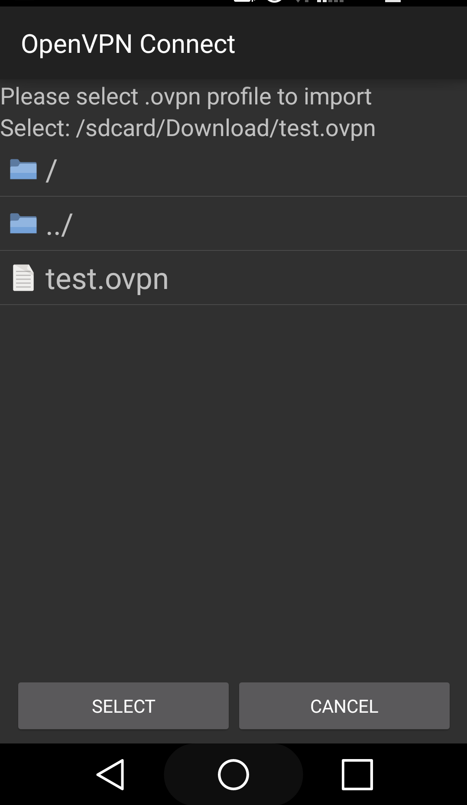

# Sanal Özel Ağ Sistemi (VPN) Kurulum
------

[TOC]

------

Bu dokümanda, Ahtapot bütünleşik güvenlik yönetim sisteminde kullanılan Sanal Özel Ağ sunucusunun kurulum ve kullanım prosedürü anlatılıyor.

###OpenVPN Kurulum İşlemleri

* **NOT:** Dökümanda yapılması istenilen değişiklikler gitlab arayüzü yerine terminal üzerinden yapılması durumunda playbook oynatılmadan önce yapılan değişiklikler git'e push edilmelidir.

```
$ cd /etc/ansible
git status komutu ile yapılan değişiklikler gözlemlenir.
$ git status  
$ git add --all
$ git commit -m "yapılan değişiklik commiti yazılır"
$ git push origin master
```

* OpenVPN Kurulumu sırasında, bağlantı tüneli açılacak iki sunucu arasında herhangi bir iletişimin bulunmaması sebebi ile, kurulum işlemlerinin el ile yapılması gerekmektedir.

* Pardus Temel ISO dosyasından Pardus kurulumu tamamlandıktan sonra sisteme “**ahtapotops**” kullanıcı ile giriş yapılır. ahtapotops kullanıcısının parolası “**LA123!!**” olarak öntanımlıdır.

**NOT**: Pardus Temel ISO dosyasından Pardus kurulumu adımları için “**AHTAPOT Pardus Temel ISO Kurulumu**” dokümanına bakınız.

* Sisteme giriş sağlandıktan sonra, aşağıdaki komut ile root kullanıcısına geçiş yapılır. root kullanıcısı için parola Temel ISO kurulumunda belirlenmiş paroladır.

```
$ sudo su -
```

* OpenVPN, SSL tabanlı bir sanal özel ağ çözümü olduğundan öncelikle CA sunucusunda gerekli sertifikaların oluşturulması gerekmektedir. Bunun için CA sunucusuna aşağıdaki komut ile “**easy-rsa**” paketi yüklenir.

```
# apt-get install -y easy-rsa
```

* Easy-rsa kurulumu tamamlandıktan sonra “**/etc**” dizini altına aşağıdaki komut ile “**easy-rsa**” dizini oluşturulur. 

```
# make-cadir /etc/easy-rsa
```

* İlgili dizin oluşturulduktan sonra OpenSSL konfigürasyon dosyası aşağıdaki şekilde linklenir.

```
# ln -s /etc/easy-rsa/openssl-1.0.0.cnf /etc/easy-rsa/openssl.cnf
```

* Easy-rsa için değişken dosyası tercih edilen metin düzenleyicisi ile açılır. Açılan dosya içerisinde “**KEY_COUNTRY**”  değişkenine ülke bilgisi, “**KEY_PROVINCE**” değişkenine il bilgisi, “**KEY_CITY**” değişkenine şehir bilgisi, “**KEY_ORG**” değişkenine organizasyon bilgisi, “**KEY_EMAIL**” değişkenine organizasyona ait geçerli eposta adres bilgisi, “**KEY_OU**” değişkenine organizasyona ait ilgili birim bilgisi ve “**KEY_NAME**” değişkenine makina bilgisi girilir.

```
# vi /etc/easy-rsa/vars
export KEY_COUNTRY="TR"
export KEY_PROVINCE="ist"
export KEY_CITY="istanbul"
export KEY_ORG="ULAKBIM"
export KEY_EMAIL="secops@ulakbim.com"
export KEY_OU="SecOps Team"
export KEY_NAME="server"
```

* Bir sonraki adım olarak anahtar klasörü oluşturulur. 

```
# cd /etc/easy-rsa && source ./vars
```	

* Daha önce anahtar klasörü oluşturmuş ve "**/etc/easy-rsa/keys**" dizini altında önceden oluşturulan keyler varsa  bu adım atlanarak sonraki adıma geçilmelidir, aksi halde içindeki /etc/easy-rsa/keys dizinindeki keyler silinecektir. İlk kez anahtar klasörü oluşturulduysa  aşağıdaki komut çalıştırılmalıdır. 

```
# ./clean-all
```	

* CA anahtarının oluşturulması için aşağıdaki komut ile gelen sorulara onay verilerek "**/etc/easy-rsa/keys/**" dizini altında "**ca.crt**" ve "**ca.key**" dosyaları oluşturulur.

```
# /etc/easy-rsa/build-ca
```

* Bir sonraki adımda aşağıdaki komut çalıştırılarak sunucu anahtarının oluşturulması ile kuruluma devam edilir. Gelen sorulara onay verilerek devam edilir.

```
# /etc/easy-rsa/build-key-server server
```
* Key oluşturma işleminden sonra “**/etc/easy-rsa/keys/**” dizini altında bulunan “**ca.crt**” dosyasının içeriği Gitlab arayüzünden MYS reposunda bulunan “**/roles/openvpn/templates/certificates**” altında “**New File**” seçeneği ile "**cacrt.j2**" dosyası oluşturulur ve kopyalanır. Daha sonra  aynı dizin içerisinde bulunan “**server.crt**” dosyasının içeriği Gitlab arayüzünde “**/roles/openvpn/templates/certificates**” altında "**openvpn.fqdn.cert.j2**" dosyası oluşturularak içerisine kopyalanır.
* Aşağıdaki komut çalıştırılarak client görevi görülecek sunucu için sertifika oluşturulur. Komutta “**client_adi**” yazan bölüme client olarak belirlenen makinanın adı yazılmalıdır.

```
# cd /etc/easy-rsa && source ./vars && ./build-key client_adi
```

* Belirlenen client için OVPN dosyası oluşturularak kuruluma devam edilir. “**/etc/easy-rsa/keys/sunucu_adi.ovpn**” dosyası metin düzenleyicisi ile açılarak “**remote**” satırında bulunan OpenVPN Server IP ve port bilgisi güncellenerek kaydedilir. Bu noktoda OVPN dosyasındaki “**proto**” satırındaki bağlantı protokolü bilgisinin sunucu konfigürasyon dosyasında ki ile aynı olması gerekmektedir. Aksi halde bağlantı sağlanamaz.

```
# vi /etc/easy-rsa/keys/sunucu_adi.ovpn
client
dev tun
proto udp
remote 192.168.1.201 1194 #OpenVPN Server ip ve port bilgisi
resolv-retry infinite
nobind
user nobody
group nogroup
persist-key
persist-tun
ns-cert-type server
comp-lzo
verb 3
auth-user-pass
auth-nocache
tls-version-min 1.2
tls-cipher TLS-DHE-RSA-WITH-AES-256-GCM-SHA384
remote-cert-tls server
auth SHA512
cipher AES-256-CBC
```

* OVPN dosyasının içeriğine kullanıcı anahtarlarını eklemek için aşağıdaki komutlar sırası ile çalıştırılmalıdır.

```
# echo '<ca>' >> /etc/easy-rsa/keys/sunucu_adi.ovpn
# cat /etc/easy-rsa/keys/ca.crt >> /etc/easy-rsa/keys/sunucu_adi.ovpn
# echo '</ca>' >> /etc/easy-rsa/keys/sunucu_adi.ovpn

# echo '<cert>' >> /etc/easy-rsa/keys/sunucu_adi.ovpn
# cat /etc/easy-rsa/keys/sunucu_adi.crt >> /etc/easy-rsa/keys/sunucu_adi.ovpn
# echo '</cert>' >> /etc/easy-rsa/keys/sunucu_adi.ovpn

# echo '<key>' >> /etc/easy-rsa/keys/sunucu_adi.ovpn
# cat /etc/easy-rsa/keys/sunucu_adi.key >> /etc/easy-rsa/keys/sunucu_adi.ovpn
# echo '</key>' >> /etc/easy-rsa/keys/sunucu_adi.ovpn
```
* Oluşturulan sunucu_adi.ovpn dosyası client makine içerisine kopyalanmalıdır. 
* Buradan sonraki işlemler OpenVPN Server için geçerlidir. OpenVPN rolünün çalışması istenen sunucular için GitLab arayüzünde  bulunan  “**/etc/ansible/hosts**” dosyasında ilgili sunucu "**[openvpn]**" satırı altına sunucunun tam ismi (FQDN) girilir.

```
[openvpn]
openvpn.gdys.local
```

* Gitlab arayüzünde "**/roles/openvpn/vars/openvpn.yml**" dosyasında bulunan değişkenleri düzenlemek üzere, "**service**" fonksiyonu altında bulunan "**name**" satırına "**openvpn@sunucuadi**" yazılır (domain bilgisinin yazılmasına gerek yoktur).
```
---
# Openvpn'in degiskenlerini iceren dosyadir
openvpn:
    default:
        source: "default-openvpn.j2"
        destination: "/etc/default/openvpn"
        owner: "root"
        group: "root"
        mode: "0644"
    service:
        name: "openvpn@server"
        state: "started"
        enabled: "yes"
    conf: 
        source: "server.conf.j2"
        destination: "/etc/openvpn/server.conf"
        owner: "root"
        group: "root"
        mode: "0644"
    ldapconf: 
        source: "auth-ldap.conf.j2"
        destination: "/etc/openvpn/auth-ldap.conf"
        owner: "root"
        group: "root"
        mode: "0644"
    cacrt:
        source: "certificates/cacrt.j2"
        destination: "/etc/openvpn/ca.crt"
        owner: "root"
        group: "root"
        mode: "0644"
    cert:
        source: "certificates"
        destination: "/etc/openvpn/server.crt"
        owner: "root"
        group: "root"
        mode: "0644"
    common_conf: 
        dev: "tun"
        ca: "/etc/openvpn/ca.crt" 
        cert: "/etc/openvpn/server.crt"
        key: "/etc/openvpn/server.key"
        dh: "/etc/openvpn/dh2048.pem"
        tls-version-min: "1.2" 
        user: "nobody"
        group: "nogroup"
        status: "/var/log/openvpn-status.log"
        log: "/var/log/openvpn.log"
        verb: "9"

```


* "**/etc/ansible/roles/openvpn/vars/openvpn.yml**" dosyası içerisinde "**openvpn_servers**" fonksiyonu altına openvpn makinelerinin bilgileri girilmelidir. "server01" fonksiyonu altında bulunan "**server**" satırına OpenVPN Server suncusuna bağlantı sağlayan client'lara atayacağı ip aralığı girilir. "dns_servers" satırı altında bulunan "**dns1**" ve "**dns2**" satırlarına ise kullanılanacak DNS bilgisi girilir. Openvpn, openldap veya active directory ile çalıştırılacaksa "**auth**" satırına "openldap , activedirectory , liderahenk , noldap" seçeneklerinden biri girilmelidir.
* Openvpn active directory veya ldap ile çalışacak ise, "**auth**" satırı altında bulunan ldap bilgileri düzenlenmelidir; "**Ldap**" satırına ldap makinesinin ipsi ve çalıştığı port bilgisi girilmelidir. Eğerki çalıştığı port 636 portu ise tls işleminin gerçekleşmesi için "ldaps://X.X.X.X:636" şeklinde girilmelidir. "**BindDN**" satırına ldap makinesinde yetkili kullanıcının dn bilgisi girilmelidir. "**Password**" satırına ise BindDN de belirtilen kullanıcının password bilgisi yazılmalıdır. "**BaseDN**" satırınada ldap makinesinin temel dn bilgisi yazılmalıdır. "**SearchFilter**" satırına ise openvpn makinesinin ldap içerisinde hangi kullanıcı grubunda arama yapacağı bilgisi girilmelidir.
 
```
openvpn_servers:
    server01:
        fqdn: "openvpn03.gdys.local"
        port: "1194"
        proto: "tcp"
        server: "10.8.0.0 255.255.255.0"
        dns_servers:
            dns01:
               ip: "8.8.8.8"
            dns02:
               ip: "8.8.4.4"
        auth: "noldap" # ( openldap , activedirectory , liderahenk , noldap )
        Ldap: "ldap://X.X.X.X:389"
        BindDN: "CN=administrator,DC=ULAKBIM,DC=local"  
        Password: "password"  
        FollowReferrals: "no"  
        TLSEnable: "no"  
        BaseDN: "DC=ULAKBIM,DC=local"  
        SearchFilter: "(sAMAccountName=%u)"  
        RequireGroup: "false"

```
* “**Ansible Playbookları**” dokümanında detaylı anlatımı bulunan, sunucu üzerinde gerekli sıkılaştırma işlemleri ve ansible kurulumu yapacak olan “**openvpn**” playbook’u çalıştırılır.


```
$ ansible-playbook playbooks/openvpn.yml
```

**NOT:** VPN sunucuya bağlanan clientların iletişim kurabilmesi için Güvenlik Duvarı üzerinde gelen trafiğin yönlendirilmesi için NAT kuralı yazılmalıdır.

###OpenVpn ile Bağlantı Sağlama

* Debian bir makine ile openvpn server'a bağlantı sağlamak için aşağıdaki gibi openvpn'in yüklenmesi gerekmektedir.

```
# sudo apt-get install openvpn
```
* Aşağıdaki komut çalıştırılarak client görevi görülecek sunucu için sertifika oluşturulur. Komutta “**client_adi**” yazan bölüme client olarak belirlenen makinanın adı yazılmalıdır.

```
# cd /etc/easy-rsa && source ./vars && ./build-key client_adi
```

* Belirlenen client için OVPN dosyası oluşturularak kuruluma devam edilir. “**/etc/easy-rsa/keys/sunucu_adi.ovpn**” dosyası metin düzenleyicisi ile açılarak “**remote**” satırında bulunan OpenVPN Server IP ve port bilgisi güncellenerek kaydedilir. Bu noktoda OVPN dosyasındaki “**proto**” satırındaki bağlantı protokolü bilgisinin sunucu konfigürasyon dosyasında ki ile aynı olması gerekmektedir. Aksi halde bağlantı sağlanamaz.

```
# vi /etc/easy-rsa/keys/sunucu_adi.ovpn
client
dev tun
proto udp
remote 192.168.1.201 1194 #OpenVPN Server ip ve port bilgisi
resolv-retry infinite
nobind
user nobody
group nogroup
persist-key
persist-tun
ns-cert-type server
comp-lzo
verb 3
auth-user-pass
auth-nocache
tls-version-min 1.2
tls-cipher TLS-DHE-RSA-WITH-AES-256-GCM-SHA384
remote-cert-tls server
auth SHA512
cipher AES-256-CBC
```

* OVPN dosyasının içeriğine kullanıcı anahtarlarını eklemek için aşağıdaki komutlar sırası ile çalıştırılmalıdır.

```
# echo '<ca>' >> /etc/easy-rsa/keys/sunucu_adi.ovpn
# cat /etc/easy-rsa/keys/ca.crt >> /etc/easy-rsa/keys/sunucu_adi.ovpn
# echo '</ca>' >> /etc/easy-rsa/keys/sunucu_adi.ovpn

# echo '<cert>' >> /etc/easy-rsa/keys/sunucu_adi.ovpn
# cat /etc/easy-rsa/keys/sunucu_adi.crt >> /etc/easy-rsa/keys/sunucu_adi.ovpn
# echo '</cert>' >> /etc/easy-rsa/keys/sunucu_adi.ovpn

# echo '<key>' >> /etc/easy-rsa/keys/sunucu_adi.ovpn
# cat /etc/easy-rsa/keys/sunucu_adi.key >> /etc/easy-rsa/keys/sunucu_adi.ovpn
# echo '</key>' >> /etc/easy-rsa/keys/sunucu_adi.ovpn
```
* Oluşturulan sunucu_adi.ovpn dosyası client makine içerisine kopyalanmalıdır.  

* openvpn kurulduktan sonra bağlantı sağlayacak kullanıcı için oluşturulan ovpn dosyası bağlantı sağlanacak makineye taşınır. Daha sonra aşağıdaki komut çalıştırılır.

```
# sudo openvpn --config ./kullanici01.ovpn
```

* Bağlantı gerçekletirilmiş olur.
* Cep telefonu üzerinde openvpn ile bağlantı sağlamak için openvpn bağlantısı gerçekleştirebilen bir program olamlıdır. (Aşağıdaki adımlar android bir telefon üzerinde OpenVPN Connect uygulaması ile gerçekleştirilmiştir.)
* Openvpn server'a bağlantı sağlanacak kullanıcı için oluşturulan ovpn dosyası cep telefonuna aktarılır. Daha sonra OpenVPN Connect uygulaması açılır. Ekranda bulunan "Menü" simgesine tıklanır ve "**Import**" seçeneği seçilir.

* Açılan yeni menüden **Import Profile from SD card** seçeneği seçilir. 

* Telefona indirilen ovpn dosyası seçilerek "SELECT" seçeneğine tıklanır. Daha sonra "Connect" seçeneği tıklanarak openvpn suncuya bağlantı sağlanmış olunur.

###IPsec StrongSwan Kurulum İşlemleri

* Kurulum öncesinde aralarında bağlantı sağlanacak ipsec vpn sunucularının iç ve dış bacaklarına ait ip/subnet bilgileri kesinleştirilmelidir.

* CA Sunucusu üzerinde IPsec için kök sertifika oluşturulmalıdır. Bunun için aşağıdaki gibi öncelikle gerekli strongswan paketleri kurulur.

```
# apt-get install -y strongswan strongswan-pki
```

* İlgili paketler kurulduktan sonra, sertifika oluşturulur. Config dosyası adımında aynı bilgilerin kullanılması koşulu ile “**"C=TR, O=ULAKBIM, CN=ULAKBIM CA"**” bölümüne kuruma uygun bilgiler girilir.

```
# ipsec pki --gen --outform pem > /etc/ipsec.d/private/caKey.pem
# ipsec pki --self --in /etc/ipsec.d/private/caKey.pem --dn "C=TR, O=ULAKBIM, CN=ULAKBIM CA" --ca --outform pem > /etc/ipsec.d/cacerts/caCert.pem
```

* İlk kurulumda vpn sunucuların biribiri ile iletişimi olmadığından IPsec kurulumu elle yapılmalıdır. IPsec için gerekli paketlerin kurulumunu yapmak için aşağıdaki komut her iki VPN sunucusu üzerinde de çalıştırılmalıdır.

```
# apt-get install strongswan strongswan-pki strongswan-charon strongswan-libcharon strongswan-starter libstrongswan libstrongswan-extra-plugins libstrongswan-standard-plugins libcharon-extra-plugins
```

* Ilk vpn sunususu üzerinde kendisi için gerekli public ve private key aşağıdaki gibi oluşturulur. 

**NOT**: Örnekte ipsec01.gdys.local olarak belirtilen sunucu adı yerine sanal ağ yapısı sağlanacak sunucusunun FQDN bilgisi girilmelidir.

```
# ipsec pki --gen --outform pem > /etc/ipsec.d/private/ipsec01.gdys.localKey.pem
# ipsec pki --pub  --in /etc/ipsec.d/private/ipsec01.gdys.localKey.pem  --outform pem > ipsec01.gdys.localPub.pem
```

* İkinci vpn sunucusu üzerinde kendisi için gerekli public ve private key aşağıdaki gibi oluşturulur.

**NOT**: Örnekte ipsec02.gdys.local olarak belirtilen sunucu adı yerine sanal ağ yapısı sağlanacak sunucusunun FQDN bilgisi girilmelidir.

```
# ipsec pki --gen --outform pem > /etc/ipsec.d/private/ipsec02.gdys.localKey.pem
# ipsec pki --pub  --in /etc/ipsec.d/private/ipsec02.gdys.localKey.pem  --outform pem > ipsec02.gdys.localPub.pem
```
* ipsec01.gdys.localPub.pem ve ipsec02.gdys.localPub.pem dosyası CA Sunucusuna uygun yollarla taşınıp imzalanır. Bu komutta ki "**--dn "C=TR, O=ULAKBIM, CN=firewall0?.gdys.local"**" parametresi önemlidir ipsec.conf da bu bilgi kullanılacaktır. CA Sunucusunda ipsec01.gdys.local ve ipsec02.gdys.local için aşağıdaki komutlar çalıştırılmalıdır.
* ipsec01.gdys.local için:

```
# ipsec pki --issue --in /etc/ipsec.d/ipsec01.gdys.localPub.pem --cacert /etc/ipsec.d/cacerts/caCert.pem --cakey /etc/ipsec.d/private/caKey.pem --dn "C=TR, O=ULAKBIM, CN=ipsec01.gdys.local" --outform pem > /etc/ipsec.d/certs/ipsec01.gdys.localCert.pem
```
* ipsec02.gdys.local için:

```
# ipsec pki --issue --in /etc/ipsec.d/ipsec02.gdys.localPub.pem --cacert /etc/ipsec.d/cacerts/caCert.pem --cakey /etc/ipsec.d/private/caKey.pem --dn "C=TR, O=ULAKBIM, CN=ipsec02.gdys.local" --outform pem > /etc/ipsec.d/certs/ipsec02.gdys.localCert.pem
```

* CA sunucusunda imzalama işlemi tamamlandıktan sonra caCert.pem ve ipsec0?.gdys.localCert.pem dosyaları ilgili vpn sunucularına uygun yollarla taşınır. Taşınacak dosyaların ipsec01.gdys.local ve ipsec02.gdys.local için olması gereken konumları aşağıdaki gibidir.
* ipsec01.gdys.local için:

```
/etc/ipsec.d/private/ipsec01.gdys.localKey.pem # VPN sunucusu üzerinde oluşturulan Anahtar
/etc/ipsec.d/certs/ipsec01.gdys.localCert.pem # CA dan imzalanıp gelen Sertifika
/etc/ipsec.d/cacerts/caCert.pem #CA nin Sertifikası
```

* ipsec02.gdys.local için:

```
/etc/ipsec.d/private/ipsec02.gdys.localKey.pem # VPN sunucusu üzerinde oluşturulan Anahtar
/etc/ipsec.d/certs/ipsec02.gdys.localCert.pem # CA dan imzalanıp gelen Sertifika
/etc/ipsec.d/cacert:wqs/caCert.pem #CA nin Sertifikası
```

* Her iki vpn sunucusundaki ipsec.secrets dosyası ayrı ayrı düzenlenmelidir. "**: RSA**" satırına her makinede kendi FQDN bilgisi girilmelidir. İçerikleri aşağıdaki gibi olmalıdır.
* ipsec01.gdys.local için:

```
# cat /etc/ipsec.secrets
: RSA ipsec01.gdys.localKey.pem 
#include /var/lib/strongswan/ipsec.secrets.inc
```
* ipsec02.gdys.local için:
```
# cat /etc/ipsec.secrets 
: RSA ipsec02.gdys.localKey.pem 
#include /var/lib/strongswan/ipsec.secrets.inc
```

* Her iki vpn sunucusunda /etc/ dizini altında bulunan **strongswan.conf**  dosyası düzenlenmelidir. strongswan.conf dosyasının içeriği içerikleri aşağıdaki gibi olmalıdır.
**NOT**: strongswan.conf dosyası düzenlenirken DNS bilgilerinin girilmesi opsiyonel bir seçenek olup, girilmemsi durumunda ilgili satır başına "**#**" işareti konularak yorum satırı haline getirilebilir ya da satır tamamen silinebilir.
```
cat /etc/strongswan.conf

# strongswan.conf - strongSwan configuration file
#
# Refer to the strongswan.conf(5) manpage for details
#
# Configuration changes should be made in the included files

charon {
        load_modular = yes
        filelog {
        /var/log/charon.log {
            time_format = %b %e %T
            append = no
            default = 1
            flush_line = yes
        }
    }    
        duplicheck.enable = no
        compress = yes
        plugins {
                include strongswan.d/charon/*.conf
        }
        dns1 = 8.8.8.8
        dns2 = 8.8.4.4
        nbns1 = 8.8.8.8
        nbns2 = 8.8.4.4
}
```

* ipsec01.gdys.local için /etc/ dizini altında bulunan "**ipsec.conf**" dosyasının içeiriği aşağıdaki gibi olmalı fakat bilgiler düzenlenmelidir. "**conn ipsec01.gdys.local-ipsec02.gdys.local**" satırına ilk önce ipsec01 in yani ipsec.conf'un düzenlendiği makinenin FQDN bilgisi ve bağlantı sağlayacağı makinenin FQDN bilgisi girilmelidir. Bu satırın altında bulunan "**left**" satırına ipsec01 makinesinin FQDN bilgisi yazılır. "**leftsubnet**" satırına ipsec01 in subnet bilgisi girilmelidir. "**leftcert**" satırına cert dosya adı bilgisi ve "**leftid**" satırına CA sunucusunda ipsec01 makinesinin public key' ini imzalama işlemi gerçekleştirirken ki id bilgileri yazılmalıdır. "**right**" satırına ipsec02 makinesinin bağlantı sağlayacağı ipsec02 makinesinin FQDN bilgisi, "**rightsubnet**" satırına ipsec02 makinesinin subnet bilgisi girilmelidir. "**rightid**" satırına CA sunucusunda ipsec02 makinesinin public key' i imzalama işleminde girilen id bilgileri girilmelidir.
```
# cat /etc/ipsec.conf 
config setup
conn %default
    ikelifetime=60m
    keylife=20m
    rekeymargin=3m
    keyingtries=1
    #authby=secret
    keyexchange=ikev2
    ike=aes256-sha512-modp4096!
    esp=aes256-sha512-modp4096!
    mobike=no

conn ipsec01.gdys.local-ipsec02.gdys.local
    left=ipsec01.gdys.local
    leftsubnet=172.16.16.0/24
    leftcert=ipsec01.gdys.localCert.pem
    leftid="C=TR, O=ULAKBIM, CN=ipsec01.gdys.local"
    leftfirewall=yes
    right=ipsec02.gdys.local
    rightsubnet=172.16.14.0/24
    rightid="C=TR, O=ULAKBIM, CN=ipsec02.gdys.local"
    auto=add
```

* ipsec02.gdys.local için /etc/ dizi altında bulunan "**ipsec.conf**" dosyası aşağıdaki gibi olmalıdır fakat bilgiler düzenlenmelidir. "**conn ipsec02.gdys.local-ipsec01.gdys.local**" satırına ilk önce ipsec02 in yani ipsec.conf'un düzenlendiği makinenin FQDN bilgisi ve bağlantı sağlayacağı makinenin FQDN bilgisi girilmelidir. Bu satırın altında bulunan "**left**" satırına ipsec02 makinesinin FQDN bilgisi yazılır. "**leftsubnet**" satırına ipsec02' nin subnet bilgisi girilmelidir. "**leftcert**" satırına cert dosya adı bilgisi ve "**leftid**" satırına CA sunucusunda ipsec02 makinesinin public key' ini imzalama işlemi gerçekleştirirken ki id bilgileri yazılmalıdır. "**right**" satırına ipsec01 makinesinin bağlantı sağlayacağı ipsec01 makinesinin FQDN bilgisi, "**rightsubnet**" satırına ipsec01 makinesinin subnet bilgisi girilmelidir. "**rightid**" satırına CA sunucusunda ipsec01 makinesinin public key' i imzalama işleminde girilen id bilgileri girilmelidir.
```
# cat /etc/ipsec.conf 
config setup
conn %default
    ikelifetime=60m
    keylife=20m
    rekeymargin=3m
    keyingtries=1
    #authby=secret
    keyexchange=ikev2
    ike=aes256-sha512-modp4096!
    esp=aes256-sha512-modp4096!
    mobike=no

conn ipsec02.gdys.local-ipsec01.gdys.local
    left=ipsec02.gdys.local
    leftsubnet=172.16.14.0/24
    leftcert=ipsec02.gdys.localCert.pem
    leftid="C=TR, O=ULAKBIM, CN=ipsec02.gdys.local"
    leftfirewall=yes
    right=ipsec01.gdys.local
    rightsubnet=172.16.16.0/24
    rightid="C=TR, O=ULAKBIM, CN=ipsec01.gdys.local"
    auto=start
```
* Her iki vpn sunucusu üzerinde strongswan servisi açılışta çalışmaması için aşağıdaki komut ile kapatılır. Bu işlem yapılandırma tamamlanmadan bağlantı sağlanmasını engellemek üzere kapatılmaktadır.

```
# /bin/systemctl disable strongswan
```
**NOT:** VPN sunucuya bağlanan clientların iletişim kurabilmesi için Güvenlik Duvarı üzerinde gelen trafiğin yönlendirilmesi için NAT kuralı yazılmalıdır.

* Sistemler yedekli ve VPN yapısı Firewall'lar üzerine kurulmuş ve Firewall Builder üzerinden yönetiliyor ise ; FirewallBuilder arayüzünden VPN kurulumu yapılan Güvenlik duvarlarının “**Firewall Settings**” bölümüne gidilerek epilog/prolog sekmesi açılır. “**The following commands will be added verbatim on top of generated configuration**” başlığı altında bulunan keepalived yapılandırmasının üst kısmında aşağıda bulunan strongswan servislerini kontrol edecek betik eklenir.

```
# bash install.sh

"PATH="/usr/local/sbin:/usr/local/bin:/usr/sbin:/usr/bin:/sbin:/bin"
/bin/systemctl disable strongswan
echo '#!/bin/bash

TYPE=$1
NAME=$2
STATE=$3

case $STATE in
"MASTER") ipsec restart
exit 0
;;
"BACKUP") ipsec stop
exit 0
;;
"FAULT") ipsec stop
exit 0
;;
*) echo "unknown state"
exit 1
;;
esac' | sudo tee /usr/local/sbin/notify-keepalived.sh > /dev/null
```

* Sistemler Firewallardan bağımsız ayrı sunucular üzerine yedekli kuruluyor ise, "**/etc/keepalived/keepalived.conf" dosyaları içerisine aşağıdaki betik yazılır. Betikte "**xx.xx.xx.xx/xx**" olarak belirtilen bölüme iki ipsec sunucusunun sanal olarak ortak kullanacağı IP ve Subnet bilgisi yazılmalıdır. (ÖRN. 10.10.10.10/24)
```
vrrp_sync_group G1 {
group {
E1
}
notify_master "/usr/sbin/ipsec start"
notify_backup "/usr/sbin/ipsec stop"
notify_fault  "/usr/sbin/ipsec stop"
}
vrrp_instance E1 {
interface eth0 state BACKUP
virtual_router_id 61
priority 200
advert_int 1
authentication {
auth_type PASS
auth_pass 1q2w3e
}
virtual_ipaddress {
xx.xx.xx.xx/xx dev eth0
}
nopreempt
}
```

* Her iki vpn suncusu üzerinde aşağıdaki komut çalıştırılarak ipsec servisi başlatılıp bağlantı oluşturulur.

```
# ipsec start
```

* İletişim başladıktan sonra sistemin MYS ile yönetilebilmesi için oluşturulan "**sunucuadilocalKey.pem**", "**sunucuadilocalCert.pem**", "**caCert.pem**" ve "**/etc/ipsec.conf**" dosyaları Gitlab arayüzünde bulunan MYS reposunda “**/roles/ipsec/templates/**” altında “**New File**” seçeneği seçilerek teker teker kopyalanır. Kopyalanan her dosyanın ismi “**dosya_adı.j2**” olarak belirtilmesi zaruridir. (Örnek sunucuadilocalKey.pem.j2)

* IPsec durumunu kontrol etmek için aşağıdaki komut ile loglara bakılabilir. 

```
# tail -f /var/log/charon.log
```

* IPsec durumunu kontrol etmek için aşağıdaki komut ile servis durumuna bakılabilir. Çıktısına ait örnek de aşağıdaki gibidir.

```
# ipsec statusall
Status of IKE charon daemon (strongSwan 5.2.1, Linux 3.16.0-4-amd64, x86_64):
  uptime: 30 minutes, since Apr 04 16:33:09 2016
  malloc: sbrk 2846720, mmap 0, used 761088, free 2085632
  worker threads: 11 of 16 idle, 5/0/0/0 working, job queue: 0/0/0/0, scheduled: 4
  loaded plugins: charon test-vectors ldap pkcs11 aes rc2 sha1 sha2 md5 random nonce x509 revocation constraints pubkey pkcs1 pkcs7 pkcs8 pkcs12 pgp dnskey sshkey pem openssl gcrypt af-alg fips-prf gmp agent xcbc cmac hmac ctr ccm gcm curl attr kernel-netlink resolve socket-default farp stroke updown eap-identity eap-aka eap-md5 eap-gtc eap-mschapv2 eap-radius eap-tls eap-ttls eap-tnc xauth-generic xauth-eap xauth-pam tnc-tnccs dhcp lookip error-notify certexpire led addrblock unity
Listening IP addresses:
  10.0.7.204
  172.16.15.10
Connections:
ipsec01.gdys.local-ipsec02.ahtapot.local:  ipsec02.ahtapot.local...ipsec01.gdys.local  IKEv2
ipsec01.gdys.local-ipsec02.ahtapot.local:   local:  [C=TR, O=ULAKBIM, CN=ipsec02.gdys.local] uses public key authentication
ipsec01.gdys.local-ipsec02.ahtapot.local:    cert:  "C=TR, O=ULAKBIM, CN=ipsec02.gdys.local"
ipsec01.gdys.local-ipsec02.ahtapot.local:   remote: [C=TR, O=ULAKBIM, CN=ipsec01.gdys.local] uses public key authentication
ipsec01.gdys.local-ipsec02.ahtapot.local:   child:  172.16.15.0/24 === 172.16.16.0/24 TUNNEL
Security Associations (1 up, 0 connecting):
ipsec01.gdys.local-ipsec02.ahtapot.local[1]: ESTABLISHED 30 minutes ago, 10.0.7.204[C=TR, O=ULAKBIM, CN=ipsec02.gdys.local]...94.101.82.52[C=TR, O=ULAKBIM, CN=ipsec01.gdys.local]
ipsec01.gdys.local-ipsec02.ahtapot.local[1]: IKEv2 SPIs: 47f8debd96659e27_i* eb6004a5161fd955_r, public key reauthentication in 21 minutes
ipsec01.gdys.local-ipsec02.ahtapot.local[1]: IKE proposal: AES_CBC_256/HMAC_SHA2_512_256/PRF_HMAC_SHA2_512/MODP_4096
ipsec01.gdys.local-ipsec02.ahtapot.local{1}:  INSTALLED, TUNNEL, ESP in UDP SPIs: c548196f_i cfd626eb_o
ipsec01.gdys.local-ipsec02.ahtapot.local{1}:  AES_CBC_256/HMAC_SHA2_512_256, 0 bytes_i, 208 bytes_o (4 pkts, 33s ago), rekeying in 13 minutes
ipsec01.gdys.local-ipsec02.ahtapot.local{1}:   172.16.15.0/24 === 172.16.16.0/24
```

* IPsec üzerinde yüklü sertifikaları görüntülemek için aşağıdaki komut çalıştırılmalıdır. Bu komuta ait örnek çıktı da aşağıdaki gibidir.

```
# ipsec listall
List of X.509 End Entity Certificates:

  subject:  "C=TR, O=ULAKBIM, CN=ipsec02.gdys.local"
  issuer:   "C=TR, O=ULAKBIM, CN=ULAKBIM CA"
  serial:    63:4f:7d:df:30:cf:2f:2f
  validity:  not before Mar 21 18:09:40 2016, ok
             not after  Mar 21 18:09:40 2019, ok
  pubkey:    RSA 2048 bits, has private key
  keyid:     ab:98:de:28:17:c1:f6:f0:c4:47:df:c7:31:c9:58:88:d9:1e:7d:d8
  subjkey:   88:00:b7:49:1a:48:ad:ae:94:3e:e3:7a:62:a8:76:e4:52:82:b8:e3
  authkey:   08:ea:71:02:ee:9c:cf:f3:ec:f1:d5:a1:73:37:e6:61:b4:f5:b5:b4

  subject:  "C=TR, O=ULAKBIM, CN=ipsec01.gdys.local"
  issuer:   "C=TR, O=ULAKBIM, CN=ULAKBIM CA"
  serial:    59:fb:b9:7d:ce:90:67:93
  validity:  not before Mar 21 18:09:24 2016, ok
             not after  Mar 21 18:09:24 2019, ok
  pubkey:    RSA 2048 bits
  keyid:     c2:38:b7:51:c3:a8:72:0c:93:51:0a:3b:54:b2:85:ac:80:cd:92:43
  subjkey:   44:3f:28:df:7e:42:70:ff:e1:24:36:3e:86:6d:5a:cf:fd:53:64:c4
  authkey:   08:ea:71:02:ee:9c:cf:f3:ec:f1:d5:a1:73:37:e6:61:b4:f5:b5:b4

List of X.509 CA Certificates:

  subject:  "C=TR, O=ULAKBIM, CN=ULAKBIM CA"
  issuer:   "C=TR, O=ULAKBIM, CN=ULAKBIM CA"
  serial:    3b:95:04:1f:d1:66:e0:d7
  validity:  not before Mar 21 18:09:17 2016, ok
             not after  Mar 21 18:09:17 2019, ok
  pubkey:    RSA 2048 bits
  keyid:     e9:5f:a2:1e:23:54:01:47:a0:07:ac:f5:18:13:d9:9e:de:74:c3:1a
  subjkey:   08:ea:71:02:ee:9c:cf:f3:ec:f1:d5:a1:73:37:e6:61:b4:f5:b5:b4
```

* IPsec’e ait yönlendirme bilgisini görmek için de aşağıdaki komut çalıştırılabilir.

```
# ip route list table 220 
```

**NOT**: IPsec’in çalışabilmesi için firewall’dan IKE UDP/500, Authentication Header AH Proto 51, Encapsulating Security Payload ESP Proto 50, NAT traversal UDP/4500 için kural girilmesi gerekmektedir. 

* IPsec sunucuları ve bağlı clientları arasında iletişim koptuğu durumlarda, servislerin otomatik olarak tekrar başlatılması için IPsec ve sunucuları ve clientlar üzerinde "**check_ipsec.sh**" isimli betikler oluşturularak Crontab'a eklenmelidir.
* IPsec Sunucular üzerinde kullanılcak betik aşağıdaki gibidir.

```
#!/bin/sh

check=$(/usr/sbin/ipsec status |egrep -c ESTABLISHED)
number=$(egrep '^conn' /etc/ipsec.conf | egrep -v '%default' | wc -l)

if (($check < $number )); then

   /usr/sbin/ipsec restart

fi

exit

```

* Client üzerinde kullanılcak betik aşağıdaki gibidir.
```
#!/bin/sh

if
   /usr/sbin/ipsec status |grep ESTABLISHED  > /dev/null; then
exit

else
   /usr/sbin/ipsec restart
fi

```
* Oluşturlan betikleri Sunucu ve Clientlar üzerinde crontab'a eklenir.

```
*/5 * * * * /bin/bash /scripts/check_ipsec.sh
```

**Sayfanın PDF versiyonuna erişmek için [buraya](vpn-kurulum.pdf) tıklayınız.**
